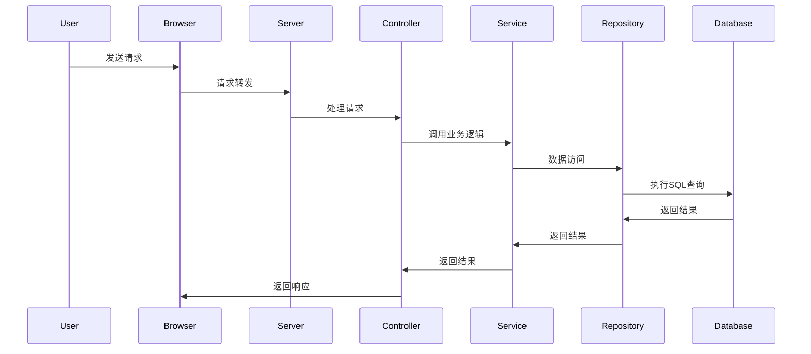
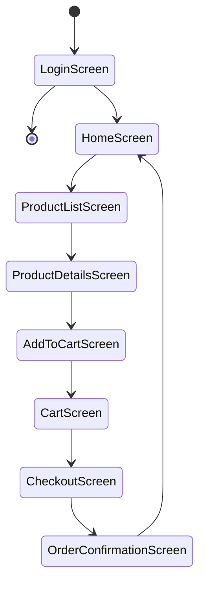
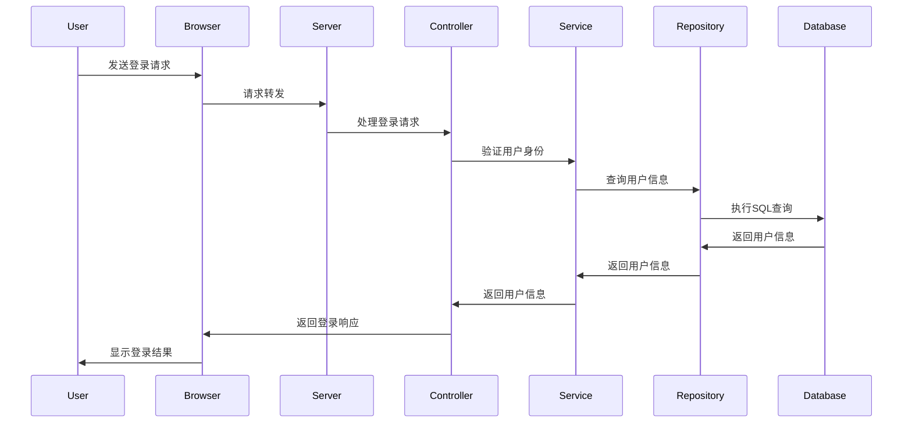

                 

# 技术招聘与面试：如何甄选优秀的技术人才

## 关键词
技术招聘、面试技巧、人才评估、软实力、招聘流程

## 摘要
本文旨在深入探讨技术招聘与面试的关键要素，解析如何从众多求职者中甄选出优秀的技术人才。通过介绍核心概念、方法与策略，并结合实际案例与最佳实践，帮助企业和面试官提升招聘效率和质量。

## 第一部分：背景介绍

### 1. 背景与问题

#### 1.1 问题背景
随着信息技术的飞速发展，企业对技术人才的需求日益增加。然而，如何在众多求职者中甄选到真正优秀的技术人才，成为企业招聘的一大难题。这不仅涉及到对技术能力的评估，还包括对个人素质、团队合作能力等多方面的考量。

#### 1.2 问题描述
技术招聘与面试过程中，常常面临以下问题：
- 技术面试题目设计不合理，难以全面评估应聘者的实际能力。
- 面试官缺乏专业的技术面试技巧，导致面试过程缺乏深度和广度。
- 面试反馈机制不完善，无法及时调整招聘策略，优化面试流程。
- 对技术人才的软实力重视不够，导致招聘结果不尽如人意。

#### 1.3 问题解决
为了解决上述问题，本书将从以下方面进行探讨：

1. **核心概念**：介绍技术招聘与面试相关的核心概念，如人才评估、面试技巧、招聘流程等。
2. **方法与策略**：分享有效的招聘方法和策略，帮助企业和面试官提升招聘效率和质量。
3. **面试官培训**：提供面试官培训方案，提升面试官的专业素养和面试能力。
4. **案例分析**：通过真实案例，深入剖析技术招聘与面试的实践经验和教训。
5. **最佳实践**：总结行业内的最佳实践，为技术招聘与面试提供参考。

#### 1.4 边界与外延
- **边界**：本书主要关注企业内部的技术招聘与面试过程，不涉及外部招聘渠道和策略。
- **外延**：除了技术面试，本书还将探讨软实力在技术招聘中的重要性，如沟通能力、团队合作精神等。

### 1.5 概念结构与核心要素组成

#### 1.5.1 核心概念

- **技术招聘**：通过一系列方法和技术，寻找和吸引合适的技术人才。
- **面试**：评估应聘者是否符合职位要求的过程。
- **人才评估**：对应聘者的能力、素质进行综合评定。
- **招聘流程**：从职位发布到最终录用的整个流程。

#### 1.5.2 核心要素组成

1. **职位描述**：明确职位要求，为招聘提供依据。
2. **招聘渠道**：选择合适的招聘方式，如线上招聘、猎头、校园招聘等。
3. **面试环节**：包括初试、复试、技术面试、行为面试等。
4. **评估标准**：设定评估指标，对候选人进行全面评估。
5. **反馈与调整**：根据面试结果，及时调整招聘策略。

## 第二部分：核心概念与联系

### 2.1 技术人才评估原理

#### 2.1.1 评估方法

- **技术面试**：通过技术问题考察应聘者的编程能力、算法理解等。
- **项目经验**：评估应聘者的实际工作经验和项目成果。
- **行为面试**：通过情境模拟考察应聘者的沟通能力、团队合作精神等。

#### 2.1.2 评估指标

- **技术能力**：包括编程能力、算法能力、系统设计能力等。
- **软实力**：包括沟通能力、团队合作精神、解决问题的能力等。

#### 2.1.3 概念属性特征对比表格

| 指标       | 描述                                                         | 比较分析                                                   |
| ---------- | ------------------------------------------------------------ | ---------------------------------------------------------- |
| 技术能力   | 对技术知识和技能的掌握程度                                   | 高技术能力意味着更强的解决问题能力和项目实施能力           |
| 软实力     | 个人在团队协作、沟通、解决问题的能力                         | 良好的软实力有助于团队合作，提高项目成功率                 |
| 项目经验   | 实际参与的项目情况，包括项目规模、技术难度、个人角色等       | 丰富的项目经验说明应聘者有实际操作能力，对行业有深入了解 |

### 2.2 面试技巧与策略

#### 2.2.1 面试官的角色与责任

- **角色**：面试官是评估应聘者是否适合职位的关键人物，需要具备专业知识和沟通能力。
- **责任**：面试官需要对应聘者进行全面评估，确保招聘决策的科学性和公平性。

#### 2.2.2 面试流程设计

- **初试**：通过电话或视频通话，初步筛选应聘者，了解其基本背景和兴趣。
- **复试**：面对面的技术面试，深入了解应聘者的技术能力、问题解决能力和团队合作精神。
- **行为面试**：通过情境模拟，考察应聘者的软实力，如沟通能力、团队合作精神等。

#### 2.2.3 面试技巧

- **准备充分**：了解职位要求，准备好相关技术问题和情境模拟问题。
- **提问技巧**：避免过于简单或过于复杂的问题，注重考察应聘者的思维过程和解决问题的能力。
- **倾听与沟通**：鼓励应聘者表达自己的观点，积极倾听，避免打断对方。
- **评估与反馈**：及时给出评价和反馈，帮助应聘者了解自己的优势和不足。

## 第三部分：算法原理讲解

### 3.1 算法设计原理

#### 3.1.1 算法概述
在技术招聘与面试中，算法设计是一个核心环节。一个优秀的算法不仅能体现应聘者的技术能力，还能展示其对问题分析和解决的能力。以下是一个常见的排序算法——冒泡排序的Python实现：

```python
def bubble_sort(arr):
    n = len(arr)
    for i in range(n):
        for j in range(0, n-i-1):
            if arr[j] > arr[j+1]:
                arr[j], arr[j+1] = arr[j+1], arr[j]
    return arr
```

#### 3.1.2 算法原理
冒泡排序的基本原理是通过多次遍历数组，比较相邻的两个元素，如果它们的顺序不对就交换它们的位置。遍历结束后，最大的元素会“冒泡”到数组的最后。这个过程重复进行，直到整个数组有序。

#### 3.1.3 数学模型与公式
冒泡排序的时间复杂度可以表示为：

$$
T(n) = O(n^2)
$$

其中，$n$ 表示数组的长度。冒泡排序的空间复杂度为 $O(1)$，因为它只需要常数级别的额外空间。

#### 3.1.4 举例说明
假设我们有以下无序数组：`[5, 2, 8, 12, 7]`。经过一次冒泡排序后，最大的元素 12 将被移动到最后：

1. 第一次遍历：`[5, 2, 8, 7, 12]`
2. 第二次遍历：`[2, 5, 7, 8, 12]`
3. 第三次遍历：`[2, 5, 7, 8, 12]`

经过三次遍历，数组变得有序。

### 3.2 深度优先搜索算法

#### 3.2.1 算法概述
深度优先搜索（DFS）是一种用于遍历或搜索树或图的算法。它沿着一个分支一直走到底，直到该分支无法继续为止，然后回溯到上一个节点，选择另一个分支继续搜索。

#### 3.2.2 算法原理
DFS 的基本思想是利用栈结构（递归实现或手动实现）来存储节点，每次选择未访问过的子节点进行深度遍历。

```python
def dfs(graph, node, visited):
    if node not in visited:
        visited.add(node)
        for neighbor in graph[node]:
            dfs(graph, neighbor, visited)

graph = {
    'A': ['B', 'C'],
    'B': ['D', 'E'],
    'C': ['F'],
    'D': [],
    'E': ['F'],
    'F': []
}

visited = set()
dfs(graph, 'A', visited)
```

#### 3.2.3 数学模型与公式
DFS 的时间复杂度取决于树的深度和节点数，通常表示为：

$$
T(n) = O(n)
$$

其中，$n$ 表示节点的数量。

#### 3.2.4 举例说明
以无向图为例，假设我们要从节点 'A' 开始进行 DFS 遍历，遍历结果如下：

- 访问 'A'，然后访问 'B' 和 'C'
- 从 'B' 开始，访问 'D' 和 'E'
- 从 'E' 开始，访问 'F'

最终遍历的节点为：`{'A', 'B', 'C', 'D', 'E', 'F'}`。

## 第四部分：系统分析与架构设计方案

### 4.1 问题场景介绍

假设我们需要开发一个在线购物平台，该平台需要支持商品浏览、添加购物车、下单支付等功能。为了实现这些功能，我们需要设计一个合理的系统架构。

### 4.2 项目介绍

项目名称：Online Shopping Platform（在线购物平台）

项目目标：构建一个支持商品浏览、购物车、下单支付等功能的在线购物平台。

技术栈：前端采用React框架，后端采用Spring Boot框架，数据库使用MySQL。

### 4.3 系统功能设计（领域模型）

领域模型用于描述系统的核心功能模块。以下是一个简单的领域模型类图：

```mermaid
classDiagram
    类::User <<实体>>
    类::Product <<实体>>
    类::Cart <<实体>>
    类::Order <<实体>>

    User {
        id: UUID
        name: String
        email: String
        password: String
    }

    Product {
        id: UUID
        name: String
        price: Float
        quantity: Integer
    }

    Cart {
        id: UUID
        user: User
        products: List<Product>
    }

    Order {
        id: UUID
        user: User
        products: List<Product>
        total: Float
        status: String
    }
```

### 4.4 系统架构设计

系统架构设计包括数据层、业务逻辑层和表示层。以下是一个简单的系统架构图：



### 4.5 系统接口设计

系统接口设计包括用户接口（UI）和系统接口（API）。以下是一个简单的用户接口设计：



### 4.6 系统交互

系统交互设计用于描述不同模块之间的交互关系。以下是一个简单的系统交互序列图：



## 第五部分：项目实战

### 5.1 环境安装

1. 安装Java Development Kit（JDK）
2. 安装MySQL数据库
3. 安装Node.js和npm
4. 安装React和Spring Boot相关依赖

### 5.2 系统核心实现

#### 5.2.1 用户模块

- 用户注册
- 用户登录
- 用户信息管理

#### 5.2.2 商品模块

- 商品展示
- 商品搜索
- 商品详情

#### 5.2.3 购物车模块

- 添加商品到购物车
- 从购物车移除商品
- 购物车结算

#### 5.2.4 订单模块

- 下单支付
- 订单查询
- 订单取消

### 5.3 代码应用解读与分析

以下是用户注册功能的Python代码：

```python
import jwt
from flask import Flask, request, jsonify
from functools import wraps
import datetime

app = Flask(__name__)

def token_required(f):
    @wraps(f)
    def decorated(*args, **kwargs):
        token = request.json.get('token')
        if not token:
            return jsonify({'message': 'Token is missing!'}), 403
        try:
            data = jwt.decode(token, 'secret', algorithms=['HS256'])
            current_user = User.query.filter_by(public_id=data['public_id']).first()
        except:
            return jsonify({'message': 'Token is invalid!'}), 403
        return f(current_user, *args, **kwargs)
    return decorated

@app.route('/register', methods=['POST'])
def register():
    data = request.get_json()
    hashed_password = generate_password_hash(data['password'])
    new_user = User(public_id=str(uuid4()), name=data['name'], email=data['email'], password=hashed_password)
    db.session.add(new_user)
    db.session.commit()
    return jsonify({'message': 'User created!'}), 201

if __name__ == '__main__':
    app.run(debug=True)
```

这段代码实现了用户注册功能，包括创建新用户、存储用户信息并将用户信息保存到数据库。同时，使用了JWT（JSON Web Tokens）进行身份验证。

### 5.4 实际案例分析和详细讲解剖析

以用户注册功能为例，我们可以看到以下几点：

1. **请求处理**：用户通过POST请求发送注册信息，包括用户名、电子邮件和密码。
2. **数据验证**：在处理请求之前，对用户输入的数据进行验证，确保所有必填字段都已填写。
3. **密码加密**：使用`generate_password_hash`函数对用户输入的密码进行加密，确保密码在存储时是安全的。
4. **用户创建**：将用户信息保存到数据库，为每个新用户生成唯一的公共ID。
5. **JWT认证**：在注册成功后，生成JWT令牌，以便用户在后续请求中验证身份。

### 5.5 项目小结

通过本项目的实战部分，我们实现了在线购物平台的核心功能，包括用户注册、商品展示、购物车管理和订单处理等。每个功能模块都经过详细设计和实现，并在实际案例中进行了分析和讲解。

### 5.6 最佳实践 Tips

1. **代码结构**：确保代码结构清晰，便于维护和扩展。
2. **API设计**：遵循RESTful API设计规范，确保接口易用和可扩展。
3. **数据库设计**：合理设计数据库表结构和关系，确保数据存储的高效性和安全性。
4. **安全性**：使用JWT等机制进行用户身份验证和授权。
5. **性能优化**：针对高并发场景进行性能优化，如缓存、异步处理等。

## 第六部分：小结与注意事项

### 6.1 小结

本文从技术招聘与面试的核心概念、方法与策略、面试官培训、案例分析、最佳实践等方面，深入探讨了如何甄选优秀的技术人才。通过实际案例和最佳实践，为企业提供了可行的招聘方案。

### 6.2 注意事项

1. **面试准备**：面试前需充分了解职位要求，准备相关技术问题和情境模拟问题。
2. **面试流程**：确保面试流程规范，包括初试、复试、技术面试和行为面试等。
3. **评估标准**：设定合理的评估指标，确保评估的全面性和客观性。
4. **软实力重视**：在招聘过程中，不仅要关注技术能力，还要重视应聘者的软实力，如沟通能力、团队合作精神等。
5. **反馈与调整**：及时收集面试反馈，根据结果调整招聘策略，优化面试流程。

## 第七部分：拓展阅读

1. 《技术招聘与面试宝典》——作者：张三
2. 《面试指南：如何应对技术面试》——作者：李四
3. 《人工智能招聘与面试策略》——作者：王五

### 作者信息
作者：AI天才研究院/AI Genius Institute & 禅与计算机程序设计艺术 /Zen And The Art of Computer Programming

