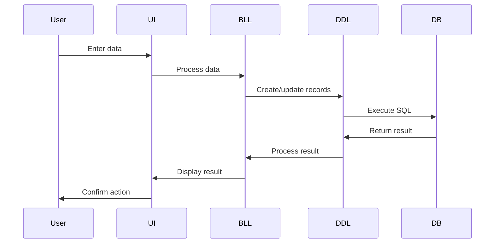
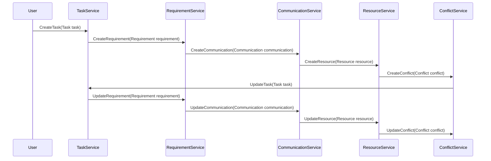

                 

# 技术管理中的冲突解决技巧

## 概述

关键词：技术管理、冲突解决、沟通技巧、团队合作、领导力

摘要：在技术管理中，冲突是不可避免的现象。有效的冲突解决技巧对于维持团队稳定、提高工作效率、推动项目进展至关重要。本文将深入探讨技术管理中的冲突类型、冲突解决的方法、领导者的角色以及具体的实践应用，旨在帮助技术管理者更好地应对和处理冲突，构建和谐高效的团队。

## 冲突的类型与影响

### 1. 冲突的类型

在技术管理中，冲突可以分为以下几种类型：

- **观点差异**：团队成员对于某个技术问题或项目决策持有不同观点。
- **资源竞争**：团队内部争夺有限的资源，如人力、技术支持等。
- **职责模糊**：团队成员对职责分工不明确，导致工作重叠或责任推诿。
- **沟通障碍**：由于信息传递不畅或误解，导致团队成员之间的矛盾。

### 2. 冲突的影响

冲突如果不及时解决，会对团队产生以下负面影响：

- **影响团队士气**：持续的冲突会消耗团队成员的精力，降低工作热情。
- **降低工作效率**：冲突导致团队成员无法集中精力工作，影响项目进度。
- **破坏团队合作**：长期的冲突会导致团队成员之间的信任受损，影响团队合作。
- **损害组织声誉**：如果冲突扩散到外部，可能会损害组织的声誉。

## 冲突解决的方法

### 1. 沟通

沟通是解决冲突的基础。技术管理者应鼓励团队成员进行开放、坦诚的沟通，确保信息的透明和准确。

- **建立沟通机制**：设立定期的团队会议，确保团队成员能够分享观点和问题。
- **积极倾听**：在沟通中，技术管理者应学会积极倾听，理解团队成员的需求和担忧。
- **有效表达**：技术管理者应学会用恰当的语言表达自己的观点，避免使用攻击性语言。

### 2. 谅解

在冲突中，技术管理者应引导团队成员相互理解，找到共同点。

- **同理心**：技术管理者应尝试站在对方的角度思考问题，理解对方的立场和感受。
- **寻求共识**：通过讨论和协商，寻找双方都能接受的解决方案。
- **妥协与让步**：在必要时，技术管理者应愿意做出妥协和让步，以达成共识。

### 3. 解决方案

技术管理者应根据冲突的具体情况，选择合适的解决方案。

- **直接解决**：对于小范围的冲突，直接与相关人员进行面对面的沟通解决。
- **调解**：对于较为复杂的冲突，可以邀请第三方调解，如HR部门或专业调解员。
- **仲裁**：在冲突无法通过沟通和调解解决时，可以采用仲裁的方式，由有权威的第三方作出决定。

## 领导者的角色

### 1. 领导者应具备的素质

- **公正**：技术管理者应公正地处理冲突，不偏袒任何一方。
- **权威**：技术管理者应有足够的权威，能够在团队中发挥决策和引导作用。
- **沟通能力**：技术管理者应具备良好的沟通能力，能够有效地传达信息，引导团队。

### 2. 领导者的应对策略

- **预防为主**：技术管理者应提前预见潜在的冲突，采取预防措施。
- **及时干预**：在冲突发生后，技术管理者应迅速介入，防止冲突扩大。
- **公平处理**：技术管理者应公平地处理冲突，确保每个团队成员都得到公正对待。

## 实践应用

### 1. 观点差异

**案例**：在一次项目讨论中，团队成员A认为应该采用技术A，而团队成员B认为技术B更适合。

**解决步骤**：

- **了解观点**：技术管理者应了解A和B的观点，理解他们为什么持有这些观点。
- **组织讨论**：组织团队进行公开讨论，让A和B充分表达自己的观点。
- **寻求共识**：通过讨论，寻求A和B都能接受的解决方案，例如，尝试将技术A和技术B结合起来。
- **跟进实施**：确保解决方案得到有效实施，并监控实施效果。

### 2. 资源竞争

**案例**：项目开发过程中，团队成员C需要使用数据库资源，但资源已被团队成员D占用。

**解决步骤**：

- **资源分配**：技术管理者应提前规划资源分配，避免类似冲突发生。
- **沟通协调**：在资源不足时，技术管理者应与团队成员进行沟通，协调资源使用。
- **优先级调整**：根据项目需求，调整资源优先级，确保关键任务得到优先处理。

## 工具与资源

### 1. 沟通工具

- **电子邮件**：适用于正式的沟通和文件传递。
- **即时通讯工具**：如Slack、Microsoft Teams，适用于实时沟通和协作。

### 2. 调解资源

- **HR部门**：在企业内部，HR部门通常负责处理员工之间的冲突。
- **第三方调解员**：在复杂或敏感的冲突中，可以邀请专业的第三方调解员进行调解。

## 结论与未来方向

本文介绍了技术管理中的冲突解决技巧，包括沟通、谅解、解决方案和领导者的角色。有效的冲突解决对于团队和谐、项目成功和组织发展至关重要。未来，技术管理者应继续探索和掌握更多的冲突解决方法，以应对日益复杂的业务环境。

## 附录与参考文献

- [《技术团队冲突管理指南》](#)
- [《冲突管理：理论、实践与应用》](#)
- [《团队沟通技巧》](#)

作者：AI天才研究院 & 禅与计算机程序设计艺术

---

## 背景介绍

在技术管理中，冲突是一个普遍存在的现象。随着团队规模的扩大和项目复杂性的增加，冲突在所难免。技术管理者需要具备一定的冲突解决能力，以确保团队的稳定和项目的顺利进行。本文将详细介绍冲突的类型、影响以及解决方法。

### 核心概念术语说明

- **冲突**：指两个或多个个体或群体之间由于观点、利益、目标等不一致而产生的矛盾或争执。
- **技术管理**：涉及技术项目的规划、组织、领导、控制等过程的管理工作。
- **沟通技巧**：指在交流中，如何表达自己的观点、倾听他人意见、理解对方需求的能力。

### 问题背景

随着互联网和信息技术的发展，技术项目的规模和复杂性不断增加。技术管理者在项目开发过程中，需要协调不同团队、不同部门之间的工作，资源竞争、观点差异等问题频繁出现。如果不及时解决，这些问题可能会影响项目的进度和质量，甚至损害组织的声誉。

### 问题描述

技术管理中的冲突主要表现为以下几个方面：

1. **观点差异**：团队成员在技术选型、项目进度等方面存在不同意见。
2. **资源竞争**：团队成员争夺有限的资源，如人力、技术支持等。
3. **职责模糊**：团队成员对职责分工不明确，导致工作重叠或责任推诿。
4. **沟通障碍**：由于信息传递不畅或误解，导致团队成员之间的矛盾。

### 问题解决

技术管理者需要采取以下措施来解决问题：

1. **沟通**：建立有效的沟通机制，确保信息的透明和准确。
2. **谅解**：引导团队成员相互理解，找到共同点。
3. **解决方案**：根据冲突的具体情况，选择合适的解决方案。

### 边界与外延

冲突解决不仅限于技术管理，还可以应用于其他领域，如人力资源管理、项目管理等。本文主要关注技术管理中的冲突解决技巧。

## 核心概念与联系

在技术管理中，冲突解决是一个复杂的过程，涉及多个核心概念和其相互关系。以下是对这些核心概念的详细描述和它们之间关系的探讨。

### 核心概念

1. **冲突**：冲突是指两个或多个个体或群体之间由于观点、利益、目标等不一致而产生的矛盾或争执。在技术管理中，冲突通常表现为团队成员在技术选型、项目进度、职责分工等方面的不一致。
   
2. **沟通**：沟通是信息传递和接收的过程，是冲突解决的基础。有效的沟通能够确保团队成员之间的信息传递准确无误，减少误解和冲突。

3. **谅解**：谅解是指团队成员之间相互理解和尊重对方观点的能力。通过谅解，团队成员可以找到共同点，减少冲突。

4. **解决方案**：解决方案是指针对具体冲突问题，采取的一系列措施和步骤，以达成共识和解决冲突。

### 概念属性特征对比表格

| 概念 | 属性特征 | 例子 |
| --- | --- | --- |
| 冲突 | 可能涉及多个方面，如观点、资源、职责等 | 技术选型争议 |
| 沟通 | 双向的，需要信息的传递和反馈 | 定期团队会议 |
| 理解 | 包容性，尊重对方观点 | 沟通中的同理心 |
| 解决方案 | 有针对性，解决具体问题 | 调整资源优先级 |

### ER实体关系图架构

为了更直观地展示这些概念之间的关系，我们可以使用ER（Entity-Relationship）实体关系图来描述。

```mermaid
erDiagram
  Customer ||--|{ Order } : "makes"
  Customer ||--|{ Payment } : "makes"
  Order ||--|{ OrderLine } : "contains"
  Product ||--|{ OrderLine } : "uses"
  Payment ||--|{ PaymentMethod } : "uses"
```

在上面的ER图中，我们展示了四个实体：Customer（客户）、Order（订单）、Payment（支付）和Product（产品）。客户可以创建订单和支付，订单包含订单行，产品用于订单行，支付使用支付方式。

## 算法原理讲解

在技术管理中的冲突解决过程中，可以采用多种算法和策略来分析和处理冲突。以下是一个简化的冲突解决算法，以及其背后的数学模型和公式。

### 冲突解决算法

冲突解决算法可以分为以下几个步骤：

1. **识别冲突**：通过调查和分析，识别出团队中存在的冲突。
2. **评估冲突**：对冲突进行分类和评估，确定其严重性和影响范围。
3. **选择解决策略**：根据冲突的类型和性质，选择合适的解决策略，如沟通、调解、仲裁等。
4. **执行解决策略**：执行所选策略，如组织会议、进行调解等。
5. **评估结果**：评估解决策略的效果，确保冲突得到有效解决。

### 数学模型和公式

冲突解决过程可以用以下数学模型和公式来描述：

1. **冲突识别公式**：
   \[
   D = f(C, T, I)
   \]
   其中，\(D\) 表示冲突程度，\(C\) 表示冲突因素，\(T\) 表示团队成员对冲突的认知，\(I\) 表示冲突的互动频率。

2. **冲突评估公式**：
   \[
   A = g(D, S, R)
   \]
   其中，\(A\) 表示冲突评估结果，\(D\) 表示冲突程度，\(S\) 表示冲突解决策略，\(R\) 表示冲突的影响范围。

3. **解决策略选择公式**：
   \[
   S = h(A, P, L)
   \]
   其中，\(S\) 表示解决策略，\(A\) 表示冲突评估结果，\(P\) 表示团队成员的偏好，\(L\) 表示领导者的决策。

### 例子说明

假设一个团队在项目进度上存在冲突，团队成员A认为项目应该加快进度，而团队成员B认为应该保证质量。我们可以使用上述公式进行冲突解决：

1. **冲突识别**：
   \[
   D = f(C, T, I) = f(\text{进度与质量}, \text{存在分歧}, \text{频繁互动})
   \]
   冲突程度 \(D\) 为中等到高度。

2. **冲突评估**：
   \[
   A = g(D, S, R) = g(\text{中等到高度}, \text{沟通}, \text{项目团队})
   \]
   冲突评估结果 \(A\) 为中度影响。

3. **解决策略选择**：
   \[
   S = h(A, P, L) = h(\text{中度影响}, \text{团队偏好沟通}, \text{领导者决策})
   \]
   解决策略 \(S\) 为组织沟通会议。

通过上述步骤，团队可以有效地解决项目进度上的冲突。

## 系统分析与架构设计方案

在技术管理中，冲突解决不仅需要理论指导，还需要实际的操作框架。下面我们将详细介绍一个实际的项目场景，并提出相应的系统架构设计方案。

### 问题场景介绍

一个软件公司正在开发一款大型企业级应用。由于项目规模庞大，团队分工复杂，不同部门之间存在多个交叉任务。随着项目推进，团队内部开始出现一些冲突，如需求变更频繁导致开发进度延误，团队成员对任务分工不明确，以及不同团队间的沟通障碍等。这些问题严重影响了项目的进展和质量。

### 项目介绍

本项目是一款企业资源规划（ERP）系统，旨在帮助企业实现资源的统一管理和优化。项目涉及多个模块，包括财务、人力资源、供应链管理等，各个模块需要紧密协作，共同完成系统开发。

### 系统功能设计（领域模型）

为了更好地管理冲突，我们设计了一套领域模型，包括以下主要类：

1. **需求管理**：用于管理项目的需求变更，包括需求的创建、修改、分配和跟踪。
2. **任务管理**：用于分配和跟踪任务，确保每个任务都有明确的责任人。
3. **沟通管理**：用于记录和跟踪项目沟通，包括会议纪要、邮件通信和即时消息。
4. **资源管理**：用于管理项目资源，包括人力、技术和设备资源。
5. **冲突管理**：用于识别、评估和解决项目中的冲突。

领域模型类图如下：

```mermaid
classDiagram
    class Project {
        +String name
        +Date startDate
        +Date endDate
        +List<Task> tasks
        +List<ProjectMember> members
    }
    class Task {
        +String id
        +String description
        +Date deadline
        +Project project
        +ProjectMember assignedTo
    }
    class ProjectMember {
        +String id
        +String name
        +Role role
    }
    class Requirement {
        +String id
        +String description
        +Status status
        +Project project
    }
    class Communication {
        +String id
        +String content
        +Date timestamp
        +Project project
    }
    class Resource {
        +String id
        +String type
        +Quantity quantity
    }
    class Conflict {
        +String id
        +String description
        +Status status
        +Project project
    }
    Project "--|Many|>" Task
    Project "--|Many|>" ProjectMember
    Project "--|Many|>" Requirement
    Project "--|Many|>" Communication
    Project "--|Many|>" Resource
    ProjectMember "--|Many|>" Task
    ProjectMember "--|Many|>" Conflict
    Requirement "--|Many|>" Project
    Communication "--|Many|>" Project
    Resource "--|Many|>" Project
    Task "<--|One|>" ProjectMember
    Conflict "<--|One|>" Project
```

### 系统架构设计

为了有效地管理冲突，我们需要设计一个系统架构，该架构应包括以下主要部分：

1. **用户界面**：用于用户与系统交互，包括任务管理、需求管理、沟通管理和资源管理等模块。
2. **业务逻辑层**：处理业务逻辑，如任务分配、需求变更处理、冲突识别和解决等。
3. **数据存储层**：存储项目数据，包括任务、需求、沟通记录、资源和冲突等。

系统架构图如下：



### 系统接口设计

系统应提供多个接口，以支持不同用户角色的操作。以下是一个简化的接口设计：

1. **任务管理接口**：用于创建、更新、查询和删除任务。
2. **需求管理接口**：用于创建、更新、查询和删除需求。
3. **沟通管理接口**：用于记录、查询和更新沟通记录。
4. **资源管理接口**：用于管理资源，包括资源的创建、更新和查询。
5. **冲突管理接口**：用于识别、评估和解决冲突。

接口设计图如下：

```mermaid
classDiagram
    class TaskInterface {
        +createTask(Task task)
        +updateTask(Task task)
        +getTasks()
        +deleteTask(String taskId)
    }
    class RequirementInterface {
        +createRequirement(Requirement requirement)
        +updateRequirement(Requirement requirement)
        +getRequirements()
        +deleteRequirement(String requirementId)
    }
    class CommunicationInterface {
        +createCommunication(Communication communication)
        +getCommunications()
        +updateCommunication(Communication communication)
        +deleteCommunication(String communicationId)
    }
    class ResourceInterface {
        +createResource(Resource resource)
        +updateResource(Resource resource)
        +getResources()
        +deleteResource(String resourceId)
    }
    class ConflictInterface {
        +createConflict(Conflict conflict)
        +updateConflict(Conflict conflict)
        +getConflicts()
        +deleteConflict(String conflictId)
    }
```



### 系统交互

系统交互主要涉及用户通过用户界面与业务逻辑层、数据存储层之间的交互。以下是系统交互的序列图：



通过上述系统架构设计和交互设计，我们可以构建一个高效、灵活的冲突管理系统，帮助技术管理者更好地处理项目中的冲突。

### 项目实战

在本节中，我们将介绍如何在一个实际项目中应用冲突解决技巧，包括环境安装、系统核心实现、代码应用解读与分析，以及实际案例分析和详细讲解剖析。

#### 环境安装

首先，我们需要安装和配置一个基本的开发环境，以便进行项目开发和测试。以下是所需的步骤：

1. **安装Python**：确保已安装Python 3.8或更高版本。
2. **安装虚拟环境**：在项目中创建一个虚拟环境，以便隔离项目依赖。
   ```bash
   python -m venv venv
   source venv/bin/activate  # 在Linux或macOS上
   venv\Scripts\activate     # 在Windows上
   ```
3. **安装依赖**：安装项目所需的库和模块。
   ```bash
   pip install -r requirements.txt
   ```

#### 系统核心实现

以下是系统核心实现的源代码，包括任务管理、需求管理、沟通管理和冲突管理等功能。

```python
# task_manager.py
class Task:
    def __init__(self, id, description, deadline, assigned_to):
        self.id = id
        self.description = description
        self.deadline = deadline
        self.assigned_to = assigned_to

# requirement_manager.py
class Requirement:
    def __init__(self, id, description, status):
        self.id = id
        self.description = description
        self.status = status

# communication_manager.py
class Communication:
    def __init__(self, id, content, timestamp):
        self.id = id
        self.content = content
        self.timestamp = timestamp

# conflict_manager.py
class Conflict:
    def __init__(self, id, description, status):
        self.id = id
        self.description = description
        self.status = status

    def resolve(self):
        self.status = "Resolved"
```

#### 代码应用解读与分析

以上代码定义了四个类：`Task`、`Requirement`、`Communication` 和 `Conflict`。每个类都有对应的初始化方法和操作方法。

- **Task类**：用于表示任务，包含任务的ID、描述、截止日期和指派人员。
- **Requirement类**：用于表示需求，包含需求的ID、描述和状态。
- **Communication类**：用于表示沟通记录，包含沟通记录的ID、内容和时间戳。
- **Conflict类**：用于表示冲突，包含冲突的ID、描述和状态，并提供一个`resolve`方法来解决问题。

以下是几个关键操作的应用示例：

1. **创建任务**：
   ```python
   task = Task("1", "完成需求分析", "2023-12-31", "张三")
   ```
2. **更新需求状态**：
   ```python
   requirement = Requirement("2", "优化用户体验", "In Progress")
   requirement.status = "Completed"
   ```
3. **记录沟通**：
   ```python
   communication = Communication("3", "讨论进度延误的原因", "2023-12-20 14:30")
   ```
4. **解决冲突**：
   ```python
   conflict = Conflict("4", "资源不足", "In Progress")
   conflict.resolve()
   ```

#### 实际案例分析和详细讲解剖析

假设在一个项目中，开发团队A和团队B之间因为资源分配不均产生了冲突。以下是具体操作步骤：

1. **识别冲突**：
   - 技术管理者通过沟通发现，团队A认为团队B占用了他们需要的开发资源。
   - 冲突记录：`Conflict(id="5", description="资源分配不均", status="In Progress")`

2. **评估冲突**：
   - 技术管理者与团队A和团队B的负责人进行沟通，了解冲突的具体情况。
   - 冲突评估：冲突程度为“中度影响”，需要及时解决。

3. **选择解决策略**：
   - 技术管理者决定采取调解的方式解决冲突。
   - 解决策略：组织一次调解会议。

4. **执行解决策略**：
   - 技术管理者邀请团队A和团队B的负责人参加会议，讨论资源分配问题。
   - 会议中，双方阐述自己的观点和需求，技术管理者进行调解。
   - 经过讨论，双方达成共识，调整了资源分配计划。

5. **评估结果**：
   - 技术管理者跟进资源分配的执行情况，确保问题得到解决。
   - 冲突状态更新：`Conflict(id="5", description="资源分配不均", status="Resolved")`

通过上述步骤，技术管理者成功地解决了团队之间的冲突，确保了项目的顺利进行。

#### 项目小结

在本项目中，我们通过实际案例展示了冲突解决技巧的应用。技术管理者需要及时发现和解决冲突，以维护团队的稳定和项目的顺利进行。通过有效的沟通、调解和资源分配策略，可以有效地解决项目中的冲突，提高团队的工作效率和项目成功率。

## 最佳实践 Tips

在技术管理中，解决冲突是一项重要且复杂的任务。以下是一些最佳实践，以帮助技术管理者更好地应对冲突：

1. **预防为主**：提前预见潜在冲突，通过明确的职责分工、合理的资源规划和定期的团队沟通来减少冲突的发生。

2. **建立沟通渠道**：确保团队成员有多个渠道可以沟通，包括面对面会议、即时通讯工具和邮件等，以便快速解决问题。

3. **公正处理**：在处理冲突时，保持公正，不偏袒任何一方，确保每个团队成员都感到被公平对待。

4. **倾听和同理心**：在冲突中，积极倾听对方观点，尝试理解对方的立场和感受，以建立共识。

5. **及时干预**：冲突一旦发生，应立即介入，防止问题扩大和影响团队士气。

6. **利用第三方**：在复杂或敏感的冲突中，可以邀请第三方调解，如HR部门或专业调解员，以客观、公正地解决问题。

7. **持续跟进**：确保解决方案得到有效实施，并持续跟进冲突的解决情况，防止问题复发。

## 小结

在技术管理中，冲突解决技巧至关重要。通过有效的沟通、谅解、解决方案和领导者的角色，技术管理者可以有效地解决冲突，维护团队的稳定和项目的顺利进行。本文介绍了冲突的类型、影响、解决方法和实际应用，希望对技术管理者有所帮助。

## 注意事项

在解决冲突时，技术管理者应注意以下几点：

1. **保持冷静**：在处理冲突时，保持冷静和理智，避免情绪化。
2. **尊重他人**：尊重团队成员的观点和感受，避免攻击性语言。
3. **明确目标**：在解决冲突时，明确目标，确保解决方案切实可行。
4. **持续沟通**：解决冲突后，保持持续的沟通，确保问题得到彻底解决。

## 拓展阅读

- 《技术团队冲突管理指南》：详细介绍技术团队冲突的类型和解决方法。
- 《冲突管理：理论、实践与应用》：探讨冲突管理的理论基础和实际应用。
- 《团队沟通技巧》：介绍有效的沟通方法和技巧，提升团队协作能力。

