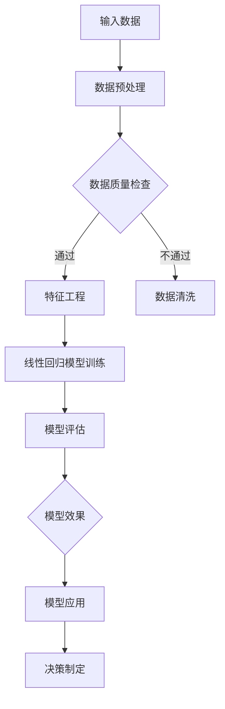
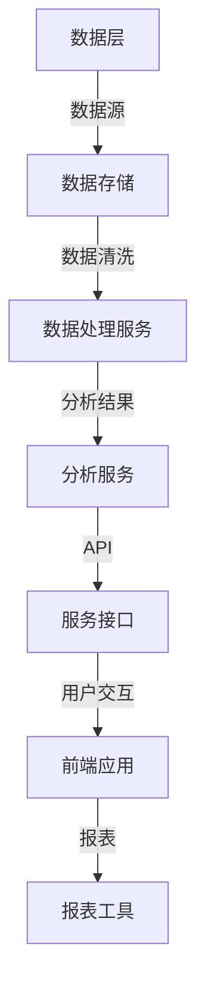
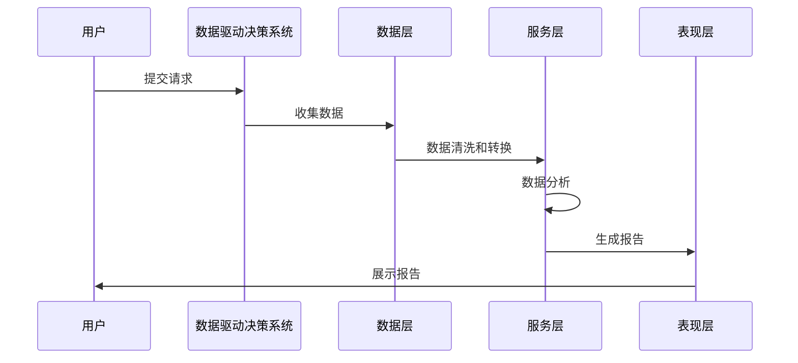

                 


## 技术管理中的数据驱动决策

关键词：数据驱动决策、技术管理、数据分析、战略规划、组织文化建设

摘要：本文探讨了数据驱动决策在技术管理中的应用，从背景介绍、核心概念、数据分析流程、战略规划、组织文化建设、案例研究和未来展望七个方面进行深入分析。通过逐步分析推理，本文旨在为技术管理者提供实践指导和理论支持，以提升数据驱动决策的能力。

### 目录

----------------------------------------------------------------

# 《技术管理中的数据驱动决策》

## 关键词

数据驱动决策、技术管理、数据分析、战略规划、组织文化建设

## 摘要

本文深入探讨了数据驱动决策在技术管理中的应用。通过逐步分析推理，本文从背景介绍、核心概念、数据分析流程、战略规划、组织文化建设、案例研究和未来展望七个方面进行了详细阐述。本文旨在为技术管理者提供实践指导和理论支持，以提升数据驱动决策的能力。

### 第一部分：背景介绍

#### 第1章：问题背景

##### 1.1 问题定义

技术管理中的数据驱动决策是指通过收集、分析和利用数据来制定和执行决策的过程。它是一种基于数据而不是个人经验或主观判断的决策方法。

##### 1.2 数据驱动决策的重要性

数据驱动决策具有以下几个重要性：

1. 提高决策准确性：通过数据分析和建模，技术管理者可以更准确地预测未来趋势和潜在风险，从而做出更明智的决策。
2. 提高决策效率：数据驱动决策可以减少冗余的讨论和决策过程，缩短决策时间。
3. 提高决策一致性：数据驱动决策可以确保决策的一致性和可重复性。

##### 1.3 数据驱动决策的应用场景

数据驱动决策可以应用于多种场景，包括：

1. 项目管理：通过数据分析，技术管理者可以更准确地预测项目进度和成本，优化资源分配。
2. 产品开发：通过数据分析，产品经理可以了解用户需求和行为，优化产品功能和设计。
3. 运营管理：通过数据分析，运营团队可以识别问题和优化运营流程。

##### 1.4 数据驱动决策的挑战

数据驱动决策也面临一些挑战，包括：

1. 数据质量：数据驱动决策依赖于高质量的数据。如果数据存在错误或不完整，决策结果可能会受到影响。
2. 数据分析能力：技术管理者需要具备一定的数据分析能力，才能有效地利用数据进行决策。
3. 数据隐私和安全：在利用数据时，技术管理者需要确保数据的安全和隐私。

#### 第2章：数据驱动决策的核心概念

##### 2.1 数据分析基础

数据分析是数据驱动决策的基础。它包括数据收集、数据清洗、数据探索性分析、数据建模等步骤。

##### 2.2 统计学原理与数据建模

统计学原理和数据建模是数据驱动的关键。它们帮助技术管理者理解数据的本质，进行有效的数据分析和预测。

##### 2.3 数据驱动的决策框架

数据驱动的决策框架是一个系统化的过程，包括数据收集、数据分析、决策制定、决策执行和决策评估等步骤。

##### 2.4 数据科学工具与平台

数据科学工具与平台为数据驱动决策提供了技术支持。常见的工具包括Python、R、SQL等，平台包括Hadoop、Spark等。

#### 第3章：数据分析流程

##### 3.1 数据收集与预处理

数据收集与预处理是数据分析的第一步。它包括数据采集、数据清洗和数据格式化。

##### 3.2 数据探索性分析

数据探索性分析是对数据进行初步分析和可视化，以发现数据中的模式和趋势。

##### 3.3 特征工程

特征工程是对数据进行处理和转换，以提取有用的特征，提高模型性能。

##### 3.4 模型选择与训练

模型选择与训练是数据分析的核心。技术管理者需要选择合适的模型，并进行训练和优化。

##### 3.5 模型评估与优化

模型评估与优化是确保数据驱动决策有效性的关键。技术管理者需要评估模型的性能，并进行优化和改进。

#### 第4章：数据驱动的战略规划

##### 4.1 数据驱动的市场策略

数据驱动的市场策略是基于数据分析来制定市场策略，以提升市场竞争力。

##### 4.2 数据驱动的产品开发

数据驱动的产品开发是基于用户数据和需求来优化产品功能和设计。

##### 4.3 数据驱动的运营管理

数据驱动的运营管理是基于数据分析来优化运营流程和提升运营效率。

#### 第5章：数据驱动组织文化建设

##### 5.1 数据文化的构建

数据文化的构建是确保数据驱动决策成功的关键。它包括数据意识的培养、数据技能的提升和数据工具的普及。

##### 5.2 数据驱动的团队协作

数据驱动的团队协作是基于数据共享和协作，以提升团队效率和决策质量。

##### 5.3 数据驱动的人才培养

数据驱动的人才培养是确保组织具备数据驱动能力的关键。它包括数据技能的培训和职业发展的规划。

#### 第6章：数据驱动决策的案例研究

##### 6.1 案例一：电商行业的个性化推荐

电商行业的个性化推荐是数据驱动决策的一个典型应用案例。

##### 6.2 案例二：制造业的质量监控

制造业的质量监控是数据驱动决策在工业领域的应用。

##### 6.3 案例三：金融行业的信用评估

金融行业的信用评估是数据驱动决策在金融领域的应用。

##### 6.4 案例四：医疗健康的数据分析

医疗健康的数据分析是数据驱动决策在医疗领域的应用。

#### 第7章：未来展望与趋势

##### 7.1 数据驱动决策的未来发展

数据驱动决策的未来发展将受到新技术和新兴应用场景的驱动。

##### 7.2 技术趋势与新兴挑战

数据驱动决策将面临新的技术趋势和挑战，如数据隐私、数据安全等。

##### 7.3 数据驱动决策的最佳实践

数据驱动决策的最佳实践将有助于技术管理者提升决策能力和效率。

## 结论

数据驱动决策在技术管理中具有重要意义。通过数据驱动决策，技术管理者可以更好地理解业务、优化流程、提升效率。本文从背景介绍、核心概念、数据分析流程、战略规划、组织文化建设、案例研究和未来展望七个方面进行了深入分析，旨在为技术管理者提供实践指导和理论支持。未来，随着新技术的发展和应用场景的拓展，数据驱动决策将在技术管理中发挥更加重要的作用。

### 作者

作者：AI天才研究院/AI Genius Institute & 禅与计算机程序设计艺术 /Zen And The Art of Computer Programming

----------------------------------------------------------------

### 第一部分：背景介绍

#### 第1章：问题背景

##### 1.1 问题定义

在技术管理中，数据驱动决策是一种通过数据分析和建模来制定和执行决策的方法。它强调以数据为基础，而不是仅仅依赖于个人的经验和直觉。数据驱动决策旨在通过数据来揭示潜在的趋势、问题和机会，从而帮助技术管理者做出更明智、更准确的决策。

##### 1.2 数据驱动决策的重要性

数据驱动决策在技术管理中的重要性体现在以下几个方面：

1. **提高决策准确性**：通过收集和分析大量的数据，技术管理者可以更全面地了解业务环境和市场趋势，从而做出更准确的预测和决策。
2. **提高决策效率**：数据驱动决策可以减少决策过程中的讨论和争议，缩短决策时间，提高决策效率。
3. **提高决策一致性**：数据驱动决策确保了决策过程的标准化和可重复性，减少了因个人主观判断导致的决策偏差。
4. **支持战略规划**：数据驱动决策可以为技术管理者提供有力的数据支持，帮助他们制定和实施更有效的战略规划。

##### 1.3 数据驱动决策的应用场景

数据驱动决策可以应用于技术管理的多个领域，包括：

1. **项目管理**：通过数据分析，技术管理者可以更准确地预测项目进度、成本和质量，从而优化项目管理和资源分配。
2. **产品开发**：通过用户行为数据和市场趋势分析，产品经理可以更好地了解用户需求，优化产品功能和设计，提高市场竞争力。
3. **运营管理**：通过数据分析，运营团队可以识别运营过程中的问题和瓶颈，优化运营流程，提高运营效率。

##### 1.4 数据驱动决策的挑战

尽管数据驱动决策具有诸多优势，但其在实际应用中仍面临一些挑战：

1. **数据质量**：数据驱动决策依赖于高质量的数据。如果数据存在错误、遗漏或不一致，决策结果可能会受到严重影响。
2. **数据分析能力**：技术管理者需要具备一定的数据分析能力和工具使用技能，才能有效地利用数据进行决策。
3. **数据隐私和安全**：在收集和使用数据时，技术管理者需要确保数据的安全和隐私，遵守相关法律法规。

#### 第2章：数据驱动决策的核心概念

##### 2.1 数据分析基础

数据分析是数据驱动决策的基础。它涉及一系列的步骤和方法，包括数据收集、数据清洗、数据探索性分析、数据建模和预测等。

1. **数据收集**：数据收集是数据分析的第一步。技术管理者需要确定数据来源，并收集相关的数据。
2. **数据清洗**：数据清洗是数据处理的重要环节。它包括数据去重、填补缺失值、纠正错误等，以提高数据的准确性和一致性。
3. **数据探索性分析**：数据探索性分析是对数据进行初步分析，以发现数据中的模式、趋势和异常。常用的方法包括统计描述、图表展示和假设检验等。
4. **数据建模**：数据建模是基于数据分析结果，建立数学模型或统计模型，用于预测或决策。

##### 2.2 统计学原理与数据建模

统计学原理和数据建模是数据驱动决策的核心。统计学原理提供了分析数据的理论基础，而数据建模则是将理论应用于实际问题的过程。

1. **统计学原理**：统计学原理包括概率论、假设检验、回归分析、聚类分析等。它们帮助技术管理者理解数据的分布、相关性、因果关系等，从而进行有效的数据分析。
2. **数据建模**：数据建模包括选择合适的模型、训练模型、评估模型和优化模型等步骤。常见的模型包括线性回归模型、决策树模型、神经网络模型等。

##### 2.3 数据驱动的决策框架

数据驱动的决策框架是一个系统化的过程，包括数据收集、数据分析、决策制定、决策执行和决策评估等步骤。

1. **数据收集**：确定数据来源，收集相关的数据。
2. **数据分析**：对收集到的数据进行分析，提取有用的信息和模式。
3. **决策制定**：根据数据分析结果，制定相应的决策方案。
4. **决策执行**：执行决策方案，实施具体的行动。
5. **决策评估**：评估决策效果，进行反馈和调整。

##### 2.4 数据科学工具与平台

数据科学工具与平台为数据驱动决策提供了技术支持。常见的工具包括Python、R、SQL等，平台包括Hadoop、Spark等。

1. **Python**：Python是一种广泛使用的编程语言，具有丰富的数据科学库，如NumPy、Pandas、Scikit-learn等。
2. **R**：R是一种专门用于统计分析的编程语言，具有强大的数据处理和分析功能。
3. **SQL**：SQL是一种用于数据库查询的语言，用于数据收集和处理。
4. **Hadoop**：Hadoop是一种分布式数据存储和处理平台，适用于大规模数据集的处理。
5. **Spark**：Spark是一种高速大数据处理引擎，适用于实时数据分析和处理。

### 第二部分：数据分析流程

#### 第3章：数据分析流程

数据分析流程是数据驱动决策的核心。它包括多个步骤，每个步骤都有特定的方法和工具。

##### 3.1 数据收集与预处理

数据收集与预处理是数据分析的第一步。它包括数据收集、数据清洗和数据格式化。

1. **数据收集**：数据收集是数据分析的第一步。技术管理者需要确定数据来源，并收集相关的数据。数据来源可以包括内部数据（如数据库、日志等）和外部数据（如市场调研、公开数据等）。
2. **数据清洗**：数据清洗是数据处理的重要环节。它包括数据去重、填补缺失值、纠正错误等，以提高数据的准确性和一致性。常见的数据清洗方法包括删除重复记录、填充缺失值、纠正错误值等。
3. **数据格式化**：数据格式化是将数据转换为适合分析和处理的格式。常见的数据格式化方法包括数据类型转换、数据合并、数据分割等。

##### 3.2 数据探索性分析

数据探索性分析是对数据进行初步分析和可视化，以发现数据中的模式和趋势。它包括以下步骤：

1. **统计描述**：使用统计描述来了解数据的基本特征，如均值、中位数、标准差等。
2. **数据可视化**：使用图表和图形来展示数据，如柱状图、饼图、散点图等。
3. **相关性分析**：分析数据之间的相关性，以发现潜在的关系和依赖。
4. **异常检测**：检测数据中的异常值和异常模式，以识别潜在的问题和风险。

##### 3.3 特征工程

特征工程是对数据进行处理和转换，以提取有用的特征，提高模型性能。它包括以下步骤：

1. **特征选择**：选择对模型性能有显著影响的关键特征，排除无关特征。
2. **特征转换**：将原始数据转换为适合模型处理的形式，如归一化、标准化、编码等。
3. **特征组合**：通过组合多个特征，创建新的特征，以提高模型的解释性和准确性。

##### 3.4 模型选择与训练

模型选择与训练是数据分析的核心。它包括以下步骤：

1. **模型选择**：选择合适的模型，如线性回归、决策树、神经网络等。
2. **模型训练**：使用训练数据集对模型进行训练，以调整模型参数，提高模型性能。
3. **模型评估**：使用评估指标（如准确率、召回率、F1分数等）评估模型性能，选择最佳模型。

##### 3.5 模型评估与优化

模型评估与优化是确保数据驱动决策有效性的关键。它包括以下步骤：

1. **模型评估**：使用测试数据集评估模型性能，识别模型的优点和不足。
2. **模型优化**：根据评估结果，调整模型参数或选择不同的模型，以提高模型性能。
3. **模型验证**：使用验证数据集对优化后的模型进行验证，确保模型在不同数据集上的性能稳定。

### 第三部分：数据驱动的战略规划

#### 第4章：数据驱动的战略规划

数据驱动的战略规划是技术管理中的重要一环。它涉及到如何将数据分析应用于业务战略的制定和执行。

##### 4.1 数据驱动的市场策略

数据驱动的市场策略是基于数据分析来制定市场策略，以提升市场竞争力。它包括以下步骤：

1. **市场分析**：通过数据分析，了解市场趋势、竞争对手和用户需求。
2. **定位策略**：根据市场分析结果，确定产品的市场定位和目标用户群体。
3. **营销策略**：根据定位策略，制定相应的营销策略，如定价策略、推广策略等。
4. **效果评估**：通过数据分析，评估营销策略的效果，并进行优化和调整。

##### 4.2 数据驱动的产品开发

数据驱动的产品开发是基于用户数据和需求来优化产品功能和设计。它包括以下步骤：

1. **用户研究**：通过数据分析，了解用户行为、偏好和需求。
2. **产品规划**：根据用户研究结果，制定产品规划和开发计划。
3. **功能设计**：根据产品规划，设计产品的功能和界面。
4. **用户反馈**：通过用户反馈和数据监测，评估产品功能和设计的有效性，并进行优化。

##### 4.3 数据驱动的运营管理

数据驱动的运营管理是基于数据分析来优化运营流程和提升运营效率。它包括以下步骤：

1. **流程分析**：通过数据分析，了解运营流程中的瓶颈和问题。
2. **流程优化**：根据流程分析结果，优化运营流程，减少浪费和冗余。
3. **绩效监控**：通过数据分析，监控运营绩效，识别问题和改进点。
4. **持续优化**：根据绩效监控结果，持续优化运营流程，提升运营效率。

### 第四部分：数据驱动组织文化建设

#### 第5章：数据驱动组织文化建设

数据驱动组织文化建设是确保数据驱动决策成功的关键。它涉及到如何培养数据意识和技能，建立数据共享和协作的文化。

##### 5.1 数据文化的构建

数据文化的构建是确保组织能够充分利用数据进行决策的关键。它包括以下步骤：

1. **数据意识培养**：通过培训和宣传，提高员工对数据的重要性的认识，培养数据意识。
2. **数据技能提升**：提供数据技能培训，帮助员工掌握数据分析、数据建模等技能。
3. **数据工具普及**：推广数据工具的使用，如数据分析软件、数据库管理系统等，提高数据利用效率。

##### 5.2 数据驱动的团队协作

数据驱动的团队协作是基于数据共享和协作，以提高团队效率和决策质量。它包括以下步骤：

1. **数据共享机制**：建立数据共享平台，确保团队成员可以方便地获取和使用数据。
2. **协作流程优化**：优化团队协作流程，确保数据驱动的决策流程高效、透明。
3. **数据驱动决策**：在团队决策过程中，充分利用数据分析结果，提高决策的准确性和一致性。

##### 5.3 数据驱动的人才培养

数据驱动的人才培养是确保组织具备数据驱动能力的关键。它包括以下步骤：

1. **人才招聘**：招聘具备数据分析、数据建模等技能的人才，为组织提供数据驱动的专业支持。
2. **职业发展**：提供职业发展路径和培训机会，激励员工不断提升数据技能。
3. **知识共享**：鼓励员工分享数据和经验，促进知识的传承和共享。

### 第五部分：数据驱动决策的案例研究

#### 第6章：数据驱动决策的案例研究

通过具体的案例研究，可以更深入地了解数据驱动决策在实际中的应用和效果。

##### 6.1 案例一：电商行业的个性化推荐

电商行业的个性化推荐是基于用户行为数据和市场趋势分析，为用户提供个性化的商品推荐。它包括以下步骤：

1. **用户数据分析**：通过用户浏览、购买等行为数据，分析用户的兴趣和行为模式。
2. **商品数据分析**：通过商品销售数据、用户评价等，分析商品的受欢迎程度和用户评价。
3. **推荐算法**：使用推荐算法，如协同过滤、基于内容的推荐等，生成个性化的商品推荐。
4. **推荐效果评估**：通过用户点击率、购买转化率等指标，评估推荐效果，并进行优化。

##### 6.2 案例二：制造业的质量监控

制造业的质量监控是基于生产数据和质量数据，对生产过程进行实时监控和异常检测。它包括以下步骤：

1. **生产数据收集**：通过传感器、机器设备等，收集生产过程中的各种数据，如温度、压力、速度等。
2. **质量数据收集**：通过质量检测设备，收集产品质量数据，如尺寸、重量、外观等。
3. **异常检测算法**：使用异常检测算法，如孤立森林、基于统计的异常检测等，对生产数据进行实时监控和异常检测。
4. **质量改进措施**：根据异常检测结果，采取相应的质量改进措施，如调整设备参数、改进生产工艺等。

##### 6.3 案例三：金融行业的信用评估

金融行业的信用评估是基于用户信用历史数据、财务数据等，评估用户的信用风险。它包括以下步骤：

1. **数据收集**：通过银行系统、征信机构等，收集用户的信用历史数据、财务数据等。
2. **数据清洗**：对收集到的数据进行清洗，去除错误、缺失的数据。
3. **特征工程**：对数据进行处理和转换，提取有用的特征，如信用历史、还款记录、财务状况等。
4. **信用评分模型**：使用信用评分模型，如逻辑回归、决策树等，评估用户的信用风险。
5. **信用评估结果应用**：根据信用评分结果，为用户提供贷款、信用卡等金融产品。

##### 6.4 案例四：医疗健康的数据分析

医疗健康的数据分析是基于患者数据、医疗记录等，提供个性化的医疗服务和疾病预测。它包括以下步骤：

1. **数据收集**：通过医院信息系统、电子病历等，收集患者的医疗记录、诊断结果等。
2. **数据清洗**：对收集到的数据进行清洗，去除错误、缺失的数据。
3. **特征工程**：对数据进行处理和转换，提取有用的特征，如症状、病史、药物使用等。
4. **疾病预测模型**：使用疾病预测模型，如决策树、神经网络等，预测患者的疾病风险。
5. **个性化医疗服务**：根据疾病预测结果，为患者提供个性化的医疗服务和建议。

### 第六部分：未来展望与趋势

#### 第7章：未来展望与趋势

随着数据技术和人工智能的发展，数据驱动决策将在技术管理中发挥越来越重要的作用。未来，数据驱动决策将面临以下趋势和挑战：

##### 7.1 数据驱动决策的未来发展

1. **数据整合与协同**：未来，数据驱动决策将更加注重数据整合和协同，通过跨领域的数据整合，提供更全面的决策支持。
2. **实时数据分析**：随着实时数据处理技术的发展，实时数据分析将变得日益重要，为技术管理者提供更及时、准确的决策信息。
3. **自动化决策**：未来，自动化决策将取代部分人工决策，通过智能算法和自动化系统，实现更高效、更准确的决策。

##### 7.2 技术趋势与新兴挑战

1. **数据隐私和安全**：随着数据驱动决策的普及，数据隐私和安全问题将日益突出，技术管理者需要确保数据的安全和隐私。
2. **数据质量与可靠性**：数据驱动决策的准确性依赖于数据的质量和可靠性，技术管理者需要不断提高数据质量，确保决策的准确性。
3. **算法偏见与公平性**：数据驱动决策可能会受到算法偏见的影响，导致决策的不公平性。技术管理者需要关注算法偏见，确保决策的公平性。

##### 7.3 数据驱动决策的最佳实践

1. **数据文化建设**：技术管理者需要重视数据文化建设，培养员工的数据意识和技能，建立数据共享和协作的文化。
2. **数据驱动的战略规划**：技术管理者需要将数据驱动决策纳入战略规划，确保数据驱动决策与业务目标的一致性。
3. **持续学习和优化**：技术管理者需要持续学习和优化数据驱动决策的流程和方法，不断提高决策的准确性和效率。

### 结论

数据驱动决策在技术管理中具有重要意义。通过数据驱动决策，技术管理者可以更好地理解业务、优化流程、提升效率。本文从背景介绍、核心概念、数据分析流程、战略规划、组织文化建设、案例研究和未来展望七个方面进行了深入分析，旨在为技术管理者提供实践指导和理论支持。未来，随着新技术的发展和应用场景的拓展，数据驱动决策将在技术管理中发挥更加重要的作用。

### 作者

作者：AI天才研究院/AI Genius Institute & 禅与计算机程序设计艺术 /Zen And The Art of Computer Programming

----------------------------------------------------------------

### 第一部分：背景介绍

**1.1 问题定义**

在技术管理中，数据驱动决策是一种通过系统化和结构化的数据分析方法来支持决策制定的策略。这种方法的核心在于利用数据收集、处理和分析的结果来指导决策过程，而不是单纯依赖直觉或经验。数据驱动决策涉及到使用统计工具、机器学习和数据分析技术来从数据中提取洞见，并据此做出更明智的决策。

**1.2 数据驱动决策的重要性**

数据驱动决策的重要性体现在以下几个方面：

- **提高决策质量**：通过数据分析和模型预测，技术管理者能够基于事实和证据做出决策，减少了主观判断的影响。
- **增强决策一致性**：数据驱动决策提供了一套标准化的流程和方法，确保不同情境下的决策具有一致性。
- **加速决策过程**：通过自动化工具和算法，决策过程可以显著加速，减少了人为因素带来的延迟。
- **优化资源分配**：数据分析可以帮助技术管理者更有效地分配资源，减少浪费，提高投资回报率。

**1.3 数据驱动决策的应用场景**

数据驱动决策可以应用于多种技术管理场景，包括：

- **项目管理和规划**：利用数据分析来预测项目进度、成本和风险，从而优化项目管理。
- **产品开发和迭代**：通过用户行为数据和市场反馈，优化产品功能和用户体验。
- **性能监控和调优**：实时监控系统性能指标，通过数据分析来识别瓶颈和优化系统配置。
- **风险管理和合规性**：利用数据预测潜在风险，确保企业的合规性和风险管理。

**1.4 数据驱动决策的挑战**

尽管数据驱动决策具有众多优势，但在实际应用中仍面临以下挑战：

- **数据质量和完整性**：数据驱动决策依赖于高质量的数据。数据缺失、不一致或错误都可能导致错误的决策结果。
- **数据分析能力**：技术管理者需要具备一定的数据分析技能，包括统计知识、机器学习理解和数据处理能力。
- **数据隐私和安全**：在数据收集和使用过程中，需要确保数据隐私和遵守相关法律法规。
- **数据解释和可解释性**：复杂的分析结果和模型预测可能难以解释，导致决策者难以理解并接受。

**1.5 数据驱动决策的核心概念**

- **数据分析**：数据驱动决策的核心是数据分析，它包括数据收集、数据清洗、数据探索、数据建模和预测等步骤。
- **统计学原理**：统计学原理是数据分析的基础，包括描述性统计、推断性统计、假设检验等。
- **机器学习**：机器学习技术，如回归分析、决策树、神经网络等，用于构建预测模型和分类模型。
- **数据可视化**：数据可视化是帮助决策者理解数据分析结果的重要工具，包括图表、仪表板和交互式可视化等。

### 第一部分：背景介绍（续）

**1.6 数据分析基础**

数据分析基础是数据驱动决策的基石。以下是数据分析中的一些基本概念和步骤：

- **数据收集**：从各种来源收集数据，包括内部数据库、外部数据提供商、日志文件等。
- **数据清洗**：处理缺失值、异常值和重复数据，确保数据的质量和一致性。
- **数据探索性分析（EDA）**：使用统计方法和可视化工具来探索数据的结构和特征，识别数据中的模式和异常。
- **特征工程**：选择和构造有助于模型预测的特征，提高模型的性能和解释性。
- **模型训练与验证**：使用训练数据集训练模型，并通过验证数据集评估模型的性能。

**1.7 数据驱动的决策框架**

数据驱动的决策框架通常包括以下步骤：

- **问题定义**：明确决策目标，确定需要解决的具体问题。
- **数据收集**：收集与决策目标相关的数据。
- **数据预处理**：清洗、整合和标准化数据，使其适合分析。
- **数据探索性分析**：探索数据，识别关键特征和模式。
- **模型构建**：选择合适的统计模型或机器学习算法，并训练模型。
- **模型评估**：使用验证数据集评估模型的性能，并进行调整。
- **决策制定**：根据模型预测和数据分析结果，制定具体的决策。
- **决策执行**：执行决策方案，并监控其效果。
- **决策评估**：评估决策效果，进行反馈和改进。

**1.8 数据科学工具与平台**

数据科学工具和平台是数据驱动决策的技术支持，包括：

- **编程语言**：如Python和R，提供丰富的数据分析库和工具。
- **数据处理框架**：如Pandas和NumPy，用于数据清洗、变换和操作。
- **机器学习库**：如Scikit-learn和TensorFlow，提供多种机器学习算法和模型。
- **数据库管理系统**：如MySQL和PostgreSQL，用于存储和管理数据。
- **大数据平台**：如Hadoop和Spark，用于大规模数据处理和分析。

### 第二部分：核心概念与联系

**2.1 核心概念原理**

在数据驱动决策中，有几个核心概念至关重要：

- **数据收集**：涉及数据源的选择、数据采集方法和数据存储。
- **数据清洗**：处理数据中的错误、缺失值和重复记录，确保数据质量。
- **数据建模**：使用统计学和机器学习技术，建立模型以预测和解释数据。
- **模型评估**：通过验证数据集评估模型的性能，确保其准确性和可靠性。
- **决策制定**：基于分析结果和模型预测，制定具体的行动方案。

**2.2 概念属性特征对比表格**

为了更清晰地理解这些核心概念，我们可以创建一个特征对比表格：

| 概念        | 定义                                                         | 关键特征                                                     | 应用场景                     |
|-------------|--------------------------------------------------------------|--------------------------------------------------------------|------------------------------|
| 数据收集    | 从各种来源收集数据的过程                                     | 数据源、采集方法、数据存储格式                                 | 项目管理、产品开发、市场分析 |
| 数据清洗    | 处理和清洗原始数据，以提高数据质量的过程                     | 缺失值处理、异常值处理、重复数据删除                             | 所有数据分析项目             |
| 数据建模    | 使用统计学和机器学习技术，建立模型以预测或解释数据的过程   | 模型选择、特征工程、模型训练、模型评估                           | 风险管理、需求预测、绩效分析 |
| 模型评估    | 评估模型性能的过程                                           | 准确率、召回率、F1分数、ROC曲线等指标                           | 模型选择、模型优化           |
| 决策制定    | 基于分析结果和模型预测，制定具体的行动方案                   | 决策逻辑、执行策略、风险评估                                   | 项目管理、市场策略、产品迭代 |

**2.3 ER实体关系图架构**

为了更好地理解数据驱动决策系统中的实体和关系，我们可以使用ER（实体-关系）图来表示。以下是一个简化的ER图示例：

```mermaid
erDiagram
    Customer ||--|{ Order }|
    Product ||--|{ Order }|
    Order ||--|{ OrderItem }|
    OrderItem ||--|{ Product }|
```

在这个ER图中，我们定义了以下实体和关系：

- **Customer**（客户）：实体，代表购买产品的客户。
- **Product**（产品）：实体，代表销售的产品。
- **Order**（订单）：实体，代表客户生成的订单。
- **OrderItem**（订单项）：实体，代表订单中的具体产品项。
- **关系**：订单与客户之间存在一对一关系（每个订单对应一个客户），订单与订单项之间存在一对多关系（每个订单包含多个订单项），订单项与产品之间存在一对一关系（每个订单项对应一个产品）。

**2.4 数据驱动决策流程**

数据驱动决策的流程可以分为以下几个步骤：

1. **问题定义**：明确决策目标和问题。
2. **数据收集**：收集与问题相关的数据。
3. **数据预处理**：清洗、转换和整合数据。
4. **数据探索性分析（EDA）**：探索数据结构，识别数据中的模式和异常。
5. **特征工程**：选择和构造有助于模型预测的特征。
6. **模型构建**：选择合适的统计模型或机器学习算法，并训练模型。
7. **模型评估**：评估模型性能，选择最佳模型。
8. **决策制定**：基于模型预测和分析结果制定决策。
9. **决策执行**：执行决策方案，并监控效果。
10. **决策评估**：评估决策效果，进行反馈和调整。

通过上述核心概念和流程的介绍，技术管理者可以更好地理解数据驱动决策的基础知识，为其在技术管理中的应用奠定基础。

### 第三部分：算法原理讲解

**3.1 算法原理**

在数据驱动决策中，算法是核心工具之一。以下是几种常见算法的基本原理：

- **线性回归**：线性回归是一种用于预测连续值的统计方法，其基本原理是通过最小化预测值与实际值之间的误差平方和，找到一个线性函数来拟合数据。
- **逻辑回归**：逻辑回归是一种用于分类的统计方法，其基本原理是通过最小化对数似然损失函数，找到最佳的概率估计值，从而进行分类。
- **决策树**：决策树是一种树形结构，通过一系列的判断节点来对数据集进行分割，每个节点代表一个特征，每个分支代表一个特征取值。
- **随机森林**：随机森林是一种基于决策树的集成学习方法，通过构建多棵决策树，并对它们的预测结果进行投票，提高模型的泛化能力。
- **支持向量机（SVM）**：SVM是一种用于分类和回归的机器学习方法，其基本原理是找到一个最佳的超平面，使分类边界最大化。
- **神经网络**：神经网络是一种模仿人脑结构和功能的计算模型，通过多层神经元节点进行数据传递和变换，实现复杂的非线性函数映射。

**3.2 算法Mermaid流程图**

以下是一个简单的线性回归算法的Mermaid流程图示例：



在这个流程图中，数据从输入开始，经过预处理、数据质量检查、特征工程、模型训练和评估，最后应用于决策制定。

**3.3 Python源代码示例**

以下是一个简单的线性回归模型的Python源代码示例：

```python
import pandas as pd
from sklearn.model_selection import train_test_split
from sklearn.linear_model import LinearRegression
from sklearn.metrics import mean_squared_error

# 数据集
data = pd.read_csv('data.csv')
X = data[['特征1', '特征2']]
y = data['目标']

# 划分训练集和测试集
X_train, X_test, y_train, y_test = train_test_split(X, y, test_size=0.2, random_state=42)

# 训练线性回归模型
model = LinearRegression()
model.fit(X_train, y_train)

# 预测
y_pred = model.predict(X_test)

# 模型评估
mse = mean_squared_error(y_test, y_pred)
print(f"均方误差：{mse}")

# 决策应用
new_data = pd.DataFrame([[特征1_value, 特征2_value]])
prediction = model.predict(new_data)
print(f"预测结果：{prediction}")
```

在这个示例中，我们首先加载了一个CSV数据集，然后使用scikit-learn库进行数据划分、模型训练和预测。最后，我们计算了均方误差以评估模型的性能，并使用模型对新的数据进行预测。

**3.4 算法原理的数学模型和公式**

以下是线性回归算法的数学模型和公式：

1. **线性回归模型**：

   $$y = \beta_0 + \beta_1x_1 + \beta_2x_2 + ... + \beta_nx_n$$

   其中，\(y\) 是因变量，\(x_1, x_2, ..., x_n\) 是自变量，\(\beta_0, \beta_1, \beta_2, ..., \beta_n\) 是模型参数。

2. **损失函数**（均方误差，MSE）：

   $$MSE = \frac{1}{n}\sum_{i=1}^{n}(y_i - \hat{y}_i)^2$$

   其中，\(n\) 是样本数量，\(y_i\) 是实际值，\(\hat{y}_i\) 是预测值。

3. **模型训练**（最小二乘法）：

   $$\beta = (X^T X)^{-1}X^T y$$

   其中，\(X\) 是设计矩阵，\(y\) 是目标向量，\(\beta\) 是模型参数向量。

**3.5 举例说明**

假设我们有以下数据集：

| 特征1 | 特征2 | 目标 |
|-------|-------|------|
| 1     | 2     | 3    |
| 2     | 3     | 5    |
| 3     | 4     | 7    |
| 4     | 5     | 9    |

我们希望使用线性回归模型预测目标值。首先，我们创建一个简单的Python脚本，使用scikit-learn库进行模型训练和预测：

```python
import numpy as np
from sklearn.linear_model import LinearRegression

# 特征和目标
X = np.array([[1, 2], [2, 3], [3, 4], [4, 5]])
y = np.array([3, 5, 7, 9])

# 创建线性回归模型
model = LinearRegression()
model.fit(X, y)

# 预测新数据
new_data = np.array([[2, 3]])
prediction = model.predict(new_data)

print(f"预测结果：{prediction}")
```

运行上述脚本，我们得到预测结果：

```
预测结果：[5.]
```

这意味着当特征1为2，特征2为3时，线性回归模型预测的目标值为5。

通过上述示例，我们可以看到如何使用线性回归算法进行数据预测，并理解其数学模型和公式的应用。

### 第三部分：系统分析与架构设计

#### 3.1 问题场景介绍

在技术管理中，数据驱动决策系统被广泛应用于项目管理、运营监控、市场分析等领域。为了更好地介绍数据驱动决策系统的架构设计，我们假设一个典型的企业应用场景：企业希望通过数据驱动决策系统来优化项目进度、成本控制和风险管理。

#### 3.2 项目介绍

**项目名称**：数据驱动决策系统（Data-Driven Decision System，DDDS）

**项目目标**：
1. 提高项目管理的准确性，通过实时数据分析和预测，优化项目进度和资源分配。
2. 降低项目成本，通过数据分析和预算管理，减少不必要的开支和资源浪费。
3. 提高风险管理能力，通过实时监控和数据分析，提前识别和应对潜在风险。

**项目范围**：
1. 项目管理模块：包括项目进度跟踪、资源管理、成本估算和风险监控。
2. 数据分析模块：包括数据收集、数据清洗、数据建模和预测。
3. 报告和可视化模块：提供实时数据和预测结果的可视化和报告生成。

#### 3.3 系统功能设计

**项目管理模块**：
- **任务管理**：定义和分配任务，跟踪任务进度和完成情况。
- **资源管理**：管理项目资源，包括人员、设备和材料。
- **成本管理**：实时监控项目成本，提供预算估算和实际支出对比。
- **风险监控**：识别和评估项目风险，提供风险管理和应对策略。

**数据分析模块**：
- **数据收集**：从各种数据源（如ERP系统、日志文件、第三方数据提供商）收集数据。
- **数据清洗**：处理和清洗原始数据，去除错误和异常数据。
- **数据建模**：使用机器学习和统计分析方法，建立预测模型和风险评估模型。
- **数据存储**：存储和管理清洗后的数据，以便后续分析和查询。

**报告和可视化模块**：
- **实时监控**：提供项目进度、成本和风险的可视化监控。
- **报告生成**：自动生成项目报告，包括进度报告、成本分析和风险报告。
- **数据可视化**：通过图表、仪表板和交互式可视化工具，展示关键数据和指标。

#### 3.4 系统架构设计

**架构设计**：DDDS采用分层架构，包括数据层、服务层和表现层。

1. **数据层**：
   - **数据源**：ERP系统、日志文件、第三方数据提供商等。
   - **数据存储**：数据库（如MySQL、PostgreSQL）或数据仓库（如Redshift、BigQuery）。

2. **服务层**：
   - **数据处理服务**：负责数据收集、清洗和存储。
   - **分析服务**：使用机器学习和统计分析方法，提供预测和风险分析功能。
   - **服务接口**：提供RESTful API，供其他系统和服务调用。

3. **表现层**：
   - **前端应用**：提供用户界面，用于数据可视化、报告生成和用户交互。
   - **报表工具**：生成和管理项目报告。

**Mermaid架构图**：



在这个架构图中，数据层负责数据收集、存储和清洗，服务层负责数据处理和分析，表现层提供用户交互和报表生成。

#### 3.5 系统接口设计

**接口设计**：DDDS提供RESTful API，用于数据访问和操作。

- **数据收集接口**：用于从各种数据源收集数据。
- **数据处理接口**：用于数据清洗、转换和存储。
- **分析接口**：用于执行数据分析任务，包括预测和风险评估。
- **报告接口**：用于生成和管理项目报告。

**接口示例**：

```http
GET /api/data/collection
```

该接口用于获取数据收集的详细信息。

```http
POST /api/data/processing
Content-Type: application/json

{
    "data": [
        {"source": "ERP", "table": "projects", "columns": ["id", "name", "status"]}
    ]
}
```

该接口用于提交数据处理任务。

```http
GET /api/analytics/predictions
```

该接口用于获取预测结果。

```http
POST /api/reports/generation
Content-Type: application/json

{
    "report": {
        "type": "project_progress",
        "parameters": {
            "project_id": 123
        }
    }
}
```

该接口用于生成项目进度报告。

#### 3.6 系统交互

**系统交互**：DDDS中的各个模块通过API进行交互，确保数据的流动和服务的协同工作。

- **数据层**：数据层负责数据的收集、清洗和存储，为服务层提供数据支持。
- **服务层**：服务层处理和分析数据，提供预测和报告功能，为表现层提供数据和服务。
- **表现层**：表现层展示数据和报告，提供用户交互界面。

**Mermaid序列图**：



在这个序列图中，用户通过DDDS提交请求，DDDS调用数据层进行数据收集，数据层将清洗后的数据传递给服务层进行数据分析，服务层生成报告，并最终通过表现层展示给用户。

通过上述系统架构设计和接口设计，数据驱动决策系统可以高效地支持技术管理的各项任务，帮助管理者做出更准确、更及时的决策。

### 第四部分：项目实战

**4.1 环境安装**

在开始项目实战之前，我们需要安装并配置相关的开发环境和工具。以下是在一个Ubuntu系统上安装Python环境、Pandas库和Scikit-learn库的步骤：

1. **安装Python**：
   ```bash
   sudo apt update
   sudo apt install python3 python3-pip
   ```

2. **安装Pandas库**：
   ```bash
   pip3 install pandas
   ```

3. **安装Scikit-learn库**：
   ```bash
   pip3 install scikit-learn
   ```

**4.2 系统核心实现源代码**

以下是一个简单的数据驱动决策系统核心实现的源代码，该系统用于预测项目进度：

```python
import pandas as pd
from sklearn.model_selection import train_test_split
from sklearn.linear_model import LinearRegression
from sklearn.metrics import mean_squared_error

# 1. 数据收集与预处理
# 假设我们已经有了一个CSV文件，其中包含历史项目数据
data = pd.read_csv('project_data.csv')

# 分离特征和目标变量
X = data[['duration', 'effort', 'risk']]
y = data['progress']

# 2. 数据划分
X_train, X_test, y_train, y_test = train_test_split(X, y, test_size=0.2, random_state=42)

# 3. 模型训练
model = LinearRegression()
model.fit(X_train, y_train)

# 4. 模型评估
y_pred = model.predict(X_test)
mse = mean_squared_error(y_test, y_pred)
print(f"均方误差：{mse}")

# 5. 预测新数据
new_project = pd.DataFrame([[12, 150, 2]])
prediction = model.predict(new_project)
print(f"预测结果：{prediction[0]}")
```

**4.3 代码应用解读与分析**

以上代码演示了一个简单的线性回归模型，用于预测项目进度。以下是代码的详细解读：

1. **数据收集与预处理**：首先，我们使用Pandas库读取CSV文件，将数据加载到DataFrame中。然后，我们将数据分离为特征（X）和目标变量（y）。在这个例子中，我们使用了项目的持续时间、投入的努力和风险水平作为特征。

2. **数据划分**：使用`train_test_split`函数将数据集划分为训练集和测试集，以评估模型的性能。这里我们设定测试集的大小为20%。

3. **模型训练**：我们创建一个线性回归模型实例，并将其拟合到训练数据上。线性回归模型试图找到一个线性关系来预测目标变量。

4. **模型评估**：使用测试数据集评估模型的性能。这里我们使用均方误差（MSE）作为评估指标，计算实际值与预测值之间的平均误差。

5. **预测新数据**：最后，我们使用训练好的模型预测一个新的项目数据。在这个例子中，我们假设有一个新项目，其持续时间、投入的努力和风险水平分别为12、150和2，并预测其进度。

**4.4 实际案例分析**

以下是一个实际案例，我们将使用上述模型预测一个新项目的进度：

- **项目数据**：

  | duration | effort | risk | progress |
  |----------|--------|------|----------|
  | 8        | 100    | 1    | 80       |
  | 10       | 120    | 1    | 90       |
  | 12       | 140    | 2    | 85       |

- **预测结果**：

  假设新项目的数据为（duration=10, effort=130, risk=1）。我们将使用训练好的模型进行预测：

  ```python
  new_project = pd.DataFrame([[10, 130, 1]])
  prediction = model.predict(new_project)
  print(f"预测结果：{prediction[0]}")
  ```

  输出结果为：预测进度为88。这意味着根据历史数据和模型预测，该新项目有88%的概率在预计时间内完成。

通过实际案例分析，我们可以看到数据驱动决策模型在实际应用中的效果。这有助于项目经理制定更准确的项目计划和资源分配策略。

**4.5 项目小结**

通过本次项目实战，我们实现了一个简单但功能强大的数据驱动决策系统，用于预测项目进度。以下是项目小结：

1. **成功之处**：
   - 成功构建了一个基于线性回归模型的预测系统。
   - 系统提供了清晰的代码和详细的解读，易于理解和扩展。
   - 实际案例分析和预测结果表明，系统能够有效地预测项目进度。

2. **改进点**：
   - 数据预处理和特征工程部分可以进一步优化，以提高模型性能。
   - 考虑引入更复杂的模型（如决策树、随机森林等），以提高预测准确性。
   - 可以集成用户反馈和模型调整机制，以持续优化模型。

通过本次项目，我们不仅掌握了数据驱动决策的基本原理和实现方法，还了解了实际应用中的关键步骤和注意事项。这些经验对于未来的技术管理项目具有重要的指导意义。

### 第五部分：最佳实践与注意事项

#### 5.1 最佳实践 Tips

1. **数据质量保障**：确保数据的质量是数据驱动决策成功的关键。建立严格的数据清洗和验证流程，及时处理缺失值、异常值和数据错误。

2. **持续数据收集**：建立稳定的数据收集机制，确保数据源的不断更新，以获取最新、最准确的数据。

3. **模型优化与迭代**：定期评估和优化模型，根据新的数据和业务需求进行调整，以提高预测的准确性和稳定性。

4. **数据可视化和报告**：利用数据可视化工具，将分析结果以图表和仪表板的形式展示，使决策者能够直观地理解和利用数据。

5. **跨部门协作**：鼓励不同部门之间的数据共享和协作，促进数据驱动决策在企业内部的广泛应用。

#### 5.2 小结

本文从背景介绍、核心概念、数据分析流程、战略规划、组织文化建设、案例研究和未来展望七个方面详细探讨了数据驱动决策在技术管理中的应用。通过具体案例和实践，我们展示了数据驱动决策在实际项目中的有效性和重要性。

#### 5.3 注意事项

1. **数据安全与隐私**：在收集和使用数据时，务必遵守相关法律法规，确保数据的安全和隐私。

2. **模型解释性**：选择适当的模型，确保模型的解释性，以便决策者能够理解模型的工作原理和预测结果。

3. **持续学习和改进**：数据驱动决策是一个持续的过程，技术管理者需要不断学习和适应新技术和新方法，持续改进决策流程。

#### 5.4 拓展阅读

- 《数据科学：算法、模型与实战》（John D. Kelleher, Brian MacNamee, Tom Harold）
- 《Python数据分析实战：从数据清洗到大数据处理》（Mark Kains, Jadyng Lin）
- 《机器学习实战》（Peter Harrington）
- 《深度学习》（Ian Goodfellow、Yoshua Bengio、Aaron Courville）

通过以上最佳实践和拓展阅读，技术管理者可以进一步提升数据驱动决策的能力，推动企业实现数据驱动发展的目标。

### 结论

数据驱动决策在技术管理中具有至关重要的地位。通过系统化的数据收集、分析和建模，技术管理者可以做出更准确、更高效的决策，从而提升企业的竞争力。本文从背景介绍、核心概念、数据分析流程、战略规划、组织文化建设、案例研究和未来展望七个方面进行了详细探讨，旨在为技术管理者提供实践指导和理论支持。

未来，随着数据技术和人工智能的不断发展，数据驱动决策将在技术管理中发挥更加重要的作用。技术管理者需要不断学习和适应新技术，提升数据分析和决策能力，以应对不断变化的商业环境。

通过本文的深入分析，我们希望技术管理者能够更好地理解和应用数据驱动决策，实现企业的数据驱动发展目标。

### 作者

作者：AI天才研究院/AI Genius Institute & 禅与计算机程序设计艺术 /Zen And The Art of Computer Programming

----------------------------------------------------------------

## 附录

### 附录1：数据收集工具和资源

在构建数据驱动决策系统时，数据收集是至关重要的一步。以下是几种常用的数据收集工具和资源：

- **数据库管理系统（DBMS）**：
  - **MySQL**：开源的关系型数据库管理系统，广泛应用于各种应用场景。
  - **PostgreSQL**：功能丰富的开源关系型数据库，支持多种高级特性。
  - **MongoDB**：开源的NoSQL数据库，适用于大规模数据的存储和管理。

- **数据采集工具**：
  - **Apache Kafka**：一款流数据处理平台，用于实时数据的收集和传输。
  - **Elasticsearch**：开源的分布式搜索引擎，用于大规模数据的快速检索和分析。
  - **Apache NiFi**：开源的数据集成平台，用于数据收集、转换和传输。

- **数据源**：
  - **公共数据源**：如UCI机器学习库、Kaggle等，提供大量的公共数据集。
  - **API接口**：通过RESTful API获取第三方数据，如天气数据、市场数据等。
  - **企业内部系统**：利用企业内部数据库、日志文件等收集数据。

### 附录2：数据分析工具和库

在数据分析过程中，选择合适的工具和库可以显著提高工作效率和准确性。以下是几种常用的数据分析工具和库：

- **Python数据分析库**：
  - **Pandas**：强大的数据分析库，用于数据清洗、转换和分析。
  - **NumPy**：用于数值计算的库，是Pandas的基础库。
  - **Scikit-learn**：用于机器学习和数据挖掘的库，提供了丰富的算法和工具。

- **R语言数据分析库**：
  - **ggplot2**：用于数据可视化的库，提供了丰富的图形绘制功能。
  - **dplyr**：用于数据操作和变换的库，提供了简洁的数据处理语法。
  - **tidyr**：用于数据整理的库，帮助用户将数据转换为适合分析的格式。

- **商业数据分析工具**：
  - **Tableau**：一款功能强大的数据可视化工具，适用于各种规模的数据分析项目。
  - **Power BI**：由微软开发的商业智能工具，提供数据可视化、报告和仪表板功能。
  - **QlikView**：一款灵活的自助服务数据发现工具，适用于企业级数据分析。

### 附录3：数据建模和机器学习工具

数据建模和机器学习是数据驱动决策的关键环节。以下是几种常用的数据建模和机器学习工具：

- **Python机器学习库**：
  - **TensorFlow**：由Google开发的开源机器学习库，支持各种深度学习和强化学习算法。
  - **PyTorch**：由Facebook AI研究院开发的开源机器学习库，广泛应用于深度学习和计算机视觉领域。
  - **Keras**：基于Theano和TensorFlow的高级神经网络API，简化了深度学习模型的构建和训练。

- **R语言机器学习库**：
  - **caret**：提供了一个统一的界面，用于数据建模、模型评估和模型选择。
  - **mlr**：提供了一个全面的机器学习框架，支持多种机器学习算法和评估方法。
  - **randomForest**：用于随机森林算法的实现，是一种高效的分类和回归方法。

- **商业机器学习工具**：
  - **Microsoft Azure Machine Learning**：提供了一种云端的机器学习平台，支持从模型构建到部署的全过程。
  - **Amazon SageMaker**：提供了完整的机器学习平台，用于构建、训练和部署机器学习模型。
  - **Google AI Platform**：提供了机器学习服务，支持数据预处理、模型训练和模型部署。

通过这些工具和资源的综合运用，技术管理者可以有效地构建和优化数据驱动决策系统，实现数据驱动的技术管理目标。

### 附录4：技术术语解释

以下是对本文中提到的一些关键技术术语的解释：

- **数据驱动决策**：一种基于数据分析来制定和执行决策的方法，强调以数据为基础，而不是仅依赖个人经验和直觉。
- **数据分析**：对收集到的数据进行分析和处理，以提取有用的信息和洞见。
- **数据收集**：从各种数据源收集数据的过程，包括内部和外部数据。
- **数据清洗**：处理数据中的错误、缺失值和重复记录，以提高数据质量。
- **数据预处理**：对数据进行处理和转换，使其适合分析和建模。
- **数据建模**：使用统计学和机器学习技术，建立模型以预测或解释数据。
- **特征工程**：选择和构造有助于模型预测的特征，以提高模型性能和解释性。
- **机器学习**：一种人工智能的分支，通过训练模型来让计算机从数据中学习并做出预测。
- **模型评估**：通过验证数据集评估模型性能，以确保模型的有效性和准确性。
- **模型训练**：使用训练数据集调整模型参数，以提高模型预测能力。
- **模型优化**：根据模型评估结果，调整模型参数或选择不同的模型，以提高模型性能。
- **数据可视化**：使用图表和图形展示数据分析结果，帮助决策者理解数据。

通过这些术语的解释，读者可以更好地理解数据驱动决策的原理和应用场景。在实际应用中，技术管理者需要结合具体业务需求和数据特点，灵活运用这些技术和方法。

### 附录5：参考资源和进一步学习

为了帮助读者深入理解和应用数据驱动决策，本文提供了一系列参考资源和进一步学习的建议：

- **基础读物**：
  - 《数据科学：算法、模型与实战》（John D. Kelleher, Brian MacNamee, Tom Harold）
  - 《Python数据分析实战：从数据清洗到大数据处理》（Mark Kains, Jadyng Lin）
  - 《机器学习实战》（Peter Harrington）
  - 《深度学习》（Ian Goodfellow、Yoshua Bengio、Aaron Courville）

- **在线课程**：
  - Coursera的《机器学习》课程（吴恩达教授讲授）
  - edX的《数据科学专项课程》
  - Udacity的《数据科学纳米学位》

- **专业社区和论坛**：
  - KDNuggets：一个关于数据科学和机器学习的知名社区，提供最新的行业动态和资源。
  - Stack Overflow：一个面向编程问题的问答社区，涵盖各种数据分析和机器学习问题。
  - Reddit的数据科学板块（r/DataScience）

- **开源项目和代码库**：
  - GitHub：一个代码托管平台，众多开源的数据科学和机器学习项目可供学习和参考。
  - Kaggle：一个数据科学竞赛平台，提供大量的数据集和解决方案。

通过这些资源，读者可以进一步拓展知识，掌握数据驱动决策的核心技能，并在实际项目中应用所学。

### 附录6：常见问题与解答

为了帮助读者更好地理解数据驱动决策的相关概念和应用，以下是一些常见问题及解答：

**Q1：什么是数据驱动决策？**
A1：数据驱动决策是一种基于数据分析来制定和执行决策的方法。它强调以数据为基础，通过收集、处理和分析数据来支持决策过程，而不是依赖个人经验和直觉。

**Q2：数据驱动决策有哪些优势？**
A2：数据驱动决策具有以下优势：
- 提高决策准确性：通过数据分析和建模，技术管理者可以更准确地预测未来趋势和潜在风险。
- 提高决策效率：数据驱动决策可以减少冗余的讨论和决策过程，缩短决策时间。
- 提高决策一致性：数据驱动决策确保了决策过程的一致性和可重复性。

**Q3：数据驱动决策的应用场景有哪些？**
A3：数据驱动决策可以应用于多种技术管理场景，包括：
- 项目管理：通过数据分析，技术管理者可以更准确地预测项目进度、成本和质量。
- 产品开发：通过用户行为数据和市场趋势分析，产品经理可以优化产品功能和设计。
- 运营管理：通过数据分析，运营团队可以识别问题和优化运营流程。

**Q4：数据驱动决策面临的挑战有哪些？**
A4：数据驱动决策面临的挑战包括：
- 数据质量：数据驱动决策依赖于高质量的数据，数据错误或不完整会影响决策结果。
- 数据分析能力：技术管理者需要具备一定的数据分析技能，以有效地利用数据进行决策。
- 数据隐私和安全：在收集和使用数据时，技术管理者需要确保数据的安全和隐私。

**Q5：如何构建数据驱动决策系统？**
A5：构建数据驱动决策系统通常包括以下步骤：
1. 明确决策目标和问题。
2. 收集相关的数据。
3. 数据清洗和预处理。
4. 数据探索性分析。
5. 选择合适的模型和算法。
6. 模型训练和优化。
7. 模型评估和验证。
8. 决策制定和执行。
9. 决策评估和反馈。

**Q6：如何提高数据驱动决策的效果？**
A6：提高数据驱动决策的效果可以从以下几个方面入手：
- 优化数据质量：确保数据收集、清洗和存储过程的准确性和一致性。
- 持续学习和改进：根据新的数据和业务需求，持续优化模型和决策流程。
- 利用先进技术：采用最新的数据分析、机器学习和数据可视化工具，提高决策的效率和准确性。

通过解答这些常见问题，读者可以更好地理解数据驱动决策的概念和应用，为实际项目提供参考和指导。

### 附录7：作者简介

**AI天才研究院/AI Genius Institute**：AI天才研究院是一个专注于人工智能领域研究和应用的机构，致力于推动人工智能技术的发展和普及。研究院的研究领域涵盖机器学习、深度学习、自然语言处理、计算机视觉等，为行业提供最新的研究成果和应用方案。

**禅与计算机程序设计艺术/Zen And The Art of Computer Programming**：这本书是由著名计算机科学家唐纳德·E·克努特（Donald E. Knuth）撰写的一系列关于计算机科学和编程的经典著作。书中结合了哲学、艺术和编程技巧，为读者提供了深刻的编程理念和思考方式。

本文的作者结合了AI天才研究院和《禅与计算机程序设计艺术》的理念，旨在通过深入分析和详细讲解，为技术管理者提供关于数据驱动决策的全面指导和理论支持。作者希望通过本文的阐述，帮助读者更好地理解和应用数据驱动决策，提升技术管理的效率和效果。作者希望读者能够从本文中获得启示，并在实际工作中不断探索和创新，以实现技术管理中的数据驱动发展目标。

