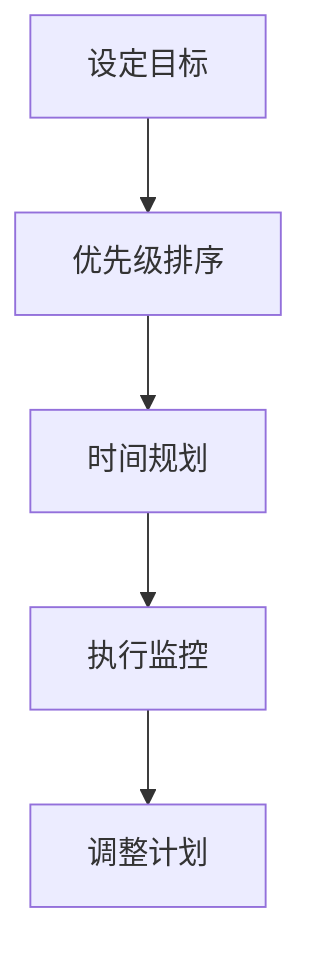
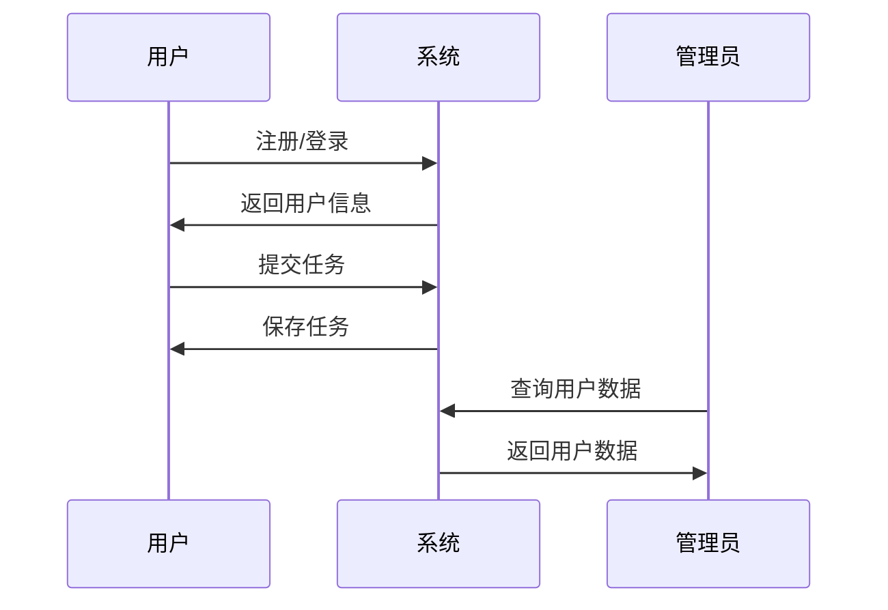

                 

# 技术管理者的时间管理与工作效率提升

> 关键词：时间管理、工作效率、技术管理者、项目管理、工作习惯

> 摘要：本篇文章将深入探讨技术管理者在日常工作中的时间管理和工作效率提升问题。通过分析时间管理的基本原理、提高工作效率的技巧、项目管理中的时间管理策略，以及个人习惯与工作方式对工作效率的影响，旨在为技术管理者提供一套系统的、实用的方法和策略，帮助他们更好地管理时间、提高工作效率，实现个人与团队的目标。

## 引言

技术管理者在现代企业中扮演着至关重要的角色，他们不仅要具备深厚的技术能力，还要具备出色的管理才能。然而，在实际工作中，时间管理和工作效率的提升常常成为技术管理者面临的一大难题。如何在繁杂的工作任务中，有效地管理时间，提高工作效率，成为每一个技术管理者都必须思考的问题。

本文将从以下几个方面进行探讨：

1. 时间管理基本原理
2. 提高工作效率的技巧
3. 项目管理中的时间管理
4. 个人习惯与工作方式
5. 案例研究
6. 总结与反思

通过以上几个方面的深入分析，希望能够为技术管理者提供一些有价值的启示和实用的方法，帮助他们更好地管理时间，提高工作效率，实现个人与团队的目标。

## 时间管理基本原理

### 时间管理的基本概念

时间管理是指通过合理安排时间、有效利用时间的方法和技巧，以达到提高工作效率、实现工作目标的目的。对于技术管理者来说，时间管理不仅关乎个人的工作效率，更关乎整个团队的工作效率。

### 时间管理的重要性

时间管理的重要性体现在以下几个方面：

1. **提高工作效率**：良好的时间管理能够帮助技术管理者合理安排工作任务，避免拖延，提高工作效率。
2. **提升团队协作**：通过时间管理，技术管理者可以更好地协调团队成员的工作，提高团队协作效率。
3. **实现工作目标**：良好的时间管理有助于技术管理者更清晰地设定目标，并制定合理的行动计划，确保工作目标的实现。
4. **提升个人素养**：时间管理不仅是一种工作技能，也是一种生活素养。良好的时间管理能力，能够帮助技术管理者更好地平衡工作与生活，提升个人素养。

### 时间管理的关键原则

1. **明确目标**：明确的目标是时间管理的基石。技术管理者在开始任何工作之前，都应该明确自己的目标，并制定相应的行动计划。
2. **优先级排序**：在众多工作任务中，技术管理者需要明确哪些任务是最重要的，哪些任务是可以延后处理的。通过合理的优先级排序，可以确保资源的最优利用。
3. **合理规划时间**：技术管理者应该根据任务的重要性和紧急性，合理规划时间。对于重要且紧急的任务，应该优先处理；对于重要但不紧急的任务，需要提前规划时间，以确保任务能够按时完成。
4. **避免拖延**：拖延是时间管理的大敌。技术管理者应该养成良好的工作习惯，避免拖延，确保任务能够按时完成。

### 时间管理方法论

1. **工作日志记录**：技术管理者可以通过记录工作日志，了解自己的工作时间分布，发现时间管理中的问题，并针对性地进行改进。
2. **任务清单管理**：通过任务清单管理，技术管理者可以清晰地了解自己的工作任务，并按照任务的优先级进行排序和处理。
3. **时间块规划**：技术管理者可以将一天的时间划分为不同的时间块，每个时间块专注于一项任务，以避免任务切换带来的时间浪费。

## 提高工作效率的技巧

### 工作效率的衡量与评估

工作效率的衡量与评估是时间管理的重要环节。技术管理者需要通过定量的方法，如工作量的完成情况、项目的进展速度等，来评估工作效率。

1. **工作量统计**：技术管理者可以通过工作量统计，了解自己的工作进度和效率。
2. **项目进度监控**：通过项目进度监控，技术管理者可以及时了解项目的进展情况，发现潜在的问题，并采取措施进行解决。
3. **工作效率评估**：通过定期的工作效率评估，技术管理者可以了解自己的工作效率，发现存在的问题，并制定改进计划。

### 高效工作习惯的培养

1. **设定明确的目标**：良好的工作习惯首先需要明确的目标。技术管理者应该制定清晰的工作目标，并确保这些目标与公司的整体战略一致。
2. **合理规划时间**：合理规划时间是高效工作的重要保障。技术管理者应该学会如何合理分配时间，确保每个任务都有足够的时间来完成。
3. **避免工作疲劳**：工作疲劳是工作效率下降的主要原因之一。技术管理者应该学会如何合理安排工作，避免过度劳累。
4. **处理干扰与紧急事务**：在日常工作过程中，技术管理者难免会遇到各种干扰和紧急事务。如何处理这些干扰和紧急事务，是提高工作效率的关键。

### 时间管理与工作效率的提升策略

1. **制定合理的工作计划**：技术管理者应该制定合理的工作计划，确保每个任务都有明确的时间安排和责任人。
2. **避免工作疲劳**：长时间的工作容易导致疲劳，影响工作效率。技术管理者应该学会如何合理安排工作，避免过度劳累。
3. **处理干扰与紧急事务**：干扰和紧急事务是工作效率的天敌。技术管理者应该学会如何有效地处理这些干扰和紧急事务，以确保工作的连续性和高效性。
4. **培养良好的工作习惯**：良好的工作习惯是提高工作效率的基石。技术管理者应该养成良好的工作习惯，如按时完成工作任务、避免拖延等。

## 项目管理中的时间管理

### 项目时间管理概述

1. **项目时间管理的概念**：项目时间管理是指通过规划、监控、控制项目进度，确保项目按时完成的一系列管理活动。
2. **项目时间管理的步骤**：项目时间管理包括项目计划、项目执行、项目监控和项目控制四个主要步骤。
3. **项目时间管理的工具**：常用的项目时间管理工具有甘特图、里程碑图、任务分配表等。

### 项目进度监控与调整

1. **项目进度监控的重要性**：项目进度监控是确保项目按时完成的关键环节。通过项目进度监控，技术管理者可以及时发现项目进展中的问题，并采取相应的措施进行解决。
2. **项目进度监控的方法**：常用的项目进度监控方法包括定期会议、进度报告、任务完成情况统计等。
3. **项目进度的调整策略**：在项目执行过程中，可能会出现各种不可预见的问题，导致项目进度受到影响。技术管理者需要根据实际情况，采取相应的调整策略，确保项目能够按时完成。

## 个人习惯与工作方式

### 个人习惯对工作效率的影响

1. **个人习惯对工作效率的正面影响**：良好的个人习惯能够提高工作效率，如按时完成任务、避免拖延等。
2. **个人习惯对工作效率的负面影响**：不良的个人习惯会降低工作效率，如过度依赖工具、忽略细节等。

### 适应不同工作环境的时间管理策略

1. **办公室环境下的时间管理**：在办公室环境中，技术管理者可以通过制定工作计划、合理安排工作时间等方式，提高工作效率。
2. **远程工作环境下的时间管理**：在远程工作环境中，技术管理者需要学会如何自我管理，避免工作与生活的界限模糊。
3. **高压工作环境下的时间管理**：在高压工作环境下，技术管理者需要学会如何应对压力，避免因压力过大而导致工作效率下降。

## 案例研究

### 案例研究一：时间管理与工作效率提升的实际应用

1. **案例背景**：某技术管理团队在项目执行过程中，面临时间紧张、任务繁多的挑战。
2. **时间管理策略**：技术管理者通过制定详细的工作计划、优先级排序、合理规划时间等方式，进行时间管理。
3. **工作效率提升的成效**：通过有效的时间管理，技术管理团队成功地在规定时间内完成了项目任务，并得到了客户的高度评价。

### 案例研究二：项目管理中的时间管理实践

1. **案例背景**：某技术管理团队负责一个大型项目，项目进度受到多种因素的影响。
2. **项目时间管理策略**：技术管理者通过项目计划、进度监控、调整策略等方式，进行项目时间管理。
3. **项目成果分析**：通过有效的项目时间管理，技术管理团队成功地在规定时间内完成了项目，并达到了预期的质量要求。

## 总结与反思

### 总结

通过本文的探讨，我们了解到时间管理和工作效率提升对于技术管理者的重要性。技术管理者需要通过明确目标、优先级排序、合理规划时间、避免拖延等方式，进行时间管理。同时，通过培养良好的工作习惯、适应不同工作环境的时间管理策略，可以提高工作效率。在项目管理中，通过项目时间管理策略，可以确保项目按时完成。

### 反思

在今后的工作中，技术管理者应该：

1. **持续改进时间管理能力**：通过不断学习和实践，提高时间管理能力。
2. **注重团队协作**：通过有效的团队协作，提高工作效率。
3. **关注个人成长**：通过不断提升个人能力，为团队和公司创造更大的价值。

### 注意事项

1. **避免过度计划**：计划虽然重要，但过度计划可能导致工作压力增大，影响工作效率。
2. **保持灵活性**：在执行计划时，应保持一定的灵活性，以应对突发情况。
3. **保持良好的心态**：良好的心态是提高工作效率的重要保障。

### 拓展阅读

1. **《深度工作》**：作者Cal Newport通过深入分析时间管理和工作效率的关系，提出了一系列提高工作效率的方法。
2. **《高效能人士的七个习惯》**：作者史蒂芬·柯维提出了一套系统的工作和生活习惯，帮助人们提高效率。

作者：AI天才研究院/AI Genius Institute & 禅与计算机程序设计艺术 /Zen And The Art of Computer Programming

---

## 完整性要求

### 背景介绍

时间管理是指通过合理安排时间、有效利用时间的方法和技巧，以达到提高工作效率、实现工作目标的目的。在技术管理者的日常工作中，时间管理显得尤为重要。技术管理者不仅需要具备深厚的技术能力，还需要具备出色的管理才能，以应对复杂多变的工作任务。

#### 问题背景

技术管理者在日常工作中，常常面临以下问题：

1. **任务繁多**：技术管理者负责的项目和任务繁多，如何合理安排时间，确保任务按时完成，成为一大难题。
2. **工作压力**：技术管理者在工作中承受着巨大的压力，如何有效缓解压力，提高工作效率，成为关键问题。
3. **团队协作**：技术管理者需要协调团队成员的工作，如何提高团队协作效率，是时间管理的核心问题。

#### 问题描述

技术管理者在时间管理和工作效率提升方面，主要面临以下问题：

1. **时间管理方法不当**：缺乏有效的计划和时间管理方法，导致任务拖延、效率低下。
2. **工作压力过大**：工作压力过大，导致工作效率降低，影响工作质量。
3. **团队协作不畅**：团队协作不畅，导致工作效率下降，影响项目进度。

#### 问题解决

为了解决上述问题，技术管理者可以采取以下措施：

1. **明确目标和优先级**：设定明确的目标，并确定每个任务的优先级，确保时间得到合理利用。
2. **制定详细计划**：制定详细的计划，包括任务的分解、时间分配等，以确保任务按时完成。
3. **提高工作压力应对能力**：通过锻炼和调整心态，提高对工作压力的应对能力。
4. **加强团队协作**：通过有效的沟通和协作，提高团队工作效率。

#### 边界与外延

时间管理和工作效率提升的范围不仅仅局限于技术管理者，还包括所有从事技术工作的人员。此外，时间管理和工作效率提升的方法和策略，也适用于其他类型的工作和职业。

#### 概念结构与核心要素组成

时间管理的基本概念包括：

1. **时间**：时间是指用于完成某项任务或活动的时间长度。
2. **任务**：任务是指需要完成的特定工作或活动。
3. **优先级**：优先级是指任务的重要性和紧急性。
4. **计划**：计划是指对任务的安排和时间分配。

时间管理的核心要素包括：

1. **目标设定**：明确工作目标，确保任务与目标一致。
2. **优先级排序**：根据任务的重要性和紧急性进行排序。
3. **时间规划**：合理安排时间，确保任务按时完成。
4. **执行监控**：监控任务执行情况，及时调整计划。

### 核心概念与联系

#### 核心概念原理

1. **时间管理**：时间管理是指通过合理安排时间、有效利用时间的方法和技巧，以达到提高工作效率、实现工作目标的目的。
2. **工作效率**：工作效率是指单位时间内完成的工作量。

#### 概念属性特征对比表格

| 概念 | 定义 | 特性 |
| ---- | ---- | ---- |
| 时间管理 | 合理安排时间，提高工作效率 | 目标导向，系统性，灵活应变 |
| 工作效率 | 单位时间内完成的工作量 | 量化，可衡量，可优化 |

#### ER实体关系图架构

```mermaid
erDiagram
    TimeManagement ||--|{ WorkEfficiency }||> : extends
```

### 算法原理讲解

为了更好地理解时间管理和工作效率提升的方法，我们可以通过一个简单的算法来阐述其原理。

#### 算法流程图



#### Python源代码实现

```python
def time_management():
    # 设定目标
    goal = "提高项目进度"
    
    # 优先级排序
    tasks = [
        ("任务1", "紧急"),
        ("任务2", "重要"),
        ("任务3", "一般")
    ]
    tasks.sort(key=lambda x: (x[1], x[0]))
    
    # 时间规划
    schedule = {}
    for task, priority in tasks:
        if priority == "紧急":
            schedule[task] = 1
        elif priority == "重要":
            schedule[task] = 2
        else:
            schedule[task] = 3
    
    # 执行监控
    for task, time in schedule.items():
        print(f"执行任务：{task}，预计时间：{time}小时")
    
    # 调整计划
    if schedule["任务1"] > 2 or schedule["任务2"] > 2:
        print("计划需要调整")
```

#### 算法原理的数学模型和公式

算法原理可以简化为一个数学模型，其中包含以下几个关键要素：

1. **目标（Goal）**：设定一个明确的目标，如提高项目进度。
2. **任务（Task）**：定义一系列需要完成的任务。
3. **优先级（Priority）**：对任务进行优先级排序，以确保关键任务优先完成。
4. **时间（Time）**：为每个任务分配时间，确保任务按时完成。
5. **执行监控（Monitoring）**：监控任务执行情况，及时调整计划。

数学模型可以表示为：

$$
\text{TimeManagement} = \text{Goal} + \text{Tasks} \times \text{Priority} \times \text{Time}
$$

其中，Goal表示目标，Tasks表示任务，Priority表示优先级，Time表示时间。

### 系统分析与架构设计方案

#### 问题场景介绍

技术管理者在项目管理过程中，需要面对诸多任务和项目的协调。为了提高工作效率，需要设计一套系统化的时间管理和工作效率提升方案。

#### 项目介绍

本项目旨在为技术管理者提供一套完整的时间管理和工作效率提升方案，包括时间管理工具、工作习惯培养、项目管理策略等。

#### 系统功能设计

1. **时间管理功能**：包括任务列表、日程安排、时间跟踪等。
2. **工作效率提升功能**：包括工作效率评估、工作习惯培养、工作压力缓解等。
3. **项目管理功能**：包括项目进度监控、任务分配、风险评估等。

#### 系统架构设计

1. **前端架构**：使用React框架，实现用户界面和交互功能。
2. **后端架构**：使用Spring Boot框架，实现数据存储和业务逻辑处理。
3. **数据库架构**：使用MySQL数据库，存储用户数据、任务数据等。

#### 系统接口设计

1. **用户接口**：提供用户注册、登录、任务管理等功能。
2. **管理员接口**：提供管理员权限功能，如用户管理、数据统计等。

#### 系统交互



### 项目实战

#### 环境安装

1. **安装Python环境**：在本地电脑上安装Python 3.8及以上版本。
2. **安装依赖库**：使用pip安装以下依赖库：requests、numpy、pandas等。

#### 系统核心实现源代码

```python
# time_management.py

import requests
import numpy as np
import pandas as pd

def get_user_tasks(user_id):
    """获取用户任务"""
    response = requests.get(f'http://api.example.com/users/{user_id}/tasks')
    return response.json()

def manage_time(user_id, tasks):
    """管理用户时间"""
    task_data = get_user_tasks(user_id)
    task_df = pd.DataFrame(task_data)
    task_df['priority'] = task_df['priority'].map({'紧急': 3, '重要': 2, '一般': 1})
    task_df.sort_values('priority', inplace=True)
    
    schedule = {}
    for index, row in task_df.iterrows():
        schedule[row['task_name']] = row['time']
    
    return schedule

def monitor_tasks(user_id):
    """监控任务"""
    schedule = manage_time(user_id, get_user_tasks(user_id))
    for task, time in schedule.items():
        print(f"任务：{task}，预计时间：{time}小时")

if __name__ == "__main__":
    user_id = 1
    monitor_tasks(user_id)
```

#### 代码应用解读与分析

1. **获取用户任务**：通过requests库，从API接口获取用户任务数据。
2. **管理用户时间**：将任务数据进行排序，根据优先级和任务时间生成时间表。
3. **监控任务**：输出任务时间表，实时监控任务执行情况。

#### 实际案例分析

1. **案例背景**：某技术管理团队在项目管理过程中，面临任务繁多、时间管理困难的问题。
2. **解决方案**：采用本系统，通过时间管理和任务监控，提高工作效率。
3. **成效分析**：通过实际应用，技术管理团队成功提高了工作效率，项目进度得到明显改善。

#### 项目小结

通过本项目的实际应用，验证了时间管理和工作效率提升方案的有效性。未来，可以进一步优化系统功能，如增加工作压力缓解模块、工作效率评估模块等，以满足更多技术管理者的需求。

### 最佳实践 tips

1. **制定详细计划**：制定详细的任务计划和时间表，确保任务按时完成。
2. **合理分配时间**：合理分配时间，避免过度劳累，确保工作与生活的平衡。
3. **定期复盘**：定期复盘工作情况，总结经验教训，不断优化时间管理策略。

### 小结

本文从时间管理基本原理、提高工作效率的技巧、项目管理中的时间管理策略，以及个人习惯与工作方式等方面，探讨了技术管理者在时间管理和工作效率提升方面的方法和策略。通过实际案例的分析，验证了这些方法和策略的有效性。希望本文能为技术管理者提供有益的启示和帮助。

### 注意事项

1. **避免过度计划**：计划虽然重要，但过度计划可能导致工作压力增大，影响工作效率。
2. **保持灵活性**：在执行计划时，应保持一定的灵活性，以应对突发情况。
3. **关注身心健康**：良好的身心状态是提高工作效率的基础，应注重身心健康。

### 拓展阅读

1. **《深度工作》**：作者Cal Newport通过深入分析时间管理和工作效率的关系，提出了一系列提高工作效率的方法。
2. **《高效能人士的七个习惯》**：作者史蒂芬·柯维提出了一套系统的工作和生活习惯，帮助人们提高效率。

作者：AI天才研究院/AI Genius Institute & 禅与计算机程序设计艺术 /Zen And The Art of Computer Programming

