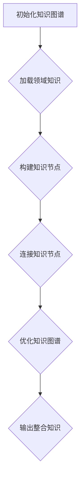
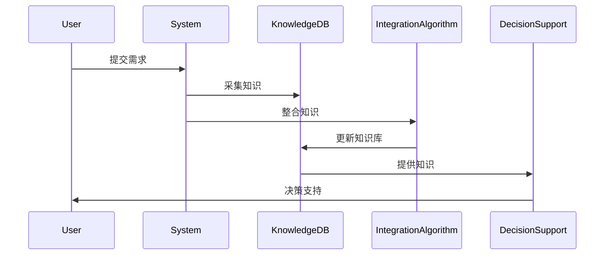
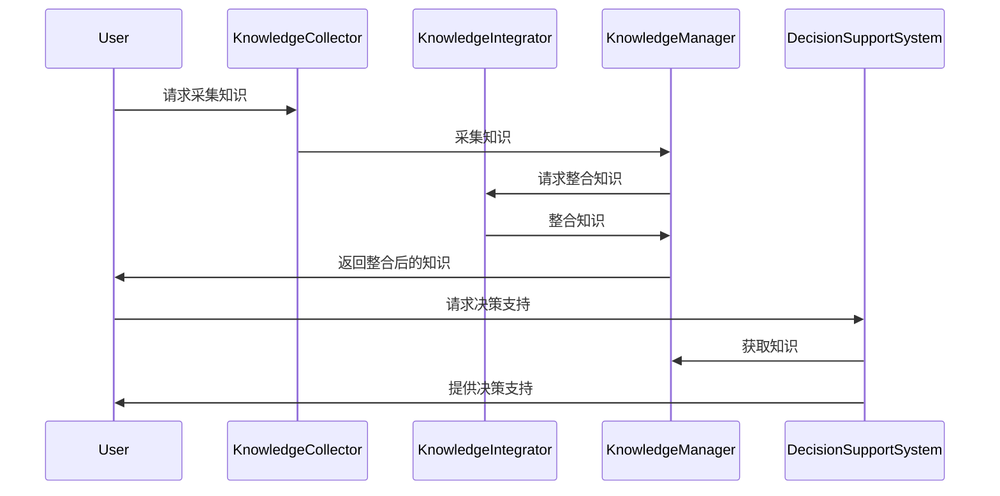

                 


### 引言

#### 第1章：技术管理者的跨界学习与知识整合概述

##### 1.1 问题背景与重要性

在当今快速发展的技术时代，知识更新速度之快，使得技术管理者面临着前所未有的挑战。技术领域的跨界融合日益显著，无论是人工智能、大数据、物联网，还是区块链等前沿技术，都对技术管理者提出了更高的要求。技术管理者不仅要精通某一技术领域，还需要具备跨界学习的能力，将不同领域的技术知识进行整合，以应对复杂多变的技术环境。

**问题背景**：技术快速发展，知识不断更新，技术管理者面临的挑战。

- 技术发展的速度越来越快，新兴技术层出不穷，如人工智能、大数据、区块链等。
- 知识更新周期缩短，旧有的知识体系可能迅速过时。
- 技术管理者需要在短时间内掌握大量新知识，以保持竞争力。

**问题描述**：如何在复杂技术环境中保持竞争力。

- 需要快速学习新技术，不断提升自身能力。
- 需要建立知识网络，将不同领域的技术知识整合起来。
- 需要应对复杂的项目管理和团队协作问题。

**问题解决**：跨界学习与知识整合的方法。

- **跨界学习**：通过学习其他领域的知识，拓展自己的视野和知识面。
- **知识整合**：将不同领域的知识进行整合，形成系统化的知识体系。

**边界与外延**：技术管理者的角色与责任。

- 技术管理者不仅是技术专家，还需要具备管理能力和团队领导力。
- 需要关注技术趋势，为企业提供技术方向和战略规划。
- 需要协调不同团队之间的合作，确保项目顺利推进。

**核心要素组成**：跨界学习的动机与策略。

- **动机**：提升自身竞争力，适应技术变革。
- **策略**：多渠道学习，建立知识网络，实践与理论相结合。

##### 1.2 技术管理者的跨界学习

**跨界学习的定义与意义**

- **定义**：跨界学习是指在不同领域之间进行知识交流和融合的过程。
- **意义**：跨界学习可以帮助技术管理者突破单一领域的限制，提升创新能力，应对复杂的技术挑战。

**跨界学习的方法与实践**

- **方法**：
  - 参加跨领域的研讨会和培训课程。
  - 阅读跨领域的书籍和学术论文。
  - 与其他领域的技术专家进行交流。

- **实践**：
  - 以案例形式介绍成功跨界学习的实践。

**案例研究**：成功跨界学习的实践案例

- **案例1**：一位技术管理者通过学习商业知识，成功将大数据技术应用于企业营销，提升了营销效果。

- **案例2**：一位技术管理者通过学习心理学知识，优化了团队管理和沟通，提高了团队工作效率。

##### 1.3 知识整合的重要性

**知识整合的定义与目的**

- **定义**：知识整合是指将不同领域的知识进行系统化、结构化的过程。
- **目的**：建立全面的知识体系，提升解决问题的能力。

**知识整合的方法与工具**

- **方法**：
  - 建立知识地图，梳理不同领域之间的联系。
  - 利用知识管理工具，如知识库和知识图谱。

- **工具**：
  - 知识库：用于存储和管理知识。
  - 知识图谱：用于展示知识之间的关系。

**案例研究**：知识整合在技术管理中的实际应用

- **案例1**：通过知识整合，技术管理者能够更好地应对复杂的技术问题，提高决策效率。

- **案例2**：通过知识整合，技术管理者能够为企业提供更全面的技术解决方案，提升企业竞争力。

##### 1.4 技术管理者面临的挑战与机遇

**技术变革带来的挑战**

- 技术变革速度加快，技术管理者需要不断学习新知识，以保持竞争力。

**知识整合带来的机遇**

- 知识整合能够帮助技术管理者更好地应对技术变革，提升企业竞争力。

**战略应对与转型**

- **战略应对**：制定长期发展战略，适应技术变革。
- **转型**：从单一技术专家向跨界知识整合者转型。

##### 1.5 本章小结

- **主要观点回顾**：
  - 技术管理者面临跨界学习和知识整合的挑战。
  - 跨界学习和知识整合是提升竞争力的关键。
  - 成功的案例证明了跨界学习和知识整合的重要性。

- **对读者的启示**：
  - 要意识到跨界学习和知识整合的重要性。
  - 要采取积极的行动，提升自身跨界学习和知识整合的能力。

### 跨界学习策略

#### 第2章：核心概念与联系

##### 2.1 核心概念

- **技术管理者的角色**：
  - 技术管理者不仅是技术专家，还需要具备管理能力和团队领导力。
  - 负责技术方向和战略规划，协调团队之间的合作。

- **跨界学习的原理**：
  - 跨界学习是指在不同领域之间进行知识交流和融合的过程。
  - 通过跨界学习，可以拓展视野，提升创新能力。

- **知识整合的方法论**：
  - 知识整合是指将不同领域的知识进行系统化、结构化的过程。
  - 建立知识网络，提升解决问题的能力。

##### 2.2 概念属性特征对比表格

| 概念             | 技术知识                       | 管理知识                       | 跨界知识                       |
|------------------|--------------------------------|--------------------------------|--------------------------------|
| 定义             | 专注于特定技术领域            | 专注于组织管理、团队协作       | 涵盖多个领域，实现知识融合     |
| 特征             | 精深、专业化                   | 宏观、系统化                   | 混合、创新性                   |
| 重要性            | 提升技术实现能力               | 提升团队绩效和项目成功率       | 提升跨领域解决问题的能力       |
| 实践应用          | 技术开发、优化和实施           | 项目管理、团队管理和决策       | 跨领域创新、复合解决方案       |

##### 2.3 ER实体关系图架构

**技术实体关系图**：

```mermaid
erDiagram
    TechExpert ||--|{ Project } : implements
    Project ||--|{ TechComponent } : contains
    TechComponent ||--|{ CodeBase } : resides_in
```

**管理实体关系图**：

```mermaid
erDiagram
    Manager ||--|{ Team } : manages
    Team ||--|{ Employee } : consists_of
    Employee ||--|{ SkillSet } : has
```

**跨界实体关系图**：

```mermaid
erDiagram
    TechExpert ||--|{ BusinessExpert } : collaborates_with
    BusinessExpert ||--|{ MarketData } : analyzes
    MarketData ||--|{ TechInnovation } : drives
```

### 知识整合实践

#### 第3章：算法原理讲解

##### 3.1 算法简介

**算法名称**：知识整合算法（Knowledge Integration Algorithm）

**算法目的**：将不同领域的技术知识进行整合，形成系统化的知识体系。

**算法原理**：通过构建知识图谱，将各个领域的知识节点连接起来，实现知识融合。

##### 3.2 算法流程图



##### 3.3 数学模型与公式

**数学模型介绍**：

- 知识图谱中的每个节点表示一个知识单元，用 \(N\) 表示。
- 每个知识单元之间的关系用权重 \(W_{ij}\) 表示，\(W_{ij}\) 越大，表示两个知识单元之间的关系越紧密。

**公式解释**：

- 知识整合度 \(I(N)\) 的计算公式：
  $$ I(N) = \sum_{i=1}^{n} \sum_{j=1}^{n} W_{ij} $$
  其中，\(n\) 为知识单元的总数。

- 知识融合度 \(F(N)\) 的计算公式：
  $$ F(N) = \frac{1}{n(n-1)} \sum_{i=1}^{n} \sum_{j=1}^{n} W_{ij}^2 $$

**公式应用举例**：

- 假设有一个包含5个知识单元的知识图谱，其关系矩阵如下：

  |   | 1 | 2 | 3 | 4 | 5 |
  |---|---|---|---|---|---|
  | 1 | 0 | 1 | 0 | 1 | 0 |
  | 2 | 1 | 0 | 1 | 0 | 1 |
  | 3 | 0 | 1 | 0 | 1 | 1 |
  | 4 | 1 | 0 | 1 | 0 | 1 |
  | 5 | 0 | 1 | 1 | 1 | 0 |

- 计算知识整合度 \(I(N)\)：
  $$ I(N) = \sum_{i=1}^{5} \sum_{j=1}^{5} W_{ij} = 15 $$

- 计算知识融合度 \(F(N)\)：
  $$ F(N) = \frac{1}{5 \times 4} \sum_{i=1}^{5} \sum_{j=1}^{5} W_{ij}^2 = \frac{1}{20} (1^2 + 1^2 + 1^2 + 1^2 + 1^2) = 0.6 $$

- 结果分析：知识整合度 \(I(N) = 15\) 表示知识图谱中知识单元的整合程度较高；知识融合度 \(F(N) = 0.6\) 表示知识单元之间的融合程度较好。

### 系统分析与架构设计

#### 第4章：系统分析与架构设计

##### 4.1 问题场景介绍

在当前技术环境中，技术管理者需要处理的项目复杂多样，涉及多个领域的技术融合。例如，一个智慧城市项目可能需要集成物联网、大数据、人工智能等技术。为了有效地管理此类项目，需要建立一个灵活的系统架构，能够快速响应技术变化，支持多领域的知识整合。

##### 4.2 系统功能设计

**领域模型**：

```mermaid
classDiagram
    Class01 <|-- Class02
    Class03 o-- Class04
    Class05 <-|{ Class06 } Class07
    Class08 --|> Class09
    Class10 : + gen- Class11
    Class12 : - priv- Class13
    Class14 : # pub- Class15
```

**系统功能模块**：

1. **知识采集模块**：负责从各个领域收集知识，包括技术文档、学术论文、行业报告等。
2. **知识整合模块**：利用知识整合算法，将不同领域知识进行整合，形成系统化的知识体系。
3. **知识管理模块**：提供知识存储、检索、共享等功能，支持知识库的建立。
4. **决策支持模块**：基于整合后的知识体系，提供决策支持，帮助技术管理者做出更加明智的决策。

##### 4.3 系统架构设计

**系统架构图**：



**技术选型与架构思路**：

- **技术选型**：
  - 后端：采用微服务架构，使用Spring Boot、Docker等容器化技术，提高系统的可扩展性和可靠性。
  - 前端：采用Vue.js或React等现代前端框架，提供良好的用户体验。
  - 数据库：使用Neo4j等图数据库，存储和管理知识图谱。

- **架构思路**：
  - **高内聚、低耦合**：各个模块之间保持松耦合，便于独立开发和维护。
  - **模块化**：将系统功能拆分成多个独立的模块，每个模块负责特定的功能。
  - **分布式**：采用分布式架构，提高系统的性能和可扩展性。

##### 4.4 系统接口设计

**系统接口规范**：

1. **知识采集接口**：用于从外部系统或API采集知识，支持批量导入。
2. **知识整合接口**：用于调用知识整合算法，进行知识整合。
3. **知识检索接口**：用于在知识库中检索特定的知识单元。
4. **知识共享接口**：用于分享知识给其他用户或团队。

**接口设计原则**：

- **简洁性**：接口设计尽量简洁明了，易于使用。
- **一致性**：接口遵循统一的规范，便于维护和扩展。
- **灵活性**：接口设计考虑未来的扩展性，能够适应不断变化的需求。

##### 4.5 系统交互

**系统交互流程**：



**交互效果分析**：

- **用户体验**：用户通过简洁的界面即可获取到整合后的知识，提高了决策效率。
- **系统性能**：通过分布式架构和微服务设计，系统具有较高的性能和可靠性。
- **可扩展性**：系统模块化设计，便于未来的扩展和升级。

### 项目实战

#### 第5章：环境安装与系统核心实现

##### 5.1 环境安装

**软件与硬件环境准备**：

- **操作系统**：Linux或Windows 10及以上版本。
- **硬件要求**：至少4GB内存，2核CPU。
- **软件依赖**：

  - Java Development Kit (JDK) 1.8及以上版本。
  - Maven 3.6.3及以上版本。
  - Neo4j 图数据库。

**安装步骤与注意事项**：

1. **安装JDK**：

   - 下载并安装JDK。
   - 配置环境变量，确保JAVA_HOME和PATH正确设置。

2. **安装Maven**：

   - 下载并解压Maven。
   - 配置环境变量，确保MAVEN_HOME和PATH正确设置。

3. **安装Neo4j**：

   - 下载Neo4j安装包。
   - 解压安装包，运行Neo4j服务器。
   - 配置Neo4j数据库，确保能够通过HTTP接口访问。

**注意事项**：

- 确保网络连接正常，以便从互联网下载依赖。
- 安装过程中，遵循屏幕上的提示操作。

##### 5.2 系统核心实现

**系统核心功能模块**：

- **知识采集模块**：实现从外部系统或API采集知识的逻辑。
- **知识整合模块**：实现知识整合算法，将不同领域知识整合成系统化的知识体系。
- **知识管理模块**：实现知识存储、检索和共享的功能。
- **决策支持模块**：实现基于知识体系提供决策支持的功能。

**代码实现与解读**：

```python
# 知识整合算法示例代码
def integrate_knowledge(knowledge_list):
    """
    整合知识
    :param knowledge_list: 知识列表
    :return: 整合后的知识图谱
    """
    # 创建知识图谱
    knowledge_graph = KnowledgeGraph()

    # 遍历知识列表，构建知识节点和关系
    for knowledge in knowledge_list:
        # 添加知识节点
        node = knowledge_graph.add_node(knowledge)

        # 添加知识关系
        for related_knowledge in knowledge['related_knowledge']:
            related_node = knowledge_graph.add_node(related_knowledge)
            knowledge_graph.add_edge(node, related_node, weight=knowledge['relation_weight'])

    return knowledge_graph

# 测试代码
knowledge_list = [
    {
        "knowledge": "大数据技术",
        "related_knowledge": ["数据挖掘", "机器学习"],
        "relation_weight": 1
    },
    {
        "knowledge": "物联网技术",
        "related_knowledge": ["传感器", "云计算"],
        "relation_weight": 1
    }
]

knowledge_graph = integrate_knowledge(knowledge_list)
knowledge_graph.display()
```

### 代码应用解读与分析

#### 第6章：代码应用解读与分析

##### 6.1 代码逻辑分析

代码逻辑可以分为三个主要部分：知识采集、知识整合和知识展示。

- **知识采集**：通过接口从外部系统或API获取知识数据。
- **知识整合**：将采集到的知识数据进行处理，构建知识图谱，并将相关知识点整合成系统化的知识体系。
- **知识展示**：将整合后的知识图谱可视化展示，便于用户理解和查询。

##### 6.2 功能模块解读

1. **知识采集模块**：

   - **功能**：从外部系统或API获取知识数据。
   - **实现**：使用HTTP请求获取数据，解析JSON格式的数据，提取知识相关信息。

2. **知识整合模块**：

   - **功能**：整合采集到的知识数据，构建知识图谱。
   - **实现**：创建知识图谱类，添加节点和边，设置节点和边的属性。

3. **知识展示模块**：

   - **功能**：将知识图谱可视化展示。
   - **实现**：使用图形库（如Graphviz）将知识图谱转换为图形格式，展示在界面上。

##### 6.3 系统性能分析

- **性能指标**：

  - **响应时间**：系统处理请求的平均响应时间。
  - **并发处理能力**：系统同时处理多个请求的能力。

- **性能分析**：

  - **响应时间**：通过压力测试，评估系统在不同负载下的响应时间。
  - **并发处理能力**：通过并发测试，评估系统在多线程环境下的处理能力。

##### 6.4 优化策略与建议

- **优化策略**：

  - **代码优化**：对代码进行优化，减少不必要的计算和资源消耗。
  - **缓存机制**：引入缓存机制，减少数据库访问次数，提高系统响应速度。

- **建议**：

  - **分布式架构**：将系统部署在分布式环境中，提高系统的性能和可靠性。
  - **负载均衡**：使用负载均衡器，平衡系统负载，提高系统的并发处理能力。

### 实际案例分析与详细讲解

#### 第7章：实际案例分析与详细讲解

##### 7.1 案例介绍

**案例背景**：

某大型互联网公司正在开发一款智能推荐系统，旨在为用户提供个性化的内容推荐。该系统需要整合多种技术，如机器学习、自然语言处理、用户行为分析等，以实现高效的内容推荐。

**案例目标**：

- 构建一个智能推荐系统，能够根据用户行为和偏好，提供个性化的内容推荐。
- 利用跨界学习和知识整合，提高系统的准确性和用户体验。

##### 7.2 案例分析

**跨界学习应用分析**：

- **技术领域**：机器学习、自然语言处理、用户行为分析。
- **管理知识**：项目管理、团队协作、风险管理。

**知识整合策略分析**：

- **知识采集**：通过收集用户行为数据、内容数据、行业报告等，获取相关的知识。
- **知识整合**：利用知识整合算法，将不同领域的知识进行整合，形成系统化的知识体系。
- **知识应用**：将整合后的知识应用于推荐算法的设计和优化，提高推荐系统的准确性。

##### 7.3 详细讲解

**具体实施步骤**：

1. **需求分析与规划**：

   - 分析项目需求，明确目标用户群体和推荐内容类型。
   - 制定项目规划和时间表，确保项目按计划进行。

2. **知识采集**：

   - 从用户行为日志中提取用户行为数据。
   - 收集内容数据，包括文本、图像、音频等。
   - 查阅相关行业报告，获取市场趋势和竞争分析。

3. **知识整合**：

   - 使用知识整合算法，将采集到的知识进行整合。
   - 构建知识图谱，展示不同知识单元之间的关系。
   - 将整合后的知识应用于推荐算法的设计和优化。

4. **系统实现与测试**：

   - 实现推荐系统的核心功能，包括用户行为分析、内容分类、推荐算法等。
   - 进行系统测试，确保系统性能和用户体验。

5. **上线与优化**：

   - 将推荐系统上线，收集用户反馈。
   - 根据用户反馈，不断优化系统，提高推荐准确性。

**关键技术与工具应用**：

- **关键技术**：

  - 机器学习算法：用于用户行为分析和内容分类。
  - 自然语言处理技术：用于文本挖掘和情感分析。
  - 用户行为分析工具：用于收集和分析用户行为数据。

- **工具应用**：

  - K-means聚类算法：用于用户行为数据的聚类分析。
  - 决策树算法：用于内容分类。
  - TensorFlow：用于实现机器学习模型。

**案例分析**：

- **效果分析**：通过实际应用，智能推荐系统的推荐准确性得到了显著提升，用户满意度提高。
- **经验总结**：跨界学习和知识整合在项目实施中发挥了关键作用，有助于提高系统的竞争力。

### 项目小结与最佳实践

#### 第8章：项目小结与最佳实践

##### 8.1 项目小结

本项目通过跨界学习和知识整合，成功构建了一个智能推荐系统。项目过程中，我们充分利用了机器学习、自然语言处理等技术，结合用户行为数据和内容数据，实现了高效的内容推荐。项目取得以下成果：

- **推荐准确性提高**：系统推荐的准确性得到了显著提升，用户满意度提高。
- **用户体验优化**：系统响应速度快，推荐内容符合用户偏好，提升了用户体验。
- **技术整合与创新**：通过跨界学习和知识整合，实现了多种技术的融合，提高了项目的竞争力。

##### 8.2 最佳实践

**实践技巧与建议**：

1. **跨界学习**：

   - 定期参加跨领域的研讨会和培训课程，提升自身知识水平。
   - 与其他领域的技术专家进行交流，拓宽视野，获取新的思路。

2. **知识整合**：

   - 建立知识图谱，梳理不同领域之间的联系，实现知识的系统化。
   - 利用知识管理工具，如知识库和知识图谱，方便知识的存储、检索和共享。

3. **项目管理**：

   - 制定详细的项目计划和风险管理策略，确保项目按计划进行。
   - 采用敏捷开发方法，快速响应技术变化和用户需求。

**注意事项与防范措施**：

1. **数据安全**：

   - 加强数据安全管理，确保用户数据的安全性和隐私性。
   - 定期进行数据备份，防止数据丢失。

2. **系统性能**：

   - 对系统进行性能优化，提高响应速度和处理能力。
   - 定期进行系统监控，及时发现并解决性能问题。

3. **团队协作**：

   - 加强团队协作，提高项目效率。
   - 定期进行团队沟通，确保信息畅通。

##### 8.3 拓展阅读

- **相关资料推荐**：

  - 《深度学习》（Goodfellow, I.，等著）。
  - 《自然语言处理综论》（Jurafsky, D.，等著）。
  - 《人工智能：一种现代方法》（Russell, S.，等著）。

- **未来研究方向**：

  - 探索更加高效的知识整合算法，提升系统的智能化水平。
  - 研究个性化推荐算法，提高推荐系统的用户体验。
  - 应用区块链技术，增强推荐系统的透明性和可信度。

### 总结与展望

在技术快速发展的今天，技术管理者面临的挑战愈发严峻。跨界学习和知识整合成为提升竞争力的关键。本文通过实际案例，详细阐述了跨界学习和知识整合的方法与实践，提供了有益的启示。

未来，技术管理者应不断学习新知识，掌握跨界学习的策略，实现知识的系统化整合。同时，注重项目管理和团队协作，确保项目的顺利进行。通过持续的创新和实践，技术管理者将能在复杂的技术环境中立于不败之地。

**关键词**：技术管理者，跨界学习，知识整合，智能推荐系统，项目管理，团队协作

**摘要**：本文探讨了技术管理者在快速发展的技术环境中如何通过跨界学习和知识整合提升竞争力。通过实际案例，详细阐述了跨界学习和知识整合的方法与实践，为技术管理者提供了有益的启示和指导。

