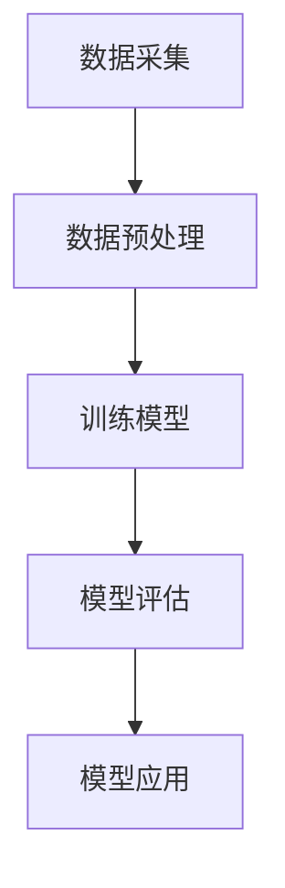
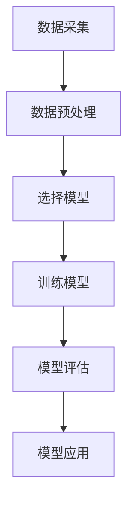
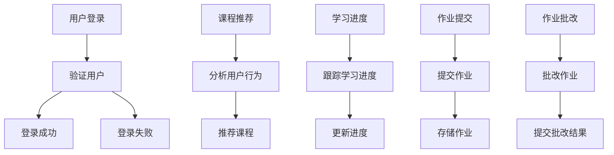
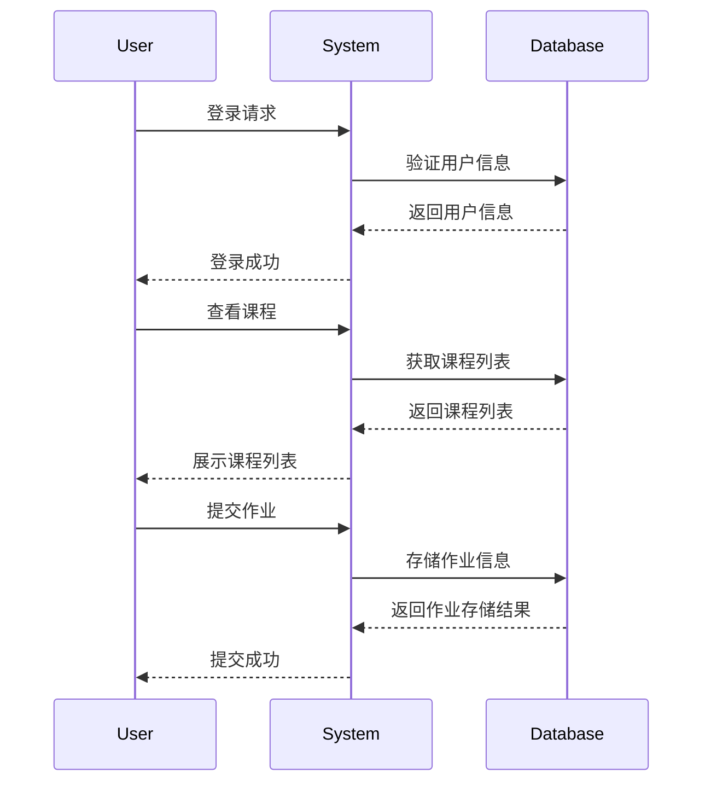

                 

# 技术驱动业务增长的方法论

> 关键词：技术驱动、业务增长、方法论、数据分析、算法、系统架构、项目实战

> 摘要：本文旨在探讨技术驱动业务增长的方法论，通过深入分析技术对业务增长的核心影响，结合实际案例，总结出一套系统化、可操作的方法，帮助企业和个人在数字化时代实现业务的快速发展。

## 第1章 引言

### 1.1 问题背景

随着信息技术的飞速发展，数据已经成为企业的重要资产，而如何利用这些数据来驱动业务增长，成为了现代企业面临的重要课题。传统的业务增长模式已经难以适应日益激烈的市场竞争，越来越多的企业开始意识到技术驱动业务增长的重要性。

### 1.2 问题解决

技术驱动业务增长的关键在于如何有效地利用技术手段，挖掘数据的价值，优化业务流程，提高决策效率。本文将探讨以下核心问题：

- 如何构建一个系统化的方法论，指导企业实现技术驱动业务增长？
- 如何选择合适的技术手段，解决业务增长中的实际问题？
- 如何在技术驱动业务增长的过程中，保持创新和持续改进？

### 1.3 边界与外延

本文主要关注以下领域：

- 数据分析：如何利用数据分析工具和技术，挖掘数据中的潜在价值？
- 算法：如何选择和应用合适的算法，解决业务问题，提高业务效率？
- 系统架构：如何设计和实现一个高效、可扩展的系统架构，支撑业务增长？
- 项目实战：如何通过实际案例，展示技术驱动业务增长的方法和应用效果？

## 第2章 核心概念与联系

### 2.1 增长理论概述

增长理论是企业战略管理中的重要组成部分，它揭示了企业在不同发展阶段如何实现业务增长。增长理论主要包括以下几方面：

- 市场细分：通过市场细分，找到潜在的客户群体，制定有针对性的营销策略。
- 客户关系管理：通过建立和维护良好的客户关系，提高客户满意度和忠诚度。
- 创新与研发：通过持续的创新和研发，保持企业的核心竞争力。
- 营销策略：通过有效的营销策略，提高品牌知名度和市场占有率。

### 2.2 数据分析基础

数据分析是企业利用数据优化业务决策的重要手段。数据分析基础主要包括以下几个方面：

- 数据采集：通过数据采集工具，获取企业内外部的各种数据。
- 数据清洗：对采集到的数据进行清洗和预处理，确保数据质量。
- 数据存储：选择合适的数据存储方案，保证数据的安全性和可扩展性。
- 数据分析工具：使用数据分析工具，对数据进行挖掘和分析，提取有价值的信息。

### 2.3 技术趋势分析

技术趋势分析是帮助企业把握行业动态，抢占市场先机的重要手段。技术趋势分析主要包括以下几个方面：

- 人工智能：探讨人工智能在各个领域的应用，如自然语言处理、计算机视觉等。
- 大数据：分析大数据技术如何帮助企业实现数据的价值最大化。
- 云计算：探讨云计算在业务中的应用，如云计算平台、云存储等。
- 区块链：分析区块链技术对行业带来的变革和影响。

## 第3章 算法原理讲解

### 3.1 机器学习算法

#### 3.1.1 算法概述

机器学习是一种通过算法模型从数据中自动学习规律和模式的方法。机器学习算法主要包括监督学习、无监督学习和强化学习等类型。

#### 3.1.2 算法流程图



#### 3.1.3 Python 代码实现

```python
import numpy as np
from sklearn.linear_model import LinearRegression

# 数据采集
X = np.array([[1], [2], [3], [4], [5]])
y = np.array([1, 2, 2.5, 4, 5])

# 数据预处理
X = X.reshape(-1, 1)

# 训练模型
model = LinearRegression()
model.fit(X, y)

# 模型评估
score = model.score(X, y)
print("模型评估得分：", score)

# 模型应用
new_data = np.array([[6]])
new_prediction = model.predict(new_data)
print("新数据预测结果：", new_prediction)
```

#### 3.1.4 LaTeX 公式与详细讲解

$$
y = \sum_{i=1}^{n} w_i x_i + b
$$

其中，$w_i$ 表示权重，$x_i$ 表示特征，$b$ 表示偏置。线性回归模型的目的是找到一组权重，使得预测值与真实值之间的误差最小。

### 3.2 数据分析算法

#### 3.2.1 算法概述

数据分析算法主要包括回归分析、分类分析、聚类分析等类型。回归分析用于预测数值型变量，分类分析用于预测离散型变量，聚类分析用于将相似的数据分组。

#### 3.2.2 算法流程图



#### 3.2.3 Python 代码实现

```python
import numpy as np
from sklearn.model_selection import train_test_split
from sklearn.ensemble import RandomForestClassifier

# 数据采集
X = np.array([[1, 2], [2, 3], [3, 4], [4, 5], [5, 6]])
y = np.array([0, 1, 1, 0, 1])

# 数据预处理
X_train, X_test, y_train, y_test = train_test_split(X, y, test_size=0.2, random_state=42)

# 选择模型
model = RandomForestClassifier(n_estimators=100, random_state=42)

# 训练模型
model.fit(X_train, y_train)

# 模型评估
score = model.score(X_test, y_test)
print("模型评估得分：", score)

# 模型应用
new_data = np.array([[5, 6]])
new_prediction = model.predict(new_data)
print("新数据预测结果：", new_prediction)
```

#### 3.2.4 LaTeX 公式与详细讲解

$$
P(y|X) = \frac{e^{\sum_{i=1}^{n} w_i x_i}}{\sum_{j=1}^{m} e^{\sum_{i=1}^{n} w_j x_i}}
$$

其中，$w_i$ 表示权重，$x_i$ 表示特征。随机森林分类器的目的是找到一组权重，使得预测概率最大化。

## 第4章 系统分析与架构设计方案

### 4.1 项目场景描述

假设我们正在开发一个在线教育平台，旨在为学习者提供个性化学习服务。该平台需要实现以下功能：

- 用户注册与登录
- 课程推荐
- 学习进度跟踪
- 作业提交与批改

### 4.2 系统需求分析

为了实现上述功能，系统需要满足以下需求：

- 用户管理：包括用户注册、登录、个人信息管理等。
- 课程管理：包括课程分类、课程推荐、课程浏览等。
- 学习管理：包括学习进度跟踪、作业提交与批改等。
- 数据存储：包括用户数据、课程数据、学习数据等。

### 4.3 系统功能设计

#### 4.3.1 领域模型

```mermaid
classDiagram
    User <|-- Student
    User <|-- Teacher
    Course
    Course ^.. Lesson
    Course ^.. Assignment
    Assignment ^.. Submission
    Student ..> Course
    Student ..> Assignment
    Teacher ..> Course
    Teacher ..> Assignment
    Submission ..> Student
    Submission ..> Teacher
```

#### 4.3.2 系统架构设计



### 4.4 系统接口设计

- 用户管理接口：包括用户注册、登录、个人信息管理等。
- 课程管理接口：包括课程推荐、课程浏览等。
- 学习管理接口：包括学习进度跟踪、作业提交与批改等。

### 4.5 系统交互序列图



## 第5章 项目实战

### 5.1 环境安装与配置

在开始项目实战之前，我们需要搭建一个开发环境。以下是环境安装与配置的步骤：

1. 安装 Python 3.8 或更高版本。
2. 安装 Anaconda 或 Miniconda，以便管理 Python 环境。
3. 安装必要的 Python 库，如 NumPy、Pandas、Scikit-learn 等。
4. 配置 MySQL 或 PostgreSQL 数据库。

### 5.2 系统核心功能实现

以下是系统核心功能实现的步骤：

1. 用户注册与登录：使用 Flask 框架实现用户注册与登录功能。
2. 课程推荐：使用协同过滤算法实现课程推荐功能。
3. 学习进度跟踪：使用 Redis 实现学习进度跟踪功能。
4. 作业提交与批改：使用 Flask 和 SQLite 实现作业提交与批改功能。

### 5.3 实际案例分析

在本项目中，我们采用以下实际案例进行分析：

- 案例一：用户登录功能实现。
- 案例二：课程推荐功能实现。
- 案例三：学习进度跟踪功能实现。
- 案例四：作业提交与批改功能实现。

### 5.4 代码应用解读与分析

以下是代码应用解读与分析的示例：

#### 用户登录功能实现

```python
from flask import Flask, request, jsonify
from flask_mysq

