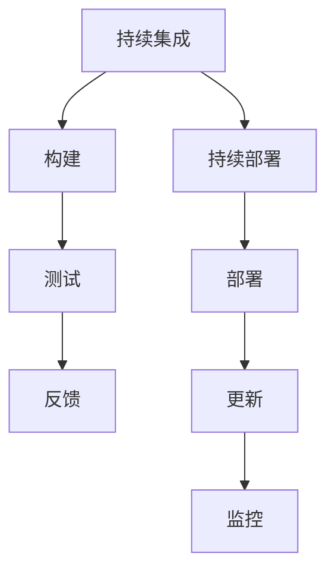
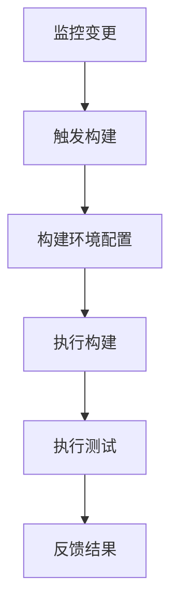
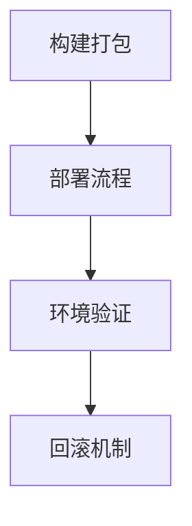
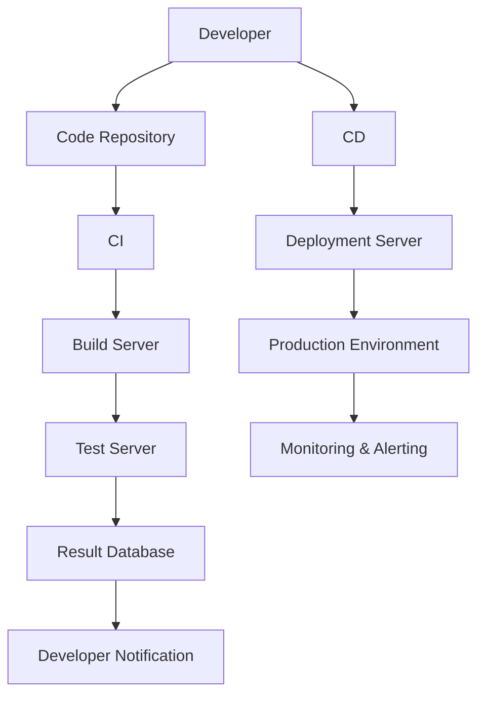
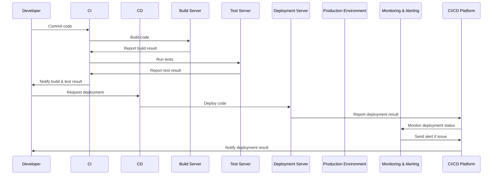

                 

## 持续集成与持续部署（CI/CD）实践

> 关键词：持续集成，持续部署，CI/CD，DevOps，自动化测试，容器化，Kubernetes

> 摘要：本文深入探讨了持续集成（CI）与持续部署（CD）的概念、原理、实践方法以及其在现代软件开发中的应用。通过详细的案例分析，揭示了CI/CD如何提升开发效率、确保代码质量，并加速产品交付。本文旨在为开发者提供实用的CI/CD实践指南，帮助他们在项目中有效实施这一关键流程。

在当今快速发展的软件开发领域，持续集成（Continuous Integration，CI）和持续部署（Continuous Deployment，CD）已成为不可或缺的实践方法。它们通过自动化和持续的过程优化，大大提升了软件开发的效率和可靠性。本文将系统地介绍CI/CD的基本概念、核心原理、实用工具和最佳实践，帮助读者深入理解并掌握这一重要技术。

### 第1章：CI/CD基本概念

#### 1.1 CI/CD的定义与重要性

**问题背景：**  
在现代软件开发中，团队通常需要快速迭代和频繁发布新功能，以满足不断变化的市场需求。然而，这带来了大量的代码合并、测试和部署工作，如果没有有效的管理机制，这些任务可能会导致代码质量下降、项目延迟，甚至出现严重的安全漏洞。

**问题描述：**  
为了解决上述问题，开发者需要一种方法来确保代码的稳定性、提高构建和部署的效率，以及快速响应变更。这便是持续集成（CI）和持续部署（CD）应运而生的原因。

**问题解决：**  
持续集成（CI）是一种软件开发实践，旨在通过频繁的自动化构建和测试，确保代码库中每个提交的代码都可以与现有代码兼容，并保持高质量的运行状态。持续部署（CD）则进一步将CI的概念扩展到部署阶段，实现自动化部署，确保新功能或修复可以在生产环境中安全、可靠地发布。

**边界与外延：**  
CI/CD不仅是开发流程的一部分，它还涉及到DevOps文化的推广和实践。DevOps是一种重视“软件开发（Development）”与“技术运营（Operations）”之间协作的文化、运动或惯例。CI/CD作为DevOps的核心组件，强调通过自动化、协作和持续反馈来优化软件交付过程。

**概念结构与核心要素组成：**  
- **持续集成（CI）：** 
  - **核心概念原理**：通过自动化工具持续构建和测试代码库中的每个提交。
  - **属性特征对比表格**：CI工具对比（如Jenkins、Travis CI、GitLab CI）。
  - **ER实体关系图架构的Mermaid流程图**：构建和测试流程的图形化表示。

- **持续部署（CD）：** 
  - **核心概念原理**：自动化部署流程，从开发环境到生产环境。
  - **属性特征对比表格**：CD工具对比（如Docker、Kubernetes、Ansible）。
  - **ER实体关系图架构的Mermaid流程图**：部署流程的图形化表示。

#### 1.2 CI/CD的核心概念与联系

**核心概念原理：**  
持续集成（CI）和持续部署（CD）是软件开发过程中的两个关键环节。CI通过自动化测试和构建确保代码库的稳定性和质量，而CD则将这种稳定性扩展到部署阶段，确保软件可以在生产环境中快速、安全地发布。

**概念属性特征对比表格：**  
| 特征        | CI                             | CD                             |  
| ----------- | ------------------------------ | ------------------------------ |  
| 目的        | 确保代码质量、快速反馈、发现bug | 自动化部署、快速发布、降低风险 |  
| 主要过程    | 构建、测试、反馈               | 部署、更新、监控               |  
| 工具选择    | Jenkins、Travis CI、GitLab CI   | Docker、Kubernetes、Ansible     |  
| 时间周期    | 频繁迭代                      | 短周期、持续更新               |  

**ER实体关系图架构的Mermaid流程图：**  


### 第2章：持续集成原理与实践

#### 2.1 持续集成原理

**算法原理讲解：**  
持续集成（CI）的核心在于通过自动化工具监控代码库中的每个提交，并执行一系列预定义的构建和测试任务。以下是CI的基本算法原理：

1. **监控代码库变更**：使用Git等版本控制系统监控代码库中的变更。
2. **触发构建**：当检测到新的提交时，自动触发构建流程。
3. **构建环境配置**：在CI服务器上配置构建环境，包括依赖安装、构建工具等。
4. **执行构建任务**：编译代码、运行测试脚本，生成可执行文件或打包文件。
5. **执行测试任务**：运行单元测试、集成测试、性能测试等，确保代码质量。
6. **反馈结果**：将构建结果和测试结果反馈给开发者或项目管理者。

**使用Mermaid画出的算法流程图：**  


**Python源代码讲解：**  
以下是一个简单的Python脚本示例，用于实现CI的基本流程：

```python  
import git  
import subprocess

# 监控代码库变更  
repo_url = "https://github.com/username/repo.git"  
git.Repo(repo_url).remote().fetch()

# 触发构建  
subprocess.run(["make", "build"])

# 执行测试  
subprocess.run(["make", "test"])  
```

**数学模型和公式：**  
在CI中，常用的数学模型和公式包括：

- **缺陷率（Defect Rate）**：衡量代码库中缺陷的数量与提交次数的比率。
- **测试覆盖率（Test Coverage）**：衡量测试用例覆盖代码的比例。

**举例说明：**  
假设一个代码库中有1000行代码，通过100个测试用例进行了测试。测试覆盖率可以计算为：

$$  
\text{测试覆盖率} = \frac{\text{测试用例覆盖的代码行数}}{\text{代码库总行数}} \times 100\%  
$$

如果测试用例覆盖了800行代码，则测试覆盖率为80%。

#### 2.2 持续集成工具与实践

**Jenkins、Travis CI等工具介绍：**  
- **Jenkins**：一款开源的持续集成工具，支持多种平台和编程语言，提供了丰富的插件生态系统。
- **Travis CI**：一款基于云计算的持续集成服务，支持GitHub和GitLab，适用于开源项目。
- **GitLab CI**：GitLab内置的持续集成工具，可以直接在项目的`.gitlab-ci.yml`文件中定义构建和测试流程。

**实际案例分享：**  
假设一个团队使用Jenkins实现CI流程。他们可以在Jenkins中创建一个名为“Project A”的作业，配置如下：

- **触发器**：当Git仓库中的代码有新的提交时，自动触发构建。
- **构建步骤**：
  1. 安装依赖项。
  2. 编译代码。
  3. 运行测试脚本。
  4. 如果测试失败，发送通知给开发者。

**最佳实践：**  
- **自动化测试**：确保所有代码提交都经过自动化测试，以快速发现和解决问题。
- **代码质量检查**：使用静态代码分析工具检查代码质量。
- **环境隔离**：使用容器技术（如Docker）确保构建和测试环境与生产环境一致。
- **持续反馈**：将构建和测试结果及时反馈给开发者，以便他们快速响应。

### 第3章：持续部署原理与实践

#### 3.1 持续部署原理

**算法原理讲解：**  
持续部署（CD）是通过自动化工具将新功能或修复部署到生产环境的过程。以下是CD的基本算法原理：

1. **构建打包**：将CI生成的构建打包为可部署的格式（如Docker镜像）。
2. **部署流程**：使用自动化工具将构建部署到预定义的部署环境。
3. **环境验证**：在部署后进行一系列验证步骤，确保新版本软件正常运行。
4. **回滚机制**：如果验证失败，自动回滚到上一个稳定版本。

**使用Mermaid画出的算法流程图：**  


**Python源代码讲解：**  
以下是一个简单的Python脚本示例，用于实现CD的基本流程：

```python  
import subprocess

# 部署构建  
subprocess.run(["docker", "build", "-t", "image-name", "."])  
subprocess.run(["docker", "run", "-d", "--name", "container-name", "image-name"])  
subprocess.run(["docker", "exec", "container-name", "command-to-validate"])  
if subprocess.run(["docker", "exec", "container-name", "command-to-check"], capture_output=True).stdout.strip() != "SUCCESS":  
    subprocess.run(["docker", "stop", "container-name"])  
    subprocess.run(["docker", "run", "-d", "--name", "container-name", "previous-image-name"])  
```

**数学模型和公式：**  
在CD中，常用的数学模型和公式包括：

- **部署成功率（Deployment Success Rate）**：衡量部署流程的成功比例。
- **部署速度（Deployment Speed）**：衡量部署新版本到生产环境所需的时间。

**举例说明：**  
假设一个团队在一个月内进行了10次部署，其中5次成功，5次失败。部署成功率为50%。

#### 3.2 持续部署工具与实践

**Docker、Kubernetes等工具介绍：**  
- **Docker**：一款开源容器化平台，用于打包、交付和管理应用。
- **Kubernetes**：一款开源的容器编排平台，用于自动化部署、扩展和管理容器化应用。

**实际案例分享：**  
假设一个团队使用Docker和Kubernetes实现CD流程。他们可以在Kubernetes集群中部署一个名为“Project A”的容器化应用，配置如下：

- **部署配置**：定义部署策略、副本数量、容器镜像等。
- **部署脚本**：编写Kubernetes部署脚本，用于自动化部署新版本。

**最佳实践：**  
- **容器化**：确保应用部署在容器中，提高部署的灵活性和可移植性。
- **蓝绿部署**：使用蓝绿部署策略，逐步替换旧版本，降低风险。
- **灰度发布**：逐步发布新版本到部分用户，观察其表现，确保稳定后再全面上线。
- **监控与报警**：实时监控部署过程，及时发现问题并报警。

### 第4章：CI/CD系统设计与实现

#### 4.1 CI/CD系统功能设计

**问题场景介绍：**  
假设一个团队负责开发一款电商应用，他们希望实现一个CI/CD系统，确保每次代码提交都经过自动化构建和测试，并在生产环境中安全、可靠地发布。

**项目介绍：**  
项目名称：电商应用（E-commerce Application）  
项目目标：实现一个自动化CI/CD系统，确保代码质量和快速迭代。

**系统功能设计（领域模型Mermaid类图）：**  
```mermaid  
classDiagram  
    CI <<System>>  
    CD <<System>>  
    Developer --|>> CI  
    Developer --|>> CD  
    Tester --|>> CI  
    Tester --|>> CD  
    CI --|>> CI/CD Platform  
    CD --|>> CI/CD Platform  
    Tester --|>> Test Tool  
    Developer --|>> Code Repository  
```

**系统功能说明：**  
- **CI功能**：监控代码库变更，自动构建和测试代码，将结果反馈给开发者。
- **CD功能**：自动化部署新版本到生产环境，进行环境验证，提供回滚机制。

#### 4.2 CI/CD系统架构设计

**系统架构设计（Mermaid架构图）：**  


**系统架构说明：**  
- **CI架构**：代码库变更触发构建和测试，结果存储在结果数据库中，并通知开发者。
- **CD架构**：构建部署到生产环境，进行环境验证和监控，提供回滚机制。

#### 4.3 CI/CD系统接口设计

**系统接口设计：**  
- **API接口**：CI/CD平台提供RESTful API接口，供开发者和管理员操作。
- **Web界面**：CI/CD平台提供Web界面，供用户监控和管理构建、部署过程。

#### 4.4 CI/CD系统交互设计

**系统交互设计（Mermaid序列图）：**  


**系统交互说明：**  
- **开发者提交代码**：触发CI流程，进行构建和测试。
- **构建和测试结果反馈**：通知开发者，确保代码质量。
- **部署请求**：开发者请求部署，触发CD流程。
- **部署和监控**：确保新版本安全、可靠地发布到生产环境。

### 第5章：CI/CD项目实战

#### 5.1 环境安装与配置

**环境安装步骤：**  
- **安装Jenkins**：下载Jenkins安装包，解压后启动Jenkins服务。
- **安装Docker**：下载Docker安装包，按照说明进行安装。
- **安装Kubernetes**：在虚拟机或云服务器上安装Kubernetes集群。

**配置说明：**  
- **Jenkins配置**：创建Jenkins作业，配置构建和测试脚本。
- **Docker配置**：配置Docker容器镜像，确保与Kubernetes兼容。
- **Kubernetes配置**：配置Kubernetes集群，创建部署配置文件。

#### 5.2 系统核心实现

**源代码解读与分析：**  
- **Jenkins构建脚本**：解析Jenkins作业配置，执行构建和测试任务。
- **Dockerfile**：定义Docker镜像构建过程，包括依赖安装和代码打包。
- **Kubernetes部署配置文件**：配置部署策略、副本数量等参数。

**代码应用讲解：**  
- **Jenkins构建脚本**：使用Maven构建Java项目，执行JUnit测试。
- **Dockerfile**：使用Java SDK和Tomcat打包应用，创建Docker镜像。
- **Kubernetes部署配置文件**：定义部署策略，使用Helm进行应用部署。

#### 5.3 实际案例分析

**案例介绍：**  
假设一个电商应用团队使用CI/CD系统进行项目开发，他们在一个月内进行了10次代码提交和部署。

**详细讲解剖析：**  
- **第1次提交**：开发者提交代码，Jenkins触发构建，Docker构建镜像，Kubernetes部署新版本。
- **第2次提交**：开发者提交代码，Jenkins触发构建，Docker构建镜像，Kubernetes部署新版本，旧版本回滚。
- **第3次提交**：开发者提交代码，Jenkins触发构建，Docker构建镜像，Kubernetes部署新版本，环境验证通过。
- **...（详细分析后续提交和部署过程）...**
- **第10次提交**：开发者提交代码，Jenkins触发构建，Docker构建镜像，Kubernetes部署新版本，环境验证通过。

**项目小结：**  
通过CI/CD系统，电商应用团队实现了快速迭代和自动化部署，提高了开发效率，降低了部署风险。

### 第6章：CI/CD最佳实践

#### 6.1 最佳实践分享

**团队协作：**  
- **代码审查**：确保每个提交都经过至少一个其他开发者的审查。
- **代码规范**：遵循统一的代码规范，提高代码质量。
- **自动化测试**：编写全面的测试用例，确保每次提交都经过自动化测试。

**代码质量管理：**  
- **静态代码分析**：使用静态代码分析工具检测潜在问题和代码风格。
- **代码覆盖率**：确保测试覆盖率达到一定比例，提高测试质量。
- **依赖管理**：管理第三方依赖项，确保版本兼容性。

**环境配置管理：**  
- **容器化**：使用容器化技术确保构建和测试环境与生产环境一致。
- **持续集成服务器**：配置持续集成服务器，自动化执行构建和测试任务。
- **基础设施即代码**：使用基础设施即代码工具（如Terraform、Ansible）管理基础设施配置。

**监控与报警：**  
- **实时监控**：监控构建、部署和运行状态，及时发现和处理问题。
- **报警系统**：配置报警系统，及时通知相关人员和团队。

### 第7章：CI/CD实践总结与展望

#### 7.1 CI/CD实践总结

**成功经验：**  
- **提高开发效率**：通过自动化流程，减少手动操作，加快开发进度。
- **确保代码质量**：自动化测试和代码审查提高代码质量，减少bug和缺陷。
- **快速响应变更**：通过持续集成和部署，快速响应市场需求，提高竞争力。

**常见问题与解决：**  
- **配置复杂性**：解决方法：使用容器化和基础设施即代码工具简化配置。
- **测试覆盖率不足**：解决方法：编写更多测试用例，提高测试覆盖率。
- **部署失败**：解决方法：完善回滚机制，确保部署过程安全可靠。

#### 7.2 CI/CD未来发展趋势

**技术发展：**  
- **AI辅助测试**：利用人工智能技术提高测试效率和准确性。
- **自动化运维**：进一步扩展CI/CD，实现自动化运维。
- **云原生技术**：云原生架构将进一步推动CI/CD的发展。

**行业应用：**  
- **金融行业**：通过CI/CD实现高频交易系统的快速迭代和发布。
- **医疗行业**：利用CI/CD提高医疗软件的开发和部署效率。
- **物联网**：CI/CD在物联网设备开发中发挥重要作用，确保设备软件的安全和可靠。

## 作者信息

- 作者：AI天才研究院/AI Genius Institute & 禅与计算机程序设计艺术 /Zen And The Art of Computer Programming

