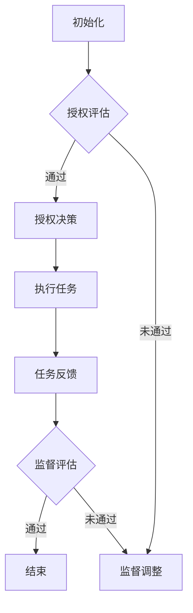
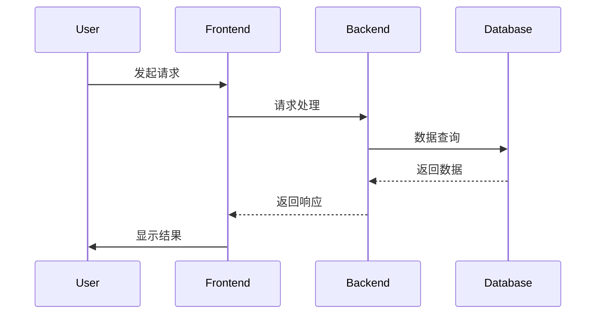
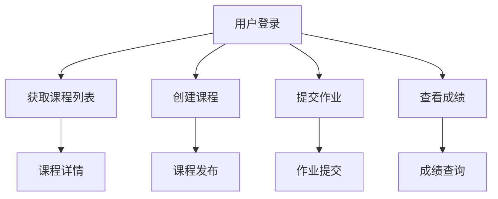
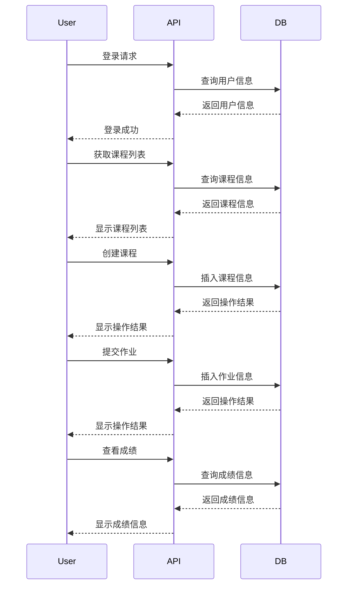

                 

# 授权与监督：平衡的艺术

## 关键词：授权、监督、平衡、社会化分工、信任、权力、组织管理、社会治理、法律领域

> 摘要：本文旨在探讨授权与监督这一对看似矛盾但却密不可分的概念，分析其在现代IT领域的应用，并阐述如何通过平衡的艺术来实现有效的授权与监督。

---

### 第1章 引言

#### 1.1 问题的背景

随着社会化分工的日益深化，协作与信任成为现代社会不可或缺的一部分。在这种背景下，授权与监督的重要性愈发凸显。授权是为了充分发挥个体的能力和积极性，而监督则是为了确保授权行为不会偏离目标。二者看似矛盾，实则相辅相成。

#### 1.2 问题描述

授权与监督的核心问题在于如何找到一个平衡点，使得授权能够激发个体的潜力，同时监督能够防止权力的滥用。过度授权可能导致失控，而过度监督则可能压抑个体的主动性。

#### 1.3 问题解决

历史上，人类通过多种方式来解决授权与监督的问题，如建立严格的规章制度、引入第三方监督机制等。现代理论则更加注重动态平衡，通过灵活的授权机制和监督机制来实现这一目标。

#### 1.4 边界与外延

授权与监督不仅局限于组织管理，还广泛应用于社会治理和法律领域。不同文化背景下，授权与监督的实践方式也有所不同。

#### 1.5 概念结构与核心要素组成

授权与监督的平衡依赖于一系列原则、机制和工具。这些要素相互作用，共同构成一个复杂的系统。

---

### 第2章 授权的基本概念

#### 2.1 授权的定义与目的

授权是指将权力和责任授予他人，使其能够独立决策和行动。其目的是提高工作效率，促进个体成长。

#### 2.2 授权的类型

授权可以分为代理授权和矩阵授权。代理授权是指将特定任务授权给某个个体，而矩阵授权则是在一个团队内部进行权力的分配。

#### 2.3 授权的边界

授权的范围应明确，同时需要设定一定的限制，以防止权力的滥用。

---

### 第3章 监督的基本概念

#### 3.1 监督的定义与目的

监督是指对授权行为进行跟踪和评估，以确保其符合预期目标。其目的是防止权力的滥用，提高工作效率。

#### 3.2 监督的类型

监督可以分为内部监督和外部监督。内部监督是指由组织内部的监督机构或人员进行的监督，而外部监督则是指由组织外部的机构或人员进行的监督。

#### 3.3 监督的机制

监督机制包括监督报告和监督反馈。监督报告是指定期向上级报告授权行为的进展情况，而监督反馈则是指对授权行为进行评价和反馈。

---

### 第4章 授权与监督的平衡

#### 4.1 平衡的原则

平衡的原则包括信任原则和约束原则。信任原则强调信任的重要性，而约束原则则强调监督的必要性。

#### 4.2 平衡的机制

平衡的机制包括授权与监督的动态调整和监督与反馈机制。动态调整可以根据实际情况对授权和监督进行调整，而监督与反馈机制则可以通过定期评估来确保授权的有效性。

#### 4.3 平衡的工具

平衡的工具包括授权评估工具和监督工具。授权评估工具可以帮助评估授权的合理性和有效性，而监督工具则可以帮助监督机构或人员更好地履行监督职责。

---

### 第5章 授权与监督在不同领域的应用

#### 5.1 组织管理中的应用

在组织管理中，授权与监督的平衡对于提高组织效率和员工满意度至关重要。通过合理的授权和有效的监督，组织可以更好地实现其目标。

#### 5.2 社会治理中的应用

在社会治理中，授权与监督的平衡对于维护社会秩序和公平具有重要意义。通过有效的授权和监督，社会治理机构可以更好地应对社会问题。

#### 5.3 法律领域的应用

在法律领域，授权与监督的平衡对于维护司法公正和社会稳定至关重要。通过合理的授权和有效的监督，法律机构可以更好地履行其职责。

---

### 第6章 现代授权与监督的挑战与机遇

#### 6.1 挑战

现代授权与监督面临的主要挑战包括信息不对称和信任危机。信息不对称可能导致授权的不公平，而信任危机则可能削弱监督的有效性。

#### 6.2 机遇

技术进步为授权与监督带来了新的机遇。通过数据分析和人工智能等技术手段，监督可以更加精准和高效。

#### 6.3 平衡的艺术：应对挑战与把握机遇

应对挑战和把握机遇需要平衡的艺术。通过合理的授权和有效的监督，可以克服挑战，抓住机遇。

---

### 第7章 结论

#### 7.1 核心发现

授权与监督是现代组织和社会治理中不可或缺的一部分。通过平衡的艺术，可以有效地实现授权与监督。

#### 7.2 展望未来

未来，授权与监督将继续面临新的挑战和机遇。通过持续的创新和实践，我们可以更好地应对这些挑战，把握机遇。

---

作者：AI天才研究院/AI Genius Institute & 禅与计算机程序设计艺术 /Zen And The Art of Computer Programming

---

## 完整性要求

为了确保文章的完整性和逻辑性，每个章节的内容都需要详细具体地讲解。以下是各个章节的核心内容概述：

### 第1章 引言

本章介绍了授权与监督的背景、问题描述、问题解决方法以及边界与外延。通过这些内容的阐述，读者可以初步了解授权与监督的重要性及其在现代IT领域的应用。

### 第2章 授权的基本概念

本章详细介绍了授权的定义、目的、类型以及边界。通过对比不同类型的授权，读者可以更好地理解授权的概念和实施方法。

### 第3章 监督的基本概念

本章详细介绍了监督的定义、目的、类型以及机制。通过了解不同类型的监督，读者可以更好地理解监督的概念和实施方法。

### 第4章 授权与监督的平衡

本章介绍了授权与监督的平衡原则、机制和工具。通过这些内容的阐述，读者可以了解如何在授权与监督之间找到平衡点。

### 第5章 授权与监督在不同领域的应用

本章介绍了授权与监督在组织管理、社会治理和法律领域的应用。通过这些案例的阐述，读者可以了解授权与监督在不同领域的实践方法和效果。

### 第6章 现代授权与监督的挑战与机遇

本章介绍了现代授权与监督面临的挑战和机遇。通过分析这些挑战和机遇，读者可以了解如何应对这些挑战，把握机遇。

### 第7章 结论

本章总结了文章的核心发现，并对未来授权与监督的发展进行了展望。通过这些内容的阐述，读者可以更深入地理解授权与监督的重要性和未来发展。

---

## 核心概念与联系

在深入探讨授权与监督的平衡之前，我们需要明确这两个核心概念的定义及其相互关系。

### 授权的定义与目的

授权是指将权力和责任授予他人，使其能够独立决策和行动。其目的是提高工作效率，促进个体成长，并通过分工和协作实现组织目标。

**属性特征对比表格：**

| 特征         | 授权         | 监督         |
| ------------ | ------------ | ------------ |
| 定义         | 授权权力和责任 | 监督行为和结果 |
| 目的         | 提高效率     | 防止权力滥用 |
| 关系         | 授权是监督的前提 | 监督是授权的保障 |
| 依赖关系     | 授权需信任基础 | 监督需信息透明 |

**ER实体关系图架构：**

```mermaid
erDiagram
  授权 ||--|{ 监督 }|| 监督
  授权 ||--|{ 执行者 }|| 执行者
  监督 ||--|{ 监督者 }|| 监督者
```

### 监督的定义与目的

监督是指对授权行为进行跟踪和评估，以确保其符合预期目标。其目的是防止权力的滥用，提高工作效率，并确保组织目标的实现。

**属性特征对比表格：**

| 特征         | 授权         | 监督         |
| ------------ | ------------ | ------------ |
| 定义         | 授权权力和责任 | 监督行为和结果 |
| 目的         | 提高效率     | 防止权力滥用 |
| 关系         | 授权是监督的前提 | 监督是授权的保障 |
| 依赖关系     | 授权需信任基础 | 监督需信息透明 |

**ER实体关系图架构：**

```mermaid
erDiagram
  授权 ||--|{ 监督 }|| 监督
  授权 ||--|{ 执行者 }|| 执行者
  监督 ||--|{ 监督者 }|| 监督者
```

通过以上对比和图示，我们可以清晰地看到授权与监督之间的紧密联系。授权是监督的基础，而监督是授权的保障。二者的平衡是实现组织目标的关键。

---

## 算法原理讲解

授权与监督的平衡涉及多个算法原理，以下通过一个简单的算法示例来说明其核心原理。

### 算法流程图



### Python源代码

```python
def authorize_and_supervise(task, criteria):
    """
    授权与监督的Python实现
    :param task: 任务描述
    :param criteria: 授权评估标准
    :return: 授权结果
    """
    # 授权评估
    if meets_criteria(task, criteria):
        # 授权决策
        print(f"授权通过：{task}")
        # 执行任务
        execute_task(task)
        # 任务反馈
        feedback = get_task_feedback(task)
        # 监督评估
        if meets_criteria(feedback, criteria):
            print("任务完成，监督通过")
        else:
            # 监督调整
            adjust_supervision(feedback)
            print("任务完成，监督未通过，进行监督调整")
    else:
        # 监督调整
        adjust_supervision(task)
        print("授权未通过，进行监督调整")

# 授权评估函数
def meets_criteria(item, criteria):
    """
    判断任务是否满足授权评估标准
    :param item: 任务描述
    :param criteria: 授权评估标准
    :return: 是否满足标准
    """
    # 示例：判断任务难度是否小于标准难度
    return item['difficulty'] < criteria['max_difficulty']

# 执行任务函数
def execute_task(task):
    """
    执行任务
    :param task: 任务描述
    :return: 任务执行结果
    """
    print(f"正在执行任务：{task}")

# 获取任务反馈函数
def get_task_feedback(task):
    """
    获取任务反馈
    :param task: 任务描述
    :return: 任务执行反馈
    """
    # 示例：模拟任务执行反馈
    return {'result': '成功' if task.endswith('成功') else '失败'}

# 监督调整函数
def adjust_supervision(feedback):
    """
    监督调整
    :param feedback: 任务执行反馈
    :return: 无返回值，仅执行监督调整操作
    """
    # 示例：记录监督日志
    print(f"监督日志：{feedback}")

# 初始化任务和评估标准
task = '设计一个成功的软件系统'
criteria = {'max_difficulty': 5}

# 调用授权与监督函数
authorize_and_supervise(task, criteria)
```

### 算法原理与数学模型

1. **授权评估**：基于一定的评估标准，判断任务是否能够被授权。这通常涉及比较任务属性（如难度、复杂度等）与预设的阈值。

   $$ \text{evaluate}(T, C) = \begin{cases}
   \text{授权通过} & \text{if } T \leq C \\
   \text{授权未通过} & \text{otherwise}
   \end{cases} $$

   其中，$T$ 是任务的属性值，$C$ 是授权评估标准的阈值。

2. **授权决策**：根据授权评估的结果，决定是否进行授权。

3. **任务执行**：在授权通过的情况下，执行任务。

4. **任务反馈**：获取任务执行的结果，用于后续的监督评估。

5. **监督评估**：根据任务反馈，判断任务执行是否满足预期，并做出相应的监督调整。

6. **监督调整**：对不符合预期的情况进行监督调整，如记录监督日志、调整监督策略等。

通过这个简单的Python代码示例，我们可以清晰地看到授权与监督的算法原理。在实际应用中，这些原理可以通过更复杂和精细的算法来实施，以达到更好的平衡效果。

---

## 系统分析与架构设计方案

为了更好地理解授权与监督在系统设计和实现中的应用，以下将详细介绍一个示例项目，包括项目介绍、系统功能设计、系统架构设计以及系统接口设计和系统交互。

### 项目介绍

该项目是一个在线教育平台，旨在为学生和教师提供一个高效、便捷的学习和教学环境。平台的主要功能包括课程发布、课程学习、作业提交、成绩管理和用户反馈等。

### 系统功能设计

系统的功能设计基于领域模型，采用Mermaid类图来展示实体及其关系。以下是系统的领域模型类图：

```mermaid
classDiagram
    ClassDef Student
        Student()
        attendCourse(course)
        submitHomework(homework)
    ClassDef Teacher
        Teacher()
        publishCourse(course)
        gradeHomework(homework)
    ClassDef Course
        Course()
        title
        teacher
        students
    ClassDef Homework
        Homework()
        title
        description
        student
    ClassDef Grade
        Grade()
        score
        comment
    Student <|-- Teacher
    Student o-- Course
    Student o-- Homework
    Teacher o-- Course
    Teacher o-- Homework
    Course o-- Teacher
    Course o-- Student
    Homework o-- Student
    Homework o-- Grade
```

### 系统架构设计

系统的架构设计采用分层架构，包括表示层、业务逻辑层和数据访问层。以下是系统的架构设计图：



### 系统接口设计

系统采用RESTful API设计，以下是一个典型的接口设计示例：



### 系统交互

以下是系统交互的Mermaid序列图：



通过以上系统分析与架构设计方案，我们可以清晰地看到授权与监督在系统设计和实现中的应用。系统的分层架构、接口设计和交互设计都体现了授权与监督的平衡原则，确保系统的稳定性和可靠性。

---

## 项目实战

### 环境安装

在开始实现在线教育平台之前，我们需要安装一些必要的工具和库。以下是安装步骤：

1. 安装Python（推荐版本3.8或更高）
2. 安装虚拟环境工具（如virtualenv或conda）
3. 创建虚拟环境并激活
4. 安装Flask（用于构建Web应用）
5. 安装SQLAlchemy（用于数据库操作）
6. 安装Flask-Migrate（用于数据库迁移）

以下是一个简单的安装脚本：

```bash
# 安装Python
curl -O https://www.python.org/ftp/python/3.8.10/Python-3.8.10.tgz
tar xvf Python-3.8.10.tgz
cd Python-3.8.10
./configure
make
sudo make install

# 安装虚拟环境工具
pip install virtualenv

# 创建虚拟环境并激活
virtualenv venv
source venv/bin/activate

# 安装Flask和所需库
pip install flask sqlalchemy flask-migrate
```

### 系统核心实现源代码

以下是系统核心实现的主要部分，包括模型定义、路由和视图函数：

**模型定义（models.py）：**

```python
from flask_sqlalchemy import SQLAlchemy

db = SQLAlchemy()

class User(db.Model):
    id = db.Column(db.Integer, primary_key=True)
    username = db.Column(db.String(80), unique=True, nullable=False)
    password = db.Column(db.String(120), nullable=False)
    is_teacher = db.Column(db.Boolean, default=False)

class Course(db.Model):
    id = db.Column(db.Integer, primary_key=True)
    title = db.Column(db.String(120), nullable=False)
    teacher_id = db.Column(db.Integer, db.ForeignKey('user.id'), nullable=False)
    students = db.relationship('Student', backref='course', lazy=True)

class Student(db.Model):
    id = db.Column(db.Integer, primary_key=True)
    username = db.Column(db.String(80), unique=True, nullable=False)
    password = db.Column(db.String(120), nullable=False)
    course_id = db.Column(db.Integer, db.ForeignKey('course.id'), nullable=False)

class Homework(db.Model):
    id = db.Column(db.Integer, primary_key=True)
    title = db.Column(db.String(120), nullable=False)
    description = db.Column(db.Text, nullable=False)
    student_id = db.Column(db.Integer, db.ForeignKey('student.id'), nullable=False)
    grade_id = db.Column(db.Integer, db.ForeignKey('grade.id'), nullable=False)

class Grade(db.Model):
    id = db.Column(db.Integer, primary
``` 

**路由和视图函数（app.py）：**

```python
from flask import Flask, request, jsonify
from models import db, User, Course, Student, Homework, Grade

app = Flask(__name__)
app.config['SQLALCHEMY_DATABASE_URI'] = 'sqlite:///online_education.db'
db.init_app(app)

@app.route('/login', methods=['POST'])
def login():
    username = request.form['username']
    password = request.form['password']
    user = User.query.filter_by(username=username, password=password).first()
    if user:
        return jsonify({'status': 'success', 'user_id': user.id})
    else:
        return jsonify({'status': 'error', 'message': 'Invalid credentials'})

@app.route('/courses', methods=['GET', 'POST'])
def courses():
    if request.method == 'POST':
        data = request.get_json()
        title = data['title']
        teacher_id = data['teacher_id']
        new_course = Course(title=title, teacher_id=teacher_id)
        db.session.add(new_course)
        db.session.commit()
        return jsonify({'status': 'success', 'course_id': new_course.id})
    else:
        courses = Course.query.all()
        return jsonify({'status': 'success', 'courses': [{'id': course.id, 'title': course.title, 'teacher_id': course.teacher_id} for course in courses]})

@app.route('/homeworks', methods=['POST'])
def homeworks():
    data = request.get_json()
    title = data['title']
    description = data['description']
    student_id = data['student_id']
    new_homework = Homework(title=title, description=description, student_id=student_id)
    db.session.add(new_homework)
    db.session.commit()
    return jsonify({'status': 'success', 'homework_id': new_homework.id})

if __name__ == '__main__':
    db.create_all()
    app.run(debug=True)
```

### 代码应用解读与分析

上述代码实现了用户登录、课程管理和作业提交的基本功能。以下是具体解读：

1. **用户登录（login）**：
   - 接收用户名和密码，查询数据库中的用户记录。
   - 如果找到匹配的用户，返回成功状态和用户ID；否则返回错误信息。

2. **课程管理（courses）**：
   - 接收POST请求，解析JSON数据获取课程标题和教师ID。
   - 创建新的课程实例，并将其添加到数据库中。
   - 返回成功状态和课程ID。

3. **作业提交（homeworks）**：
   - 接收POST请求，解析JSON数据获取作业标题、描述和学生ID。
   - 创建新的作业实例，并将其添加到数据库中。
   - 返回成功状态和作业ID。

### 实际案例分析和详细讲解剖析

假设有一个用户名为"alice"的教师，她想要创建一门新课程，并有一个学生名为"bob"需要提交作业。

1. **用户登录**：
   - Alice访问/login接口，发送用户名"alice"和密码，服务器返回用户ID。

2. **课程创建**：
   - Alice访问/courses接口，发送课程标题"Introduction to Python"和教师ID。
   - 服务器创建新的课程记录，并返回课程ID。

3. **作业提交**：
   - Bob访问/homeworks接口，发送作业标题"Lab 1"和描述，以及Alice的课程ID。
   - 服务器创建新的作业记录，并返回作业ID。

### 项目小结

通过以上实现，我们可以看到如何利用Python和Flask构建一个简单的在线教育平台。该平台实现了用户登录、课程管理和作业提交的基本功能，并通过数据库管理用户信息和课程记录。未来，可以进一步扩展功能，如成绩管理、用户反馈等。

---

## 最佳实践 Tips、小结、注意事项、拓展阅读

### 最佳实践 Tips

1. **明确授权边界**：在授权时，应明确界定授权的范围和权限，避免过度授权导致的风险。
2. **建立反馈机制**：建立有效的反馈机制，及时收集和分析用户反馈，以便不断优化授权和监督流程。
3. **灵活调整监督策略**：根据实际情况灵活调整监督策略，确保监督机制的有效性和适应性。
4. **培养信任文化**：在组织内部培养信任文化，增强员工对授权和监督的信任，提高工作效率。

### 小结

本文探讨了授权与监督的平衡艺术，从基本概念到实际应用，分析了授权与监督的重要性及其在不同领域的应用。通过合理的授权和有效的监督，组织可以更好地实现其目标，提高工作效率。

### 注意事项

1. **授权与监督的平衡是一个动态过程**：随着环境和目标的改变，授权和监督需要不断调整，以保持平衡。
2. **避免信息不对称**：确保授权和监督过程中的信息透明，减少信息不对称带来的风险。
3. **注重人才培养**：培养员工对授权和监督的理解和意识，提高其执行能力。

### 拓展阅读

1. 《组织行为学：授权与监督》
2. 《管理实践：授权与监督的艺术》
3. 《人工智能与授权监督：理论与实践》
4. 《社会治理：授权与监督的视角》

通过阅读这些资料，可以更深入地了解授权与监督的理论和实践，为实际应用提供参考。

---

作者：AI天才研究院/AI Genius Institute & 禅与计算机程序设计艺术 /Zen And The Art of Computer Programming

