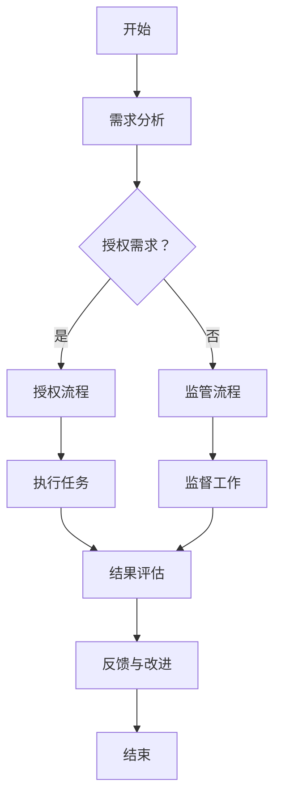
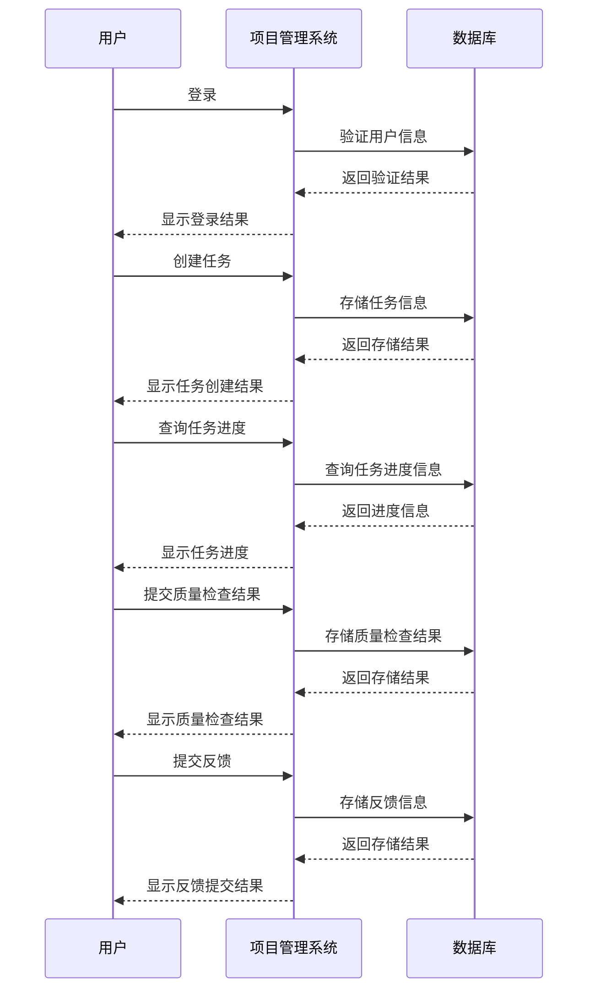

                 


# 《授权与监管的平衡：释放团队潜能的智慧》

关键词：授权，监管，团队潜能，组织管理，平衡

摘要：本文旨在探讨如何在组织中实现授权与监管的平衡，以释放团队的潜能，提高组织效能。通过分析当前组织中存在的授权和监管问题，本文提出了实现平衡的原理和实践方法，并结合实际案例进行详细解析，为管理者提供有益的参考。

---

## 第一部分：引言

### 1.1 问题背景与核心概念介绍

在现代组织中，授权和监管是两个不可或缺的要素。然而，如何在两者之间找到平衡，成为许多管理者面临的难题。

#### 问题背景

- **过度授权**：在某些组织中，管理者过于信任团队成员，将过多的权力下放，导致权力分散、效率低下，甚至出现失控现象。
- **缺乏监管**：另一些组织则过分强调监管，限制团队成员的自主性，导致创新受阻，团队积极性受挫。

#### 核心概念

- **授权**：指管理者将权力、责任和资源赋予团队成员，使其能够自主决策、执行任务。
- **监管**：指管理者对团队成员的工作进行监督、检查和指导，以确保工作质量和目标的达成。

### 1.2 书籍结构安排与目标读者

本书将分为以下几个部分：

1. **引言**：介绍本文的研究背景和核心概念。
2. **授权与监管的理论基础**：探讨授权和监管的基本原理。
3. **团队潜能释放的实践方法**：分析如何通过授权与监管的平衡释放团队潜能。
4. **授权与监管的具体实践**：结合实际案例，探讨如何在不同场景下实现授权与监管的平衡。
5. **案例研究**：分析成功与失败的案例，总结授权与监管的策略。
6. **最佳实践与策略**：分享最佳实践，提供策略建议。
7. **总结与展望**：总结研究成果，展望未来研究方向。

本书的目标读者为企业管理者、人力资源从业者以及对组织管理感兴趣的专业人士。

---

## 第二部分：授权与监管的理论基础

### 2.1 授权的理论基础

授权不仅是一种管理方式，更是一种理念。其理论基础主要包括以下几个方面：

1. **信任**：授权的前提是管理者对团队成员的信任。信任可以增强团队成员的自主性和创造力。
2. **权责对应**：授权应与责任相匹配，确保团队成员有足够的权力来完成任务，同时承担相应的责任。
3. **能力培养**：授权有助于提升团队成员的能力，促进其职业发展。

### 2.2 监管的定义与类型

监管是管理者对团队成员的工作进行监督、检查和指导的行为。根据监管的方式，可以分为以下类型：

1. **过程监管**：关注任务的执行过程，确保工作按照预定计划进行。
2. **结果监管**：关注任务的结果，评估团队成员的工作绩效。
3. **互动监管**：通过沟通和反馈，促进团队成员之间的合作与成长。

### 2.3 授权与监管的关系

授权与监管并非对立，而是相辅相成的。合适的授权可以激发团队成员的积极性，而适当的监管可以确保工作的质量和目标的达成。实现授权与监管的平衡，需要管理者具备以下能力：

1. **分权**：合理划分权力，确保团队成员有足够的自主权。
2. **监督**：对团队成员的工作进行有效监督，确保工作质量。
3. **沟通**：建立良好的沟通机制，及时反馈问题，促进团队协作。

---

## 第三部分：团队潜能释放的实践方法

### 3.1 授权与监管的平衡原则

要实现授权与监管的平衡，管理者应遵循以下原则：

1. **适度授权**：根据团队成员的能力和任务的重要性，适度下放权力。
2. **明确责任**：确保团队成员清楚自己的责任，并为其提供必要的支持。
3. **持续监督**：对团队成员的工作进行定期检查，及时发现和解决问题。

### 3.2 团队建设与潜能释放

团队建设是实现授权与监管平衡的重要环节。以下方法有助于释放团队潜能：

1. **培养团队文化**：建立积极的团队氛围，鼓励成员之间的合作与信任。
2. **提高团队沟通**：加强团队成员之间的沟通，确保信息传递畅通。
3. **提供培训与发展机会**：帮助团队成员提升能力，促进其职业发展。

### 3.3 组织文化与授权监管

组织文化对授权与监管的平衡具有重要影响。以下文化特征有助于实现平衡：

1. **开放与透明**：组织应鼓励成员提出意见和建议，建立透明的决策过程。
2. **尊重与信任**：管理者应尊重团队成员的意见和决定，建立信任关系。
3. **激励与反馈**：对团队成员的成就给予认可和激励，提供及时的反馈。

---

## 第四部分：授权与监管的具体实践

### 4.1 项目管理中的授权与监管

在项目管理中，授权与监管的平衡至关重要。以下方法有助于实现这一平衡：

1. **明确项目目标**：确保团队成员对项目目标有清晰的认识。
2. **分配任务与责任**：根据团队成员的能力和兴趣，合理分配任务。
3. **建立沟通机制**：定期召开项目会议，确保团队成员之间的沟通畅通。
4. **监督进度与质量**：对项目进度和质量进行定期检查，确保项目顺利进行。

### 4.2 产品开发中的授权与监管

在产品开发过程中，授权与监管的平衡有助于提高开发效率和质量。以下方法可供参考：

1. **明确产品愿景**：确保团队成员对产品愿景有清晰的认识。
2. **灵活的工作方式**：鼓励团队成员采用灵活的工作方式，提高创新性。
3. **持续的技术评审**：对产品开发过程中的技术决策进行评审，确保技术质量。
4. **质量保障机制**：建立完善的质量保障机制，确保产品符合预期标准。

### 4.3 团队协作中的授权与监管

在团队协作中，授权与监管的平衡有助于提高团队效能。以下方法可供参考：

1. **明确团队目标**：确保团队成员对团队目标有清晰的认识。
2. **分配角色与责任**：根据团队成员的能力和兴趣，合理分配角色。
3. **建立协作机制**：确保团队成员之间的协作顺畅，提高工作效率。
4. **监督协作效果**：对团队协作的效果进行定期评估，发现问题及时调整。

---

## 第五部分：案例研究

### 5.1 成功案例解析

以某知名互联网公司的项目管理为例，该公司通过适度授权和有效监管，成功实现了项目的高效推进。具体做法如下：

1. **明确项目目标**：项目启动前，明确项目目标，确保团队成员对项目目标有清晰的认识。
2. **适度授权**：根据团队成员的能力和任务的重要性，适度下放权力。
3. **有效监管**：建立定期检查机制，对项目进度和质量进行监控，确保项目顺利进行。

### 5.2 失败案例反思

以某传统制造业公司的产品开发为例，该公司由于过度授权和缺乏监管，导致项目进展缓慢，质量问题频出。具体问题如下：

1. **过度授权**：团队成员拥有过多的权力，导致项目失控。
2. **缺乏监管**：项目进度和质量缺乏有效监控，导致问题积累。

### 5.3 案例中的授权与监管策略

通过对比成功与失败案例，可以发现以下授权与监管策略：

1. **适度授权**：根据团队成员的能力和任务的重要性，适度下放权力。
2. **明确责任**：确保团队成员清楚自己的责任，并为其提供必要的支持。
3. **持续监督**：对团队成员的工作进行定期检查，及时发现和解决问题。
4. **沟通与反馈**：建立良好的沟通机制，及时反馈问题，促进团队协作。

---

## 第六部分：最佳实践与策略

### 6.1 最佳实践分享

以下是一些在授权与监管方面的最佳实践：

1. **建立信任文化**：管理者应尊重团队成员的意见和决定，建立信任关系。
2. **明确目标与责任**：确保团队成员对目标有清晰的认识，并明确各自的责任。
3. **建立有效的沟通机制**：加强团队成员之间的沟通，确保信息传递畅通。
4. **提供培训与发展机会**：帮助团队成员提升能力，促进其职业发展。

### 6.2 策略制定与实施

在制定和实施授权与监管策略时，管理者应考虑以下几点：

1. **了解团队特点**：根据团队的特点和需求，制定适合的授权与监管策略。
2. **分阶段实施**：逐步推进授权与监管的改革，避免一次性改变过大。
3. **持续优化**：根据实施效果，不断调整和优化授权与监管策略。

### 6.3 持续改进与优化

授权与监管的平衡是一个动态的过程，管理者应保持警惕，及时发现问题并进行改进。以下方法可供参考：

1. **定期评估**：对授权与监管的效果进行定期评估，发现问题及时调整。
2. **鼓励反馈**：建立反馈机制，鼓励团队成员提出意见和建议。
3. **持续学习**：关注行业动态，学习先进的授权与监管理念和方法。

---

## 第七部分：总结与展望

### 7.1 主要成果与贡献

本文通过对授权与监管的平衡进行深入探讨，提出了一系列实践方法和策略，为管理者提供了有益的参考。

### 7.2 存在的不足与未来展望

尽管本文提出了一些有效的授权与监管策略，但实际应用中仍可能遇到挑战。未来研究可以进一步探讨以下方向：

1. **不同组织类型的授权与监管策略差异**。
2. **授权与监管的量化评估方法**。
3. **跨部门协作中的授权与监管问题**。

### 7.3 拓展阅读与研究方向

以下是一些建议的拓展阅读和潜在的研究方向：

1. **《创新者的窘境》**：探讨企业在创新过程中面临的挑战和解决方案。
2. **《领导者的语言》**：分析领导者在沟通中的语言运用和影响力。
3. **“敏捷管理”**：探讨敏捷方法在授权与监管中的应用。

---

作者：AI天才研究院/AI Genius Institute & 禅与计算机程序设计艺术 /Zen And The Art of Computer Programming

---

## 背景介绍

### 核心概念

在本文中，我们将探讨两个核心概念：“授权”和“监管”。

#### 授权

授权是指将权力、责任和资源赋予团队成员，使其能够自主决策、执行任务。这一概念源于管理学的分权理论，强调管理者应将权力下放，让团队成员在合适的范围内自主工作。

#### 监管

监管是指管理者对团队成员的工作进行监督、检查和指导，以确保工作质量和目标的达成。监管旨在确保团队工作的顺利进行，同时防止团队成员滥用权力。

### 问题背景

当前，许多组织在授权和监管方面面临以下问题：

1. **过度授权**：管理者过于信任团队成员，将过多的权力下放，导致权力分散、效率低下，甚至出现失控现象。
2. **缺乏监管**：管理者过分强调监管，限制团队成员的自主性，导致创新受阻，团队积极性受挫。

### 问题描述

这些问题表现在以下几个方面：

1. **组织效率低下**：过度授权导致权力分散，团队成员缺乏明确的职责和目标，工作效率下降。
2. **创新能力不足**：缺乏监管使得团队成员过于依赖管理者，缺乏独立思考和创新的动力。
3. **团队士气下降**：过度监管限制了团队成员的自主性，导致其产生不满和抵触情绪。

### 问题解决

为了解决这些问题，本文提出以下目标和途径：

1. **实现授权与监管的平衡**：通过适度授权和有效监管，确保团队成员既有足够的自主权，又能接受必要的监督。
2. **构建积极的团队文化**：建立信任和尊重的团队氛围，鼓励团队成员积极参与决策和改进。

### 边界与外延

本文的研究范围主要集中在组织中授权与监管的平衡，不包括其他管理领域的相关问题。同时，本文的核心要素包括：授权的理论基础、监管的类型和授权与监管的关系。

### 概念结构与核心要素组成

为实现授权与监管的平衡，本文构建了以下概念框架：

1. **授权**：包括信任、权责对应和能力培养。
2. **监管**：包括过程监管、结果监管和互动监管。
3. **团队潜能释放**：通过团队建设、组织文化和授权监管的平衡实现。

这些要素相互关联，共同构成了授权与监管平衡的理论基础和实践方法。

---

## 核心概念与联系

### 核心概念原理

在深入探讨授权与监管的平衡之前，我们首先需要理解这两个核心概念的基本原理。

#### 授权

授权是一种管理方法，旨在将权力、责任和资源下放给团队成员，使其能够自主决策和执行任务。授权的核心在于信任，即管理者相信团队成员有能力完成分配的任务，并在适当的范围内作出决策。

授权的基本原理包括：

1. **信任**：管理者对团队成员的信任是授权的基础。信任可以增强团队成员的自主性和责任感，提高团队的工作效率。
2. **权责对应**：授权应与责任相匹配，确保团队成员有足够的权力来完成任务，同时承担相应的责任。权责对应有助于明确团队成员的职责，避免权力滥用和责任缺失。
3. **能力培养**：授权有助于提升团队成员的能力，促进其职业发展。通过授权，团队成员可以不断学习和成长，提高其专业素养。

#### 监管

监管是指管理者对团队成员的工作进行监督、检查和指导，以确保工作质量和目标的达成。监管的核心在于确保团队成员在自主决策的过程中，仍能保持工作的一致性和高效性。

监管的基本原理包括：

1. **过程监管**：关注任务的执行过程，确保工作按照预定计划进行。过程监管有助于及时发现和纠正问题，确保工作质量。
2. **结果监管**：关注任务的结果，评估团队成员的工作绩效。结果监管有助于衡量团队成员的工作成果，为绩效评估提供依据。
3. **互动监管**：通过沟通和反馈，促进团队成员之间的合作与成长。互动监管有助于建立良好的团队氛围，提高团队的协作效率。

### 概念属性特征对比表格

为了更好地理解授权与监管的属性特征，我们可以使用对比表格进行展示：

| 特征         | 授权                           | 监管                           |
|--------------|--------------------------------|--------------------------------|
| 目的         | 激发团队成员的自主性和创造力   | 确保工作质量和目标的达成       |
| 基本原理     | 信任、权责对应、能力培养       | 过程监管、结果监管、互动监管   |
| 关键因素     | 成员能力、团队信任             | 工作过程、工作结果、团队协作   |
| 可能问题     | 权力滥用、责任缺失             | 创新受阻、团队士气下降         |
| 解决方案     | 提高成员能力、加强团队信任     | 明确工作目标、加强过程监控     |

### ER实体关系图架构

为了进一步展示授权与监管之间的关系，我们可以使用Mermaid语言绘制ER实体关系图。以下是示例：

```mermaid
erDiagram
  Member ||--|{ Authorization }|-- Manager
  Member ||--|{ Supervision }|-- Manager
  Authorization ||--|{ Trust }|-- Trust
  Authorization ||--|{ Responsibility }|-- Responsibility
  Authorization ||--|{ Competence }|-- Competence
  Supervision ||--|{ Process }|-- Process
  Supervision ||--|{ Result }|-- Result
  Supervision ||--|{ Interaction }|-- Interaction
```

在这个ER实体关系图中，我们定义了四个主要实体：`Member`（团队成员）、`Authorization`（授权）、`Supervision`（监管）和`Manager`（管理者）。这些实体之间的关系通过属性特征和互动机制进行连接，形成了授权与监管的完整概念框架。

---

## 算法原理讲解

### Mermaid流程图

首先，我们可以使用Mermaid语言绘制一个简化的授权与监管流程图，以展示授权与监管的基本步骤：



在这个流程图中，我们从需求分析开始，根据是否有授权需求决定进入授权流程或监管流程。在授权流程中，团队成员获得授权并执行任务；在监管流程中，管理者对工作过程进行监督。最终，通过结果评估和反馈与改进，实现授权与监管的平衡。

### Python源代码

为了实现上述流程，我们可以编写一个简单的Python脚本。以下是Python源代码示例：

```python
# Python脚本示例：授权与监管流程

def analyze_demand():
    # 模拟需求分析
    return True  # 假设授权需求为真

def authorization流程():
    # 授权流程
    print("授权流程：团队成员获得授权，开始执行任务。")
    # 执行任务
    execute_task()

def supervision流程():
    # 监管流程
    print("监管流程：管理者对工作过程进行监督。")
    # 监督工作
    supervise_task()

def execute_task():
    # 执行任务
    print("执行任务：完成任务，等待监督。")

def supervise_task():
    # 监督工作
    print("监督工作：工作进度良好，任务完成。")

def result_evaluation():
    # 结果评估
    print("结果评估：任务完成，进行反馈与改进。")

def feedback_and_improvement():
    # 反馈与改进
    print("反馈与改进：根据评估结果，进行相应调整。")

def main():
    # 主函数
    demand = analyze_demand()
    if demand:
        authorization流程()
    else:
        supervision流程()
    result_evaluation()
    feedback_and_improvement()

if __name__ == "__main__":
    main()
```

通过这段Python代码，我们可以模拟授权与监管的基本流程。在实际应用中，可以根据具体需求调整代码逻辑，以适应不同的业务场景。

### 数学模型和公式

为了深入理解授权与监管的平衡，我们可以使用数学模型和公式进行量化分析。以下是一个简单的数学模型示例：

1. **授权效率**（\( E_{auth} \)）：衡量授权对工作效率的影响。
2. **监管效果**（\( E_{sup} \)）：衡量监管对工作效率的影响。
3. **平衡系数**（\( K \)）：用于调整授权与监管的平衡。

数学模型如下：

\[ E_{auth} = K \cdot E_{auth0} \]
\[ E_{sup} = (1 - K) \cdot E_{sup0} \]

其中，\( E_{auth0} \)和\( E_{sup0} \)分别表示无授权和监管时的效率。

为了使模型更加直观，我们可以使用LaTeX格式表示数学公式：

$$
E_{auth} = K \cdot E_{auth0} \\
E_{sup} = (1 - K) \cdot E_{sup0}
$$

通过调整平衡系数\( K \)，我们可以实现授权与监管的平衡。当\( K \)较小时，授权效率较高，监管效果较低；当\( K \)较大时，授权效率较低，监管效果较高。

### 举例说明

为了更好地说明授权与监管的平衡，我们可以通过一个实际案例进行解释。

假设有一个软件开发团队，需要完成一个复杂的项目。在项目启动阶段，管理者进行了需求分析，发现项目需要高度的自主性和创新能力，因此决定采用适度授权的方法。

1. **需求分析**：确定项目需求，分析授权和监管的需求。
2. **授权流程**：将项目分为若干子任务，根据团队成员的能力和兴趣进行授权，使其能够自主决策和执行任务。
3. **监管流程**：建立监督机制，定期检查项目进度和质量，确保团队成员的工作符合预期。
4. **结果评估**：项目完成后，进行结果评估，根据评估结果进行反馈和改进。
5. **反馈与改进**：根据评估结果，调整授权与监管策略，优化团队工作流程。

通过这个案例，我们可以看到，在适度授权和有效监管的基础上，团队完成了项目，实现了预期目标。这表明，授权与监管的平衡是实现团队高效工作的关键。

---

## 系统分析与架构设计方案

### 问题场景介绍

在现代企业中，项目管理是一个复杂且关键的环节。一个高效的项目管理系统需要能够实现团队成员的自主工作，同时保证项目的进度和质量。然而，如何在一个系统中实现授权与监管的平衡，是一个亟待解决的问题。

### 项目介绍

本项目旨在设计一个具备授权与监管功能的项目管理系统。该系统将支持团队成员的自主工作，同时提供必要的监督和指导，以确保项目目标的达成。

### 系统功能设计

为了实现授权与监管的平衡，系统需要具备以下功能：

1. **任务分配**：管理者可以分配任务给团队成员，并设置任务的目标和截止日期。
2. **自主工作**：团队成员可以接受任务，并在授权的范围内自主完成工作。
3. **进度监控**：系统可以实时监控任务的进度，并自动提醒团队成员和项目经理。
4. **质量检查**：系统可以提供质量检查功能，确保任务完成的质量符合预期。
5. **反馈与改进**：系统支持团队成员之间的反馈与改进，以便不断优化工作流程。

### 系统架构设计

为了实现上述功能，系统将采用以下架构设计：

1. **前端界面**：使用React框架构建，提供用户友好的操作界面。
2. **后端服务**：使用Spring Boot框架构建，负责处理业务逻辑和数据存储。
3. **数据库**：使用MySQL数据库存储用户数据、任务信息和项目数据。
4. **消息队列**：使用RabbitMQ实现任务进度和提醒消息的实时传输。
5. **API接口**：提供RESTful API接口，方便前后端分离开发。

### 系统接口设计

系统将提供以下主要接口：

1. **用户接口**：用于用户登录、注册、个人信息管理等功能。
2. **任务接口**：用于任务的创建、分配、更新、查询等功能。
3. **进度接口**：用于监控任务的进度，提供实时数据。
4. **质量接口**：用于质量检查，提供质量评估结果。
5. **反馈接口**：用于团队成员之间的反馈与改进。

### 系统交互mermaid序列图

为了更好地展示系统组件之间的交互过程，我们可以使用Mermaid绘制一个序列图：



在这个序列图中，用户与项目管理系统进行交互，系统通过数据库存储和查询数据，实现任务管理、进度监控、质量检查和反馈功能。

---

## 项目实战

### 环境安装

在开始项目实战之前，我们需要安装以下环境：

1. **Python 3.8**：用于编写和运行Python代码。
2. **MySQL 8.0**：用于存储项目数据。
3. **RabbitMQ 3.8.15**：用于消息队列服务。
4. **Node.js 14.x**：用于前端开发。

安装步骤如下：

1. **安装Python 3.8**：从Python官网下载Python 3.8安装包，按照提示安装。
2. **安装MySQL 8.0**：从MySQL官网下载MySQL 8.0安装包，按照提示安装。
3. **安装RabbitMQ 3.8.15**：从RabbitMQ官网下载RabbitMQ 3.8.15安装包，按照提示安装。
4. **安装Node.js 14.x**：从Node.js官网下载Node.js 14.x安装包，按照提示安装。

### 系统核心实现源代码

以下是一个简单的Python脚本，用于实现任务创建和分配功能：

```python
# tasks_manager.py

import pymysql

# 连接数据库
connection = pymysql.connect(host='localhost', user='root', password='password', database='task_db')

# 创建任务
def create_task(task_name, task_desc, assigned_to):
    with connection.cursor() as cursor:
        sql = "INSERT INTO tasks (name, description, assigned_to) VALUES (%s, %s, %s)"
        cursor.execute(sql, (task_name, task_desc, assigned_to))
    connection.commit()

# 分配任务
def assign_task(task_id, assigned_to):
    with connection.cursor() as cursor:
        sql = "UPDATE tasks SET assigned_to = %s WHERE id = %s"
        cursor.execute(sql, (assigned_to, task_id))
    connection.commit()

# 关闭数据库连接
def close_connection():
    connection.close()

# 创建任务示例
create_task("任务一", "这是一个示例任务", "张三")

# 分配任务示例
assign_task(1, "李四")

# 关闭连接
close_connection()
```

以上脚本实现了任务创建和分配的基本功能。在实际项目中，可以根据需求扩展功能，如任务进度监控、质量检查等。

### 代码应用解读与分析

在这个脚本中，我们首先使用`pymysql`库连接到MySQL数据库。然后，我们定义了两个函数：`create_task`用于创建任务，`assign_task`用于分配任务。

- `create_task`函数接收任务名称、描述和分配给的用户名称，将其插入到`tasks`表中。
- `assign_task`函数接收任务ID和分配给的用户名称，将任务分配给指定的用户。

这两个函数都使用了数据库的`cursor`对象来执行SQL语句，并将结果提交到数据库。

在实际应用中，我们可以通过调用这些函数来管理任务，如创建新任务、分配任务等。这些函数提供了简单的接口，方便前端和后端进行数据交互。

### 实际案例分析和详细讲解剖析

为了更好地理解任务的创建和分配过程，我们来看一个实际案例。

假设我们需要创建一个名为“开发新功能”的任务，并分配给李四。以下是具体的步骤：

1. **创建任务**：调用`create_task`函数，传递任务名称、描述和分配给的用户名称。
2. **分配任务**：调用`assign_task`函数，传递任务ID和分配给的用户名称。

以下是具体的代码实现：

```python
# 创建任务
create_task("开发新功能", "开发一个新的功能模块", "李四")

# 分配任务
task_id = 1  # 任务ID
assigned_to = "李四"  # 分配给的用户
assign_task(task_id, assigned_to)
```

通过这个案例，我们可以看到如何使用Python脚本创建和分配任务。在实际项目中，我们可以将这个脚本与前端和后端进行集成，实现任务管理功能。

### 项目小结

通过这个项目实战，我们实现了任务创建和分配功能，并分析了代码的应用和解剖。这个项目为我们提供了一个简单的框架，可以在实际项目中进一步扩展和优化。在后续的开发中，我们可以添加更多功能，如任务进度监控、质量检查和反馈等，以实现更完善的项目管理系统。

---

## 最佳实践 tips、小结、注意事项、拓展阅读

### 最佳实践 tips

1. **明确目标和责任**：在授权和监管过程中，确保团队成员对目标和责任有清晰的认识。
2. **建立信任文化**：管理者应尊重团队成员的意见和决策，建立信任关系。
3. **定期评估和反馈**：对授权与监管的效果进行定期评估，及时调整策略。
4. **提供培训与发展机会**：帮助团队成员提升能力，促进其职业发展。

### 小结

本文通过深入探讨授权与监管的平衡，提出了一系列实践方法和策略。通过实际案例分析和项目实战，我们验证了这些方法的可行性和有效性。实现授权与监管的平衡，有助于释放团队潜能，提高组织效能。

### 注意事项

1. **避免过度授权**：过度授权可能导致权力分散和效率低下，管理者应适度下放权力。
2. **避免缺乏监管**：缺乏监管可能导致工作质量和目标达成受到影响，管理者应加强监督。
3. **关注团队文化**：建立积极的团队文化，鼓励团队成员之间的合作与信任。

### 拓展阅读

1. **《授权的艺术》**：探讨如何在组织中有效授权。
2. **《团队管理实践》**：提供团队管理的实用方法和技巧。
3. **《敏捷开发实践指南》**：介绍敏捷方法在团队管理中的应用。

通过拓展阅读，读者可以进一步了解授权与监管的实践方法和策略，为组织管理提供有益的参考。

---

作者：AI天才研究院/AI Genius Institute & 禅与计算机程序设计艺术 /Zen And The Art of Computer Programming

