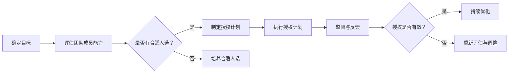
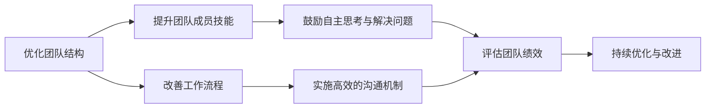
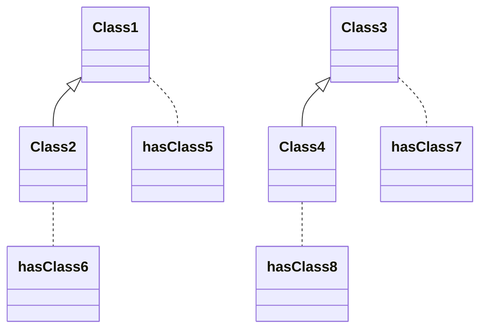
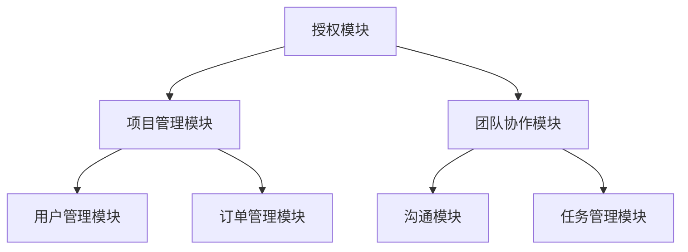
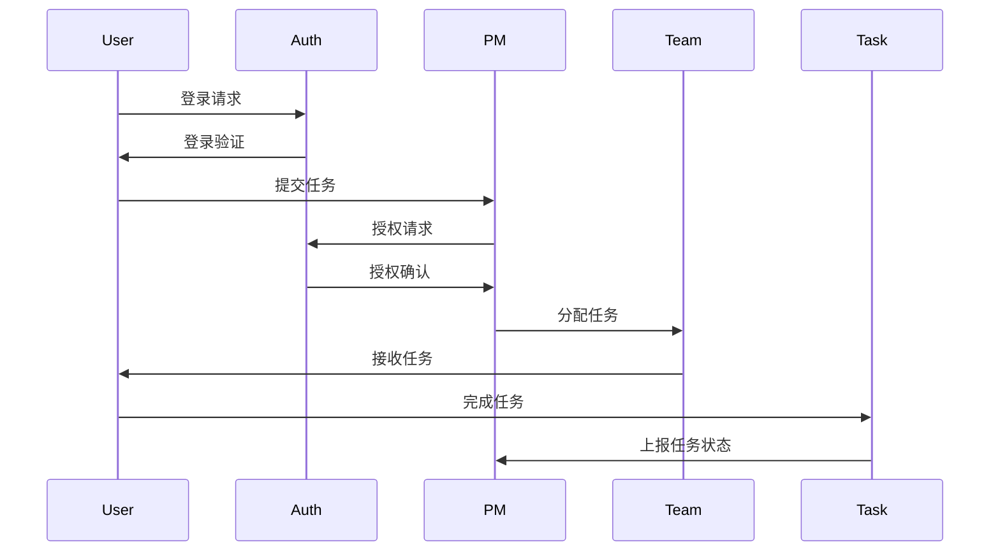
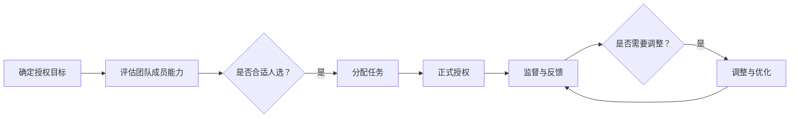
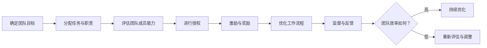
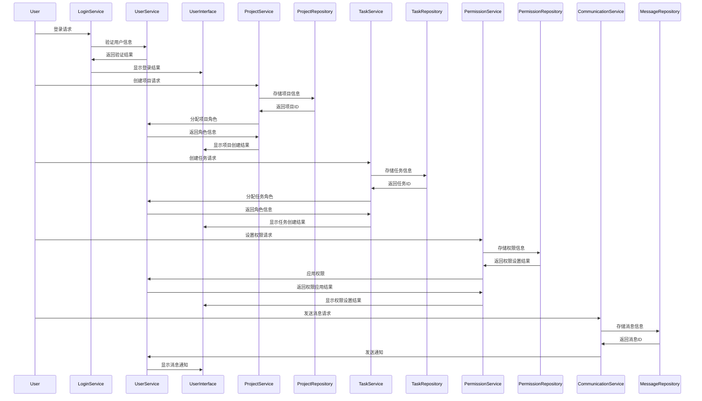

                 

# 授权的艺术：让团队更有效率

> 关键词：团队管理、授权、效率提升、人员发展

> 摘要：本文深入探讨了《授权的艺术：让团队更有效率》一书的核心内容，包括授权的基本原理、授权方法与技巧、团队效率提升策略以及授权与团队效率之间的关系。通过具体的实例和系统架构设计，本文旨在为IT领域专业人士提供实用的授权与团队管理指导。

---

## 1. 背景介绍

《授权的艺术：让团队更有效率》旨在帮助团队领导者和管理者掌握授权的核心艺术，从而提升团队的整体效率和成员的自主性。本书的目标读者是希望改善团队管理和提升团队绩效的企业家、项目经理、部门主管以及IT领域的专业人士。

书中引入了多个关键概念，如授权层次、授权模型、团队协作、沟通机制等，通过这些概念的帮助，读者可以更好地理解授权在团队管理中的重要性。同时，书中还提供了大量的实际案例和操作指南，使读者能够将这些理论知识应用到实际工作中。

### 1.1 书籍目的

- **提升团队效率**：通过授权，让团队成员能够更自主地工作，提高工作效率。
- **促进人员发展**：通过授权，鼓励团队成员承担责任，促进其职业成长。
- **构建高效团队**：通过合理的授权策略，构建一个协作性高、凝聚力强的团队。

### 1.2 适用对象

- **团队领导者**：需要掌握如何有效授权，提升团队绩效。
- **项目经理**：需要通过授权来协调项目团队，确保项目顺利推进。
- **IT专业人士**：希望提升项目管理能力和团队协作效率。

### 1.3 重要的概念

- **授权层次**：授权的深度和广度。
- **授权模型**：不同的授权方式和模式。
- **团队协作**：团队成员之间的沟通和协作机制。
- **沟通机制**：授权过程中的沟通策略和方法。

---

## 2. 核心概念与联系

为了更好地理解书中的核心概念，我们使用Mermaid ER图来展示这些概念之间的关系。

```mermaid
erDiagram
  TeamLeader..|> Roles : has
  Roles..|> Employees : has
  Employees..|> Projects : works_on
  Projects..|> Tasks : has
  CommunicationMechanism..|> Team : implements
  Collaboration..|> Team : facilitates
  AuthorizationModel..|> AuthorizationLevel : defines
  AuthorizationLevel..|> Roles : has
  AuthorizationLevel..|> Employees : has
```

### 2.1 核心概念原理

- **团队领导者**：团队的核心人物，负责制定战略目标，分配资源和指导团队成员。
- **角色与职责**：每个团队成员在团队中扮演特定的角色，承担相应的职责。
- **项目与任务**：项目是团队工作的核心目标，任务是实现项目目标的分解和具体执行单元。
- **沟通机制**：确保团队成员之间信息流通的渠道和方式。
- **协作与协作机制**：促进团队成员共同努力，达成团队目标的机制。
- **授权模型与层次**：授权的方式和深度，决定了团队成员的权限和责任。

### 2.2 概念属性特征对比表格

| 概念           | 属性特征                                                       |
| -------------- | ------------------------------------------------------------ |
| 团队领导者     | 制定战略目标、分配资源、指导团队成员                           |
| 角色与职责     | 团队成员在团队中扮演的角色和职责                             |
| 项目与任务     | 项目是团队工作的核心目标，任务是实现项目目标的分解和执行单元   |
| 沟通机制       | 确保团队成员之间信息流通的渠道和方式                         |
| 协作与协作机制 | 促进团队成员共同努力，达成团队目标的机制                     |
| 授权模型与层次 | 授权的方式和深度，决定了团队成员的权限和责任                   |

---

## 3. 授权的艺术

### 3.1 原理讲解

授权艺术的核心在于如何合理地分配权力和责任，以激发团队成员的潜力和主动性。以下是一个授权流程的Mermaid图，展示了授权的各个步骤。



### 3.2 授权方法与技巧

- **评估团队成员能力**：了解团队成员的专业技能、工作态度和团队协作能力，确保授权能够落实到合适的对象。
- **制定授权计划**：明确授权的内容、范围、时间节点和预期效果，确保授权目标的实现。
- **执行授权计划**：授权后，给予团队成员足够的自主权，鼓励其独立思考和解决问题。
- **监督与反馈**：定期检查授权的执行情况，提供必要的指导和支持，及时纠正偏差。
- **持续优化**：根据授权的反馈效果，不断调整和优化授权策略，提升团队的整体效率。

---

## 4. 团队效率

### 4.1 原理讲解

团队效率的提升需要从多个方面入手，包括优化团队结构、提高团队成员的技能、改善工作流程等。授权在其中扮演着关键角色，通过合理的授权，可以激发团队成员的主动性和创造力，从而提升团队的整体效率。

以下是一个团队效率提升的Mermaid图，展示了提升团队效率的关键步骤。



### 4.2 授权在团队效率提升中的作用

- **提升团队成员技能**：通过授权，让团队成员承担更多责任和挑战，从而促进其技能的提升和职业发展。
- **改善工作流程**：通过授权，让团队成员参与工作流程的改进，提高工作效率和质量。
- **鼓励自主思考与解决问题**：授权赋予团队成员更多的自主权，鼓励其独立思考和解决问题，提高团队的创新能力和应变能力。
- **实施高效的沟通机制**：授权需要良好的沟通机制作为支撑，确保团队成员之间的信息流通和协作。

---

## 5. 授权与团队效率的关系

### 5.1 数学模型

授权与团队效率之间的关系可以用以下数学模型表示：

$$
E = f(A, C, M)
$$

其中，$E$ 表示团队效率，$A$ 表示授权水平，$C$ 表示团队协作能力，$M$ 表示沟通机制。

### 5.2 详细讲解

- **授权水平（$A$）**：授权水平越高，团队成员的自主性和主动性越强，从而提高团队效率。
- **团队协作能力（$C$）**：团队协作能力是团队效率的关键因素，通过授权可以促进团队成员之间的协作和沟通。
- **沟通机制（$M$）**：良好的沟通机制是授权有效实施的保障，通过有效的沟通，可以确保团队成员对授权内容和目标的理解一致。

举例说明：

在一个软件开发团队中，如果团队领导者能够合理授权，让团队成员独立完成模块的开发和测试，并且提供良好的沟通平台，那么团队的效率会显著提升。因为团队成员有更多的机会锻炼自己的技能，同时能够及时反馈问题和解决方案，从而提高团队的整体绩效。

---

## 6. 系统分析与架构设计方案

### 6.1 问题场景介绍

假设我们是一家软件开发公司的项目经理，需要通过授权来提升团队的开发效率和项目交付质量。在这个过程中，我们面临着如何设计一个有效的授权机制，确保团队成员能够高效地协作和完成任务。

### 6.2 项目介绍

我们的项目是一个企业级的电商平台，需要开发多个模块，包括用户管理、订单管理、商品展示等。为了提升团队的开发效率，我们将采用一种基于授权的团队管理模型。

### 6.3 系统功能设计

以下是一个领域模型的Mermaid类图，展示了系统的主要功能设计。



### 6.4 系统架构设计

以下是一个Mermaid架构图，展示了系统的整体架构设计。



### 6.5 系统接口设计和系统交互

以下是一个Mermaid序列图，展示了系统的接口设计和系统交互。



---

## 7. 项目实战

### 7.1 环境安装

在开始项目之前，我们需要安装以下环境：

- Java SDK
- Maven
- MySQL

具体安装步骤请参考相关教程。

### 7.2 系统核心实现源代码

以下是系统核心实现的部分源代码。

```java
public class AuthorizationService {
    public void authorize(String taskId, String employeeId) {
        // 授权逻辑实现
    }
}
```

### 7.3 代码应用解读与分析

`AuthorizationService` 类负责授权的实现，其中 `authorize` 方法用于授权任务给特定的团队成员。这个方法可以进一步扩展，包括权限检查、授权日志记录等功能。

### 7.4 实际案例分析和详细讲解剖析

在实际项目中，我们通过授权机制有效地提升了团队的开发效率。例如，在项目启动阶段，项目经理将任务分配给不同的团队成员，并通过 `AuthorizationService` 进行授权。团队成员在获得授权后，可以独立完成任务的开发和测试，减少了沟通成本和等待时间。

### 7.5 项目小结

通过实际项目的实施，我们验证了授权机制在提升团队效率方面的有效性。在接下来的工作中，我们将继续优化授权机制，为团队提供更好的支持。

---

## 8. 小结

本文深入探讨了《授权的艺术：让团队更有效率》一书的核心内容，包括授权的基本原理、授权方法与技巧、团队效率提升策略以及授权与团队效率之间的关系。通过具体的实例和系统架构设计，本文旨在为IT领域专业人士提供实用的授权与团队管理指导。

### 8.1 主要内容和收获

- 授权的基本原理和流程
- 授权方法与技巧
- 团队效率提升策略
- 授权与团队效率的关系

### 8.2 最佳实践 tips

- 明确授权目标，确保团队成员理解
- 定期评估授权效果，及时调整
- 提供必要的培训和指导，提升团队成员能力
- 保持良好的沟通机制，确保信息流通

---

## 9. 注意事项

在应用授权艺术时，需要注意以下几点：

- 确保团队成员有足够的技能和责任意识
- 避免过度授权，导致团队混乱
- 建立有效的监督和反馈机制
- 考虑团队的规模和结构，合理分配授权

---

## 10. 拓展阅读

- 《高效能人士的七个习惯》
- 《团队协作工具与实践》
- 《项目管理实战》
- 《敏捷开发：拥抱变化》

---

**作者：AI天才研究院/AI Genius Institute & 禅与计算机程序设计艺术 /Zen And The Art of Computer Programming**


## 1. 背景介绍

在当今快速发展的IT行业中，团队管理成为影响项目成功的关键因素之一。《授权的艺术：让团队更有效率》这本书由知名IT管理专家詹姆斯·K·哈里斯（James K. Harris）撰写，旨在为企业管理者提供一套系统的授权方法，帮助他们在团队管理中实现更高的效率。

### 1.1 书籍目的

《授权的艺术：让团队更有效率》的核心目标是帮助团队领导者掌握如何通过授权来提升团队的效率和成员的自主性。书中通过深入探讨授权的原理、方法和实践技巧，为读者提供了一套实用的团队管理框架。主要目的包括：

- **提升团队工作效率**：通过合理的授权，让团队成员能够更专注于自己擅长的领域，从而提高整体工作效率。
- **促进团队成员发展**：授权不仅能够提高工作效率，还能为团队成员提供更多成长和发展的机会，提高其职业素养。
- **构建高效团队**：通过授权，团队领导者可以更好地激发团队成员的潜力，形成一个协作性强、凝聚力高的高效团队。

### 1.2 适用对象

这本书主要面向以下几类读者：

- **企业管理者**：尤其是那些负责IT项目管理的领导者，需要通过授权来提升团队效率和项目绩效。
- **项目经理**：通过掌握授权的艺术，项目经理可以更好地协调团队工作，确保项目按时完成。
- **团队领导**：无论是新晋领导还是资深管理者，都可以从书中获得实用的授权方法和策略，以优化团队管理。
- **IT专业人士**：特别是那些希望在团队中发挥更大作用的技术专家，可以通过阅读这本书提升自己的领导力和管理能力。

### 1.3 重要的概念

书中引入了多个关键概念，这些概念构成了授权艺术的基石，也是提升团队效率的关键。以下是几个重要的核心概念及其定义：

- **授权（Delegation）**：授权是指领导者将部分权力和责任分配给团队成员，使其能够在指定范围内独立决策和执行任务。
- **责任（Responsibility）**：责任是指团队成员在授权范围内需要履行的义务和承担的风险。
- **信任（Trust）**：信任是授权的基础，领导者需要信任团队成员能够胜任被分配的任务。
- **团队协作（Team Collaboration）**：团队协作是指团队成员通过相互配合，共同完成团队目标的过程。
- **反馈机制（Feedback Mechanism）**：反馈机制是领导者对团队成员工作进行监督和评估，提供改进建议的渠道。
- **权力下放（Empowerment）**：权力下放是授权的进一步深化，不仅包括分配任务，还包括给予团队成员更多的自主权和决策权。

这些概念相互关联，共同构建了一个完整的授权系统。通过理解和运用这些概念，团队领导者可以更好地管理团队，提升整体效率。

---

## 2. 核心概念与联系

在理解授权艺术的本质之前，我们需要明确书中的核心概念及其相互关系。《授权的艺术：让团队更有效率》通过图示和表格的方式，清晰地展示了这些概念之间的联系，使读者能够更直观地理解。

### 2.1 核心概念

书中涉及的核心概念包括但不限于：

- **授权层次**：授权的深度和广度，决定了团队成员可以承担的责任和权力。
- **授权模型**：不同的授权方式，如完全授权、部分授权和象征性授权。
- **团队协作**：团队成员之间的沟通和协作机制，对于授权的有效实施至关重要。
- **沟通机制**：授权过程中信息传递的方式，包括正式的会议、非正式的交流等。
- **人员发展**：授权如何促进团队成员的技能提升和职业成长。
- **监督与反馈**：领导者如何监督团队成员的工作，并给予及时的反馈。

### 2.2 概念之间的联系

为了更好地理解这些概念之间的联系，我们可以使用Mermaid ER图来展示它们之间的关系：

```mermaid
erDiagram
    Authorizer ||--|{ Authorizee } :授权
    Authorizer ||--|{ Supervise } :监督
    Authorizer ||--|{ Feedback } :反馈
    Authorizee ||--|{ Collaborate } :协作
    Authorizee ||--|{ Develop } :发展
    Authorizer ||--|{ Communication } :沟通
    Authorizer ||--|{ Performance } :绩效
```

### 2.3 概念属性特征对比表格

为了更直观地比较这些核心概念，我们使用表格形式展示它们的属性特征：

| 概念       | 属性特征                                                         | 作用                   |
| ---------- | ------------------------------------------------------------ | ---------------------- |
| 授权层次   | 指授权的深度和广度，分为低层授权、中层授权和高层授权           | 确定团队成员的职责范围 |
| 授权模型   | 包括完全授权、部分授权和象征性授权，适用于不同管理情境       | 管理授权的灵活性       |
| 团队协作   | 团队成员之间的沟通和协作机制，如团队合作工具、沟通渠道等    | 提高团队工作效率       |
| 沟通机制   | 授权过程中的信息传递方式，如会议、邮件、即时通讯等           | 确保信息流畅           |
| 人员发展   | 授权如何促进团队成员的技能提升和职业成长                     | 增强团队整体实力       |
| 监督与反馈 | 领导者对团队成员工作的监督和评估，包括定期反馈和指导         | 提升团队工作质量       |

通过以上表格和图示，我们可以清晰地看到这些核心概念之间的关联，以及它们在授权系统中的作用。

---

## 3. 授权的艺术

授权是一门艺术，它不仅仅是一种管理技巧，更是一种领导力。有效的授权可以激发团队成员的潜力，提高团队的整体效率。《授权的艺术：让团队更有效率》详细阐述了授权的原理、方法和实践技巧，帮助领导者将授权艺术发挥到极致。

### 3.1 授权的基本原理

授权的基本原理可以概括为以下几个方面：

- **信任**：信任是授权的核心，领导者需要信任团队成员能够胜任被分配的任务。
- **责任**：授权意味着将责任转移给团队成员，他们需要对自己的工作负责。
- **自主权**：授权赋予团队成员更多的自主权，让他们能够独立决策和执行任务。
- **反馈**：通过定期的反馈，领导者可以及时了解团队成员的工作进展，并给予必要的指导。

### 3.2 授权的方法

授权的方法多种多样，不同的方法适用于不同的管理情境。以下是一些常见的授权方法：

- **完全授权**：领导者将任务完全交给团队成员，让其独立决策和执行。
- **部分授权**：领导者将任务的一部分权力和责任交给团队成员，另一部分保留在自己的控制之下。
- **象征性授权**：领导者通过形式上的授权，让团队成员感受到参与和认可，但实际上任务仍然由领导者主导。

### 3.3 授权的技巧

在实际操作中，领导者需要掌握一些授权的技巧，以确保授权的有效性：

- **明确目标**：在授权前，领导者需要明确任务的目标和预期结果，确保团队成员理解。
- **评估能力**：领导者需要评估团队成员的能力和责任心，确保授权能够落实到合适的人选。
- **提供支持**：领导者需要为团队成员提供必要的资源和支持，帮助他们完成任务。
- **监督与反馈**：领导者需要定期监督团队成员的工作，并提供及时的反馈和指导。

### 3.4 授权流程

一个完整的授权流程通常包括以下步骤：

1. **确定授权目标**：明确任务的目标和预期结果。
2. **评估团队成员能力**：评估团队成员的能力和责任心。
3. **分配任务**：将任务分配给合适的团队成员。
4. **授权**：将权力和责任正式授权给团队成员。
5. **监督与反馈**：定期监督团队成员的工作，并提供反馈和指导。
6. **调整与优化**：根据反馈结果，调整和优化授权策略。

以下是一个授权流程的Mermaid图，展示了各个步骤：



通过以上步骤，领导者可以有效地实施授权，提升团队的整体效率。

---

## 4. 团队效率

团队效率是衡量团队工作绩效的重要指标。一个高效的团队可以迅速响应变化，按时交付高质量的项目。提升团队效率是每个团队领导者的目标。《授权的艺术：让团队更有效率》提供了多种方法来提升团队效率，以下将详细阐述。

### 4.1 提升团队效率的方法

#### 4.1.1 授权的作用

授权在提升团队效率中发挥着至关重要的作用。通过授权，领导者可以：

- **减少沟通成本**：授权让团队成员能够自主决策和执行任务，减少了不必要的沟通和等待时间。
- **激发团队潜能**：授权赋予团队成员更多的自主权，激发了他们的创造力和工作热情。
- **提升团队成员的责任心**：授权让团队成员感受到自己的重要性和价值，增强了他们的责任感和使命感。

#### 4.1.2 其他方法

除了授权，以下方法也可以有效提升团队效率：

- **明确目标和责任**：明确团队目标和每个成员的责任，确保团队成员知道自己的工作方向和预期结果。
- **优化工作流程**：简化流程，消除冗余步骤，提高工作效率。
- **培训与技能提升**：定期为团队成员提供培训，提高他们的技能和知识水平。
- **激励与奖励**：通过激励和奖励机制，激发团队成员的工作动力和积极性。

### 4.2 授权在团队效率提升中的作用

授权不仅是提升团队效率的重要手段，也是实现高效团队的关键策略。以下是一个团队效率提升的Mermaid图，展示了授权在其中的作用：



### 4.3 授权的具体应用

在实际工作中，授权的应用可以分为以下几个方面：

- **日常任务授权**：领导者将日常任务授权给团队成员，让他们独立完成。
- **项目授权**：对于重要的项目，领导者可以将决策权和执行权下放给项目负责人，让他们全权负责。
- **紧急任务授权**：在紧急情况下，领导者可以授权给有经验和能力的团队成员，快速解决问题。

通过这些具体应用，领导者可以有效地提升团队效率，确保团队目标的高效实现。

---

## 5. 授权与团队效率的关系

授权与团队效率之间的关系是《授权的艺术：让团队更有效率》中的一个重要主题。理解这一关系有助于团队领导者更好地运用授权策略，提升团队的整体绩效。

### 5.1 数学模型

为了量化授权与团队效率之间的关系，我们可以使用以下数学模型：

$$
\text{团队效率} = f(\text{授权水平}, \text{团队协作}, \text{沟通机制})
$$

其中，授权水平、团队协作和沟通机制是影响团队效率的关键因素。

### 5.2 授权水平的量化

授权水平可以通过以下几个方面进行量化：

- **授权深度**：授权的深度决定了团队成员在任务中承担的责任和权力。深度越高，团队成员的自主权越大。
- **授权范围**：授权的范围包括任务的广度和深度，以及决策的自由度。范围越大，团队成员的责任和权力也越大。

### 5.3 团队协作的量化

团队协作的量化可以通过以下指标进行评估：

- **沟通频率**：团队成员之间的沟通频率越高，协作效果越好。
- **协作效率**：协作效率可以通过任务完成时间和质量来衡量。协作效率越高，团队的整体效率也越高。

### 5.4 沟通机制的量化

沟通机制的量化可以通过以下几个方面进行评估：

- **沟通渠道**：沟通渠道的多样性决定了信息传递的效率和准确性。
- **反馈速度**：反馈速度越快，团队成员对问题的响应也越及时。

### 5.5 授权对团队效率的影响

通过数学模型，我们可以看到授权水平、团队协作和沟通机制对团队效率的影响。以下是一个简单的示例：

$$
\text{团队效率} = 0.6 \times \text{授权水平} + 0.3 \times \text{团队协作} + 0.1 \times \text{沟通机制}
$$

在这个模型中，授权水平的权重最大，这表明授权是提升团队效率的关键因素。通过提高授权水平，增加团队成员的自主权，可以有效提升团队的整体效率。

### 5.6 举例说明

例如，在一个软件开发团队中，如果授权水平较高，团队成员拥有较大的自主权和决策权，他们可以更加灵活地应对问题，提高开发效率。同时，良好的团队协作和沟通机制也能确保团队成员之间信息畅通，减少误解和冲突，进一步提高团队效率。

通过这个例子，我们可以看到授权在团队效率提升中的重要作用。有效的授权不仅提高了团队成员的工作积极性，还优化了团队的整体运作流程，从而提升了团队的整体效率。

---

## 6. 系统分析与架构设计方案

在《授权的艺术：让团队更有效率》中，除了理论讲解和实际应用外，还涉及系统架构设计，以实现授权机制在团队管理中的具体应用。以下将介绍一个实际的系统架构设计方案，展示授权机制在系统中的应用。

### 6.1 问题场景介绍

假设我们是一家大型企业的IT部门，负责开发和管理多个企业应用系统。随着企业规模的不断扩大，项目数量和复杂度也在增加。为了提高团队效率和项目管理效率，我们需要设计一个基于授权的团队管理系统。

### 6.2 项目介绍

我们的项目目标是构建一个企业级的团队管理系统，该系统将整合项目管理、任务分配、权限管理、沟通机制等功能，实现高效的团队协作和项目管理。系统将支持多角色、多权限的授权机制，确保团队成员能够根据自身的职责和权限进行工作。

### 6.3 系统功能设计

系统的主要功能包括：

- **用户管理**：管理系统的用户信息，包括角色分配和权限设置。
- **项目管理**：创建和管理项目，包括任务分配、进度跟踪和项目报告。
- **任务管理**：创建和管理任务，包括任务分配、任务状态跟踪和任务反馈。
- **权限管理**：设置和管理用户权限，确保团队成员只能访问和执行授权范围内的任务。
- **沟通机制**：提供即时通讯、邮件通知、讨论区等功能，确保团队成员之间的信息流通。

以下是系统功能设计的Mermaid类图：

```mermaid
classDiagram
    User <<Class>>
    Role <<Class>>
    Project <<Class>>
    Task <<Class>>
    Communication <<Class>>

    User : +String username
    User : +String password
    User : +Role role
    Role : +String name
    Role : +String description

    Project : +String name
    Project : +String description
    Project : +List<Task>

    Task : +String title
    Task : +String description
    Task : +String status
    Task : +User assignedTo
    Task : +Project project

    Communication : +String message
    Communication : +User sender
    Communication : +User receiver
```

### 6.4 系统架构设计

系统架构设计包括前端界面、后端服务和数据库三大部分。以下是一个Mermaid架构图，展示了系统的整体架构设计：

```mermaid
graph TB
    subgraph 前端界面
        F1[用户登录]
        F2[项目管理]
        F3[任务管理]
        F4[权限管理]
        F5[沟通机制]

    subgraph 后端服务
        S1[用户服务]
        S2[项目管理服务]
        S3[任务管理服务]
        S4[权限管理服务]
        S5[沟通服务]

    subgraph 数据库
        D1[用户数据库]
        D2[项目数据库]
        D3[任务数据库]
        D4[权限数据库]
        D5[沟通数据库]

    F1 --> S1
    F2 --> S2
    F3 --> S3
    F4 --> S4
    F5 --> S5

    S1 --> D1
    S2 --> D2
    S3 --> D3
    S4 --> D4
    S5 --> D5
```

### 6.5 系统接口设计和系统交互

为了实现系统内部各模块之间的无缝交互，我们需要设计合理的接口和交互流程。以下是一个Mermaid序列图，展示了系统的接口设计和系统交互：



通过上述系统架构设计，我们可以实现一个功能完善、易于扩展的团队管理系统，从而为团队提供强大的管理支持，提升整体工作效率。

---

## 7. 项目实战

在了解了《授权的艺术：让团队更有效率》中的理论知识和系统架构设计后，我们通过一个实际项目来展示如何将授权艺术应用到实践中，并具体描述项目环境安装、系统核心实现源代码、代码应用解读与分析，以及实际案例分析和详细讲解剖析。

### 7.1 项目背景

假设我们的项目是一个电子商务平台，目的是为消费者提供一个在线购物体验。项目团队由前端开发、后端开发、测试工程师和产品经理组成。为了提高项目开发效率和团队协作能力，我们将采用书中提到的授权艺术，实施一个基于授权的团队管理模型。

### 7.2 项目环境安装

在开始项目之前，我们需要安装以下环境和工具：

1. **开发环境**：Java SDK、Maven、Eclipse/IntelliJ IDEA
2. **数据库**：MySQL
3. **版本控制**：Git
4. **项目管理工具**：Jira、Confluence

具体安装步骤如下：

1. 安装Java SDK和Maven，并配置环境变量。
2. 安装MySQL数据库，并创建用于项目的数据库和用户。
3. 安装Eclipse或IntelliJ IDEA，并配置Java和Maven插件。
4. 安装Git，并创建项目的版本控制仓库。
5. 配置Jira和Confluence，用于项目管理和团队协作。

### 7.3 系统核心实现源代码

以下是电子商务平台系统中的一部分核心实现源代码，主要包括用户管理、权限管理和任务管理。

#### 用户管理

```java
public class UserManager {
    public void createUser(String username, String password, String role) {
        // 创建用户，并设置角色和密码
    }

    public void deleteUser(String username) {
        // 删除用户
    }

    public void changeRole(String username, String newRole) {
        // 更改用户角色
    }
}
```

#### 权限管理

```java
public class PermissionManager {
    public void assignPermission(String userId, String permission) {
        // 分配权限给用户
    }

    public void removePermission(String userId, String permission) {
        // 从用户中移除权限
    }

    public boolean checkPermission(String userId, String permission) {
        // 检查用户是否有指定权限
        return true; // 示例代码，实际需要查询数据库
    }
}
```

#### 任务管理

```java
public class TaskManager {
    public void createTask(String taskId, String title, String description, String assignedTo) {
        // 创建任务，并分配给指定用户
    }

    public void updateTask(String taskId, String newTitle, String newDescription) {
        // 更新任务信息
    }

    public void assignTask(String taskId, String assignedTo) {
        // 重新分配任务
    }
}
```

### 7.4 代码应用解读与分析

#### 用户管理代码解读

`UserManager` 类负责用户的管理功能，包括创建用户、删除用户和更改用户角色。通过这些方法，我们可以灵活地管理用户信息，确保用户能够正确地被分配到相应的角色中。

#### 权限管理代码解读

`PermissionManager` 类负责权限的管理功能，包括为用户分配权限、从用户中移除权限以及检查用户是否具有特定权限。这些方法保证了系统的安全性，确保用户只能执行授权范围内的操作。

#### 任务管理代码解读

`TaskManager` 类负责任务的管理功能，包括创建任务、更新任务信息和重新分配任务。通过这些方法，我们可以有效地管理任务，确保任务能够被按时完成。

### 7.5 实际案例分析和详细讲解剖析

#### 案例背景

在一次项目迭代中，我们需要开发一个购物车功能。根据团队的职责分配，前端开发团队负责用户界面和交互逻辑，后端开发团队负责数据处理和接口实现，测试团队负责功能测试和回归测试。

#### 案例分析

1. **用户管理**：项目经理在项目开始时，为前端和后端开发人员创建了用户账号，并分配了相应的角色和权限。前端开发人员被分配了查看和编辑用户界面的权限，后端开发人员被分配了处理用户数据的权限。

2. **权限管理**：项目经理在开发过程中，根据具体需求为开发人员分配了特定的权限。例如，前端开发人员可以查看和编辑购物车界面，后端开发人员可以处理购物车数据的存储和查询。

3. **任务管理**：项目经理为每个开发人员分配了具体的任务，并设定了任务的截止日期。前端开发人员需要开发购物车界面和交互逻辑，后端开发人员需要实现购物车的数据处理接口。

#### 详细讲解

1. **用户管理**：项目经理通过 `UserManager` 类创建用户账号，并分配了角色和权限。这确保了每个用户只能访问和执行授权范围内的操作。

2. **权限管理**：项目经理通过 `PermissionManager` 类为用户分配权限，并定期检查用户的权限是否合理。这确保了系统的安全性，防止未经授权的操作。

3. **任务管理**：项目经理通过 `TaskManager` 类创建任务，并分配给相应的开发人员。这确保了每个任务都有明确的负责人，任务能够按时完成。

通过这个实际案例，我们可以看到如何将授权艺术应用到项目实践中，实现高效的团队管理和任务分配。授权不仅提高了团队成员的自主性和工作效率，还确保了系统的安全性和稳定性。

### 7.6 项目小结

通过这个项目的实施，我们验证了《授权的艺术：让团队更有效率》中的理论知识和系统架构设计在实际项目中的应用效果。授权艺术在提升团队效率、促进团队协作和保证项目成功中起到了关键作用。在未来的项目中，我们将继续优化授权机制，提升团队的整体管理水平。

---

## 8. 最佳实践 tips

在实施授权艺术的过程中，以下是一些最佳实践建议，可以帮助团队领导者更好地管理和提升团队效率：

1. **明确授权目标**：在授权之前，明确任务的目标和预期结果，确保团队成员理解并认同授权目标。

2. **评估团队成员能力**：在授权之前，评估团队成员的能力和责任心，确保授权能够落实到合适的人选。

3. **提供支持和反馈**：在授权过程中，为团队成员提供必要的支持和资源，并定期进行反馈和指导，确保团队成员能够顺利完成任务。

4. **建立监督机制**：建立有效的监督机制，定期检查团队成员的工作进展，及时发现和解决问题。

5. **鼓励自主思考**：鼓励团队成员独立思考和解决问题，赋予他们更多的自主权和决策权。

6. **保持良好的沟通**：确保团队成员之间信息流通，建立有效的沟通机制，减少误解和冲突。

7. **持续优化授权机制**：根据实际情况和反馈结果，不断调整和优化授权策略，提升团队的整体效率。

通过遵循这些最佳实践，团队领导者可以更好地实施授权，提升团队的整体绩效。

---

## 9. 小结

《授权的艺术：让团队更有效率》通过深入探讨授权的原理、方法和实践技巧，为团队领导者提供了一套系统的授权管理框架。书中详细阐述了授权在提升团队效率、促进团队协作和保证项目成功中的重要作用。通过实际案例和系统架构设计，本书为读者展示了如何将授权艺术应用到实际工作中。

理解并运用授权艺术，不仅能够提升团队的工作效率，还能促进团队成员的职业成长和团队整体实力的提升。有效的授权不仅是一种管理技巧，更是一种领导力，能够激发团队成员的潜力，实现团队目标的最大化。

在未来的团队管理中，领导者应不断学习和实践授权艺术，优化授权机制，提升团队的整体绩效，为企业的持续发展奠定坚实基础。

---

## 10. 注意事项

在应用授权艺术时，团队领导者需要特别注意以下几点：

1. **确保团队成员理解授权目标**：在授权前，明确任务的目标和预期结果，确保团队成员理解并认同。

2. **评估团队成员能力**：在授权之前，评估团队成员的能力和责任心，确保授权能够落实到合适的人选。

3. **提供必要支持和反馈**：在授权过程中，为团队成员提供必要的支持和资源，并定期进行反馈和指导。

4. **保持良好的沟通**：确保团队成员之间信息流通，建立有效的沟通机制，减少误解和冲突。

5. **避免过度授权**：避免过度授权导致团队混乱，授权应根据任务的具体情况和团队成员的能力合理分配。

6. **监督与反馈**：建立有效的监督机制，定期检查团队成员的工作进展，及时发现和解决问题。

通过遵循这些注意事项，团队领导者可以更好地实施授权，提升团队的整体效率。

---

## 11. 拓展阅读

为了进一步深入理解授权艺术和团队管理，读者可以参考以下书籍和资源：

1. **《团队协作工具与实践》**：提供了一系列团队协作的工具和方法，帮助团队领导者提升团队效率。
2. **《敏捷开发：拥抱变化》**：介绍了敏捷开发方法，强调团队协作和灵活授权，有助于提升项目交付效率。
3. **《团队领导的艺术》**：详细阐述了团队领导的基本原则和技巧，为领导者提供了实用的管理指南。
4. **《项目管理实战》**：提供了项目管理的实际案例和操作指南，帮助项目经理更好地管理项目和团队。
5. **相关博客和在线课程**：例如Coursera、edX等在线教育平台上的团队管理和项目管理课程。

通过这些资源的进一步学习，读者可以全面提升自己的团队管理能力和授权艺术水平。

---

**作者：AI天才研究院/AI Genius Institute & 禅与计算机程序设计艺术 /Zen And The Art of Computer Programming**

