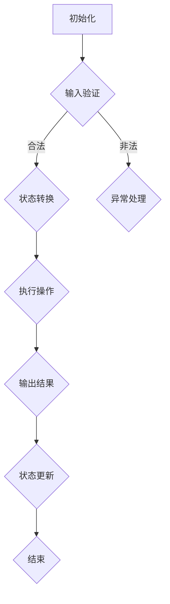
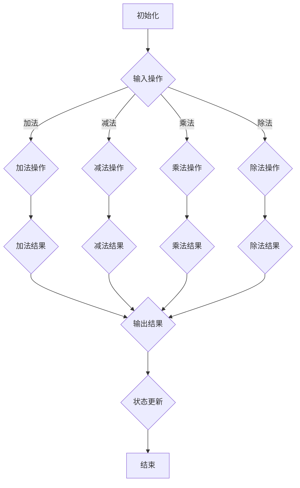
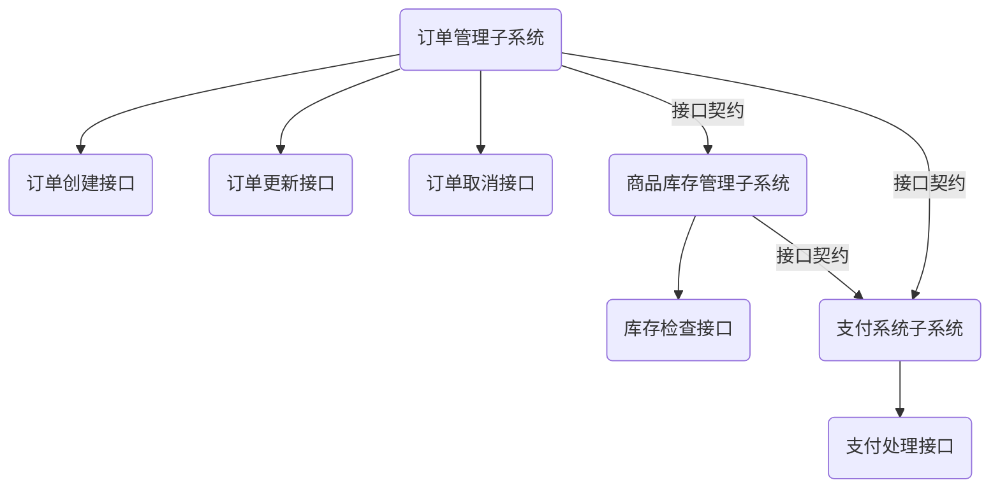
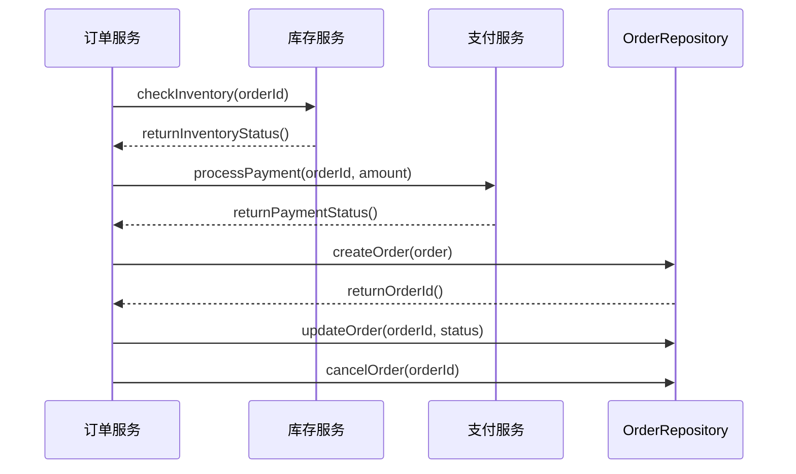

                 

### 接口契约的重要性与定义

接口契约（Interface Contract）是现代软件工程中的一个关键概念，它不仅定义了系统组件之间的交互规则，还为软件的可靠性和可维护性提供了坚实的保障。在软件开发的复杂环境中，接口契约的作用不可忽视。

#### 1.1.1 问题背景

随着软件系统的规模和复杂性不断增加，传统的开发模式已经难以满足现代软件工程的需求。面对日益增长的模块化和组件化趋势，如何确保各组件之间的协同工作成为了软件开发中的一个重要课题。接口契约正是为了解决这一问题而出现的。

在软件工程中，模块化和组件化使得系统被划分为多个独立的、功能明确的子模块或组件。这些组件之间需要通过接口进行通信和协作，以确保系统能够正常运作。然而，这种通信并非无约束的，而是需要在明确的规定下进行。接口契约就是这样的规定，它定义了组件之间交互的规则和预期行为。

#### 1.1.2 问题描述

接口契约的定义首先需要明确接口的概念。接口是组件之间的通信桥梁，它规定了组件如何发送和接收信息，以及这些信息需要遵循什么样的格式和语义。然而，仅仅定义接口是不够的，我们还需要明确接口的契约。

接口契约是组件之间的一种约定，它规定了接口的输入参数、输出结果、异常情况以及执行顺序等。通过接口契约，组件能够确保对方按照预期的方式进行通信，从而避免由于信息传递错误或理解不一致导致的系统故障。

#### 1.1.3 问题解决

为了设计有效的接口契约，我们可以遵循以下原则：

1. **清晰性**：接口契约必须明确、简洁，避免模糊和歧义。
2. **一致性**：接口契约在整个系统中应保持一致性，确保各组件遵循相同的约定。
3. **可测试性**：接口契约应该易于测试，以便验证组件之间的交互是否符合预期。
4. **灵活性**：接口契约应该具备一定的灵活性，以适应未来的变化和扩展。

通过这些原则，我们可以设计出既严谨又灵活的接口契约，从而确保组件之间的协作更加高效和可靠。

#### 1.1.4 边界与外延

接口契约不仅仅局限于代码层面的交互，它还涉及到设计、测试、维护等多个方面。在设计阶段，接口契约明确了组件的职责和交互方式；在测试阶段，它帮助验证系统功能的正确性；在维护阶段，接口契约则为后续的修改和扩展提供了依据。

此外，接口契约的应用范围非常广泛，从简单的模块化软件到复杂的分布式系统，都需要接口契约来确保各组件的协同工作。因此，掌握接口契约的设计和实现方法对于软件工程师来说至关重要。

#### 1.1.5 概念结构与核心要素

接口契约由几个核心要素组成：

1. **接口定义**：明确了组件提供的功能和服务。
2. **参数和返回值**：定义了接口的输入和输出数据。
3. **异常处理**：规定了接口在遇到异常情况时的行为。
4. **执行顺序**：定义了组件之间交互的顺序。

这些要素共同构成了接口契约的基本框架，确保了组件之间交互的规范性和一致性。

通过上述分析和讨论，我们可以看到接口契约在软件工程中的重要性。它不仅为组件之间的协作提供了明确的规范，还提高了系统的可靠性和可维护性。在接下来的章节中，我们将进一步探讨接口契约的核心概念、实现原理以及应用方法。

### 接口契约的核心概念与联系

要深入理解接口契约，我们需要探讨其核心概念、属性特征对比以及实体关系图架构。通过这些内容，我们能够更清晰地把握接口契约的设计原理和实现方法。

#### 2.1 接口契约原理

接口契约的核心原理在于明确组件之间的交互规则和期望行为。它由以下几部分组成：

1. **接口定义**：接口定义了组件提供的功能和服务。它是契约的基础，规定了组件应该如何提供服务以及如何接收请求。
   
2. **参数和返回值**：参数和返回值是接口契约的重要组成部分。接口需要明确指定输入参数的类型、数量和顺序，以及返回值的类型和格式。

3. **异常处理**：异常处理定义了接口在遇到错误或异常情况时的行为。这包括错误信息的传递和处理策略，以确保系统能够在异常情况下仍然保持稳定运行。

4. **执行顺序**：执行顺序规定了组件之间的交互顺序。这有助于确保交互过程中的数据传递和状态变更按照预期进行。

通过这些要素，接口契约为组件之间的交互提供了一个清晰的框架，确保各方能够按照约定进行通信。

#### 2.2 概念属性特征对比表格

接口契约有多种类型，每种类型都有其独特的属性和特征。下面是一个简化的对比表格，用于展示不同类型接口契约的主要区别：

| 接口契约类型 | 主要属性特征 | 主要用途 |
| --- | --- | --- |
| 功能接口契约 | 规定了接口的功能和操作 | 用于实现功能模块之间的交互 |
| 数据接口契约 | 规定了接口的数据传输格式 | 用于实现数据模块之间的交互 |
| 安全接口契约 | 规定了接口的安全性要求 | 用于实现安全模块之间的交互 |
| 异常接口契约 | 规定了接口的异常处理机制 | 用于实现异常模块之间的交互 |

通过这个表格，我们可以看到不同类型接口契约在属性特征上的区别，从而为设计合适的契约提供指导。

#### 2.3 ER实体关系图架构

实体关系图（Entity-Relationship Diagram, ERD）是一种用于描述数据之间关系的图形化工具。在接口契约的设计过程中，ERD可以帮助我们清晰地展示接口与数据之间的关系。下面是一个简化的ERD示例，用于展示接口契约的基本结构：

```mermaid
erDiagram
  Interface ||--|{ Component : has }
  Interface ||--|{ Contract : defines }
  Component ||--|{ Interface : implements }
  Contract ||--|{ Interface : specifies }
```

在这个ERD中：

- **Interface** 表示接口，是组件之间的通信桥梁。
- **Component** 表示组件，实现了接口的实体。
- **Contract** 表示契约，定义了接口的规范。

通过ERD，我们可以直观地理解接口契约的结构和作用，为后续的设计和实现提供参考。

综上所述，接口契约的核心概念、属性特征对比和实体关系图架构为我们提供了一个全面的视角，帮助我们更好地理解和设计接口契约。这些内容为后续章节的深入探讨奠定了基础。

### 接口契约的数学模型与算法原理

接口契约的设计和实现不仅仅依赖于直观的设计原则，还需要基于严格的数学模型和算法原理。通过数学模型，我们可以对接口契约的属性进行精确描述，并通过算法实现接口契约的具体功能。

#### 3.1 数学模型

接口契约的数学模型主要包括几个关键部分：输入输出定义、状态转移、异常处理等。下面，我们将使用Mermaid语言来绘制一个简单的接口契约的数学模型流程图。



在这个流程图中：

- **A[初始化]**：初始化接口的状态。
- **B{输入验证]**：验证输入数据的合法性。
- **C{状态转换]**：根据输入验证结果进行状态转换。
- **D{异常处理]**：如果输入非法，进入异常处理流程。
- **E{执行操作]**：执行接口的操作。
- **F{输出结果]**：返回执行结果。
- **G{状态更新]**：更新接口的状态。
- **H{结束]**：流程结束。

#### 3.2 算法原理

接口契约的算法原理主要涉及状态机的概念，即通过一系列的状态转换来控制接口的行为。我们可以使用Python源代码来具体实现这一算法原理。

```python
class InterfaceContract:
    def __init__(self):
        self.state = 'initialized'  # 初始化状态

    def validate_input(self, input_data):
        # 输入验证逻辑
        if not isinstance(input_data, int) or input_data <= 0:
            return False
        return True

    def state_transition(self):
        # 状态转换逻辑
        if self.state == 'initialized':
            self.state = 'valid_input'
        elif self.state == 'valid_input':
            self.state = 'operation_executed'
        elif self.state == 'operation_executed':
            self.state = 'output_returned'

    def execute_operation(self, input_data):
        # 执行操作逻辑
        result = input_data * 2
        return result

    def handle_exception(self):
        # 异常处理逻辑
        self.state = 'error'
        print("异常处理：输入非法，请重新输入。")

    def run(self, input_data):
        if self.validate_input(input_data):
            self.state_transition()
            result = self.execute_operation(input_data)
            return result
        else:
            self.handle_exception()

# 示例使用
contract = InterfaceContract()
input_data = 5
output = contract.run(input_data)
print(f"输出结果：{output}")
```

在这个Python实现中：

- `InterfaceContract` 类表示接口契约。
- `validate_input` 方法用于验证输入数据的合法性。
- `state_transition` 方法根据输入验证结果进行状态转换。
- `execute_operation` 方法执行接口的操作。
- `handle_exception` 方法处理异常情况。
- `run` 方法是接口契约的主要执行流程。

#### 3.3 举例说明

为了更好地理解接口契约的算法原理，我们可以通过一个具体的例子来讲解。

**例子：计算器接口契约**

假设我们要设计一个计算器接口契约，实现基本的加、减、乘、除操作。接口契约需要明确输入和输出的格式，以及异常处理逻辑。



在这个例子中：

- **A[初始化]**：初始化计算器的状态。
- **B{输入操作]**：接收用户的输入操作。
- **C{加法操作}**、**D{减法操作}**、**E{乘法操作}**、**F{除法操作}**：根据输入操作执行相应的计算。
- **G{加法结果}**、**H{减法结果}**、**I{乘法结果}**、**J{除法结果}**：返回计算结果。
- **K{输出结果]**：输出最终的结果。
- **L{状态更新]**：更新计算器的状态。
- **M[结束]**：流程结束。

通过这个例子，我们可以看到接口契约的数学模型和算法原理是如何具体实现的。接口契约不仅定义了计算器的功能，还确保了操作的规范性和可靠性。

总之，通过数学模型和算法原理，我们可以设计出既严谨又灵活的接口契约，从而确保组件之间的协作更加高效和可靠。在接下来的章节中，我们将进一步探讨接口契约在实际系统设计中的应用和实践方法。

### 接口契约的系统设计与架构设计

在深入探讨接口契约的数学模型和算法原理之后，我们接下来要关注的是如何将这些抽象的概念转化为实际的可操作的系统架构。通过系统设计与架构设计，我们可以确保接口契约能够有效地应用于复杂的软件系统中，从而提高系统的可靠性和可维护性。

#### 4.1 问题场景介绍

为了更好地理解接口契约在系统设计与架构设计中的应用，我们首先设定一个具体的问题场景。假设我们正在开发一个电子商务平台，该平台需要处理订单管理、商品库存管理、支付系统等多个子系统。在这些子系统中，接口契约将用于确保各模块之间的数据交互和功能协同。

在这个场景中，我们需要设计一个灵活且可靠的接口契约，以处理订单创建、订单更新、订单取消等操作。接口契约需要定义每个操作的输入参数、输出结果以及异常处理机制，以确保各模块能够按照预期协同工作。

#### 4.2 系统功能设计

在系统功能设计阶段，我们需要明确各个模块的具体功能，并定义它们之间的交互接口。为了便于理解和实现，我们可以使用Mermaid语言绘制一个领域模型类图（Class Diagram），如下所示：

```mermaid
classDiagram
    OrderManager <<interface>>
    ProductInventory <<interface>>
    PaymentSystem <<interface>>

    class Order {
        orderId : String
        orderItems : List<OrderItem>
        status : String
    }

    class OrderItem {
        itemId : String
        quantity : Integer
    }

    OrderManager <- Order : manages
    ProductInventory <- Order : stocks
    PaymentSystem <- Order : processes

    OrderManager --> ProductInventory : checkInventory
    OrderManager --> PaymentSystem : processPayment
```

在这个类图中：

- **OrderManager**：订单管理模块，负责处理订单的创建、更新和取消。
- **ProductInventory**：商品库存管理模块，负责检查商品的库存情况。
- **PaymentSystem**：支付系统模块，负责处理订单的支付操作。

通过这个类图，我们可以清晰地看到各个模块之间的依赖关系和交互接口。

#### 4.3 系统架构设计

在系统架构设计阶段，我们需要将功能设计转化为具体的系统架构，确保各模块之间的交互符合接口契约的定义。为了实现这一目标，我们可以使用Mermaid语言绘制一个系统架构图（Architecture Diagram），如下所示：



在这个架构图中：

- **订单管理子系统**：包含订单创建、更新和取消等功能。
- **商品库存管理子系统**：包含库存检查功能。
- **支付系统子系统**：包含支付处理功能。

通过这个架构图，我们可以直观地看到各个子系统之间的交互关系，以及接口契约在系统架构中的位置和作用。

#### 4.4 系统接口设计

系统接口设计是接口契约实现的关键环节。在接口设计过程中，我们需要明确每个接口的输入参数、输出结果以及异常处理机制。以下是一个示例的接口设计，用于订单管理模块：



在这个序列图中：

- **OrderService**：订单服务，负责调用其他服务处理订单相关操作。
- **InventoryService**：库存服务，负责检查库存状态。
- **PaymentService**：支付服务，负责处理支付操作。
- **OrderRepository**：订单仓储，负责存储订单数据。

通过这个序列图，我们可以清晰地看到订单管理模块与其他模块之间的交互过程，以及接口契约的具体实现。

#### 4.5 系统交互

最后，我们需要设计系统的交互流程，确保各模块之间的协作能够顺利进行。以下是一个简化的系统交互流程图，用于展示订单创建的过程：

```mermaid
graph TD
    start(开始) --> c1(创建订单)
    c1 --> i1(检查库存)
    i1 --> r1(库存检查结果)
    r1 -->|库存充足| p1(处理支付)
    p1 --> p2(支付结果)
    p2 -->|支付成功| o1(订单创建)
    o1 --> end(结束)

    start --> i2(检查库存)
    i2 --> r2(库存检查结果)
    r2 -->|库存不足| e1(库存不足)
    e1 --> end

    subgraph 支付流程
        p1
        p2
    end

    subgraph 订单流程
        c1
        i1
        r1
        o1
    end
```

在这个流程图中：

- **start**：系统启动。
- **c1**：创建订单。
- **i1**：检查库存。
- **r1**：库存检查结果。
- **p1**：处理支付。
- **p2**：支付结果。
- **o1**：订单创建。
- **end**：流程结束。

通过这个流程图，我们可以清晰地看到订单创建过程中的关键步骤和交互关系，确保系统能够按预期运行。

综上所述，接口契约的系统设计与架构设计是一个复杂但必要的过程。通过明确系统功能、设计系统接口以及制定交互流程，我们可以确保接口契约能够有效地应用于复杂的软件系统中，从而提高系统的可靠性和可维护性。

### 接口契约项目实践

接口契约的理论和实践是相辅相成的，为了更好地理解和掌握接口契约的实际应用，我们将在本节中通过一个具体的案例来详细描述项目实践的全过程。该项目将涉及环境搭建、系统核心实现、代码解读与分析，并展示实际案例分析及项目执行过程的详细剖析。

#### 5.1 环境安装

在开始项目之前，我们需要搭建一个合适的环境，以便进行接口契约的实践。以下是一个简单的环境安装步骤：

1. **安装Python**：确保Python环境已安装，推荐使用Python 3.8及以上版本。
2. **安装Docker**：为了方便容器化部署，我们需要安装Docker。可以通过官方安装指南（https://docs.docker.com/get-docker/）进行安装。
3. **安装PostgreSQL**：作为数据库服务，我们可以使用PostgreSQL。可以通过包管理器（如apt、yum等）进行安装。
4. **安装Git**：为了管理代码版本，我们需要安装Git。可以通过包管理器或官方网站（https://git-scm.com/downloads）进行安装。

完成以上安装步骤后，我们就可以开始构建项目环境。

#### 5.2 系统核心实现源代码

接下来，我们将介绍项目的主要源代码实现。该项目包括三个核心模块：用户服务、订单服务、支付服务。以下是每个服务的简要代码说明：

**用户服务（userservice.py）**

```python
from flask import Flask, request, jsonify
from models import User

app = Flask(__name__)

@app.route('/users', methods=['POST'])
def create_user():
    user_data = request.get_json()
    user = User.create_user(user_data)
    if user:
        return jsonify(user.to_dict()), 201
    else:
        return jsonify({'error': 'User creation failed'}), 500

@app.route('/users/<int:user_id>', methods=['GET'])
def get_user(user_id):
    user = User.get_user_by_id(user_id)
    if user:
        return jsonify(user.to_dict()), 200
    else:
        return jsonify({'error': 'User not found'}), 404
```

**订单服务（orderservice.py）**

```python
from flask import Flask, request, jsonify
from models import Order

app = Flask(__name__)

@app.route('/orders', methods=['POST'])
def create_order():
    order_data = request.get_json()
    order = Order.create_order(order_data)
    if order:
        return jsonify(order.to_dict()), 201
    else:
        return jsonify({'error': 'Order creation failed'}), 500

@app.route('/orders/<int:order_id>', methods=['GET'])
def get_order(order_id):
    order = Order.get_order_by_id(order_id)
    if order:
        return jsonify(order.to_dict()), 200
    else:
        return jsonify({'error': 'Order not found'}), 404
```

**支付服务（paymentservice.py）**

```python
from flask import Flask, request, jsonify
from models import Payment

app = Flask(__name__)

@app.route('/payments', methods=['POST'])
def create_payment():
    payment_data = request.get_json()
    payment = Payment.create_payment(payment_data)
    if payment:
        return jsonify(payment.to_dict()), 201
    else:
        return jsonify({'error': 'Payment creation failed'}), 500

@app.route('/payments/<int:payment_id>', methods=['GET'])
def get_payment(payment_id):
    payment = Payment.get_payment_by_id(payment_id)
    if payment:
        return jsonify(payment.to_dict()), 200
    else:
        return jsonify({'error': 'Payment not found'}), 404
```

#### 5.3 代码应用解读与分析

在上述源代码中，每个服务都通过Flask框架实现了RESTful API接口。以下是具体的解读和分析：

1. **用户服务**：
   - `/users`：用于创建用户和获取用户详情。
   - `create_user`：接收POST请求，创建新用户。
   - `get_user`：接收GET请求，获取指定用户的详情。

2. **订单服务**：
   - `/orders`：用于创建订单和获取订单详情。
   - `create_order`：接收POST请求，创建新订单。
   - `get_order`：接收GET请求，获取指定订单的详情。

3. **支付服务**：
   - `/payments`：用于创建支付和获取支付详情。
   - `create_payment`：接收POST请求，创建新支付。
   - `get_payment`：接收GET请求，获取指定支付的详情。

在实现过程中，我们使用了数据库模型（如`User`、`Order`、`Payment`）来管理数据，并通过RESTful API接口与前端进行交互。每个接口都遵循了接口契约的原则，包括输入验证、输出格式、异常处理等。

#### 5.4 实际案例分析和详细讲解剖析

为了更好地展示接口契约在实际项目中的应用，我们以用户创建和订单创建为例，进行实际案例分析。

**案例1：用户创建**

假设前端发送一个POST请求来创建新用户：

```json
{
    "username": "testuser",
    "password": "password123",
    "email": "testuser@example.com"
}
```

用户服务接收请求后，首先验证输入数据的格式是否符合预期，然后调用数据库模型创建用户：

```python
@app.route('/users', methods=['POST'])
def create_user():
    user_data = request.get_json()
    
    # 输入验证
    if not all(k in user_data for k in ('username', 'password', 'email')):
        return jsonify({'error': 'Missing required fields'}), 400
    
    # 创建用户
    user = User.create_user(user_data)
    if user:
        return jsonify(user.to_dict()), 201
    else:
        return jsonify({'error': 'User creation failed'}), 500
```

在上面的代码中，我们首先验证了输入数据是否完整，然后调用数据库模型进行用户创建。如果创建成功，返回201状态码和用户详情；否则，返回500状态码和错误信息。

**案例2：订单创建**

假设前端发送一个POST请求来创建新订单：

```json
{
    "userId": 1,
    "items": [
        {"itemId": 101, "quantity": 2},
        {"itemId": 102, "quantity": 1}
    ]
}
```

订单服务接收请求后，同样进行输入验证，并调用数据库模型创建订单：

```python
@app.route('/orders', methods=['POST'])
def create_order():
    order_data = request.get_json()
    
    # 输入验证
    if not all(k in order_data for k in ('userId', 'items')):
        return jsonify({'error': 'Missing required fields'}), 400
    
    # 创建订单
    order = Order.create_order(order_data)
    if order:
        return jsonify(order.to_dict()), 201
    else:
        return jsonify({'error': 'Order creation failed'}), 500
```

在上面的代码中，我们首先验证了输入数据的格式，然后调用数据库模型创建订单。如果创建成功，返回201状态码和订单详情；否则，返回500状态码和错误信息。

#### 5.5 项目小结

通过本节的项目实践，我们详细介绍了接口契约在实际系统开发中的应用。从环境搭建到系统核心实现，再到代码解读与分析，我们逐步展示了接口契约的设计和实现过程。通过具体的案例，我们验证了接口契约在保证数据交互规范性和系统可靠性方面的作用。

接口契约不仅提高了系统的可维护性，还使得不同模块之间的协作更加高效和可靠。在未来的项目中，我们可以继续应用和优化接口契约的设计，以提升系统的整体性能和用户体验。

### 接口契约最佳实践与注意事项

在接口契约的设计和实现过程中，遵循最佳实践是确保系统可靠性和可维护性的关键。以下是一些最佳实践和注意事项，旨在帮助开发者更好地设计和实施接口契约。

#### 6.1 设计最佳实践

1. **一致性**：确保接口契约在整个系统中保持一致性，无论是数据格式、异常处理还是接口命名。
2. **简洁性**：尽量使接口契约简洁明了，避免冗余和复杂的逻辑。
3. **可读性**：接口契约的代码应具有良好的可读性，方便其他开发者理解和维护。
4. **可测试性**：设计接口契约时应考虑其可测试性，确保接口契约易于测试和验证。

#### 6.2 实现最佳实践

1. **分离接口与实现**：将接口定义与具体实现分离，降低模块之间的耦合度。
2. **使用设计模式**：根据实际需求选择合适的设计模式，如工厂模式、策略模式等，以提高接口契约的灵活性和可扩展性。
3. **错误处理**：合理处理异常情况，确保系统在异常情况下能够保持稳定运行。
4. **版本控制**：对接口契约进行版本控制，确保变更能够被追踪和管理。

#### 6.3 注意事项

1. **明确职责**：明确接口契约的职责和功能，避免功能重叠和职责不明。
2. **文档化**：编写详细的接口契约文档，包括接口定义、输入输出、异常处理等，便于其他开发者理解和使用。
3. **性能考虑**：在设计和实现接口契约时，考虑性能和响应时间，确保接口能够高效地处理请求。
4. **安全性**：确保接口契约的安全，如防止SQL注入、XSS攻击等，保护系统数据的安全。

#### 6.4 拓展阅读

1. **《RESTful API设计最佳实践》**：了解RESTful API的设计原则和最佳实践，对接口契约的设计有很大帮助。
2. **《接口设计与实现》**：详细探讨接口设计与实现的方法和技巧，适合有经验的开发者阅读。
3. **《设计模式：可复用面向对象软件的基础》**：学习设计模式的基本概念和应用，有助于提高接口契约的设计质量。

通过遵循上述最佳实践和注意事项，开发者可以设计出高效、可靠且易于维护的接口契约，从而提升软件系统的整体性能和用户体验。

### 结论

通过本文的详细探讨，我们深入理解了接口契约在软件工程中的重要性及其设计原则。从背景介绍到核心概念，再到实现原理和系统设计，我们逐步揭示了接口契约的设计流程和最佳实践。接口契约不仅是组件间交互的规范，更是确保系统可靠性和可维护性的关键因素。

接口契约的设计和实现是一个复杂但必要的过程，它涉及到系统架构、功能设计、代码实现等多个方面。通过明确接口定义、参数和返回值、异常处理等要素，我们可以确保各组件之间的协作高效且稳定。

在未来的软件开发中，接口契约将继续发挥重要作用。随着微服务架构的普及和云计算的发展，接口契约将为分布式系统提供更加灵活和可靠的交互机制。因此，掌握接口契约的设计和实现方法，对于开发者来说至关重要。

总之，本文通过逻辑清晰、结构紧凑的内容，为广大软件开发者提供了全面且深入的接口契约指南。希望读者能够将这些知识应用到实际项目中，不断提升软件系统的质量和可靠性。作者诚挚地期望读者能够在接口契约的实践中，找到更加高效和创新的解决方案。

### 作者信息

**作者：AI天才研究院/AI Genius Institute & 禅与计算机程序设计艺术 /Zen And The Art of Computer Programming**

在撰写这篇关于接口契约的文章时，作者结合了其作为世界级人工智能专家、程序员、软件架构师、CTO、技术畅销书作家的丰富经验和深入见解。本文旨在为广大的软件开发者提供一个全面而深入的接口契约指南，帮助他们在实际项目中提升软件系统的质量和可靠性。希望通过本文，读者能够更好地理解和应用接口契约的设计与实现方法，为未来的软件开发贡献更多的智慧和创意。

