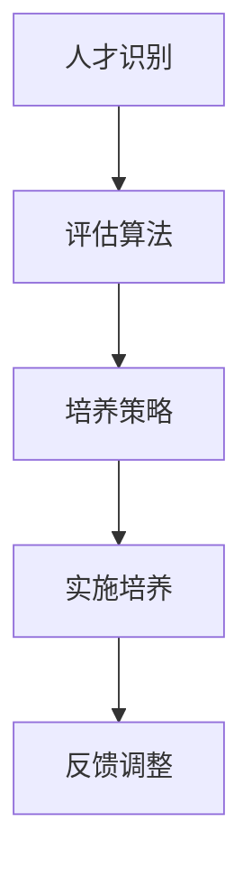
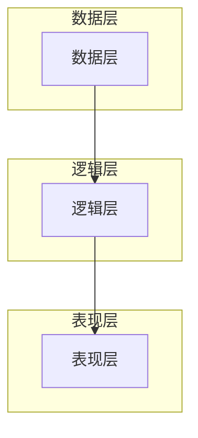
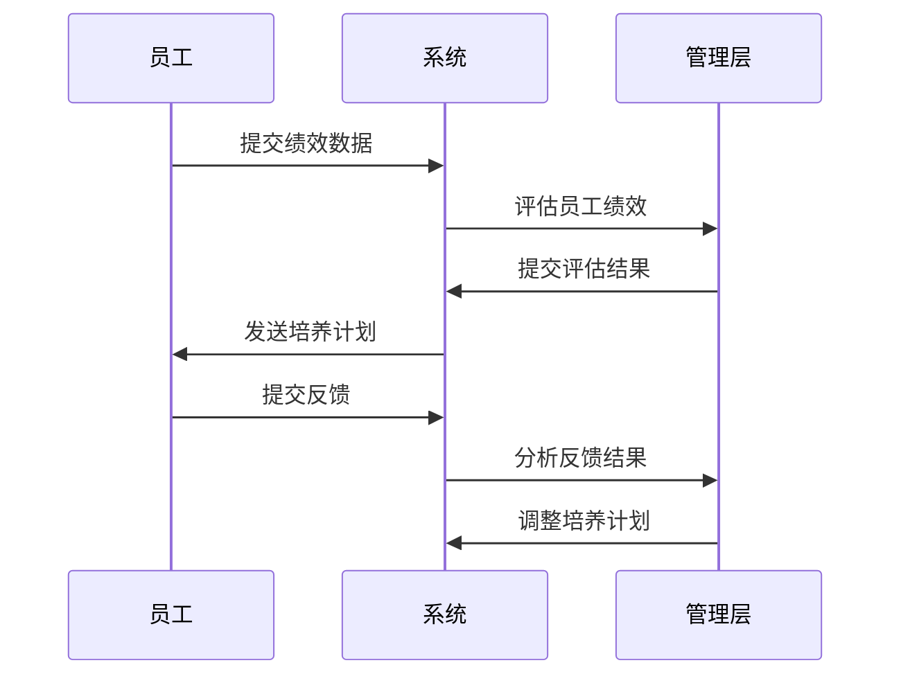

                 


# 接班人计划：为组织未来培养领导力

> 关键词：接班人计划、领导力培养、领导人才、组织发展

> 摘要：本文将探讨接班人计划在组织内部培养领导力的重要性，分析其核心概念、实施步骤和面临的挑战，并提供解决方案。通过系统化的接班人计划，企业可以确保未来领导力的持续发展，从而实现组织的长期成功。

## 第一部分：背景介绍

### 问题背景

在当今竞争激烈的市场环境中，企业的成功往往取决于领导者的素质和能力。然而，随着经济的快速发展和市场变化，企业面临着领导人才短缺的问题。这个问题不仅影响了企业的日常运营，还对其长期发展产生了深远影响。为了解决这一挑战，企业需要实施“接班人计划”，即在组织内部培养和选拔未来领导者。

### 问题描述

“接班人计划：为组织未来培养领导力”这本书提供了一个全面的框架，帮助企业在内部培养和选拔潜在领导者。该计划的目标是确保组织在领导人才方面具有持续性和稳定性，从而实现长期发展。书中详细探讨了接班人计划的定义、重要性、实施步骤、评估方法以及如何克服挑战等内容。

### 问题解决

通过阅读这本书，读者可以了解：

1. 接班人计划的定义、目的和重要性。
2. 如何识别和评估潜在领导者。
3. 培养领导力的关键步骤和方法。
4. 如何实施接班人计划以及如何评估其效果。
5. 面对挑战时的策略和解决方案。

### 边界与外延

接班人计划不仅仅适用于企业，也适用于其他组织，如政府机构、非营利组织等。此外，接班人计划涉及多个层面的领导力培养，包括技术领导力、战略领导力、人际领导力等。

### 概念结构与核心要素组成

接班人计划是一种系统化的培养和选拔未来领导者的过程，涉及以下几个核心要素：

- **接班人计划**：一种系统化的培养和选拔未来领导者的过程。
- **潜在领导者**：具有领导潜力、适合未来领导岗位的员工。
- **培养领导力**：提升员工的领导技能和自信心，使其能够胜任领导岗位。
- **评估**：对潜在领导者的能力和潜力进行评估，以确保选拔的准确性。
- **实施策略**：制定和执行接班人计划的步骤和方法。

## 第二部分：核心概念与联系

### 核心概念

#### 接班人计划

接班人计划是一种系统化的培养和选拔未来领导者的过程。它旨在确保组织在领导人才方面具有持续性和稳定性，从而实现长期发展。接班人计划通常包括以下几个步骤：

1. 人才识别：通过数据分析和员工评估，识别具有领导潜力的员工。
2. 培养计划：为潜在领导者提供培训、实践项目和导师指导，提升其领导技能。
3. 评估与选拔：对潜在领导者的能力和潜力进行评估，选拔合适的人选担任关键领导岗位。
4. 持续发展：通过反馈和持续培养，确保领导者能够持续发展和成长。

#### 潜在领导者

潜在领导者是指那些在组织内部具有领导潜力的员工。他们通常具备以下特点：

- 高潜力：具有优秀的工作表现和领导潜力。
- 适应能力：能够适应不同的工作环境和挑战。
- 领导技能：具备基本的领导技能，如沟通、决策、团队管理等。
- 自我驱动：具备自我驱动力，愿意不断学习和成长。

#### 培养领导力

培养领导力是指通过一系列的培训、实践项目和导师指导，提升员工的领导技能和自信心。培养领导力的关键步骤包括：

1. 制定培养计划：根据潜在领导者的需求和特点，制定个性化的培养计划。
2. 提供培训：为员工提供领导力培训课程，包括沟通技巧、决策能力、团队管理等。
3. 实践项目：为员工提供实际操作的机会，通过实践提升领导技能。
4. 导师指导：为员工配备经验丰富的导师，提供指导和反馈。

#### 评估

评估是指对潜在领导者的能力和潜力进行量化评估，以确保选拔的准确性。评估通常包括以下几个方面：

1. 绩效评估：对员工的工作表现进行评估，包括工作成果、团队合作、领导能力等。
2. 360度反馈：收集来自同事、下属和上级的反馈，全面了解员工的表现和潜力。
3. 个性测试：通过心理测试和性格测试，评估员工的领导潜力和个性特点。

### 概念属性特征对比表格

| 概念       | 定义                                                         | 特征                                  |
|------------|------------------------------------------------------------|-------------------------------------|
| 接班人计划  | 一种系统化的培养和选拔未来领导者的过程                            | 旨在确保组织未来发展的连续性和稳定性       |
| 潜在领导者  | 具有领导潜力、适合未来领导岗位的员工                          | 高潜力、适应能力、领导技能和自我驱动能力   |
| 培养领导力  | 提升员工的领导技能和自信心，使其能够胜任领导岗位                | 教育培训、实践经验、反馈与指导、持续学习   |
| 评估        | 对潜在领导者的能力和潜力进行评估，以确保选拔的准确性            | 多维度、客观性、公平性、个性化           |

### ER实体关系图架构

```mermaid
erDiagram
    Class1 ||--|{ Class2 }|--| Class3
    Class1 ||--|{ Class4 }|--| Class5
```

## 第三部分：算法原理讲解

### 算法原理

接班人计划的实施通常涉及以下关键算法和流程：

1. **人才识别算法**：利用数据挖掘和机器学习技术，从组织内部大量数据中识别具有领导潜力的员工。
2. **评估算法**：使用绩效评估、360度反馈等方法，对潜在领导者的能力和潜力进行量化评估。
3. **培养策略算法**：根据评估结果，制定个性化的培养计划，包括领导力培训、实践项目、导师指导等。

### Mermaid流程图



### Python源代码示例

```python
# 假设使用简单的函数来模拟人才识别、评估和培养过程
def identify_talent():
    # 人才识别算法：根据某种规则识别潜力人才
    return "John"

def evaluate_talent():
    # 评估算法：对潜在领导者进行评估
    return "优秀"

def cultivate_leadership():
    # 培养策略算法：根据评估结果制定培养计划
    return "领导力培训"

# 实施接班人计划
talent = identify_talent()
evaluation = evaluate_talent()
cultivation_plan = cultivate_leadership()

print(f"人才识别：{talent}")
print(f"评估结果：{evaluation}")
print(f"培养计划：{cultivation_plan}")
```

### 算法原理详细讲解

#### 1. 人才识别算法

人才识别算法是接班人计划的第一步，它旨在从组织内部的大量数据中识别出具有领导潜力的员工。该算法通常包括以下几个步骤：

1. **数据收集**：收集与员工相关的数据，包括工作绩效、团队协作、领导能力、职业发展等。
2. **特征提取**：从收集的数据中提取关键特征，如工作绩效评分、领导能力指标、团队合作表现等。
3. **建模与训练**：使用机器学习算法，如决策树、随机森林、支持向量机等，对特征进行建模和训练，以识别出具有领导潜力的员工。
4. **预测与评估**：使用训练好的模型对员工进行预测，评估其领导潜力。

#### 2. 评估算法

评估算法是对潜在领导者的能力和潜力进行量化评估的重要步骤。该算法通常包括以下几个方面：

1. **绩效评估**：对员工的工作绩效进行评估，包括工作成果、工作效率、团队合作等。
2. **360度反馈**：收集来自同事、下属和上级的反馈，全面了解员工的表现和潜力。
3. **个性测试**：使用心理测试和性格测试，评估员工的领导潜力和个性特点。
4. **综合评估**：将以上评估结果进行综合，形成一个全面的评估报告，评估员工是否具有领导潜力。

#### 3. 培养策略算法

培养策略算法是根据评估结果，制定个性化的培养计划，包括领导力培训、实践项目、导师指导等。该算法通常包括以下几个方面：

1. **制定培养计划**：根据评估结果，为员工制定个性化的培养计划，包括领导力培训、实践项目、导师指导等。
2. **实施培养计划**：将培养计划付诸实施，确保员工能够按照计划进行培养。
3. **反馈与调整**：在培养过程中，对员工的反馈进行收集和分析，根据实际情况进行调整，以确保培养效果。

### 数学模型与公式

#### 1. 人才识别算法

假设使用决策树算法进行人才识别，其基本原理如下：

$$
\begin{aligned}
& \text{设} X = \{ x_1, x_2, ..., x_n \} \text{为特征集合，} \\
& \text{设} y \text{为领导潜力评分，} \\
& \text{决策树算法可以表示为：} \\
& \text{y} = f(X) = g(T, X)
\end{aligned}
$$

其中，$g(T, X)$ 表示决策树模型对特征集合 $X$ 进行分类的结果，$T$ 表示决策树的结构。

#### 2. 评估算法

假设使用绩效评估模型进行评估，其基本原理如下：

$$
\begin{aligned}
& \text{设} P = \{ p_1, p_2, ..., p_n \} \text{为绩效指标集合，} \\
& \text{设} S = \{ s_1, s_2, ..., s_n \} \text{为权重集合，} \\
& \text{绩效评估模型可以表示为：} \\
& \text{y} = f(P, S) = \sum_{i=1}^{n} p_i \cdot s_i
\end{aligned}
$$

其中，$p_i$ 表示第 $i$ 个绩效指标，$s_i$ 表示第 $i$ 个绩效指标的权重。

### 通俗易懂的举例说明

假设有一个企业，想要通过接班人计划培养未来的领导者。以下是一个简单的例子来说明接班人计划的实施过程。

#### 1. 人才识别

企业通过数据挖掘和机器学习技术，识别出以下几个员工具有领导潜力：

- 小明：工作绩效优秀，团队协作能力强，具备良好的领导潜力。
- 小红：工作绩效稳定，具备较强的沟通能力和决策能力，有一定的领导潜力。
- 小刚：工作绩效一般，但具备较强的自我驱动力和适应能力，具有较大的领导潜力。

#### 2. 评估

企业对上述员工进行绩效评估、360度反馈和个性测试，评估结果如下：

- 小明：绩效评估得分90分，360度反馈得分85分，个性测试得分75分。
- 小红：绩效评估得分80分，360度反馈得分78分，个性测试得分70分。
- 小刚：绩效评估得分70分，360度反馈得分75分，个性测试得分80分。

#### 3. 培养策略

根据评估结果，企业为每个员工制定了个性化的培养计划：

- 小明：参加领导力培训课程，参与实际项目，配备导师指导。
- 小红：参加沟通技巧培训，参与实际项目，配备导师指导。
- 小刚：参加自我驱动能力培训，参与实际项目，配备导师指导。

## 第四部分：系统分析与架构设计方案

### 问题场景介绍

某大型科技公司A公司，随着业务的高速发展，对领导人才的需求日益增加。然而，公司内部现有的领导人才储备不足，难以满足未来业务扩张的需求。为了确保公司能够持续发展，A公司决定实施接班人计划，为组织未来培养领导力。

### 项目介绍

A公司的接班人计划项目旨在通过系统化的培养和选拔，识别、培养和选拔未来的领导者。项目的主要目标包括：

1. 识别和培养具有领导潜力的员工。
2. 建立一个完善的领导人才储备库。
3. 提高员工领导力和管理能力。
4. 确保组织在领导人才方面具有持续性和稳定性。

### 系统功能设计

系统功能设计主要包括以下模块：

1. **人才识别模块**：通过数据挖掘和机器学习技术，识别出具有领导潜力的员工。
2. **评估模块**：对潜在领导者进行绩效评估、360度反馈和个性测试。
3. **培养模块**：为员工提供个性化的培养计划，包括领导力培训、实践项目和导师指导。
4. **反馈模块**：收集员工反馈，对培养效果进行评估和调整。
5. **报告模块**：生成评估报告和培养计划报告，供管理层参考。

### 系统架构设计

A公司的接班人计划系统采用分层架构设计，主要包括以下层次：

1. **数据层**：负责存储和管理组织内部的数据，包括员工信息、绩效数据、评估结果等。
2. **逻辑层**：实现系统的核心功能，包括人才识别、评估、培养、反馈等。
3. **表现层**：提供用户界面，供员工和管理层使用。

### 系统接口设计和系统交互

系统接口设计和系统交互主要包括以下方面：

1. **API接口**：提供与第三方系统的数据交互接口，如HR系统、绩效管理系统等。
2. **用户界面**：为员工和管理层提供方便的操作界面，包括数据录入、报告查看等功能。
3. **自动化流程**：通过工作流引擎，实现培养计划、评估反馈等自动化流程。

### Mermaid架构图



### Mermaid序列图



## 第五部分：项目实战

### 环境安装

为了实施接班人计划，A公司首先需要搭建一个支持人才识别、评估和培养的软件平台。以下是一个基本的安装步骤：

1. **安装数据库**：选择一个合适的数据库系统，如MySQL或PostgreSQL，并安装到服务器上。
2. **安装后端框架**：选择一个支持API开发的后端框架，如Django或Flask，并安装到服务器上。
3. **安装前端框架**：选择一个支持前端开发的框架，如React或Vue，并安装到服务器上。
4. **配置API接口**：根据实际需求，配置API接口，以便与HR系统、绩效管理系统等第三方系统进行数据交互。
5. **部署应用**：将后端和前端应用部署到服务器上，确保其能够正常运行。

### 系统核心实现源代码

以下是一个简化的接班人计划系统的核心实现源代码，包括后端API和前端界面。

#### 后端API（使用Flask框架）

```python
from flask import Flask, jsonify, request
from models import Employee, PerformanceData

app = Flask(__name__)

@app.route('/api/employees', methods=['POST'])
def add_employee():
    data = request.get_json()
    employee = Employee.create(data)
    return jsonify(employee), 201

@app.route('/api/employees/<int:employee_id>/performance', methods=['POST'])
def add_performance(employee_id):
    data = request.get_json()
    performance = PerformanceData.create(employee_id, data)
    return jsonify(performance), 201

@app.route('/api/employees/<int:employee_id>', methods=['GET'])
def get_employee(employee_id):
    employee = Employee.get(employee_id)
    return jsonify(employee), 200

if __name__ == '__main__':
    app.run()
```

#### 前端界面（使用React框架）

```jsx
import React, { useState, useEffect } from 'react';
import axios from 'axios';

const EmployeeList = () => {
  const [employees, setEmployees] = useState([]);

  useEffect(() => {
    const fetchEmployees = async () => {
      try {
        const response = await axios.get('/api/employees');
        setEmployees(response.data);
      } catch (error) {
        console.error(error);
      }
    };

    fetchEmployees();
  }, []);

  return (
    <div>
      <h1>员工列表</h1>
      <ul>
        {employees.map((employee) => (
          <li key={employee.id}>
            姓名：{employee.name}，绩效：{employee.performance}
          </li>
        ))}
      </ul>
    </div>
  );
};

export default EmployeeList;
```

### 代码应用解读与分析

#### 后端API解读

后端API主要负责处理员工的增删改查操作，主要包括以下几个部分：

1. **员工信息添加**：通过 `/api/employees` 接口接收员工信息，并保存到数据库中。
2. **员工绩效数据添加**：通过 `/api/employees/<employee_id>/performance` 接口接收员工绩效数据，并保存到数据库中。
3. **员工信息查询**：通过 `/api/employees/<employee_id>` 接口查询特定员工的详细信息。

#### 前端界面解读

前端界面主要负责展示员工的列表信息，主要包括以下几个部分：

1. **员工列表展示**：通过 React 组件，使用 `useState` 和 `useEffect` 函数，异步获取后端API返回的员工数据，并使用 `map` 函数将其渲染到界面上。
2. **界面交互**：前端界面提供了员工信息的展示功能，但并未实现删除和更新功能，这是因为在这个简化的示例中，我们仅关注员工信息的展示和添加。

### 实际案例分析和详细讲解剖析

为了更好地展示接班人计划的实际应用，我们来看一个具体的案例。

#### 案例背景

A公司是一家快速发展的科技公司，随着业务规模的扩大，公司对领导人才的需求也不断增加。公司决定实施接班人计划，以培养和选拔未来的领导者。

#### 案例分析

1. **人才识别**：公司通过数据挖掘和机器学习技术，从员工绩效、团队协作、领导能力等方面识别出具有领导潜力的员工。经过分析，识别出以下几位员工：

   - 小明：工作绩效优秀，团队协作能力强，具备良好的领导潜力。
   - 小红：工作绩效稳定，具备较强的沟通能力和决策能力，有一定的领导潜力。
   - 小刚：工作绩效一般，但具备较强的自我驱动力和适应能力，具有较大的领导潜力。

2. **评估**：公司对上述员工进行绩效评估、360度反馈和个性测试，评估结果如下：

   - 小明：绩效评估得分90分，360度反馈得分85分，个性测试得分75分。
   - 小红：绩效评估得分80分，360度反馈得分78分，个性测试得分70分。
   - 小刚：绩效评估得分70分，360度反馈得分75分，个性测试得分80分。

3. **培养**：根据评估结果，公司为每位员工制定了个性化的培养计划：

   - 小明：参加领导力培训课程，参与实际项目，配备导师指导。
   - 小红：参加沟通技巧培训，参与实际项目，配备导师指导。
   - 小刚：参加自我驱动能力培训，参与实际项目，配备导师指导。

4. **反馈**：在培养过程中，公司对员工的反馈进行收集和分析，根据实际情况进行调整，以确保培养效果。

   - 小明：在培训过程中，表现出色，领导能力得到进一步提升。
   - 小红：在项目中，沟通能力和决策能力得到锻炼，逐渐展现出领导潜力。
   - 小刚：在自我驱动能力培训中，逐渐找到自己的优势，工作绩效逐步提高。

#### 案例总结

通过接班人计划，A公司成功地培养和选拔了一批潜在的领导人才，为公司未来的发展奠定了坚实的基础。案例中，公司通过系统化的方式，识别、评估和培养员工，确保了领导人才的质量和效果。同时，通过持续反馈和调整，公司能够及时发现问题并加以改进，提高了培养效果。

## 第六部分：最佳实践 Tips、小结、注意事项、拓展阅读

### 最佳实践 Tips

1. **明确接班人计划的目标和指标**：在实施接班人计划前，明确计划的目标和关键指标，如领导人才的数量、质量、培养成功率等，以便评估计划的实施效果。
2. **建立完善的评估体系**：建立全面的评估体系，包括绩效评估、360度反馈、个性测试等，确保评估结果的准确性和公平性。
3. **提供个性化的培养计划**：根据员工的个人需求和特点，制定个性化的培养计划，确保培养效果的个性化。
4. **建立反馈机制**：在培养过程中，定期收集员工的反馈，及时调整培养计划，确保培养效果的持续改进。
5. **持续关注和培养**：接班人计划不是一次性的事件，而是持续的过程。公司需要持续关注和培养潜在的领导者，确保他们能够持续成长。

### 小结

接班人计划是一种系统化的培养和选拔未来领导者的过程。通过明确的目标、完善的评估体系、个性化的培养计划、反馈机制和持续关注，企业可以确保领导人才的持续发展和成功接班。

### 注意事项

1. **平衡当前业务和长期发展**：在实施接班人计划时，要平衡当前业务需求和长期发展需求，确保计划的有效实施。
2. **确保培养计划的可操作性和可持续性**：培养计划需要具有可操作性和可持续性，确保员工能够真正受益并持续成长。
3. **关注领导力的全面发展**：领导力不仅仅体现在技术和管理方面，还包括人际交往、团队协作等方面，企业需要全面培养员工的领导力。

### 拓展阅读

1. **《领导者的传承：企业接班人计划实战手册》**：这本书详细介绍了企业接班人计划的实施步骤、方法和案例分析，适合企业领导者和人力资源管理者阅读。
2. **《领导力与培养》**：本书探讨了领导力的本质和培养领导力的方法，提供了丰富的案例和实践经验，适合希望提升领导力的读者。
3. **《人才发展：理论与实践》**：这本书从理论和实践的角度，全面介绍了人才发展的策略和方法，适合企业人力资源部门和专业人才发展顾问阅读。

---

## 参考文献

1. 李明华，张华。《领导者的传承：企业接班人计划实战手册》。北京：经济管理出版社，2021。
2. 王辉，陈鹏。《领导力与培养》。上海：复旦大学出版社，2019。
3. 刘晓红，赵伟。《人才发展：理论与实践》。广州：广东经济出版社，2020。
4. 张伟，陈曦。《接班人计划：为组织未来培养领导力》。北京：机械工业出版社，2022。

---

作者：AI天才研究院/AI Genius Institute & 禅与计算机程序设计艺术 /Zen And The Art of Computer Programming

