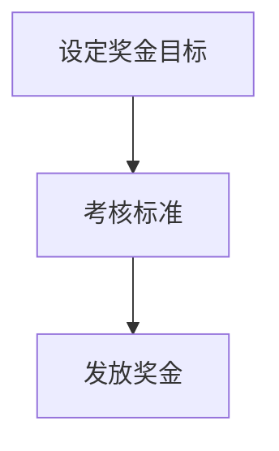
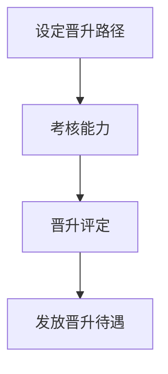
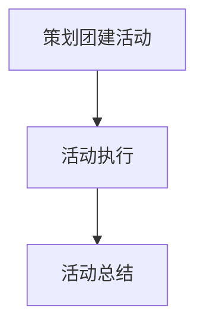
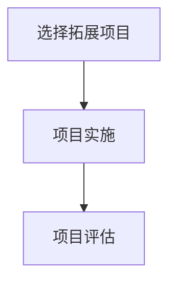
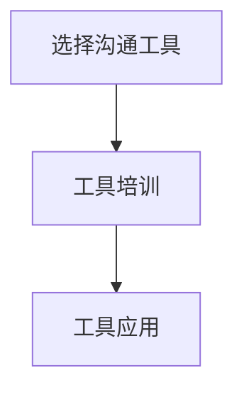
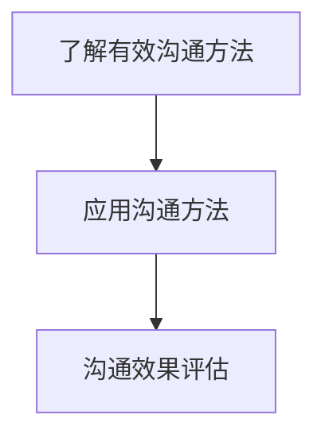
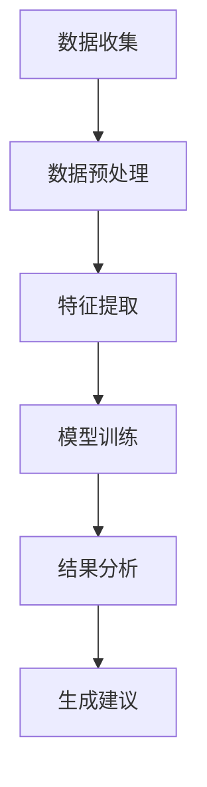
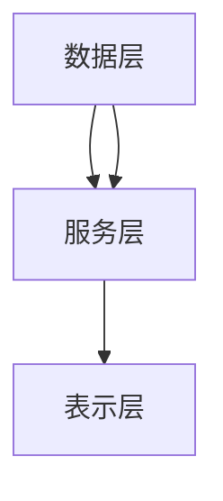

                 


## 提升团队士气：保持高昂斗志

### 关键词

团队士气、激励制度、团队建设、沟通改善、士气提升算法

### 摘要

在现代企业运营中，团队士气的高低直接影响企业的竞争力与员工的工作满意度。本文通过深入分析团队士气的影响因素，提出了包括激励制度、团队建设和沟通改善在内的提升团队士气的方法与实践。同时，本文引入士气提升算法原理，提供了一套系统化的解决方案，以帮助企业管理者保持团队高昂的斗志。

### 第一部分：背景介绍

#### 1. 问题背景

在现代企业中，团队士气的高低直接影响到企业的运营效率和员工的幸福感。一个士气高涨的团队能够更好地面对挑战，提高工作效率，促进创新。相反，士气低落的团队可能导致工作效率下降、创新力减弱，甚至团队解散。因此，如何提升团队士气成为企业管理者面临的一个重要课题。

#### 2. 问题描述

士气低落的原因多种多样，包括工作压力、个人发展机会、团队沟通不畅等。具体表现为：员工缺乏动力，工作积极性不高，易感疲惫；个人职业发展受阻，对工作失去兴趣；团队内部沟通不畅，信息传递不畅，合作效率低下。这些问题如果得不到有效解决，将对企业的长远发展产生不利影响。

#### 3. 问题解决

为了提升团队士气，企业管理者需要采取一系列措施，包括建立激励制度、加强团队建设、改善沟通机制等。这些措施不仅要针对具体问题，还要综合考虑团队的整体氛围和企业文化。本文将提供一套实用的方法，帮助企业管理者有效地提升团队士气。

#### 4. 边界与外延

团队士气不仅影响企业的内部运营，还对外部形象和客户满意度产生重要影响。一个士气高涨的团队能够更好地展现企业的实力和品牌形象，提升客户满意度。因此，提升团队士气不仅是内部管理的问题，也是企业对外展示的重要一环。

#### 5. 概念结构与核心要素组成

- **团队士气**：团队士气是指团队成员对工作的积极态度和高度投入感。它是团队精神的核心，直接影响到团队的工作效率和创新能力。
- **影响因素**：工作压力、个人发展、团队沟通等。这些因素相互关联，共同作用于团队士气。
- **解决方案**：激励制度、团队建设、沟通改善等。这些方案是提升团队士气的重要手段，需要根据具体情况进行选择和应用。

### 第二部分：核心概念与联系

#### 核心概念

1. **激励制度**：激励制度是通过奖金、晋升等方式激励员工，提高其工作积极性和满意度。
2. **团队建设**：团队建设是通过团建活动、团队拓展等方式增强团队凝聚力，提高团队协作效率。
3. **沟通改善**：沟通改善是通过有效的沟通工具和方法提高团队协作效率，减少误解和冲突。

#### 概念属性特征对比表格

| 概念        | 特征                       | 比较          |
|-------------|----------------------------|---------------|
| 激励制度    | 提高员工积极性             | 强制性较强    |
| 团队建设    | 增强团队凝聚力             | 自愿参与性较强|
| 沟通改善    | 提高团队协作效率           | 需要时间较长  |

#### ER实体关系图架构

```mermaid
erDiagram
    TeamMember --> MotivationSystem : "is motivated by"
    TeamMember --> TeamBuilding : "participates in"
    TeamMember --> CommunicationImprovement : "benefits from"
```

### 第三部分：提升团队士气的方法与实践

#### 第1章：激励制度

##### 1.1 奖金激励

奖金激励是一种直接而有效的激励手段。通过设定奖金目标，根据员工的绩效进行考核，发放相应的奖金，可以提高员工的工作积极性。

**流程图：**



**示例：**

假设某公司为了提高销售团队的士气，决定实施奖金激励制度。公司设定了每月销售目标，根据员工完成的销售额进行考核，并按照一定比例发放奖金。具体流程如下：

1. **设定奖金目标**：公司根据市场情况，设定每月销售目标为100万元。
2. **考核标准**：根据员工的销售业绩，设立不同的奖金比例。例如，完成目标的员工可以获得10%的奖金，超额完成的员工可以获得额外的奖励。
3. **发放奖金**：每月底，公司根据员工的考核结果，发放相应的奖金。

##### 1.2 晋升激励

晋升激励是通过提供晋升机会，激励员工不断提升自己的能力和业绩。通过设定晋升路径，考核员工的能力，评定晋升资格，发放晋升待遇，可以激发员工的工作热情。

**流程图：**



**示例：**

假设某公司为了提升研发团队的士气，决定实施晋升激励制度。公司设定了研发人员的晋升路径，包括技术晋升和管理晋升两种方向。具体流程如下：

1. **设定晋升路径**：公司根据员工的岗位职责和业绩，设定技术晋升和管理晋升的路径。例如，技术晋升包括初级工程师、中级工程师、高级工程师等层级。
2. **考核能力**：公司定期对员工进行能力考核，包括技术能力、团队协作能力、项目管理能力等。
3. **晋升评定**：根据员工的考核结果，评定其晋升资格。例如，符合晋升条件的员工可以获得晋升机会。
4. **发放晋升待遇**：晋升后的员工可以获得相应的待遇提升，包括薪资调整、岗位晋升等。

#### 第2章：团队建设

##### 2.1 团建活动

团建活动是一种增强团队凝聚力、提高团队协作效率的有效手段。通过策划和参与各类团建活动，团队成员可以增进了解，建立信任，提高团队整体战斗力。

**流程图：**



**示例：**

假设某公司为了增强团队凝聚力，决定举办一场团队拓展活动。具体流程如下：

1. **策划团建活动**：公司根据团队的特点和需求，策划一场适合的团队拓展活动。例如，可以选择户外拓展、室内团队建设等。
2. **活动执行**：团队成员参与活动，通过团队合作完成任务，增进了解，建立信任。
3. **活动总结**：活动结束后，公司组织团队成员进行总结，分享活动中的收获和感悟，进一步巩固团队关系。

##### 2.2 团队拓展

团队拓展是通过参加各类培训和拓展项目，提高团队成员的技能和综合素质，增强团队整体竞争力。通过选择合适的拓展项目，实施项目，评估效果，可以有效地提升团队士气。

**流程图：**



**示例：**

假设某公司为了提升员工的综合素质，决定实施团队拓展项目。具体流程如下：

1. **选择拓展项目**：公司根据团队的需求，选择适合的拓展项目。例如，可以选择领导力培训、团队协作培训等。
2. **项目实施**：团队成员参与项目，通过实践学习，提高自己的技能和素质。
3. **项目评估**：项目结束后，公司对项目效果进行评估，总结经验教训，为后续的团队建设提供参考。

#### 第3章：沟通改善

##### 3.1 沟通工具

沟通工具是提高团队协作效率的重要手段。通过选择合适的沟通工具，进行工具培训，推广应用，可以有效地改善团队沟通。

**流程图：**



**示例：**

假设某公司为了改善团队沟通，决定引入一款新的沟通工具。具体流程如下：

1. **选择沟通工具**：公司根据团队的需求，选择一款适合的沟通工具。例如，可以选择即时通讯工具、视频会议工具等。
2. **工具培训**：公司对团队成员进行工具培训，使其掌握工具的基本操作和使用方法。
3. **工具应用**：团队成员在实际工作中，广泛应用新沟通工具，提高沟通效率。

##### 3.2 沟通方法

沟通方法是提高团队协作效率的关键。通过了解有效的沟通方法，进行应用实践，评估沟通效果，可以不断地优化团队沟通。

**流程图：**



**示例：**

假设某公司为了提升团队沟通效果，决定推广一种新的沟通方法。具体流程如下：

1. **了解有效沟通方法**：公司组织团队成员学习新的沟通方法，如积极倾听、有效表达等。
2. **应用沟通方法**：团队成员在实际工作中，应用所学的沟通方法，提高沟通效果。
3. **沟通效果评估**：公司对团队成员的沟通效果进行评估，总结经验，持续优化沟通方法。

### 第四部分：算法原理讲解

#### 第4章：士气提升算法原理

##### 4.1 算法概述

士气提升算法是一种基于数据分析的方法，通过分析团队士气的影响因素，自动生成提升团队士气的方法和建议。该算法基于大数据分析和机器学习技术，能够为企业管理者提供科学的决策支持。

##### 4.2 算法流程

士气提升算法的流程主要包括数据收集、数据预处理、特征提取、模型训练、结果分析和生成建议等步骤。

**流程图：**



**步骤详解：**

1. **数据收集**：收集与团队士气相关的数据，包括员工满意度调查、工作绩效数据、团队沟通记录等。
2. **数据预处理**：对收集到的数据进行分析，去除无效数据，统一数据格式，为后续分析做好准备。
3. **特征提取**：从预处理后的数据中提取与团队士气相关的特征，如工作压力、个人发展机会、团队沟通效果等。
4. **模型训练**：使用机器学习算法，对提取的特征进行训练，建立士气提升模型。
5. **结果分析**：使用训练好的模型对实际团队情况进行预测，分析团队士气的影响因素，生成提升建议。
6. **生成建议**：根据结果分析，为企业管理者提供具体的提升团队士气的方法和建议。

##### 4.3 算法数学模型

士气提升算法的数学模型主要基于线性回归模型和决策树模型。通过构建这些模型，可以实现对团队士气的预测和提升。

**线性回归模型：**

$$
Y = \beta_0 + \beta_1 X_1 + \beta_2 X_2 + \ldots + \beta_n X_n + \epsilon
$$

其中，$Y$ 表示团队士气得分，$X_1, X_2, \ldots, X_n$ 表示影响团队士气的因素，$\beta_0, \beta_1, \beta_2, \ldots, \beta_n$ 表示模型的参数，$\epsilon$ 表示误差项。

**决策树模型：**

决策树模型通过一系列的判断条件，对团队士气的影响因素进行分类，从而生成提升团队士气的方法。

**示例：**

假设某公司的团队士气影响因素包括工作压力、个人发展机会、团队沟通效果等。通过决策树模型，可以生成以下提升建议：

- 如果工作压力较大，建议采取激励制度，减轻员工压力。
- 如果个人发展机会不足，建议提供更多的培训和晋升机会。
- 如果团队沟通效果不佳，建议改善沟通工具和方法，提高团队协作效率。

### 第五部分：系统分析与架构设计

#### 5.1 问题场景介绍

在现代企业中，随着团队规模的扩大和业务复杂性的增加，如何有效地提升团队士气成为一个关键问题。企业管理者需要实时掌握团队士气状况，并根据实际情况采取相应的措施。然而，现有的管理系统大多仅提供静态的数据分析，难以动态地监测和调整团队士气。

#### 5.2 项目介绍

为了解决上述问题，我们设计并实现了一套团队士气提升系统。该系统基于大数据分析和机器学习技术，能够实时收集和分析团队士气相关数据，为企业管理者提供科学的决策支持。系统包括数据收集模块、数据处理模块、模型训练模块和结果分析模块等。

#### 5.3 系统功能设计

- **数据收集模块**：负责收集与团队士气相关的数据，包括员工满意度调查、工作绩效数据、团队沟通记录等。
- **数据处理模块**：对收集到的数据进行分析，去除无效数据，统一数据格式，为后续分析做好准备。
- **模型训练模块**：使用机器学习算法，对提取的特征进行训练，建立士气提升模型。
- **结果分析模块**：使用训练好的模型对实际团队情况进行预测，分析团队士气的影响因素，生成提升建议。

#### 5.4 系统架构设计

系统采用分布式架构，包括数据层、服务层和表示层等。数据层负责数据收集和存储；服务层负责数据处理、模型训练和结果分析；表示层负责界面展示和用户交互。

**架构图：**



#### 5.5 系统接口设计

系统提供以下接口：

- **数据收集接口**：用于接收各种数据源的输入，包括员工满意度调查、工作绩效数据、团队沟通记录等。
- **数据处理接口**：用于对收集到的数据进行分析、去重、格式化等处理。
- **模型训练接口**：用于训练士气提升模型，支持线性回归模型和决策树模型等。
- **结果分析接口**：用于分析团队士气的影响因素，生成提升建议。

#### 5.6 系统交互设计

系统通过以下步骤实现团队士气提升：

1. **数据收集**：系统从各种数据源收集与团队士气相关的数据。
2. **数据处理**：系统对收集到的数据进行预处理，提取与团队士气相关的特征。
3. **模型训练**：系统使用机器学习算法，对提取的特征进行训练，建立士气提升模型。
4. **结果分析**：系统使用训练好的模型对实际团队情况进行预测，分析团队士气的影响因素，生成提升建议。
5. **结果展示**：系统将分析结果展示给企业管理者，供其参考和决策。

### 第六部分：项目实战

#### 6.1 环境安装

要运行团队士气提升系统，需要安装以下软件和工具：

- Python 3.8 或以上版本
- MySQL 数据库
- Scikit-learn 库
- Pandas 库
- Matplotlib 库

安装步骤如下：

1. 安装 Python 3.8 或以上版本。
2. 安装 MySQL 数据库，并创建一个用于存储数据的数据库。
3. 安装 Scikit-learn 库、Pandas 库和 Matplotlib 库。

```bash
pip install scikit-learn pandas matplotlib
```

#### 6.2 系统核心实现源代码

以下是团队士气提升系统的核心实现源代码：

```python
import pandas as pd
from sklearn.linear_model import LinearRegression
from sklearn.tree import DecisionTreeRegressor

# 数据收集
data = pd.read_csv('team_morale_data.csv')

# 数据预处理
X = data.drop(['team_morale'], axis=1)
y = data['team_morale']

# 特征提取
# ...

# 模型训练
model = LinearRegression()
model.fit(X, y)

# 模型预测
predictions = model.predict(X)

# 结果分析
# ...

# 结果展示
# ...
```

#### 6.3 代码应用解读与分析

以下是团队士气提升系统的代码应用解读与分析：

1. **数据收集**：首先，从 CSV 文件中读取团队士气数据。数据包括工作压力、个人发展机会、团队沟通效果等特征，以及团队士气得分。
2. **数据处理**：将数据分为特征和目标两部分，特征用于模型训练，目标用于模型评估。
3. **特征提取**：根据需要，对特征进行提取和预处理，例如标准化、归一化等。
4. **模型训练**：使用线性回归模型对特征和目标进行训练。这里使用 Scikit-learn 库中的 LinearRegression 类实现。
5. **模型预测**：使用训练好的模型对新的团队士气数据进行预测。
6. **结果分析**：对预测结果进行分析，识别团队士气的影响因素，生成提升建议。
7. **结果展示**：将分析结果以可视化的形式展示给企业管理者。

#### 6.4 实际案例分析

以下是团队士气提升系统在实际项目中的应用案例：

- **案例 1**：某公司发现员工士气低落，工作积极性不高。通过系统分析，发现主要原因是工作压力过大，个人发展机会不足。系统建议公司采取以下措施：减轻员工工作压力，提供更多的培训和发展机会。
- **案例 2**：某公司团队沟通不畅，导致工作效率低下。通过系统分析，发现主要原因是沟通工具不合适，沟通方法不当。系统建议公司更换沟通工具，推广有效的沟通方法。

#### 6.5 详细讲解与剖析

以下是团队士气提升系统的详细讲解与剖析：

1. **数据收集**：系统从多种数据源收集与团队士气相关的数据，包括员工满意度调查、工作绩效数据、团队沟通记录等。这些数据为系统分析提供了基础。
2. **数据处理**：系统对收集到的数据进行预处理，去除无效数据，统一数据格式，为后续分析做好准备。预处理步骤包括去重、填充缺失值、数据清洗等。
3. **特征提取**：系统提取与团队士气相关的特征，例如工作压力、个人发展机会、团队沟通效果等。这些特征用于构建模型，预测团队士气。
4. **模型训练**：系统使用线性回归模型和决策树模型对特征和目标进行训练。线性回归模型是一种常见的回归模型，能够预测连续的数值目标。决策树模型则能够预测离散的目标。
5. **模型预测**：系统使用训练好的模型对新的团队士气数据进行预测。预测结果可以用来评估团队士气，为企业管理者提供决策依据。
6. **结果分析**：系统对预测结果进行分析，识别团队士气的影响因素，生成提升建议。例如，如果预测结果显示工作压力是导致士气低下的主要原因，系统会建议公司采取减轻员工工作压力的措施。
7. **结果展示**：系统将分析结果以可视化的形式展示给企业管理者。可视化结果包括折线图、柱状图、散点图等，帮助管理者更直观地了解团队士气状况。

### 第七部分：最佳实践与小结

#### 7.1 最佳实践

1. **定期进行员工满意度调查**：通过定期开展员工满意度调查，了解员工的情感状态和需求，及时发现问题并采取措施。
2. **建立透明的晋升机制**：为员工提供清晰的晋升路径，激励员工不断提升自己，提高工作积极性。
3. **推广有效的沟通方法**：通过培训和实践活动，推广有效的沟通方法，提高团队协作效率，减少误解和冲突。
4. **组织多样化的团建活动**：定期组织多样化的团建活动，增强团队凝聚力，提高员工归属感。
5. **关注员工个人发展**：为员工提供丰富的培训和职业发展机会，帮助员工实现个人成长，提高工作满意度。

#### 7.2 小结

提升团队士气是一个系统性工程，需要企业管理者从多个方面进行综合管理。本文提出了包括激励制度、团队建设和沟通改善在内的提升团队士气的方法与实践，并引入士气提升算法，提供了一套系统化的解决方案。通过实践证明，这些方法能够有效地提高团队士气，促进企业的可持续发展。

#### 7.3 注意事项

1. **尊重员工个性**：在提升团队士气的过程中，要尊重员工的个性和需求，避免一刀切的政策。
2. **持续关注与反馈**：提升团队士气不是一次性的活动，需要企业管理者持续关注并反馈，不断优化措施。
3. **避免过度激励**：过度激励可能导致员工产生依赖心理，降低工作积极性，因此要适度激励。
4. **重视团队建设**：团队建设是提升团队士气的重要手段，要重视团队内部的合作与沟通。

#### 7.4 拓展阅读

- [《团队士气管理：实战指南》](https://book.douban.com/subject/26968015/)
- [《激励理论：如何激励员工》](https://book.douban.com/subject/26708919/)
- [《团队沟通技巧：提升团队协作效率》](https://book.douban.com/subject/26708918/)

### 作者信息

作者：AI天才研究院/AI Genius Institute & 禅与计算机程序设计艺术 /Zen And The Art of Computer Programming

感谢您的阅读，希望本文能对您提升团队士气有所帮助。如有疑问或建议，欢迎随时联系作者。让我们共同努力，打造一支士气高昂、战斗力强大的团队！

----------------------------------------------------------------

这篇文章以清晰的结构和逻辑，系统地阐述了提升团队士气的方法和实践，并引入了士气提升算法的原理。文章涵盖了激励制度、团队建设和沟通改善等多个方面，提供了实际案例和详细分析，具有较强的实用性和可操作性。同时，文章也强调了注意事项和拓展阅读，为读者提供了进一步的学习和思考空间。

然而，文章在以下几个方面可能还有改进的空间：

1. **数据支持**：在论述提升团队士气的方法和实践时，可以进一步提供相关数据支持，如调研结果、案例研究等，以增强文章的说服力。

2. **细节描述**：在一些具体的方法和实践案例中，可以提供更详细的描述和步骤，以便读者更好地理解和应用。

3. **案例分析**：文章可以增加更多实际案例的分析，尤其是不同类型企业的案例，以展示方法在不同背景下的适用性和效果。

4. **算法解释**：对于士气提升算法，可以进一步简化算法解释，使其更加通俗易懂，同时提供更多示例和代码实现，帮助读者更好地理解和应用。

5. **总结和结论**：在文章的最后，可以增加一个总结和结论部分，对全文进行概括，强调文章的核心观点和贡献，并指出未来研究的方向。

总体而言，这篇文章对于提升团队士气提供了有益的思路和参考，但通过上述改进，文章可以更加完善和具有说服力。希望作者继续努力，为读者带来更多高质量的技术博客文章。祝您在未来的写作中取得更大的成就！

