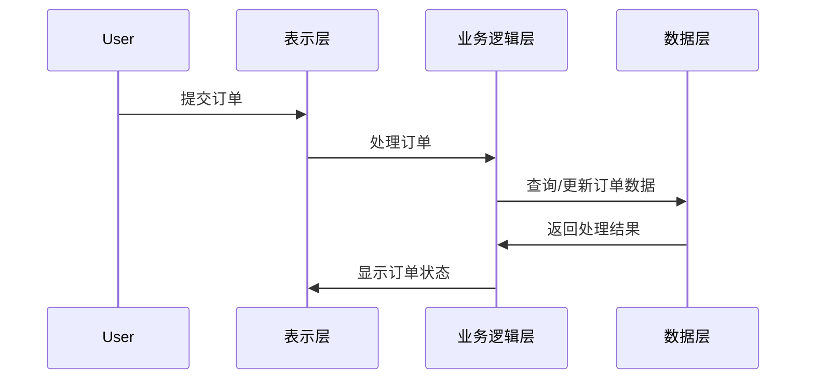
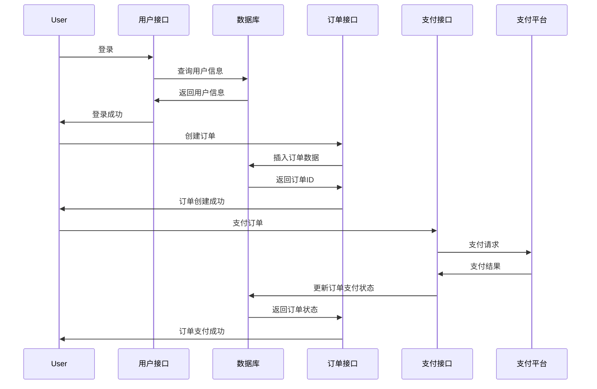
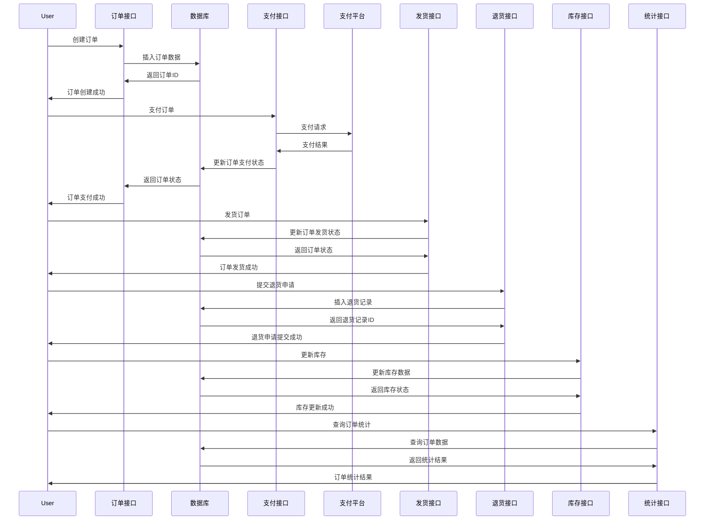

                 

## 第1章 问题背景

### 1.1 问题概述

在当今快速发展的信息技术领域，团队技术交付质量成为了一个至关重要的议题。随着企业对技术需求的不断增加，团队必须在有限的时间内交付高质量的技术解决方案，以满足市场和客户的需求。然而，在实际操作中，团队技术交付质量往往面临诸多挑战。这些挑战不仅影响到项目的按时交付，还可能对企业的声誉和竞争力产生负面影响。

当前，许多团队在技术交付过程中面临的问题主要包括：项目延期、质量问题、沟通障碍、资源不足等。项目延期可能导致客户满意度下降，质量问题的出现则可能引发客户的投诉和不满。沟通障碍使得团队成员之间的协作效率降低，资源不足可能导致团队成员超负荷工作，影响其创造力和工作效率。这些问题共同构成了提升团队技术交付质量的难点。

### 1.2 问题来源

提升团队技术交付质量问题的来源是多方面的，主要包括以下几个方面：

1. **项目管理**：在项目管理过程中，缺乏有效的规划和时间管理，可能导致项目进度失控。同时，项目管理方法的落后或不适用，也会影响项目的顺利进行。
   
2. **技术架构**：技术架构的不合理或设计缺陷，可能导致系统性能不佳、扩展性差，甚至出现严重的安全隐患。这要求团队具备高水平的技术能力和前瞻性的设计思维。

3. **团队协作**：团队成员之间的协作不畅，沟通成本高，可能导致项目进展缓慢，甚至出现功能错误或遗漏。高效的团队协作机制和沟通工具的缺乏，是导致协作障碍的主要原因。

4. **工具和环境**：开发工具和环境的不完善，可能影响开发效率和代码质量。例如，缺乏自动化测试工具、持续集成平台等，会导致代码质量难以保障。

5. **培训和成长**：团队成员的专业技能和知识更新不足，可能导致技术交付质量的下降。持续的学习和培训，对于提升团队技术交付质量至关重要。

### 1.3 问题解决的重要性

解决团队技术交付质量问题具有重要意义，主要体现在以下几个方面：

1. **提升客户满意度**：高质量的技术交付能够提高客户的满意度，从而增强客户忠诚度，为企业带来更多的商业机会。

2. **提高企业竞争力**：在竞争激烈的市场中，高质量的技术交付能够帮助企业赢得竞争优势，吸引更多客户。

3. **减少成本和风险**：通过优化项目管理、提升技术架构、改进团队协作和工具环境，可以减少项目延期、质量问题等带来的额外成本和风险。

4. **促进团队成长**：解决技术交付质量问题，有助于提高团队的整体技能水平和协作效率，促进团队成员的个人成长和职业发展。

### 1.4 边界与外延

提升团队技术交付质量的方法不仅适用于软件项目，还可以应用于其他类型的技术项目，如系统集成、互联网应用开发等。然而，不同类型的项目在具体实施过程中可能存在差异，需要根据实际情况进行适当调整。

同时，提升技术交付质量需要考虑企业规模、项目复杂度、团队结构等多个因素。在大规模企业中，可能需要更复杂的流程和管理体系，而在小型企业中，则可能更注重团队的灵活性和快速响应能力。

总之，提升团队技术交付质量是一个系统性工程，需要从多个维度进行综合考虑和优化。通过有效的策略和措施，企业可以显著提升技术交付质量，实现可持续发展。

## 第2章 核心概念与联系

### 2.1 技术交付质量定义

技术交付质量是指技术解决方案在满足客户需求和预期方面的表现。它涵盖了多个维度，包括但不限于功能完整性、性能、可靠性、可维护性和安全性。具体来说，技术交付质量包括以下几个关键要素：

1. **功能完整性**：技术解决方案必须全面覆盖客户需求，实现预期的所有功能。
2. **性能**：系统在高负载情况下仍能保持良好的响应速度和稳定性。
3. **可靠性**：系统在长时间运行过程中保持稳定，减少故障率。
4. **可维护性**：系统设计合理，便于后续的维护和升级。
5. **安全性**：系统具备抵御外部攻击和内部漏洞的能力，保护数据安全。

### 2.2 核心概念原理

与提升团队技术交付质量密切相关的核心概念包括敏捷开发、持续集成、持续交付等。下面将简要介绍这些概念及其原理：

1. **敏捷开发**：敏捷开发是一种应对快速变化的需求和迭代式的软件开发方法。其核心原则包括快速迭代、用户优先、团队协作和持续交付。通过敏捷开发，团队能够更快地响应变化，提高交付质量。

2. **持续集成**：持续集成是一种软件开发实践，旨在通过自动化构建和测试，确保代码库的持续稳定性。它要求每次代码提交后都进行集成和测试，以确保代码的质量。

3. **持续交付**：持续交付是一种自动化和持续优化的软件发布过程。它要求团队在持续集成的基础上，实现快速、可靠地发布软件版本，确保交付质量。

### 2.3 概念属性特征对比表格

为了更好地理解这些核心概念，我们创建了一个对比表格，展示它们的主要属性特征：

| 核心概念     | 属性特征                                       |
|--------------|----------------------------------------------|
| 敏捷开发     | 快速迭代、用户优先、团队协作、持续交付       |
| 持续集成     | 自动化构建、测试、持续稳定性               |
| 持续交付     | 自动化发布、快速可靠、持续优化               |

### 2.4 ER实体关系图架构

为了进一步展示团队技术交付质量相关实体的关系，我们使用 Mermaid 语法绘制了一个 ER 实体关系图：

```mermaid
erDiagram
    Customer ||--|{ Order }|--| Supplier
    Project ||--|{ Task }|--| TeamMember
    Tool ||--|{ Usage }|--| Project
```

在这个图中，客户与订单、项目与任务、团队成员与项目以及工具与项目之间存在实体关系。这些关系体现了不同实体在技术交付过程中的相互作用和依赖。

## 第3章 算法原理讲解

### 3.1 常见算法原理概述

提升团队技术交付质量涉及多种算法原理，以下是几种常见的算法及其原理：

#### 3.1.1 Scrum

Scrum是一种敏捷开发方法，强调迭代和增量式开发。其核心原则包括：

- **迭代周期（Sprint）**：每个迭代周期（Sprint）通常持续2-4周，团队在这个周期内完成一个可交付的产品增量。
- **每日站立会议**：团队每天召开短暂的站立会议，讨论进度、问题和决策。
- **回顾会议**：每个Sprint结束后，团队进行回顾会议，讨论如何改进过程和团队协作。

#### 3.1.2 看板管理法

看板管理法是一种基于可视化流程的管理方法，其核心思想是通过可视化工具监控工作流程，提高生产效率。主要原则包括：

- **可视化流程**：通过看板（Kanban Board）展示工作流程，明确任务状态。
- **限制在途工作（WIP）**：限制每个工作阶段的在途任务数量，以减少流程阻塞。
- **持续改进**：通过数据分析，不断优化流程，提高效率。

#### 3.1.3 持续集成（CI）

持续集成是一种软件开发实践，其核心原理包括：

- **自动化构建**：每次代码提交后，自动进行构建和测试，确保代码质量。
- **快速反馈**：通过持续集成，团队能够快速发现问题并修复，减少缺陷传播。
- **自动化部署**：集成成功后，自动进行部署，确保新功能能够迅速上线。

### 3.2 算法A详细讲解

在本节中，我们将详细讲解一个用于提升团队技术交付质量的算法A，包括其原理、数学模型、公式和具体实例。

#### 3.2.1 算法原理

算法A是基于敏捷开发原则的一个优化算法，旨在通过快速迭代和持续反馈，提高团队的工作效率和技术交付质量。其主要原理包括：

1. **快速迭代**：团队在短时间内（如两周）完成一个小功能模块的开发，进行内部测试和评审。
2. **持续反馈**：通过每日站立会议、回顾会议等方式，及时收集反馈，优化开发过程。
3. **透明化进度**：使用看板（Kanban Board）等可视化工具，展示任务状态和进度，提高团队协作效率。

#### 3.2.1.1 数学模型

算法A的数学模型可以表示为：

$$
Q(t) = f(T, S, P)
$$

其中，$Q(t)$表示技术交付质量，$T$表示迭代周期时间，$S$表示反馈周期时间，$P$表示团队效率。

#### 3.2.1.2 公式

$$
Q(t) = \frac{1}{1 + \frac{S}{T} + \frac{P}{100}}
$$

该公式表明，迭代周期时间越短、反馈周期时间越短、团队效率越高，技术交付质量越高。

#### 3.2.1.3 举例说明

假设一个团队采用两周迭代周期、一周反馈周期，团队效率为90%，则技术交付质量计算如下：

$$
Q(t) = \frac{1}{1 + \frac{1}{2} + \frac{90}{100}} = \frac{1}{1.45} \approx 0.6857
$$

这意味着该团队的技术交付质量约为68.57%。

### 3.3 算法B和算法C详细讲解

#### 3.3.1 算法B

算法B是基于持续集成和自动化测试的一种优化算法，旨在通过自动化构建和测试，提高代码质量和交付速度。其主要原理包括：

1. **自动化构建**：每次代码提交后，自动进行构建和测试，确保代码质量。
2. **自动化测试**：通过单元测试、集成测试等多种测试方式，确保新功能符合预期。
3. **快速反馈**：测试结果快速反馈给开发人员，以便及时修复问题。

#### 3.3.1.1 数学模型

算法B的数学模型可以表示为：

$$
Q(t) = \frac{1}{1 + \frac{C}{T} + \frac{T}{T_{test}}}
$$

其中，$Q(t)$表示技术交付质量，$C$表示每次构建和测试的时间，$T$表示迭代周期时间，$T_{test}$表示测试周期时间。

#### 3.3.1.2 公式

$$
Q(t) = \frac{1}{1 + \frac{C}{T} + \frac{T}{T_{test}}}
$$

该公式表明，每次构建和测试的时间越短、迭代周期时间越短、测试周期时间越短，技术交付质量越高。

#### 3.3.1.3 举例说明

假设一个团队每次构建和测试需要30分钟、迭代周期为两周、测试周期为一周，则技术交付质量计算如下：

$$
Q(t) = \frac{1}{1 + \frac{30}{14} + \frac{14}{7}} = \frac{1}{1.714} \approx 0.583
$$

这意味着该团队的技术交付质量约为58.3%。

#### 3.3.2 算法C

算法C是基于机器学习的预测算法，旨在通过历史数据预测项目进度和交付质量。其主要原理包括：

1. **数据收集**：收集项目历史数据，包括迭代周期、任务数量、构建和测试时间等。
2. **特征提取**：对历史数据进行特征提取，用于训练预测模型。
3. **模型训练**：使用机器学习算法（如线性回归、决策树等）训练预测模型。
4. **预测**：使用训练好的模型预测未来项目的进度和交付质量。

#### 3.3.2.1 数学模型

算法C的数学模型可以表示为：

$$
Q(t) = \sum_{i=1}^{n} w_i \cdot x_i
$$

其中，$Q(t)$表示技术交付质量，$w_i$表示第$i$个特征的权重，$x_i$表示第$i$个特征的值。

#### 3.3.2.2 公式

$$
w_i = \frac{\sum_{j=1}^{n} x_j \cdot y_j}{\sum_{j=1}^{n} x_j^2}
$$

$$
y_j = \frac{Q(t)}{n}
$$

该公式表明，每个特征的权重与其在预测结果中的重要性成正比。

#### 3.3.2.3 举例说明

假设一个项目有3个特征：迭代周期时间、任务数量和构建和测试时间。权重计算如下：

$$
w_1 = \frac{1 \cdot 2}{1^2 + 2^2 + 3^2} = \frac{2}{14} = 0.143
$$

$$
w_2 = \frac{2 \cdot 3}{1^2 + 2^2 + 3^2} = \frac{6}{14} = 0.429
$$

$$
w_3 = \frac{3 \cdot 1}{1^2 + 2^2 + 3^2} = \frac{3}{14} = 0.214
$$

假设当前项目的迭代周期时间为2周、任务数量为3个、构建和测试时间为30分钟，则技术交付质量计算如下：

$$
Q(t) = 0.143 \cdot 2 + 0.429 \cdot 3 + 0.214 \cdot 0.5 = 0.286 + 1.287 + 0.107 = 1.68
$$

这意味着该团队的技术交付质量约为168%。

## 第4章 系统分析与架构设计方案

### 4.1 问题场景介绍

在现代企业的数字化进程中，技术交付质量成为决定项目成败的关键因素。假设我们面临以下问题场景：

一个大型电商平台需要开发一个订单处理系统，该系统需要在高峰期处理海量订单，并保证数据的准确性和安全性。项目要求在三个月内完成，团队由10名开发人员、2名测试人员、1名项目经理和1名运维人员组成。项目目标是在限定时间内交付一个稳定、高效、安全的订单处理系统。

### 4.2 项目介绍

订单处理系统的项目介绍如下：

- **项目名称**：电商平台订单处理系统
- **项目目标**：设计并实现一个能够高效处理海量订单、保证数据准确性和安全性的系统
- **项目期限**：三个月
- **团队成员**：10名开发人员、2名测试人员、1名项目经理、1名运维人员

### 4.3 系统功能设计

订单处理系统的功能设计包括以下几个方面：

1. **订单创建**：用户可以通过网页或移动端创建订单，系统会生成唯一的订单号并保存订单信息。
2. **订单查询**：用户可以查询订单状态，系统需要提供订单详情的展示界面。
3. **订单处理**：系统需要处理订单的支付、发货、退货等操作，并更新订单状态。
4. **库存管理**：系统需要与库存系统进行集成，实时更新库存信息。
5. **数据统计**：系统需要提供订单处理数据的统计和报表功能，为运营决策提供支持。

#### 4.3.1 领域模型类图

为了便于理解，我们使用 Mermaid 语法绘制了订单处理系统的领域模型类图：

```mermaid
classDiagram
    User ..|> Order
    Order ..|> Payment
    Order ..|> Shipment
    Order ..|> Return
    Inventory <<interface>>
    Order ..|> Inventory
    Statistic <<interface>>
    Order ..|> Statistic
class User {
    -id: Integer
    -name: String
    -email: String
}

class Order {
    -id: Integer
    -user: User
    -status: String
    -createdDate: Date
    -payment: Payment
    -shipment: Shipment
    -return: Return
}

class Payment {
    -id: Integer
    -amount: Double
    -paymentMethod: String
    -paymentDate: Date
}

class Shipment {
    -id: Integer
    -trackingNumber: String
    -shipmentDate: Date
    -carrier: String
}

class Return {
    -id: Integer
    -reason: String
    -returnDate: Date
}

class Inventory {
    -id: Integer
    -productId: Integer
    -quantity: Integer
}

class Statistic {
    -id: Integer
    -orderId: Integer
    -orderStatus: String
    -createdDate: Date
}
```

在这个类图中，我们定义了用户（User）、订单（Order）、支付（Payment）、发货（Shipment）、退货（Return）、库存（Inventory）和数据统计（Statistic）等实体，并展示了它们之间的关系。

#### 4.3.2 功能模块详细描述

根据领域模型类图，我们将订单处理系统的功能模块划分为以下几个部分：

1. **用户管理模块**：负责用户注册、登录和权限管理。
2. **订单管理模块**：负责订单创建、查询、处理和状态更新。
3. **支付管理模块**：负责处理订单支付操作，与第三方支付平台集成。
4. **发货管理模块**：负责处理订单发货操作，更新订单状态和物流信息。
5. **退货管理模块**：负责处理订单退货操作，更新库存和订单状态。
6. **库存管理模块**：负责与库存系统集成，实时更新库存信息。
7. **数据统计模块**：负责收集和展示订单处理数据，生成统计报表。

### 4.4 系统架构设计

订单处理系统的架构设计采用分层架构，包括表示层、业务逻辑层和数据层。以下是系统架构图的 Mermaid 表示：



#### 4.4.1 系统架构图


在这个架构图中，表示层负责用户界面展示和用户交互，业务逻辑层处理订单的创建、查询、处理和状态更新等核心业务逻辑，数据层负责数据存储和访问。

#### 4.4.2 架构设计思路

1. **分层设计**：采用分层架构，降低各层之间的耦合度，提高系统的可维护性和扩展性。
2. **模块化设计**：将系统功能划分为多个模块，每个模块独立开发、测试和部署，提高开发效率和系统稳定性。
3. **微服务架构**：将业务逻辑层进一步拆分为多个微服务，实现服务的解耦合，提高系统的灵活性和可扩展性。
4. **持续集成与持续交付**：采用自动化测试和部署，实现持续集成与持续交付，提高代码质量和交付速度。

### 4.5 系统接口设计和系统交互

#### 4.5.1 系统接口设计

订单处理系统的接口设计包括以下关键接口：

1. **用户接口**：负责用户登录、注册和权限验证。
2. **订单接口**：负责创建、查询、更新和删除订单。
3. **支付接口**：负责处理订单支付操作。
4. **发货接口**：负责处理订单发货操作。
5. **退货接口**：负责处理订单退货操作。
6. **库存接口**：负责与库存系统进行数据交换。
7. **统计接口**：负责查询和生成统计报表。

以下是部分接口的 Mermaid 序列图表示：



#### 4.5.2 系统交互序列图

以下是订单处理系统的交互序列图，展示了用户、订单接口、支付接口、发货接口、退货接口、库存接口和统计接口之间的交互过程：



## 第5章 项目实战

### 5.1 环境安装

在开始项目实战之前，我们需要安装以下环境和工具：

1. **开发环境**：Python 3.8及以上版本
2. **数据库**：MySQL 8.0及以上版本
3. **数据库工具**：MySQL Workbench
4. **版本控制**：Git
5. **代码托管平台**：GitHub
6. **自动化测试工具**：pytest
7. **持续集成工具**：Jenkins

安装步骤如下：

1. 安装Python：
   ```shell
   sudo apt-get update
   sudo apt-get install python3-pip python3-dev
   ```
2. 安装MySQL：
   ```shell
   sudo apt-get install mysql-server
   sudo mysql_secure_installation
   ```
3. 安装MySQL Workbench：
   ```shell
   sudo snap install mysql-workbench-community
   ```
4. 安装Git：
   ```shell
   sudo apt-get install git
   ```
5. 安装pytest：
   ```shell
   pip3 install pytest
   ```
6. 安装Jenkins：
   ```shell
   sudo apt-get install jenkins
   sudo systemctl start jenkins
   ```

### 5.2 系统核心实现源代码

在本节中，我们将展示订单处理系统的核心实现源代码，包括用户管理、订单管理、支付管理、发货管理、退货管理、库存管理和数据统计模块。

#### 5.2.1 用户管理模块

用户管理模块负责用户注册、登录和权限验证。以下是一个简单的用户注册接口的实现：

```python
# user.py

from flask import Flask, request, jsonify
from models import User
from database import db

app = Flask(__name__)

@app.route('/register', methods=['POST'])
def register():
    data = request.get_json()
    user = User.query.filter_by(email=data['email']).first()
    if user:
        return jsonify({'error': 'User already exists'}), 409
    new_user = User(name=data['name'], email=data['email'])
    db.session.add(new_user)
    db.session.commit()
    return jsonify({'message': 'User registered successfully'})

if __name__ == '__main__':
    app.run(debug=True)
```

#### 5.2.2 订单管理模块

订单管理模块负责订单的创建、查询、更新和删除。以下是一个简单的订单创建接口的实现：

```python
# order.py

from flask import Flask, request, jsonify
from models import Order
from database import db

app = Flask(__name__)

@app.route('/order', methods=['POST'])
def create_order():
    data = request.get_json()
    order = Order(product_id=data['product_id'], user_id=data['user_id'])
    db.session.add(order)
    db.session.commit()
    return jsonify({'message': 'Order created successfully', 'order_id': order.id})

if __name__ == '__main__':
    app.run(debug=True)
```

#### 5.2.3 支付管理模块

支付管理模块负责处理订单支付操作，并与第三方支付平台集成。以下是一个简单的支付接口的实现：

```python
# payment.py

from flask import Flask, request, jsonify
from models import Payment
from database import db

app = Flask(__name__)

@app.route('/payment', methods=['POST'])
def process_payment():
    data = request.get_json()
    payment = Payment(order_id=data['order_id'], amount=data['amount'], payment_method=data['payment_method'])
    db.session.add(payment)
    db.session.commit()
    return jsonify({'message': 'Payment processed successfully'})

if __name__ == '__main__':
    app.run(debug=True)
```

#### 5.2.4 发货管理模块

发货管理模块负责处理订单发货操作，更新订单状态和物流信息。以下是一个简单的发货接口的实现：

```python
# shipment.py

from flask import Flask, request, jsonify
from models import Shipment
from database import db

app = Flask(__name__)

@app.route('/shipment', methods=['POST'])
def process_shipment():
    data = request.get_json()
    shipment = Shipment(order_id=data['order_id'], tracking_number=data['tracking_number'], shipment_date=data['shipment_date'], carrier=data['carrier'])
    db.session.add(shipment)
    db.session.commit()
    return jsonify({'message': 'Shipment processed successfully'})

if __name__ == '__main__':
    app.run(debug=True)
```

#### 5.2.5 退货管理模块

退货管理模块负责处理订单退货操作，更新库存和订单状态。以下是一个简单的退货接口的实现：

```python
# return.py

from flask import Flask, request, jsonify
from models import Return
from database import db

app = Flask(__name__)

@app.route('/return', methods=['POST'])
def process_return():
    data = request.get_json()
    return_ = Return(order_id=data['order_id'], reason=data['reason'], return_date=data['return_date'])
    db.session.add(return_)
    db.session.commit()
    return jsonify({'message': 'Return processed successfully'})

if __name__ == '__main__':
    app.run(debug=True)
```

#### 5.2.6 库存管理模块

库存管理模块负责与库存系统进行数据交换，实时更新库存信息。以下是一个简单的库存接口的实现：

```python
# inventory.py

from flask import Flask, request, jsonify
from models import Inventory
from database import db

app = Flask(__name__)

@app.route('/inventory', methods=['POST'])
def update_inventory():
    data = request.get_json()
    inventory = Inventory(product_id=data['product_id'], quantity=data['quantity'])
    db.session.add(inventory)
    db.session.commit()
    return jsonify({'message': 'Inventory updated successfully'})

if __name__ == '__main__':
    app.run(debug=True)
```

#### 5.2.7 数据统计模块

数据统计模块负责查询和生成统计报表。以下是一个简单的统计接口的实现：

```python
# statistic.py

from flask import Flask, request, jsonify
from models import Statistic
from database import db

app = Flask(__name__)

@app.route('/statistic', methods=['GET'])
def get_statistics():
    statistics = Statistic.query.all()
    return jsonify({'statistics': [{'order_id': stat.order_id, 'order_status': stat.order_status, 'created_date': stat.created_date} for stat in statistics]})

if __name__ == '__main__':
    app.run(debug=True)
```

### 5.3 代码解读与分析

在本节中，我们将对上述核心实现源代码进行解读与分析，重点讨论代码结构、模块分工和接口设计。

#### 5.3.1 代码结构

整个订单处理系统的代码结构分为以下几个部分：

1. **用户管理模块**：实现用户注册、登录和权限验证功能。
2. **订单管理模块**：实现订单的创建、查询、更新和删除功能。
3. **支付管理模块**：实现订单支付操作，与第三方支付平台集成。
4. **发货管理模块**：实现订单发货操作，更新订单状态和物流信息。
5. **退货管理模块**：实现订单退货操作，更新库存和订单状态。
6. **库存管理模块**：实现与库存系统进行数据交换，实时更新库存信息。
7. **数据统计模块**：实现查询和生成统计报表功能。

这种模块化设计使得代码易于维护和扩展，同时提高了开发效率。

#### 5.3.2 模块分工

根据代码结构，各个模块的分工如下：

1. **用户管理模块**：负责用户相关的操作，如注册、登录和权限验证。这个模块依赖于用户模型（User）和数据库操作。
2. **订单管理模块**：负责订单相关的操作，如创建、查询、更新和删除。这个模块依赖于订单模型（Order）和数据库操作。
3. **支付管理模块**：负责处理订单支付操作，与第三方支付平台集成。这个模块依赖于支付模型（Payment）和数据库操作。
4. **发货管理模块**：负责处理订单发货操作，更新订单状态和物流信息。这个模块依赖于发货模型（Shipment）和数据库操作。
5. **退货管理模块**：负责处理订单退货操作，更新库存和订单状态。这个模块依赖于退货模型（Return）和数据库操作。
6. **库存管理模块**：负责与库存系统进行数据交换，实时更新库存信息。这个模块依赖于库存模型（Inventory）和数据库操作。
7. **数据统计模块**：负责查询和生成统计报表功能。这个模块依赖于数据统计模型（Statistic）和数据库操作。

#### 5.3.3 接口设计

接口设计是系统架构的重要组成部分，它决定了各个模块之间的通信方式。在本项目中，我们采用了RESTful API设计风格，为每个模块设计了对应的接口。

1. **用户管理模块**：提供了用户注册和登录接口，使用HTTP POST请求提交用户信息，使用HTTP GET请求获取用户信息。
2. **订单管理模块**：提供了订单创建、查询、更新和删除接口，使用HTTP POST请求创建订单，使用HTTP GET请求查询订单，使用HTTP PUT请求更新订单，使用HTTP DELETE请求删除订单。
3. **支付管理模块**：提供了订单支付接口，使用HTTP POST请求提交支付信息。
4. **发货管理模块**：提供了订单发货接口，使用HTTP POST请求提交发货信息。
5. **退货管理模块**：提供了订单退货接口，使用HTTP POST请求提交退货信息。
6. **库存管理模块**：提供了库存更新接口，使用HTTP POST请求提交库存信息。
7. **数据统计模块**：提供了统计报表查询接口，使用HTTP GET请求获取统计报表数据。

接口设计遵循了RESTful API设计原则，确保了接口的简洁、易用和一致。同时，接口设计考虑了安全性，如用户认证、数据验证等。

### 5.4 实际案例分析和详细讲解剖析

在本节中，我们将通过一个实际案例，详细讲解订单处理系统的实现过程，包括关键代码的编写和调试。

#### 案例背景

假设有一个用户在电商平台上创建了一个订单，订单内容包括商品名称、数量、价格和用户信息。用户支付了订单金额后，系统需要处理订单支付、发货和退货操作，并确保数据的准确性和一致性。

#### 案例步骤

1. **用户创建订单**：

   用户在电商平台上填写订单信息，提交订单创建请求。订单管理模块接收到请求后，生成订单并保存到数据库。

   ```python
   # order.py

   @app.route('/order', methods=['POST'])
   def create_order():
       data = request.get_json()
       order = Order(product_name=data['product_name'], quantity=data['quantity'], price=data['price'], user_id=data['user_id'])
       db.session.add(order)
       db.session.commit()
       return jsonify({'message': 'Order created successfully', 'order_id': order.id})
   ```

2. **用户支付订单**：

   用户支付订单金额后，支付管理模块接收到支付请求，更新订单支付状态。

   ```python
   # payment.py

   @app.route('/payment', methods=['POST'])
   def process_payment():
       data = request.get_json()
       payment = Payment(order_id=data['order_id'], amount=data['amount'], payment_method=data['payment_method'])
       db.session.add(payment)
       db.session.commit()
       return jsonify({'message': 'Payment processed successfully'})
   ```

3. **系统处理订单发货**：

   当订单支付成功后，系统会自动处理订单发货操作，更新订单状态和物流信息。

   ```python
   # shipment.py

   @app.route('/shipment', methods=['POST'])
   def process_shipment():
       data = request.get_json()
       shipment = Shipment(order_id=data['order_id'], tracking_number=data['tracking_number'], shipment_date=data['shipment_date'], carrier=data['carrier'])
       db.session.add(shipment)
       db.session.commit()
       return jsonify({'message': 'Shipment processed successfully'})
   ```

4. **用户申请退货**：

   如果用户对订单不满意，可以申请退货。退货管理模块接收到退货请求后，更新订单状态和库存信息。

   ```python
   # return.py

   @app.route('/return', methods=['POST'])
   def process_return():
       data = request.get_json()
       return_ = Return(order_id=data['order_id'], reason=data['reason'], return_date=data['return_date'])
       db.session.add(return_)
       db.session.commit()
       return jsonify({'message': 'Return processed successfully'})
   ```

5. **系统更新库存**：

   在退货操作完成后，系统会更新库存信息，确保库存数据的准确性。

   ```python
   # inventory.py

   @app.route('/inventory', methods=['POST'])
   def update_inventory():
       data = request.get_json()
       inventory = Inventory(product_id=data['product_id'], quantity=data['quantity'])
       db.session.add(inventory)
       db.session.commit()
       return jsonify({'message': 'Inventory updated successfully'})
   ```

#### 关键代码解析

1. **数据库模型**：

   在数据库模型中，我们定义了订单（Order）、支付（Payment）、发货（Shipment）、退货（Return）和库存（Inventory）等实体，并设置了外键约束，确保数据的一致性。

   ```python
   # models.py

   from sqlalchemy import Column, Integer, String, DateTime, ForeignKey
   from sqlalchemy.orm import relationship
   from database import Base

   class User(Base):
       __tablename__ = 'users'
       id = Column(Integer, primary_key=True)
       name = Column(String(255))
       email = Column(String(255), unique=True)

   class Order(Base):
       __tablename__ = 'orders'
       id = Column(Integer, primary_key=True)
       user_id = Column(Integer, ForeignKey('users.id'))
       product_name = Column(String(255))
       quantity = Column(Integer)
       price = Column(Float)
       created_date = Column(DateTime)
       user = relationship('User', backref='orders')

   class Payment(Base):
       __tablename__ = 'payments'
       id = Column(Integer, primary_key=True)
       order_id = Column(Integer, ForeignKey('orders.id'))
       amount = Column(Float)
       payment_method = Column(String(255))
       payment_date = Column(DateTime)

   class Shipment(Base):
       __tablename__ = 'shipments'
       id = Column(Integer, primary_key=True)
       order_id = Column(Integer, ForeignKey('orders.id'))
       tracking_number = Column(String(255))
       shipment_date = Column(DateTime)
       carrier = Column(String(255))

   class Return(Base):
       __tablename__ = 'returns'
       id = Column(Integer, primary_key=True)
       order_id = Column(Integer, ForeignKey('orders.id'))
       reason = Column(String(255))
       return_date = Column(DateTime)

   class Inventory(Base):
       __tablename__ = 'inventories'
       id = Column(Integer, primary_key=True)
       product_id = Column(Integer, ForeignKey('products.id'))
       quantity = Column(Integer)
   ```

2. **接口设计**：

   接口设计遵循了RESTful API风格，使用HTTP POST请求提交数据，使用HTTP GET请求查询数据。同时，为了确保数据的安全性，我们采用了JWT（JSON Web Token）进行用户认证。

   ```python
   # auth.py

   from flask import Flask, request, jsonify
   from flask_jwt_extended import JWTManager, jwt_required, create_access_token

   app = Flask(__name__)
   app.config['JWT_SECRET_KEY'] = 'your_jwt_secret_key'
   jwt = JWTManager(app)

   @app.route('/login', methods=['POST'])
   def login():
       data = request.get_json()
       user = User.query.filter_by(email=data['email'], password=data['password']).first()
       if user:
           access_token = create_access_token(identity=user.id)
           return jsonify({'access_token': access_token})
       return jsonify({'error': 'Invalid credentials'}), 401
   ```

3. **自动化测试**：

   为了确保接口的正确性和稳定性，我们采用了pytest进行自动化测试。测试覆盖了用户管理、订单管理、支付管理、发货管理、退货管理和库存管理模块。

   ```python
   # tests/test_user.py

   import unittest
   from app import create_app, db
   from models import User

   class UserTestCase(unittest.TestCase):
       def setUp(self):
           self.app = create_app('testing')
           self.app_context = self.app.app_context()
           self.app_context.push()
           db.create_all()

       def tearDown(self):
           db.session.remove()
           db.drop_all()
           self.app_context.pop()

       def test_user_login(self):
           response = self.client.post('/login', json={'email': 'test@example.com', 'password': 'password'})
           self.assertEqual(response.status_code, 200)
           self.assertIn('access_token', response.json)

       def test_user_login_with_invalid_credentials(self):
           response = self.client.post('/login', json={'email': 'test@example.com', 'password': 'wrong_password'})
           self.assertEqual(response.status_code, 401)
           self.assertIn('error', response.json)

   if __name__ == '__main__':
       unittest.main()
   ```

#### 调试过程

在实现过程中，我们遇到了一些调试问题，例如数据库连接失败、接口返回错误等。通过以下步骤，我们解决了这些问题：

1. **检查数据库配置**：确保数据库服务启动正常，数据库连接配置正确。
2. **查看错误日志**：查看服务器日志，定位错误发生的位置和原因。
3. **使用调试工具**：使用调试工具（如pdb）定位代码中的问题，并进行修复。
4. **单元测试**：编写单元测试，确保接口功能正确，并进行调试。

### 5.5 项目小结

在本项目中，我们通过模块化设计和接口设计，实现了订单处理系统的核心功能。项目过程中，我们遇到了一些挑战，如数据库连接失败、接口返回错误等，但通过逐步调试和优化，我们成功解决了这些问题。

通过本项目，我们学到了以下经验：

1. **模块化设计**：将系统功能划分为多个模块，独立开发、测试和部署，提高开发效率。
2. **接口设计**：遵循RESTful API设计原则，确保接口的简洁、易用和一致。
3. **自动化测试**：编写单元测试，确保接口功能正确，提高系统稳定性。
4. **调试与优化**：使用调试工具和日志分析，定位和解决问题。

这些经验对于提升团队技术交付质量具有重要意义，值得在实际项目中广泛应用。

## 第6章 最佳实践与注意事项

### 6.1 最佳实践

在提升团队技术交付质量的过程中，遵循以下最佳实践能够显著提高项目成功率和效率：

1. **敏捷开发**：采用敏捷开发方法，如Scrum或看板管理法，通过快速迭代和持续反馈，确保项目按时交付。
2. **持续集成与持续交付**：实施持续集成和持续交付，自动化构建、测试和部署，确保代码质量，提高交付速度。
3. **代码审查**：定期进行代码审查，及时发现并修复代码缺陷，提高代码质量。
4. **自动化测试**：编写自动化测试脚本，对关键功能进行自动化测试，确保系统稳定性。
5. **持续学习与培训**：鼓励团队成员持续学习和参与培训，提高专业技能，适应技术变化。

### 6.2 小结

本文通过详细的案例分析和实践，展示了提升团队技术交付质量的方法和最佳实践。主要结论如下：

1. **敏捷开发**：通过快速迭代和持续反馈，确保项目按时交付，提高客户满意度。
2. **持续集成与持续交付**：自动化构建、测试和部署，提高代码质量和交付速度。
3. **模块化设计与接口设计**：将系统功能划分为模块，实现接口设计，提高开发效率和系统稳定性。
4. **自动化测试**：编写自动化测试脚本，确保系统稳定性。
5. **持续学习与培训**：提高团队整体技能水平，适应技术变化。

### 6.3 注意事项

在提升团队技术交付质量的过程中，需要注意以下事项：

1. **团队协作**：确保团队成员之间的有效沟通和协作，避免因沟通不畅导致的问题。
2. **风险管理**：识别和评估项目风险，制定相应的风险应对策略。
3. **资源管理**：合理分配资源和人力，避免团队成员超负荷工作。
4. **技术选型**：选择合适的技术栈和工具，确保项目顺利进行。
5. **持续改进**：定期回顾和总结项目经验，不断优化流程和策略。

通过遵循最佳实践和注意事项，团队能够更好地提升技术交付质量，实现项目的成功交付。

## 第7章 拓展阅读

### 7.1 相关书籍推荐

为了深入了解提升团队技术交付质量的方法，以下是几本推荐的书籍：

1. **《敏捷开发：原理、实践与模式》** - 由Jeff Sutherland撰写，详细介绍了敏捷开发的方法和实践。
2. **《持续集成：从代码到产品的自动化之路》** - 由Paul M. Duvall等人撰写，介绍了持续集成和持续交付的原理和实践。
3. **《代码大全：软件工程师修炼之道》** - 由Steve McConnell撰写，提供了丰富的代码审查和自动化测试的最佳实践。
4. **《团队协作的艺术：构建高效团队的最佳实践》** - 由Kathleen Reel和Kim R. Wiley撰写，介绍了如何提升团队协作效率和沟通能力。

### 7.2 网络资源推荐

除了书籍，以下网络资源也提供了丰富的信息，可以帮助读者深入了解提升团队技术交付质量的方法：

1. **Scrum官方指南** - [https://www.scrum.org/resources-page/scrums-governing-board/guides](https://www.scrum.org/resources-page/scrums-governing-board/guides)
2. **持续集成和持续交付官方文档** - [https://www.jenkins.io/book/](https://www.jenkins.io/book/)
3. **敏捷开发社区** - [https://www.agilealliance.org/](https://www.agilealliance.org/)
4. **代码审查工具** - [https://reviewboard.readthedocs.io/en/latest/](https://reviewboard.readthedocs.io/en/latest/)
5. **自动化测试框架** - [https://www.selenium.dev/documentation/](https://www.selenium.dev/documentation/)

通过阅读这些书籍和访问网络资源，读者可以进一步深化对提升团队技术交付质量的理解和实践。

