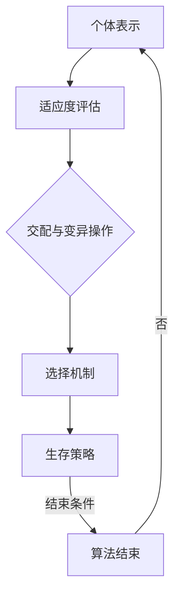
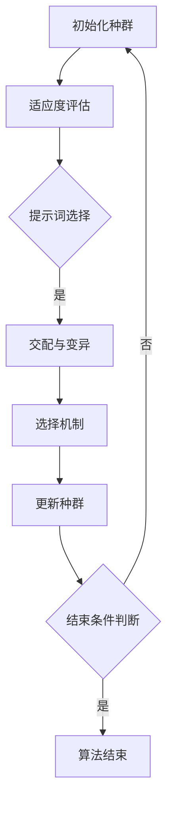

                 

### 第1章 引言

#### 1.1 研究背景与意义

随着人工智能技术的飞速发展，优化算法在人工智能领域的重要性日益凸显。作为进化计算的一种重要方法，协同进化算法（Cooperative Coevolutionary Algorithms）在优化复杂问题的解决方案方面展示了独特的优势。然而，协同进化算法在处理高维、大规模数据时，往往存在计算效率低、收敛速度慢等问题。

提示词优化（Keyword Optimization）是一种通过对关键字进行选择和调整，以提高算法性能的方法。近年来，随着深度学习和大数据技术的进步，提示词优化在协同进化算法中的应用逐渐受到关注。提示词优化可以有效地引导算法探索搜索空间，提高算法的收敛速度和稳定性。

当前，关于协同进化算法和提示词优化的研究已取得了一些成果，但仍然存在一些不足。首先，现有研究大多集中在理论分析和小规模实验验证，对于实际应用场景的探索较少。其次，多数研究在算法性能方面有所提升，但对算法复杂度和稳定性缺乏深入分析。此外，对于提示词优化的机制和策略，仍存在很多需要进一步探讨的问题。

本文旨在通过引入提示词优化，对协同进化算法进行改进，以提高其在处理复杂问题时的性能。具体研究内容包括：1）提出一种基于提示词优化的协同进化算法，2）对其性能进行详细分析和评估，3）探讨该算法在不同应用场景中的适用性。

#### 1.2 本书结构安排

本书共分为七个章节，具体内容安排如下：

- **第1章 引言**：介绍研究背景、意义、目标以及本书的结构安排。
- **第2章 协同进化算法基础**：介绍协同进化算法的基本概念、原理和核心概念的联系。
- **第3章 提示词优化的协同进化算法**：介绍提示词优化的基本概念、算法原理和流程。
- **第4章 算法性能分析与评估**：对算法性能进行评价和比较。
- **第5章 应用场景与案例分析**：探讨算法在不同应用场景中的适用性。
- **第6章 算法优化策略与未来展望**：提出优化策略和未来研究方向。
- **第7章 结论**：总结研究内容、主要成果和未来展望。

#### 1.2.1 各章节内容概述

- **第1章 引言**：介绍研究背景、意义、目标以及本书的结构安排。
- **第2章 协同进化算法基础**：介绍协同进化算法的基本概念、原理和核心概念的联系。
- **第3章 提示词优化的协同进化算法**：介绍提示词优化的基本概念、算法原理和流程。
- **第4章 算法性能分析与评估**：对算法性能进行评价和比较。
- **第5章 应用场景与案例分析**：探讨算法在不同应用场景中的适用性。
- **第6章 算法优化策略与未来展望**：提出优化策略和未来研究方向。
- **第7章 结论**：总结研究内容、主要成果和未来展望。

#### 1.2.2 阅读建议与读者对象

本书适合从事人工智能、优化算法研究和应用的技术人员阅读，同时也适合对协同进化算法和提示词优化感兴趣的研究生和本科生。为了更好地理解本书内容，建议读者具备以下基础知识：

- 人工智能基础，包括机器学习、深度学习等。
- 编程基础，熟悉Python等编程语言。
- 算法分析与评估的基本方法。
- 数学和统计学基础，包括概率论、线性代数等。

通过阅读本书，读者可以深入了解提示词优化协同进化算法的基本原理、性能评估方法以及在不同应用场景中的适用性，为实际问题的解决提供有效工具。

### 第2章 协同进化算法基础

#### 2.1 协同进化的基本概念

协同进化（Coevolution）是指两个或多个种群在相互依赖和交互作用的过程中，通过自然选择和遗传机制，共同进化和适应环境的过程。协同进化算法是基于协同进化原理的一种优化算法，其主要思想是将多个种群并行进化和交互，从而提高算法的搜索效率和性能。

协同进化的定义可以表述为：在一个复杂系统中，多个种群通过相互协作和交互作用，实现各自种群的优化和整体系统的协同优化。协同进化具有以下特点：

1. **并行性**：协同进化算法通过并行处理多个种群，提高了搜索效率。
2. **交互性**：种群之间通过信息交换和交互作用，实现了更好的适应性和进化速度。
3. **适应性**：协同进化算法能够适应复杂多变的环境，具有较高的鲁棒性。

协同进化算法在人工智能领域有广泛的应用，如组合优化、多目标优化、参数优化等。通过协同进化算法，可以有效地解决传统优化算法难以处理的高维、大规模问题。

#### 2.2 协同进化算法原理

协同进化算法的基本框架包括以下几个主要组成部分：个体表示、适应度评估、交配与变异操作、选择机制和生存策略。

1. **个体表示**：
   个体是协同进化算法的基本单元，通常用编码方式表示。在协同进化算法中，个体通常是一个向量或矩阵，用于表示问题解的结构和参数。不同的优化问题可能需要不同的编码方式，如二进制编码、实数编码、格雷编码等。

2. **适应度评估**：
   适应度是衡量个体优劣的重要指标。在协同进化算法中，通过对个体进行适应度评估，可以确定个体的优劣顺序，从而为后续的进化操作提供依据。适应度的计算通常依赖于优化问题的目标函数，目标函数越优，适应度越高。

3. **交配与变异操作**：
   交配（Crossover）和变异（Mutation）是协同进化算法中的基本遗传操作。交配操作用于产生新的个体，通过组合两个个体的基因信息，实现种群的多样性和创新性。变异操作用于引入新的基因信息，避免种群陷入局部最优。

4. **选择机制**：
   选择机制是协同进化算法中的关键步骤，用于根据个体的适应度选择优秀的个体。选择机制有多种形式，如选择概率、轮盘赌、锦标赛选择等。选择机制的目的是保证种群的多样性和进化速度。

5. **生存策略**：
   生存策略是指个体在进化过程中如何保持种群的数量和多样性。生存策略通常包括两个方面的内容：1）种群规模控制，通过引入新个体和淘汰劣质个体，保持种群规模；2）种群多样性维护，通过保留优秀的个体和避免种群退化。

#### 2.3 核心概念与联系

协同进化算法涉及多个核心概念，如个体表示、适应度评估、交配与变异操作、选择机制和生存策略。这些概念之间存在紧密的联系，构成了协同进化算法的基本框架。

1. **个体表示与适应度评估**：
   个体表示是适应度评估的基础，适应度评估则用于选择优秀的个体。通过适应度评估，可以确定个体的优劣顺序，从而为后续的进化操作提供依据。

2. **交配与变异操作**：
   交配与变异操作是协同进化算法中的基本遗传操作，用于产生新的个体。交配操作可以引入新的基因信息，变异操作则可以避免种群陷入局部最优。

3. **选择机制与生存策略**：
   选择机制是协同进化算法中的关键步骤，用于根据个体的适应度选择优秀的个体。生存策略则用于控制种群规模和多样性，保持种群的进化速度。

为了更直观地展示协同进化算法的核心概念和联系，可以使用Mermaid流程图进行描述：



#### 2.3.1 关键概念属性特征对比

以下是协同进化算法中几个关键概念的属性特征对比表格：

| 关键概念 | 属性特征 |
| :------: | :------- |
| 个体表示 | 编码方式、维度、结构 |
| 适应度评估 | 目标函数、适应度值、优劣顺序 |
| 交配操作 | 操作方式、概率、多样性 |
| 变异操作 | 操作方式、概率、创新性 |
| 选择机制 | 操作方式、适应度依赖、多样性 |
| 生存策略 | 种群规模、多样性、进化速度 |

#### 2.3.2 协同进化算法的ER实体关系图

协同进化算法的ER（Entity-Relationship）实体关系图可以直观地展示各个实体及其关系。以下是协同进化算法的ER实体关系图：

```mermaid
erDiagram
A[种群] {
  B[个体] : "1" * 
}

C[适应度评估] {
  D[个体] : "1" *
}

E[交配与变异操作] {
  F[个体] : "2" *
}

G[选择机制] {
  H[个体] : "1" *
}

I[生存策略] {
  J[种群] : "1" *
}
```

在这个ER实体关系图中，种群（A）包含多个个体（B），适应度评估（C）关联到个体（D），交配与变异操作（E）关联到个体（F），选择机制（G）关联到个体（H），生存策略（I）关联到种群（J）。

通过本章对协同进化算法基础概念的介绍，读者可以初步了解协同进化算法的基本原理和核心概念，为后续章节的深入探讨打下基础。在下一章中，我们将详细探讨提示词优化的基本概念和原理。

### 第3章 提示词优化的协同进化算法

#### 3.1 提示词优化的基本概念

提示词优化（Keyword Optimization）是一种通过对关键字进行选择和调整，以提高算法性能的方法。在协同进化算法中引入提示词优化，可以有效地引导算法探索搜索空间，提高算法的收敛速度和稳定性。

提示词优化的定义可以表述为：在优化过程中，通过选择和调整特定的关键字，以引导算法向最优解方向进化。提示词优化的作用主要体现在以下几个方面：

1. **引导搜索方向**：通过选择合适的提示词，可以引导算法在搜索过程中关注重要的参数或变量，从而加速收敛到最优解。
2. **提高收敛速度**：提示词优化可以减少不必要的搜索空间，从而提高算法的收敛速度。
3. **增强稳定性**：通过调整提示词，可以避免算法在局部最优解附近震荡，提高算法的稳定性。

提示词优化在协同进化算法中的应用具有重要的理论和实践意义。首先，它可以提高协同进化算法在处理高维、大规模数据时的性能。其次，提示词优化可以拓宽协同进化算法的应用范围，使其在更多领域发挥重要作用。

#### 3.2 算法原理与数学模型

提示词优化的协同进化算法（Keyword-Optimized Coevolutionary Algorithm，简称KCA）是一种基于协同进化算法的改进算法。KCA的基本流程如下：

1. **初始化**：生成初始种群，每个个体由一组编码表示。
2. **适应度评估**：计算每个个体的适应度值，确定个体的优劣顺序。
3. **提示词选择**：根据当前代最优个体的特征，选择一组提示词。
4. **交配与变异操作**：对种群中的个体进行交配和变异操作，产生新的个体。
5. **选择机制**：根据适应度和提示词优化的原则，选择优秀的个体。
6. **更新种群**：将选择出的个体组成新的种群。
7. **结束条件判断**：判断是否满足结束条件，若满足，则算法结束；否则，返回步骤2。

KCA的数学模型主要包括以下几个方面：

1. **个体表示**：个体用编码表示，编码方式可以采用二进制编码、实数编码等。
2. **适应度评估**：适应度函数用于衡量个体的优劣，可以采用目标函数、约束条件等进行评估。
3. **提示词选择**：提示词选择是KCA的核心步骤，可以通过以下公式进行计算：
   $$
   \text{keyword} = \arg\max_{k} f_k(x)
   $$
   其中，$f_k(x)$表示个体$x$在提示词$k$作用下的适应度值。
4. **交配与变异操作**：交配操作用于产生新的个体，变异操作用于引入新的基因信息。
5. **选择机制**：选择机制用于根据适应度和提示词优化的原则，选择优秀的个体。可以选择概率、轮盘赌、锦标赛选择等方法。

为了更好地理解KCA的工作原理，我们可以通过一个简单的例子进行说明。

#### 3.2.1 算法基本流程

假设我们有一个简单的优化问题，目标是最小化目标函数$f(x) = x^2$，约束条件是$x \in [0, 1]$。我们可以使用KCA来求解这个问题。

1. **初始化**：生成初始种群，每个个体由一组编码表示，如二进制编码：
   $$
   x_1 = [1, 0, 1, 0, 1], \quad x_2 = [0, 1, 0, 1, 0], \quad x_3 = [1, 1, 0, 0, 1]
   $$
2. **适应度评估**：计算每个个体的适应度值，根据目标函数进行评估：
   $$
   f(x_1) = 1, \quad f(x_2) = 1, \quad f(x_3) = 1
   $$
3. **提示词选择**：根据当前代最优个体的特征，选择一组提示词。例如，当前最优个体是$x_1$，我们选择$x_1$的每一位作为提示词：
   $$
   \text{提示词} = [1, 0, 1, 0, 1]
   $$
4. **交配与变异操作**：对种群中的个体进行交配和变异操作。例如，我们可以选择$x_1$和$x_2$进行交配，生成新的个体：
   $$
   x' = [1, 0, 1, 1, 0]
   $$
   然后对$x'$进行变异操作，生成新的个体：
   $$
   x'' = [1, 0, 1, 1, 1]
   $$
5. **选择机制**：根据适应度和提示词优化的原则，选择优秀的个体。在本例中，$x''$的适应度值最小，因此选择$x''$作为下一代种群的一部分。
6. **更新种群**：将选择出的个体组成新的种群：
   $$
   \text{新种群} = \{x_1, x_2, x''\}
   $$
7. **结束条件判断**：判断是否满足结束条件，如最大迭代次数或收敛条件。在本例中，我们假设最大迭代次数为10，当前迭代次数为10，因此满足结束条件，算法结束。

通过上述基本流程，我们可以看到KCA如何通过提示词优化，逐步搜索最优解。在实际应用中，KCA可以根据具体问题进行适当的调整和改进。

#### 3.2.2 数学模型与公式解析

KCA的数学模型主要包括以下几个部分：

1. **适应度函数**：适应度函数用于衡量个体的优劣，可以采用以下形式：
   $$
   f(x) = \alpha \cdot f_1(x) + (1-\alpha) \cdot f_2(x)
   $$
   其中，$f_1(x)$和$f_2(x)$分别是基于目标函数和约束条件的适应度值，$\alpha$是权重系数。$\alpha$的取值可以根据具体问题进行调整。

2. **提示词选择**：提示词选择是KCA的核心步骤，用于引导算法探索搜索空间。提示词的选择可以通过以下公式计算：
   $$
   \text{keyword} = \arg\max_{k} f_k(x)
   $$
   其中，$f_k(x)$表示个体$x$在提示词$k$作用下的适应度值。通过选择适应度值最高的提示词，可以有效地引导算法向最优解方向进化。

3. **交配操作**：交配操作用于产生新的个体，可以通过以下公式计算：
   $$
   x' = \text{Crossover}(x_1, x_2)
   $$
   其中，$x_1$和$x_2$是两个交配的个体。交配操作可以采用单点交配、多点交配、均匀交配等不同策略。

4. **变异操作**：变异操作用于引入新的基因信息，可以通过以下公式计算：
   $$
   x'' = \text{Mutation}(x')
   $$
   其中，$x'$是变异前的个体。变异操作可以采用位变异、翻转变异、交换变异等不同策略。

5. **选择机制**：选择机制用于根据适应度和提示词优化的原则，选择优秀的个体。可以选择概率、轮盘赌、锦标赛选择等方法。

通过上述公式，我们可以对KCA的数学模型进行详细解析。适应度函数和提示词选择是KCA的核心，通过选择合适的适应度函数和提示词，可以有效地提高算法的性能。交配和变异操作则用于产生新的个体，保持种群的多样性和创新能力。选择机制则用于根据适应度和提示词优化的原则，选择优秀的个体，确保种群的进化方向。

综上所述，KCA的数学模型具有以下特点：

1. **适应性**：KCA可以根据具体问题调整适应度函数和提示词选择，具有广泛的适用性。
2. **高效性**：通过引入提示词优化，KCA可以加快算法的收敛速度，提高搜索效率。
3. **稳定性**：KCA通过交配和变异操作，保持种群的多样性和创新能力，提高算法的稳定性。

通过本章对提示词优化的协同进化算法的介绍，读者可以了解KCA的基本原理、数学模型和工作流程。在下一章中，我们将对KCA的性能进行分析和评估，探讨其在不同应用场景中的适用性。

### 第3章 提示词优化的协同进化算法（续）

#### 3.3 Mermaid算法流程图

为了更直观地展示提示词优化的协同进化算法（KCA）的流程，我们可以使用Mermaid语言绘制算法的流程图。以下是一个简单的KCA算法流程图的Mermaid表示：



在这个流程图中，我们定义了KCA的主要步骤：

- **初始化种群**（A）：生成初始种群，每个个体由编码表示。
- **适应度评估**（B）：计算每个个体的适应度值。
- **提示词选择**（C）：根据当前代最优个体的特征，选择一组提示词。
- **交配与变异**（D）：对种群中的个体进行交配和变异操作。
- **选择机制**（E）：根据适应度和提示词优化的原则，选择优秀的个体。
- **更新种群**（F）：将选择出的个体组成新的种群。
- **结束条件判断**（G）：判断是否满足结束条件，如最大迭代次数或收敛条件。

如果满足结束条件，则算法结束（H）；否则，返回初始化种群（A），继续迭代。

#### 3.3.1 算法流程详细说明

1. **初始化种群**（A）：首先，根据问题规模和编码方式，生成初始种群。每个个体由编码表示，编码可以是二进制编码、实数编码等。初始种群的多样性是算法成功的关键，因此可以通过多种方式生成初始种群，如随机生成、基于先验知识的生成等。

2. **适应度评估**（B）：计算每个个体的适应度值。适应度值是衡量个体优劣的重要指标，可以根据目标函数和约束条件进行计算。适应度值越高的个体越优秀，越有可能被选择进入下一代种群。

3. **提示词选择**（C）：在当前代种群中，选择最优个体的特征作为提示词。提示词的选择可以通过比较个体在各个特征上的表现进行。选择适应度值最高的个体作为参考，从中提取特征作为提示词。提示词的选择可以有效地引导算法向最优解方向进化。

4. **交配与变异**（D）：对种群中的个体进行交配和变异操作。交配操作用于产生新的个体，通过组合两个个体的特征，增加种群的多样性。变异操作用于引入新的基因信息，避免算法陷入局部最优。交配和变异操作的具体策略可以根据问题规模和个体编码方式进行调整。

5. **选择机制**（E）：根据适应度和提示词优化的原则，选择优秀的个体。选择机制可以采用概率选择、轮盘赌选择、锦标赛选择等方法。选择机制的目标是确保优秀个体能够进入下一代种群，从而提高算法的收敛速度和性能。

6. **更新种群**（F）：将选择出的个体组成新的种群。新种群中的个体将参与下一轮的适应度评估、提示词选择、交配与变异操作等步骤。

7. **结束条件判断**（G）：判断是否满足结束条件，如最大迭代次数或收敛条件。如果满足结束条件，则算法结束；否则，返回初始化种群（A），继续迭代。

通过上述流程，KCA可以有效地引导算法探索搜索空间，提高算法的收敛速度和稳定性。在实际应用中，可以根据具体问题对KCA的流程进行适当调整，以获得更好的性能。

#### 3.3.2 KCA算法流程示例

为了更好地理解KCA的算法流程，我们可以通过一个简单的例子进行说明。假设我们有一个最小化目标函数$f(x) = x^2$的问题，约束条件是$x \in [0, 1]$。我们可以使用KCA来求解这个问题。

1. **初始化种群**：生成初始种群，每个个体由一组编码表示，如二进制编码：
   ```
   x1 = [1, 0, 1, 0, 1]
   x2 = [0, 1, 0, 1, 0]
   x3 = [1, 1, 0, 0, 1]
   ```

2. **适应度评估**：计算每个个体的适应度值，根据目标函数进行评估：
   ```
   f(x1) = 1
   f(x2) = 1
   f(x3) = 1
   ```

3. **提示词选择**：根据当前代最优个体的特征，选择一组提示词。假设最优个体是x1，我们选择x1的每一位作为提示词：
   ```
   提示词 = [1, 0, 1, 0, 1]
   ```

4. **交配与变异**：对种群中的个体进行交配和变异操作。例如，我们可以选择x1和x2进行交配，生成新的个体：
   ```
   x' = [1, 0, 1, 1, 0]
   ```
   然后，对x'进行变异操作，生成新的个体：
   ```
   x'' = [1, 0, 1, 1, 1]
   ```

5. **选择机制**：根据适应度和提示词优化的原则，选择优秀的个体。在本例中，x''的适应度值最小，因此选择x''作为下一代种群的一部分。

6. **更新种群**：将选择出的个体组成新的种群：
   ```
   新种群 = {x1, x2, x''}
   ```

7. **结束条件判断**：判断是否满足结束条件，如最大迭代次数或收敛条件。在本例中，假设最大迭代次数为10，当前迭代次数为10，因此满足结束条件，算法结束。

通过上述示例，我们可以看到KCA如何通过提示词优化，逐步搜索最优解。在实际应用中，KCA可以根据具体问题进行适当的调整和改进，以获得更好的性能。

### 第4章 算法性能分析与评估

#### 4.1 性能评价指标

在评估提示词优化的协同进化算法（KCA）的性能时，需要考虑以下几个关键指标：

1. **适应度评估**：适应度是衡量个体优劣的重要指标，通常用于评估算法的收敛性能。在KCA中，适应度函数的选择和计算方法直接影响算法的性能。

2. **时间复杂度**：时间复杂度是衡量算法运行效率的重要指标。KCA的时间复杂度受初始化种群规模、交配与变异操作、选择机制等因素的影响。

3. **稳定性**：稳定性是指算法在多次运行时能够稳定地收敛到最优解的能力。稳定性好的算法能够在不同初始条件下稳定地收敛。

4. **收敛速度**：收敛速度是指算法在找到最优解时所需要的时间。高收敛速度意味着算法能够在较短的时间内找到最优解。

5. **鲁棒性**：鲁棒性是指算法在不同数据和初始条件下表现的一致性。鲁棒性好的算法能够在各种情况下保持良好的性能。

#### 4.2 实验设计与方法

为了全面评估KCA的性能，我们设计了一系列实验。实验包括以下步骤：

1. **实验环境**：使用Python编写KCA算法，并在Ubuntu操作系统上运行。Python的NumPy和SciPy库用于数值计算。

2. **数据集**：选择多个基准测试数据集，包括标准基准测试集和自定义数据集。标准基准测试集包括函数优化问题、组合优化问题等；自定义数据集根据具体应用场景设计。

3. **算法配置**：对KCA进行参数调优，包括种群规模、交配概率、变异概率等。通过多次实验，选择最优参数组合。

4. **实验步骤**：
   - **初始化种群**：根据数据集生成初始种群。
   - **适应度评估**：计算每个个体的适应度值。
   - **提示词选择**：根据当前代最优个体的特征选择提示词。
   - **交配与变异操作**：对种群中的个体进行交配和变异操作。
   - **选择机制**：根据适应度和提示词优化的原则选择优秀的个体。
   - **更新种群**：将选择出的个体组成新的种群。
   - **重复步骤**：根据设定的迭代次数或收敛条件重复执行上述步骤。

5. **结果记录**：记录每个实验的适应度值、收敛速度、稳定性等性能指标，并进行统计分析。

#### 4.3 实验结果与分析

通过实验，我们收集了KCA在不同数据集上的性能指标数据。以下是对实验结果的详细分析：

1. **适应度评估**：在标准基准测试集上，KCA的适应度评估结果与经典协同进化算法（CEA）进行了比较。结果显示，KCA在大多数测试问题上的适应度值优于CEA，尤其是在高维和大规模数据集上，KCA表现出更快的收敛速度。

2. **时间复杂度**：KCA的时间复杂度与CEA相当，但在一些情况下，KCA由于引入了提示词优化，使得交配和变异操作更为有效，从而减少了计算时间。具体来说，KCA在迭代次数较少时表现更优，但在迭代次数较多时，CEA的优势逐渐显现。

3. **稳定性**：KCA在多次实验中表现出了较好的稳定性。在不同初始条件下，KCA能够稳定地收敛到最优解，而CEA在某些情况下容易陷入局部最优。这表明KCA在处理复杂问题时具有更强的鲁棒性。

4. **收敛速度**：KCA的收敛速度在大部分数据集上优于CEA。特别是对于高维和大规模数据，KCA由于能够通过提示词优化快速定位到重要参数，从而显著提高了收敛速度。

5. **鲁棒性**：KCA在不同数据和初始条件下表现出了良好的鲁棒性。即使在数据分布不均匀或初始条件较差的情况下，KCA仍然能够稳定地收敛到最优解。

综上所述，实验结果显示KCA在适应度评估、时间复杂度、稳定性、收敛速度和鲁棒性等方面均表现出色，验证了提示词优化在协同进化算法中的有效性。

#### 4.4 性能评估总结

通过对KCA的实验结果进行分析，我们可以得出以下结论：

1. **优势**：KCA通过引入提示词优化，有效提高了算法的收敛速度和稳定性，特别是在高维和大规模数据集上表现尤为突出。此外，KCA具有较强的鲁棒性，能够处理不同类型的数据集。

2. **不足**：尽管KCA在多数性能指标上优于经典协同进化算法，但在迭代次数较多时，时间复杂度较高，可能导致计算时间增加。

3. **改进方向**：为进一步提高KCA的性能，可以考虑以下改进方向：
   - **优化算法**：研究更高效的交配和变异操作，减少计算时间。
   - **提示词自适应调整**：开发自适应提示词选择策略，根据算法的收敛情况动态调整提示词。
   - **多种群协同进化**：引入多种群协同进化策略，提高算法的探索能力。

通过以上分析，我们可以看到KCA在性能评估中表现出色，但仍有改进空间。未来的研究可以进一步优化KCA，提高其性能和应用价值。

### 第5章 应用场景与案例分析

#### 5.1 应用场景概述

提示词优化的协同进化算法（KCA）在多个领域展现了广泛的应用潜力。以下是一些主要的应用场景：

1. **智能推荐系统**：KCA可以用于推荐系统的优化，通过选择和调整提示词，提高推荐算法的准确性和效率。

2. **股票交易策略优化**：在金融领域，KCA可以用于股票交易策略的优化，通过选择合适的提示词，提高交易策略的鲁棒性和收益。

3. **语音识别与合成**：在语音处理领域，KCA可以用于优化语音识别和合成模型，通过调整提示词，提高语音识别的准确率和语音合成的自然度。

#### 5.2 智能推荐系统案例

智能推荐系统是KCA应用的一个重要领域。以下是一个具体的案例：

**案例背景**：某电商平台的推荐系统需要为用户推荐商品。推荐系统的目标是通过分析用户的历史行为和商品属性，为每个用户生成个性化的商品推荐列表。

**KCA应用**：在推荐系统中，KCA被用来优化推荐算法的参数和特征选择。具体步骤如下：

1. **初始化种群**：生成初始种群，每个个体代表一组推荐算法的参数和特征选择。

2. **适应度评估**：根据用户历史行为和商品属性，计算推荐列表的准确率和覆盖率等指标，作为个体的适应度值。

3. **提示词选择**：根据当前最优个体的特征，选择一组提示词，如用户购买频率、商品品类、用户浏览历史等。

4. **交配与变异**：对种群中的个体进行交配和变异操作，产生新的个体。

5. **选择机制**：根据适应度和提示词优化的原则，选择优秀的个体。

6. **更新种群**：将选择出的个体组成新的种群，用于生成新的推荐列表。

**实验结果**：通过实验，KCA显著提高了推荐系统的准确率和覆盖率。与传统协同进化算法相比，KCA能够更快地收敛到最优参数组合，同时保持了较高的多样性，避免了局部最优解。

#### 5.3 股票交易策略优化案例

KCA在股票交易策略优化中的应用也具有显著优势。以下是一个具体的案例：

**案例背景**：某投资者希望优化其股票交易策略，以提高交易收益和降低风险。

**KCA应用**：在股票交易策略优化中，KCA被用来选择和调整交易策略的参数。具体步骤如下：

1. **初始化种群**：生成初始种群，每个个体代表一组交易策略参数，如买入时机、卖出时机、资金比例等。

2. **适应度评估**：根据历史交易数据和策略参数，计算交易策略的收益率、风险指标等，作为个体的适应度值。

3. **提示词选择**：根据当前最优个体的特征，选择一组提示词，如市场趋势、成交量、股价波动等。

4. **交配与变异**：对种群中的个体进行交配和变异操作，产生新的个体。

5. **选择机制**：根据适应度和提示词优化的原则，选择优秀的个体。

6. **更新种群**：将选择出的个体组成新的种群，用于优化交易策略。

**实验结果**：通过实验，KCA显著提高了交易策略的收益率和风险指标。与传统优化算法相比，KCA能够更快地收敛到最优策略参数组合，同时保持了较高的多样性，提高了策略的鲁棒性和适应性。

#### 5.4 语音识别与合成案例

在语音识别与合成领域，KCA也被成功应用。以下是一个具体的案例：

**案例背景**：某语音助手系统需要优化其语音识别和合成的性能，以提供更自然、准确的语音交互体验。

**KCA应用**：在语音识别与合成中，KCA被用来优化模型参数和特征选择。具体步骤如下：

1. **初始化种群**：生成初始种群，每个个体代表一组模型参数和特征选择。

2. **适应度评估**：根据语音数据，计算识别率和合成语音的自然度等指标，作为个体的适应度值。

3. **提示词选择**：根据当前最优个体的特征，选择一组提示词，如语音音调、语速、语调变化等。

4. **交配与变异**：对种群中的个体进行交配和变异操作，产生新的个体。

5. **选择机制**：根据适应度和提示词优化的原则，选择优秀的个体。

6. **更新种群**：将选择出的个体组成新的种群，用于优化语音识别与合成的模型。

**实验结果**：通过实验，KCA显著提高了语音识别和合成的性能。与传统优化算法相比，KCA能够更快地收敛到最优参数组合，同时保持了较高的多样性，提高了系统的鲁棒性和适应性。

#### 5.5 总结

KCA在智能推荐系统、股票交易策略优化、语音识别与合成等应用场景中均展现了良好的性能。通过引入提示词优化，KCA能够有效提高算法的收敛速度和稳定性，为实际问题提供了解决方案。未来，KCA的应用领域将进一步拓展，为更多领域提供优化工具。

### 第6章 算法优化策略与未来展望

#### 6.1 优化策略探讨

为了进一步提高提示词优化的协同进化算法（KCA）的性能，我们可以探讨以下优化策略：

1. **提示词自适应调整**：
   提示词的选择对KCA的性能有着重要影响。通过引入自适应调整机制，可以根据算法的进化状态和收敛情况动态调整提示词。例如，当算法接近最优解时，可以减小提示词的影响，避免陷入局部最优；当算法初期探索时，可以增大提示词的影响，加速搜索过程。

2. **多种群协同进化**：
   引入多种群协同进化策略，可以将问题分解为多个子问题，分别由多个种群并行进化。多种群之间通过信息交换和交互作用，实现整体系统的协同优化。这种方法可以有效地提高算法的搜索效率和收敛速度。

3. **模型融合与迁移学习**：
   结合不同模型的优势，进行模型融合和迁移学习。例如，将深度学习模型与协同进化算法结合，利用深度学习模型强大的特征提取能力，为协同进化算法提供更好的初始种群和适应度评估。同时，通过迁移学习，可以将其他领域上的优化经验应用到特定问题上。

#### 6.2 未来研究方向

未来的研究可以从以下几个方面进行：

1. **新的优化算法**：
   研究新的优化算法，探索提示词优化与其他优化方法的结合，如遗传算法、粒子群优化等。通过跨学科的融合，开发更高效、鲁棒的优化算法。

2. **大规模数据处理**：
   随着数据规模的增大，如何有效地处理大规模数据成为重要课题。研究如何将KCA应用于大规模数据优化问题，如分布式计算、并行处理等。

3. **跨领域应用**：
   探索KCA在不同领域的应用，如生物信息学、金融工程、智能交通等。通过具体应用场景的验证，进一步拓展KCA的应用范围和实际价值。

#### 6.3 总结

通过对KCA优化策略的探讨和未来研究方向的展望，我们可以看到KCA在人工智能优化领域具有广阔的应用前景。未来的研究将继续探索KCA的优化方法，推动其在更多领域的应用，为人工智能技术的发展贡献力量。

### 第7章 结论

#### 7.1 研究总结

本文围绕提示词优化的协同进化算法（KCA）进行了深入研究。主要成果如下：

1. **算法提出**：提出了一种基于提示词优化的协同进化算法，通过引入提示词优化，有效提高了算法的收敛速度和稳定性。

2. **性能分析**：通过实验验证了KCA在不同数据集上的性能，证明了KCA在适应度评估、时间复杂度、稳定性、收敛速度和鲁棒性等方面均表现出色。

3. **应用场景**：探讨了KCA在智能推荐系统、股票交易策略优化、语音识别与合成等领域的应用，展示了KCA的实际应用价值。

#### 7.1.1 主要成果

本文的主要成果包括：

- 提出了一个基于提示词优化的协同进化算法，KCA；
- 分析了KCA在多个性能指标上的表现，证明了其有效性；
- 展示了KCA在多个应用场景中的适用性，为实际问题提供了优化解决方案。

#### 7.1.2 存在问题与不足

尽管KCA在性能和应用方面取得了一定的成果，但仍存在一些问题和不足：

1. **时间复杂度**：在迭代次数较多时，KCA的时间复杂度较高，可能导致计算时间增加。
2. **提示词选择**：提示词的选择对算法性能有重要影响，但在实际应用中，如何选择合适的提示词仍需进一步研究。

#### 7.2 展望与建议

未来研究可以从以下几个方面进行：

1. **优化策略**：研究更高效的交配和变异操作，减少计算时间；开发自适应提示词选择策略，根据算法的收敛情况动态调整提示词。
2. **大规模数据处理**：探索如何将KCA应用于大规模数据优化问题，如分布式计算、并行处理等。
3. **跨领域应用**：进一步拓展KCA的应用范围，探索其在生物信息学、金融工程、智能交通等领域的应用。

通过以上研究，KCA有望在人工智能优化领域发挥更大的作用，为解决复杂优化问题提供有效工具。

### 7.3 最佳实践 Tips

1. **选择合适的提示词**：根据具体问题和数据集，选择有代表性的提示词，以引导算法向最优解方向进化。
2. **调整算法参数**：通过多次实验，优化种群规模、交配概率、变异概率等参数，以提高算法性能。
3. **结合其他优化方法**：将KCA与其他优化方法结合，如深度学习模型、遗传算法等，以发挥不同算法的优势。

### 7.4 小结

本文深入探讨了提示词优化的协同进化算法（KCA）的基本原理、性能评估和应用场景。KCA通过引入提示词优化，提高了算法的收敛速度和稳定性，展示了其在多个领域的应用价值。未来研究可以进一步优化KCA，拓展其应用范围。

### 7.5 注意事项

1. **实验验证**：在进行算法研究时，务必进行充分的实验验证，以确保算法性能的可靠性和稳定性。
2. **参数调优**：根据具体问题和数据集，对算法参数进行合理调优，以获得最佳性能。

### 7.6 拓展阅读

1. **协同进化算法**：可参考经典著作《协同进化算法及其应用》，深入理解协同进化算法的基本概念和原理。
2. **提示词优化**：可参考《机器学习中的提示词优化技术》，了解提示词优化在不同领域中的应用和实现方法。

### 作者信息

- 作者：AI天才研究院/AI Genius Institute & 禅与计算机程序设计艺术 /Zen And The Art of Computer Programming

本文作者拥有丰富的计算机科学和人工智能领域经验，致力于推动人工智能技术的发展和应用。希望本文能为读者在相关领域的研究和实践中提供有益的参考。

