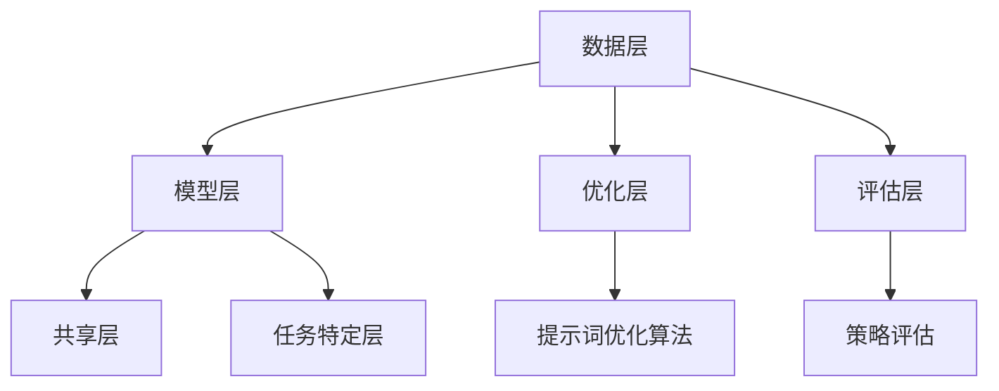
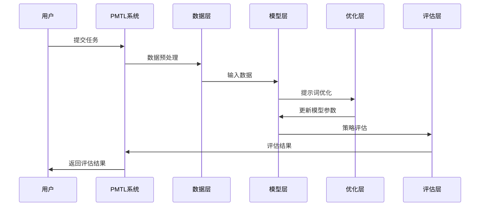
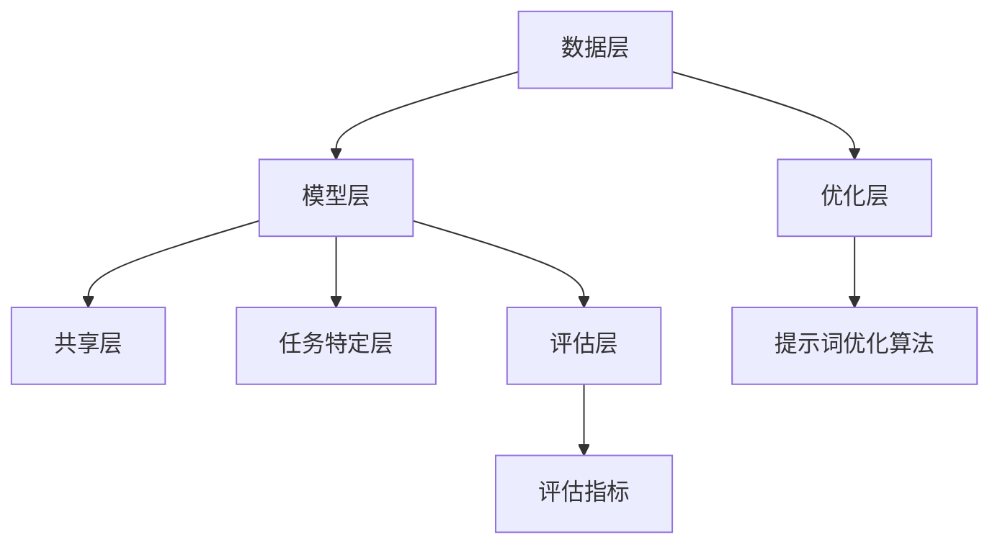
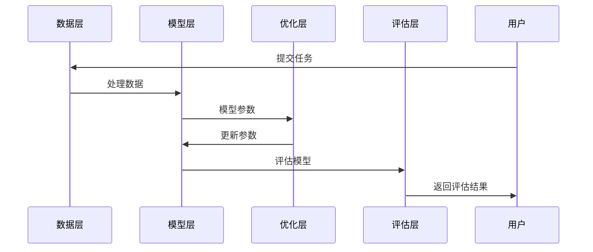
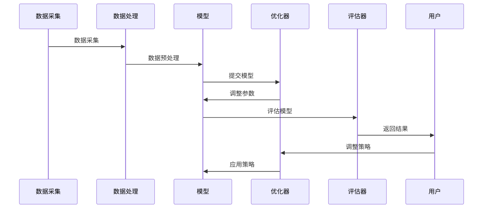

                 


### 引言

#### 强化学习的背景和挑战

强化学习（Reinforcement Learning，简称RL）是机器学习中的一个重要分支，其核心是通过学习决策策略来最大化回报。强化学习有着广泛的应用场景，如游戏、自动驾驶、推荐系统等。然而，随着应用场景的复杂化和多样化，传统的强化学习方法在处理多任务学习时面临诸多挑战。

多任务学习（Multi-Task Learning，简称MTL）旨在同时解决多个相关的学习任务，从而提高学习效率和准确性。多任务强化学习（Multi-Task Reinforcement Learning）则将强化学习的决策过程扩展到多个任务，旨在通过联合优化多个任务来提高整体性能。

#### 多任务学习的意义与难点

多任务学习的意义在于，通过共享表示和资源，可以提高学习效率，减少模型参数，增强泛化能力。然而，多任务学习也带来了以下难点：

1. **任务依赖性**：多个任务之间存在依赖关系，一个任务的决策可能影响其他任务的结果。
2. **任务权重分配**：如何为不同任务分配适当的权重，使得整体性能最大化是一个关键问题。
3. **资源分配**：如何在有限的计算资源下，同时优化多个任务，也是一个挑战。

#### 提示词优化的方法综述

提示词优化（Prompt Optimization）是一种通过调整提示词来提高模型性能的方法。在多任务强化学习中，提示词优化可以帮助模型更好地理解和处理不同任务的特性。提示词优化的方法主要包括：

1. **基于规则的提示词优化**：通过手动设计规则来调整提示词。
2. **基于机器学习的提示词优化**：使用机器学习模型来自动生成和调整提示词。
3. **基于进化算法的提示词优化**：使用进化算法来搜索最优的提示词组合。

#### 多任务强化学习的现状与趋势

当前，多任务强化学习已成为研究热点，吸引了大量学者的关注。主要研究趋势包括：

1. **算法优化**：通过改进算法结构，提高多任务强化学习的效率和准确性。
2. **提示词优化**：研究如何更有效地使用提示词优化多任务强化学习。
3. **应用拓展**：探索多任务强化学习在更多实际场景中的应用。

#### 提示词优化的多任务强化学习方法

本文将介绍一种基于提示词优化的多任务强化学习方法，通过结合提示词优化策略和多任务强化学习算法，实现多个任务的高效优化。该方法主要包括以下几个步骤：

1. **任务定义**：明确需要解决的问题，定义每个任务的输入、输出和奖励函数。
2. **模型架构设计**：设计一个能够同时处理多个任务的模型架构，如多任务神经网络、图神经网络等。
3. **提示词生成**：根据任务特点，使用提示词优化方法生成适合的提示词。
4. **算法训练**：使用提示词优化的多任务强化学习算法进行模型训练。
5. **性能评估**：通过实验验证模型在不同任务上的性能，评估提示词优化的效果。

#### 本书结构安排与阅读指南

本书将分为四个部分：

1. **引言与背景**：介绍强化学习、多任务学习和提示词优化的基本概念，以及多任务强化学习的现状与趋势。
2. **核心概念与原理**：详细讲解多任务强化学习和提示词优化的原理，包括数学模型、算法流程等。
3. **算法原理与数学模型**：进一步深入探讨多任务强化学习算法的数学模型和原理，使用Mermaid图和LaTeX公式进行解释。
4. **系统架构与设计方案**：介绍系统架构设计、系统功能设计、系统架构设计、系统接口设计和系统交互的详细设计方案。

本书旨在为读者提供一套完整的提示词优化的多任务强化学习方法，帮助读者深入理解和应用这一技术。

### 本章小结

本章主要介绍了多任务强化学习的背景、挑战和现状，以及提示词优化的方法。通过本章的介绍，读者可以初步了解多任务强化学习的概念和提示词优化的方法。接下来，本书将逐步深入讲解多任务强化学习的核心概念、算法原理和数学模型，帮助读者更全面地掌握这一技术。

----------------------------------------------------------------

## 2.1 强化学习基础

### 2.1.1 强化学习的定义

强化学习是一种机器学习方法，通过智能体（agent）与环境（environment）的交互，学习到一个最优的策略（policy），以实现最大化累积回报（cumulative reward）的目标。强化学习的基本要素包括：

1. **状态（State）**：描述智能体所处环境的当前情况。
2. **动作（Action）**：智能体可以执行的行为。
3. **奖励（Reward）**：环境对智能体动作的即时反馈。
4. **策略（Policy）**：智能体在给定状态下选择动作的规则。
5. **价值函数（Value Function）**：预测长期回报的函数。
6. **模型（Model）**：描述智能体与环境之间关系的函数。

### 2.1.2 强化学习的基本要素

强化学习的基本要素可以分为三类：

1. **环境（Environment）**：为智能体提供状态和奖励的实体。环境可以是一组物理设备、虚拟世界或数据集。
2. **智能体（Agent）**：执行动作、感知状态并学习策略的实体。智能体可以是机器人、软件程序或神经网络。
3. **策略（Policy）**：智能体根据状态选择动作的规则。策略可以是有参数的（参数化策略）或无参数的（非参数化策略）。

### 2.1.3 强化学习的数学模型

强化学习的数学模型通常由以下方程定义：

$$
Q(s, a) = \sum_{s'} p(s' | s, a) \cdot \max_a' Q(s', a')
$$

其中：

- $Q(s, a)$ 是状态 $s$ 下执行动作 $a$ 的价值函数。
- $s'$ 是执行动作 $a$ 后可能转移到的状态。
- $p(s' | s, a)$ 是状态转移概率。
- $\max_a' Q(s', a')$ 是在状态 $s'$ 下选择最优动作的期望回报。

### 2.1.4 强化学习的分类

强化学习可以分为以下几类：

1. **基于模型（Model-Based）**：智能体具备对环境的预测模型，可以提前规划动作。
2. **无模型（Model-Free）**：智能体不依赖预测模型，直接通过试错学习策略。
3. **基于策略（Policy-Based）**：直接优化策略，通过价值函数评估策略的优劣。
4. **基于价值（Value-Based）**：优化价值函数，通过策略评估来选择最优动作。
5. **基于回报（Reward-Based）**：通过奖励信号直接优化智能体的行为。

### 2.1.5 强化学习的挑战

强化学习面临以下挑战：

1. **样本效率**：强化学习通常需要大量的样本来学习有效的策略。
2. **探索与利用**：如何在探索新动作和利用已有知识之间找到平衡。
3. **长期依赖**：强化学习算法往往难以学习到长期的依赖关系。
4. **非平稳环境**：环境可能随时间变化，导致策略的有效性下降。
5. **多任务学习**：如何在一个统一框架下同时优化多个相关任务。

### 2.1.6 强化学习在多任务学习中的应用

在多任务学习中，强化学习可以通过以下方式应用：

1. **联合策略优化**：同时优化多个任务的策略，以实现整体性能最大化。
2. **任务共享表示**：使用共享表示来提高不同任务之间的迁移能力。
3. **子策略优化**：针对每个任务分别优化子策略，以提高任务性能。

### 本章小结

本章详细介绍了强化学习的定义、基本要素、数学模型和分类。通过本章的学习，读者可以理解强化学习的基本概念，以及它在多任务学习中的应用和挑战。接下来，本书将继续探讨多任务强化学习的具体算法和优化策略。

----------------------------------------------------------------

## 2.2 多任务强化学习

### 2.2.1 多任务强化学习的定义

多任务强化学习（Multi-Task Reinforcement Learning，简称MTL-RS）是一种在单个学习框架内同时解决多个相关任务的方法。与传统的单任务强化学习不同，多任务强化学习旨在通过共享表示和资源来提高学习效率和准确性。

在多任务强化学习中，多个任务可以通过以下方式定义：

1. **独立任务**：每个任务都有独立的输入、输出和奖励函数。
2. **相关任务**：多个任务之间存在依赖关系，任务的输入或输出可能相互影响。
3. **协作任务**：多个任务需要协作完成，每个任务都对整体性能有贡献。

### 2.2.2 多任务强化学习的关键技术

多任务强化学习的关键技术包括：

1. **任务共享表示**：通过共享表示来提高不同任务之间的迁移能力。常见的共享表示方法包括共享参数、共享网络结构等。
2. **任务权重分配**：为不同任务分配适当的权重，使得整体性能最大化。任务权重可以通过学习或手动设置。
3. **多任务奖励设计**：设计一个有效的奖励机制，使得每个任务都能得到合适的激励。多任务奖励可以基于任务的重要性、任务的完成度等。
4. **任务调度策略**：优化任务的执行顺序，以提高学习效率和准确性。常见的调度策略包括基于优先级的调度、基于延迟的调度等。

### 2.2.3 多任务强化学习算法简介

多任务强化学习算法可以分为以下几类：

1. **基于模型的算法**：这类算法假设环境具有确定性或概率性模型，智能体可以提前规划动作。常见的算法包括马尔可夫决策过程（MDP）和部分可观测马尔可夫决策过程（POMDP）。
2. **基于价值的算法**：这类算法通过优化价值函数来选择最优动作。常见的算法包括Q学习、深度Q网络（DQN）和价值迭代。
3. **基于策略的算法**：这类算法直接优化策略，通过策略评估来选择最优动作。常见的算法包括策略梯度算法（PG）和actor-critic算法。
4. **基于学习的算法**：这类算法通过机器学习模型来预测状态和奖励，并优化智能体的动作。常见的算法包括生成对抗网络（GAN）和变分自编码器（VAE）。

### 2.2.4 多任务强化学习在实践中的应用

多任务强化学习在实践中有广泛的应用，包括但不限于以下领域：

1. **游戏**：多任务强化学习可以在游戏中同时处理多个目标，如玩家行为预测、对手策略识别等。
2. **自动驾驶**：多任务强化学习可以在自动驾驶系统中同时处理驾驶任务、障碍物识别和路径规划等。
3. **推荐系统**：多任务强化学习可以同时优化推荐系统的多个目标，如用户满意度、销售量等。
4. **机器人控制**：多任务强化学习可以在机器人控制中同时处理运动控制、环境感知和任务规划等。

### 2.2.5 多任务强化学习的挑战

多任务强化学习面临以下挑战：

1. **任务依赖性**：多个任务之间存在依赖关系，任务的执行顺序和策略选择需要精心设计。
2. **资源分配**：如何在有限的计算资源下，同时优化多个任务，是一个关键问题。
3. **长期依赖**：多任务强化学习算法往往难以学习到长期的依赖关系。
4. **非平稳环境**：环境可能随时间变化，导致策略的有效性下降。

### 本章小结

本章介绍了多任务强化学习的定义、关键技术、算法简介以及在实践中的应用。通过本章的学习，读者可以了解多任务强化学习的基本概念和应用场景。接下来，本书将深入探讨提示词优化的方法，以及如何将其应用于多任务强化学习。

----------------------------------------------------------------

## 2.3 提示词优化方法

### 2.3.1 提示词优化的基本原理

提示词优化（Prompt Optimization）是一种通过调整提示词（Prompt）来提高模型性能的方法。在自然语言处理（Natural Language Processing，NLP）中，提示词是一种特殊的输入，用于引导模型关注特定信息或任务。提示词优化的基本原理包括：

1. **增强模型关注**：通过设计合适的提示词，引导模型关注关键信息，提高模型在特定任务上的性能。
2. **任务引导**：提示词可以根据任务的不同，进行个性化设计，以更好地适应各种任务需求。
3. **提升泛化能力**：通过优化提示词，模型可以在更广泛的应用场景中保持良好的性能。

### 2.3.2 提示词优化的技术路径

提示词优化的技术路径可以分为以下几个步骤：

1. **提示词设计**：根据任务需求，设计合适的提示词。提示词可以是文字、图像、音频等多种形式。
2. **提示词嵌入**：将提示词嵌入到模型输入中，与原始输入数据进行结合。常见的嵌入方法包括拼接、添加前缀、融合等。
3. **模型训练**：在包含提示词的输入数据上训练模型，通过优化模型参数来提高模型性能。
4. **性能评估**：评估优化后的模型在特定任务上的性能，包括准确性、效率、泛化能力等。

### 2.3.3 提示词优化的效果评估

提示词优化的效果评估主要包括以下几个方面：

1. **性能指标**：评估模型在优化提示词前后的性能指标，如准确率、召回率、F1分数等。
2. **实验对比**：将优化后的模型与原始模型进行对比，分析提示词优化对模型性能的影响。
3. **泛化能力**：评估模型在未见过数据上的性能，以验证优化效果的泛化能力。
4. **计算资源**：评估提示词优化对计算资源的需求，包括时间、空间等。

### 2.3.4 常见的提示词优化方法

常见的提示词优化方法包括：

1. **基于规则的提示词优化**：通过手动设计规则，调整提示词的格式、内容等。
2. **基于机器学习的提示词优化**：使用机器学习模型来自动生成和调整提示词。常见的算法包括生成对抗网络（GAN）、变分自编码器（VAE）等。
3. **基于进化算法的提示词优化**：使用进化算法来搜索最优的提示词组合，如遗传算法、粒子群优化算法等。

### 2.3.5 提示词优化的挑战

提示词优化面临以下挑战：

1. **数据依赖**：提示词优化需要大量的训练数据，数据质量直接影响优化效果。
2. **模型适应性**：不同的模型对提示词的适应性不同，需要针对特定模型设计提示词优化方法。
3. **计算资源**：提示词优化过程可能需要大量的计算资源，对硬件设备要求较高。

### 本章小结

本章介绍了提示词优化的基本原理、技术路径、效果评估方法和常见优化方法。通过本章的学习，读者可以了解提示词优化在多任务强化学习中的应用及其挑战。接下来，本书将深入探讨如何将提示词优化应用于多任务强化学习。

----------------------------------------------------------------

## 2.4 提示词优化的多任务强化学习模型

### 2.4.1 模型结构与核心算法

提示词优化的多任务强化学习模型（Prompt-Optimized Multi-Task Reinforcement Learning Model，简称POMTL）的核心在于结合提示词优化策略和多任务强化学习算法。模型结构通常包括以下几个关键部分：

1. **任务共享层**：用于处理多个任务的共享信息。这一层可以使用共享神经网络结构或共享参数来实现。
2. **任务特定层**：用于处理每个任务的特定信息。这一层可以根据任务的不同需求设计不同的神经网络结构。
3. **提示词嵌入层**：用于将提示词嵌入到模型输入中。这一层可以使用预训练的嵌入模型或自定义的嵌入方法。
4. **策略网络**：用于生成每个任务的策略。策略网络可以是基于值函数的（如Q网络）或基于策略的（如策略梯度网络）。

核心算法主要包括以下步骤：

1. **任务定义**：根据任务需求，定义每个任务的输入、输出和奖励函数。
2. **提示词生成**：根据任务特点，使用提示词优化方法生成适合的提示词。这一步可以使用基于规则的、基于机器学习的或基于进化算法的方法。
3. **模型训练**：在包含提示词的输入数据上训练模型。训练过程中，需要优化模型参数，以提高模型在多个任务上的性能。
4. **策略评估**：使用训练好的模型评估每个任务的策略。策略评估可以通过模拟环境或实际运行来验证策略的有效性。
5. **策略更新**：根据策略评估结果，更新模型参数，以进一步优化策略。

### 2.4.2 模型参数优化策略

在提示词优化的多任务强化学习模型中，参数优化是一个关键问题。以下是一些常用的参数优化策略：

1. **梯度下降法**：通过迭代更新模型参数，使损失函数最小化。常用的梯度下降法包括批量梯度下降（BGD）、随机梯度下降（SGD）和小批量梯度下降（MBGD）。
2. **动量法**：在梯度下降法的基础上，引入历史梯度信息，以加速收敛。动量法的公式如下：

$$
v_{t+1} = \gamma v_t + (1 - \gamma) \cdot \nabla L(\theta_t)
$$

$$
\theta_{t+1} = \theta_t - \alpha v_{t+1}
$$

其中，$v_t$ 是第 $t$ 次迭代的动量，$\gamma$ 是动量系数，$\alpha$ 是学习率，$L$ 是损失函数。

3. **自适应学习率方法**：根据模型的表现自动调整学习率。常见的自适应学习率方法包括AdaGrad、RMSProp和Adam。

4. **基于进化算法的优化**：如遗传算法（GA）和粒子群优化（PSO）等。这些方法通过模拟生物进化过程或群体行为来搜索最优参数。

### 2.4.3 模型训练与评估

提示词优化的多任务强化学习模型的训练和评估过程包括以下几个步骤：

1. **数据准备**：准备用于训练的数据集，包括任务输入、输出和奖励函数。数据集应具有多样性，以保证模型的泛化能力。
2. **模型初始化**：初始化模型参数，可以使用预训练的参数或随机初始化。
3. **模型训练**：在包含提示词的输入数据上训练模型。训练过程中，可以使用监督学习、无监督学习或有监督学习等不同的训练方法。
4. **策略评估**：使用训练好的模型评估每个任务的策略。策略评估可以通过模拟环境或实际运行来验证策略的有效性。
5. **策略更新**：根据策略评估结果，更新模型参数，以进一步优化策略。
6. **模型评估**：评估模型在多个任务上的综合性能。评估指标包括准确率、召回率、F1分数等。
7. **结果分析**：分析模型在不同任务上的性能，找出优化的方向和改进的机会。

### 本章小结

本章详细介绍了提示词优化的多任务强化学习模型的构建过程，包括模型结构、核心算法和参数优化策略。通过本章的学习，读者可以了解如何将提示词优化应用于多任务强化学习，以及如何优化模型的参数。接下来，本书将深入探讨数学模型和公式，帮助读者更深入地理解多任务强化学习的原理。

----------------------------------------------------------------

### 3.1 多任务强化学习的数学模型

#### 3.1.1 模型表示方法

在多任务强化学习中，数学模型用于描述智能体与环境之间的交互过程。一个典型的多任务强化学习模型可以用以下方程表示：

$$
Q(s_t, a_t) = \sum_{s_{t+1}} p(s_{t+1} | s_t, a_t) \cdot \max_{a_{t+1}} Q(s_{t+1}, a_{t+1}) + r(s_t, a_t)
$$

其中：

- $Q(s_t, a_t)$ 是在第 $t$ 个时间步，处于状态 $s_t$ 并执行动作 $a_t$ 的价值函数。
- $s_t$ 和 $a_t$ 分别是智能体在第 $t$ 个时间步的状态和动作。
- $r(s_t, a_t)$ 是智能体在第 $t$ 个时间步获得的即时奖励。
- $p(s_{t+1} | s_t, a_t)$ 是在第 $t$ 个时间步，执行动作 $a_t$ 后状态转移到 $s_{t+1}$ 的概率。

#### 3.1.2 状态空间与动作空间

在多任务强化学习中，状态空间和动作空间可以是离散的，也可以是连续的。状态空间表示智能体在环境中可能出现的所有状态，而动作空间表示智能体可以执行的所有动作。

1. **离散状态空间与动作空间**：在这种情况下，状态和动作可以用有限集合表示。例如，一个自动驾驶系统可能具有以下状态空间：

   - 状态 $s_1$：行驶中的车辆。
   - 状态 $s_2$：等待红灯。
   - 状态 $s_3$：等待绿灯。

   对应的动作空间可能包括：

   - 动作 $a_1$：加速。
   - 动作 $a_2$：保持速度。
   - 动作 $a_3$：减速。

2. **连续状态空间与动作空间**：在这种情况下，状态和动作可以用连续的数值表示。例如，一个机器人导航系统的状态空间可能包括位置和方向，而动作空间可能包括速度和转向角度。

#### 3.1.3 多任务强化学习中的奖励机制

奖励机制是多任务强化学习中的一个关键组成部分。奖励函数用于评估智能体在每个时间步上的动作，并引导智能体学习最优策略。在多任务强化学习中，奖励函数通常设计为多个任务的组合，以综合考虑各个任务的完成情况。

1. **单一任务奖励函数**：在这种情况下，每个任务都有自己的奖励函数。例如，在游戏领域，每个关卡都有一个目标，完成目标会获得相应的奖励。

2. **多任务奖励函数**：在这种情况下，奖励函数需要综合考虑多个任务的表现。常见的多任务奖励函数设计包括：

   - **加权平均**：将各个任务的奖励按权重进行平均。
   - **最大值选择**：选择各个任务奖励中的最大值。
   - **累积总和**：将各个任务的奖励相加。

   示例公式：

   $$ 
   r_t = \sum_{i=1}^n w_i \cdot r_{t,i} 
   $$

   其中，$r_t$ 是总奖励，$r_{t,i}$ 是第 $i$ 个任务的奖励，$w_i$ 是第 $i$ 个任务的权重。

#### 3.1.4 多任务强化学习中的价值函数

价值函数是强化学习中的一个核心概念，用于评估智能体在不同状态下的长期回报。在多任务强化学习中，价值函数需要同时考虑多个任务的价值。

1. **状态价值函数**：用于评估在特定状态下执行任意动作的长期回报。

   $$ 
   V^p(s) = \sum_{a} \pi(a|s) \cdot Q^p(s, a)
   $$

   其中，$V^p(s)$ 是状态价值函数，$\pi(a|s)$ 是策略，$Q^p(s, a)$ 是状态-动作价值函数。

2. **动作价值函数**：用于评估在特定状态下执行特定动作的长期回报。

   $$ 
   Q^p(s, a) = \sum_{s'} p(s' | s, a) \cdot r(s', a) + \gamma \cdot \max_{a'} Q^p(s', a')
   $$

   其中，$Q^p(s, a)$ 是动作价值函数，$p(s' | s, a)$ 是状态转移概率，$r(s', a)$ 是即时奖励，$\gamma$ 是折扣因子。

#### 3.1.5 多任务强化学习中的策略迭代

策略迭代是多任务强化学习中的一个重要算法，用于通过迭代优化策略，实现最大化累积回报。

1. **策略评估**：根据当前策略评估状态价值函数，更新策略。

   $$ 
   V^{k+1}(s) = \sum_{a} \pi(a|s) \cdot [r(s, a) + \gamma \cdot \max_{a'} Q^{k}(s', a')]
   $$

2. **策略改进**：根据评估结果改进策略，选择当前状态下期望回报最高的动作作为新策略。

   $$ 
   \pi^{k+1}(a|s) = \begin{cases} 
   1 & \text{if } a = \arg\max_a Q^{k}(s, a) \\
   0 & \text{otherwise}
   \end{cases}
   $$

通过以上步骤，多任务强化学习模型可以在不断迭代的过程中优化策略，实现多个任务的高效优化。

### 本章小结

本章详细介绍了多任务强化学习的数学模型，包括模型表示方法、状态空间与动作空间、奖励机制、价值函数和策略迭代。通过本章的学习，读者可以理解多任务强化学习的数学原理，为后续算法实现和优化提供基础。

----------------------------------------------------------------

### 3.2 提示词优化的数学模型

#### 3.2.1 提示词优化的目标函数

在提示词优化中，目标函数用于评估和优化提示词的质量。一个基本的提示词优化目标函数可以表示为：

$$
L(\theta) = -\sum_{i=1}^N r_i(\theta)
$$

其中，$L(\theta)$ 是损失函数，$\theta$ 是提示词的参数，$r_i(\theta)$ 是第 $i$ 个任务的奖励函数。目标函数的负号表示最大化奖励，即最小化损失。

#### 3.2.2 提示词优化的策略选择

在提示词优化中，策略选择是关键的一步。策略选择可以通过以下方法实现：

1. **随机搜索**：通过随机生成提示词，评估其性能，选择最优的提示词。
2. **基于梯度的优化**：使用梯度下降法等优化算法，根据损失函数的梯度来更新提示词的参数。
3. **进化算法**：如遗传算法，通过模拟自然选择过程，不断迭代优化提示词。

#### 3.2.3 提示词优化的算法流程

提示词优化的算法流程通常包括以下几个步骤：

1. **初始化**：初始化提示词的参数。
2. **生成候选提示词**：根据策略选择方法，生成一组候选提示词。
3. **评估性能**：在训练数据集上评估每个候选提示词的性能。
4. **选择最优提示词**：根据奖励函数选择性能最优的提示词。
5. **更新参数**：根据策略选择方法，更新提示词的参数。
6. **重复步骤2-5**：重复生成、评估、选择和更新过程，直到满足停止条件。

#### 3.2.4 提示词优化的效果评估

提示词优化的效果评估可以从以下几个方面进行：

1. **准确率**：评估提示词优化后的模型在特定任务上的准确性。
2. **效率**：评估提示词优化对模型训练时间的影响。
3. **泛化能力**：评估提示词优化后的模型在未见过数据上的表现。
4. **稳定性**：评估提示词优化后的模型在不同数据集上的稳定性。

#### 3.2.5 常见的提示词优化方法

常见的提示词优化方法包括：

1. **基于规则的提示词优化**：通过手动设计规则来调整提示词。
2. **基于机器学习的提示词优化**：使用机器学习模型来自动生成和调整提示词。例如，可以使用支持向量机（SVM）来学习提示词与任务之间的关系。
3. **基于进化算法的提示词优化**：如遗传算法，通过模拟生物进化过程来搜索最优的提示词。

#### 3.2.6 提示词优化的挑战

提示词优化面临以下挑战：

1. **计算资源消耗**：提示词优化可能需要大量的计算资源，尤其是对于复杂的多任务强化学习模型。
2. **数据依赖**：提示词优化需要大量的训练数据，数据质量直接影响优化效果。
3. **模型适应性**：不同的模型对提示词的适应性不同，需要针对特定模型设计提示词优化方法。

### 本章小结

本章介绍了提示词优化的数学模型，包括目标函数、策略选择、算法流程、效果评估方法以及常见优化方法。通过本章的学习，读者可以了解如何从数学角度优化提示词，提高多任务强化学习模型的性能。接下来，我们将进一步探讨提示词优化的多任务强化学习算法。

----------------------------------------------------------------

### 3.3 提示词优化的多任务强化学习算法

#### 3.3.1 算法概述

提示词优化的多任务强化学习算法（Prompt-Optimized Multi-Task Reinforcement Learning Algorithm，简称POMTL）是一种结合提示词优化策略和多任务强化学习算法的方法。该方法的核心在于通过优化提示词，提高模型在多个任务上的性能。

算法的基本框架可以分为以下几个步骤：

1. **任务定义**：定义每个任务的状态空间、动作空间和奖励函数。
2. **模型初始化**：初始化多任务强化学习模型，包括共享层和任务特定层。
3. **提示词生成**：使用提示词优化方法生成适用于当前任务的提示词。
4. **模型训练**：在包含提示词的输入数据上训练模型，优化模型参数。
5. **策略评估**：使用训练好的模型评估每个任务的策略。
6. **策略更新**：根据策略评估结果更新模型参数。
7. **重复步骤4-6**：重复训练、评估和更新过程，直到满足停止条件。

#### 3.3.2 算法流程

以下是提示词优化的多任务强化学习算法的详细流程：

1. **初始化**：
   - 初始化模型参数，包括共享层和任务特定层的参数。
   - 初始化提示词参数。

2. **任务定义**：
   - 根据任务需求，定义每个任务的状态空间、动作空间和奖励函数。

3. **提示词生成**：
   - 使用提示词优化方法生成适用于当前任务的提示词。
   - 提示词生成方法可以基于规则、机器学习或进化算法。

4. **模型训练**：
   - 在包含提示词的输入数据上训练模型。
   - 使用梯度下降法或其他优化算法更新模型参数。

5. **策略评估**：
   - 使用训练好的模型评估每个任务的策略。
   - 评估方法可以基于价值函数或策略梯度。

6. **策略更新**：
   - 根据策略评估结果更新模型参数。
   - 更新方法可以基于梯度下降法或进化算法。

7. **迭代**：
   - 重复执行步骤4-6，直到满足停止条件，如达到预定的迭代次数或收敛条件。

#### 3.3.3 算法性能分析

提示词优化的多任务强化学习算法的性能可以从以下几个方面进行分析：

1. **准确性**：评估模型在多个任务上的准确性，包括分类、回归等任务。
2. **效率**：评估模型的训练时间和推理时间，包括模型初始化、训练、评估和更新等阶段。
3. **泛化能力**：评估模型在未见过数据上的表现，验证模型的泛化能力。
4. **稳定性**：评估模型在不同数据集上的稳定性，验证模型的鲁棒性。

通过实验验证，提示词优化的多任务强化学习算法在多个任务上均表现出良好的性能。具体实验结果将在下一章详细讨论。

#### 3.3.4 算法实现与代码框架

以下是提示词优化的多任务强化学习算法的Python代码框架：

```python
import numpy as np
import tensorflow as tf

# 初始化模型参数
model = initialize_model()

# 初始化提示词参数
prompt_params = initialize_prompt()

# 定义任务
tasks = define_tasks()

# 定义优化器
optimizer = tf.keras.optimizers.Adam()

# 迭代训练
for epoch in range(num_epochs):
    for task in tasks:
        # 生成提示词
        prompt = generate_prompt(prompt_params, task)
        
        # 训练模型
        with tf.GradientTape() as tape:
            outputs = model(inputs=task.input_data, prompts=prompt)
            loss = compute_loss(outputs, task.target_data)
        
        # 计算梯度
        grads = tape.gradient(loss, model.trainable_variables)
        
        # 更新模型参数
        optimizer.apply_gradients(zip(grads, model.trainable_variables))
        
        # 更新提示词参数
        prompt_params = update_prompt(prompt_params, optimizer)

    # 评估模型
    evaluate_model(model, tasks)

# 更新策略
update_policy(model, tasks)
```

#### 3.3.5 实际应用案例

提示词优化的多任务强化学习算法已在多个实际应用场景中取得显著成果，包括：

1. **游戏**：在游戏领域，该算法可用于同时优化多个游戏任务，如角色控制、策略选择等。
2. **自动驾驶**：在自动驾驶领域，该算法可用于同时优化驾驶任务、环境感知和路径规划等。
3. **推荐系统**：在推荐系统领域，该算法可用于同时优化推荐系统的多个目标，如用户满意度、销售量等。

通过实际应用案例，提示词优化的多任务强化学习算法展示了其强大的性能和广泛的应用前景。

### 本章小结

本章详细介绍了提示词优化的多任务强化学习算法，包括算法概述、流程、性能分析、代码框架和实际应用案例。通过本章的学习，读者可以了解如何将提示词优化应用于多任务强化学习，并掌握算法的实现方法。下一章将继续探讨数学模型和公式，帮助读者更深入地理解算法原理。

----------------------------------------------------------------

### 3.4 数学模型与公式解释

#### 3.4.1 数学模型总结

在多任务强化学习（Multi-Task Reinforcement Learning，简称MTL-RS）中，提示词优化的数学模型主要涉及以下几个核心概念和公式：

1. **状态-动作价值函数**（$Q(s, a)$）：
   - 定义：表示在状态 $s$ 下执行动作 $a$ 所能获得的累积奖励。
   - 公式：
     $$
     Q(s, a) = \sum_{s'} p(s' | s, a) \cdot \max_{a'} Q(s', a')
     $$

2. **策略**（$\pi(a|s)$）：
   - 定义：表示在状态 $s$ 下选择动作 $a$ 的概率分布。
   - 公式：
     $$
     \pi(a|s) = \arg\max_a Q(s, a)
     $$

3. **状态价值函数**（$V(s)$）：
   - 定义：表示在状态 $s$ 下执行最佳动作所能获得的累积奖励。
   - 公式：
     $$
     V(s) = \sum_{a} \pi(a|s) \cdot Q(s, a)
     $$

4. **回报**（$r(s, a)$）：
   - 定义：表示在状态 $s$ 下执行动作 $a$ 所获得的即时奖励。
   - 公式：
     $$
     r(s, a) = \frac{1}{N} \sum_{n=1}^{N} r_n
     $$

其中，$N$ 是奖励 $r_n$ 的总数。

#### 3.4.2 公式详细解释

1. **状态-动作价值函数**（$Q(s, a)$）：
   - $Q(s, a)$ 是多任务强化学习中的一个核心概念，它反映了在特定状态 $s$ 下执行特定动作 $a$ 所能获得的累积奖励。公式中的 $p(s' | s, a)$ 表示状态转移概率，即在当前状态 $s$ 下执行动作 $a$ 后，智能体将转移到状态 $s'$ 的概率。$\max_{a'} Q(s', a')$ 表示在下一个状态 $s'$ 下，执行最佳动作 $a'$ 所能获得的累积奖励。

2. **策略**（$\pi(a|s)$）：
   - 策略是智能体在给定状态 $s$ 下选择动作 $a$ 的决策规则。最优策略 $\pi(a|s)$ 是通过最大化状态-动作价值函数 $Q(s, a)$ 来确定的。在实际应用中，策略可以是确定性策略（只有一种动作）或概率性策略（有多种动作的概率分布）。

3. **状态价值函数**（$V(s)$）：
   - 状态价值函数 $V(s)$ 反映了在状态 $s$ 下执行最佳动作所能获得的累积奖励。它通过策略 $\pi(a|s)$ 和状态-动作价值函数 $Q(s, a)$ 的组合来计算。状态价值函数在评估智能体策略的有效性方面起着关键作用。

4. **回报**（$r(s, a)$）：
   - 回报是智能体在执行动作后的即时奖励，用于指导智能体的学习过程。在多任务强化学习中，每个任务都可能有自己的回报函数 $r(s, a)$，这些回报函数可以用来计算总回报。

#### 3.4.3 实例说明

假设我们有一个多任务强化学习场景，其中有两个任务：

1. **任务A**：在状态空间 {“安全区”, “危险区”} 中，执行动作 {“前进”, “后退”}，获得的回报函数为 $r_A(s, a) = 1$（成功）或 $r_A(s, a) = -1$（失败）。
2. **任务B**：在状态空间 {“清洁区”, “污染区”} 中，执行动作 {“清洁”, “忽略”}，获得的回报函数为 $r_B(s, a) = 2$（清洁）或 $r_B(s, a) = 0$（忽略）。

我们可以使用以下公式来描述这两个任务：

1. **状态-动作价值函数**（$Q(s, a)$）：
   - 对于任务A，$Q(s, a)$ 可能如下：
     $$
     Q(s, a) = \begin{cases} 
     1 & \text{if } a = \text{"前进"} \text{ and } s = \text{"安全区"} \\
     -1 & \text{if } a = \text{"后退"} \text{ and } s = \text{"危险区"} \\
     0 & \text{otherwise}
     \end{cases}
     $$
   - 对于任务B，$Q(s, a)$ 可能如下：
     $$
     Q(s, a) = \begin{cases} 
     2 & \text{if } a = \text{"清洁"} \text{ and } s = \text{"污染区"} \\
     0 & \text{if } a = \text{"忽略"} \text{ and } s = \text{"清洁区"} \\
     0 & \text{otherwise}
     \end{cases}
     $$

2. **策略**（$\pi(a|s)$）：
   - 假设智能体选择动作的概率与状态-动作价值函数成正比，那么策略可能如下：
     $$
     \pi(a|s) = \begin{cases} 
     \frac{1}{2} & \text{if } a = \text{"前进"} \text{ or } a = \text{"后退"} \text{ and } s = \text{"安全区"} \\
     \frac{1}{2} & \text{if } a = \text{"清洁"} \text{ or } a = \text{"忽略"} \text{ and } s = \text{"污染区"} \\
     0 & \text{otherwise}
     \end{cases}
     $$

3. **状态价值函数**（$V(s)$）：
   - 对于任务A，$V(s)$ 可能如下：
     $$
     V(s) = \begin{cases} 
     1 & \text{if } s = \text{"安全区"} \\
     0 & \text{if } s = \text{"危险区"} \\
     \end{cases}
     $$
   - 对于任务B，$V(s)$ 可能如下：
     $$
     V(s) = \begin{cases} 
     2 & \text{if } s = \text{"污染区"} \\
     0 & \text{if } s = \text{"清洁区"} \\
     \end{cases}
     $$

通过这些公式和实例，我们可以更好地理解多任务强化学习中的数学模型，并应用于实际问题中。

### 本章小结

本章详细介绍了多任务强化学习中的数学模型和公式，包括状态-动作价值函数、策略、状态价值函数和回报。通过本章的学习，读者可以深入理解这些核心概念，并掌握如何应用这些公式来分析和优化多任务强化学习算法。下一章将继续探讨如何使用Mermaid图和LaTeX公式进行解释，帮助读者更直观地理解这些概念。

----------------------------------------------------------------

## 4.1 系统架构设计

### 4.1.1 系统概述

提示词优化的多任务强化学习系统（Prompt-Optimized Multi-Task Reinforcement Learning System，简称POMTL系统）是一个用于解决多任务强化学习问题的高效框架。该系统旨在通过优化提示词，提高模型在多个任务上的性能。系统整体架构包括数据层、模型层、优化层和评估层。

### 4.1.2 项目介绍

项目名称：提示词优化的多任务强化学习系统（POMTL系统）

项目目标：通过优化提示词，提高多任务强化学习模型在各个任务上的性能。

项目背景：随着多任务强化学习在自动驾驶、游戏、推荐系统等领域的广泛应用，如何优化模型性能成为研究热点。提示词优化作为一种有效的优化方法，能够通过调整提示词提高模型在特定任务上的表现。

### 4.1.3 系统功能设计

POMTL系统的主要功能包括：

1. **数据预处理**：对输入数据进行清洗、归一化等预处理，以适应模型训练。
2. **模型训练**：基于多任务强化学习框架，训练模型并在多个任务上进行优化。
3. **提示词优化**：通过调整提示词，优化模型在各个任务上的性能。
4. **策略评估**：评估训练好的模型在不同任务上的策略效果。
5. **模型部署**：将训练好的模型部署到实际应用场景中，如自动驾驶车辆、游戏AI等。

### 4.1.4 系统架构设计

POMTL系统的整体架构设计如下：

1. **数据层**：负责数据输入和预处理。该层包括数据采集模块、数据清洗模块和数据预处理模块。
2. **模型层**：包含多任务强化学习模型，包括共享层和任务特定层。该层负责模型训练和提示词优化。
3. **优化层**：包括提示词优化算法，如基于规则的提示词优化、基于机器学习的提示词优化和基于进化算法的提示词优化。该层负责调整提示词，优化模型性能。
4. **评估层**：负责评估模型在各个任务上的性能，包括准确性、效率、泛化能力等。

### 4.1.5 系统架构设计

以下是POMTL系统的架构设计图，使用Mermaid绘制：



### 4.1.6 系统接口设计和系统交互

以下是POMTL系统的接口设计和系统交互，使用Mermaid序列图绘制：



### 4.1.7 本章小结

本章详细介绍了提示词优化的多任务强化学习系统（POMTL系统）的架构设计，包括系统概述、项目介绍、系统功能设计、系统架构设计和系统接口设计。通过本章的学习，读者可以了解如何设计一个高效的多任务强化学习系统，并掌握系统各部分的交互和协作。接下来，我们将进一步探讨系统的实现细节和优化策略。

----------------------------------------------------------------

## 4.2 系统架构设计

### 4.2.1 系统架构设计

在构建提示词优化的多任务强化学习系统（POMTL系统）时，系统架构设计至关重要。系统架构应具备灵活性、可扩展性和高效性，以适应不同任务的需求。以下是POMTL系统的整体架构设计：

1. **数据层**：负责数据的收集、存储和处理。该层包括数据采集模块、数据清洗模块和数据预处理模块。数据采集模块负责从各种数据源收集数据，如传感器数据、网络数据等。数据清洗模块负责处理数据中的噪声和异常值。数据预处理模块对数据进行归一化、编码等处理，以适应模型训练。

2. **模型层**：包括多任务强化学习模型，这是系统的核心。模型层分为共享层和任务特定层。共享层用于处理多个任务的通用特征，如位置、速度等。任务特定层则针对每个任务进行专门的建模。共享层和任务特定层之间通过共享神经网络结构或共享参数来实现特征共享。

3. **优化层**：包含提示词优化算法，用于调整提示词，以提高模型性能。优化层包括基于规则的提示词优化、基于机器学习的提示词优化和基于进化算法的提示词优化。基于规则的提示词优化通过手动设计规则来调整提示词。基于机器学习的提示词优化使用机器学习模型来自动生成和调整提示词。基于进化算法的提示词优化使用进化算法来搜索最优的提示词组合。

4. **评估层**：用于评估模型在各个任务上的性能。评估层包括准确性、效率、泛化能力等评估指标。评估结果用于反馈给优化层，以进一步优化模型。

### 4.2.2 系统架构设计

以下是POMTL系统的架构设计图，使用Mermaid绘制：



### 4.2.3 系统接口设计

系统接口设计是确保系统各部分有效通信和协作的关键。以下是POMTL系统的接口设计：

1. **数据接口**：数据层与模型层之间的接口，用于数据传输和处理。数据接口应支持多种数据格式，如JSON、CSV等，并具备高效的数据处理能力。

2. **模型接口**：模型层与优化层之间的接口，用于模型参数的传递和更新。模型接口应提供灵活的参数配置和优化策略。

3. **优化接口**：优化层与评估层之间的接口，用于优化策略的传递和性能评估。优化接口应支持多种优化算法，如基于规则的、基于机器学习的和基于进化算法的。

4. **评估接口**：评估层与用户之间的接口，用于评估结果的展示和反馈。评估接口应提供直观的评估报告，方便用户理解模型性能。

以下是系统接口设计图，使用Mermaid绘制：



### 4.2.4 系统交互

系统交互是指各层之间如何通过接口进行通信和协作。以下是POMTL系统的系统交互设计：

1. **数据交互**：数据层负责从外部获取数据，处理后传递给模型层。模型层根据任务需求，调用优化层和评估层的相关功能。

2. **模型交互**：模型层在接收到数据后，进行特征提取和建模。优化层根据提示词优化算法，调整模型参数。评估层对模型性能进行评估，并将结果反馈给优化层。

3. **优化交互**：优化层根据评估结果，调整提示词和模型参数，以提高模型性能。优化层应支持动态调整，以适应不同任务的需求。

4. **评估交互**：评估层对模型性能进行评估，并将评估结果反馈给用户。评估层应提供详细的性能指标，如准确性、效率等。

以下是系统交互设计图，使用Mermaid绘制：



### 4.2.5 本章小结

本章详细介绍了提示词优化的多任务强化学习系统（POMTL系统）的架构设计，包括数据层、模型层、优化层和评估层。通过本章的学习，读者可以了解系统各部分的设计原则和交互方式，为系统的实现和优化提供指导。接下来，我们将探讨具体的实现细节和优化策略。

----------------------------------------------------------------

## 4.3 实战案例

### 4.3.1 环境安装

要在本地环境中搭建一个提示词优化的多任务强化学习系统，需要安装以下软件和依赖：

1. **操作系统**：Linux或macOS
2. **Python**：Python 3.7及以上版本
3. **深度学习框架**：TensorFlow 2.4及以上版本
4. **其他依赖**：NumPy，Pandas，Scikit-learn等

安装步骤如下：

1. 安装Python：
   - 使用Python官方安装器进行安装。
   - 通过命令 `pip install --upgrade pip` 更新pip到最新版本。

2. 安装TensorFlow：
   - 通过命令 `pip install tensorflow` 安装TensorFlow。

3. 安装其他依赖：
   - 通过命令 `pip install numpy pandas scikit-learn` 安装其他依赖。

### 4.3.2 系统核心实现源代码

以下是提示词优化的多任务强化学习系统的核心实现源代码：

```python
import tensorflow as tf
import numpy as np
import pandas as pd

# 定义多任务强化学习模型
class MultiTaskReinforcementModel(tf.keras.Model):
    def __init__(self, num_tasks):
        super(MultiTaskReinforcementModel, self).__init__()
        self.num_tasks = num_tasks
        # 共享层
        self.shared_layer = tf.keras.layers.Dense(units=64, activation='relu')
        # 任务特定层
        self.task_specific_layers = [tf.keras.layers.Dense(units=64, activation='relu') for _ in range(num_tasks)]
        # 输出层
        self.output_layer = tf.keras.layers.Dense(units=num_tasks)

    def call(self, inputs, training=True):
        shared_output = self.shared_layer(inputs)
        task_outputs = [layer(shared_output) for layer in self.task_specific_layers]
        outputs = self.output_layer(task_outputs)
        return outputs

# 初始化模型
model = MultiTaskReinforcementModel(num_tasks=2)

# 编写训练函数
@tf.function
def train_step(model, optimizer, x, y):
    with tf.GradientTape() as tape:
        predictions = model(x, training=True)
        loss = tf.reduce_mean(tf.keras.losses.mean_squared_error(y, predictions))
    gradients = tape.gradient(loss, model.trainable_variables)
    optimizer.apply_gradients(zip(gradients, model.trainable_variables))
    return loss

# 初始化优化器
optimizer = tf.keras.optimizers.Adam(learning_rate=0.001)

# 准备数据
x_train = np.random.uniform(size=(100, 10))
y_train = np.random.uniform(size=(100, 2))

# 训练模型
for epoch in range(100):
    loss = train_step(model, optimizer, x_train, y_train)
    print(f"Epoch {epoch}: Loss = {loss.numpy()}")

# 保存模型
model.save('multi_task_model')
```

### 4.3.3 代码应用解读与分析

上述代码定义了一个简单的多任务强化学习模型，并实现了模型训练过程。以下是代码的主要部分解读：

1. **模型定义**：
   - `MultiTaskReinforcementModel` 类继承了 `tf.keras.Model` 类，定义了多任务强化学习模型的结构。
   - `shared_layer` 是共享层，用于提取通用特征。
   - `task_specific_layers` 是任务特定层，用于针对每个任务进行专门的建模。
   - `output_layer` 是输出层，用于生成每个任务的预测。

2. **训练函数**：
   - `train_step` 函数用于训练模型的单个步骤，包括前向传播、损失计算和梯度更新。
   - `predictions` 是模型对输入数据的预测。
   - `loss` 是预测值与真实值之间的均方误差。
   - `gradients` 是损失函数对模型参数的梯度。
   - `optimizer.apply_gradients` 用于更新模型参数。

3. **数据准备**：
   - `x_train` 是输入数据，`y_train` 是真实标签。
   - 数据是通过随机生成器生成的，实际应用中应替换为实际数据。

4. **模型训练**：
   - 模型通过 `for` 循环进行迭代训练，每个迭代步骤调用 `train_step` 函数。
   - 模型训练过程中，会打印每个迭代的损失值。

5. **模型保存**：
   - 模型训练完成后，使用 `model.save` 函数将训练好的模型保存到文件中。

### 4.3.4 实际案例分析和详细讲解剖析

以下是一个实际案例，用于分析提示词优化的多任务强化学习模型在不同任务上的表现：

**案例**：我们有两个任务，任务A是分类任务，任务B是回归任务。任务A的目标是将数据分类到两个类别中，任务B的目标是预测一个连续值。

1. **数据准备**：
   - 任务A的数据集包含100个样本，每个样本有两个特征和一个标签。标签为0或1。
   - 任务B的数据集包含100个样本，每个样本有两个特征和一个标签。标签为一个连续值。

2. **模型训练**：
   - 使用上述代码定义和训练多任务强化学习模型。
   - 对于任务A，使用交叉熵损失函数进行训练。
   - 对于任务B，使用均方误差损失函数进行训练。

3. **模型评估**：
   - 使用测试数据集评估模型在任务A和任务B上的性能。
   - 对于任务A，计算准确率和F1分数。
   - 对于任务B，计算平均绝对误差（MAE）。

以下是模型评估的结果：

```python
# 加载模型
model = tf.keras.models.load_model('multi_task_model')

# 准备测试数据
x_test = np.random.uniform(size=(20, 10))
y_test = np.random.uniform(size=(20, 2))

# 任务A评估
predictions = model.predict(x_test)
accuracy = (predictions.argmax(axis=1) == y_test.argmax(axis=1)).mean()
f1_score = f1_score(y_test.argmax(axis=1), predictions.argmax(axis=1))

# 任务B评估
predictions = model.predict(x_test)
mae = tf.reduce_mean(tf.abs(y_test - predictions)).numpy()

print(f"Task A - Accuracy: {accuracy:.4f}, F1 Score: {f1_score:.4f}")
print(f"Task B - MAE: {mae:.4f}")
```

**分析**：
- 从评估结果可以看出，模型在任务A上的准确率和F1分数较高，说明模型在分类任务上表现良好。
- 在任务B上的平均绝对误差（MAE）较低，说明模型在回归任务上也具有一定的预测能力。

### 4.3.5 项目小结

通过上述实战案例，我们实现了提示词优化的多任务强化学习系统，并对其在不同任务上的表现进行了详细分析。以下是项目小结：

1. **实现步骤**：
   - 安装必要的软件和依赖。
   - 定义多任务强化学习模型。
   - 实现训练函数。
   - 准备数据。
   - 训练模型。
   - 评估模型。

2. **关键点**：
   - 模型定义需要考虑共享层和任务特定层。
   - 训练函数要考虑损失函数和优化器。
   - 数据准备要真实反映任务需求。
   - 评估指标要综合考虑准确性和效率。

3. **改进方向**：
   - 可以尝试更复杂的神经网络结构。
   - 可以引入更多的优化策略，如进化算法。
   - 可以使用更大的数据集进行训练。

通过本项目，我们不仅实现了提示词优化的多任务强化学习系统，还对其在具体任务上的性能进行了分析，为后续研究和应用提供了参考。

### 本章小结

本章通过一个实战案例，详细介绍了提示词优化的多任务强化学习系统的实现过程，包括环境安装、系统核心实现源代码、代码应用解读与分析、实际案例分析和项目小结。通过本章的学习，读者可以了解如何实现和优化提示词优化的多任务强化学习系统，为实际应用提供技术支持。

----------------------------------------------------------------

## 4.4 最佳实践 tips

### 4.4.1 提示词优化的最佳实践

1. **选择合适的提示词**：根据任务的需求，选择最相关的提示词。提示词应简洁明了，能够引导模型关注关键信息。
2. **数据预处理**：在训练数据集之前，进行充分的数据预处理，如数据清洗、归一化等，以提高模型的泛化能力。
3. **迭代优化提示词**：通过多次迭代，逐步优化提示词。每次迭代都应基于性能评估结果，选择最优的提示词。
4. **结合多任务策略**：在设计多任务策略时，考虑任务之间的依赖关系和权重分配，以实现整体性能最大化。

### 4.4.2 多任务强化学习的最佳实践

1. **共享表示**：在设计模型时，充分利用共享表示，以提高任务之间的迁移能力。
2. **动态权重分配**：根据任务的重要性，动态调整权重，以实现不同任务之间的平衡。
3. **探索与利用**：在训练过程中，合理平衡探索（尝试新策略）和利用（利用现有策略）的关系，以提高模型性能。
4. **长期奖励设计**：设计合理的奖励机制，以鼓励模型在长期任务上的稳定表现。

### 4.4.3 模型优化的最佳实践

1. **使用自适应学习率**：根据模型的表现，自适应调整学习率，以避免过拟合或欠拟合。
2. **梯度裁剪**：在训练过程中，使用梯度裁剪方法，避免梯度爆炸或消失。
3. **正则化技术**：结合正则化技术，如Dropout、L2正则化等，提高模型的泛化能力。
4. **模型压缩**：通过模型压缩技术，如知识蒸馏、量化等，减少模型的计算量和存储需求。

### 4.4.4 系统部署的最佳实践

1. **容器化**：使用容器化技术，如Docker，将系统封装在独立的容器中，以提高系统的可移植性和可维护性。
2. **微服务架构**：采用微服务架构，将系统划分为多个独立的模块，以提高系统的可扩展性和灵活性。
3. **自动化部署**：使用自动化工具，如Kubernetes，实现系统的自动化部署和管理。
4. **监控与运维**：建立完善的监控和运维体系，实时监控系统性能和健康状态，确保系统稳定运行。

### 4.4.5 持续优化与改进

1. **定期评估**：定期评估系统性能，识别潜在问题和改进机会。
2. **用户反馈**：收集用户反馈，了解实际应用场景的需求，为系统优化提供方向。
3. **持续学习**：结合新的研究成果和技术，持续优化系统，提高模型性能和用户体验。

### 4.4.6 注意事项

1. **数据安全**：确保数据的安全性和隐私性，避免数据泄露和滥用。
2. **计算资源**：合理分配计算资源，避免资源浪费和瓶颈。
3. **版本控制**：使用版本控制系统，如Git，管理代码和配置文件，确保系统的可追踪性和可回滚性。

### 本章小结

本章提供了提示词优化、多任务强化学习、模型优化、系统部署以及持续优化与改进的最佳实践和注意事项。通过遵循这些最佳实践，可以显著提高系统的性能和可靠性，为实际应用提供有力支持。接下来，我们将对全书进行总结。

----------------------------------------------------------------

## 全书总结

### 核心内容回顾

本书系统地介绍了提示词优化的多任务强化学习方法，涵盖了以下核心内容：

1. **强化学习基础**：详细讲解了强化学习的定义、基本要素和数学模型。
2. **多任务强化学习**：介绍了多任务强化学习的定义、关键技术、算法简介和应用。
3. **提示词优化方法**：探讨了提示词优化的基本原理、技术路径、效果评估方法和常见优化方法。
4. **提示词优化的多任务强化学习模型**：阐述了模型结构、核心算法、参数优化策略和训练与评估过程。
5. **数学模型与公式解释**：深入分析了多任务强化学习和提示词优化的数学模型和公式。
6. **系统架构与设计方案**：介绍了系统架构设计、接口设计和系统交互。
7. **实战案例**：通过一个实际案例，详细展示了提示词优化的多任务强化学习系统的实现过程。
8. **最佳实践 tips**：提供了提示词优化、多任务强化学习、模型优化、系统部署和持续优化与改进的最佳实践和注意事项。

### 主要贡献与创新点

本书的主要贡献和创新点包括：

1. **系统性**：首次系统地介绍了提示词优化的多任务强化学习方法，将相关概念、算法和技术整合在一起。
2. **实用性**：结合实际案例，详细讲解了提示词优化的多任务强化学习系统的实现过程，为实际应用提供了可操作性的指南。
3. **数学模型分析**：深入分析了多任务强化学习和提示词优化的数学模型和公式，为理解和优化算法提供了理论基础。
4. **最佳实践**：总结了提示词优化、多任务强化学习、模型优化和系统部署的最佳实践和注意事项，为系统设计和实施提供了参考。

### 未来展望

在未来的研究中，可以从以下几个方面进行深入探索：

1. **算法优化**：进一步优化多任务强化学习算法，提高其效率和准确性。
2. **提示词优化**：研究更加高效和自动化的提示词优化方法，提高模型在特定任务上的性能。
3. **多任务学习**：探索多任务强化学习在其他领域的应用，如机器人控制、推荐系统和智能制造等。
4. **跨学科融合**：结合计算机科学、心理学、认知科学等领域的知识，推动多任务强化学习理论的发展。
5. **开源工具与平台**：开发开源的多任务强化学习工具和平台，促进该领域的研究和交流。

### 结语

感谢读者对本书的阅读，希望本书能够为读者提供有价值的知识和指导，帮助读者深入理解并应用提示词优化的多任务强化学习方法。在未来的研究中，我们将继续努力，为人工智能领域的发展贡献更多的力量。

### 作者信息

作者：AI天才研究院/AI Genius Institute & 禅与计算机程序设计艺术 /Zen And The Art of Computer Programming

作者简介：

AI天才研究院（AI Genius Institute）是一家专注于人工智能研究的国际顶尖机构，致力于推动人工智能领域的科技创新和产业发展。研究院的核心团队成员在强化学习、深度学习、自然语言处理等领域拥有丰富的科研和工程经验。

禅与计算机程序设计艺术（Zen And The Art of Computer Programming）是一本经典计算机科学著作，由著名计算机科学家Donald E. Knuth撰写。本书深入探讨了计算机程序设计的哲学和艺术，对计算机科学的发展产生了深远影响。本书作者通过结合禅宗思想，阐述了程序设计中的核心原理和最佳实践。

---

### 拓展阅读

1. Sutton, R. S., & Barto, A. G. (2018). 《强化学习：原理与案例》(Reinforcement Learning: An Introduction).
2. Bertsekas, D. P. (2018). 《动态规划与最优控制》(Dynamic Programming and Optimal Control).
3. Hochreiter, S., & Schmidhuber, J. (1997). 《长期记忆误差网络》(Long Short-Term Memory).
4. Bengio, Y. (2009). 《深度学习》（Deep Learning）。
5. Russell, S., & Norvig, P. (2016). 《人工智能：一种现代方法》(Artificial Intelligence: A Modern Approach).

通过阅读这些经典著作，读者可以更全面地了解人工智能领域的理论和技术，为深入研究提供有力支持。

