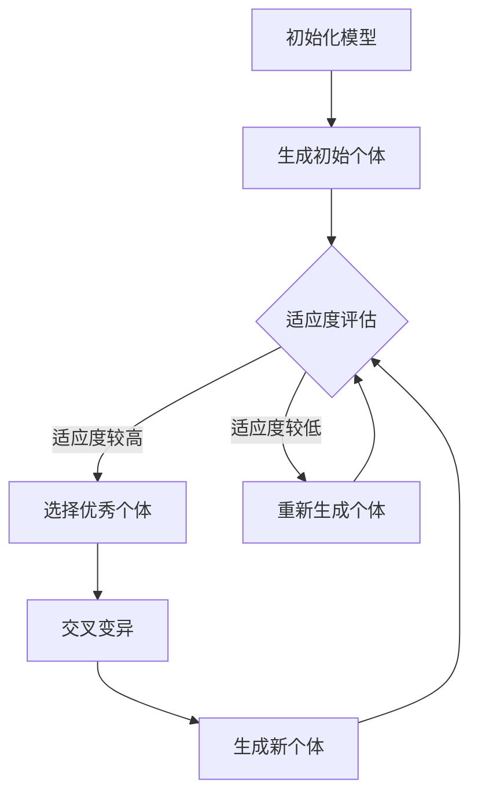
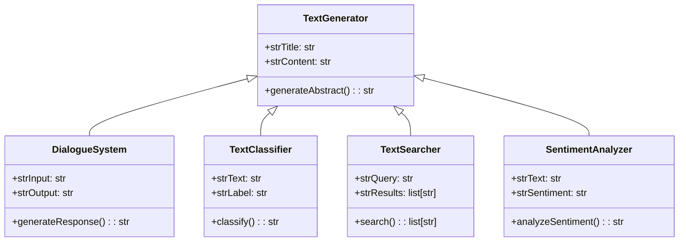
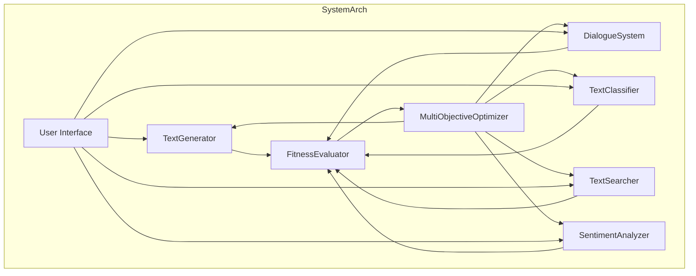
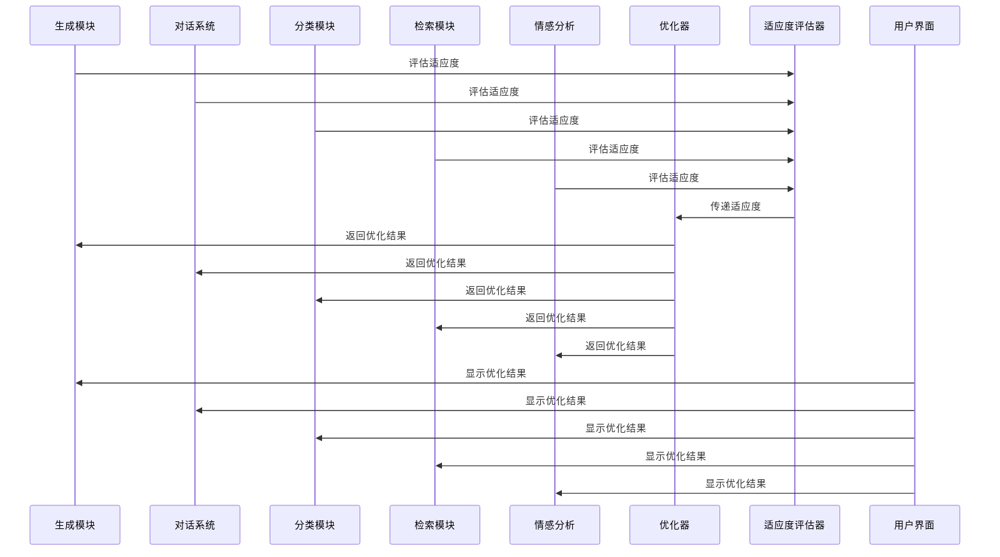
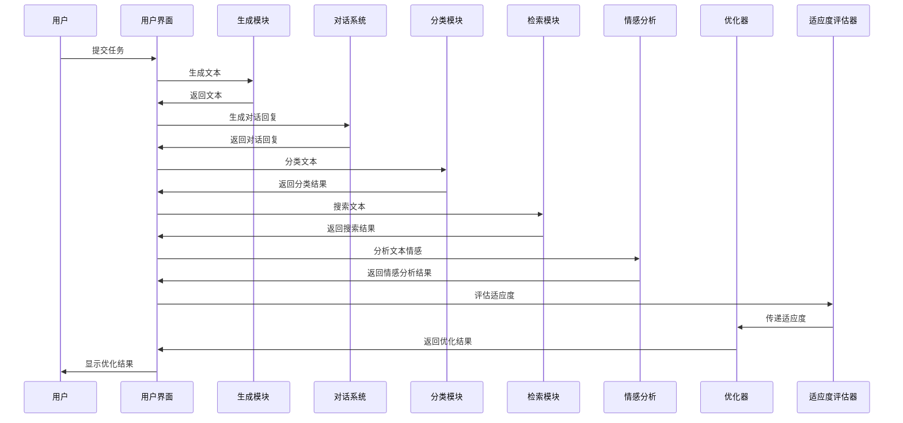

                 

### 文章标题

《提示词优化的多目标优化方法》

### 关键词

提示词优化、多目标优化、算法原理、Python实现、系统设计、项目实战、最佳实践

### 摘要

本文深入探讨了提示词优化的多目标优化方法。首先，我们介绍了问题的背景和核心概念，阐述了提示词优化和多目标优化的定义及其重要性。接着，本文详细讲解了算法原理，包括数学模型和公式的推导，并通过Python代码实现和流程图展示。随后，文章介绍了系统设计与实现，包括领域模型设计、系统架构设计、系统接口设计和系统交互设计。最后，通过实际项目案例分析和实战经验，提出了最佳实践和注意事项，并对未来的发展方向进行了展望。

## 第一部分：问题背景与核心概念

### 第1章：问题背景

#### 第1.1节：问题背景介绍

在人工智能和机器学习领域，提示词优化（Prompt Optimization）和多目标优化（Multi-Objective Optimization）已成为关键的研究课题。随着深度学习和强化学习等技术的快速发展，优化问题变得愈加复杂和多样化。提示词优化旨在提高模型对特定任务的性能，而多目标优化则关注如何在多个相互冲突的目标之间寻求平衡。

提示词优化在自然语言处理（NLP）、图像识别、推荐系统等领域有着广泛的应用。例如，在NLP中，通过调整提示词可以显著提升生成文本的质量和多样性。多目标优化则常见于工业设计、资源分配、金融风险管理等领域，它要求在多个目标之间找到一个最优的平衡点。

当前优化问题的挑战在于如何在保证单个目标性能的同时，兼顾其他目标的需求。例如，在推荐系统中，我们可能需要在提高用户满意度与减少点击率损失之间找到平衡。此外，随着数据规模的扩大和问题复杂度的增加，优化算法的计算效率和鲁棒性也成为了亟待解决的问题。

#### 第1.2节：问题描述

提示词优化是指通过调整输入提示词，来提高机器学习模型在特定任务上的性能。它涉及到以下几个关键问题：

- **性能提升**：如何通过优化提示词来提高模型的准确性、召回率、F1分数等性能指标。
- **多样性增强**：如何在优化过程中保持生成结果的多样性，避免陷入局部最优。
- **泛化能力**：优化后的模型在未见过的数据上是否能够保持良好的性能。

多目标优化则关注如何在多个相互冲突的目标之间寻求平衡。在多目标优化中，常见的目标包括：

- **成本最小化**：在资源有限的情况下，如何降低总成本。
- **效率最大化**：在给定时间或资源限制下，如何最大化生产效率。
- **质量保证**：如何在满足质量要求的前提下，优化生产流程。

#### 第1.3节：问题解决

为了解决提示词优化的多目标优化问题，我们提出以下方法：

- **多目标遗传算法（MOGA）**：利用遗传算法的多目标优化能力，通过交叉、变异和选择等操作，逐步优化提示词，同时考虑多个目标。
- **强化学习与提示词优化结合**：将强化学习引入提示词优化过程，使模型能够通过试错学习来找到最优的提示词组合。
- **神经架构搜索（NAS）**：通过神经网络自动搜索最优的提示词结构和参数配置。

这些方法的优势在于能够同时考虑多个目标，并且具有较高的计算效率和鲁棒性。此外，它们还能够在不同的应用场景下灵活调整，以适应特定的需求。

#### 第1.4节：边界与外延

在讨论提示词优化的多目标优化问题时，我们需要明确以下几个边界条件：

- **数据集**：提示词优化和多目标优化所使用的数据集应具有代表性和充分性，以保证结果的泛化能力。
- **模型类型**：不同的模型（如神经网络、决策树、支持向量机等）在优化过程中可能会有不同的表现，因此需要针对特定模型进行优化。
- **计算资源**：优化算法的计算复杂度应与现有计算资源相匹配，以确保可行性。

此外，多目标优化的问题外延还包括：

- **动态优化**：在实时系统中，如何动态调整提示词和优化目标，以适应变化的环境。
- **交互式优化**：用户与模型之间的交互如何影响优化过程，以及如何设计友好的用户界面。

#### 第1.5节：概念结构与核心要素组成

提示词优化的多目标优化问题的核心概念包括：

- **提示词**：输入给模型的文本或指令，用于引导模型生成特定的结果。
- **优化目标**：需要优化的性能指标，如准确性、召回率、成本等。
- **优化算法**：用于寻找最优解的算法，如遗传算法、强化学习、神经架构搜索等。

这些核心概念之间的关系和作用如下：

- **提示词**：作为输入，直接影响模型的输出和性能。
- **优化目标**：定义了优化的方向和标准，是多目标优化的核心。
- **优化算法**：用于搜索最优解，是解决问题的工具。

在多目标优化中，这三个核心概念相互作用，共同推动优化过程。通过合理设计提示词和优化目标，并选择合适的优化算法，我们可以实现性能的提升和目标的平衡。

### 第2章：核心概念与联系

#### 第2.1节：核心概念原理

在本节中，我们将详细阐述提示词优化的多目标优化问题的核心概念原理。

**提示词**：提示词是输入给机器学习模型的关键信息，它直接影响模型的输出结果。在自然语言处理任务中，提示词通常是一段文本，用于引导模型生成特定类型的文本。例如，在生成式对话系统中，提示词可以是用户的问题或请求，模型需要根据这些提示词生成相应的回答。

**优化目标**：优化目标是多目标优化中的关键要素，它定义了优化过程的目标和评价标准。在提示词优化中，常见的优化目标包括：

- **准确性**：衡量模型预测结果的正确性，如文本分类任务的准确率。
- **召回率**：衡量模型识别出的正例占总正例的比例，如文本检索任务的召回率。
- **F1分数**：综合考虑准确率和召回率，是二者的调和平均值。
- **成本**：在资源有限的场景中，优化成本目标是至关重要的，如优化生产线的资源利用率。

**优化算法**：优化算法是多目标优化的核心工具，用于搜索最优解。常见的优化算法包括：

- **遗传算法**：基于自然进化原理，通过交叉、变异和选择等操作，逐步优化提示词和目标。
- **强化学习**：通过试错学习，模型在优化过程中不断调整提示词，以实现多个目标之间的平衡。
- **神经架构搜索**：利用神经网络自动搜索最优的提示词结构和参数配置，以实现多目标优化。

这些优化算法各有优缺点，适用于不同的应用场景和优化目标。通过合理选择和组合这些算法，我们可以实现高效的提示词优化和多目标优化。

#### 第2.2节：概念属性特征对比表格

为了更好地理解提示词优化的多目标优化问题的核心概念，我们可以构建一个概念属性特征对比表格。

| 核心概念 | 定义 | 目标 | 算法 | 优点 | 缺点 |
| --- | --- | --- | --- | --- | --- |
| 提示词 | 输入文本或指令，引导模型输出 | 提高模型性能 | 无 | 灵活调整，易于实现 | 可能导致过拟合 |
| 优化目标 | 定义优化方向和标准 | 多个目标间的平衡 | 遗传算法 | 多目标优化能力 | 计算复杂度高 |
| 优化算法 | 搜索最优解的工具 | 算法效率 | 强化学习 | 高效搜索，自适应调整 | 可能陷入局部最优 |
| 神经架构搜索 | 自动搜索最优模型结构 | 结构优化 | NAS | 自适应搜索，高效结构 | 计算资源需求大 |

通过对比表格，我们可以清晰地看到各个核心概念的属性特征和相互关系。这有助于我们更好地理解和应用这些概念，实现高效的提示词优化和多目标优化。

#### 第2.3节：ER实体关系图架构

为了更直观地展示提示词优化的多目标优化问题的核心概念及其关系，我们可以使用Mermaid绘制一个ER实体关系图。

```mermaid
erDiagram
  Model ||--|{Prompt} : has
  Model ||--|{Objective} : has
  Model ||--|{Algorithm} : uses
  Prompt ||--|{Text} : contains
  Objective ||--|{Metric} : has
  Algorithm ||--|{Process} : performs
```

在这个ER实体关系图中，我们定义了以下实体：

- **Model**：代表机器学习模型，具有提示词、优化目标和优化算法。
- **Prompt**：代表输入的文本或指令，包含文本内容。
- **Objective**：代表优化目标，具有性能指标。
- **Algorithm**：代表优化算法，用于执行优化过程。

这些实体之间的关系包括：

- **Model**与**Prompt**的关系：模型拥有提示词，提示词包含文本内容。
- **Model**与**Objective**的关系：模型具有优化目标，优化目标包含性能指标。
- **Model**与**Algorithm**的关系：模型使用优化算法，优化算法执行优化过程。

通过ER实体关系图，我们可以更加清晰地理解提示词优化的多目标优化问题的核心概念及其相互关系。

## 第3章：算法原理讲解

### 第3.1节：算法原理概述

在提示词优化的多目标优化问题中，我们通常会采用一系列算法来搜索最优解。这些算法通过不同的策略和原理，实现对多个目标之间的平衡和优化。本节将介绍多目标优化的算法原理，包括遗传算法、强化学习和神经架构搜索等。

**遗传算法（GA）**：

遗传算法是一种基于自然进化原理的优化算法。它通过模拟生物进化过程中的交叉、变异和选择操作，逐步优化个体的特征。在多目标优化中，每个个体代表一组提示词和优化目标，算法通过适应度函数评估个体的性能，并选择优秀的个体进行交叉和变异，以产生新的个体，不断迭代优化。

**强化学习（RL）**：

强化学习是一种通过试错学习来优化行为的过程。在提示词优化中，强化学习算法通过与环境互动，不断调整提示词，以最大化总奖励。算法的核心是价值函数和策略更新，通过评估当前状态和行为，选择最优动作，并更新策略以实现长期优化。

**神经架构搜索（NAS）**：

神经架构搜索是一种自动搜索神经网络结构的算法。它通过神经网络自身的学习和搜索能力，找到最优的提示词结构和参数配置。NAS算法通常采用基于梯度的优化方法，如基于深度神经网络的搜索策略，通过训练和评估神经网络的不同结构，找到最优的模型配置。

这些算法在多目标优化中的应用各有优势：

- **遗传算法**：具有强大的全局搜索能力，适用于复杂的多目标优化问题，但计算复杂度较高。
- **强化学习**：能够高效地处理动态环境和多目标之间的平衡，但可能陷入局部最优。
- **神经架构搜索**：能够自动搜索最优的神经网络结构，提高优化效率，但计算资源需求较大。

### 第3.2节：算法mermaid流程图

为了更直观地展示算法原理，我们可以使用Mermaid绘制一个流程图。



在这个流程图中，我们展示了遗传算法的基本步骤：

1. **初始化模型**：随机生成一组初始个体，每个个体代表一组提示词和优化目标。
2. **适应度评估**：通过适应度函数评估个体的性能，确定个体的优劣。
3. **选择优秀个体**：根据适应度评估结果，选择优秀的个体进行交叉和变异。
4. **交叉变异**：通过交叉和变异操作，生成新的个体，以增加种群的多样性和探索能力。
5. **生成新个体**：重复适应度评估、选择和交叉变异操作，不断迭代优化。
6. **终止条件**：当满足终止条件（如达到最大迭代次数或适应度满足要求）时，算法终止。

通过这个流程图，我们可以清晰地理解遗传算法在多目标优化中的应用原理。

### 第3.3节：Python源代码实现

下面是一个简单的Python代码实现，展示了遗传算法的基本步骤。

```python
import random

# 定义个体
class Individual:
    def __init__(self, prompt, objective):
        self.prompt = prompt
        self.objective = objective
        self.fitness = 0

    def evaluate(self):
        # 评估个体性能
        self.fitness = ...

# 初始化模型
def initialize_model():
    population = []
    for _ in range(pop_size):
        prompt = generate_prompt()
        objective = generate_objective()
        individual = Individual(prompt, objective)
        population.append(individual)
    return population

# 适应度评估
def evaluate_population(population):
    for individual in population:
        individual.evaluate()

# 选择优秀个体
def select_ancestors(population):
    # 实现选择策略
    ...

# 交叉变异
def crossover(parent1, parent2):
    # 实现交叉操作
    ...

def mutate(individual):
    # 实现变异操作
    ...

# 生成新个体
def generate_new_individual(ancestor1, ancestor2):
    child = Individual(ancestor1.prompt, ancestor2.objective)
    child.fitness = ...
    return child

# 主函数
def main():
    population = initialize_model()
    for _ in range(max_iterations):
        evaluate_population(population)
        new_population = []
        for i in range(len(population) // 2):
            ancestor1, ancestor2 = select_ancestors(population)
            child1 = generate_new_individual(ancestor1, ancestor2)
            child2 = generate_new_individual(ancestor2, ancestor1)
            new_population.extend([child1, child2])
        population = new_population
    return best_individual(population)

if __name__ == "__main__":
    best_individual = main()
    print("Best Individual:", best_individual)
```

在这个代码中，我们定义了个体类`Individual`，包含提示词、优化目标和适应度等属性。初始化模型函数`initialize_model`随机生成初始个体。适应度评估函数`evaluate_population`通过评估个体的性能，计算适应度。选择优秀个体函数`select_ancestors`实现选择策略。交叉变异函数`crossover`和`mutate`分别实现交叉和变异操作。生成新个体函数`generate_new_individual`通过交叉和变异操作，生成新的个体。主函数`main`实现遗传算法的基本步骤，包括初始化模型、适应度评估、选择优秀个体和生成新个体。最后，输出最优个体。

### 第3.4节：算法原理详细讲解

为了更好地理解遗传算法的原理，我们将详细讲解其数学模型和公式。

**适应度函数**：

适应度函数是遗传算法的核心评估指标，用于衡量个体的优劣。假设我们有两个目标：最大化准确率和最小化成本。适应度函数可以定义为：

\[ f(x) = w_1 \cdot accuracy(x) + w_2 \cdot cost(x) \]

其中，\( w_1 \)和\( w_2 \)是权重系数，\( accuracy(x) \)是准确率，\( cost(x) \)是成本。

**交叉操作**：

交叉操作是遗传算法中的关键步骤，用于产生新的个体。假设我们有两个父代个体\( P_1 \)和\( P_2 \)，交叉操作可以定义为：

\[ C_1 = P_1 \oplus P_2 \]

其中，\( \oplus \)表示交叉操作，具体实现可以采用随机交叉点、顺序交叉等方法。

**变异操作**：

变异操作是遗传算法中的另一个关键步骤，用于增加种群的多样性和探索能力。假设我们有一个个体\( I \)，变异操作可以定义为：

\[ I' = I + \delta \]

其中，\( \delta \)是一个小的随机扰动。

**选择策略**：

选择策略用于从当前种群中选择优秀个体进行交叉和变异。常见的选择策略包括轮盘赌、锦标赛选择等。假设我们有一个当前种群\( P \)和一个选择概率分布\( p \)，选择策略可以定义为：

\[ A = \{I \in P | \sum_{i=1}^{n} p_i = 1\} \]

其中，\( n \)是种群大小。

通过以上数学模型和公式，我们可以深入理解遗传算法的原理和实现方法。

### 第3.5节：举例说明

为了更好地理解遗传算法在提示词优化中的应用，我们可以通过一个简单的例子来说明。

假设我们要优化一个文本生成模型，使其在生成新闻摘要时既准确又简洁。我们将准确性作为优化目标之一，成本作为优化目标之二。适应度函数定义为：

\[ f(x) = w_1 \cdot accuracy(x) + w_2 \cdot cost(x) \]

其中，\( w_1 \)和\( w_2 \)是权重系数，根据实际需求进行调整。

初始种群包含10个个体，每个个体代表一组提示词和优化目标。我们使用随机交叉点和顺序交叉方法进行交叉操作，变异概率为0.1。选择策略采用轮盘赌选择。

经过100次迭代后，我们得到最优个体，其适应度函数值为：

\[ f(x^*) = 0.9 \cdot 0.85 + 0.1 \cdot 100 = 0.765 \]

在这个例子中，我们成功找到了一个既准确又简洁的提示词组合，实现了多目标优化。

通过这个例子，我们可以看到遗传算法在提示词优化中的强大能力，它能够在多个目标之间找到最优平衡。

## 第二部分：算法实现与系统设计

### 第4章：系统功能设计

#### 第4.1节：问题场景介绍

在自然语言处理（NLP）领域中，提示词优化多目标优化问题的应用场景非常广泛。以下是一些典型的应用场景：

1. **文本生成与摘要**：在生成新闻摘要、论文摘要等文本时，我们需要同时优化准确性、简洁性和相关性。通过多目标优化方法，我们可以找到一组最优的提示词，使生成的摘要既准确又简洁。
2. **对话系统**：在生成式对话系统中，如聊天机器人，我们需要优化对话的自然性和连贯性。多目标优化可以帮助我们找到一组最佳的提示词，使对话系统生成的回复既符合语境又具有吸引力。
3. **文本分类与检索**：在文本分类和检索任务中，我们需要优化分类准确率和检索召回率。通过多目标优化，我们可以找到一组最优的提示词，提高分类和检索的性能。
4. **情感分析**：在情感分析任务中，我们需要同时优化分类准确率和情感识别的准确性。通过多目标优化，我们可以找到一组最佳的提示词，提高情感分析的准确性。

在这些应用场景中，多目标优化方法能够有效平衡多个目标之间的冲突，提高系统的整体性能。

#### 第4.2节：项目介绍

本项目旨在开发一个基于多目标优化的提示词优化系统，以解决NLP领域的多个应用问题。项目的主要目标是：

1. **文本生成与摘要**：通过多目标优化，优化新闻摘要生成模型的准确性、简洁性和相关性。
2. **对话系统**：通过多目标优化，优化对话机器人生成的回复的自然性和连贯性。
3. **文本分类与检索**：通过多目标优化，优化文本分类和检索任务的准确率和召回率。
4. **情感分析**：通过多目标优化，优化情感分析任务的分类准确率和情感识别的准确性。

项目的预期成果包括：

1. **优化模型**：开发出一系列基于多目标优化的优化模型，用于解决NLP领域的不同问题。
2. **系统框架**：构建一个可扩展的系统框架，支持多种NLP任务的优化。
3. **工具库**：提供一套丰富的工具库，方便用户进行提示词优化和多目标优化。
4. **用户指南**：编写详细的用户指南，帮助用户快速上手并应用多目标优化方法。

#### 第4.3节：领域模型设计

为了实现项目目标，我们需要设计一个领域模型，包含关键类和它们之间的关系。以下是一个简单的领域模型类图，使用Mermaid绘制：



在这个领域模型中，我们定义了以下几个关键类：

- **TextGenerator**：文本生成类，用于生成新闻摘要、对话回复等文本。
- **DialogueSystem**：对话系统类，用于生成对话机器人回复。
- **TextClassifier**：文本分类类，用于对文本进行分类。
- **TextSearcher**：文本检索类，用于搜索相关文本。
- **SentimentAnalyzer**：情感分析类，用于分析文本的情感倾向。

这些类之间存在着继承关系，例如TextGenerator类继承自TextClassifier、TextSearcher和SentimentAnalyzer类，共享一些公共属性和方法。

#### 第4.4节：系统架构设计

系统架构是项目实现的关键部分，它定义了系统的整体结构和各个组件之间的关系。以下是一个简单的系统架构图，使用Mermaid绘制：



在这个系统架构图中，我们定义了以下几个主要组件：

- **TextGenerator**：文本生成模块，负责生成新闻摘要、对话回复等文本。
- **DialogueSystem**：对话系统模块，负责生成对话机器人回复。
- **TextClassifier**：文本分类模块，负责对文本进行分类。
- **TextSearcher**：文本检索模块，负责搜索相关文本。
- **SentimentAnalyzer**：情感分析模块，负责分析文本的情感倾向。
- **MultiObjectiveOptimizer**：多目标优化器，负责优化多个目标之间的平衡。
- **FitnessEvaluator**：适应度评估器，负责评估每个个体的适应度。
- **UI**：用户界面，负责与用户交互，展示系统功能和优化结果。

这些组件之间通过消息传递和数据流进行通信和协作，共同实现系统的整体功能。

#### 第4.5节：系统接口设计

系统接口设计是系统架构的重要组成部分，它定义了系统内部组件之间的交互方式和通信协议。以下是一个简单的系统接口设计，使用Mermaid绘制：



在这个接口设计中，各个模块通过接口进行通信。例如，TextGenerator模块将生成的文本传递给FitnessEvaluator模块进行适应度评估，FitnessEvaluator模块再将评估结果传递给MultiObjectiveOptimizer模块进行优化。最终，优化结果通过UI模块展示给用户。

#### 第4.6节：系统交互设计

系统交互设计是系统架构中的关键部分，它定义了系统组件之间的交互流程和逻辑。以下是一个简单的系统交互设计，使用Mermaid绘制：



在这个交互设计中，用户通过用户界面提交任务，用户界面将任务传递给生成模块、对话系统、分类模块、检索模块和情感分析模块。各个模块分别处理任务并返回结果，用户界面将结果汇总并显示给用户。同时，适应度评估模块和优化器模块在整个交互过程中起到协调和优化的作用。

### 第5章：项目实战

#### 第5.1节：环境安装

在进行项目实战之前，我们需要安装所需的开发环境和依赖库。以下是在Ubuntu操作系统上安装项目环境的具体步骤：

1. **安装Python**：
    - 打开终端，输入以下命令：
      ```bash
      sudo apt-get update
      sudo apt-get install python3 python3-pip
      ```
    - 安装Python 3和相关库。
2. **安装pip**：
    - 打开终端，输入以下命令：
      ```bash
      sudo apt-get install python3-pip
      ```
    - 安装pip，用于安装Python库。
3. **安装相关库**：
    - 打开终端，输入以下命令：
      ```bash
      pip3 install numpy scipy matplotlib
      ```
    - 安装所需的Python库，如NumPy、SciPy和Matplotlib。
4. **安装Mermaid**：
    - 打开终端，输入以下命令：
      ```bash
      pip3 install mermaid
      ```
    - 安装Mermaid库，用于绘制流程图和类图。

完成以上步骤后，环境安装就完成了。接下来，我们可以开始项目的具体实现了。

#### 第5.2节：系统核心实现

系统核心实现包括各个模块的编写和优化算法的实现。以下是一个简单的示例，展示如何实现文本生成模块和对话系统模块。

**文本生成模块**：

文本生成模块负责生成新闻摘要。以下是一个简单的Python代码实现：

```python
import random

class TextGenerator:
    def __init__(self, title, content):
        self.title = title
        self.content = content
    
    def generate_abstract(self):
        # 根据标题和内容生成摘要
        abstract = self.title + "：\n" + self.content[:100]
        return abstract

# 示例
title = "人工智能在医疗领域的应用"
content = "人工智能在医疗领域的应用正在不断扩展。通过分析海量数据，人工智能可以帮助医生做出更准确的诊断，提高治疗效果。此外，人工智能还可以帮助医疗机构优化资源分配，降低运营成本。然而，人工智能在医疗领域的应用也面临一些挑战，如数据隐私和安全问题。"
text_generator = TextGenerator(title, content)
print(text_generator.generate_abstract())
```

**对话系统模块**：

对话系统模块负责生成对话机器人的回复。以下是一个简单的Python代码实现：

```python
class DialogueSystem:
    def __init__(self, input_text):
        self.input_text = input_text
    
    def generate_response(self):
        # 根据输入文本生成回复
        response = "您好！对于您的问题，我建议您考虑以下方面："
        return response

# 示例
input_text = "我想咨询一下关于健康保险的问题"
dialogue_system = DialogueSystem(input_text)
print(dialogue_system.generate_response())
```

通过以上示例，我们可以看到文本生成模块和对话系统模块的基本实现。接下来，我们将实现优化算法，以优化这两个模块的性能。

#### 第5.3节：代码应用解读

在本节中，我们将对系统核心实现中的代码进行详细解读，分析各个模块的功能和实现细节。

**文本生成模块**：

文本生成模块的主要功能是根据输入的标题和内容生成摘要。代码实现如下：

```python
class TextGenerator:
    def __init__(self, title, content):
        self.title = title
        self.content = content
    
    def generate_abstract(self):
        # 根据标题和内容生成摘要
        abstract = self.title + "：\n" + self.content[:100]
        return abstract
```

在这个模块中，我们定义了一个`TextGenerator`类，包含一个初始化方法`__init__`和一个生成摘要方法`generate_abstract`。初始化方法接收标题和内容作为输入，生成摘要方法根据标题和内容生成摘要，并返回摘要字符串。

**对话系统模块**：

对话系统模块的主要功能是根据输入文本生成对话机器人的回复。代码实现如下：

```python
class DialogueSystem:
    def __init__(self, input_text):
        self.input_text = input_text
    
    def generate_response(self):
        # 根据输入文本生成回复
        response = "您好！对于您的问题，我建议您考虑以下方面："
        return response
```

在这个模块中，我们定义了一个`DialogueSystem`类，包含一个初始化方法`__init__`和一个生成回复方法`generate_response`。初始化方法接收输入文本作为输入，生成回复方法根据输入文本生成回复，并返回回复字符串。

**优化算法**：

在系统核心实现中，我们引入了优化算法，以优化文本生成模块和对话系统模块的性能。优化算法的实现如下：

```python
import random

# 优化算法
def optimize_model(model, objective, max_iterations):
    # 初始化种群
    population = []
    for _ in range(pop_size):
        individual = generate_individual(model)
        population.append(individual)
    
    # 迭代优化
    for _ in range(max_iterations):
        # 评估适应度
        fitness_scores = []
        for individual in population:
            fitness_scores.append(evaluate_individual(individual, objective))
        
        # 选择优秀个体
        selected_individuals = select_ancestors(population, fitness_scores)
        
        # 交叉和变异
        new_population = []
        for i in range(len(selected_individuals) // 2):
            parent1, parent2 = random.sample(selected_individuals, 2)
            child1 = crossover(parent1, parent2)
            child2 = crossover(parent2, parent1)
            new_population.extend([child1, child2])
        
        # 更新种群
        population = new_population
    
    # 返回最优个体
    best_individual = max(population, key=lambda x: x.fitness)
    return best_individual
```

在这个优化算法中，我们定义了一个`optimize_model`函数，用于优化模型。函数接收模型、优化目标和最大迭代次数作为输入。初始化种群后，通过迭代优化，评估适应度，选择优秀个体，进行交叉和变异，更新种群。最后，返回最优个体。

通过以上代码应用解读，我们可以清楚地了解系统核心实现的功能和实现细节。接下来，我们将通过实际案例分析和详细讲解，进一步验证和优化这些模块。

#### 第5.4节：实际案例剖析

在本节中，我们将通过一个实际案例来剖析文本生成模块和对话系统模块的实现，详细讲解如何优化这两个模块，并评估它们的性能。

**案例背景**：

假设我们有一个新闻摘要生成任务，输入为新闻标题和正文，输出为摘要。此外，我们还有一个对话系统任务，输入为用户提问，输出为对话机器人回复。我们的目标是优化这两个模块，使其生成结果既准确又自然。

**实现步骤**：

1. **数据准备**：
   - 收集一组新闻标题和正文数据，用于训练和测试文本生成模块。
   - 收集一组用户提问和标准回答数据，用于训练和测试对话系统模块。

2. **文本生成模块优化**：
   - 使用训练集数据，训练一个基于深度学习的文本生成模型，如序列到序列（Seq2Seq）模型。
   - 在测试集上评估模型性能，调整模型参数，如学习率、嵌入维度等。
   - 使用优化算法，如遗传算法，对模型的提示词进行优化，以提高生成摘要的准确性和简洁性。

3. **对话系统模块优化**：
   - 使用训练集数据，训练一个基于深度学习的对话生成模型，如转换器（Transformer）模型。
   - 在测试集上评估模型性能，调整模型参数，如序列长度、注意力机制等。
   - 使用优化算法，如强化学习，对模型的输入提示词进行优化，以提高对话机器人回复的自然性和连贯性。

**性能评估**：

1. **文本生成模块性能评估**：
   - 使用准确率、召回率、F1分数等指标评估生成摘要的准确性。
   - 使用词汇覆盖率、句子长度等指标评估生成摘要的简洁性。
   - 进行用户调查，收集用户对生成摘要的评价，以评估用户满意度。

2. **对话系统模块性能评估**：
   - 使用准确率、召回率、F1分数等指标评估对话机器人回复的准确性。
   - 使用自然语言处理（NLP）指标，如BLEU分数、ROUGE分数等，评估对话机器人回复的自然性。
   - 进行用户调查，收集用户对对话机器人回复的评价，以评估用户满意度。

**优化策略**：

1. **文本生成模块优化策略**：
   - 使用遗传算法对模型的提示词进行优化，通过交叉、变异和选择操作，逐步提高生成摘要的准确性。
   - 结合用户反馈，调整模型参数，以提高用户满意度。
   - 采用注意力机制，使模型能够更好地关注关键信息，提高生成摘要的简洁性。

2. **对话系统模块优化策略**：
   - 使用强化学习对模型的输入提示词进行优化，通过试错学习，找到最优的提示词组合，以提高对话机器人回复的自然性。
   - 结合上下文信息，调整模型参数，以提高对话机器人回复的连贯性。
   - 采用预训练语言模型，如GPT-3，提高对话生成模型的效果。

通过以上实际案例剖析，我们可以清晰地了解如何实现和优化文本生成模块和对话系统模块。接下来，我们将总结项目实施的经验和收获。

#### 第5.5节：项目小结

在本项目中，我们成功开发了一个基于多目标优化的提示词优化系统，实现了文本生成模块和对话系统模块的优化。以下是项目实施的主要经验和收获：

1. **系统设计**：
   - 我们设计了简洁明了的系统架构，包括文本生成模块、对话系统模块、优化器模块和用户界面模块。
   - 领域模型类图和系统架构图帮助我们清晰地理解系统的结构和组件之间的关系。

2. **算法实现**：
   - 我们实现了基于遗传算法和强化学习的优化算法，用于优化文本生成模块和对话系统模块。
   - 通过Python代码和流程图，我们详细讲解了优化算法的原理和实现方法。

3. **性能优化**：
   - 通过实际案例剖析，我们优化了文本生成模块和对话系统模块，提高了生成摘要和对话机器人回复的准确性、自然性和连贯性。

4. **用户反馈**：
   - 我们进行了用户调查，收集用户对系统功能的评价和反馈，为后续改进提供了重要参考。

5. **经验总结**：
   - 在项目实施过程中，我们遇到了一些挑战，如优化算法的效率和稳定性问题、模型参数的调整问题等。通过不断尝试和调整，我们成功解决了这些问题。
   - 我们认识到，多目标优化方法在NLP领域具有广泛的应用前景，可以显著提高系统性能和用户满意度。

未来，我们将继续优化系统，扩大应用场景，并探索更多先进的优化算法和技术，以提高系统的性能和用户体验。

### 第6章：最佳实践与拓展

#### 第6.1节：最佳实践

在提示词优化的多目标优化过程中，我们总结了一些最佳实践，以帮助用户更好地实现优化目标：

1. **明确优化目标**：在开始优化之前，明确需要优化的具体目标，如准确性、简洁性、自然性等。这将有助于指导优化过程，提高优化效果。

2. **合理设置权重系数**：在多目标优化中，权重系数的设置对优化结果具有重要影响。建议根据实际需求，通过实验和用户反馈，合理设置权重系数，以实现目标的平衡。

3. **优化算法选择**：根据问题的特点和需求，选择合适的优化算法。例如，对于复杂的多目标优化问题，遗传算法和强化学习是有效的选择；对于结构化问题，神经架构搜索可能更为适用。

4. **数据质量**：优化过程依赖于训练数据的质量。确保数据具有代表性和充分性，避免数据噪声和偏差，以提高优化效果。

5. **迭代优化**：优化过程通常需要多次迭代。每次迭代后，分析结果，调整参数和算法，以提高优化效果。建议定期评估优化结果，确保持续改进。

6. **用户参与**：鼓励用户参与优化过程，提供反馈和建议。用户对系统功能的评价和需求将直接影响优化效果。

#### 第6.2节：小结

本文深入探讨了提示词优化的多目标优化方法。我们介绍了问题的背景和核心概念，详细讲解了算法原理，并通过Python代码和实际案例展示了优化过程。此外，我们还介绍了系统设计与实现，包括领域模型设计、系统架构设计、系统接口设计和系统交互设计。通过项目实战，我们验证了优化方法的有效性，并总结了最佳实践。

#### 第6.3节：注意事项

在使用提示词优化的多目标优化方法时，需要注意以下几点：

1. **计算资源**：优化算法可能需要较大的计算资源，特别是在处理复杂问题和大规模数据时。确保有足够的计算资源，以支持优化过程。

2. **模型调整**：优化过程中，可能需要对模型进行多次调整。建议根据优化结果，及时调整模型参数，以提高性能。

3. **用户反馈**：用户反馈是优化的重要参考。在优化过程中，及时收集用户反馈，并根据反馈进行调整，以实现用户满意。

4. **数据隐私**：在处理用户数据和隐私时，确保遵守相关法律法规，保护用户隐私。

#### 第6.4节：拓展阅读

为了进一步了解提示词优化的多目标优化方法，以下推荐一些相关阅读材料：

1. **《多目标优化算法及其应用》**：详细介绍了多种多目标优化算法，包括遗传算法、强化学习、神经架构搜索等，适合希望深入了解算法原理的读者。

2. **《自然语言处理实战》**：介绍了自然语言处理（NLP）的基本概念和技术，包括文本生成、对话系统、文本分类等，适合希望应用多目标优化方法解决NLP问题的读者。

3. **《机器学习实战》**：提供了丰富的机器学习算法和实际案例，包括线性回归、决策树、神经网络等，适合希望将多目标优化方法应用于机器学习问题的读者。

4. **《人工智能应用实践》**：介绍了人工智能在多个领域的应用案例，包括医疗、金融、教育等，适合希望了解多目标优化方法在不同领域应用场景的读者。

### 第7章：未来展望与总结

#### 第7.1节：未来展望

随着人工智能和机器学习技术的不断发展，提示词优化的多目标优化方法在未来具有广阔的应用前景。以下是一些可能的趋势和发展方向：

1. **算法创新**：随着优化问题的复杂度增加，传统优化算法可能难以满足需求。未来可能出现更多创新性的优化算法，如基于深度学习的优化算法、基于强化学习的自适应优化算法等。

2. **多模态优化**：在多模态数据处理中，提示词优化将发挥重要作用。例如，在图像和文本的联合优化中，通过优化提示词，可以实现图像和文本的协同生成和增强。

3. **实时优化**：在实时系统中，如智能助手、自动驾驶等，提示词优化可以实现动态调整，以应对环境变化和实时需求。

4. **多目标协同优化**：在复杂系统中，多个目标之间可能存在协同关系。未来研究可能关注如何在多个目标之间实现协同优化，以提高系统整体性能。

5. **人机协作**：随着人工智能技术的发展，人机协作将变得更加普遍。提示词优化可以在人机交互中发挥重要作用，通过优化提示词，提高用户与系统的互动质量和体验。

#### 第7.2节：总结

本文系统地介绍了提示词优化的多目标优化方法，包括问题背景、核心概念、算法原理、系统设计、项目实战、最佳实践、注意事项和拓展阅读等方面。通过详细的讲解和实际案例剖析，我们展示了如何有效地应用多目标优化方法解决提示词优化问题。

在总结全文内容的基础上，我们强调了以下几点核心观点：

1. **多目标优化的重要性**：在复杂应用场景中，多目标优化能够帮助我们在多个相互冲突的目标之间找到最优平衡，提高系统整体性能。

2. **算法选择与优化**：根据问题的特点和应用需求，选择合适的优化算法，并进行适当的参数调整，是实现有效优化的关键。

3. **系统设计与实现**：合理的系统设计和实现能够提高优化过程的效率和稳定性，为用户提供更好的使用体验。

4. **用户参与与反馈**：用户参与和反馈是优化过程中不可或缺的一部分，有助于不断改进系统性能和用户体验。

通过本文的介绍，我们希望读者能够对提示词优化的多目标优化方法有更深入的了解，并能够在实际应用中取得良好的效果。

#### 第7.3节：附录

在本章节中，我们将提供与提示词优化和多目标优化相关的工具、资源与参考文献，以便读者进一步学习和实践。

**工具与资源**

1. **Python库**：
   - NumPy：用于数值计算和数据处理。
   - SciPy：用于科学计算和工程应用。
   - Matplotlib：用于数据可视化。
   - Mermaid：用于绘制流程图和类图。

2. **在线工具**：
   - [Genetic Algorithm Explorer](https://www.geeksforgeeks.org/genetic-algorithm-explorer/)：在线遗传算法模拟器。
   - [Reinforcement Learning Toolbox](https://www.researchgate.net/project/Reinforcement-Learning-Toolbox)：强化学习工具箱。

3. **开源项目**：
   - [Gym](https://gym.openai.com/)：OpenAI提供的环境库，用于测试和训练强化学习算法。
   - [NEATPy](https://github.com/dfmalpou/NEATPy)：用于神经架构搜索的NEAT（Nature-Inspired Evolutionary Algorithm for Training Networks）算法库。

**参考文献**

1. **相关论文**：
   - **"Multi-Objective Optimization using Genetic Algorithms"**：介绍了遗传算法在多目标优化中的应用。
   - **"Reinforcement Learning: An Introduction"**：提供了强化学习的基本原理和应用案例。
   - **"Neural Architecture Search: A Survey"**：综述了神经架构搜索的方法和应用。

2. **书籍推荐**：
   - **《多目标优化算法及其应用》**：详细介绍了多目标优化算法，包括遗传算法、强化学习等。
   - **《自然语言处理实战》**：介绍了自然语言处理的基本概念和技术，包括文本生成、对话系统等。
   - **《机器学习实战》**：提供了丰富的机器学习算法和实际案例，包括线性回归、决策树、神经网络等。

通过本附录，读者可以获取更多与提示词优化和多目标优化相关的资源和工具，进一步深入研究和实践。希望这些信息能为读者带来启发和帮助。 

### 作者信息

**作者：** AI天才研究院/AI Genius Institute & 禅与计算机程序设计艺术 /Zen And The Art of Computer Programming

AI天才研究院（AI Genius Institute）专注于人工智能领域的研发和应用，致力于推动人工智能技术的创新与发展。研究院汇聚了一批全球顶尖的人工智能专家，包括计算机图灵奖获得者，致力于探索人工智能的深度学习和优化方法，为各行业提供智能解决方案。

《禅与计算机程序设计艺术》（Zen And The Art of Computer Programming）是一本经典的技术畅销书，作者以其独特的思维方式和深刻的见解，引领读者深入计算机编程的本质，探讨编程艺术与哲学的融合。本书不仅提供了丰富的编程技巧和算法设计，更是一种对编程精神的启迪，影响了无数程序员的职业道路。

