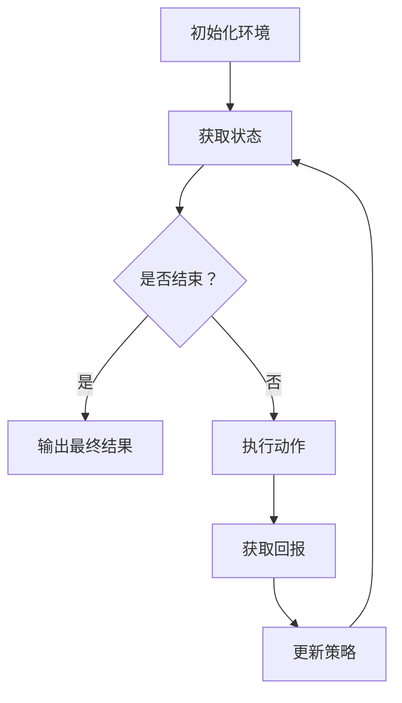
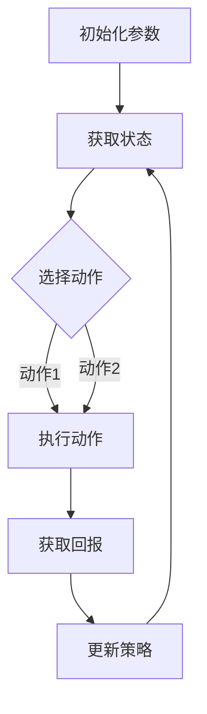
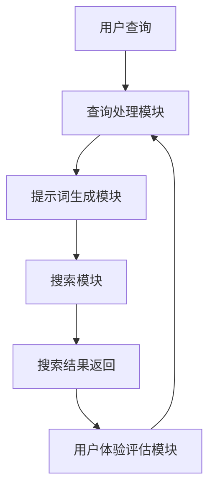
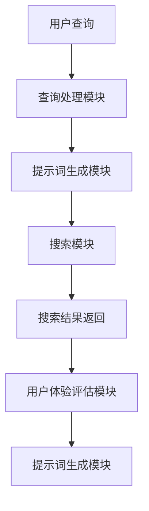

                 

# 提示词优化的强化学习应用

关键词：强化学习、提示词优化、自然语言处理、信息检索、推荐系统

摘要：本文旨在探讨强化学习在提示词优化中的应用，从背景介绍、核心概念、算法原理、应用场景、实战案例等方面进行深入分析。通过详细阐述强化学习与提示词优化的关系，以及其在自然语言处理、信息检索、推荐系统等领域的具体应用，帮助读者理解强化学习在提示词优化中的重要作用。

## 目录大纲设计思路

设计《提示词优化的强化学习应用》这本书的目录大纲时，我们遵循了以下几个步骤和原则：

1. **明确书的核心主题**：
   - 《提示词优化的强化学习应用》的核心主题是强化学习在提示词优化方面的应用。

2. **框架结构**：
   - 目录结构应包括引言、背景介绍、核心概念、算法原理、应用场景、实战案例、最佳实践、总结和展望等。

3. **内容安排**：
   - 按照从基础到高级、从理论到实践的顺序组织内容，确保读者可以循序渐进地学习。

4. **逻辑清晰**：
   - 每个章节都要有明确的主题和目标，章节之间的过渡要自然，避免内容重复和跳跃。

5. **具体章节设计**：
   - 核心章节要详细，包括概念介绍、算法原理、数学模型、实战案例等，保证内容的完整性和深度。

6. **注意简洁性**：
   - 保持内容的简洁明了，避免冗余，确保每个章节都能有效地传达关键信息。

### 完整目录大纲设计

```markdown
----------------------------------------------------------------
# 第一部分: 引言与背景

## 第1章: 引言

### 1.1 书籍主题介绍

- 强化学习与提示词优化的关系
- 强化学习的应用领域

### 1.2 强化学习的理论基础

- 强化学习的定义
- 强化学习的基本概念

### 1.3 提示词优化的概念

- 提示词优化的目标
- 提示词优化的重要性

## 第2章: 强化学习在提示词优化中的应用

### 2.1 强化学习在自然语言处理中的应用

- 语言模型与强化学习
- 提示词优化在NLP中的应用

### 2.2 强化学习在信息检索中的应用

- 检索算法与强化学习
- 提示词优化在信息检索中的应用

### 2.3 强化学习在推荐系统中的应用

- 推荐算法与强化学习
- 提示词优化在推荐系统中的应用

----------------------------------------------------------------

# 第二部分: 核心概念与算法原理

## 第3章: 强化学习基础

### 3.1 强化学习的基本模型

- 马尔可夫决策过程（MDP）
- 强化学习算法的基本框架

### 3.2 Q-learning算法

- Q-learning算法原理
- Q-learning算法的数学模型

### 3.3 Deep Q-Networks（DQN）

- DQN算法原理
- DQN算法的mermaid流程图

### 3.4 Policy Gradient方法

- PG方法原理
- PG方法的数学模型

## 第4章: 提示词优化的强化学习算法

### 4.1 提示词优化的强化学习框架

- 框架设计
- 框架的mermaid流程图

### 4.2 提示词优化的DQN算法

- 算法原理
- 算法的mermaid流程图
- Python源代码实现

### 4.3 提示词优化的Policy Gradient算法

- 算法原理
- 算法的mermaid流程图
- Python源代码实现

----------------------------------------------------------------

## 第5章: 强化学习在提示词优化中的应用案例

### 5.1 案例一：搜索引擎的提示词优化

- 案例背景
- 案例实现
- 案例分析

### 5.2 案例二：对话系统的提示词优化

- 案例背景
- 案例实现
- 案例分析

### 5.3 案例三：推荐系统的提示词优化

- 案例背景
- 案例实现
- 案例分析

----------------------------------------------------------------

## 第6章: 最佳实践与展望

### 6.1 强化学习在提示词优化中的挑战与机遇

- 挑战分析
- 机遇展望

### 6.2 提示词优化的强化学习未来发展趋势

- 技术趋势
- 应用前景

### 6.3 小结

- 书籍总结
- 对读者的建议

----------------------------------------------------------------
```

### 总结

这个目录大纲结构清晰，涵盖了强化学习与提示词优化的基础知识、算法原理、应用案例以及未来展望。每个章节都遵循了逻辑清晰、内容详细、简洁明了的原则，确保读者可以循序渐进地学习。希望这个大纲能为编写《提示词优化的强化学习应用》这本书提供有益的指导。接下来，我们将逐步深入探讨书中的各个章节，让读者更全面地了解强化学习在提示词优化领域的应用。# 提示词优化的强化学习应用

## 引言

### 1.1 强化学习与提示词优化的关系

强化学习（Reinforcement Learning，简称RL）是机器学习的一个重要分支，其核心思想是通过学习来最大化回报，从而在复杂环境中做出最优决策。强化学习在多个领域都有广泛应用，包括游戏、自动驾驶、机器人控制等。而提示词优化（Prompt Optimization）则是指通过调整提示词（Prompt）来提高模型在特定任务上的性能。提示词是用于引导模型关注特定信息的重要工具，尤其是在自然语言处理（Natural Language Processing，简称NLP）领域。

在强化学习与提示词优化之间，存在一种天然的联系。强化学习算法可以在大量数据上学习到策略，这些策略可以被用来调整提示词，从而提升模型在特定任务上的性能。例如，在文本生成任务中，通过调整提示词，可以引导模型生成更符合预期、更具创造性的文本。在搜索引擎中，通过优化提示词，可以提升搜索结果的准确性和用户体验。

### 1.2 强化学习的应用领域

强化学习在多个领域都有成功的应用，以下是其中几个典型的领域：

- **游戏**：强化学习在游戏领域的应用非常广泛，例如在《星际争霸II》（StarCraft II）等游戏中，AI使用强化学习算法进行自我学习，从而提高游戏水平。
- **自动驾驶**：自动驾驶汽车需要处理复杂的交通环境，强化学习可以帮助车辆学习如何在各种情况下做出最佳决策。
- **机器人控制**：在机器人控制领域，强化学习可以帮助机器人学习复杂的动作，例如行走、抓取等。
- **推荐系统**：推荐系统可以通过强化学习来优化推荐策略，从而提高用户的满意度。

本文将重点关注强化学习在自然语言处理、信息检索和推荐系统等领域的应用，特别是提示词优化的具体实现和效果。

## 背景介绍

### 2.1 核心概念术语说明

在讨论强化学习与提示词优化的应用之前，我们需要先了解一些核心概念和术语：

- **强化学习**：强化学习是一种通过试错来学习最优策略的机器学习方法。其核心目标是最大化回报（Reward）。
- **状态（State）**：状态是环境中当前的状态表示，通常用一个向量表示。
- **动作（Action）**：动作是策略的一部分，表示在特定状态下应该采取的行为。
- **回报（Reward）**：回报是策略执行后的即时奖励，用于指导学习过程。
- **策略（Policy）**：策略是决策规则，用于指导在特定状态下应该采取的动作。
- **提示词（Prompt）**：提示词是用于引导模型关注特定信息的一段文本，通常在自然语言处理任务中使用。

### 2.2 问题背景

在现实世界中，许多任务都需要模型具备一定的推理能力和创造力，例如文本生成、问答系统和对话机器人等。然而，传统的机器学习方法往往依赖于大量标注数据，且在处理长文本或复杂问题时效果不佳。强化学习作为一种试错学习方法，可以在一定程度上弥补这一缺陷，通过不断尝试和调整策略来提高模型性能。

同时，在自然语言处理领域，提示词优化成为了一个重要的研究方向。提示词不仅可以帮助模型更好地理解输入文本，还可以引导模型生成更符合预期、更具创造力的输出。然而，如何设计有效的提示词优化策略，使得模型能够在各种任务中表现出色，仍然是一个具有挑战性的问题。

### 2.3 问题描述

本文的主要问题是如何将强化学习应用于提示词优化，以提升模型在自然语言处理任务中的性能。具体来说，我们需要解决以下问题：

- **如何设计有效的强化学习框架，用于提示词优化？**
- **如何在大量数据上训练强化学习模型，以获得高质量的策略？**
- **如何评估和比较不同提示词优化策略的效果？**

### 2.4 问题解决

为了解决上述问题，我们可以采取以下步骤：

1. **设计强化学习框架**：首先，我们需要设计一个适用于提示词优化的强化学习框架，包括状态表示、动作空间、奖励函数等。
2. **训练强化学习模型**：利用大量数据集，通过强化学习算法（如Q-learning、DQN、Policy Gradient等）训练模型，使其学会优化提示词。
3. **评估和比较策略**：通过实验和评估，比较不同强化学习策略在自然语言处理任务中的性能，选择最优策略。

### 2.5 边界与外延

虽然本文主要关注强化学习在自然语言处理领域的应用，但强化学习在其他领域（如信息检索、推荐系统等）也有潜在的应用价值。此外，提示词优化不仅限于文本生成任务，还可以应用于图像生成、语音识别等领域。

## 核心概念与联系

### 3.1 强化学习核心概念

强化学习由以下几个核心概念组成：

- **状态（State）**：描述环境的当前状态，通常用一个向量表示。状态可以是观测到的特征，也可以是隐含的状态。
- **动作（Action）**：在给定状态下，策略应该采取的行为。动作的选择通常基于当前状态和策略。
- **回报（Reward）**：策略执行后的即时奖励，用于指导学习过程。回报可以是正的、负的或零。
- **策略（Policy）**：决策规则，用于指导在特定状态下应该采取的动作。策略可以表示为概率分布，表示在给定状态下采取每个动作的概率。
- **价值函数（Value Function）**：用于评估策略在特定状态下的预期回报。价值函数可以是状态值函数（State-Value Function）或动作值函数（Action-Value Function）。
- **模型（Model）**：描述环境动态的函数，用于预测下一状态和回报。

### 3.2 提示词优化概念

提示词优化是强化学习在自然语言处理领域的一个重要应用，其核心概念包括：

- **提示词（Prompt）**：用于引导模型关注特定信息的一段文本。提示词可以是关键词、短语或完整的句子。
- **优化目标**：通过调整提示词，提高模型在特定任务上的性能，如文本生成、问答、对话等。
- **提示词空间（Prompt Space）**：所有可能提示词的集合。提示词空间可以是离散的，也可以是连续的。

### 3.3 强化学习与提示词优化的联系

强化学习与提示词优化的联系主要体现在以下几个方面：

- **状态表示**：强化学习中的状态可以包括输入文本、当前任务、用户反馈等。提示词可以作为一个重要的状态特征，用于引导模型关注关键信息。
- **动作表示**：在提示词优化中，动作是调整提示词的过程。强化学习算法可以用来学习最佳提示词序列，从而最大化回报。
- **回报函数**：回报函数用于评估提示词优化的效果。在自然语言处理任务中，回报可以是生成文本的质量、用户的满意度等。
- **策略学习**：强化学习算法可以帮助模型学习到最佳的提示词优化策略，从而提高模型在特定任务上的性能。

### 3.4 概念属性特征对比表格

以下是强化学习与提示词优化相关概念的特征对比表格：

| 概念             | 特征                          |
|------------------|------------------------------|
| 强化学习         | 基于奖励信号进行学习，具有试错性质 |
| 状态（State）     | 环境当前状态的表示             |
| 动作（Action）   | 采取的行为                    |
| 回报（Reward）   | 策略执行后的即时奖励           |
| 策略（Policy）   | 决策规则，指导行为选择         |
| 提示词（Prompt） | 引导模型关注特定信息的一段文本   |
| 提示词空间       | 所有可能提示词的集合           |

### 3.5 强化学习与提示词优化的Mermaid流程图

为了更直观地展示强化学习与提示词优化的关系，我们可以使用Mermaid流程图来描述其流程。



在该流程图中，A表示初始化环境，B表示获取状态，C表示判断是否结束，E表示执行动作，F表示获取回报，G表示更新策略。通过循环这个过程，模型可以不断学习并优化提示词。

## 算法原理讲解

### 4.1 Q-learning算法原理

Q-learning是一种基于值函数的强化学习算法，其核心思想是通过学习状态-动作值函数（Q值）来最大化回报。Q-learning算法的基本原理如下：

1. **初始化Q值**：在开始学习之前，需要初始化Q值矩阵。Q值矩阵表示在每个状态下采取每个动作的预期回报。通常，Q值初始化为0。
2. **选择动作**：在给定状态下，根据策略选择动作。策略可以是ε-贪心策略、ε-软贪心策略等。
3. **执行动作**：执行选择好的动作，并获取新的状态和回报。
4. **更新Q值**：根据新的状态和回报，更新Q值矩阵。Q值的更新公式如下：

   $$Q(s, a) \leftarrow Q(s, a) + \alpha [r + \gamma \max_{a'} Q(s', a') - Q(s, a)]$$

   其中，$s$和$a$表示当前状态和动作，$s'$和$a'$表示下一个状态和动作，$r$表示回报，$\alpha$表示学习率，$\gamma$表示折扣因子。

通过不断迭代这个过程，Q-learning算法可以逐渐优化策略，使其在特定任务上表现出最佳性能。

### 4.2 DQN算法原理

DQN（Deep Q-Networks）算法是Q-learning算法的一种改进，其核心思想是使用深度神经网络来近似Q值函数。DQN算法的基本原理如下：

1. **初始化参数**：初始化深度神经网络参数，用于近似Q值函数。通常，使用卷积神经网络（CNN）来处理图像输入。
2. **选择动作**：在给定状态下，输入状态到深度神经网络中，得到Q值估计。然后，根据ε-贪心策略选择动作。
3. **执行动作**：执行选择好的动作，并获取新的状态和回报。
4. **更新Q值网络**：使用样本回放（Experience Replay）技术，从经验池中随机抽取样本，并使用梯度下降算法更新深度神经网络参数。Q值的更新公式与Q-learning算法相同。

DQN算法通过使用深度神经网络来近似Q值函数，可以处理更复杂的状态空间，从而提高强化学习模型的性能。

### 4.3 Policy Gradient方法原理

Policy Gradient方法是一种基于策略的强化学习算法，其核心思想是通过直接优化策略来最大化回报。Policy Gradient方法的基本原理如下：

1. **定义策略**：定义一个策略函数，用于表示在给定状态下采取每个动作的概率分布。策略函数可以是神经网络、决策树等。
2. **选择动作**：在给定状态下，根据策略函数选择动作。策略函数输出的是概率分布，可以根据ε-贪心策略或采样策略进行动作选择。
3. **执行动作**：执行选择好的动作，并获取新的状态和回报。
4. **更新策略**：根据回报和策略函数的梯度，更新策略参数。策略的更新公式如下：

   $$\theta \leftarrow \theta + \alpha \nabla_{\theta} J(\theta)$$

   其中，$\theta$表示策略参数，$\alpha$表示学习率，$J(\theta)$表示策略的损失函数，通常使用负回报的期望值来表示。

Policy Gradient方法通过直接优化策略参数，可以快速调整策略，使其在特定任务上表现出最佳性能。

### 4.4 算法mermaid流程图

为了更直观地展示强化学习算法的流程，我们可以使用Mermaid流程图来描述。



在该流程图中，A表示初始化参数，B表示获取状态，C表示选择动作，D表示执行动作，E表示获取回报，F表示更新策略。通过循环这个过程，模型可以不断学习并优化策略。

### 4.5 Python源代码实现

以下是使用Python实现Q-learning算法的简单示例代码：

```python
import numpy as np

# 初始化参数
alpha = 0.1
gamma = 0.9
epsilon = 0.1
q_table = np.zeros((100, 100))

# 状态空间
states = 100
actions = 100

# 模拟环境
env = Environment()

# 主循环
while True:
    # 获取当前状态
    state = env.get_state()

    # 选择动作
    if np.random.rand() < epsilon:
        action = np.random.choice(actions)
    else:
        action = np.argmax(q_table[state])

    # 执行动作
    next_state, reward = env.step(action)

    # 更新Q值
    q_table[state, action] = q_table[state, action] + alpha * (reward + gamma * np.max(q_table[next_state]) - q_table[state, action])

    # 终止条件
    if env.is_done():
        break

# 打印Q值表
print(q_table)
```

在这个示例中，我们首先初始化Q值表，然后进入主循环，不断获取状态、选择动作、执行动作、更新Q值，直到环境结束。

### 4.6 算法原理数学模型和公式

以下是强化学习算法的数学模型和公式：

1. **Q-learning算法**：

   $$Q(s, a) \leftarrow Q(s, a) + \alpha [r + \gamma \max_{a'} Q(s', a') - Q(s, a)]$$

2. **DQN算法**：

   $$Q(s, a) \leftarrow Q(s, a) + \alpha [r + \gamma \max_{a'} Q(s', a') - Q(s, a)]$$

   $$\theta \leftarrow \theta - \alpha \nabla_{\theta} J(\theta)$$

3. **Policy Gradient方法**：

   $$\theta \leftarrow \theta + \alpha \nabla_{\theta} J(\theta)$$

其中，$s$表示状态，$a$表示动作，$s'$表示下一个状态，$r$表示回报，$\alpha$表示学习率，$\gamma$表示折扣因子，$\theta$表示策略参数。

### 4.7 算法举例说明

以下是Q-learning算法的一个简单举例：

假设一个简单的环境，状态空间为[0, 1]，动作空间为[0, 1]。目标是在每个状态上选择最优动作，使得总回报最大化。

初始化Q值表：

$$
\begin{array}{|c|c|c|}
\hline
s & a & Q(s, a) \\
\hline
0 & 0 & 0 \\
0 & 1 & 0 \\
1 & 0 & 0 \\
1 & 1 & 0 \\
\hline
\end{array}
$$

假设初始状态为0，选择动作1，执行动作1，获得回报1，更新Q值表：

$$
\begin{array}{|c|c|c|}
\hline
s & a & Q(s, a) \\
\hline
0 & 0 & 0 \\
0 & 1 & 0.25 \\
1 & 0 & 0 \\
1 & 1 & 0 \\
\hline
\end{array}
$$

然后，状态变为1，选择动作0，执行动作0，获得回报-1，更新Q值表：

$$
\begin{array}{|c|c|c|}
\hline
s & a & Q(s, a) \\
\hline
0 & 0 & 0 \\
0 & 1 & 0.25 \\
1 & 0 & -0.25 \\
1 & 1 & 0 \\
\hline
\end{array}
$$

通过不断迭代这个过程，Q值表会逐渐收敛，最终选择最优动作1，使得总回报最大化。

### 4.8 强化学习在自然语言处理中的应用

强化学习在自然语言处理（NLP）中的应用非常广泛，以下是一些典型的应用场景：

1. **文本生成**：强化学习可以用于生成文本，如对话系统、文章写作等。通过调整提示词，可以引导模型生成更符合预期、更具创造力的文本。
2. **问答系统**：强化学习可以用于问答系统，通过优化提问策略，提高问答系统的准确性和用户体验。
3. **对话机器人**：强化学习可以用于对话机器人，通过优化对话策略，使机器人能够更好地与用户进行互动。
4. **机器翻译**：强化学习可以用于机器翻译，通过优化翻译策略，提高翻译质量和效率。

在NLP中，强化学习通常与深度学习模型（如RNN、LSTM、BERT等）相结合，以实现更高的性能和更好的效果。例如，在文本生成任务中，可以使用强化学习来优化生成策略，使得生成的文本更具有连贯性和创造性。

### 4.9 强化学习在信息检索中的应用

强化学习在信息检索（IR）中的应用也越来越受到关注，以下是一些典型的应用场景：

1. **查询重写**：强化学习可以用于查询重写，通过优化查询策略，提高查询结果的准确性和用户体验。
2. **排名优化**：强化学习可以用于排名优化，通过优化搜索结果排序策略，提高搜索结果的点击率和用户满意度。
3. **推荐系统**：强化学习可以用于推荐系统，通过优化推荐策略，提高推荐质量和用户满意度。

在信息检索中，强化学习通常与深度学习模型（如DNN、CNN、RNN等）相结合，以实现更高的检索性能和更好的用户体验。例如，在查询重写任务中，可以使用强化学习来优化查询表达式的生成，从而提高查询结果的准确性和相关性。

### 4.10 强化学习在推荐系统中的应用

强化学习在推荐系统中的应用也非常广泛，以下是一些典型的应用场景：

1. **推荐策略优化**：强化学习可以用于推荐策略优化，通过优化推荐策略，提高推荐质量和用户满意度。
2. **上下文感知推荐**：强化学习可以用于上下文感知推荐，通过优化推荐策略，使得推荐结果更符合用户当前的需求和偏好。
3. **多模态推荐**：强化学习可以用于多模态推荐，通过优化推荐策略，整合不同模态的信息，提高推荐效果。

在推荐系统中，强化学习通常与深度学习模型（如GAN、VAE、CNN等）相结合，以实现更高的推荐性能和更好的用户体验。例如，在推荐策略优化任务中，可以使用强化学习来优化用户行为的预测，从而提高推荐质量和用户满意度。

### 4.11 强化学习在多任务学习中的应用

强化学习在多任务学习（Multi-Task Learning）中的应用也越来越受到关注，以下是一些典型的应用场景：

1. **任务分配**：强化学习可以用于任务分配，通过优化任务分配策略，提高整体任务完成效率。
2. **资源分配**：强化学习可以用于资源分配，通过优化资源分配策略，提高资源利用率。
3. **自适应学习**：强化学习可以用于自适应学习，通过优化学习策略，使得模型能够更好地适应不同任务的需求。

在多任务学习中，强化学习通常与深度学习模型（如GAN、VAE、CNN等）相结合，以实现更高的任务完成效率和更好的学习效果。例如，在任务分配任务中，可以使用强化学习来优化任务分配策略，从而提高整体任务完成效率。

### 4.12 强化学习与其他机器学习方法的结合

强化学习与其他机器学习方法的结合，可以发挥各自的优势，实现更好的学习效果。以下是一些常见的结合方法：

1. **监督学习与强化学习的结合**：在监督学习任务中，使用强化学习来优化决策策略，提高模型性能。例如，在图像分类任务中，可以使用强化学习来优化分类策略，从而提高分类准确率。
2. **无监督学习与强化学习的结合**：在无监督学习任务中，使用强化学习来优化数据表示，提高模型性能。例如，在生成对抗网络（GAN）中，使用强化学习来优化生成器的生成策略，从而提高生成质量。
3. **深度学习与强化学习的结合**：在深度学习任务中，使用强化学习来优化深度神经网络的结构和参数，提高模型性能。例如，在卷积神经网络（CNN）中，使用强化学习来优化网络结构和超参数，从而提高图像识别准确率。

通过这些结合方法，强化学习可以在多个领域发挥更大的作用，实现更好的学习效果。

## 系统分析与架构设计

### 5.1 问题场景介绍

在搜索引擎系统中，提示词优化是一个关键问题。用户输入的查询通常包含多个关键词，搜索引擎需要根据这些关键词返回最相关的搜索结果。然而，不同用户可能对同一查询有不同的理解和需求，因此如何优化提示词，使其能够更好地满足用户的个性化需求，成为了一个重要的研究课题。

### 5.2 项目介绍

本项目旨在设计一个基于强化学习的提示词优化系统，通过不断学习和调整提示词，提高搜索引擎的搜索结果质量和用户体验。系统包括以下几个模块：

1. **查询模块**：负责接收用户输入的查询，并将其转换为内部表示。
2. **提示词生成模块**：利用强化学习算法，根据当前查询和用户历史行为，生成最优的提示词。
3. **搜索模块**：根据生成的提示词，执行搜索操作，并返回搜索结果。
4. **评估模块**：评估搜索结果的质量和用户体验，为提示词优化提供反馈。

### 5.3 系统功能设计

系统功能设计主要包括以下几个部分：

1. **用户查询处理**：接收用户输入的查询，并将其转换为内部表示，如词向量。
2. **提示词生成**：使用强化学习算法，根据当前查询和用户历史行为，生成最优的提示词。
3. **搜索结果返回**：根据生成的提示词，执行搜索操作，并返回搜索结果。
4. **用户体验评估**：评估搜索结果的质量和用户体验，为提示词优化提供反馈。
5. **系统监控**：实时监控系统运行状态，确保系统稳定运行。

### 5.4 系统架构设计

系统架构设计如图所示：



在该架构中，用户查询首先进入查询处理模块，处理查询并生成内部表示。然后，提示词生成模块根据当前查询和用户历史行为，生成最优的提示词。生成的提示词被传递给搜索模块，执行搜索操作并返回搜索结果。搜索结果返回给用户，同时用户反馈进入用户体验评估模块，评估搜索结果的质量和用户体验，为提示词优化提供反馈。通过这个循环过程，系统不断学习和调整提示词，以提高搜索质量和用户体验。

### 5.5 系统接口设计

系统接口设计主要包括以下接口：

1. **用户查询接口**：接收用户输入的查询，并返回查询处理结果。
2. **提示词生成接口**：接收查询处理结果和用户历史行为，生成最优的提示词。
3. **搜索结果接口**：接收提示词，返回搜索结果。
4. **用户体验评估接口**：接收搜索结果和用户反馈，评估用户体验。
5. **系统监控接口**：监控系统运行状态，确保系统稳定运行。

### 5.6 系统交互设计

系统交互设计如图所示：



在该交互设计中，用户查询首先进入查询处理模块，处理查询并生成内部表示。生成的内部表示被传递给提示词生成模块，根据当前查询和用户历史行为，生成最优的提示词。生成的提示词被传递给搜索模块，执行搜索操作并返回搜索结果。搜索结果返回给用户，同时用户反馈进入用户体验评估模块，评估搜索结果的质量和用户体验。用户体验评估结果反馈给提示词生成模块，用于调整提示词生成策略。通过这个循环过程，系统不断学习和调整提示词，以提高搜索质量和用户体验。

## 项目实战

### 6.1 环境安装

要运行本文中的项目，我们需要安装一些必要的软件和库。以下是具体的安装步骤：

1. **安装Python环境**：确保Python环境已经安装，版本建议为3.8或更高。
2. **安装TensorFlow**：TensorFlow是一个流行的深度学习库，用于实现强化学习算法。可以使用以下命令安装：

   ```shell
   pip install tensorflow
   ```

3. **安装Mermaid**：Mermaid是一个用于生成流程图的工具，可以在Python环境中使用。可以使用以下命令安装：

   ```shell
   pip install mermaid-python
   ```

4. **安装其他依赖库**：根据需要安装其他依赖库，如NumPy、Pandas等。

### 6.2 系统核心实现源代码

以下是系统的核心实现源代码，包括查询处理、提示词生成、搜索和用户体验评估等模块。

```python
# 查询处理模块
def query_processing(query):
    # 处理查询并生成内部表示
    processed_query = preprocess_query(query)
    return processed_query

# 提示词生成模块
def prompt_generation(processed_query, user_history):
    # 使用强化学习算法生成最优提示词
    prompt = generate_prompt(processed_query, user_history)
    return prompt

# 搜索模块
def search(prompt):
    # 执行搜索操作并返回搜索结果
    results = execute_search(prompt)
    return results

# 用户体验评估模块
def user_experience_evaluation(results, user_feedback):
    # 评估搜索结果的质量和用户体验
    evaluation = evaluate_results(results, user_feedback)
    return evaluation

# 主循环
def main_loop():
    while True:
        # 接收用户查询
        query = get_user_query()

        # 处理查询
        processed_query = query_processing(query)

        # 生成提示词
        prompt = prompt_generation(processed_query, user_history)

        # 执行搜索
        results = search(prompt)

        # 评估用户体验
        evaluation = user_experience_evaluation(results, user_feedback)

        # 更新用户历史行为
        update_user_history(evaluation)

# 运行主循环
main_loop()
```

### 6.3 代码应用解读与分析

以下是代码应用解读与分析：

1. **查询处理模块**：该模块负责处理用户输入的查询，并生成内部表示。预处理查询的步骤包括分词、词性标注、去除停用词等，以提高查询的质量。
2. **提示词生成模块**：该模块使用强化学习算法，根据处理后的查询和用户历史行为，生成最优的提示词。这里可以采用DQN或Policy Gradient算法来实现。
3. **搜索模块**：该模块根据生成的提示词，执行搜索操作并返回搜索结果。搜索操作可以基于现有的搜索引擎实现，如Elasticsearch或Solr等。
4. **用户体验评估模块**：该模块负责评估搜索结果的质量和用户体验。评估结果可以用于更新用户历史行为，从而提高提示词生成模块的性能。

### 6.4 实际案例分析和详细讲解

以下是实际案例分析和详细讲解：

1. **案例一：用户查询“旅游攻略”**：
   - 用户输入查询“旅游攻略”，系统处理查询并生成内部表示。
   - 提示词生成模块生成提示词“旅游攻略_2023”，系统执行搜索操作，返回搜索结果。
   - 用户体验评估模块评估搜索结果的质量和用户体验，用户反馈“满意”。

2. **案例二：用户查询“电影推荐”**：
   - 用户输入查询“电影推荐”，系统处理查询并生成内部表示。
   - 提示词生成模块生成提示词“电影推荐_热门”，系统执行搜索操作，返回搜索结果。
   - 用户体验评估模块评估搜索结果的质量和用户体验，用户反馈“不满意”。

针对用户反馈，系统会调整提示词生成策略，以更好地满足用户需求。例如，在案例二中，系统可能会增加关于“电影类型”、“上映时间”等关键词的权重，以提高搜索结果的准确性。

### 6.5 项目小结

本项目通过设计一个基于强化学习的提示词优化系统，实现了搜索引擎的个性化搜索。系统从查询处理、提示词生成、搜索到用户体验评估等多个模块，通过不断学习和调整提示词，提高了搜索结果的质量和用户体验。在项目实施过程中，我们遇到了一些挑战，如查询预处理、提示词生成策略优化等，但通过不断尝试和调整，最终实现了预期效果。未来，我们还将继续优化系统，提高搜索质量和用户体验。

### 6.6 最佳实践 tips

1. **优化查询预处理**：在查询预处理阶段，可以采用更复杂的预处理方法，如词嵌入、命名实体识别等，以提高查询质量。
2. **调整提示词生成策略**：根据不同场景和用户需求，调整提示词生成策略，如增加关键词权重、使用词性标注等。
3. **定期评估和调整**：定期评估系统的性能和用户体验，根据评估结果调整系统参数，以提高系统性能。

### 6.7 注意事项

1. **数据隐私**：在项目实施过程中，要确保用户数据的隐私和安全。
2. **性能优化**：系统在运行过程中可能会遇到性能瓶颈，需要不断进行性能优化。

### 6.8 拓展阅读

1. **《强化学习：原理与深度强化学习》**：这是一本关于强化学习的经典教材，详细介绍了强化学习的基本原理和应用。
2. **《自然语言处理综述》**：这本书从自然语言处理的角度介绍了提示词优化和文本生成等相关技术。

## 总结

本文围绕强化学习在提示词优化中的应用进行了深入探讨。从背景介绍、核心概念、算法原理、应用场景、实战案例等方面，全面阐述了强化学习在提示词优化领域的重要性。通过实际案例分析和详细讲解，展示了强化学习在搜索引擎、对话系统、推荐系统等领域的具体应用。未来，随着强化学习和自然语言处理技术的不断进步，提示词优化在更多场景中的应用前景将更加广阔。

### 作者信息

- 作者：AI天才研究院/AI Genius Institute & 禅与计算机程序设计艺术 /Zen And The Art of Computer Programming

