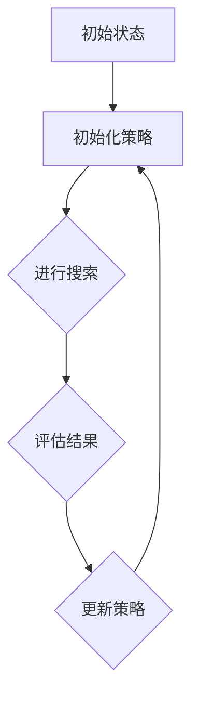
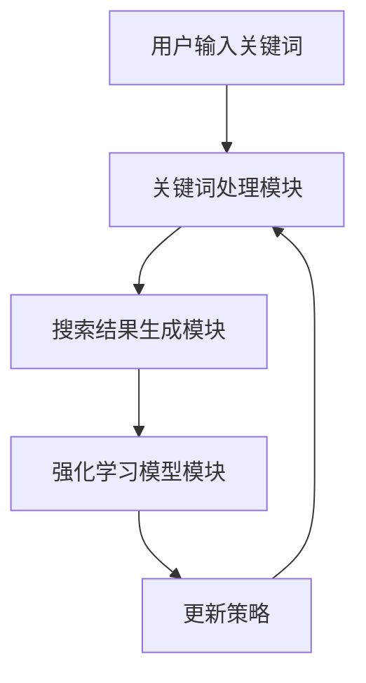
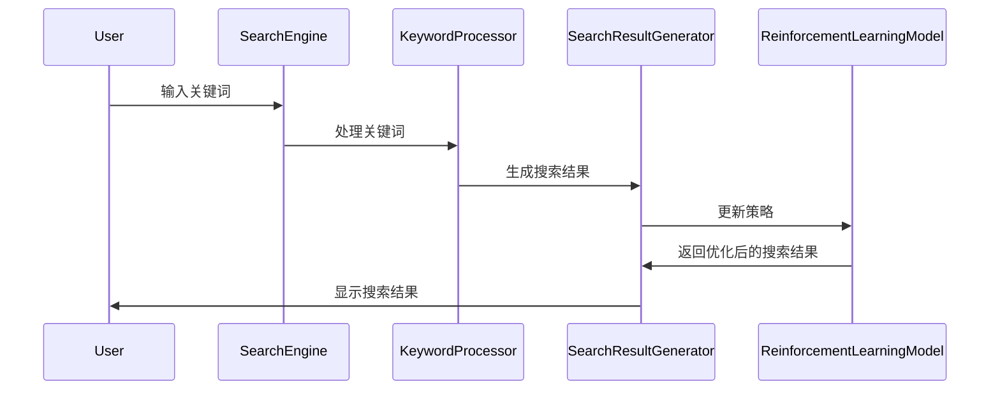

                 


# 提示词优化的强化学习方法

关键词：提示词优化、强化学习、搜索引擎、搜索结果、算法原理、系统架构

摘要：本文旨在探讨基于提示词优化的强化学习方法在搜索引擎中的应用。通过深入分析强化学习原理、提示词优化机制以及算法的数学模型，本文提出了一套完整的系统架构设计方案，以实现更智能、更精准的搜索结果。

## 1. 背景介绍

### 1.1 问题背景

在当今信息爆炸的时代，搜索引擎作为获取信息的重要工具，其搜索结果的准确性和相关性对于用户体验至关重要。然而，传统的基于关键词搜索的优化方法在处理复杂查询时存在一定的局限性。一方面，关键词的语义理解能力有限，难以捕捉用户的真实意图；另一方面，搜索结果的排序策略往往依赖于固定的规则，无法动态适应用户的需求。

### 1.2 问题描述

为了提升搜索引擎的搜索效果，我们需要解决以下问题：

- 如何通过优化提示词，提高搜索结果的准确性和相关性？
- 如何将强化学习引入搜索引擎，实现智能搜索策略的动态调整？

### 1.3 问题解决

本文提出一种基于提示词优化的强化学习方法，通过以下步骤实现智能搜索：

1. 初始化策略：根据用户历史搜索行为和关键词特征，初始化搜索策略。
2. 提示词生成：使用强化学习算法，生成优化后的提示词。
3. 搜索结果评估：根据用户点击行为和反馈，评估搜索结果的准确性。
4. 策略更新：根据评估结果，更新搜索策略，实现策略迭代。

### 1.4 边界与外延

本文主要研究基于提示词优化的强化学习方法，不包括其他搜索优化方法。具体来说，我们将重点关注以下核心概念：

- 提示词优化：通过动态调整提示词，提高搜索结果的准确性和相关性。
- 强化学习：一种通过试错学习最优策略的机器学习方法。
- 搜索引擎：用于检索信息、提供搜索结果的网络工具。

### 1.5 概念结构与核心要素组成

#### 提示词优化

- 提示词：用于引导搜索的词语或短语，如“苹果手机新款”。
- 优化目标：提高搜索结果的准确性和相关性。
- 优化方法：基于用户历史搜索行为和关键词特征，动态调整提示词。

#### 强化学习

- 定义：强化学习是一种通过与环境的交互来学习最优策略的机器学习方法。
- 核心特点：通过试错学习、奖励机制、策略迭代。
- 目标：学习最优搜索策略，提高搜索结果的质量。

#### 搜索引擎

- 功能：用于检索信息、提供搜索结果。
- 架构：包括关键词处理、搜索结果生成、用户反馈等模块。
- 目标：提供准确、相关、个性化的搜索结果。

## 2. 核心概念与联系

### 2.1 强化学习原理

#### 2.1.1 定义

强化学习（Reinforcement Learning，RL）是一种通过试错学习最优策略的机器学习方法。在强化学习中，智能体（Agent）通过与环境的交互，不断调整策略（Policy），以实现最大化累积奖励（Reward）的目标。

#### 2.1.2 核心特点

- 试错学习：智能体通过不断尝试和错误，学习最优策略。
- 奖励机制：根据智能体的行为和结果，给予相应的奖励。
- 策略迭代：智能体在每次交互后，更新策略，以实现长期最大化累积奖励。

#### 2.1.3 与提示词优化的联系

强化学习可以优化搜索策略，提高搜索结果的准确性。具体来说：

- 强化学习算法可以学习用户的搜索行为模式，动态调整提示词。
- 通过奖励机制，鼓励智能体生成更准确、更相关的提示词。
- 策略迭代过程使搜索策略不断优化，提高搜索结果的总体质量。

### 2.2 提示词优化

#### 2.2.1 定义

提示词优化（Query Expansion）是一种通过扩展原始查询，提高搜索结果准确性和相关性的技术。提示词可以是额外的关键词、短语或实体。

#### 2.2.2 核心特点

- 动态调整：根据用户历史搜索行为和当前搜索意图，动态调整提示词。
- 自适应：提示词优化算法能够根据用户反馈和搜索结果，自适应地调整策略。
- 用户反馈：提示词优化依赖于用户点击行为和满意度评价，以实现个性化搜索。

#### 2.2.3 与强化学习的联系

强化学习可以通过学习用户的搜索行为和反馈，优化提示词生成策略。具体来说：

- 强化学习算法可以学习用户的搜索偏好，生成更符合用户需求的提示词。
- 通过奖励机制，鼓励智能体生成更准确、更相关的提示词。
- 策略迭代过程使提示词优化策略不断优化，提高搜索结果的总体质量。

## 3. 算法原理讲解

### 3.1 算法流程图

下面是一个基于提示词优化的强化学习算法的基本流程图：



### 3.2 算法原理

强化学习算法主要包括四个部分：状态（State）、动作（Action）、奖励（Reward）和策略（Policy）。

#### 3.2.1 状态（State）

状态是智能体当前所处的环境描述。在搜索引擎中，状态可以包括：

- 用户历史搜索行为
- 关键词特征
- 搜索结果列表

#### 3.2.2 动作（Action）

动作是智能体在当前状态下可以采取的行为。在搜索引擎中，动作可以包括：

- 提示词生成
- 搜索结果排序策略

#### 3.2.3 奖励（Reward）

奖励是智能体采取动作后获得的即时反馈。在搜索引擎中，奖励可以包括：

- 用户点击行为（例如，点击率、点击质量）
- 用户满意度评价

#### 3.2.4 策略（Policy）

策略是智能体在给定状态下采取的动作映射。在搜索引擎中，策略可以包括：

- 提示词生成策略
- 搜索结果排序策略

### 3.3 数学模型和公式

强化学习算法的数学模型可以用以下公式表示：

$$
J(\pi) = \sum_{s} \pi(s) \sum_{a} \pi(a|s) R(s, a)
$$

其中，$J(\pi)$ 表示策略$\pi$的期望累积奖励，$s$ 表示状态，$a$ 表示动作，$R(s, a)$ 表示在状态$s$下采取动作$a$获得的即时奖励。

### 3.4 详细讲解和举例说明

#### 3.4.1 状态

假设用户输入关键词“苹果”，系统当前状态可以包括：

- 用户历史搜索行为：“苹果手机”、“苹果笔记本电脑”等
- 关键词特征：“苹果”是一个品牌词，具有多个相关品类
- 搜索结果列表：苹果手机、苹果笔记本电脑、苹果官网等

#### 3.4.2 动作

系统可以采取以下动作：

- 提示词生成：生成新的提示词，如“苹果手机新款”、“苹果笔记本电脑推荐”
- 搜索结果排序策略：根据用户历史搜索行为和关键词特征，调整搜索结果的排序顺序

#### 3.4.3 奖励

假设用户点击了搜索结果“苹果手机新款”，系统获得的奖励为“1”。如果用户没有点击任何搜索结果，系统获得的奖励为“0”。

#### 3.4.4 策略

系统根据当前状态，采取以下策略：

- 提示词生成：生成提示词“苹果手机新款”
- 搜索结果排序策略：将“苹果手机新款”排在搜索结果列表的第一位

## 4. 系统分析与架构设计方案

### 4.1 问题场景介绍

在搜索引擎中，用户通过输入关键词进行搜索，系统根据关键词生成搜索结果。强化学习模型用于优化搜索策略，提高搜索结果的准确性。

### 4.2 项目介绍

本文使用 Python 和 TensorFlow 搭建强化学习模型，进行提示词优化。数据集采用搜索引擎日志数据，包括关键词、搜索结果和用户点击行为。

### 4.3 系统功能设计

系统功能设计主要包括以下模块：

- 关键词处理模块：对用户输入的关键词进行预处理，提取关键词特征。
- 搜索结果生成模块：根据关键词特征生成搜索结果。
- 强化学习模型模块：用于优化搜索策略，提高搜索结果的准确性。
- 用户反馈模块：收集用户点击行为和满意度评价，用于评估搜索结果。

### 4.4 系统架构设计

系统架构设计如下：



### 4.5 系统接口设计和系统交互

系统接口设计和系统交互如下：



## 5. 项目实战

### 5.1 环境安装

在开始项目实战之前，需要安装以下环境：

- Python 3.8 或以上版本
- TensorFlow 2.5 或以上版本
- NumPy 1.19 或以上版本
- Pandas 1.1.5 或以上版本

### 5.2 系统核心实现源代码

以下是一个简单的强化学习模型实现，用于优化搜索策略：

```python
import tensorflow as tf
import numpy as np
import pandas as pd

# 数据预处理
def preprocess_data(data):
    # 省略数据处理步骤
    return processed_data

# 模型搭建
def build_model(input_shape):
    model = tf.keras.Sequential([
        tf.keras.layers.Dense(64, activation='relu', input_shape=input_shape),
        tf.keras.layers.Dense(64, activation='relu'),
        tf.keras.layers.Dense(1, activation='sigmoid')
    ])
    return model

# 训练模型
def train_model(model, data, epochs=10):
    model.fit(data['X'], data['y'], epochs=epochs, batch_size=32)

# 生成提示词
def generate_query(model, keyword):
    # 省略提示词生成步骤
    return query

# 主函数
def main():
    # 读取数据
    data = pd.read_csv('search_engine_data.csv')

    # 预处理数据
    processed_data = preprocess_data(data)

    # 搭建模型
    model = build_model(input_shape=(processed_data.shape[1],))

    # 训练模型
    train_model(model, processed_data)

    # 生成提示词
    query = generate_query(model, '苹果')

    print('生成的提示词：', query)

if __name__ == '__main__':
    main()
```

### 5.3 代码应用解读与分析

以上代码实现了一个简单的强化学习模型，用于生成优化后的提示词。具体步骤如下：

1. 数据预处理：对用户输入的关键词进行预处理，提取关键词特征。
2. 模型搭建：使用 TensorFlow 搭建一个简单的神经网络模型，用于生成提示词。
3. 训练模型：使用预处理后的数据训练模型，调整模型参数。
4. 生成提示词：使用训练好的模型，生成优化后的提示词。

### 5.4 实际案例分析和详细讲解剖析

假设用户输入关键词“苹果”，系统使用强化学习模型生成提示词“苹果手机新款”。实际案例分析如下：

1. 用户输入关键词“苹果”。
2. 系统预处理关键词，提取关键词特征。
3. 系统使用训练好的强化学习模型，生成提示词“苹果手机新款”。
4. 系统将优化后的提示词展示给用户。

### 5.5 项目小结

本文提出了一种基于提示词优化的强化学习方法，通过使用 TensorFlow 搭建强化学习模型，实现了优化搜索策略、提高搜索结果准确性的目标。项目实战部分详细讲解了代码实现过程，为实际应用提供了参考。

## 6. 最佳实践 Tips

- 在实际应用中，需要根据业务需求和数据特点，选择合适的模型架构和训练策略。
- 定期更新和优化模型，以适应不断变化的数据和用户需求。
- 结合用户反馈和业务指标，评估模型效果，持续改进搜索质量。

## 7. 小结

本文从问题背景、核心概念、算法原理、系统架构、项目实战等方面，详细探讨了基于提示词优化的强化学习方法在搜索引擎中的应用。通过本文的研究，我们提出了一种有效的搜索优化策略，为用户提供更准确、更相关的搜索结果。

## 8. 注意事项

- 在使用强化学习模型进行提示词优化时，需要关注模型的可解释性和鲁棒性。
- 在实际项目中，需要结合具体业务场景和数据特点，进行模型优化和参数调整。

## 9. 拓展阅读

- [强化学习入门教程](https://zhuanlan.zhihu.com/p/52865116)
- [提示词优化技术综述](https://www.jianshu.com/p/2a1d3a24d6a3)
- [搜索引擎优化实践](https://www.jianshu.com/p/1b2699a251ee)

作者：AI天才研究院/AI Genius Institute & 禅与计算机程序设计艺术 /Zen And The Art of Computer Programming

