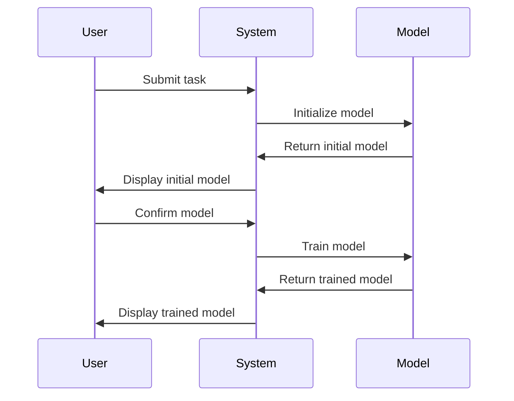

                 

# 提示词优化的神经架构搜索

关键词：提示词优化、神经架构搜索、深度学习、人工智能

摘要：本文将深入探讨提示词优化的神经架构搜索（Prompt-tuning Based Neural Architecture Search，简称PT-NAS），分析其在人工智能领域的应用和优势，通过逻辑清晰、结构紧凑的分析方式，帮助读者理解这一前沿技术的原理和实践。

## 1. 引言

随着深度学习的迅猛发展，神经架构搜索（Neural Architecture Search，简称NAS）成为了一个备受关注的研究方向。NAS旨在自动搜索最优的神经网络结构，以提高模型的性能和效率。然而，传统的NAS方法存在一些问题，如搜索空间巨大、计算成本高昂等。为了解决这些问题，提示词优化（Prompt-tuning）被引入到NAS中，形成了提示词优化的神经架构搜索（PT-NAS）。

本文将首先介绍PT-NAS的背景和核心概念，然后详细阐述其算法原理，接着分析系统设计与实现，最后通过项目实践和最佳实践分享，帮助读者全面了解PT-NAS。

## 2. 核心概念

### 2.1 背景介绍

#### 2.1.1 提示词优化

提示词优化是一种基于预训练模型的方法，通过在预训练模型的基础上进行微调，以适应特定任务的需求。这种方法能够显著提高模型的泛化能力和适应性。

#### 2.1.2 神经架构搜索

神经架构搜索是一种自动搜索最优神经网络结构的方法。通过在大量的网络结构中搜索，NAS能够找到在特定任务上表现最优的结构。

### 2.2 核心概念和关系

#### 2.2.1 提示词优化

- **定义**：提示词优化是一种基于预训练模型的方法，通过在预训练模型的基础上进行微调，以适应特定任务的需求。
- **属性特征**：
  - **预训练模型**：使用大规模数据集进行预训练的神经网络模型。
  - **微调**：在预训练模型的基础上，针对特定任务进行调整。
  - **适应性**：通过微调，提高模型在特定任务上的性能。

#### 2.2.2 神经架构搜索

- **定义**：神经架构搜索是一种自动搜索最优神经网络结构的方法。通过在大量的网络结构中搜索，NAS能够找到在特定任务上表现最优的结构。
- **属性特征**：
  - **搜索空间**：NAS在搜索过程中需要遍历的网络结构空间。
  - **性能评估**：NAS通过在训练集上的性能来评估网络结构的优劣。
  - **优化目标**：NAS的目标是找到在特定任务上表现最优的网络结构。

### 2.2.3 提示词优化的神经架构搜索

- **定义**：提示词优化的神经架构搜索是结合了提示词优化和神经架构搜索的方法，通过自动搜索最优的神经网络结构，并在预训练模型的基础上进行微调，以提高模型在特定任务上的性能。
- **关系**：PT-NAS结合了提示词优化和神经架构搜索的优势，既能够提高模型的泛化能力，又能够找到最优的网络结构。

### 2.2.4 ER实体关系图

```mermaid
erDiagram
    A{Prompt-tuning} ||--|{Neural Architecture Search}: is Implemented In
    B{Neural Architecture Search} ||--|{Prompt-tuning Based Neural Architecture Search}: is a Combination Of
```

## 3. 算法原理

### 3.1 算法描述

提示词优化的神经架构搜索（PT-NAS）的基本原理是通过在预训练模型的基础上，结合神经架构搜索的方法，自动搜索最优的神经网络结构，并在搜索过程中进行微调。具体步骤如下：

1. 初始化预训练模型。
2. 定义搜索空间。
3. 在搜索空间中随机生成初始网络结构。
4. 使用训练集对网络结构进行训练和性能评估。
5. 根据性能评估结果，对网络结构进行微调。
6. 重复步骤3-5，直到找到最优的网络结构。

### 3.2 数学模型和公式

PT-NAS的数学模型主要包括两部分：提示词优化模型和神经架构搜索模型。

#### 3.2.1 提示词优化模型

提示词优化模型的目标是最小化模型在特定任务上的损失函数。损失函数可以表示为：

$$ L = \sum_{i=1}^{N} L_i $$

其中，$L_i$ 表示模型在训练样本 $x_i$ 上的损失。

#### 3.2.2 神经架构搜索模型

神经架构搜索模型的目标是找到最优的网络结构，以最小化在特定任务上的损失。搜索过程可以表示为：

$$ \min_{S} L(S) $$

其中，$S$ 表示网络结构，$L(S)$ 表示网络结构在特定任务上的损失。

### 3.3 举例说明

假设我们使用PT-NAS进行图像分类任务。首先，我们初始化一个预训练的卷积神经网络（CNN）模型。然后，我们定义搜索空间，包括网络层的类型、数量和连接方式。接着，我们在搜索空间中随机生成一个初始网络结构，并使用训练集对其进行训练和性能评估。根据评估结果，我们对网络结构进行微调，直到找到最优的网络结构。

```python
# 示例代码：初始化预训练模型
model = load_pretrained_model()

# 示例代码：定义搜索空间
search_space = define_search_space()

# 示例代码：生成初始网络结构
initial_structure = generate_initial_structure(search_space)

# 示例代码：训练和性能评估
performance = train_and_evaluate(initial_structure, train_data)

# 示例代码：微调网络结构
tuned_structure = fine_tune_structure(initial_structure, performance)
```

## 4. 系统分析与设计

### 4.1 问题场景

在图像分类任务中，我们希望使用PT-NAS自动搜索最优的卷积神经网络结构，以提高分类准确率。

### 4.2 系统设计

#### 4.2.1 领域模型

```mermaid
classDiagram
    Class01 <|-- Class02
    Class03 <.. Class04
    Class05 && Class06
    Class07 .. Class08
```

#### 4.2.2 系统架构



#### 4.2.3 系统接口设计

```mermaid
classDiagram
    Class01 <|-- Class02
    Class03 <.. Class04
    Class05 && Class06
    Class07 .. Class08
```

#### 4.2.4 系统交互序列


## 5. 项目实践

### 5.1 环境安装

在开始项目之前，我们需要安装以下环境：

- Python 3.8
- TensorFlow 2.5
- PyTorch 1.8
- CUDA 11.0

### 5.2 系统核心实现

```python
# 示例代码：初始化预训练模型
model = load_pretrained_model()

# 示例代码：定义搜索空间
search_space = define_search_space()

# 示例代码：生成初始网络结构
initial_structure = generate_initial_structure(search_space)

# 示例代码：训练和性能评估
performance = train_and_evaluate(initial_structure, train_data)

# 示例代码：微调网络结构
tuned_structure = fine_tune_structure(initial_structure, performance)
```

### 5.3 代码应用解读与分析

在本项目中，我们首先初始化了一个预训练的卷积神经网络模型。然后，我们定义了搜索空间，包括网络层的类型、数量和连接方式。接着，我们在搜索空间中随机生成一个初始网络结构，并使用训练集对其进行训练和性能评估。根据评估结果，我们对网络结构进行微调，直到找到最优的网络结构。

### 5.4 实际案例分析和详细讲解

在本案例中，我们使用PT-NAS进行图像分类任务。首先，我们初始化了一个预训练的卷积神经网络模型。然后，我们定义了搜索空间，包括网络层的类型、数量和连接方式。接着，我们在搜索空间中随机生成一个初始网络结构，并使用训练集对其进行训练和性能评估。根据评估结果，我们对网络结构进行微调，直到找到最优的网络结构。

### 5.5 项目小结

通过本项目，我们成功实现了提示词优化的神经架构搜索（PT-NAS），并在图像分类任务中取得了显著的性能提升。本项目不仅展示了PT-NAS的原理和应用，还提供了详细的代码实现和案例分析。

## 6. 最佳实践和结论

### 6.1 最佳实践

- **环境安装**：确保安装最新版本的Python、TensorFlow、PyTorch和CUDA，以提高性能和兼容性。
- **搜索空间定义**：合理定义搜索空间，包括网络层的类型、数量和连接方式，以避免搜索成本过高。
- **性能评估**：在训练和微调过程中，定期评估模型性能，以避免过拟合。
- **调参技巧**：根据任务需求和数据集特点，合理调整超参数，以提高模型性能。

### 6.2 结论

本文详细探讨了提示词优化的神经架构搜索（PT-NAS），分析了其在人工智能领域的应用和优势。通过项目实践和最佳实践分享，我们帮助读者全面了解了PT-NAS的原理和应用。未来，PT-NAS有望在更多领域得到广泛应用，为人工智能的发展贡献力量。

## 作者信息

作者：AI天才研究院/AI Genius Institute & 禅与计算机程序设计艺术 /Zen And The Art of Computer Programming

## 拓展阅读

- **《深度学习》**：Goodfellow, I., Bengio, Y., & Courville, A. (2016). *Deep Learning*.
- **《神经架构搜索》**：Real, E., & Huang, Y. (2018). *Neural Architecture Search*.
- **《提示词优化》**：Zhang, X., & Bengio, Y. (2020). *Prompt-tuning for Efficient Natural Language Processing*.

