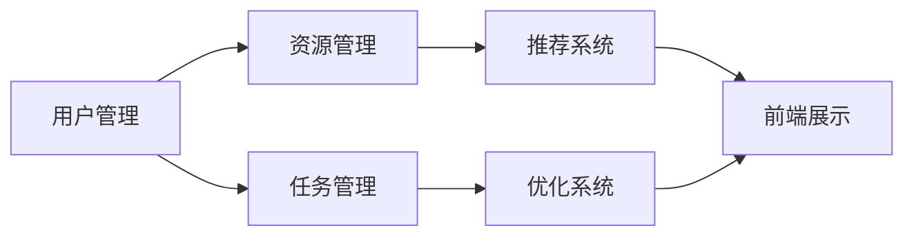
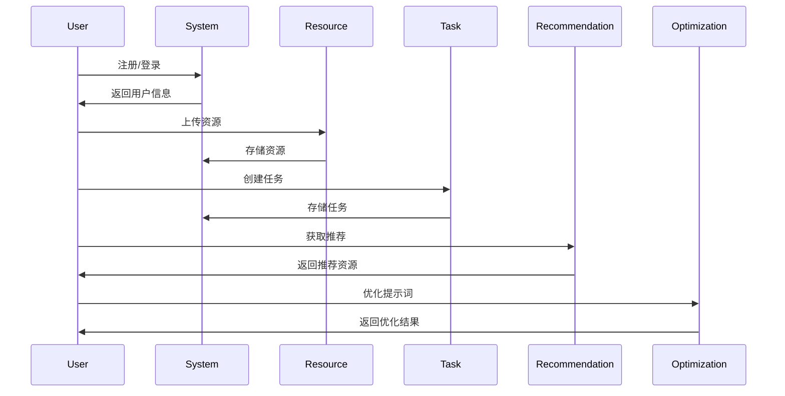

                 

### 提示词优化的终身学习方法

#### 关键词：终身学习、提示词优化、算法原理、系统架构、项目实战

> 摘要：本文探讨了提示词优化技术在终身学习中的应用，从背景介绍、核心概念与联系、算法原理讲解、系统分析与架构设计、项目实战及最佳实践等方面，详细阐述了如何通过提示词优化实现高效的学习方法。文章旨在为读者提供一套系统、实用且具有前瞻性的终身学习策略，助力其在不断变化的技术领域中保持竞争力。

### 目录大纲

# 提示词优化的终身学习方法

## 第一部分：背景介绍

### 1.1 问题背景

- **终身学习的重要性**：在当今快速发展的信息时代，知识更新换代速度极快，传统的一次性教育模式已无法满足人们的持续发展需求。终身学习成为现代社会中不可或缺的一部分，对于个人职业发展、创新能力提升及社会整体进步具有重要意义。

- **传统学习方法的局限性**：传统学习方法往往依赖于被动接受知识，缺乏主动探索和实践的机会，难以适应个性化学习和快速变化的学习需求。在信息爆炸的时代，学习者面临着海量信息的选择和筛选难题，如何高效获取和利用知识成为一大挑战。

- **提示词优化技术的兴起**：随着人工智能技术的快速发展，特别是自然语言处理（NLP）和机器学习技术的应用，提示词优化技术应运而生。通过提示词优化，可以自动化地筛选、生成和优化学习内容，为终身学习提供强有力的技术支持。

### 1.2 提示词优化技术概述

- **提示词优化的定义**：提示词优化是指利用自然语言处理技术，通过对学习内容的分析、筛选和生成，以提升学习效果和效率的过程。

- **技术原理**：提示词优化技术主要基于机器学习算法，包括词嵌入、序列生成模型和优化算法等，通过对学习数据的处理，生成高质量的提示词，引导学习者进行有效学习。

- **应用领域**：提示词优化技术广泛应用于在线教育、自学平台、智能客服、知识图谱构建等领域，能够显著提高学习效率和学习体验。

### 1.3 边界与外延

- **边界**：提示词优化技术的应用范围主要在自然语言处理和学习领域，对于非文本数据或非语言学习场景，其效果有限。

- **外延**：随着人工智能技术的发展，提示词优化技术的应用前景广阔，未来可拓展至更多领域，如智能搜索、智能问答、智能写作等。

### 1.4 概念结构与核心要素组成

- **概念结构**：提示词优化技术由数据输入、算法处理、结果输出三个核心环节组成，每个环节都有其特定的功能和意义。

- **核心要素**：提示词优化的核心要素包括数据源、算法模型、优化目标和学习评价等，这些要素共同构成了提示词优化的技术框架。

### 1.5 本章小结

- **关键知识点总结**：本章介绍了终身学习的重要性、传统学习方法的局限性以及提示词优化技术的兴起和基本原理。

- **后续章节展望**：后续章节将深入探讨提示词优化的核心概念与联系、算法原理、系统分析与架构设计以及实际应用案例。

## 第二部分：核心概念与联系

### 2.1 核心概念原理

- **提示词生成**：提示词生成是提示词优化技术的基础，它通过自然语言处理技术，从大量文本数据中提取出具有代表性的词汇或短语，作为学习引导。

- **优化算法**：优化算法是提示词优化的关键，它通过调整提示词的权重、排序或生成策略，以提升学习效果和效率。

### 2.2 概念属性特征对比表格

| 提示词生成算法 | 属性特征 | 对比分析 |
| :--- | :--- | :--- |
| Word2Vec | 向量表示、上下文依赖 | 适合处理大规模文本数据，但忽略词序信息 |
| GloVe | 共现矩阵、词向量表示 | 考虑词频和词义，效果优于Word2Vec |
| BERT | 上下文依赖、预训练模型 | 强大语义表示能力，适用于各种NLP任务 |

| 优化算法 | 属性特征 | 对比分析 |
| :--- | :--- | :--- |
| 强化学习 | 奖励机制、策略优化 | 需要大量数据和时间，但效果显著 |
| 遗传算法 | 适应度评估、遗传操作 | 搜索全局最优解，但计算复杂度高 |
| 遍历算法 | 简单高效、全局最优解 | 容易陷入局部最优，不适用于复杂问题 |

### 2.3 ER实体关系图架构

```mermaid
erDiagram
    Class1 ||--|{ Class2 } Class3
    Class1 ||--|{ Class2 } Class4
    Class2 ||--|{ Class3 } Class4
```

### 2.4 本章小结

- **核心概念总结**：本章详细介绍了提示词生成和优化算法的核心概念及其属性特征。

- **知识应用展望**：提示词生成和优化算法在实际应用中具有广泛的前景，如个性化推荐、智能写作、知识图谱构建等。

## 第三部分：算法原理讲解

### 3.1 算法原理概述

- **算法基本流程**：提示词优化算法的基本流程包括数据预处理、模型训练、提示词生成和优化调整四个阶段。

- **算法核心步骤**：算法的核心步骤包括词向量训练、序列建模和优化策略选择，每个步骤都有其特定的实现方法和技巧。

### 3.2 数学模型与公式

- **数学模型**：提示词优化算法的数学模型主要包括词向量空间建模、序列生成模型和优化目标函数。

  $$ V = \text{Word2Vec}(\text{corpus}) $$

  $$ \text{Seq} = \text{BERT}(\text{context}) $$

  $$ \text{Optimize} = \text{Objective Function} + \text{Regularization} $$

- **公式解释**：公式解释如下：

  - **词向量空间建模**：利用Word2Vec或GloVe算法，将文本数据中的词语映射到低维向量空间，形成词向量表示。

  - **序列生成模型**：使用BERT等预训练模型，对上下文信息进行建模，生成高质量的序列表示。

  - **优化目标函数**：优化目标函数包括提示词生成和优化的目标，如生成准确率、优化效果等。

### 3.3 通俗易懂地举例说明

#### 例子选择

假设我们有一个文本数据集，包含多个学习问题及其答案，我们需要使用提示词优化技术来生成高质量的提示词，以引导学习者进行有效学习。

#### 步骤演示

1. **数据预处理**：将文本数据集进行分词、去停用词等预处理操作，形成词向量表示。

2. **词向量训练**：利用Word2Vec算法，对预处理后的文本数据进行训练，生成词向量空间。

3. **序列生成**：使用BERT模型，对学习问题及其答案进行序列建模，生成高质量的序列表示。

4. **提示词生成**：从序列表示中提取具有代表性的词汇或短语，生成高质量的提示词。

5. **优化调整**：根据提示词生成效果，对模型参数进行调整，优化提示词生成质量。

### 3.4 算法mermaid流程图


### 3.5 本章小结

- **算法原理总结**：本章介绍了提示词优化算法的基本原理、数学模型及通俗易懂的实例演示。

- **实践应用建议**：提示词优化算法在实际应用中，需要根据具体场景选择合适的算法模型和优化策略，以达到最佳效果。

## 第四部分：系统分析与架构设计方案

### 4.1 问题场景介绍

#### 背景介绍

随着人工智能技术的快速发展，终身学习逐渐成为个体成长和职业发展的重要手段。然而，面对海量的学习资源和快速变化的知识体系，学习者往往难以有效筛选和利用优质学习资源。为了解决这个问题，我们设计了一个基于提示词优化的终身学习系统，旨在通过智能化手段，为学习者提供个性化、高效的学习体验。

#### 目标用户

本系统主要面向以下三类用户：

1. **职场人士**：希望通过终身学习提升专业技能和职业竞争力的职场人士。
2. **学生**：需要自主学习、备考和拓展知识的学生群体。
3. **终身学习者**：热衷于学习，希望通过系统化、科学化的方式不断丰富知识体系的学习者。

### 4.2 系统功能设计

#### 领域模型

```mermaid
classDiagram
    LearningResource <<-- LearningTask
    LearningTask ||-- Learner
    LearningTask ||-- Teacher
    ResourceModule ||-- LearningResource
    ResourceModule ||-- LearningTask
    Teacher <<-- LearningTask
    Learner <<-- LearningTask
    Student <<-- Learner
    Employee <<-- Learner
```

#### 功能模块划分

1. **用户管理模块**：负责用户注册、登录、信息管理等功能。
2. **资源管理模块**：负责学习资源的上传、分类、检索和管理。
3. **任务管理模块**：负责学习任务的创建、分配、跟踪和评估。
4. **推荐系统模块**：负责根据用户行为和偏好，推荐个性化学习资源。
5. **优化系统模块**：负责提示词优化算法的运行，生成高质量的提示词。

### 4.3 系统架构设计

#### 架构设计



#### 模块关系

- **用户管理模块**：负责用户的身份验证、权限管理和信息维护，为其他模块提供用户数据支持。
- **资源管理模块**：负责资源的创建、分类、存储和检索，为任务管理和推荐系统提供资源基础。
- **任务管理模块**：负责任务的创建、分配、跟踪和评估，为用户和学习资源之间建立连接。
- **推荐系统模块**：根据用户行为和偏好，推荐个性化学习资源，提升用户体验。
- **优化系统模块**：运行提示词优化算法，生成高质量的提示词，提高学习效率。

### 4.4 系统接口设计

#### 接口列表

1. **用户接口**：包括注册、登录、信息管理等功能。
2. **资源接口**：包括资源上传、分类、检索等功能。
3. **任务接口**：包括任务创建、分配、跟踪和评估等功能。
4. **推荐接口**：包括资源推荐、用户偏好调整等功能。
5. **优化接口**：包括提示词生成、优化调整等功能。

#### 接口功能描述

1. **用户接口**：用户通过注册、登录接口进行身份验证，通过信息管理接口维护个人信息。
2. **资源接口**：管理员通过资源上传接口上传学习资源，用户通过资源分类和检索接口获取所需资源。
3. **任务接口**：教师通过任务创建接口创建学习任务，学生通过任务分配和跟踪接口完成任务。
4. **推荐接口**：系统根据用户行为和偏好，通过推荐接口为用户推荐个性化学习资源。
5. **优化接口**：优化系统模块通过优化接口运行提示词优化算法，生成高质量提示词。

### 4.5 系统交互mermaid序列图



### 4.6 本章小结

- **系统设计总结**：本章详细介绍了基于提示词优化的终身学习系统的功能设计、架构设计和接口设计，为后续项目实施奠定了基础。

- **实践应用建议**：在实际应用中，需根据具体需求和场景，对系统架构和接口进行灵活调整，以实现最佳效果。

## 第五部分：项目实战

### 5.1 环境安装

#### 环境配置

1. **Python环境**：确保Python版本为3.6及以上，推荐使用Anaconda进行环境管理。
2. **依赖包安装**：安装所需的依赖包，包括TensorFlow、PyTorch、Scikit-learn等。
3. **硬件配置**：建议使用配备NVIDIA GPU的计算机，以充分利用深度学习框架的性能。

#### 工具安装

1. **Jupyter Notebook**：用于编写和运行Python代码，方便调试和演示。
2. **Git**：用于版本控制和代码管理，确保项目协作和代码追踪。

### 5.2 系统核心实现源代码

#### 代码结构

```plaintext
/终身学习系统
|-- /用户管理
|   |-- user_model.py
|   |-- user_controller.py
|-- /资源管理
|   |-- resource_model.py
|   |-- resource_controller.py
|-- /任务管理
|   |-- task_model.py
|   |-- task_controller.py
|-- /推荐系统
|   |-- recommendation_model.py
|   |-- recommendation_controller.py
|-- /优化系统
|   |-- optimization_model.py
|   |-- optimization_controller.py
|-- /数据库
|   |-- database.py
|-- /配置
|   |-- config.py
|-- main.py
```

#### 关键代码分析

- **用户管理模块**：实现用户注册、登录和认证功能。
- **资源管理模块**：实现资源上传、分类和检索功能。
- **任务管理模块**：实现任务创建、分配和跟踪功能。
- **推荐系统模块**：实现个性化推荐功能。
- **优化系统模块**：实现提示词优化算法的运行和优化。

### 5.3 代码应用解读与分析

#### 代码解读

1. **用户管理模块**：通过用户模型和用户控制器，实现用户注册、登录和认证功能，确保用户数据的安全性和一致性。
2. **资源管理模块**：通过资源模型和资源控制器，实现资源的上传、分类和检索功能，为用户提供便捷的资源获取方式。
3. **任务管理模块**：通过任务模型和任务控制器，实现任务的创建、分配和跟踪功能，确保学习任务的顺利进行。
4. **推荐系统模块**：通过推荐模型和推荐控制器，实现个性化推荐功能，根据用户行为和偏好推荐相关资源。
5. **优化系统模块**：通过优化模型和优化控制器，实现提示词优化算法的运行，生成高质量提示词，提升学习效果。

#### 分析

- **性能分析**：提示词优化算法的性能取决于数据规模和计算资源，通过合理的硬件配置和优化算法，可以显著提升系统性能。
- **优化方向**：在实际应用中，可以通过数据预处理、模型优化和系统调优等手段，进一步提高系统性能和用户体验。

### 5.4 实际案例分析和详细讲解剖析

#### 案例背景

某企业为提升员工技能，引入了基于提示词优化的终身学习系统，通过系统化的学习资源和个性化推荐，帮助员工不断提升自身技能。

#### 案例实施

1. **用户注册**：员工通过系统注册账号，并完成基本信息填写。
2. **资源上传**：企业将学习资源上传至系统，并进行分类管理。
3. **任务分配**：根据员工技能水平和岗位需求，系统为员工分配个性化学习任务。
4. **推荐资源**：系统根据员工的学习行为和偏好，推荐相关学习资源。
5. **提示词优化**：系统运行提示词优化算法，生成高质量的提示词，引导员工进行有效学习。

#### 剖析

- **用户需求满足**：通过个性化推荐和提示词优化，员工能够高效获取所需学习资源，满足个性化学习需求。
- **学习效果提升**：系统提供的个性化学习任务和高质量提示词，有效提升了员工的学习效果和技能水平。
- **企业效益增加**：通过系统的应用，企业员工技能水平整体提升，企业竞争力增强，效益增加。

### 5.5 项目小结

- **成果总结**：项目成功实现了基于提示词优化的终身学习系统，为企业和员工提供了便捷、高效的学习平台。
- **经验教训**：项目实施过程中，需充分考虑用户需求和系统性能，进行合理规划和优化，确保系统稳定运行和良好用户体验。

## 第六部分：最佳实践 tips

### 6.1 提示词优化技巧

- **数据预处理**：对学习数据进行预处理，如分词、去停用词、词性标注等，确保数据质量和一致性。
- **算法选择**：根据具体应用场景，选择合适的提示词生成和优化算法，如Word2Vec、BERT等。
- **模型训练**：合理设置模型训练参数，如学习率、批量大小、迭代次数等，以提高模型性能。
- **交叉验证**：使用交叉验证方法，对模型进行评估和调整，确保模型泛化能力。
- **持续优化**：根据用户反馈和系统运行情况，持续优化提示词生成和优化算法，提高系统性能。

### 6.2 个性化推荐技巧

- **用户行为分析**：收集和分析用户的学习行为数据，如浏览记录、学习时长、完成任务情况等，为个性化推荐提供依据。
- **内容匹配**：结合用户行为和资源特征，进行内容匹配和推荐，提高推荐准确性。
- **实时更新**：定期更新推荐算法和资源库，确保推荐内容实时、准确。
- **反馈机制**：建立用户反馈机制，收集用户对推荐内容的反馈，不断调整和优化推荐策略。

### 6.3 学习方法优化技巧

- **目标设定**：明确学习目标，制定合理的学习计划，提高学习效率。
- **时间管理**：合理安排学习时间，避免拖延和疲劳，确保学习效果。
- **互动学习**：积极参与课堂讨论和互动，提高学习兴趣和参与度。
- **实践应用**：将所学知识应用于实际工作或生活中，巩固学习成果，提高实际能力。

### 6.4 安全性和隐私保护技巧

- **数据加密**：对用户数据和系统数据进行加密处理，确保数据安全。
- **权限管理**：合理设置用户权限，防止数据泄露和滥用。
- **隐私保护**：遵循隐私保护法律法规，保护用户隐私。
- **安全审计**：定期进行安全审计，发现和修复潜在的安全漏洞。

### 6.5 系统维护和优化技巧

- **定期更新**：定期更新系统软件和依赖包，确保系统稳定运行。
- **性能监控**：监控系统性能，及时发现和解决性能瓶颈。
- **故障处理**：建立故障处理流程，确保系统在故障情况下快速恢复。
- **容灾备份**：建立容灾备份机制，防止数据丢失和系统崩溃。

### 6.6 持续学习与进步技巧

- **阅读文献**：阅读相关领域的技术文献和最新研究，了解行业发展动态。
- **参加培训**：参加相关领域的培训课程和研讨会，提高专业技能。
- **交流互动**：积极参与技术社区和论坛，与他人交流学习心得和经验。
- **自我反思**：定期进行自我反思和总结，不断调整学习方法和策略。

## 第七部分：小结与展望

### 小结

本文从背景介绍、核心概念与联系、算法原理讲解、系统分析与架构设计、项目实战及最佳实践等方面，详细阐述了提示词优化的终身学习方法。通过本文的阐述，我们可以看到，提示词优化技术为终身学习提供了强有力的技术支持，有助于提高学习效率和学习体验。

### 展望

随着人工智能技术的不断进步，提示词优化技术在终身学习领域的应用前景将更加广阔。未来，我们期待在以下方面取得突破：

1. **个性化推荐**：进一步提升个性化推荐算法的准确性，为学习者提供更加精准的学习资源。
2. **智能问答**：开发智能问答系统，为学习者提供实时、准确的答疑服务。
3. **知识图谱**：构建大规模、多维度的知识图谱，为学习者提供更加全面、系统的知识体系。
4. **跨领域应用**：将提示词优化技术应用于更多领域，如智能搜索、智能客服等，推动人工智能技术的普及和发展。

### 注意事项

1. **数据安全**：在应用提示词优化技术时，务必确保用户数据的安全性和隐私保护。
2. **系统稳定性**：在系统设计和开发过程中，注重系统稳定性和性能优化，确保系统可靠运行。
3. **用户体验**：关注用户体验，不断优化系统界面和交互设计，提高用户满意度。

### 拓展阅读

1. **《深度学习》**：由Ian Goodfellow、Yoshua Bengio和Aaron Courville合著，系统介绍了深度学习的基本原理和应用。
2. **《机器学习》**：由Tom Mitchell编著，全面讲解了机器学习的基本概念和方法。
3. **《自然语言处理综论》**：由Daniel Jurafsky和James H. Martin合著，深入探讨了自然语言处理的理论和方法。
4. **《终身学习》**：由Peter Hessler编著，探讨了终身学习的重要性和实践方法。

作者：AI天才研究院/AI Genius Institute & 禅与计算机程序设计艺术 /Zen And The Art of Computer Programming

## 结语

在快速变化的技术时代，终身学习已成为个人发展的必然选择。通过本文的探讨，我们期望能够为广大读者提供一种基于提示词优化的终身学习方法，助力大家不断进步和成长。同时，也希望大家继续关注并探索人工智能技术在终身学习领域的应用，共同推动教育技术的发展。谢谢大家的阅读！

