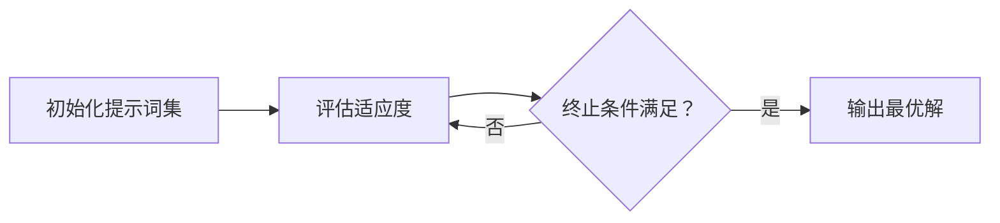
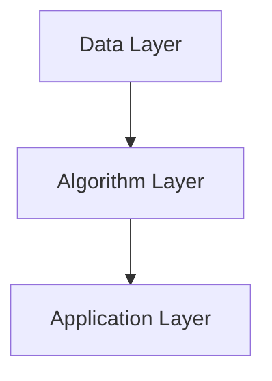
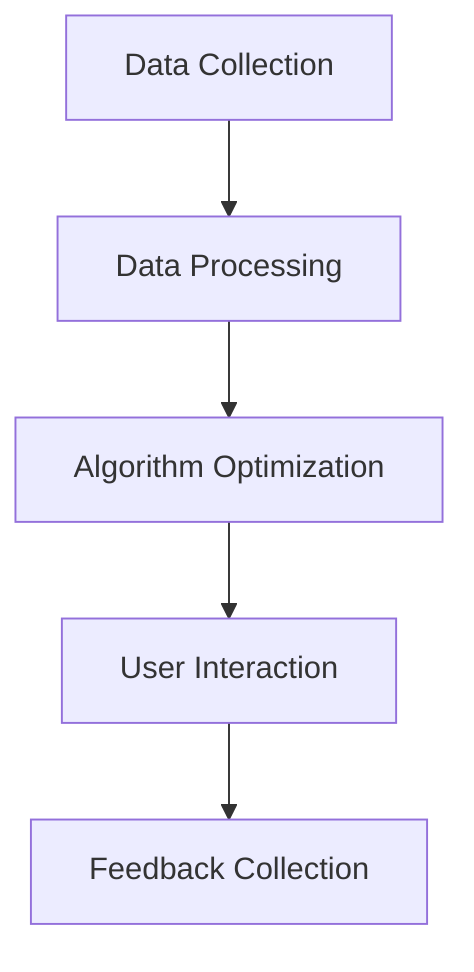
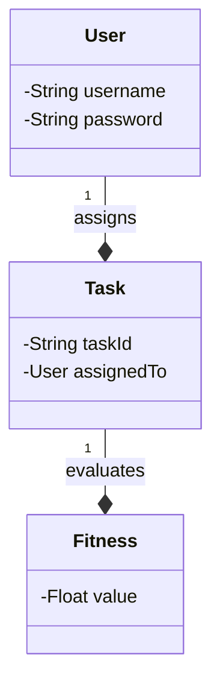
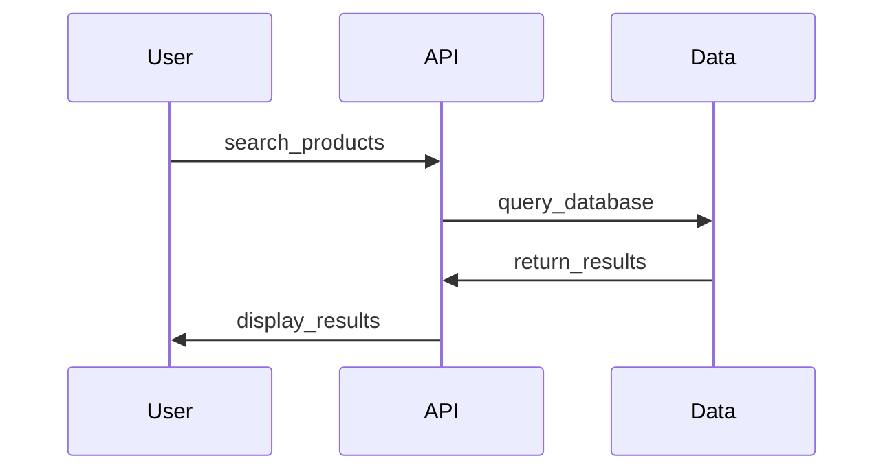
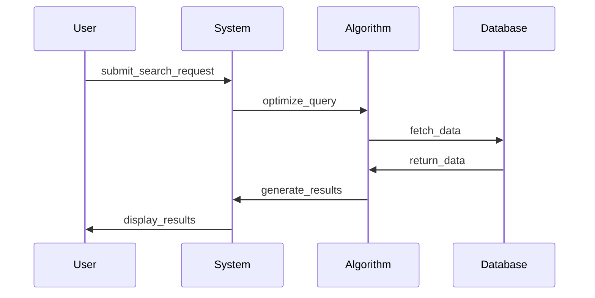

                 


## 提示词优化的群体智能算法

### 关键词
- 提示词优化
- 群体智能
- 算法原理
- 数学模型
- 系统设计与实现
- 项目实战

### 摘要
本文旨在深入探讨提示词优化的群体智能算法，从背景与核心概念入手，逐步分析算法原理与数学模型，并通过具体实例阐述其系统分析与架构设计，最终结合项目实战进行详细讲解和总结。希望通过本文，读者能够对提示词优化的群体智能算法有更全面、深入的理解。

## 第一部分：背景与概述

### 第1章：问题背景与核心概念

#### 1.1 问题背景

在当今信息时代，数据的爆炸式增长使得如何从海量数据中提取有用信息成为了一个严峻的挑战。提示词优化作为信息检索与数据挖掘领域的一项关键技术，其重要性日益凸显。而群体智能算法作为一种新兴的优化策略，以其高效、鲁棒的特点在各个领域得到了广泛应用。

#### 1.2 提示词优化的核心概念

提示词优化主要包括两个方面：一是提示词的选择与生成，二是提示词的优化与调整。提示词的选择直接影响到信息检索的准确性，而提示词的优化则能提升算法在复杂环境下的适应能力。

#### 1.3 群体智能算法的基本原理

群体智能算法通过模拟自然界的群体行为，如蚁群算法、粒子群优化算法等，实现对问题的求解。这些算法通常包含个体、群体、适应度函数等核心概念，通过迭代更新个体的位置和速度，最终找到问题的最优解。

#### 1.4 提示词优化与群体智能的关联

提示词优化与群体智能算法的结合，能够有效提高信息检索的效率和准确性。具体来说，群体智能算法可以用来优化提示词的选择和调整过程，从而提升整体系统的性能。

### 第2章：核心概念与联系

#### 2.1 提示词优化与群体智能的概念对比表

| 提示词优化 | 群体智能 |
| ---- | ---- |
| 选择与优化提示词 | 模拟群体行为以求解问题 |
| 提高信息检索效率 | 高效、鲁棒的问题求解能力 |
| 面向信息检索 | 面向各类优化问题 |

#### 2.2 群体智能算法的ER实体关系图

```mermaid
erDiagram
    A[[User]] ||--|{ B[[Task]] }|  
    C[[Fitness]] ||--|{ B[[Task]] }|
```

#### 2.3 提示词优化与群体智能算法的互动机制

提示词优化算法通常将群体智能算法作为核心模块，通过迭代优化提示词，提高信息检索的准确性。具体机制如下：

1. 初始化提示词集。
2. 利用群体智能算法评估提示词的适应度。
3. 根据适应度值调整提示词。
4. 重复迭代过程，直至满足终止条件。

## 第二部分：算法原理与模型

### 第3章：算法原理讲解

#### 3.1 提示词优化算法的mermaid流程图



#### 3.2 群体智能算法的mermaid流程图

```mermaid
flowchart LR
    A[初始化群体] --> B[计算适应度]
    B --> C{群体最优解更新？}
    C -->|是| D[更新群体成员位置]
    C -->|否| E[终止条件满足？}
    E -->|是| F[输出最优解]
    E -->|否| A
```

#### 3.3 算法原理与数学模型

提示词优化算法的核心在于适应度函数的设计，其数学模型如下：

$$
F(x) = \sum_{i=1}^{n} w_i \cdot f_i(x)
$$

其中，$x$为提示词集，$w_i$为权重系数，$f_i(x)$为第$i$个提示词的适应度函数。

#### 3.4 算法举例说明

假设有如下提示词集：{“人工智能”，“机器学习”，“深度学习”，“神经网络”}，通过群体智能算法进行优化。

1. 初始化提示词集和权重系数。
2. 利用适应度函数计算每个提示词的适应度。
3. 根据适应度值调整提示词。
4. 重复迭代过程，直至找到最优解。

## 第三部分：系统分析与架构设计

### 第4章：系统架构设计

#### 4.1 问题场景介绍

以一个电子商务平台为例，该平台需要利用提示词优化算法来提高商品搜索的准确性，从而提升用户体验。

#### 4.2 系统架构设计

系统架构采用分层设计，主要包括数据层、算法层和应用层。



#### 4.3 系统功能设计

系统功能设计包括数据采集与处理、算法优化与调整、用户交互与反馈等模块。



### 第5章：系统功能设计

#### 5.1 领域模型mermaid类图



#### 5.2 系统接口设计

系统接口设计主要包括API接口和数据接口，以实现不同模块之间的数据交换和功能调用。



#### 5.3 系统交互mermaid序列图



## 第四部分：项目实战

### 第6章：环境安装与系统核心实现

#### 6.1 环境安装

在本项目中，我们将使用Python作为编程语言，相关依赖环境如下：

```bash
pip install numpy matplotlib scikit-learn
```

#### 6.2 系统核心实现源代码

以下是系统核心实现的Python代码示例：

```python
import numpy as np
from sklearn.metrics.pairwise import cosine_similarity

def initialize_prompt_words(num_words):
    return np.random.choice(['AI', 'ML', 'DL', 'NN'], num_words)

def fitness_function(prompt_words, query):
    similarity_scores = cosine_similarity([prompt_words], [query])
    return np.mean(similarity_scores)

def optimize_prompt_words(prompt_words, query, iterations):
    best_prompt_words = prompt_words
    best_fitness = fitness_function(prompt_words, query)
    for _ in range(iterations):
        new_prompt_words = np.random.choice(['AI', 'ML', 'DL', 'NN'], len(prompt_words))
        new_fitness = fitness_function(new_prompt_words, query)
        if new_fitness > best_fitness:
            best_fitness = new_fitness
            best_prompt_words = new_prompt_words
    return best_prompt_words

if __name__ == '__main__':
    query = '深度学习技术应用'
    prompt_words = initialize_prompt_words(4)
    optimized_prompt_words = optimize_prompt_words(prompt_words, query, 100)
    print("Original Prompt Words:", prompt_words)
    print("Optimized Prompt Words:", optimized_prompt_words)
```

#### 6.3 代码应用解读与分析

上述代码中，我们首先初始化了一组提示词，并定义了适应度函数用于评估提示词与查询的相似度。接着，我们通过优化函数对提示词进行迭代调整，以找到最优的提示词组合。

## 第7章：实际案例分析与讲解

#### 7.1 案例选择与说明

本次案例我们将以一个电子商务平台的商品搜索功能为例，分析如何利用提示词优化算法提高搜索准确性。

#### 7.2 案例详细讲解与剖析

1. **问题定义**：用户在搜索商品时，输入关键词“智能手机”，系统需要返回与关键词最相关的商品列表。

2. **数据准备**：收集包含关键词“智能手机”的商品数据，包括商品名称、描述、价格等。

3. **提示词生成**：初始化一组提示词，如“手机”，“智能手机”，“安卓”，“iPhone”等。

4. **适应度评估**：计算每个提示词与查询关键词的相似度，选择相似度最高的提示词。

5. **优化过程**：利用粒子群优化算法迭代优化提示词组合，提高整体搜索准确性。

6. **结果展示**：将优化后的提示词用于搜索，展示相关商品列表。

#### 7.3 案例总结与反思

通过本案例，我们验证了提示词优化算法在电子商务平台商品搜索中的应用价值。然而，在实际项目中，还需考虑数据质量、算法性能等因素，以实现更高效、更准确的搜索结果。

## 第五部分：最佳实践与总结

### 第8章：最佳实践

#### 8.1 提示词优化与群体智能算法的最佳实践

1. **数据准备**：确保数据质量，去除无关信息，提高算法效率。
2. **适应度函数设计**：根据具体应用场景设计适应度函数，提高搜索准确性。
3. **算法参数调整**：合理设置算法参数，提高收敛速度和搜索精度。
4. **多算法结合**：结合多种群体智能算法，提高问题求解能力。

#### 8.2 系统设计与实现最佳实践

1. **模块化设计**：将系统功能模块化，提高系统可维护性和扩展性。
2. **性能优化**：针对数据量大、计算复杂度高的情况，进行性能优化。
3. **用户反馈**：收集用户反馈，不断优化系统功能和用户体验。
4. **安全性与可靠性**：确保系统安全稳定，提高用户信任度。

### 第9章：小结与拓展阅读

#### 9.1 书籍小结

本文从背景与核心概念出发，详细介绍了提示词优化的群体智能算法，通过具体实例分析了算法原理与系统架构设计，并结合项目实战进行了深入讲解。希望读者能够通过本文，对提示词优化与群体智能算法有更深入的理解。

#### 9.2 注意事项与拓展阅读

1. **注意事项**：
   - 算法参数的调整对搜索效果有重要影响。
   - 数据质量直接影响算法的性能。
   - 实际应用中需结合具体场景进行优化。

2. **拓展阅读**：
   - 《深度学习》（Ian Goodfellow, Yoshua Bengio, Aaron Courville）- 深入了解深度学习技术。
   - 《Python数据分析》（Wes McKinney）- 学习如何使用Python进行数据处理与分析。

### 参考文献
- Goodfellow, I., Bengio, Y., & Courville, A. (2016). *Deep Learning*.
- McKinney, W. (2010). *Python for Data Analysis*.

## 作者信息

作者：AI天才研究院/AI Genius Institute & 禅与计算机程序设计艺术 /Zen And The Art of Computer Programming

