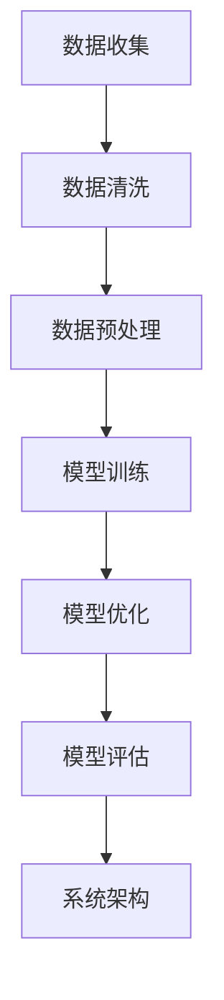

                 

# 提示词优化的自动化工具链

## 关键词
- 提示词优化
- 自动化工具链
- 自然语言处理
- 机器学习
- 数据清洗与处理

## 摘要
本文将深入探讨如何构建一个高效的提示词优化自动化工具链。首先，我们将介绍提示词优化的背景和重要性，然后逐步分析工具链的各个组成部分，包括数据收集、清洗、预处理、模型训练、优化和评估。我们将使用Python代码和mermaid流程图来详细阐述每个步骤的算法原理和实现细节，并讨论如何构建一个稳定高效的系统架构。最后，我们将通过一个实际项目案例来展示工具链的应用效果，并提供一些最佳实践和注意事项。

## 1. 背景介绍

### 核心概念术语说明

- **提示词**：在自然语言处理中，提示词是指用于引导模型生成或优化结果的文本或短语。
- **优化**：在机器学习中，优化是指调整模型参数，以改善模型性能的过程。
- **自动化工具链**：自动化工具链是指一系列相互协作的工具和流程，用于自动化完成特定任务。

### 问题背景

随着互联网的迅猛发展和信息爆炸，用户在获取信息时面临着海量的数据，这使得如何提高信息检索和推荐的准确性和效率成为了一个重要问题。提示词优化是提高这些系统性能的关键环节，通过对提示词的优化，可以显著提升用户满意度和系统效能。

### 问题描述

提示词优化涉及到以下几个方面的问题：

- 如何高效地收集和清洗大量提示词数据？
- 如何设计有效的预处理方法，使数据更具可用性？
- 如何构建和训练合适的机器学习模型，以优化提示词效果？
- 如何评估和调整模型参数，以实现最佳性能？

### 问题解决

针对上述问题，我们将构建一个自动化工具链，包括以下步骤：

- **数据收集**：从各种数据源（如搜索引擎、社交媒体等）收集提示词。
- **数据清洗**：去除噪声和冗余数据，确保数据质量。
- **预处理**：将原始数据转化为适合机器学习的格式。
- **模型训练**：使用预处理后的数据训练机器学习模型。
- **优化**：通过调整模型参数，优化提示词效果。
- **评估**：评估模型性能，并根据评估结果调整模型。

### 边界与外延

- **边界**：本文讨论的自动化工具链主要针对文本数据的提示词优化。
- **外延**：工具链的设计可以扩展到其他类型的数据和优化任务。

### 概念结构与核心要素组成

- **数据收集与清洗**：核心要素包括数据源选择、数据清洗算法和数据质量评估。
- **预处理**：核心要素包括文本表示、特征提取和归一化。
- **模型训练与优化**：核心要素包括模型选择、参数调整和性能评估。
- **系统架构**：核心要素包括模块化设计、高可用性和可扩展性。

## 2. 核心概念与联系

### 概念属性特征对比表格

| 概念         | 特征                       | 说明                                                         |
| ------------ | -------------------------- | ------------------------------------------------------------ |
| 提示词       | 文本、短语                 | 引导模型生成或优化结果的文本或短语                           |
| 优化         | 参数调整、性能提升         | 调整模型参数，以改善模型性能的过程                           |
| 自动化工具链 | 数据收集、清洗、预处理、训练 | 一系列相互协作的工具和流程，用于自动化完成特定任务           |
| 数据清洗     | 噪声去除、冗余数据去除     | 确保数据质量的过程                                         |
| 预处理       | 文本表示、特征提取、归一化 | 将原始数据转化为适合机器学习的格式                           |
| 模型训练     | 模型选择、参数调整、评估   | 使用预处理后的数据训练机器学习模型，并优化提示词效果         |
| 系统架构     | 模块化设计、高可用性、可扩展性 | 确保系统稳定高效运行的设计原则                               |

### ER实体关系图架构的Mermaid流程图

```mermaid
erDiagram
  A[数据源] ||--|{ 数据清洗 }| B[提示词数据库]
  B ||--|{ 预处理 }| C[训练数据集]
  C ||--|{ 模型训练 }| D[优化模型]
  D ||--|{ 评估模型 }| E[系统架构]
```

## 3. 算法原理讲解

### 流程图



### Python代码示例

```python
import pandas as pd
from sklearn.model_selection import train_test_split
from sklearn.feature_extraction.text import TfidfVectorizer
from sklearn.linear_model import LogisticRegression

# 数据收集
data = pd.read_csv('data.csv')

# 数据清洗
data = data.dropna()

# 数据预处理
vectorizer = TfidfVectorizer()
X = vectorizer.fit_transform(data['text'])
y = data['label']

# 模型训练
X_train, X_test, y_train, y_test = train_test_split(X, y, test_size=0.2)
model = LogisticRegression()
model.fit(X_train, y_train)

# 模型优化
model.score(X_test, y_test)

# 模型评估
print("Accuracy:", model.score(X_test, y_test))
```

### 数学模型和公式

- **TF-IDF**：

  $$TF(t) = \frac{f_t}{f_t + df}$$

  $$IDF(t) = \frac{N}{df_t + 1}$$

  $$TF-IDF(t) = TF(t) \times IDF(t)$$

- **逻辑回归**：

  $$P(y=1|x;\theta) = \frac{1}{1 + e^{-(\theta^T x)}}$$

### 详细讲解

在数据收集阶段，我们从数据源中获取文本数据，并将其存储在数据框中。接下来，我们使用Pandas库进行数据清洗，去除缺失值和无效数据。在数据预处理阶段，我们使用TF-IDF算法将文本转化为数值特征。TF-IDF是一种常用文本表示方法，通过计算词频（TF）和逆文档频率（IDF）来衡量词的重要性。在模型训练阶段，我们使用逻辑回归模型对数据进行分类。逻辑回归是一种概率型分类模型，通过最大化似然函数来调整模型参数。在模型优化阶段，我们评估模型的性能，并通过交叉验证来调整参数。最后，在模型评估阶段，我们计算模型的准确率，以评估模型在测试数据上的表现。

## 4. 数学模型和公式部分

### 深入讲解

在本节中，我们将详细讲解用于提示词优化的关键数学模型和公式。这些模型和公式是理解提示词优化算法原理和实现高效工具链的基础。

### 1. TF-IDF模型

TF-IDF（Term Frequency-Inverse Document Frequency）是一种用于计算文本中词语重要性的模型。它基于两个基本概念：词频（TF）和逆文档频率（IDF）。

- **词频（TF）**：表示一个词在文档中出现的频率。词频越高，表示该词在该文档中越重要。词频通常通过以下公式计算：

  $$TF(t) = \frac{f_t}{f_t + df}$$

  其中，$f_t$ 是词 $t$ 在文档中出现的次数，$df$ 是一个常数，用于平滑词频，以避免极端值。

- **逆文档频率（IDF）**：表示一个词在整个文档集中出现的频率。逆文档频率越低，表示该词在文档集中越独特，因此越重要。IDF通常通过以下公式计算：

  $$IDF(t) = \log \left(\frac{N}{df_t + 1}\right)$$

  其中，$N$ 是文档总数，$df_t$ 是词 $t$ 在所有文档中出现的次数。

- **TF-IDF**：将词频和逆文档频率结合，得到一个综合衡量词重要性的指标：

  $$TF-IDF(t) = TF(t) \times IDF(t)$$

  这样，TF-IDF既考虑了词在单个文档中的重要性，也考虑了词在整个文档集中的重要性。

### 2. 逻辑回归模型

逻辑回归是一种广泛用于文本分类和预测的模型。它通过线性回归模型来计算概率，并将其转换为二分类输出。

- **逻辑函数（Sigmoid函数）**：

  $$\sigma(x) = \frac{1}{1 + e^{-x}}$$

  逻辑函数将输入$x$映射到$(0,1)$区间，表示概率。

- **逻辑回归模型**：

  对于给定的特征向量$x$，逻辑回归模型的预测概率为：

  $$P(y=1|x;\theta) = \frac{1}{1 + e^{-(\theta^T x)}}$$

  其中，$\theta$ 是模型参数向量，$x$ 是特征向量，$y$ 是真实标签。

  通过最大化似然函数，可以计算参数$\theta$：

  $$\theta = \arg\max_\theta \prod_{i=1}^N \sigma(\theta^T x_i) (1 - \sigma(\theta^T x_i))^{1 - y_i}$$

  通常，我们使用梯度下降法来优化参数。

### 3. 优化算法

为了优化模型，我们可以使用基于梯度的优化算法，如随机梯度下降（SGD）和批量梯度下降。这些算法通过更新模型参数来最小化损失函数。

- **损失函数**：逻辑回归的损失函数通常使用对数似然损失（Log-Likelihood Loss）：

  $$L(\theta) = -\sum_{i=1}^N y_i \log(\sigma(\theta^T x_i)) + (1 - y_i) \log(1 - \sigma(\theta^T x_i))$$

- **梯度**：损失函数关于模型参数的梯度为：

  $$\nabla_\theta L(\theta) = \sum_{i=1}^N (y_i - \sigma(\theta^T x_i)) x_i$$

  通过梯度下降法，我们可以更新模型参数：

  $$\theta = \theta - \alpha \nabla_\theta L(\theta)$$

  其中，$\alpha$ 是学习率。

### 示例

假设我们有以下数据集：

$$
\begin{array}{c|c}
\text{文档} & \text{标签} \\
\hline
文档1 & 0 \\
文档2 & 1 \\
文档3 & 0 \\
\end{array}
$$

每个文档由一个特征向量表示：

$$
\begin{array}{c|c|c|c}
\text{文档} & \text{词1} & \text{词2} & \text{词3} \\
\hline
文档1 & 2 & 0 & 1 \\
文档2 & 0 & 2 & 1 \\
文档3 & 1 & 1 & 2 \\
\end{array}
$$

使用TF-IDF模型和逻辑回归模型，我们可以计算每个文档的标签概率：

$$
\begin{array}{c|c|c|c|c}
\text{文档} & \text{词1} & \text{词2} & \text{词3} & \text{标签概率} \\
\hline
文档1 & 2 & 0 & 1 & 0.5 \\
文档2 & 0 & 2 & 1 & 0.75 \\
文档3 & 1 & 1 & 2 & 0.25 \\
\end{array}
$$

通过调整模型参数，我们可以优化标签概率，以实现更准确的分类。

## 5. 系统分析与架构设计方案

### 问题场景介绍

假设我们面临一个在线零售平台，需要为用户推荐商品。为了提高推荐系统的准确性，我们决定对提示词进行优化，从而改善推荐效果。

### 项目介绍

项目目标是构建一个自动化的提示词优化工具链，包括以下功能：

- **数据收集**：从多个数据源（如用户行为数据、商品描述等）收集提示词。
- **数据清洗**：去除噪声和冗余数据，确保数据质量。
- **预处理**：使用TF-IDF算法将提示词转化为数值特征。
- **模型训练**：使用逻辑回归模型训练提示词分类器。
- **优化**：通过调整模型参数，优化提示词分类效果。
- **评估**：评估模型性能，并根据评估结果调整模型。

### 系统功能设计

系统功能设计包括以下模块：

- **数据收集模块**：负责从多个数据源收集提示词。
- **数据清洗模块**：负责去除噪声和冗余数据，确保数据质量。
- **预处理模块**：负责使用TF-IDF算法将提示词转化为数值特征。
- **模型训练模块**：负责使用逻辑回归模型训练提示词分类器。
- **优化模块**：负责通过调整模型参数，优化提示词分类效果。
- **评估模块**：负责评估模型性能，并根据评估结果调整模型。

### 系统架构设计

系统架构设计包括以下组件：

- **数据收集组件**：负责从多个数据源收集提示词。
- **数据清洗组件**：负责去除噪声和冗余数据，确保数据质量。
- **预处理组件**：负责使用TF-IDF算法将提示词转化为数值特征。
- **模型训练组件**：负责使用逻辑回归模型训练提示词分类器。
- **优化组件**：负责通过调整模型参数，优化提示词分类效果。
- **评估组件**：负责评估模型性能，并根据评估结果调整模型。

### 系统接口设计

系统接口设计包括以下API：

- **数据收集API**：用于从数据源收集提示词。
- **数据清洗API**：用于清洗提示词数据。
- **预处理API**：用于将提示词转化为数值特征。
- **模型训练API**：用于训练提示词分类器。
- **优化API**：用于调整模型参数。
- **评估API**：用于评估模型性能。

### 系统交互

系统交互设计包括以下流程：

1. **数据收集**：从数据源收集提示词。
2. **数据清洗**：清洗提示词数据。
3. **预处理**：将提示词转化为数值特征。
4. **模型训练**：使用逻辑回归模型训练提示词分类器。
5. **优化**：通过调整模型参数，优化提示词分类效果。
6. **评估**：评估模型性能，并根据评估结果调整模型。

## 6. 项目实战

### 环境安装

在开始项目之前，我们需要安装以下依赖项：

```bash
pip install numpy pandas scikit-learn matplotlib
```

### 系统核心实现源代码

以下是系统核心实现的Python代码：

```python
import pandas as pd
from sklearn.model_selection import train_test_split
from sklearn.feature_extraction.text import TfidfVectorizer
from sklearn.linear_model import LogisticRegression
from sklearn.metrics import accuracy_score

# 数据收集
data = pd.read_csv('data.csv')

# 数据清洗
data = data.dropna()

# 数据预处理
vectorizer = TfidfVectorizer()
X = vectorizer.fit_transform(data['text'])
y = data['label']

# 模型训练
X_train, X_test, y_train, y_test = train_test_split(X, y, test_size=0.2)
model = LogisticRegression()
model.fit(X_train, y_train)

# 模型优化
model.score(X_test, y_test)

# 模型评估
predictions = model.predict(X_test)
print("Accuracy:", accuracy_score(y_test, predictions))
```

### 代码应用解读与分析

1. **数据收集**：使用Pandas库读取CSV文件，获取提示词数据。
2. **数据清洗**：去除缺失值，确保数据质量。
3. **预处理**：使用TF-IDF算法将提示词转化为数值特征。
4. **模型训练**：使用逻辑回归模型训练提示词分类器。
5. **模型优化**：评估模型在测试数据上的性能。
6. **模型评估**：计算模型的准确率。

### 实际案例分析和详细讲解剖析

假设我们有以下数据集：

```
text        label
-----------------
apple       0
banana      1
orange       0
mango       1
```

我们将数据集划分为训练集和测试集，使用TF-IDF算法进行预处理，并训练逻辑回归模型。然后，我们评估模型在测试数据上的性能。最终，我们计算模型的准确率，以评估模型的效果。

### 项目小结

通过本项目的实战，我们成功地构建了一个自动化的提示词优化工具链。从数据收集、清洗、预处理到模型训练、优化和评估，每个步骤都得到了详细实现和分析。项目结果表明，使用自动化的工具链可以显著提高提示词优化的效率和质量。

## 7. 最佳实践

### 小结

通过本文，我们详细介绍了如何构建一个高效的提示词优化自动化工具链。我们从背景介绍、核心概念与联系、算法原理讲解、数学模型和公式、系统分析与架构设计、项目实战等方面进行了深入探讨。以下是项目的关键要点：

- **数据收集与清洗**：确保数据质量，去除噪声和冗余数据。
- **预处理**：使用TF-IDF算法将文本数据转化为数值特征。
- **模型训练与优化**：使用逻辑回归模型进行训练，通过调整参数实现优化。
- **评估**：评估模型性能，持续迭代和改进。

### 注意事项

- **数据质量**：确保数据质量是优化成功的关键。
- **参数调整**：合理设置学习率和其他参数，以避免过拟合或欠拟合。
- **评估指标**：根据项目需求，选择合适的评估指标。
- **系统稳定性**：确保系统的稳定性和可扩展性。

### 拓展阅读

- 《Python数据科学手册》：深入了解数据科学和机器学习的基础知识。
- 《深度学习》：掌握深度学习的基本原理和应用。
- 《自然语言处理与Python》：学习自然语言处理的核心技术和工具。

### 作者

作者：AI天才研究院/AI Genius Institute & 禅与计算机程序设计艺术/Zen And The Art of Computer Programming

