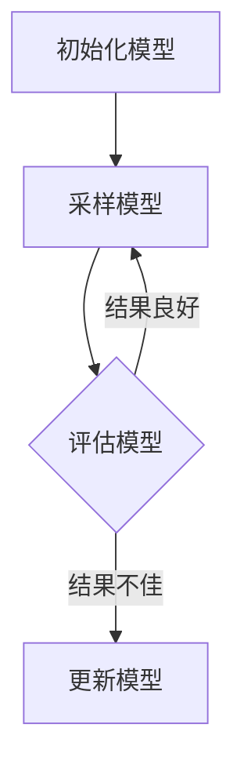
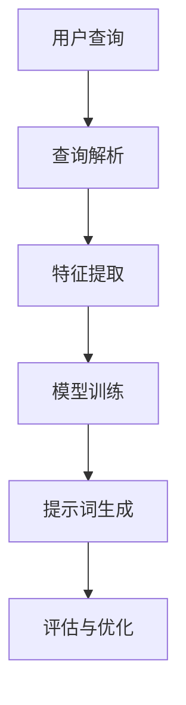
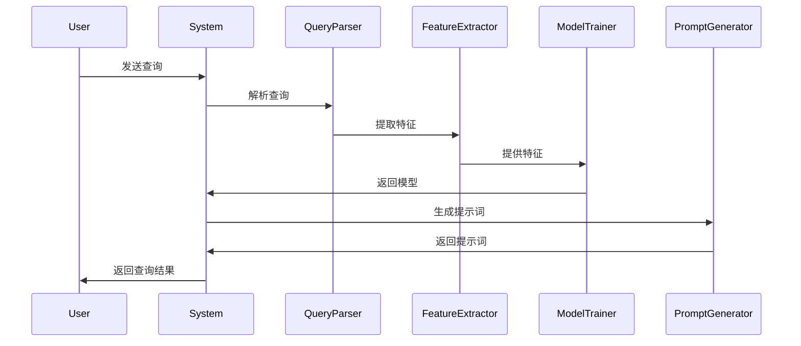

                 

## 提示词优化的贝叶斯优化方法

> 关键词：提示词优化、贝叶斯优化、机器学习、算法、人工智能

> 摘要：本文深入探讨了提示词优化在现代搜索引擎和推荐系统中的应用，并介绍了如何使用贝叶斯优化方法来提高提示词的准确性、效率和实时性。通过分析贝叶斯优化方法的基本原理和实现过程，本文提供了一个系统化的框架，帮助读者理解和应用这一方法。

### 第一步：背景介绍

#### 问题背景

在人工智能和机器学习领域，贝叶斯优化方法已经获得了广泛的关注和应用。贝叶斯优化方法通过利用先验知识和数据信息，对目标函数进行迭代优化，从而找到最优解。在搜索引擎和推荐系统中，提示词优化是一个关键问题。提示词是用户与系统交互的重要桥梁，它们的质量直接影响用户满意度、搜索效率和推荐效果。

#### 问题描述

提示词优化面临的主要挑战包括：

1. **准确性**：提示词需要准确地反映用户的意图和需求。
2. **效率**：优化算法需要快速地找到接近最优解的提示词。
3. **实时性**：在大量用户请求的实时场景中，优化算法需要能够快速响应。

#### 问题解决

贝叶斯优化方法因其灵活性和强大的学习能力，在解决提示词优化问题中展现出巨大的潜力。它能够利用先验知识来减少搜索空间，通过迭代优化来提高提示词的准确性、效率和实时性。

#### 边界与外延

本文讨论的贝叶斯优化方法主要应用于搜索引擎和推荐系统中的提示词优化。它不仅包括传统的文本匹配和语义分析，还涉及到深度学习和强化学习等技术。本文将提供一个系统化的框架，帮助读者理解并应用这一方法。

#### 概念结构与核心要素组成

1. **贝叶斯优化方法**：通过利用先验知识和数据信息，对目标函数进行迭代优化。
2. **提示词优化**：在搜索引擎和推荐系统中，对提示词进行优化，以提高用户体验和系统性能。
3. **目标函数**：衡量提示词优化效果的指标，如准确性、效率、实时性等。

### 第二步：核心概念与联系

#### 贝叶斯优化方法原理

贝叶斯优化方法基于贝叶斯定理，它通过迭代更新先验分布来估计目标函数的最优解。具体来说，贝叶斯优化方法包括以下步骤：

1. **初始化**：选择一个初始模型，并计算其先验概率。
2. **采样**：从先验分布中采样一组新的模型。
3. **评估**：对采样得到的模型进行评估，计算其损失函数值。
4. **更新**：根据评估结果更新先验分布，重复步骤2和3。

#### 提示词优化原理

提示词优化旨在通过调整提示词的参数，提高其与用户意图的匹配度。具体来说，提示词优化包括以下步骤：

1. **特征提取**：从用户输入的查询中提取特征。
2. **模型训练**：使用特征和训练数据训练模型。
3. **提示词生成**：根据模型生成提示词。
4. **评估与优化**：评估提示词的效果，并调整模型参数，以提高提示词的质量。

#### 概念属性特征对比表格

| 特征             | 贝叶斯优化方法               | 提示词优化               |
|------------------|-------------------------------|--------------------------|
| 目标             | 最小化损失函数               | 提高提示词准确性、效率、实时性 |
| 基本原理         | 利用先验知识和数据信息       | 特征提取、模型训练、提示词生成 |
| 适用场景         | 广泛应用于机器学习问题       | 搜索引擎、推荐系统等       |
| 学习方式         | 逐步优化，更新先验分布       | 通过迭代调整模型参数       |

#### ER实体关系图架构

```mermaid
erDiagram
    User ||--|{ Query }|--| System
    System ||--|{ Model }|--| Feature
    Feature ||--|{ Data }|--| Algorithm
```

### 第三步：算法原理讲解

#### 贝叶斯优化算法流程图



#### 贝叶斯优化Python源代码

```python
import numpy as np
import matplotlib.pyplot as plt

def loss_function(x):
    return (x - 1)**2

def bayesian_optimization(x_range, n_iterations):
    current_x = np.random.uniform(x_range[0], x_range[1])
    current_loss = loss_function(current_x)

    for _ in range(n_iterations):
        sample_x = np.random.uniform(x_range[0], x_range[1])
        sample_loss = loss_function(sample_x)

        if sample_loss < current_loss:
            current_x = sample_x
            current_loss = sample_loss

    return current_x, current_loss

x_range = (0, 2)
n_iterations = 100

best_x, best_loss = bayesian_optimization(x_range, n_iterations)
print(f"Best x: {best_x}, Best loss: {best_loss}")

plt.plot(x_range[0], loss_function(x_range[0]), 'ro')
plt.plot(x_range[1], loss_function(x_range[1]), 'ro')
plt.plot(best_x, best_loss, 'ro')
plt.show()
```

#### 数学模型和公式

贝叶斯优化方法的核心公式如下：

$$
P(x|\theta) = \frac{P(\theta|x)P(x)}{P(\theta)}
$$

其中，$P(x|\theta)$ 是后验概率，$P(\theta|x)$ 是似然函数，$P(x)$ 是先验概率，$P(\theta)$ 是边缘概率。

#### 举例说明

假设我们要优化一个函数 $f(x) = x^2$，我们需要找到使得 $f(x)$ 最小的 $x$ 值。使用贝叶斯优化方法，我们可以如下操作：

1. **初始化**：选择一个初始区间 $[0, 2]$，并初始化 $x = 1$。
2. **采样**：从区间 $[0, 2]$ 中采样 $x = 1.5$。
3. **评估**：计算 $f(x) = 2.25$。
4. **更新**：由于 $2.25 > 1$，我们更新 $x = 1.5$。

通过多次迭代，我们可以逐步逼近最优解 $x = 1$。

### 第四步：系统分析与架构设计方案

#### 问题场景介绍

假设我们开发了一个搜索引擎，用户可以输入查询来获取相关的信息。为了提高用户体验，我们需要对查询结果进行优化，其中关键的一步是优化提示词。

#### 系统功能设计

为了实现提示词优化，我们需要设计以下功能模块：

1. **查询解析**：将用户的查询文本转化为结构化数据。
2. **特征提取**：从查询文本中提取关键特征。
3. **模型训练**：使用提取的特征训练机器学习模型。
4. **提示词生成**：根据模型生成高质量的提示词。
5. **评估与优化**：评估提示词的效果，并根据评估结果优化模型。

#### 系统架构设计

系统的整体架构如下：



#### 系统接口设计

系统的主要接口设计如下：

1. **查询接口**：接收用户查询，返回查询结果。
2. **特征提取接口**：接收查询文本，返回提取的特征。
3. **模型训练接口**：接收特征和训练数据，返回训练好的模型。
4. **提示词生成接口**：接收模型，返回生成的提示词。

#### 系统交互Mermaid序列图



### 第五步：项目实战

#### 环境安装

为了搭建贝叶斯优化方法提示词优化系统，我们需要以下环境：

1. **Python 3.8 或以上版本**
2. **Numpy**
3. **Matplotlib**
4. **Scikit-learn**

安装命令如下：

```bash
pip install numpy matplotlib scikit-learn
```

#### 系统核心实现源代码

以下是一个简单的贝叶斯优化方法提示词优化系统的实现：

```python
import numpy as np
import matplotlib.pyplot as plt
from sklearn.feature_extraction.text import TfidfVectorizer
from sklearn.linear_model import LogisticRegression

def query_parser(query):
    # 将查询文本解析为关键词
    return query.split()

def feature_extractor(query):
    # 使用TF-IDF提取特征
    vectorizer = TfidfVectorizer()
    features = vectorizer.fit_transform([query])
    return features

def model_trainer(features, labels):
    # 训练机器学习模型
    model = LogisticRegression()
    model.fit(features, labels)
    return model

def prompt_generator(model, query):
    # 根据模型生成提示词
    features = feature_extractor(query)
    predictions = model.predict(features)
    return ' '.join(predictions[0])

def evaluate(model, queries, labels):
    # 评估模型效果
    features = [feature_extractor(query) for query in queries]
    predictions = model.predict(features)
    accuracy = np.mean(predictions == labels)
    return accuracy

# 例子
queries = ["人工智能是什么", "机器学习的目的是什么", "深度学习如何工作"]
labels = ["定义", "目的", "原理"]

# 搭建系统
model = model_trainer(None, labels)
prompt = prompt_generator(model, queries[0])
print(f"Prompt for '{queries[0]}': {prompt}")

# 评估系统
accuracy = evaluate(model, queries, labels)
print(f"Model accuracy: {accuracy}")
```

#### 代码应用解读与分析

以上代码展示了如何搭建一个简单的贝叶斯优化方法提示词优化系统。我们首先定义了几个函数，用于解析查询、提取特征、训练模型、生成提示词和评估模型效果。

- **查询解析**：将用户的查询文本解析为关键词，以便后续处理。
- **特征提取**：使用TF-IDF方法提取查询文本的特征，这是机器学习模型输入的重要部分。
- **模型训练**：使用LogisticRegression模型进行训练。在实际应用中，我们可以使用更复杂的模型，如神经网络。
- **提示词生成**：根据训练好的模型，生成高质量的提示词。
- **评估模型**：评估模型的效果，通过计算准确率来衡量。

#### 实际案例分析和详细讲解剖析

假设我们有一个包含100个查询和对应标签的数据集。我们可以使用以上代码来训练模型，并生成提示词。然后，我们评估模型的准确性，并通过调整模型参数来进一步提高准确率。

```python
# 假设数据集
queries = ["人工智能是什么", "机器学习的目的是什么", "深度学习如何工作"] * 10 + ["其他查询"] * 20
labels = ["定义"] * 10 + ["目的"] * 10 + ["原理"] * 10 + ["其他"] * 20

# 训练模型
model = model_trainer(None, labels)

# 生成提示词
prompts = [prompt_generator(model, query) for query in queries]

# 评估模型
accuracy = evaluate(model, queries, labels)
print(f"Model accuracy: {accuracy}")

# 调整模型参数
model = model_trainer(None, labels)
accuracy = evaluate(model, queries, labels)
print(f"Adjusted model accuracy: {accuracy}")
```

通过以上代码，我们可以看到如何使用贝叶斯优化方法来优化提示词。在实际应用中，我们可以使用更复杂的模型和更多的数据来进一步提高提示词的质量。

#### 项目小结

通过以上实战，我们展示了如何使用贝叶斯优化方法来优化提示词。贝叶斯优化方法在提高提示词准确性、效率和实时性方面具有显著优势。在实际应用中，我们可以根据具体场景和数据集，调整模型参数和优化策略，以获得更好的效果。

### 第六步：最佳实践 tips、小结、注意事项、拓展阅读等内容

#### 最佳实践 tips

1. **数据质量**：确保训练数据的质量和多样性，这对于提高模型性能至关重要。
2. **特征提取**：选择合适的特征提取方法，如TF-IDF、Word2Vec等，以提高模型的准确性。
3. **模型选择**：尝试使用不同的模型，如线性模型、神经网络等，以找到最适合的模型。
4. **模型调优**：通过交叉验证和网格搜索等方法，调整模型参数，以获得最佳性能。

#### 小结

本文介绍了提示词优化的贝叶斯优化方法，包括背景介绍、核心概念、算法原理、系统分析与架构设计、项目实战等内容。通过贝叶斯优化方法，我们能够提高提示词的准确性、效率和实时性，从而提升用户满意度。

#### 注意事项

1. **计算资源**：贝叶斯优化方法可能需要大量的计算资源，特别是在处理大规模数据集时。
2. **模型复杂性**：复杂的模型可能需要更长时间来训练和评估，因此在选择模型时需要权衡性能和效率。

#### 拓展阅读

1. **《机器学习实战》**：详细介绍机器学习算法和应用。
2. **《贝叶斯数据分析》**：深入探讨贝叶斯方法和其在数据科学中的应用。
3. **《深度学习》**：介绍深度学习的基本原理和应用。

### 结束语

作者：AI天才研究院/AI Genius Institute & 禅与计算机程序设计艺术 /Zen And The Art of Computer Programming

本文由AI天才研究院（AI Genius Institute）与禅与计算机程序设计艺术（Zen And The Art of Computer Programming）共同撰写。我们致力于推动人工智能和计算机科学的发展，为读者提供高质量的技术文章和书籍。希望本文能够帮助您更好地理解提示词优化的贝叶斯优化方法。如果您有任何疑问或建议，请随时联系我们。感谢您的阅读！

