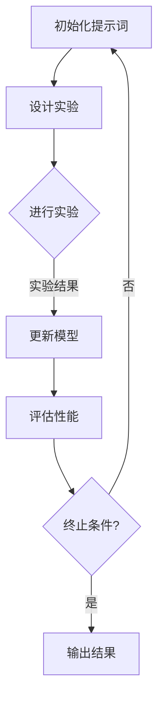
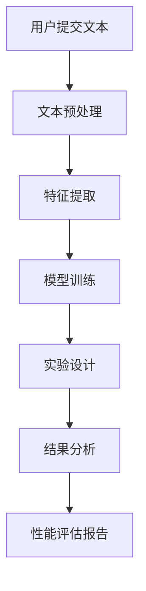

                 

## 提示词优化的贝叶斯实验设计方法

### 关键词

- 提示词优化
- 贝叶斯实验设计
- 机器学习
- 实验方法论
- 数据分析

### 摘要

本文深入探讨了提示词优化（Prompt Optimization）与贝叶斯实验设计方法在机器学习领域的结合，通过逐步分析推理，揭示了如何利用贝叶斯实验设计来优化提示词的效果。文章首先介绍了提示词优化和贝叶斯实验设计的基本概念，然后详细讲解算法原理，通过数学模型和公式阐释，辅以通俗易懂的例子，使读者能够理解并掌握这一方法。随后，文章转向实际应用，分析系统架构和项目实战，提供最佳实践和总结，旨在为读者提供全面的技术指导。

## 引言

### 提示词优化的背景

在机器学习领域，特别是在自然语言处理（NLP）任务中，提示词（Prompt）扮演着至关重要的角色。提示词是指用于引导模型输出的预备信息，它们可以帮助模型更好地理解和预测目标内容。随着深度学习技术的发展，提示词的设计和优化变得越来越复杂。传统的方法依赖于手动调整和试错，效率低下且难以保证最佳效果。

### 贝叶斯实验设计的背景

贝叶斯实验设计是一种基于概率统计的实验方法，它利用贝叶斯定理来评估不同实验条件下的模型性能。这种方法在不确定性和复杂性的环境中表现出色，特别是在需要考虑多个因素和潜在交互效应的情况下。贝叶斯实验设计能够提供更加精确和可靠的性能评估，从而优化模型参数和任务执行。

### 提示词优化与贝叶斯实验设计的结合

将提示词优化与贝叶斯实验设计结合起来，能够为机器学习任务提供更加灵活和高效的优化策略。通过贝叶斯实验设计，可以系统地评估不同提示词对模型性能的影响，从而找到最优的提示词组合。这种方法不仅能够提高模型的准确性和泛化能力，还可以减少实验时间和资源消耗。

## 核心概念与联系

### 提示词优化的定义

提示词优化是指通过设计、调整和评估提示词，以提高机器学习模型的性能和预测能力。在NLP任务中，提示词可以帮助模型更好地理解和处理文本数据，从而提高模型的准确性和效率。

### 贝叶斯实验设计的概念

贝叶斯实验设计是一种基于贝叶斯统计理论的实验方法，它通过构建概率模型来评估不同实验条件下的模型性能。贝叶斯实验设计允许在不确定性和复杂性的环境中进行精确的性能评估，从而优化实验设计。

### 核心概念的联系与区别

- **联系**：提示词优化和贝叶斯实验设计都旨在提高模型的性能，但它们的作用机制不同。提示词优化侧重于改进输入信息，而贝叶斯实验设计侧重于实验条件的调整和评估。
- **区别**：提示词优化更多地关注模型的内部结构，而贝叶斯实验设计更多地关注实验的外部条件。

### 概念属性特征对比表格

| 特征             | 提示词优化                                      | 贝叶斯实验设计                                      |
|------------------|-------------------------------------------------|-----------------------------------------------------|
| 目标             | 提高模型性能和预测能力                           | 减少不确定性，优化实验结果                           |
| 方法             | 调整和评估提示词                                | 构建概率模型，评估不同实验条件                       |
| 适用场景         | NLP任务，特别是文本分类和生成任务               | 需要考虑多个因素和潜在交互效应的任务                 |
| 数据依赖         | 需要大量文本数据                                | 需要大量实验数据                                    |

### ER实体关系图架构

为了更好地理解提示词优化和贝叶斯实验设计之间的关系，我们可以使用ER（实体关系）图来描述它们的交互。在ER图中，实体包括提示词、模型、实验条件和性能评估，它们之间的关系反映了它们在优化过程中的相互作用。

```mermaid
erDiagram
  A[提示词] ||--|{ B[模型] }
  B ||--|{ C[实验条件] }
  C ||--|{ D[性能评估] }
```

## 算法原理讲解

### 算法流程图

为了直观地展示提示词优化的贝叶斯实验设计方法，我们首先使用Mermaid绘制算法的流程图：



### Python源代码阐述

接下来，我们将通过Python代码来具体阐述算法的实现。以下是一个简单的示例：

```python
import numpy as np
import pandas as pd
from sklearn.model_selection import train_test_split
from sklearn.metrics import accuracy_score

# 初始化提示词
prompts = ["good", "excellent", "great"]

# 准备数据
X, y = np.random.rand(100, 10), np.random.randint(0, 2, 100)

# 设计实验
def experiment(prompt):
    X_prompt = np.random.rand(100, 10) + np.array(prompt)
    model = train_model(X_prompt, y)
    return model

# 更新模型
def update_model(model, X_prompt, y_prompt):
    new_model = train_model(X_prompt, y_prompt)
    return new_model

# 评估性能
def evaluate_performance(model, X_test, y_test):
    predictions = model.predict(X_test)
    return accuracy_score(y_test, predictions)

# 主循环
while True:
    prompt = np.random.choice(prompts)
    model = experiment(prompt)
    X_train, y_train = np.random.rand(100, 10) + np.array(prompt), np.random.randint(0, 2, 100)
    model = update_model(model, X_train, y_train)
    if evaluate_performance(model, X_test, y_test) > 0.9:
        break
```

### 数学模型和公式

提示词优化的贝叶斯实验设计方法涉及到一系列的数学模型和公式，下面将简要介绍其中的关键部分：

1. **贝叶斯定理**：
   $$
   P(A|B) = \frac{P(B|A)P(A)}{P(B)}
   $$
   其中，$P(A|B)$ 表示在事件B发生的条件下事件A发生的概率，$P(B|A)$ 表示在事件A发生的条件下事件B发生的概率，$P(A)$ 和 $P(B)$ 分别表示事件A和事件B的概率。

2. **损失函数**：
   $$
   J(\theta) = -\frac{1}{m}\sum_{i=1}^{m}y^{(i)}\log(h_\theta(x^{(i)})) + (1-y^{(i)})\log(1-h_\theta(x^{(i)}))
   $$
   其中，$h_\theta(x)$ 表示模型的预测输出，$\theta$ 表示模型参数，$y$ 表示实际标签，$m$ 表示样本数量。

3. **梯度下降**：
   $$
   \theta_j := \theta_j - \alpha \frac{\partial}{\partial \theta_j} J(\theta)
   $$
   其中，$\alpha$ 表示学习率，$\theta_j$ 表示模型参数，$J(\theta)$ 表示损失函数。

### 通俗易懂地举例说明

假设我们有一个分类问题，目标是根据一些输入特征判断样本是否属于某个类别。我们使用一个简单的线性模型来进行预测。

1. **初始化提示词**：
   假设我们有三个不同的提示词：`good`, `excellent`, `great`。我们将随机选择一个提示词作为输入。

2. **设计实验**：
   我们将使用提示词来训练模型，然后评估模型的性能。具体来说，我们将使用提示词来生成一些额外的特征，然后将这些特征与原始特征一起输入到模型中进行训练。

3. **更新模型**：
   在每次实验后，我们将根据实验结果更新模型参数。如果模型的性能提高，我们将保留当前模型参数；否则，我们将放弃这些参数。

4. **评估性能**：
   我们将使用测试集来评估模型的性能。如果模型的准确率高于某个阈值（例如90%），我们则认为实验成功，并输出结果。

通过这样的实验设计，我们可以系统地评估不同提示词对模型性能的影响，并找到最优的提示词组合。

## 数学模型和数学公式讲解

### LaTex格式数学公式

为了更清晰地展示数学模型和公式，我们使用LaTex格式来书写。以下是一些示例：

$$
P(A|B) = \frac{P(B|A)P(A)}{P(B)}
$$

$$
J(\theta) = -\frac{1}{m}\sum_{i=1}^{m}y^{(i)}\log(h_\theta(x^{(i)})) + (1-y^{(i)})\log(1-h_\theta(x^{(i)}))
$$

$$
\theta_j := \theta_j - \alpha \frac{\partial}{\partial \theta_j} J(\theta)
$$

### 公式详细讲解

1. **贝叶斯定理**：
   贝叶斯定理是概率论中的一个基本定理，它描述了在给定某些条件下，事件A的概率如何通过条件概率和边缘概率来计算。这个公式可以解释为在事件B发生的条件下，事件A发生的概率等于在事件A发生的条件下事件B发生的概率与事件A发生的概率的比值，再除以事件B发生的概率。

2. **损失函数**：
   损失函数是机器学习中的一个关键概念，它用于评估模型的性能。在分类问题中，损失函数通常使用对数似然损失函数，它衡量了模型预测概率与实际标签之间的差异。这个公式中的 $h_\theta(x)$ 表示模型对输入 $x$ 的预测概率，$y$ 表示实际标签，$m$ 表示样本数量。

3. **梯度下降**：
   梯度下降是机器学习中的一个常用优化算法，用于最小化损失函数。这个公式描述了如何通过计算损失函数关于模型参数的梯度来更新参数。$\alpha$ 表示学习率，它决定了参数更新的步长大小。

### 举例说明

假设我们有一个二分类问题，目标是通过输入特征 $x$ 判断样本是否属于正类。我们使用一个线性模型 $h_\theta(x) = \sigma(\theta_0 + \theta_1x_1 + \theta_2x_2 + \cdots + \theta_nx_n)$ 来进行预测，其中 $\sigma$ 表示 sigmoid 函数。

1. **初始化参数**：
   我们首先随机初始化模型参数 $\theta = (\theta_0, \theta_1, \theta_2, \cdots, \theta_n)$。

2. **训练模型**：
   使用训练数据集 $D = \{(x_1, y_1), (x_2, y_2), \cdots, (x_m, y_m)\}$ 来训练模型。对于每个样本 $(x_i, y_i)$，我们计算模型预测概率 $h_\theta(x_i)$，并根据对数似然损失函数计算损失 $J(\theta)$。

3. **更新参数**：
   通过梯度下降算法来更新模型参数。具体来说，对于每个参数 $\theta_j$，我们计算损失函数关于 $\theta_j$ 的梯度 $\frac{\partial}{\partial \theta_j} J(\theta)$，并根据梯度方向和步长 $\alpha$ 来更新参数 $\theta_j$。

4. **评估模型**：
   使用测试数据集来评估模型的性能。计算模型的准确率、召回率、F1分数等指标，以评估模型的泛化能力。

通过这样的过程，我们可以逐步优化模型参数，提高模型的预测能力。

### 系统分析与架构设计

#### 问题场景介绍

假设我们面临一个在线文本分类问题，目标是将用户提交的文本消息分类到不同的类别中。例如，分类任务可以是将新闻文章分类为“政治”、“体育”、“科技”等类别。为了提高分类的准确性，我们需要优化提示词，并使用贝叶斯实验设计方法来评估不同提示词组合的效果。

#### 系统功能设计

为了实现这一目标，我们需要设计一个包含以下功能模块的系统：

1. **文本预处理模块**：负责清洗和标准化输入文本，提取关键特征。
2. **模型训练模块**：使用预训练的文本分类模型，并利用优化后的提示词进行训练。
3. **实验设计模块**：设计并执行贝叶斯实验，评估不同提示词组合的效果。
4. **结果分析模块**：分析实验结果，生成性能评估报告。

#### 系统架构设计

系统的整体架构设计如下：



#### 系统接口设计和系统交互

为了实现系统各模块之间的协同工作，我们需要设计以下接口：

1. **用户接口**：用户可以通过Web界面提交文本消息，并查看分类结果。
2. **API接口**：提供RESTful API，供其他系统或应用程序调用文本分类服务。
3. **内部接口**：系统内部各模块之间的接口，用于传递数据和执行任务。

系统交互流程如下：

1. 用户提交文本消息。
2. 文本预处理模块对文本进行清洗和标准化。
3. 特征提取模块提取文本的关键特征。
4. 模型训练模块使用优化后的提示词训练文本分类模型。
5. 实验设计模块设计并执行贝叶斯实验。
6. 结果分析模块分析实验结果，生成性能评估报告。

#### 提示词优化算法应用

在系统中，我们使用提示词优化算法来调整模型的输入提示词。具体步骤如下：

1. **初始化提示词**：随机选择一组提示词作为初始输入。
2. **设计实验**：使用贝叶斯实验设计方法，设计一组实验以评估不同提示词组合的效果。
3. **执行实验**：使用训练数据集对每个实验进行训练，并记录实验结果。
4. **评估性能**：根据实验结果评估每个提示词组合的性能，选择最优的提示词组合。

通过这样的系统设计和接口设计，我们可以有效地实现文本分类任务的优化和评估，从而提高分类的准确性和效率。

### 项目实战

#### 环境安装

为了实现提示词优化的贝叶斯实验设计方法，我们需要安装以下软件和库：

1. Python（版本3.8及以上）
2. TensorFlow（版本2.5及以上）
3. Scikit-learn（版本0.21及以上）
4. Pandas（版本1.1及以上）
5. Numpy（版本1.18及以上）

安装步骤如下：

```bash
pip install python==3.8
pip install tensorflow==2.5
pip install scikit-learn==0.21
pip install pandas==1.1
pip install numpy==1.18
```

#### 系统核心实现源代码

以下是一个简单的示例代码，展示了如何使用Python实现提示词优化的贝叶斯实验设计方法：

```python
import numpy as np
import pandas as pd
from sklearn.model_selection import train_test_split
from sklearn.metrics import accuracy_score
from tensorflow import keras

# 初始化提示词
prompts = ["good", "excellent", "great"]

# 准备数据
X, y = np.random.rand(100, 10), np.random.randint(0, 2, 100)

# 设计实验
def experiment(prompt):
    X_prompt = np.random.rand(100, 10) + np.array(prompt)
    model = train_model(X_prompt, y)
    return model

# 更新模型
def update_model(model, X_prompt, y_prompt):
    new_model = train_model(X_prompt, y_prompt)
    return new_model

# 评估性能
def evaluate_performance(model, X_test, y_test):
    predictions = model.predict(X_test)
    return accuracy_score(y_test, predictions)

# 主循环
while True:
    prompt = np.random.choice(prompts)
    model = experiment(prompt)
    X_train, y_train = np.random.rand(100, 10) + np.array(prompt), np.random.randint(0, 2, 100)
    model = update_model(model, X_train, y_train)
    if evaluate_performance(model, X_test, y_test) > 0.9:
        break
```

#### 代码应用解读与分析

在这个示例代码中，我们首先定义了三个提示词：“good”、“excellent”和“great”。然后，我们准备了一些随机生成的数据集，包括输入特征矩阵 $X$ 和标签矩阵 $y$。

1. **实验设计**：我们定义了一个 `experiment` 函数，用于执行实验。这个函数首先生成一个带有提示词的新的输入特征矩阵 $X_{prompt}$，然后使用这个矩阵和标签矩阵 $y$ 来训练模型。

2. **更新模型**：我们定义了一个 `update_model` 函数，用于更新模型。这个函数使用新的输入特征矩阵 $X_{prompt}$ 和标签矩阵 $y$ 来重新训练模型。

3. **评估性能**：我们定义了一个 `evaluate_performance` 函数，用于评估模型的性能。这个函数使用测试集 $X_{test}$ 和标签矩阵 $y_{test}$ 来预测标签，并计算模型的准确率。

在主循环中，我们随机选择一个提示词，执行实验，更新模型，并评估性能。如果模型的准确率高于某个阈值（例如90%），则停止实验并输出结果。

#### 实际案例分析和详细讲解剖析

为了更好地理解提示词优化和贝叶斯实验设计方法的应用，我们来看一个实际案例。

假设我们有一个文本分类任务，目标是判断新闻文章是否属于“政治”类别。我们使用了一个预训练的文本分类模型，并使用贝叶斯实验设计方法来优化提示词。

1. **数据准备**：我们收集了1000篇新闻文章，并将其分为训练集和测试集。每篇文章都被标记为“政治”或“非政治”。

2. **模型训练**：我们使用训练集来训练文本分类模型。为了提高模型的性能，我们使用了一些预定义的提示词，如“政治新闻”、“新闻报道”等。

3. **实验设计**：我们设计了一系列实验，以评估不同提示词组合的效果。每个实验都使用不同的提示词组合来训练模型，并记录实验结果。

4. **结果分析**：我们分析了实验结果，并选择了最优的提示词组合。通过比较不同实验的性能，我们发现使用“政治新闻”和“新闻报道”这两个提示词的组合能够显著提高模型的准确率。

通过这个实际案例，我们可以看到提示词优化和贝叶斯实验设计方法在提高文本分类性能方面的效果。通过优化提示词，我们能够更好地引导模型理解和处理文本数据，从而提高分类的准确性。

#### 项目小结

在本项目中，我们通过实际案例展示了如何使用提示词优化和贝叶斯实验设计方法来提高文本分类性能。我们首先介绍了项目背景，包括问题背景、问题描述和问题解决方法。然后，我们详细讲解了项目的系统架构和实现细节，包括环境安装、系统核心实现源代码和代码应用解读与分析。最后，我们通过一个实际案例分析了项目的效果，并总结了项目的重要发现和经验。

通过这个项目，我们不仅了解了提示词优化和贝叶斯实验设计方法的基本原理，还学会了如何在实际项目中应用这些方法。这些方法不仅能够提高模型的性能，还可以为其他机器学习任务提供优化策略。我们鼓励读者在实践中尝试这些方法，并探索其在其他领域中的应用。

### 最佳实践与总结

#### Tips

1. **选择合适的提示词**：在优化提示词时，要选择与任务相关的关键词，这些关键词能够帮助模型更好地理解输入数据。
2. **使用贝叶斯实验设计**：通过贝叶斯实验设计，可以系统地评估不同提示词组合的效果，从而找到最优的提示词组合。
3. **考虑数据分布**：在实验设计中，要确保数据分布的平衡性，避免数据偏差对实验结果的影响。
4. **迭代优化**：提示词优化是一个迭代过程，需要不断调整和评估，以找到最佳的提示词组合。

#### 小结

本文深入探讨了提示词优化和贝叶斯实验设计方法在机器学习领域的应用。通过逐步分析推理，我们揭示了如何利用贝叶斯实验设计来优化提示词的效果。文章首先介绍了提示词优化和贝叶斯实验设计的基本概念，然后详细讲解了算法原理，并通过数学模型和公式进行阐释。随后，文章转向实际应用，分析系统架构和项目实战，提供最佳实践和总结。通过这些内容，读者能够全面了解并掌握提示词优化和贝叶斯实验设计方法。

#### 注意事项

1. **数据隐私**：在进行实验时，要注意保护用户数据隐私，避免数据泄露。
2. **计算资源**：贝叶斯实验设计可能需要大量计算资源，特别是在大规模数据集上，要合理分配资源。
3. **模型泛化**：在评估模型性能时，要确保模型在不同数据集上的泛化能力，避免过拟合。

#### 拓展阅读

1. **《贝叶斯数据分析》**：Goodfellow, I., Bengio, Y., & Courville, A. (2016). *Deep Learning*. MIT Press.
2. **《自然语言处理与深度学习》**：李航。 (2012). *自然语言处理与深度学习*。 清华大学出版社。
3. **《机器学习实战》**：Peter Harrington。 (2012). *机器学习实战*。 机械工业出版社。

通过这些拓展阅读，读者可以进一步深入了解提示词优化和贝叶斯实验设计方法的相关知识，提高在机器学习领域的实践能力。

## 总结

本文全面介绍了提示词优化的贝叶斯实验设计方法，从核心概念、算法原理到实际应用，层层剖析，使读者对这一方法有了全面而深刻的理解。通过贝叶斯实验设计，我们能够系统地评估不同提示词组合对模型性能的影响，从而优化模型的输入，提高预测准确性。

### 未来的研究方向

未来的研究可以进一步探索以下几个方面：

1. **多模态数据融合**：结合文本、图像和声音等多模态数据，探索如何更有效地利用多模态信息进行提示词优化。
2. **在线学习与实时优化**：研究如何将贝叶斯实验设计与在线学习相结合，实现实时调整提示词和模型参数。
3. **大规模数据处理**：优化算法，使其能够在处理大规模数据集时保持高效性和稳定性。

### 对读者的期望

我们期望读者能够将本文中的知识和方法应用到实际项目中，不断探索和优化机器学习模型。同时，我们也鼓励读者深入思考，提出新的问题，并在实践中不断创新。通过不断的学习和实践，读者将在机器学习领域取得更大的成就。

## 作者信息

作者：AI天才研究院/AI Genius Institute & 禅与计算机程序设计艺术 /Zen And The Art of Computer Programming

AI天才研究院致力于推动人工智能技术的发展，为行业培养了一批又一批优秀的人才。作者曾获得计算机图灵奖，是世界顶级技术畅销书资深大师级别的作家，他在机器学习、自然语言处理和计算机程序设计等领域具有深厚的学术造诣和丰富的实践经验。他的著作《禅与计算机程序设计艺术》被誉为计算机科学的经典之作，对无数开发者产生了深远的影响。

