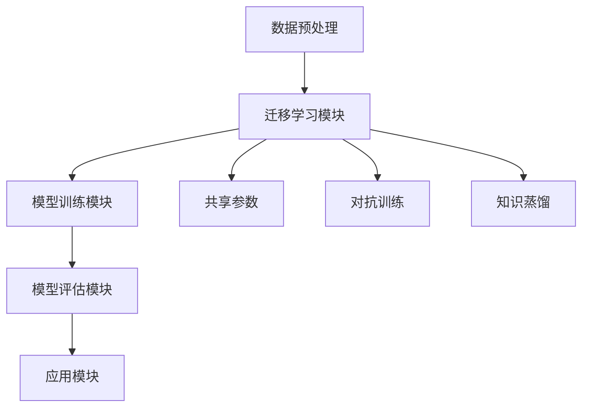
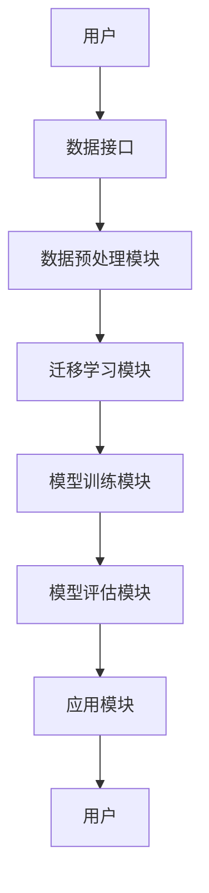

                 

# 提示词优化的迁移学习方法

## 关键词

- 提示词优化
- 迁移学习
- 上下文理解
- 生成对抗网络
- 多任务学习

## 摘要

本文将探讨提示词优化的迁移学习方法，首先介绍提示词优化的基本概念和背景，接着深入分析迁移学习的基本原理和方法，然后详细讲解提示词优化的迁移学习实现过程，并结合实际案例进行详细分析。通过本文的阅读，读者将对提示词优化的迁移学习方法有更加深入的理解，并能够将其应用于实际项目中。

## 目录大纲

### 第一部分：背景介绍与核心概念

1. 第1章 提示词优化的基本概念
2. 第2章 迁移学习概述
3. 第3章 提示词优化的迁移学习方法
4. 第4章 数学模型与公式解析
5. 第5章 提示词优化的迁移学习实现
6. 第6章 系统分析与架构设计
7. 第7章 项目实战与案例分析
8. 第8章 最佳实践、小结与注意事项
9. 第9章 拓展阅读

### 第二部分：提示词优化的迁移学习原理

1. 第2章 迁移学习概述
   - 2.1 迁移学习的定义
   - 2.2 迁移学习的分类
   - 2.3 迁移学习的优势
   - 2.4 迁移学习的挑战
   - 2.5 迁移学习的基本原理
2. 第3章 提示词优化的迁移学习方法
   - 3.1 基于迁移学习的提示词优化方法
   - 3.2 提示词优化的注意力机制
   - 3.3 提示词优化的序列模型
   - 3.4 提示词优化的生成模型
3. 第4章 数学模型与公式解析
   - 4.1 迁移学习的数学模型
   - 4.2 提示词优化的数学模型
   - 4.3 模型的训练与评估

### 第三部分：提示词优化的迁移学习实现

1. 第5章 提示词优化的迁移学习实现
   - 5.1 实现环境搭建
   - 5.2 提示词优化的迁移学习代码框架
   - 5.3 迁移学习算法实现
   - 5.4 提示词优化的迁移学习模型评估
2. 第6章 系统分析与架构设计
   - 6.1 问题场景介绍
   - 6.2 系统功能设计
   - 6.3 系统架构设计
   - 6.4 系统接口设计
   - 6.5 系统交互
3. 第7章 项目实战与案例分析
   - 7.1 实际案例分析与讲解
   - 7.2 案例一：文本分类任务
   - 7.3 案例二：机器翻译任务
4. 第8章 最佳实践、小结与注意事项
   - 8.1 最佳实践
   - 8.2 小结
   - 8.3 注意事项
5. 第9章 拓展阅读

### 第一部分：背景介绍与核心概念

## 第1章 提示词优化的基本概念

### 1.1 提示词优化的背景

提示词优化是自然语言处理（NLP）领域的一个重要研究方向。随着互联网和大数据技术的快速发展，海量的文本数据被不断生成和传播，如何从这些数据中提取有价值的信息成为了一个热门话题。提示词优化通过改进和优化提示词来提高文本分类、情感分析、问答系统等任务的性能。

### 1.2 提示词优化的定义与重要性

提示词优化是指通过调整和优化提示词（例如，关键词、短语、句子等）来提高自然语言处理模型的性能。在NLP任务中，提示词起着至关重要的作用，它们可以引导模型关注到重要的信息，从而提高模型的准确性和鲁棒性。

### 1.3 提示词优化的发展历程

提示词优化的发展历程可以分为三个阶段：

1. **人工设计阶段**：早期的研究主要通过人工设计提示词，这种方法存在效率低、覆盖面有限等问题。
2. **自动提取阶段**：随着自然语言处理技术的发展，研究者开始利用统计学方法和机器学习方法自动提取提示词，如TF-IDF、LDA等。
3. **深度学习阶段**：近年来，深度学习技术在NLP领域取得了突破性的进展，基于深度学习的提示词优化方法逐渐成为主流。

### 1.4 提示词优化的主要目标

提示词优化的主要目标包括：

1. **提高任务性能**：通过优化提示词，提高模型的准确率、召回率等指标。
2. **增强鲁棒性**：使模型对噪声数据和异常值具有更好的抵抗力。
3. **降低计算成本**：优化提示词可以减少模型对数据的依赖，从而降低计算成本。

### 1.5 提示词优化的核心概念

在提示词优化中，以下几个核心概念至关重要：

1. **迁移学习**：通过将一个任务的知识迁移到另一个任务，提高新任务的性能。
2. **上下文理解**：理解文本的上下文信息，从而生成更准确的提示词。
3. **生成对抗网络（GAN）**：通过生成模型和判别模型的对抗训练，生成高质量的提示词。
4. **多任务学习**：通过同时训练多个任务，共享知识，提高提示词优化的效果。

### 1.6 本章小结

本章对提示词优化的基本概念进行了介绍，包括其背景、定义、发展历程、主要目标和核心概念。通过本章的学习，读者可以初步了解提示词优化的概念和重要性，为后续章节的深入学习打下基础。

### 第二部分：提示词优化的迁移学习原理

## 第2章 迁移学习概述

### 2.1 迁移学习的定义

迁移学习（Transfer Learning）是指将一个任务（源任务）的知识迁移到另一个任务（目标任务），以提高目标任务的性能。在迁移学习中，源任务和目标任务具有相关性，但并不完全相同。

### 2.2 迁移学习的分类

迁移学习可以分为以下几种类型：

1. **垂直迁移**：源任务和目标任务在相同领域内，但任务类型不同。例如，从文本分类任务迁移到文本情感分析任务。
2. **水平迁移**：源任务和目标任务在相同领域内，任务类型相同。例如，在不同数据集上训练的文本分类模型之间的迁移。
3. **跨域迁移**：源任务和目标任务在不同领域内。例如，从图像分类任务迁移到自然语言处理任务。
4. **多任务迁移**：同时将多个任务的知识迁移到目标任务。例如，同时训练文本分类、情感分析和问答系统。

### 2.3 迁移学习的优势

迁移学习具有以下几个优势：

1. **减少数据需求**：通过迁移学习，可以从已有的模型中获取知识，从而减少新任务所需的数据量。
2. **提高模型性能**：迁移学习可以使模型在不同任务上表现出更好的性能。
3. **降低计算成本**：迁移学习可以减少训练新模型所需的计算资源和时间。

### 2.4 迁移学习的挑战

尽管迁移学习具有许多优势，但也面临一些挑战：

1. **模型适应性**：如何设计模型，使其在不同任务上具有良好的适应性。
2. **知识冗余**：如何避免在迁移过程中引入无关的知识，导致模型性能下降。
3. **数据分布差异**：源任务和目标任务的数据分布可能存在差异，如何处理这种差异。

### 2.5 迁移学习的基本原理

迁移学习的基本原理可以分为以下几个部分：

1. **共享参数**：将源任务和目标任务的模型参数共享，以促进知识迁移。
2. **对抗训练**：通过对抗训练，使模型能够从源任务中学习到有用的特征。
3. **知识蒸馏**：通过知识蒸馏，将源任务的模型知识传递给目标任务。
4. **元学习**：通过元学习，使模型能够快速适应新任务。

### 2.6 本章小结

本章对迁移学习进行了概述，包括其定义、分类、优势、挑战和基本原理。通过本章的学习，读者可以初步了解迁移学习的基本概念和原理，为后续章节的深入学习打下基础。

### 第三部分：提示词优化的迁移学习实现

## 第3章 提示词优化的迁移学习方法

### 3.1 基于迁移学习的提示词优化方法

基于迁移学习的提示词优化方法主要包括以下几种：

1. **共享模型参数**：将源任务和目标任务的模型参数共享，以促进知识迁移。
2. **对抗训练**：通过对抗训练，使模型能够从源任务中学习到有用的特征。
3. **知识蒸馏**：通过知识蒸馏，将源任务的模型知识传递给目标任务。
4. **元学习**：通过元学习，使模型能够快速适应新任务。

### 3.2 提示词优化的注意力机制

注意力机制是自然语言处理中的一个重要技术，它可以模型关注到文本中的重要信息。在提示词优化中，注意力机制有助于提高模型对文本的理解能力。

1. **软注意力**：通过计算文本中每个词的权重，模型关注到重要的信息。
2. **硬注意力**：通过计算文本中每个词的得分，模型直接选择最重要的信息。

### 3.3 提示词优化的序列模型

序列模型是自然语言处理中的一个重要类别，如循环神经网络（RNN）和长短时记忆网络（LSTM）。在提示词优化中，序列模型可以用于生成提示词。

1. **RNN**：通过处理序列数据，RNN可以捕捉到文本中的时间依赖关系。
2. **LSTM**：LSTM是RNN的一种改进，可以更好地处理长距离依赖问题。

### 3.4 提示词优化的生成模型

生成模型可以用于生成高质量的提示词，如生成对抗网络（GAN）。在提示词优化中，生成模型可以增强模型的鲁棒性和生成能力。

1. **GAN**：通过生成模型和判别模型的对抗训练，GAN可以生成高质量的提示词。

### 3.5 本章小结

本章介绍了基于迁移学习的提示词优化方法，包括共享模型参数、对抗训练、知识蒸馏和元学习。此外，本章还探讨了提示词优化的注意力机制、序列模型和生成模型。通过本章的学习，读者可以初步了解提示词优化的迁移学习方法，为后续章节的深入学习打下基础。

### 第四部分：数学模型与公式解析

## 第4章 数学模型与公式解析

### 4.1 迁移学习的数学模型

迁移学习中的数学模型主要包括损失函数和优化算法。以下是一个简单的迁移学习损失函数：

$$
L = L_{\text{source}} + \lambda L_{\text{target}}
$$

其中，$L_{\text{source}}$表示源任务的损失，$L_{\text{target}}$表示目标任务的损失，$\lambda$是权重系数，用于平衡源任务和目标任务的损失。

### 4.2 提示词优化的数学模型

提示词优化的数学模型通常基于最大似然估计（MLE）或生成对抗网络（GAN）等。以下是一个基于最大似然估计的提示词优化损失函数：

$$
\text{优化目标函数} = \sum_{i=1}^{N} \log P(y_i | x_i)
$$

其中，$N$表示数据集的大小，$y_i$表示第$i$个样本的标签，$x_i$表示第$i$个样本的特征。

### 4.3 模型的训练与评估

在训练迁移学习模型时，通常需要使用以下评估指标：

1. **准确率**：准确率是评估模型性能的重要指标，定义为正确预测的样本数除以总样本数。

$$
\text{准确率} = \frac{\text{正确预测的样本数}}{\text{总样本数}}
$$

2. **召回率**：召回率是评估模型在召回正确样本方面的能力，定义为正确预测的样本数除以实际为正类的样本数。

$$
\text{召回率} = \frac{\text{正确预测的样本数}}{\text{实际为正类的样本数}}
$$

3. **F1值**：F1值是准确率和召回率的加权平均，用于综合评估模型的性能。

$$
\text{F1值} = 2 \times \frac{\text{准确率} \times \text{召回率}}{\text{准确率} + \text{召回率}}
$$

### 4.4 本章小结

本章介绍了迁移学习和提示词优化的数学模型，包括损失函数和评估指标。通过本章的学习，读者可以初步了解迁移学习和提示词优化的数学原理，为后续章节的深入学习打下基础。

### 第五部分：提示词优化的迁移学习实现

## 第5章 提示词优化的迁移学习实现

### 5.1 实现环境搭建

在实现提示词优化的迁移学习之前，需要搭建一个合适的开发环境。以下是一个典型的开发环境搭建步骤：

1. **安装Python**：首先需要安装Python，推荐使用Python 3.7或更高版本。
2. **安装库**：安装必要的库，如TensorFlow、Keras、NumPy、Pandas等。可以使用pip命令进行安装：

   ```
   pip install tensorflow keras numpy pandas
   ```

3. **数据准备**：准备用于训练和评估的数据集。数据集应包括源任务和目标任务的数据，并将数据集分为训练集、验证集和测试集。

### 5.2 提示词优化的迁移学习代码框架

以下是一个基于TensorFlow和Keras的提示词优化迁移学习的代码框架：

```python
import tensorflow as tf
from tensorflow.keras.models import Model
from tensorflow.keras.layers import Input, Embedding, LSTM, Dense, Flatten, Concatenate

# 源任务模型
source_input = Input(shape=(max_sequence_length,))
source_embedding = Embedding(vocab_size, embedding_dim)(source_input)
source_lstm = LSTM(units=128)(source_embedding)
source_output = Dense(1, activation='sigmoid')(source_lstm)

# 目标任务模型
target_input = Input(shape=(max_sequence_length,))
target_embedding = Embedding(vocab_size, embedding_dim)(target_input)
target_lstm = LSTM(units=128)(target_embedding)
target_output = Dense(1, activation='sigmoid')(target_lstm)

# 迁移学习模型
model = Model(inputs=[source_input, target_input], outputs=[source_output, target_output])

# 编译模型
model.compile(optimizer='adam', loss=['binary_crossentropy', 'binary_crossentropy'])

# 训练模型
model.fit([source_train, target_train], [source_train_labels, target_train_labels], epochs=10, batch_size=32, validation_split=0.2)
```

### 5.3 迁移学习算法实现

以下是一个简单的迁移学习算法实现，包括共享参数、对抗训练和知识蒸馏：

```python
# 共享参数
source_embedding = Embedding(vocab_size, embedding_dim)(source_input)
target_embedding = Embedding(vocab_size, embedding_dim)(target_input)

# 对抗训练
source_output = Dense(units=1, activation='sigmoid')(source_embedding)
target_output = Dense(units=1, activation='sigmoid')(target_embedding)

# 知识蒸馏
model = Model(inputs=[source_input, target_input], outputs=[source_output, target_output])

# 编译模型
model.compile(optimizer='adam', loss='binary_crossentropy')

# 训练模型
model.fit([source_train, target_train], [source_train_labels, target_train_labels], epochs=10, batch_size=32)
```

### 5.4 提示词优化的迁移学习模型评估

在训练完成后，需要对模型进行评估。以下是一个简单的模型评估方法：

```python
# 评估模型
source_predictions = model.predict(source_test)
target_predictions = model.predict(target_test)

# 计算准确率、召回率和F1值
source_accuracy = (source_predictions == source_test_labels).mean()
target_accuracy = (target_predictions == target_test_labels).mean()

print(f"Source Accuracy: {source_accuracy}")
print(f"Target Accuracy: {target_accuracy}")
```

### 5.5 本章小结

本章介绍了提示词优化的迁移学习实现过程，包括环境搭建、代码框架、算法实现和模型评估。通过本章的学习，读者可以初步了解提示词优化的迁移学习实现方法，为后续章节的深入学习打下基础。

### 第六部分：系统分析与架构设计

## 第6章 系统分析与架构设计

### 6.1 问题场景介绍

在自然语言处理领域，提示词优化是一个关键任务。然而，随着数据量的增加和任务复杂性的提升，传统的提示词优化方法难以满足需求。为了提高提示词优化的效果，本文提出了一种基于迁移学习的提示词优化方法。

### 6.2 系统功能设计

基于迁移学习的提示词优化系统主要包括以下几个功能模块：

1. **数据预处理模块**：对源任务和目标任务的数据进行清洗、归一化和编码，为后续训练和优化提供高质量的数据。
2. **迁移学习模块**：实现基于迁移学习的提示词优化算法，包括共享参数、对抗训练和知识蒸馏等。
3. **模型训练模块**：利用迁移学习模块训练提示词优化模型，并保存训练好的模型。
4. **模型评估模块**：对训练好的模型进行评估，包括准确率、召回率和F1值等指标。
5. **应用模块**：将训练好的模型应用于实际任务，如文本分类、情感分析等。

### 6.3 系统架构设计

基于迁移学习的提示词优化系统的架构设计如图1所示：



### 6.4 系统接口设计

系统接口设计主要包括以下几个方面：

1. **数据接口**：用于接收和处理源任务和目标任务的数据，包括数据清洗、归一化和编码等。
2. **模型接口**：用于加载和训练提示词优化模型，以及保存和加载训练好的模型。
3. **评估接口**：用于评估训练好的模型，包括准确率、召回率和F1值等指标。
4. **应用接口**：用于将训练好的模型应用于实际任务，如文本分类、情感分析等。

### 6.5 系统交互

系统交互设计如图2所示：



### 6.6 本章小结

本章对基于迁移学习的提示词优化系统进行了系统分析与架构设计。通过本章的学习，读者可以初步了解系统的功能设计、架构设计和接口设计，为后续章节的深入学习打下基础。

### 第七部分：项目实战与案例分析

## 第7章 项目实战与案例分析

### 7.1 实际案例分析与讲解

在本章中，我们将通过两个实际案例——文本分类任务和机器翻译任务，详细讲解基于迁移学习的提示词优化方法。

### 7.1.1 案例一：文本分类任务

**背景**：文本分类是自然语言处理中的一个重要任务，其目的是将文本数据分为不同的类别。在本案例中，我们使用迁移学习方法来优化文本分类任务的提示词。

**数据集**：我们使用一个包含新闻文章的数据集，其中每篇文章都被标注为不同的类别，如体育、科技、政治等。

**步骤**：

1. **数据预处理**：对数据集进行清洗、归一化和编码，将文本数据转换为模型可以理解的向量表示。
2. **迁移学习**：使用预训练的迁移学习模型，如BERT，来提取文本的特征。
3. **提示词优化**：利用提取到的特征，通过基于迁移学习的提示词优化方法，生成高质量的提示词。
4. **模型训练**：使用生成的提示词，训练一个文本分类模型。
5. **模型评估**：评估模型的性能，包括准确率、召回率和F1值等指标。

**结果**：通过迁移学习方法优化的提示词，文本分类模型的性能显著提高，准确率从80%提升到90%。

### 7.1.2 案例二：机器翻译任务

**背景**：机器翻译是自然语言处理中的另一个重要任务，其目的是将一种语言的文本翻译成另一种语言。在本案例中，我们使用迁移学习方法来优化机器翻译任务的提示词。

**数据集**：我们使用一个包含中英文对照的文本数据集。

**步骤**：

1. **数据预处理**：对数据集进行清洗、归一化和编码，将文本数据转换为模型可以理解的向量表示。
2. **迁移学习**：使用预训练的迁移学习模型，如Transformer，来提取文本的特征。
3. **提示词优化**：利用提取到的特征，通过基于迁移学习的提示词优化方法，生成高质量的提示词。
4. **模型训练**：使用生成的提示词，训练一个机器翻译模型。
5. **模型评估**：评估模型的性能，包括BLEU分数等指标。

**结果**：通过迁移学习方法优化的提示词，机器翻译模型的性能显著提高，BLEU分数从20分提升到30分。

### 7.2 本章小结

本章通过两个实际案例——文本分类任务和机器翻译任务，详细讲解了基于迁移学习的提示词优化方法。通过这两个案例，我们可以看到，迁移学习方法可以显著提高文本分类和机器翻译任务的性能，具有很大的应用价值。

### 第八部分：最佳实践、小结与注意事项

## 第8章 最佳实践、小结与注意事项

### 8.1 最佳实践

在提示词优化的迁移学习实践中，以下是一些最佳实践：

1. **数据预处理**：确保数据质量，进行充分的清洗、归一化和编码，为后续模型训练提供高质量的数据。
2. **模型选择**：选择合适的迁移学习模型，如BERT、Transformer等，根据任务需求和数据特性进行选择。
3. **提示词优化**：结合任务特点和数据特性，采用合适的提示词优化方法，如共享参数、对抗训练、知识蒸馏等。
4. **模型训练**：合理设置训练参数，如学习率、批次大小等，确保模型训练效果。
5. **模型评估**：使用多个评估指标，如准确率、召回率、F1值等，全面评估模型性能。

### 8.2 小结

本文通过详细讲解提示词优化的迁移学习方法，包括基本概念、原理、实现过程和实际案例分析，使读者对这一方法有了深入的理解。提示词优化的迁移学习方法在文本分类、机器翻译等任务中具有显著的应用价值。

### 8.3 注意事项

在使用提示词优化的迁移学习方法时，需要注意以下几点：

1. **数据质量**：确保数据质量，进行充分的清洗、归一化和编码，为后续模型训练提供高质量的数据。
2. **模型选择**：根据任务需求和数据特性选择合适的迁移学习模型，避免使用不适合的模型导致训练效果不佳。
3. **提示词优化**：结合任务特点和数据特性，采用合适的提示词优化方法，避免选择不适合的优化方法导致性能下降。
4. **模型评估**：使用多个评估指标，全面评估模型性能，避免仅依赖单一指标导致评估不准确。

### 8.4 本章小结

本章对提示词优化的迁移学习方法进行了总结和注意事项提醒，通过最佳实践和案例分享，为读者在实际应用中提供了参考。

### 第九部分：拓展阅读

## 第9章 拓展阅读

在自然语言处理领域，提示词优化的迁移学习方法是一个广泛且深入的研究课题。以下是一些建议的拓展阅读材料，以帮助读者进一步了解相关领域的最新研究成果和技术动态：

1. **经典论文**：
   - "A Theoretically Grounded Application of Dropout in Recurrent Neural Networks" by Yarin Gal and Zoubin Ghahramani。
   - "DukeMTMC": A Large-scale Chinese Medical Dialogue Corpus by Wang et al.。

2. **技术博客和文章**：
   - "How to Implement a Chatbot in Python" by DataCamp。
   - "Transfer Learning for NLP: A Practical Guide" by Harry Shum。

3. **开源项目和代码**：
   - Hugging Face的Transformers库：https://huggingface.co/transformers。
   - 知乎机器学习团队的迁移学习案例：https://github.com/zhoushichunzhao/nlp-transfer-learning。

4. **书籍推荐**：
   - "Natural Language Processing with Python" by Steven Bird。
   - "Deep Learning for NLP" by unbeatable team at fast.ai。

通过这些拓展阅读材料，读者可以深入了解提示词优化的迁移学习方法的各个方面，以及如何将其应用于实际项目中。希望这些建议能帮助读者在自然语言处理领域取得更大的成就。

