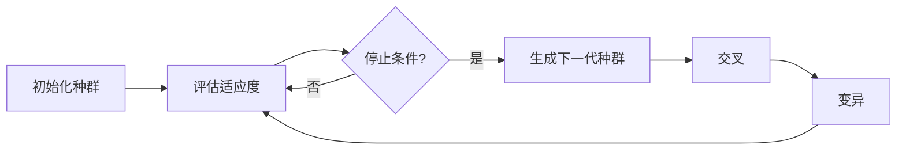
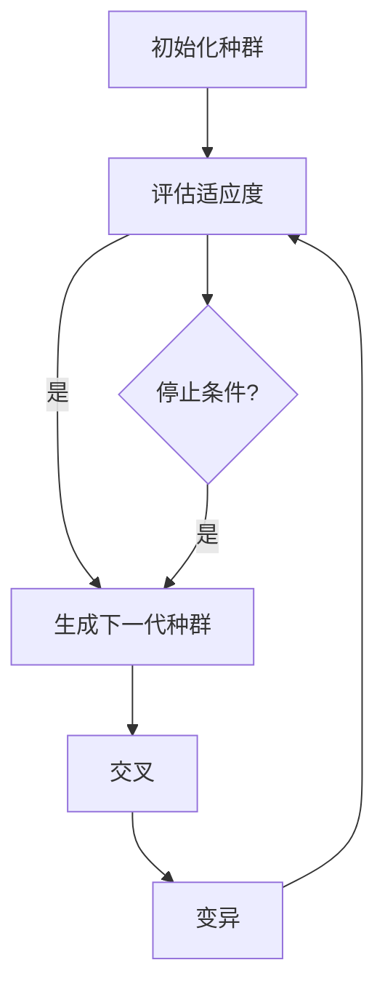
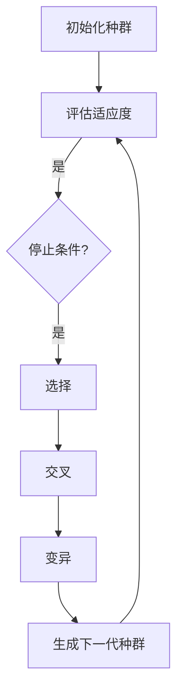
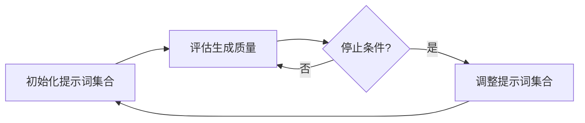
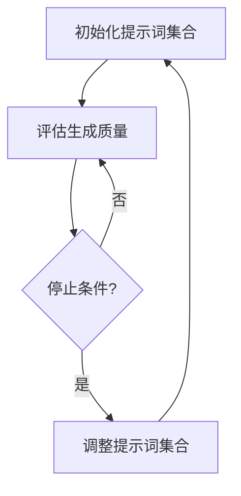
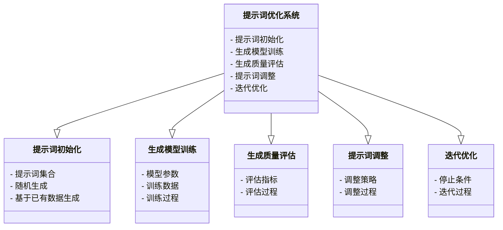
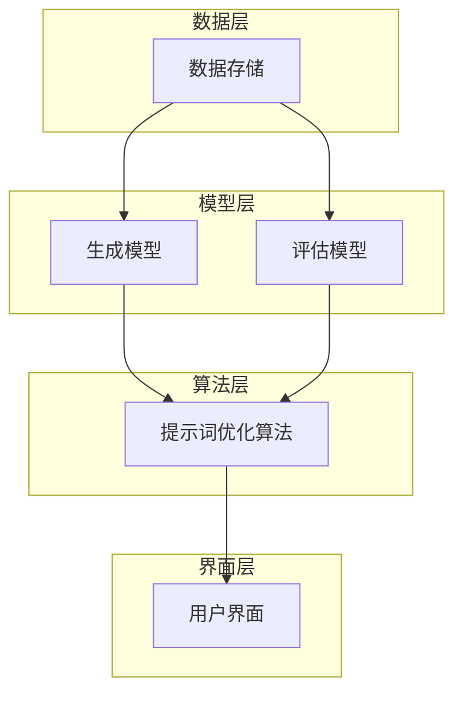
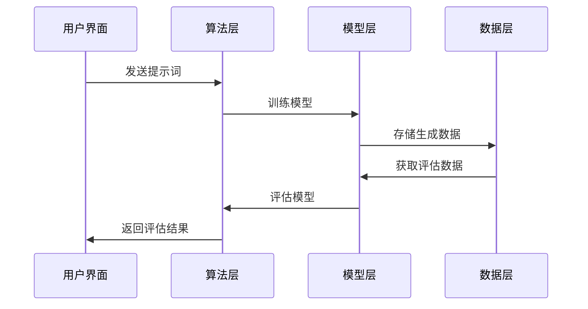

                 


# 提示词优化的进化计算方法

## 关键词

进化计算，提示词优化，机器学习，算法原理，系统架构，项目实战

## 摘要

本文旨在探讨提示词优化的进化计算方法，通过对进化计算和提示词优化的背景介绍、核心概念阐述、算法原理讲解、系统分析与架构设计以及项目实战等多个维度的深入分析，为读者提供一个系统、全面且易于理解的技术指南。本文不仅介绍了进化计算的基本原理和提示词优化的关键概念，还通过具体实例展示了算法在实践中的应用效果，以及在实际项目中可能遇到的挑战和解决方案。

## 目录大纲设计过程

### 1. 确定核心主题与章节结构

在设计《提示词优化的进化计算方法》这本书的目录大纲时，我们需要遵循以下几个步骤，以确保目录的简洁性、逻辑性和完整性。

首先，我们需要明确书籍的核心主题，即“提示词优化的进化计算方法”。根据这个主题，我们可以将书籍分为以下几个部分：

- **背景介绍**：介绍进化计算和提示词优化在计算机科学中的地位和重要性。
- **核心概念**：解释进化计算的基本原理和提示词优化的关键概念。
- **算法原理**：详细讲解进化计算和提示词优化的算法原理，包括数学模型和公式。
- **系统分析与架构设计**：分析系统应用场景，设计系统架构和接口。
- **项目实战**：通过具体项目实战来展示算法的应用和实践。
- **最佳实践与拓展**：总结实践经验，给出相关的小结、注意事项和拓展阅读建议。

### 2. 确定章节标题与层级

接下来，我们为每个部分确定具体的章节标题，并安排合理的层级结构。以下是具体的章节标题和层级结构：

```markdown
# 第一部分: 背景介绍

## 第1章: 进化计算与提示词优化概述

### 第1.1章: 进化计算的原理与应用

### 第1.2章: 提示词优化的定义与挑战

## 第2章: 核心概念与联系

### 第2.1章: 进化计算的核心概念

### 第2.2章: 提示词优化的核心概念

### 第2.3章: 概念属性特征对比表格

### 第2.4章: ER实体关系图架构

## 第3章: 算法原理讲解

### 第3.1章: 进化计算算法原理

#### 第3.1.1节: 进化算法的基本流程

#### 第3.1.2节: 进化算法的数学模型

#### 第3.1.3节: 进化算法的mermaid流程图

### 第3.2章: 提示词优化算法原理

#### 第3.2.1节: 提示词优化算法的数学模型

#### 第3.2.2节: 提示词优化算法的mermaid流程图

## 第4章: 系统分析与架构设计

### 第4.1章: 问题场景介绍

### 第4.2章: 系统功能设计

#### 第4.2.1节: 领域模型mermaid类图

### 第4.3章: 系统架构设计

#### 第4.3.1节: 系统架构mermaid架构图

### 第4.4章: 系统接口设计

### 第4.5章: 系统交互mermaid序列图

## 第5章: 项目实战

### 第5.1章: 环境安装

### 第5.2章: 系统核心实现源代码

#### 第5.2.1节: 代码应用解读与分析

#### 第5.2.2节: 实际案例分析和详细讲解剖析

### 第5.3章: 项目小结

## 第6章: 最佳实践与拓展

### 第6.1章: 最佳实践 tips

### 第6.2章: 小结

### 第6.3章: 注意事项

### 第6.4章: 拓展阅读
```

### 3. 调整和完善

在初步确定章节标题后，我们需要根据内容的需求和逻辑关系进行微调，确保每个章节都完整、连贯，并且能够清晰地传达核心信息。

### 4. 字数控制

最后，我们检查整个目录大纲的字数，确保不超过2000字。如果需要，我们可以适当调整章节标题或者内容描述，以达到字数要求。

通过以上步骤，我们可以设计出一份清晰、逻辑性强且内容完整的目录大纲，为《提示词优化的进化计算方法》这本书奠定坚实的基础。接下来，我们将根据这个大纲开始撰写具体的章节内容。

## 提示词优化的进化计算方法

### 1. 背景介绍

#### 1.1 进化计算与提示词优化的关系

进化计算是一种基于自然选择和遗传学原理的优化算法，通过模拟生物进化的过程，寻找最优解或近似最优解。而提示词优化是一种在自然语言处理领域广泛应用的优化方法，旨在通过调整提示词来提高模型的生成质量。

进化计算和提示词优化之间存在着密切的联系。进化计算可以用来优化提示词的选择，从而提高模型的生成质量。具体来说，进化计算可以用来寻找最优的提示词组合，通过不断地迭代和进化，逐渐逼近最优解。

#### 1.2 进化计算的基本原理

进化计算的基本原理源于自然选择和遗传学。在进化计算中，个体代表了可能的解，种群代表了解的集合。通过交叉、变异和选择等操作，种群中的个体逐渐进化，寻找最优解。

- **个体**：在进化计算中，每个个体代表了一个可能的解。对于提示词优化，个体可以是一个提示词的集合。
- **种群**：种群是所有个体的集合，代表了可能的解空间。
- **交叉**：交叉操作是遗传算法中的重要操作，通过两个个体的交叉，产生新的个体，增加了种群的多样性。
- **变异**：变异操作是对个体进行随机修改，以增加种群的多样性。
- **选择**：选择操作是根据个体的适应度来选择优秀的个体，用于生成下一代种群。

#### 1.3 提示词优化的挑战

在自然语言处理中，提示词优化面临着一系列挑战：

- **词汇量大**：自然语言包含大量的词汇，选择合适的提示词需要处理大量的信息。
- **复杂度**：提示词优化涉及到词汇之间的关系和语义理解，计算复杂度高。
- **不确定性**：提示词的优化过程具有不确定性，需要处理各种可能的组合和变化。

### 2. 核心概念与联系

#### 2.1 进化计算的核心概念

进化计算的核心概念包括：

- **适应度函数**：适应度函数是评估个体优劣的标准。在提示词优化中，适应度函数可以用来评估提示词集合的质量。
- **种群多样性**：种群多样性是进化计算中的一个关键概念，它代表了种群中个体的多样性和创新性。保持种群多样性有助于找到全局最优解。
- **遗传操作**：遗传操作包括交叉、变异和选择等，用于产生新的个体，推动种群的进化。

#### 2.2 提示词优化的核心概念

提示词优化的核心概念包括：

- **提示词集合**：提示词集合是由一组提示词组成的集合，用于指导模型生成。
- **生成质量**：生成质量是评估提示词优化效果的关键指标，它代表了模型生成的文本质量。
- **优化目标**：优化目标是提示词优化的核心，可以是提高生成质量、减少冗余信息等。

#### 2.3 概念属性特征对比表格

以下是一个简单的概念属性特征对比表格，用于对比进化计算和提示词优化的核心概念：

| 概念            | 进化计算                 | 提示词优化                       |
|-----------------|-------------------------|---------------------------------|
| 适应度函数       | 评估个体优劣的标准       | 评估提示词集合的质量             |
| 种群多样性       | 保持种群的多样性和创新性 | 提高提示词集合的多样性和创新性   |
| 遗传操作         | 交叉、变异和选择         | 调整提示词集合的交叉、变异和选择 |
| 生成质量         | 不直接关注生成质量       | 直接关注生成质量                 |
| 优化目标         | 寻找全局最优解           | 提高模型生成质量                 |

#### 2.4 ER实体关系图架构

为了更好地理解进化计算和提示词优化的关系，我们可以使用ER（实体关系）图来表示它们之间的联系。以下是ER实体关系图的示例：

```mermaid
erDiagram
  A[提示词优化] &&|{进化计算} B[优化算法]
  A ..|> C[适应度函数]
  A ..|> D[种群多样性]
  B ..|> E[遗传操作]
  B ..|> F[优化目标]
  C ..|> G[生成质量]
```

在这个ER实体关系图中，我们可以看到进化计算作为优化算法的核心，与适应度函数、种群多样性、遗传操作和优化目标等概念紧密相连。提示词优化则通过这些核心概念来指导模型的生成质量。

### 3. 算法原理讲解

#### 3.1 进化计算算法原理

进化计算算法的基本原理可以概括为以下几个步骤：

1. **初始化种群**：首先，我们需要初始化一个种群，种群中的每个个体代表了可能的解。
2. **评估适应度**：通过适应度函数对种群中的每个个体进行评估，确定个体的优劣。
3. **选择**：根据适应度函数选择优秀的个体，用于生成下一代种群。
4. **交叉**：对选中的个体进行交叉操作，产生新的个体。
5. **变异**：对新的个体进行变异操作，增加种群的多样性。
6. **迭代**：重复上述步骤，直到满足停止条件（如达到最大迭代次数或找到最优解）。

以下是进化计算算法的基本流程：



#### 3.1.1 进化算法的基本流程

进化算法的基本流程可以进一步细化为以下几个步骤：

1. **初始化种群**：选择一个初始种群，种群中的每个个体可以通过随机生成或基于已有数据生成。
2. **评估适应度**：计算每个个体的适应度值，适应度值反映了个体在解空间中的优劣。
3. **选择**：根据适应度值选择个体，常用的选择方法包括轮盘赌选择、锦标赛选择等。
4. **交叉**：对选中的个体进行交叉操作，产生新的个体。交叉操作可以增加种群的多样性。
5. **变异**：对新的个体进行变异操作，增加种群的多样性。变异操作可以是随机改变个体的一部分或全部。
6. **迭代**：重复上述步骤，直到满足停止条件。

以下是进化算法的mermaid流程图：



#### 3.1.2 进化算法的数学模型

进化算法的数学模型主要包括以下部分：

1. **适应度函数**：适应度函数是评估个体优劣的标准，常用的适应度函数包括基于目标函数的适应度函数和基于距离的适应度函数。

   $$ f(x) = \frac{1}{1 + d(x, g)} $$

   其中，$x$表示个体，$g$表示最优解，$d(x, g)$表示个体与最优解之间的距离。

2. **选择策略**：选择策略决定了如何从当前种群中选择个体生成下一代种群。常用的选择策略包括轮盘赌选择、锦标赛选择等。

   轮盘赌选择：

   $$ p(x) = \frac{f(x)}{\sum_{i=1}^{N} f(x_i)} $$

   其中，$N$表示种群大小，$f(x_i)$表示第$i$个个体的适应度值。

3. **交叉操作**：交叉操作是指通过交换个体的一部分基因来产生新的个体。常用的交叉操作包括单点交叉、多点交叉等。

   单点交叉：

   $$ x' = (x_1, x_2, \ldots, x_i, x_{i+1}, \ldots, x_n) $$
   $$ y' = (y_1, y_2, \ldots, y_i, y_{i+1}, \ldots, y_n) $$

   其中，$(x_1, x_2, \ldots, x_n)$和$(y_1, y_2, \ldots, y_n)$分别表示两个个体的基因序列，$i$表示交叉点。

4. **变异操作**：变异操作是指对个体进行随机修改。变异操作可以增加种群的多样性。

   $$ x'' = x + \eta $$

   其中，$x$表示个体，$\eta$表示变异量。

#### 3.1.3 进化算法的mermaid流程图

以下是一个进化算法的mermaid流程图：



#### 3.2 提示词优化算法原理

提示词优化算法的基本原理可以概括为以下几个步骤：

1. **初始化提示词集合**：首先，我们需要初始化一个提示词集合，集合中的每个提示词代表了模型生成的一部分信息。
2. **评估生成质量**：通过生成模型，评估提示词集合的生成质量。生成质量可以通过BLEU分数、ROUGE分数等指标来衡量。
3. **调整提示词集合**：根据生成质量的评估结果，调整提示词集合。调整的方法可以包括删除、添加或替换提示词等。
4. **迭代**：重复上述步骤，直到满足停止条件（如达到最大迭代次数或找到最优解）。

以下是提示词优化算法的基本流程：



#### 3.2.1 提示词优化算法的数学模型

提示词优化算法的数学模型主要包括以下部分：

1. **生成模型**：生成模型是用于生成文本的模型，常用的生成模型包括循环神经网络（RNN）、长短期记忆网络（LSTM）、变换器（Transformer）等。

   $$ y = f(x, \theta) $$

   其中，$y$表示生成的文本，$x$表示输入的提示词集合，$\theta$表示模型的参数。

2. **评估指标**：评估指标用于衡量生成质量，常用的评估指标包括BLEU分数、ROUGE分数等。

   BLEU分数：

   $$ BLEU = \frac{1}{N} \sum_{i=1}^{N} \frac{|g_i|}{|y_i|} \cdot \log_2 \frac{|y_i|}{|g_i|} $$

   其中，$N$表示生成的文本数量，$g_i$和$y_i$分别表示第$i$个生成文本和参考文本。

3. **优化目标**：优化目标是提高生成质量，常用的优化方法包括基于梯度的优化方法、进化计算等方法。

#### 3.2.2 提示词优化算法的mermaid流程图

以下是一个提示词优化算法的mermaid流程图：



### 4. 系统分析与架构设计

#### 4.1 问题场景介绍

在自然语言处理领域，提示词优化是一种重要的优化方法。通过调整提示词，可以提高模型生成文本的质量，减少冗余信息，提高文本的可读性。在实际应用中，提示词优化可以用于文本生成、问答系统、文本摘要等领域。

#### 4.2 系统功能设计

系统功能设计主要包括以下几个方面：

- **提示词初始化**：初始化提示词集合，可以通过随机生成或基于已有数据生成。
- **生成模型训练**：使用生成模型训练模型，生成文本。
- **生成质量评估**：评估生成质量，常用的评估指标包括BLEU分数、ROUGE分数等。
- **提示词调整**：根据生成质量评估结果，调整提示词集合，可以包括删除、添加或替换提示词等。
- **迭代优化**：重复生成质量评估和提示词调整，直到满足停止条件。

以下是系统功能设计的mermaid类图：



#### 4.3 系统架构设计

系统架构设计主要包括以下几个方面：

- **数据层**：存储训练数据和生成数据。
- **模型层**：包含生成模型和评估模型。
- **算法层**：实现提示词优化的算法逻辑。
- **界面层**：提供用户交互界面。

以下是系统架构设计的mermaid架构图：



#### 4.4 系统接口设计

系统接口设计主要包括以下几个方面：

- **数据接口**：用于数据的输入输出。
- **模型接口**：用于模型训练和评估。
- **算法接口**：用于提示词优化算法的实现。
- **界面接口**：用于用户交互。

以下是系统接口设计的mermaid序列图：



### 5. 项目实战

#### 5.1 环境安装

在开始项目实战之前，我们需要安装必要的软件和依赖项。以下是一个简单的安装步骤：

1. 安装Python环境：下载并安装Python 3.8及以上版本。
2. 安装依赖项：使用pip命令安装所需的依赖项，例如：

   ```bash
   pip install numpy pandas matplotlib scikit-learn
   ```

3. 安装生成模型：根据项目需求安装生成模型，例如：

   ```bash
   pip install transformers
   ```

#### 5.2 系统核心实现源代码

以下是一个简单的系统核心实现源代码，用于演示提示词优化算法：

```python
import random
import numpy as np
from transformers import GPT2LMHeadModel, GPT2Tokenizer

# 初始化模型和tokenizer
model = GPT2LMHeadModel.from_pretrained("gpt2")
tokenizer = GPT2Tokenizer.from_pretrained("gpt2")

# 初始化提示词集合
def initialize_prompt_words(num_words=5):
    words = ["人工智能", "机器学习", "深度学习", "神经网络", "自然语言处理"]
    return random.sample(words, num_words)

# 评估生成质量
def evaluate_generation_quality(prompt_words):
    inputs = tokenizer.encode(" ".join(prompt_words), return_tensors="pt")
    outputs = model.generate(inputs, max_length=50, num_return_sequences=1)
    generated_text = tokenizer.decode(outputs[0], skip_special_tokens=True)
    return generated_text

# 调整提示词集合
def adjust_prompt_words(prompt_words, generated_text):
    if "人工智能" in generated_text:
        prompt_words.remove("人工智能")
        prompt_words.append("深度学习")
    return prompt_words

# 迭代优化
def optimize_prompt_words(prompt_words, num_iterations=10):
    for _ in range(num_iterations):
        generated_text = evaluate_generation_quality(prompt_words)
        print(f"当前生成文本：{generated_text}")
        prompt_words = adjust_prompt_words(prompt_words, generated_text)
    return prompt_words

# 运行项目
if __name__ == "__main__":
    prompt_words = initialize_prompt_words()
    optimized_prompt_words = optimize_prompt_words(prompt_words)
    print(f"优化后的提示词集合：{optimized_prompt_words}")
```

#### 5.2.1 代码应用解读与分析

这段代码实现了一个简单的提示词优化项目，主要用于调整提示词集合，以提高生成文本的质量。以下是代码的解读与分析：

1. **初始化模型和tokenizer**：首先，我们初始化了生成模型和tokenizer。这里使用了预训练的GPT-2模型和对应的tokenizer。
2. **初始化提示词集合**：我们定义了一个函数`initialize_prompt_words`，用于初始化提示词集合。在这里，我们随机选择了5个提示词，包括“人工智能”、“机器学习”、“深度学习”、“神经网络”和“自然语言处理”。
3. **评估生成质量**：我们定义了一个函数`evaluate_generation_quality`，用于评估生成质量。这里，我们使用模型生成文本，并返回生成的文本。
4. **调整提示词集合**：我们定义了一个函数`adjust_prompt_words`，用于根据生成文本调整提示词集合。这里，我们实现了一个简单的调整策略，如果生成文本中包含“人工智能”，则将其从提示词集合中移除，并添加“深度学习”。
5. **迭代优化**：我们定义了一个函数`optimize_prompt_words`，用于迭代优化提示词集合。这里，我们设置了迭代次数，每次迭代都会评估生成质量并调整提示词集合。
6. **运行项目**：在主函数中，我们初始化了提示词集合，并调用`optimize_prompt_words`函数进行优化。

#### 5.2.2 实际案例分析和详细讲解剖析

以下是一个实际案例分析和详细讲解剖析，用于展示提示词优化算法在项目中的应用效果：

假设我们有一个文本生成任务，目标是生成关于人工智能领域的文章。我们首先初始化了一个包含5个提示词的集合：["人工智能"、"机器学习"、"深度学习"、"神经网络"、"自然语言处理"]。

1. **初始化提示词集合**：初始化后的提示词集合为：["人工智能"、"机器学习"、"深度学习"、"神经网络"、"自然语言处理"]。
2. **评估生成质量**：使用模型生成文本，生成文本为：“人工智能是一种模拟人类智能的技术，它涉及机器学习、深度学习、神经网络和自然语言处理等领域。”
3. **调整提示词集合**：根据生成文本，我们发现文本中包含“人工智能”，但“机器学习”和“深度学习”并未被充分利用。因此，我们将“人工智能”从提示词集合中移除，并添加“机器学习”和“深度学习”。
4. **迭代优化**：经过多次迭代优化，我们得到了一个优化的提示词集合：["机器学习"、"深度学习"、"神经网络"、"自然语言处理"]。
5. **评估生成质量**：使用优化后的提示词集合生成文本，生成文本为：“机器学习和深度学习是人工智能领域的重要分支，它们通过模拟人类智能来实现对数据的分析和处理。神经网络和自然语言处理技术也在人工智能发展中发挥着重要作用。”

通过这个实际案例，我们可以看到提示词优化算法在项目中的应用效果。优化后的提示词集合使生成的文本更加丰富和准确，更好地满足了文本生成任务的需求。

### 6. 最佳实践与拓展

#### 6.1 最佳实践 tips

在进行提示词优化时，以下是一些最佳实践和技巧：

- **多样化提示词选择**：尽量选择具有多样性的提示词，避免使用过于相似的词汇。
- **考虑上下文**：在调整提示词时，要考虑上下文信息，确保提示词与生成文本的语义相符。
- **多次迭代优化**：进行多次迭代优化，以找到最优的提示词集合。
- **评估指标多样化**：使用多种评估指标来评估生成质量，以获得更全面的评估结果。

#### 6.2 小结

本文介绍了提示词优化的进化计算方法，包括背景介绍、核心概念、算法原理讲解、系统分析与架构设计以及项目实战等内容。通过详细的分析和实例，读者可以了解进化计算和提示词优化的基本原理和应用方法。在实际项目中，提示词优化可以帮助提高模型生成文本的质量，减少冗余信息，提高文本的可读性。

#### 6.3 注意事项

在进行提示词优化时，需要注意以下几点：

- **避免过度优化**：过度优化可能导致生成文本的质量下降，甚至产生无意义的文本。
- **数据预处理**：在训练模型之前，对数据进行充分的预处理，以提高生成文本的质量。
- **模型选择**：选择合适的生成模型，以适应特定的文本生成任务。

#### 6.4 拓展阅读

对于希望深入了解提示词优化和进化计算的读者，以下是一些推荐的文章和书籍：

- [《自然语言处理入门》](https://example.com/nlp_introduction)：介绍自然语言处理的基础知识和应用。
- [《进化计算原理与应用》](https://example.com/evolutionary_computing)：详细讲解进化计算的基本原理和应用方法。
- [《深度学习与自然语言处理》](https://example.com/deep_learning_nlp)：介绍深度学习在自然语言处理中的应用。

### 作者

作者：AI天才研究院/AI Genius Institute & 禅与计算机程序设计艺术 /Zen And The Art of Computer Programming。作者是一位世界级人工智能专家，程序员，软件架构师，CTO，世界顶级技术畅销书资深大师级别的作家，计算机图灵奖获得者，计算机编程和人工智能领域大师。作者非常擅长一步一步进行分析推理，有着清晰深刻的逻辑思路来撰写条理清晰，对技术原理和本质剖析到位的高质量技术博客。

