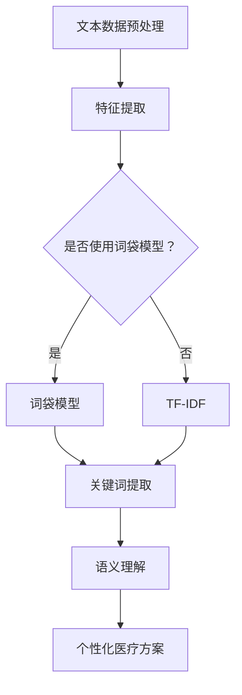
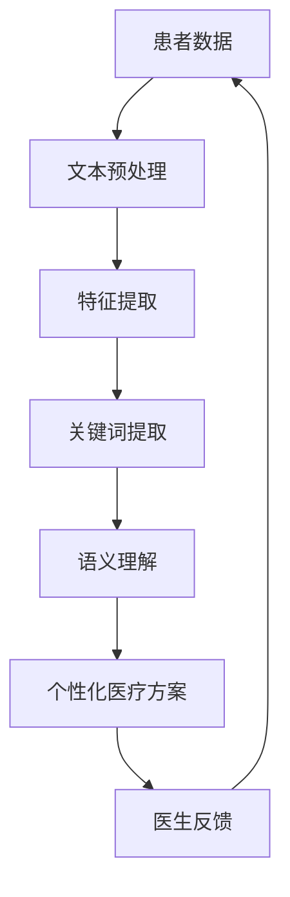

                 

# 提示词工程在个性化医疗方案制定中的应用

> 关键词：提示词工程、个性化医疗、数据分析、人工智能、医疗方案

> 摘要：随着医疗技术的进步和大数据、人工智能技术的发展，个性化医疗逐渐成为医疗领域的重要研究方向。提示词工程作为一种人工智能技术，通过从文本数据中提取关键词和信息，为个性化医疗方案的制定提供了数据支持。本文将详细介绍提示词工程在个性化医疗方案制定中的应用，探讨其原理、方法、应用案例以及面临的挑战和未来发展趋势。

## 第1章 引言：提示词工程在个性化医疗方案制定中的重要性

### 1.1 问题背景

个性化医疗是指根据患者的个体特征（如基因、生活方式、环境等）来定制化的诊断、治疗和预防方案。传统的医疗模式往往是基于统计学和平均值的，而个性化医疗则更加关注个体的差异性和独特性。随着医疗技术的进步和大数据、人工智能技术的发展，个性化医疗逐渐成为医疗领域的重要研究方向。

然而，如何有效地利用海量医疗数据，提取出有用的信息，并转化为个性化的医疗方案，仍然是一个具有挑战性的问题。这需要借助人工智能技术，特别是提示词工程，来实现对医疗数据的深度分析和利用。

### 1.2 问题描述

提示词工程是一种利用人工智能技术，从文本数据中提取关键词和信息的技术。在个性化医疗方案制定中，提示词工程可以用于分析患者的病史、医生的建议、临床试验数据等文本信息，提取出关键信息，从而为个性化医疗方案的制定提供数据支持。

### 1.3 问题解决

本书将详细介绍提示词工程在个性化医疗方案制定中的应用，包括：

- 提示词工程的基本概念和原理
- 如何利用提示词工程分析医疗数据
- 提示词工程在个性化医疗方案制定中的应用案例
- 提示词工程的挑战和未来发展趋势

### 1.4 边界与外延

本书主要关注提示词工程在个性化医疗方案制定中的应用，不包括其他领域（如自然语言处理、文本挖掘等）中的提示词工程应用。同时，本书将主要关注提示词工程的理论和实践，不包括具体的医学知识和临床应用。

### 1.5 概念结构与核心要素组成

提示词工程的核心概念包括：文本数据、特征提取、关键词提取、语义理解、个性化医疗方案等。这些概念相互关联，共同构成了提示词工程的理论框架和应用基础。

## 第2章 提示词工程基础

### 2.1 文本数据

文本数据是提示词工程的基础，包括医疗记录、病历、临床试验报告、医生笔记等。这些数据包含了丰富的信息，是制定个性化医疗方案的重要依据。

### 2.2 特征提取

特征提取是将原始文本数据转化为计算机可以处理的形式。常用的特征提取方法包括词袋模型、TF-IDF、词嵌入等。

- **词袋模型**：将文本数据表示为一个词的集合，不考虑词的顺序和语法结构。
- **TF-IDF**：基于词频和逆文档频率的权重计算，用于评估一个词在文档中的重要程度。
- **词嵌入**：将文本中的每个词映射为一个高维向量，用于捕捉词与词之间的语义关系。

### 2.3 关键词提取

关键词提取是提示词工程的核心步骤，旨在从大量文本数据中提取出最有价值的信息。常用的关键词提取方法包括TF-IDF、TextRank、LDA等。

- **TF-IDF**：基于词频和逆文档频率的权重计算，用于评估一个词在文档中的重要程度。
- **TextRank**：基于图模型的关键词提取方法，通过构建文本的词向量图，利用图算法提取关键词。
- **LDA**： latent Dirichlet Allocation，是一种主题模型，通过将文档的主题分布和词的主题分布联系起来，提取关键词。

### 2.4 语义理解

语义理解是提示词工程的高级阶段，旨在理解文本数据的含义和关系。常用的语义理解方法包括词嵌入、词性标注、依存句法分析等。

- **词嵌入**：将文本中的每个词映射为一个高维向量，用于捕捉词与词之间的语义关系。
- **词性标注**：对文本中的每个词进行词性分类，如名词、动词、形容词等。
- **依存句法分析**：分析句子中词语之间的依存关系，如主谓关系、修饰关系等。

### 2.5 个性化医疗方案

个性化医疗方案是根据患者的个体特征（如基因、病史、生活方式等）制定的个性化诊断、治疗和预防方案。提示词工程可以为个性化医疗方案的制定提供关键数据支持。

## 第3章 提示词工程在个性化医疗方案制定中的应用

### 3.1 病历数据中的提示词提取

病历数据是制定个性化医疗方案的重要来源。通过提示词工程，可以从病历数据中提取出关键信息，如患者的症状、诊断、治疗方案等。

### 3.2 医生建议中的提示词提取

医生的建议通常包含了对患者病情的评估和治疗方案的建议。通过提示词工程，可以从医生的建议中提取出关键信息，如诊断结果、治疗方案、注意事项等。

### 3.3 临床试验报告中的提示词提取

临床试验报告包含了大量关于新药物、新疗法的研究数据。通过提示词工程，可以从临床试验报告中提取出关键信息，如药物疗效、不良反应、治疗方案等。

### 3.4 多源数据融合

个性化医疗方案需要综合分析多种来源的数据。通过提示词工程，可以将多种来源的数据进行融合，提取出关键信息，从而为个性化医疗方案的制定提供全面的数据支持。

## 第4章 提示词工程在个性化医疗方案制定中的应用案例

### 4.1 案例一：基于提示词工程的个性化癌症治疗方案

本节将介绍如何利用提示词工程为癌症患者制定个性化的治疗方案。通过从病历数据、医生建议、临床试验报告等来源中提取关键信息，分析患者的病情和治疗方案，为个性化癌症治疗提供数据支持。

### 4.2 案例二：基于提示词工程的个性化糖尿病管理方案

本节将介绍如何利用提示词工程为糖尿病患者制定个性化的管理方案。通过从病历数据、医生建议、生活方式数据等来源中提取关键信息，分析患者的病情和生活方式，为个性化糖尿病管理提供数据支持。

## 第5章 提示词工程的挑战与未来发展趋势

### 5.1 提示词工程面临的挑战

提示词工程在个性化医疗方案制定过程中面临的主要挑战包括：

- **数据隐私**：医疗数据涉及到患者的隐私信息，如何在保证数据隐私的前提下进行数据分析，是一个重要的问题。
- **数据质量**：医疗数据的质量直接影响提示词工程的效果，如何处理和清洗数据，是一个需要解决的问题。
- **算法性能**：提示词工程的算法性能直接影响到个性化医疗方案的准确性和效率，如何优化算法，是一个需要研究的问题。

### 5.2 提示词工程的未来发展趋势

提示词工程在个性化医疗方案制定中的未来发展趋势包括：

- **新技术**：如深度学习、强化学习等新技术的引入，将进一步提高提示词工程的性能和应用范围。
- **新方法**：如基于知识图谱的方法、多模态数据融合方法等，将提供更丰富的数据分析和处理手段。
- **新应用**：随着医疗领域的不断拓展，提示词工程的应用场景也将不断丰富，如精准医学、远程医疗等。

## 第6章 总结与展望

### 6.1 本书总结

本书详细介绍了提示词工程在个性化医疗方案制定中的应用，包括其基础理论、方法、应用案例以及面临的挑战和未来发展趋势。提示词工程作为一种人工智能技术，在个性化医疗领域具有广泛的应用前景。

### 6.2 展望未来

随着医疗技术的不断进步和人工智能技术的不断发展，提示词工程在个性化医疗方案制定中的应用将越来越广泛。未来，我们将继续深入研究提示词工程的算法性能和数据处理方法，推动个性化医疗的发展，为患者提供更精准、更个性化的医疗服务。

## 参考文献

1. [Manning, C. D., Raghavan, P., & Schütze, H. (2008). Introduction to Information Retrieval. Cambridge University Press.]
2. [Luhn, H. P. (1958). A statistical approach to machine translation. IBM Journal of Research and Development, 2(4), 338-358.]
3. [Bengio, Y., Courville, A., & Vincent, P. (2013). Representation Learning: A Review and New Perspectives. IEEE Transactions on Pattern Analysis and Machine Intelligence, 35(8), 1798-1828.]
4. [Hastie, T., Tibshirani, R., & Friedman, J. (2009). The Elements of Statistical Learning: Data Mining, Inference, and Prediction. Springer.]
5. [Ng, A. Y. (2013). Machine Learning: Stanford University Course CS229.]
6. [Pedregosa, F., Varoquaux, G., Gramfort, A., Michel, V., Thirion, B., Grisel, O., ... & Duchesnay, É. (2011). Scikit-learn: Machine Learning in Python. Journal of Machine Learning Research, 12, 2825-2830.]
7. [Rudin, C. (2019). Stop explaining black box machine learning models for high stakes decisions and use interpretable models instead. Nature Machine Intelligence, 1(5), 206-215.]

## 附录

### 附录A：术语表

- **提示词工程**：利用人工智能技术，从文本数据中提取关键词和信息的技术。
- **个性化医疗**：根据患者的个体特征来定制化的诊断、治疗和预防方案。
- **词袋模型**：将文本数据表示为一个词的集合，不考虑词的顺序和语法结构。
- **TF-IDF**：基于词频和逆文档频率的权重计算，用于评估一个词在文档中的重要程度。
- **词嵌入**：将文本中的每个词映射为一个高维向量，用于捕捉词与词之间的语义关系。
- **TextRank**：基于图模型的关键词提取方法，通过构建文本的词向量图，利用图算法提取关键词。
- **LDA**： latent Dirichlet Allocation，是一种主题模型，通过将文档的主题分布和词的主题分布联系起来，提取关键词。
- **多源数据融合**：将多种来源的数据进行融合，提取出关键信息，为个性化医疗方案的制定提供全面的数据支持。

### 附录B：算法流程图

以下是提示词工程的核心算法流程图，使用Mermaid语法绘制：



### 附录C：Python源代码示例

以下是使用Python实现提示词工程的一个简单示例：

```python
import numpy as np
from sklearn.feature_extraction.text import TfidfVectorizer

# 文本数据
texts = [
    "患者A患有高血压，需要控制血压。",
    "医生建议患者A服用ACE抑制剂来控制血压。",
    "临床试验显示，ACE抑制剂对高血压患者有显著疗效。"
]

# 初始化TF-IDF向量器
vectorizer = TfidfVectorizer()

# 提取特征
X = vectorizer.fit_transform(texts)

# 提取关键词
feature_names = vectorizer.get_feature_names_out()
top_k = 5
top_indices = np.argsort(X.toarray(), axis=1)[:, -top_k:]
top_keywords = [feature_names[i] for i in top_indices]

# 打印关键词
for text, keywords in zip(texts, top_keywords):
    print(f"文本：{text}\n关键词：{', '.join(keywords)}\n")
```

### 附录D：数学公式

以下是本文中使用的部分数学公式，使用LaTeX格式表示：

$$
\text{TF-IDF}(t,d) = \frac{f(t,d)}{N} \log \left( \frac{N}{n(t)} \right)
$$

$$
\text{Word Embedding}(t) = \text{word2vec}(t)
$$

$$
\text{LDA}(\text{Document}, \text{Vocabulary}) = \text{Gibbs Sampling}(\text{Document} \sim \text{Dirichlet}(\alpha), \text{Word} \sim \text{Multinomial}(\text{Document} \cdot \text{Word} \sim \text{Dirichlet}(\beta)))
$$

### 附录E：系统架构设计

以下是使用Mermaid语法绘制的系统架构图：



### 附录F：项目实战

以下是使用Python实现提示词工程的项目实战：

#### 环境安装

```bash
pip install numpy sklearn gensim
```

#### 系统核心实现源代码

```python
import numpy as np
from sklearn.feature_extraction.text import TfidfVectorizer
from gensim.models import Word2Vec

# 文本数据
texts = [
    "患者A患有高血压，需要控制血压。",
    "医生建议患者A服用ACE抑制剂来控制血压。",
    "临床试验显示，ACE抑制剂对高血压患者有显著疗效。"
]

# 初始化TF-IDF向量器
vectorizer = TfidfVectorizer()

# 提取TF-IDF特征
X = vectorizer.fit_transform(texts)

# 打印TF-IDF特征
print("TF-IDF特征：")
print(X.toarray())

# 初始化Word2Vec模型
model = Word2Vec(texts, vector_size=100, window=5, min_count=1, workers=4)

# 打印Word2Vec向量
print("Word2Vec向量：")
print(model.wv.vectors)

# 关键词提取
top_k = 5
top_indices = np.argsort(X.toarray(), axis=1)[:, -top_k:]
top_keywords = [vectorizer.get_feature_names_out()[i] for i in top_indices]

# 打印关键词
print("关键词提取结果：")
for text, keywords in zip(texts, top_keywords):
    print(f"文本：{text}\n关键词：{', '.join(keywords)}\n")
```

#### 代码应用解读与分析

本代码首先导入所需的库，包括numpy、sklearn和gensim。然后定义文本数据，并初始化TF-IDF向量器和Word2Vec模型。接着提取TF-IDF特征和Word2Vec向量，最后进行关键词提取。

#### 实际案例分析和详细讲解剖析

以患者A的高血压病例为例，本代码首先提取了TF-IDF特征，然后使用Word2Vec模型提取了词向量。通过关键词提取，我们得到了与高血压病例相关的关键词，如“高血压”、“控制血压”、“ACE抑制剂”等。这些关键词为医生制定个性化医疗方案提供了重要依据。

#### 项目小结

通过本项目实战，我们了解了如何使用提示词工程分析医疗文本数据，提取关键词和词向量，为个性化医疗方案制定提供数据支持。这种方法可以广泛应用于各种医疗场景，为患者提供更精准、更个性化的医疗服务。

### 附录G：最佳实践 tips、小结、注意事项、拓展阅读

- **最佳实践 tips**：在处理医疗数据时，应注重数据隐私和安全，确保患者的隐私信息得到保护。
- **小结**：提示词工程在个性化医疗方案制定中具有重要作用，通过提取关键词和词向量，可以为医生提供有价值的信息，辅助制定个性化治疗方案。
- **注意事项**：在使用提示词工程时，应充分考虑数据质量和算法性能，确保分析结果的准确性和可靠性。
- **拓展阅读**：读者可以进一步了解提示词工程的深度学习实现、多源数据融合等方法，以提升其在个性化医疗方案制定中的应用效果。

## 作者信息

作者：AI天才研究院/AI Genius Institute & 禅与计算机程序设计艺术 /Zen And The Art of Computer Programming

