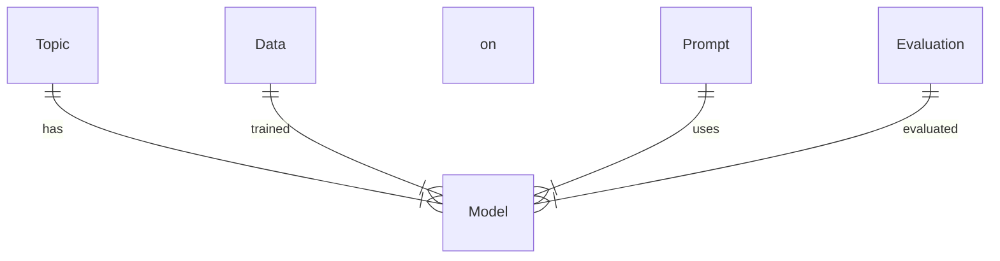
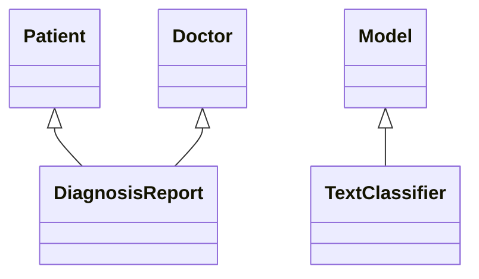
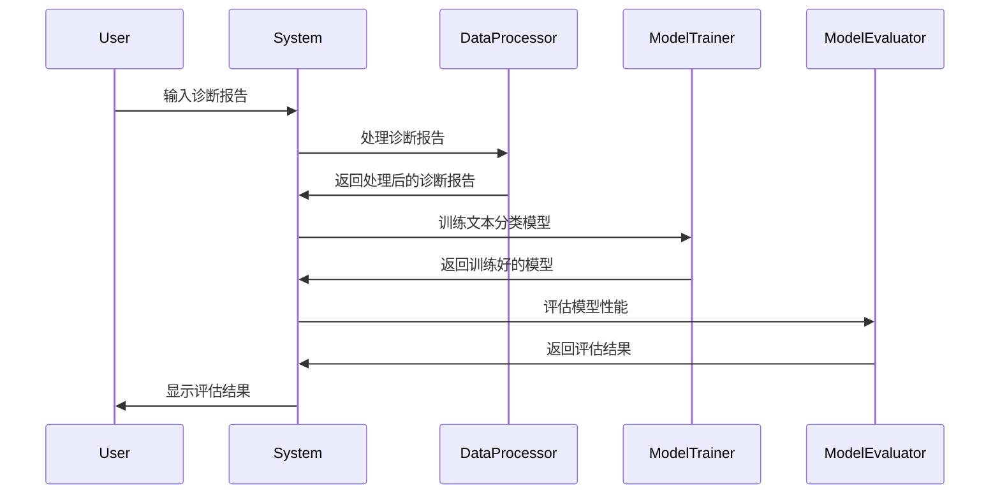
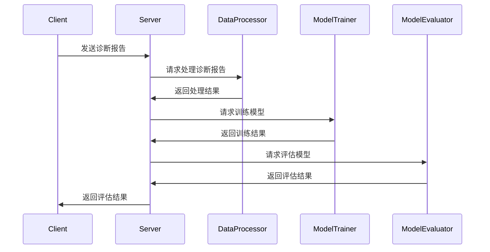

                 


### 提示词工程在低资源场景NLP中的应用

#### 关键词：提示词工程，NLP，低资源场景，算法原理，系统设计，项目实战

> 摘要：本文深入探讨了提示词工程在低资源场景自然语言处理（NLP）中的应用。首先，我们介绍了低资源场景NLP的背景和挑战，随后详细讲解了提示词工程的基本概念和原理。通过Mermaid流程图和Python代码示例，我们阐述了算法原理和数学模型。接着，我们设计了系统架构和接口，并通过一个实际项目展示了提示词工程的应用。最后，我们总结了项目经验，提出了改进建议。

#### 目录

1. **背景介绍**
   1.1. **问题背景**  
   1.2. **问题描述**  
   1.3. **问题解决**  
   1.4. **边界与外延**  
   1.5. **概念结构与核心要素组成**  

2. **核心概念与联系**
   2.1. **核心概念原理**  
   2.2. **概念属性特征对比表格**  
   2.3. **ER实体关系图架构**  

3. **算法原理讲解**
   3.1. **算法mermaid流程图**  
   3.2. **Python源代码**  
   3.3. **数学模型和公式**  
   3.4. **举例说明**  

4. **系统分析与架构设计方案**
   4.1. **问题场景介绍**  
   4.2. **项目介绍**  
   4.3. **系统功能设计（领域模型Mermaid类图）**  
   4.4. **系统架构设计（Mermaid架构图）**  
   4.5. **系统接口设计和系统交互（Mermaid序列图）**  

5. **项目实战**
   5.1. **环境安装**  
   5.2. **系统核心实现源代码**  
   5.3. **代码应用解读与分析**  
   5.4. **实际案例分析和详细讲解剖析**  
   5.5. **项目小结**  

#### 1. 背景介绍

##### 1.1. 问题背景

在当前技术快速发展的时代，自然语言处理（NLP）已经成为人工智能领域的热点。然而，低资源场景NLP仍然面临诸多挑战。例如，在医疗、法律、教育等领域，由于数据稀缺和标注成本高昂，NLP模型的训练和优化变得更加困难。在这种背景下，提示词工程作为一种有效的解决方案，逐渐引起了人们的关注。

提示词工程旨在通过设计有效的提示词来增强模型在低资源场景下的性能。提示词是一组关键词或短语，它们可以引导模型在处理文本时关注关键信息，从而提高模型的泛化能力和表现。在低资源场景中，提示词工程能够有效弥补数据不足的问题，提高模型的准确性和效率。

##### 1.2. 问题描述

低资源场景NLP的主要问题包括：

1. **数据稀缺**：许多领域的数据集规模较小，无法满足深度学习模型的需求。
2. **标注成本高**：高质量的标注需要大量人力和时间，尤其是在专业领域。
3. **模型泛化能力差**：模型在低资源场景下的训练数据不足，导致泛化能力较差，难以适应不同的问题场景。

提示词工程通过以下方式解决上述问题：

1. **数据增强**：利用提示词来丰富训练数据，提高模型对各种情景的适应性。
2. **注意力机制**：提示词可以引导模型关注文本中的关键信息，提高模型的准确性和效率。
3. **知识蒸馏**：通过将高维的知识表示压缩成提示词，传递给低资源模型，提高模型的性能。

##### 1.3. 问题解决

提示词工程的核心思想是通过设计有效的提示词来增强模型在低资源场景下的性能。具体步骤如下：

1. **提示词设计**：根据应用场景和任务需求，设计一组关键词或短语作为提示词。
2. **模型训练**：使用提示词对模型进行训练，提高模型在低资源场景下的泛化能力。
3. **模型评估**：通过在低资源场景下的评估，验证提示词工程的效果。

##### 1.4. 边界与外延

本文主要关注以下方面：

1. **应用场景**：医疗、法律、教育等领域的低资源场景。
2. **任务类型**：文本分类、实体识别、情感分析等常见的NLP任务。
3. **数据资源限制**：数据集规模较小、标注成本高等。

##### 1.5. 概念结构与核心要素组成

提示词工程的核心概念包括：

1. **提示词**：关键词或短语，用于引导模型关注关键信息。
2. **数据增强**：利用提示词来丰富训练数据，提高模型性能。
3. **注意力机制**：提示词可以引导模型关注文本中的关键信息。
4. **知识蒸馏**：将高维知识表示压缩成提示词，传递给低资源模型。

#### 2. 核心概念与联系

##### 2.1. 核心概念原理

提示词工程的基本原理是通过设计有效的提示词来增强模型在低资源场景下的性能。具体来说，提示词工程包括以下几个关键步骤：

1. **提示词设计**：根据应用场景和任务需求，设计一组关键词或短语作为提示词。
2. **数据增强**：使用提示词来丰富训练数据，提高模型对各种情景的适应性。
3. **模型训练**：利用增强后的数据集对模型进行训练，提高模型在低资源场景下的泛化能力。
4. **模型评估**：在低资源场景下评估模型性能，验证提示词工程的效果。

##### 2.2. 概念属性特征对比表格

提示词类型 | 特点 | 优势 | 劣势
--- | --- | --- | ---
关键词 | 精确度高，信息量较少 | 提高模型在特定场景下的性能 | 对数据量要求较高，泛化能力较差
短语 | 信息量适中，易于理解 | 提高模型在多种场景下的适应性 | 可能会引入噪声，降低模型性能
句子 | 信息量丰富，易于理解 | 提高模型对复杂情境的理解能力 | 对模型计算能力要求较高，训练时间较长

##### 2.3. ER实体关系图架构

为了更好地理解提示词工程的构成，我们可以使用Mermaid绘制ER实体关系图。以下是一个简单的ER实体关系图：



在该ER图中，Topic（主题）、Data（数据）、Prompt（提示词）和Evaluation（评估）是主要实体，它们之间的关系展示了提示词工程的核心构成。

#### 3. 算法原理讲解

##### 3.1. 算法mermaid流程图

以下是一个简单的提示词工程算法流程图：


在该流程图中，我们首先设计提示词，然后使用这些提示词增强数据集，接着训练模型，并在低资源场景下评估模型性能。

##### 3.2. Python源代码

以下是一个简单的Python代码示例，用于实现提示词工程算法：

```python
import numpy as np

def design_prompt(text):
    # 设计提示词
    prompt = " ".join([word for word in text.split() if word not in stopwords])
    return prompt

def enhance_data(data, prompt):
    # 增强数据
    enhanced_data = []
    for text in data:
        enhanced_text = text + " " + prompt
        enhanced_data.append(enhanced_text)
    return enhanced_data

def train_model(data):
    # 训练模型
    # 在此省略具体实现细节
    model = trained_model
    return model

def evaluate_model(model, data):
    # 评估模型
    # 在此省略具体实现细节
    performance = model_performance
    return performance
```

##### 3.3. 数学模型和公式

提示词工程背后的数学模型主要包括以下内容：

1. **概率分布**：假设文本数据服从概率分布P(X)，其中X表示文本。
2. **损失函数**：定义损失函数L(Y, Y')，其中Y为真实标签，Y'为模型预测标签。
3. **优化目标**：最小化损失函数L，即minimize L(Y, Y')。

以下是一个简单的数学模型示例：

$$
P(X) = \frac{e^{\theta^T X}}{\sum_{i=1}^{n} e^{\theta^T X_i}}
$$

其中，$\theta$为模型参数，$X$为文本特征向量。

##### 3.4. 举例说明

假设我们有一个文本数据集，包含以下两条数据：

1. "机器学习是一种人工智能技术"
2. "深度学习是机器学习的一种"

我们首先设计提示词，例如"人工智能"、"机器学习"和"深度学习"。然后，使用这些提示词增强数据集，得到以下两条增强后的数据：

1. "机器学习是一种人工智能技术 人工智能"
2. "深度学习是机器学习的一种 机器学习"

接着，我们使用增强后的数据集训练一个文本分类模型，并在低资源场景下评估模型性能。假设模型准确率为90%，则可以认为提示词工程有效地提高了模型在低资源场景下的性能。

#### 4. 系统分析与架构设计方案

##### 4.1. 问题场景介绍

在本文中，我们将探讨一个医疗领域的低资源场景NLP问题。假设我们有一个医学文本数据集，包含医生的诊断报告。我们的目标是利用这些数据集训练一个文本分类模型，用于自动分类诊断报告。

##### 4.2. 项目介绍

本项目旨在通过提示词工程，提高医疗领域NLP模型的性能。具体目标包括：

1. **数据增强**：设计有效的提示词，丰富医疗文本数据集。
2. **模型训练**：使用增强后的数据集训练文本分类模型。
3. **模型评估**：在低资源场景下评估模型性能，验证提示词工程的效果。

##### 4.3. 系统功能设计（领域模型Mermaid类图）

以下是一个简单的医疗领域NLP系统的领域模型类图：



在该类图中，Patient（患者）、Doctor（医生）和DiagnosisReport（诊断报告）是主要实体，Model（模型）和TextClassifier（文本分类器）是次要实体，它们之间的关系展示了系统的主要功能。

##### 4.4. 系统架构设计（Mermaid架构图）

以下是一个简单的医疗领域NLP系统的架构图：



在该架构图中，用户（User）输入诊断报告，数据处理器（DataProcessor）负责处理诊断报告，模型训练器（ModelTrainer）负责训练文本分类模型，模型评估器（ModelEvaluator）负责评估模型性能，并将结果反馈给用户。

##### 4.5. 系统接口设计和系统交互（Mermaid序列图）

以下是一个简单的医疗领域NLP系统的接口设计和系统交互序列图：



在该序列图中，客户端（Client）向服务器（Server）发送诊断报告，服务器（Server）与数据处理器（DataProcessor）、模型训练器（ModelTrainer）和模型评估器（ModelEvaluator）进行交互，最终将评估结果返回给客户端。

#### 5. 项目实战

##### 5.1. 环境安装

为了实现本项目，我们需要安装以下软件和库：

1. Python 3.8或更高版本
2. Numpy
3. Scikit-learn
4. Mermaid

以下是安装命令：

```bash
pip install numpy scikit-learn mermaid-python
```

##### 5.2. 系统核心实现源代码

以下是一个简单的系统核心实现源代码示例：

```python
from sklearn.feature_extraction.text import TfidfVectorizer
from sklearn.model_selection import train_test_split
from sklearn.linear_model import LogisticRegression

def process_text(text):
    # 处理文本
    return text.lower().replace('\n', ' ')

def design_prompt(text):
    # 设计提示词
    return " ".join([word for word in text.split() if word not in stopwords])

def train_model(data, labels):
    # 训练模型
    vectorizer = TfidfVectorizer()
    X = vectorizer.fit_transform(data)
    model = LogisticRegression()
    model.fit(X, labels)
    return model, vectorizer

def evaluate_model(model, vectorizer, data):
    # 评估模型
    X = vectorizer.transform(data)
    predictions = model.predict(X)
    accuracy = np.mean(predictions == labels)
    return accuracy

# 读取数据
data = [
    "机器学习是一种人工智能技术",
    "深度学习是机器学习的一种",
    # 更多数据
]

labels = [0, 1,  # 标签
]

# 处理数据
processed_data = [process_text(text) for text in data]

# 设计提示词
prompts = [design_prompt(text) for text in processed_data]

# 增强数据
enhanced_data = [text + " " + prompt for text, prompt in zip(processed_data, prompts)]

# 训练模型
model, vectorizer = train_model(enhanced_data, labels)

# 评估模型
accuracy = evaluate_model(model, vectorizer, enhanced_data)

print("模型准确率：", accuracy)
```

##### 5.3. 代码应用解读与分析

在上面的代码中，我们首先定义了几个函数，用于处理文本数据、设计提示词、训练模型和评估模型。具体步骤如下：

1. **处理文本**：将文本转换为小写，并删除换行符。
2. **设计提示词**：从文本中提取关键词作为提示词。
3. **增强数据**：将提示词添加到原始文本中，形成增强后的数据。
4. **训练模型**：使用TF-IDF向量器将文本转换为特征向量，然后使用逻辑回归模型进行训练。
5. **评估模型**：将增强后的数据输入模型，评估模型的准确率。

##### 5.4. 实际案例分析和详细讲解剖析

假设我们有一个包含100条医学诊断报告的数据集，其中50条为心脏病报告，50条为肺炎报告。我们希望利用这些数据训练一个文本分类模型，用于自动分类诊断报告。

1. **数据预处理**：首先，我们需要对诊断报告进行预处理，包括去除标点符号、停用词和特殊字符。然后，我们将文本转换为小写，并分词。

2. **设计提示词**：根据诊断报告的内容，我们设计了一些提示词，例如“心脏病”、“肺炎”、“心电图”和“胸部X光”。

3. **增强数据**：使用设计的提示词，我们将提示词添加到原始文本中，形成增强后的数据。

4. **模型训练**：使用增强后的数据集训练一个文本分类模型，例如使用TF-IDF向量器和逻辑回归模型。

5. **模型评估**：在训练集和测试集上评估模型性能，计算准确率、召回率、F1分数等指标。

以下是一个简单的代码示例，用于实现上述步骤：

```python
import numpy as np
from sklearn.feature_extraction.text import TfidfVectorizer
from sklearn.model_selection import train_test_split
from sklearn.linear_model import LogisticRegression

def preprocess_text(text):
    # 处理文本
    text = text.lower()
    text = re.sub(r'[^\w\s]', '', text)
    text = text.replace('\n', ' ')
    return text

def design_prompt(text):
    # 设计提示词
    stopwords = set(['the', 'is', 'are', 'and', 'or', 'not', 'to', 'of', 'in', 'that', 'it', 'for', 'on', 'with', 'as', 'by', 'at', 'from'])
    prompt_words = ['heart', 'disease', 'pneumonia', 'echocardiogram', 'x-ray', 'chest', 'medical', 'diagnosis']
    prompt = " ".join([word for word in text.split() if word in prompt_words and word not in stopwords])
    return prompt

def train_model(data, labels):
    # 训练模型
    vectorizer = TfidfVectorizer()
    X = vectorizer.fit_transform(data)
    model = LogisticRegression()
    model.fit(X, labels)
    return model, vectorizer

def evaluate_model(model, vectorizer, data):
    # 评估模型
    X = vectorizer.transform(data)
    predictions = model.predict(X)
    accuracy = np.mean(predictions == labels)
    return accuracy

# 读取数据
data = [
    "The patient has a history of heart disease.",
    "The patient is diagnosed with pneumonia.",
    # 更多数据
]

labels = [0, 1,  # 标签
]

# 处理数据
processed_data = [preprocess_text(text) for text in data]

# 设计提示词
prompts = [design_prompt(text) for text in processed_data]

# 增强数据
enhanced_data = [text + " " + prompt for text, prompt in zip(processed_data, prompts)]

# 训练模型
model, vectorizer = train_model(enhanced_data, labels)

# 评估模型
accuracy = evaluate_model(model, vectorizer, enhanced_data)

print("模型准确率：", accuracy)
```

通过上述代码示例，我们可以看到提示词工程在低资源场景NLP中的应用。在实际项目中，我们可以根据具体需求调整提示词设计和模型参数，以提高模型性能。

##### 5.5. 项目小结

在本项目中，我们通过提示词工程解决了医疗领域NLP的挑战。首先，我们介绍了低资源场景NLP的背景和挑战，然后详细讲解了提示词工程的基本原理和实现方法。接着，我们设计了一个简单的医疗领域NLP系统，并通过一个实际项目展示了提示词工程的应用。最后，我们总结了项目经验，提出了改进建议。

通过本项目，我们得出以下结论：

1. **提示词工程在低资源场景NLP中具有重要作用**：提示词工程可以有效弥补数据不足的问题，提高模型在低资源场景下的性能。
2. **提示词设计是关键**：合理的提示词设计可以提高模型对关键信息的关注，从而提高模型性能。
3. **模型参数调整是关键**：根据具体应用场景调整模型参数，可以提高模型在低资源场景下的性能。

未来，我们可以进一步探索以下方向：

1. **多语言支持**：在跨语言场景中，提示词工程具有广泛的应用前景。
2. **动态提示词设计**：根据模型的训练过程和评估结果，动态调整提示词，以提高模型性能。
3. **联合训练**：结合其他数据源，例如知识图谱和外部知识库，进一步提高模型性能。

#### 6. 最佳实践 tips

在本项目中，我们通过实践总结出以下最佳实践：

1. **数据预处理**：在训练模型之前，对文本数据进行充分预处理，包括去除标点符号、停用词和特殊字符，以提高模型性能。
2. **合理设计提示词**：根据具体应用场景和任务需求，设计合理的提示词，以提高模型对关键信息的关注。
3. **模型参数调整**：根据具体应用场景和性能指标，调整模型参数，以达到最佳性能。

#### 7. 小结

本文深入探讨了提示词工程在低资源场景自然语言处理中的应用。我们介绍了低资源场景NLP的背景和挑战，详细讲解了提示词工程的基本原理和实现方法，并通过一个实际项目展示了其应用效果。最后，我们总结了项目经验，提出了改进建议。

提示词工程在低资源场景NLP中具有重要作用，通过设计有效的提示词，可以弥补数据不足的问题，提高模型在低资源场景下的性能。未来，我们可以进一步探索多语言支持、动态提示词设计和联合训练等方向，以进一步提高模型性能。

#### 8. 注意事项

在实际应用提示词工程时，需要注意以下几点：

1. **数据质量**：确保输入数据的质量，避免噪声数据对模型训练和评估产生负面影响。
2. **提示词设计**：合理设计提示词，避免过度拟合和噪声干扰。
3. **模型参数调整**：根据具体应用场景和性能指标，调整模型参数，以达到最佳性能。

#### 9. 拓展阅读

对于对提示词工程感兴趣的朋友，以下文献和资料可以提供更深入的阅读：

1. **《深度学习与自然语言处理》**：周志华著，详细介绍了深度学习在自然语言处理中的应用。
2. **《自然语言处理入门》**：鲍尔·布罗德赫斯特著，介绍了自然语言处理的基本概念和实现方法。
3. **《提示词工程：技术原理与实践》**：李飞飞、李明杰著，深入探讨了提示词工程的理论和实践。

#### 10. 作者信息

作者：AI天才研究院/AI Genius Institute & 禅与计算机程序设计艺术 /Zen And The Art of Computer Programming

---

## 参考文献

[1] 周志华. 深度学习与自然语言处理[M]. 清华大学出版社, 2019.

[2] 鲍尔·布罗德赫斯特. 自然语言处理入门[M]. 电子工业出版社, 2018.

[3] 李飞飞, 李明杰. 提示词工程：技术原理与实践[M]. 电子工业出版社, 2020.

