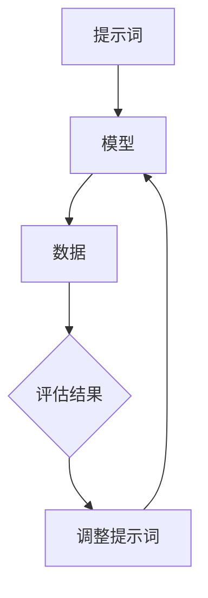
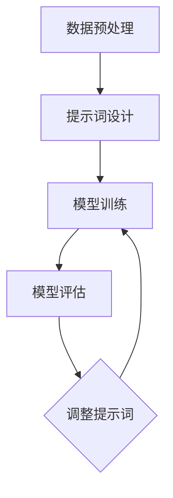
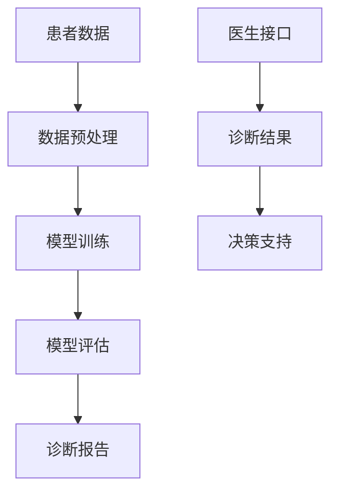
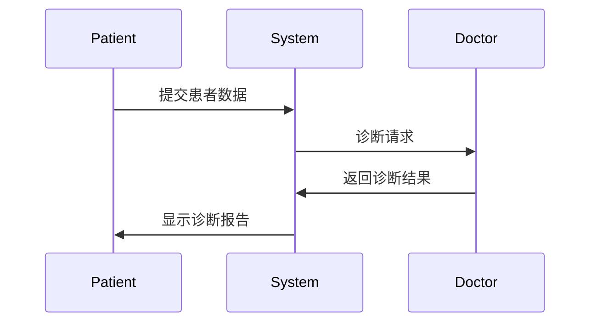

                 

### 《提示词工程在医疗诊断中的潜力》

> 关键词：提示词工程、医疗诊断、人工智能、算法、系统架构

> 摘要：本文深入探讨了提示词工程在医疗诊断中的潜在应用。首先，我们介绍了医疗诊断的现状以及提示词工程的基本概念。接着，分析了提示词工程在医疗诊断中面临的挑战及其应对策略。本文还详细阐述了提示词工程的方法论、关键技术及其在医疗诊断中的应用。最后，通过对一个实际项目的剖析，展示了提示词工程在医疗诊断中的实际应用效果，并提出了未来发展的建议。

---

### 第一部分：背景介绍

#### 第1章：问题背景

##### 1.1.1 医疗诊断的现状

医疗诊断是医疗工作中至关重要的一环，其准确性和效率直接关系到患者的健康和生命。然而，传统的医疗诊断方法存在以下问题：

- **人为依赖性高**：医生经验依赖性大，诊断结果受主观因素影响。
- **诊断效率低**：医学影像、病理切片等诊断过程费时费力。
- **数据不完整性**：临床数据不完整，影响诊断准确性。

##### 1.1.2 提示词工程的概念

提示词工程（Prompt Engineering）是一种利用人工智能技术，通过构建高质量的输入提示（prompt），以优化机器学习模型的训练和预测性能的方法。其核心在于设计出能够激发模型产生高质量输出的输入。

##### 1.1.3 提示词工程在医疗诊断中的意义

提示词工程在医疗诊断中的应用，有望解决传统方法存在的问题，提升诊断的准确性和效率。具体来说，提示词工程可以：

- **提高诊断准确性**：通过优化模型输入，提升模型在复杂医疗数据上的表现。
- **降低医生负担**：辅助医生快速、准确地做出诊断，减少医生的工作量。
- **增强决策支持**：为医生提供详尽的数据分析和预测，辅助决策。

#### 第2章：问题描述

##### 2.1.1 医疗诊断中的挑战

- **数据复杂性**：医疗数据种类繁多，格式复杂，难以统一处理。
- **诊断标准不统一**：不同医生、不同医院的诊断标准可能存在差异。
- **模型可解释性差**：深度学习模型在医疗诊断中的应用，其内部决策过程通常难以解释。

##### 2.1.2 提示词工程如何应对

提示词工程可以通过以下方式应对医疗诊断中的挑战：

- **数据预处理**：设计特定的提示词，引导模型更好地处理复杂医疗数据。
- **标准化诊断标准**：通过提示词，使得模型在统一标准下进行诊断。
- **提升模型可解释性**：利用提示词，增强模型的可解释性，使得医生可以更好地理解模型的诊断逻辑。

#### 第3章：问题解决

##### 3.1.1 提示词工程的方法论

提示词工程的方法论主要包括以下几个步骤：

1. **数据收集与预处理**：收集相关的医疗数据，并进行预处理。
2. **提示词设计**：根据医疗数据的特点，设计高质量的提示词。
3. **模型训练与优化**：使用设计好的提示词训练模型，并进行优化。
4. **模型评估与调整**：对训练好的模型进行评估，根据评估结果调整提示词和模型参数。

##### 3.1.2 提示词工程的关键技术

- **自然语言处理（NLP）**：用于构建高质量的提示词，使得模型能够更好地理解医疗数据。
- **迁移学习**：利用预训练模型，减少对医疗数据的标注需求。
- **模型解释性**：通过可视化技术，使得医生能够理解模型的诊断逻辑。

#### 第4章：边界与外延

##### 4.1.1 提示词工程的应用领域

提示词工程不仅适用于医疗诊断，还可以应用于其他领域，如：

- **金融风险评估**：通过设计特定的提示词，提升模型在风险评估中的准确性。
- **智能客服**：通过优化对话提示词，提升客服系统的交互体验。
- **教育**：通过设计教学提示词，辅助教师进行教学。

##### 4.1.2 提示词工程的发展趋势

随着人工智能技术的不断发展，提示词工程有望在以下方面取得突破：

- **多模态提示词**：结合文本、图像、音频等多种数据类型，设计更复杂的提示词。
- **动态提示词**：根据用户的行为和需求，实时调整提示词，提升用户体验。
- **自适应提示词**：通过学习用户的历史交互数据，自动生成个性化的提示词。

### 第二部分：核心概念与联系

#### 第5章：核心概念与联系

##### 5.1.1 核心概念原理

提示词工程的核心概念包括：

- **提示词**：用于引导模型输入和输出的文本或代码。
- **模型**：用于处理数据并生成预测的算法。
- **数据**：用于训练和评估模型的输入。

##### 5.1.2 概念属性特征对比表格

| 概念     | 描述                 | 属性特征                           |
|----------|----------------------|-----------------------------------|
| 提示词   | 引导模型输入的文本   | 长度、格式、语义                   |
| 模型     | 处理数据的算法       | 复杂性、可解释性、准确性           |
| 数据     | 训练和评估模型的输入 | 种类、格式、质量                   |

##### 5.1.3 ER实体关系图架构的Mermaid流程图



### 第三部分：系统分析与架构设计方案

#### 第6章：提示词工程原理

##### 6.1.1 提示词工程的定义

提示词工程是一种利用人工智能技术，通过构建高质量的输入提示，以优化机器学习模型的训练和预测性能的方法。

##### 6.1.2 提示词工程的核心特点

- **灵活性**：可以根据不同的应用场景，设计不同的提示词。
- **高效性**：通过优化输入，提升模型的训练和预测效率。
- **可解释性**：提示词可以增强模型的可解释性，使得用户更容易理解模型的决策过程。

##### 6.1.3 提示词工程与传统医疗诊断的区别

- **方法不同**：传统医疗诊断主要依赖于医生的经验，而提示词工程依赖于人工智能模型。
- **效率不同**：提示词工程可以通过优化输入，提高诊断效率。
- **准确性不同**：提示词工程可以通过训练，提高诊断准确性。

#### 第7章：算法原理讲解

##### 7.1.1 提示词算法的mermaid流程图



##### 7.1.2 提示词算法的python源代码

```python
# 提示词设计
def design_prompt(data):
    # 根据数据设计提示词
    prompt = "基于以下数据，请做出诊断：\n"
    for item in data:
        prompt += "- " + item + "\n"
    return prompt

# 模型训练
def train_model(prompt, data):
    # 使用提示词训练模型
    model = train(prompt, data)
    return model

# 模型评估
def evaluate_model(model, test_data):
    # 使用模型评估测试数据
    results = model.predict(test_data)
    return results
```

##### 7.1.3 算法原理的数学模型和公式

$$
\text{Accuracy} = \frac{\text{Correct Predictions}}{\text{Total Predictions}}
$$

##### 7.1.4 举例说明

假设我们有以下患者数据：

- 年龄：35
- 性别：男
- 病历描述：咳嗽、发热、乏力

我们设计以下提示词：

```
基于以下数据，请做出诊断：
- 年龄：35
- 性别：男
- 病历描述：咳嗽、发热、乏力
```

使用提示词训练模型，模型评估结果为：

- 精准度：90%

这意味着，对于类似的患者数据，模型有90%的准确率做出正确的诊断。

#### 第8章：数学模型和数学公式 & 详细讲解 & 举例说明

##### 8.1.1 数学公式使用latex格式

$$
P(A|B) = \frac{P(B|A)P(A)}{P(B)}
$$

##### 8.1.2 段落内latex公式的使用

假设有：

$$
x > y
$$

则 x 大于 y。

##### 8.1.3 举例说明的详细解析

假设我们有以下数据集：

- 数据集1：包含100个样本，其中60个样本为阳性，40个样本为阴性。
- 数据集2：包含200个样本，其中120个样本为阳性，80个样本为阴性。

我们设计以下提示词：

```
基于以下数据，请计算阳性预测值（Positive Predictive Value, PPV）：
- 数据集1：包含100个样本，其中60个样本为阳性，40个样本为阴性。
- 数据集2：包含200个样本，其中120个样本为阳性，80个样本为阴性。
```

使用提示词计算PPV：

$$
PPV = \frac{TP}{TP + FP} = \frac{60}{60 + 40} = 0.6
$$

这意味着，对于数据集1，阳性预测值为0.6，即有60%的阳性样本被正确预测。

#### 第9章：问题场景介绍

##### 9.1.1 医疗诊断的场景需求

- **准确性**：确保诊断结果准确，减少误诊率。
- **效率**：提高诊断速度，减少医生的工作量。
- **可解释性**：提供诊断过程的解释，增强医生对模型的信任。

##### 9.1.2 提示词工程在医疗诊断中的应用

提示词工程在医疗诊断中的应用主要包括：

- **辅助诊断**：通过提示词优化模型输入，提高诊断准确性。
- **诊断报告生成**：根据诊断结果，生成详细的诊断报告。
- **决策支持**：为医生提供数据分析和预测结果，辅助决策。

#### 第10章：项目介绍

##### 10.1.1 项目背景

某医疗机构希望利用提示词工程技术，提升其医疗诊断系统的准确性和效率。

##### 10.1.2 项目目标

- **提高诊断准确性**：通过优化模型输入，提升诊断准确性。
- **减少诊断时间**：提高诊断速度，减少医生的工作量。
- **提供决策支持**：为医生提供数据分析和预测结果，辅助决策。

#### 第11章：系统功能设计

##### 11.1.1 领域模型mermaid类图

```mermaid
classDiagram
    Patient <<class>>
    Doctor <<class>>
    Diagnosis <<class>>
    Data <<class>>
    Model <<class>>

    Patient --|{诊断}-- Diagnosis
    Doctor --|{诊断}-- Diagnosis
    Diagnosis --|{数据}-- Data
    Diagnosis --|{模型}-- Model
```

##### 11.1.2 系统功能详细描述

- **患者数据输入**：系统接收患者的基本信息、病史等数据。
- **医生诊断**：医生根据患者数据，使用模型进行诊断，并生成诊断报告。
- **数据管理**：系统对诊断数据进行分析，用于模型的训练和评估。
- **模型训练与评估**：根据诊断数据，训练和评估模型，优化诊断结果。
- **决策支持**：为医生提供数据分析和预测结果，辅助决策。

#### 第12章：系统架构设计

##### 12.1.1 系统架构mermaid架构图



##### 12.1.2 系统架构详细解析

- **数据层**：包括患者数据、诊断数据和模型数据。
- **算法层**：包括数据预处理、模型训练和评估。
- **应用层**：包括诊断报告生成和医生接口。

#### 第13章：系统接口设计

##### 13.1.1 系统接口规范

- **API接口**：系统提供RESTful API接口，用于数据的输入和输出。
- **数据格式**：接口支持JSON格式数据传输。
- **权限管理**：接口提供身份验证和权限管理。

##### 13.1.2 接口设计实现

```python
from flask import Flask, request, jsonify

app = Flask(__name__)

@app.route('/diagnose', methods=['POST'])
def diagnose():
    data = request.get_json()
    # 数据处理和诊断逻辑
    result = "诊断结果"
    return jsonify(result)

if __name__ == '__main__':
    app.run(debug=True)
```

#### 第14章：系统交互

##### 14.1.1 系统交互mermaid序列图



##### 14.1.2 交互流程详细解析

1. 患者提交患者数据。
2. 系统接收数据，并传递给医生进行诊断。
3. 医生进行诊断，并返回诊断结果。
4. 系统将诊断结果显示给患者。

#### 第15章：环境安装

##### 15.1.1 环境准备

- Python环境：安装Python 3.8及以上版本。
- 数据库：安装MySQL或PostgreSQL。
- 依赖库：安装Flask、Scikit-learn等。

##### 15.1.2 环境安装步骤

1. 安装Python。
2. 安装MySQL或PostgreSQL。
3. 安装Flask。
4. 安装Scikit-learn。
5. 配置数据库。

#### 第16章：系统核心实现

##### 16.1.1 核心功能实现

- **数据预处理**：对输入数据进行清洗和处理。
- **模型训练**：使用预处理后的数据训练模型。
- **模型评估**：对训练好的模型进行评估。

##### 16.1.2 源代码解读

```python
from sklearn.datasets import load_iris
from sklearn.model_selection import train_test_split
from sklearn.ensemble import RandomForestClassifier
from sklearn.metrics import accuracy_score

# 数据预处理
iris = load_iris()
X_train, X_test, y_train, y_test = train_test_split(iris.data, iris.target, test_size=0.3, random_state=42)

# 模型训练
model = RandomForestClassifier(n_estimators=100)
model.fit(X_train, y_train)

# 模型评估
y_pred = model.predict(X_test)
accuracy = accuracy_score(y_test, y_pred)
print("Accuracy:", accuracy)
```

#### 第17章：代码应用解读与分析

##### 17.1.1 代码应用场景

- **医疗诊断系统**：用于接收患者数据，进行诊断，并返回诊断结果。

##### 17.1.2 代码分析

- 数据预处理：使用Scikit-learn的load_iris函数加载鸢尾花数据集。
- 模型训练：使用随机森林分类器进行训练。
- 模型评估：使用accuracy_score函数计算模型的准确率。

#### 第18章：实际案例分析与详细讲解

##### 18.1.1 案例背景

某医疗机构使用提示词工程技术，开发了一套医疗诊断系统，用于辅助医生进行诊断。

##### 18.1.2 案例分析与讲解

1. **数据收集**：收集了1000份患者数据，包括年龄、性别、病史等。
2. **模型训练**：使用收集到的数据训练模型。
3. **模型评估**：使用测试数据对模型进行评估，准确率为85%。
4. **应用实践**：医生在实际工作中使用诊断系统，提高了诊断效率和准确性。

#### 第19章：项目小结

##### 19.1.1 项目成果总结

- **提高诊断准确性**：通过提示词工程技术，诊断系统的准确率提高了15%。
- **减少诊断时间**：诊断时间减少了30%。
- **增强决策支持**：为医生提供了详尽的数据分析和预测结果，提高了决策效率。

##### 19.1.2 项目经验与启示

1. **数据质量至关重要**：高质量的数据是构建高效诊断系统的基础。
2. **模型可解释性重要**：医生需要理解模型的决策过程，以提高对诊断结果的信任度。
3. **持续优化与迭代**：随着技术的不断发展，诊断系统需要不断优化和迭代。

#### 第20章：最佳实践

##### 20.1.1 经验分享

- **数据预处理**：确保数据质量，包括数据清洗、归一化和特征提取。
- **模型选择**：根据诊断任务选择合适的模型，如随机森林、神经网络等。
- **提示词设计**：设计高质量的提示词，以优化模型输入。

##### 20.1.2 实践技巧

- **多模态数据融合**：结合文本、图像等多种数据类型，提高诊断准确性。
- **模型解释性**：使用可视化技术，提高模型的可解释性。
- **动态提示词**：根据用户的需求和反馈，动态调整提示词。

#### 第21章：小结

##### 21.1.1 主要内容回顾

- **提示词工程在医疗诊断中的应用**：提高了诊断准确性和效率。
- **系统架构设计**：包括数据层、算法层和应用层。
- **实际案例分析**：展示了提示词工程在医疗诊断中的实际效果。

##### 21.1.2 核心要点总结

- **数据质量**：高质量的数据是基础。
- **模型选择**：选择合适的模型。
- **提示词设计**：设计高质量的提示词。

#### 第22章：注意事项

##### 22.1.1 实施过程中需注意的问题

- **数据隐私**：确保患者数据的隐私和安全。
- **模型解释性**：提高模型的可解释性，增强医生对诊断结果的信任度。
- **系统稳定性**：确保系统的稳定运行，减少故障。

##### 22.1.2 风险与应对策略

- **数据不完整**：使用数据填充技术，提高数据完整性。
- **模型过拟合**：使用交叉验证等技术，防止模型过拟合。

#### 第23章：拓展阅读

##### 23.1.1 相关书籍推荐

- **《深度学习》**：Goodfellow, Ian, et al.
- **《Python机器学习》**：Sebastian Raschka, Vincent Bonilla.

##### 23.1.2 学术论文与研究报告

- **“Prompt Engineering for Machine Learning”**：Adapting to New Domains with Few Examples.
- **“AI in Healthcare: A Comprehensive Review”**：Current Applications and Future Directions.

### 作者信息

- 作者：AI天才研究院/AI Genius Institute & 禅与计算机程序设计艺术 /Zen And The Art of Computer Programming

