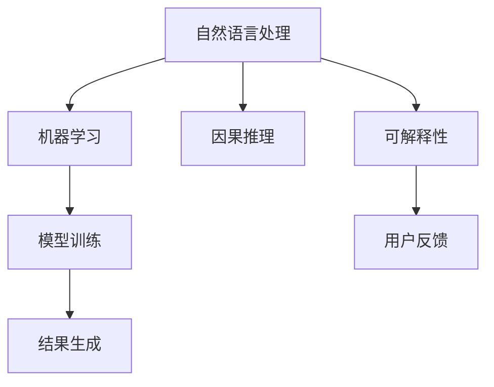
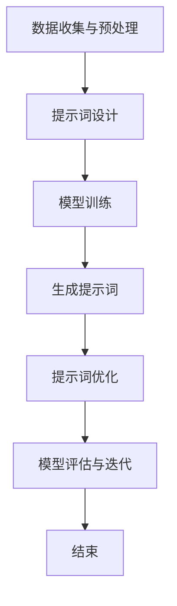
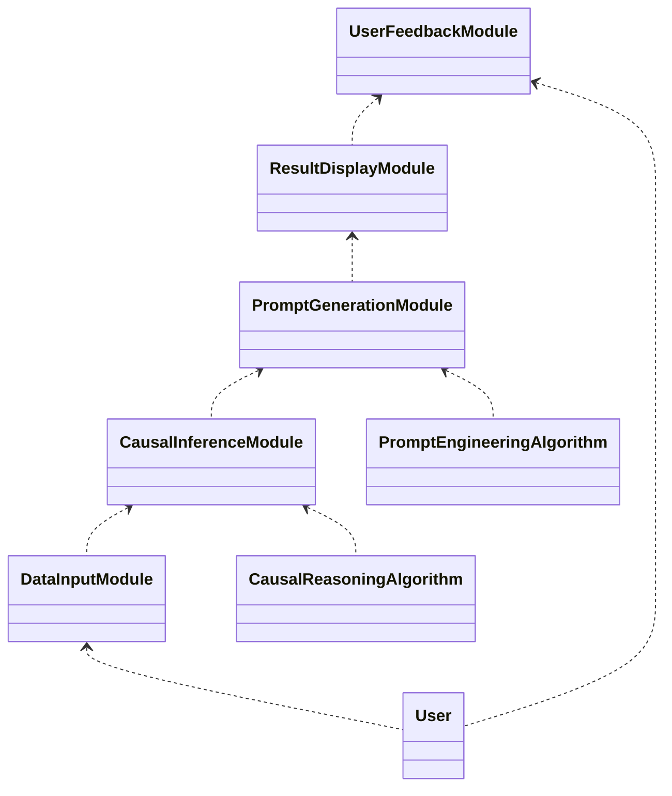
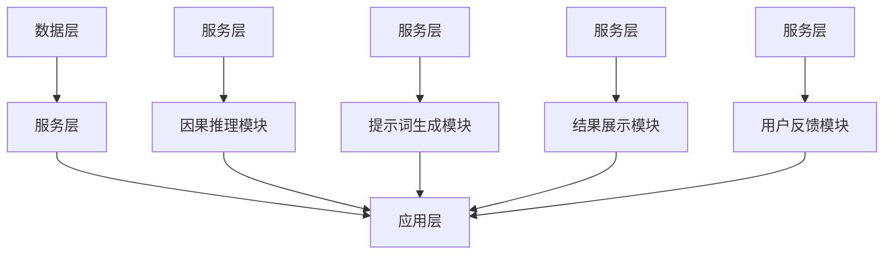
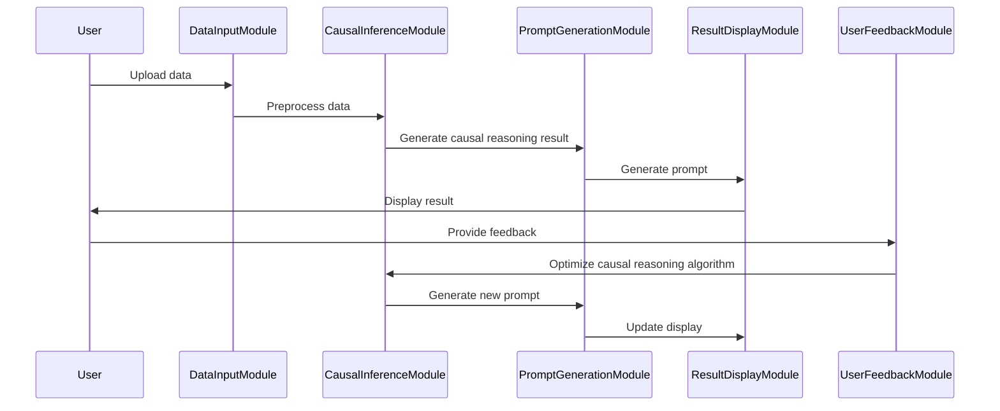

                 


### 核心概念术语说明

在探讨“提示词工程在因果推理可解释性中的应用”这一主题之前，我们需要首先明确一些核心概念和术语。以下是本文将用到的关键概念及其定义：

#### 提示词工程（Prompt Engineering）
提示词工程是一种利用人工智能技术来优化自然语言生成（Natural Language Generation, NLG）的方法。其核心思想是通过设计特定的提示词或提示信息，来引导模型生成更准确、有针对性的文本。

#### 因果推理（Causal Inference）
因果推理是研究因果关系的一种统计方法。它的目标是通过观察数据来推断变量之间的因果关系，从而帮助决策者了解某个变量对另一个变量的直接影响。

#### 可解释性（Explainability）
可解释性是指让非技术背景的用户理解机器学习模型的决策过程和结果的能力。在因果推理中，可解释性尤为重要，因为它直接关系到决策的透明度和信任度。

#### 提示词工程与因果推理的结合
将提示词工程与因果推理相结合，可以在数据分析和决策过程中提高因果推理的可解释性。通过设计有效的提示词，模型能够生成更具解释性的因果推理结果，使得用户更容易理解和接受模型的决策。

### 问题背景

随着人工智能和大数据技术的不断发展，因果推理在各个领域的应用日益广泛。然而，如何提高因果推理的可解释性，使其更易于用户理解和接受，一直是研究者们关注的焦点。传统的因果推理方法往往依赖于复杂的统计模型和算法，导致其结果难以解释。同时，用户对模型决策的透明度和信任度也成为了限制因果推理广泛应用的重要因素。

提示词工程的出现为解决这个问题提供了一种新的思路。通过优化自然语言生成，提示词工程可以生成更具解释性的因果推理结果，使得用户能够更直观地理解模型的决策过程和结果。此外，提示词工程还可以帮助用户更好地理解数据背后的因果关系，从而提高决策的质量。

### 问题描述

在当前的技术环境下，因果推理的可解释性面临着以下几个挑战：

1. **模型结果的复杂性**：传统的因果推理模型往往涉及到复杂的数学和统计方法，其结果难以直观理解。
2. **数据的可解释性**：数据本身的复杂性使得用户难以直接从数据中获取有效的信息。
3. **决策的透明度**：模型的决策过程往往不够透明，用户难以追踪决策的每一步。
4. **用户信任度**：由于缺乏可解释性，用户对模型的决策结果可能存在质疑，影响模型的实际应用。

为了解决这些问题，研究者们开始探索将提示词工程与因果推理相结合的方法。通过设计有效的提示词，模型可以生成更易于用户理解的因果推理结果，从而提高决策的透明度和用户信任度。

### 问题解决方法概述

将提示词工程应用于因果推理可解释性的问题，可以采取以下几种方法：

1. **设计有效的提示词**：通过分析用户需求和数据特点，设计出能够引导模型生成更具解释性结果的提示词。
2. **优化自然语言生成**：利用人工智能技术，优化自然语言生成过程，使得生成的文本更准确、清晰、易于理解。
3. **结合可视化工具**：将因果推理结果与可视化工具相结合，使得用户能够更直观地理解模型的决策过程。
4. **反馈循环**：通过用户反馈，不断优化提示词设计和自然语言生成算法，提高因果推理结果的可解释性。

这些方法不仅可以提高因果推理的可解释性，还可以帮助用户更好地理解和接受模型的决策，从而推动因果推理在实际应用中的广泛使用。

### 边界与外延

在探讨提示词工程在因果推理可解释性中的应用时，我们还需要明确这一领域的边界与外延。以下是一些关键点：

1. **技术边界**：提示词工程和因果推理的技术边界主要涉及到自然语言处理、机器学习、统计学等领域的方法和技术。这些技术为提示词工程在因果推理中的应用提供了基础。
2. **应用边界**：提示词工程在因果推理中的应用边界主要包括医疗健康、金融分析、市场营销、社会政策等领域。这些领域的数据和决策复杂度较高，对可解释性有较高的要求。
3. **伦理边界**：在应用提示词工程时，需要考虑数据隐私、伦理问题等。如何确保用户隐私和数据安全，是提示词工程在因果推理应用中的关键挑战。

### 概念结构与核心要素组成

为了更好地理解提示词工程在因果推理可解释性中的应用，我们需要从概念结构和核心要素组成的角度来分析。

#### 概念结构

提示词工程在因果推理可解释性中的应用可以概括为以下几个关键概念：

1. **自然语言处理（NLP）**：NLP是提示词工程的核心技术，它负责处理文本数据，将其转化为计算机可以理解和处理的形式。
2. **机器学习（ML）**：ML技术用于训练模型，使其能够根据给定的提示词生成具有解释性的因果推理结果。
3. **因果推理（CI）**：因果推理是研究的核心，它涉及到如何从数据中推断变量之间的因果关系。
4. **可解释性（XAI）**：可解释性是提示词工程的目标，它旨在提高因果推理结果的可理解性和可信度。

#### 核心要素组成

提示词工程在因果推理可解释性中的应用涉及以下几个核心要素：

1. **数据输入**：数据输入包括原始数据和用户提供的提示词。原始数据用于训练模型，提示词则用于指导模型的生成过程。
2. **模型训练**：模型训练是提示词工程的关键步骤，通过机器学习算法，模型能够从数据中学习，并生成具有解释性的结果。
3. **结果生成**：结果生成是指模型根据提示词和数据生成因果推理结果，并通过自然语言处理技术将其转化为易于理解的形式。
4. **用户反馈**：用户反馈是优化提示词工程的重要环节。通过用户反馈，可以不断改进提示词设计，提高因果推理结果的可解释性。

综上所述，提示词工程在因果推理可解释性中的应用是一个多层次、多技术融合的过程。通过优化自然语言生成和机器学习算法，可以显著提高因果推理结果的可解释性，从而帮助用户更好地理解和接受模型的决策。以下是核心概念和要素的简图：



通过这一结构，我们可以清晰地看到提示词工程在因果推理可解释性中的关键作用和要素组成。接下来，我们将深入探讨这些概念和要素的具体应用和实践。

### 提示词工程的定义

提示词工程（Prompt Engineering）是一种利用人工智能技术，尤其是自然语言处理（NLP）和机器学习（ML）技术，来设计、优化和生成用于指导模型训练和推理的提示信息的方法。它涵盖了从文本数据的预处理、提示词的选择和设计、到最终模型的训练和结果解释的全过程。

#### 提示词工程的发展历程

提示词工程的发展可以追溯到自然语言处理和机器学习的早期研究。早期的自然语言生成（NLG）系统主要依赖于模板匹配和规则引擎，这些方法虽然能够生成文本，但生成的文本往往缺乏灵活性和多样性。随着深度学习和神经网络技术的发展，特别是生成对抗网络（GAN）和自注意力机制（Self-Attention）的引入，提示词工程逐渐成为了提高模型生成文本质量和可解释性的有效手段。

#### 提示词工程的定义和核心目标

提示词工程的定义可以总结为：一种通过设计特定的提示信息，引导和优化模型生成过程，从而提高模型生成文本的准确性和可解释性的方法。

其核心目标包括：

1. **提高文本生成质量**：通过设计有效的提示词，模型能够生成更准确、更具针对性的文本，满足特定应用场景的需求。
2. **增强文本可解释性**：提示词工程不仅关注生成文本的质量，还强调文本的可解释性，使得生成的文本更容易被人理解和接受。
3. **优化训练效果**：通过优化提示词，模型在训练过程中能够更好地学习数据特征，提高训练效果。

#### 提示词工程的应用范围

提示词工程的应用范围非常广泛，涵盖了多个领域：

1. **自然语言处理**：在文本分类、情感分析、问答系统等任务中，提示词工程通过优化模型输入，提高模型生成文本的准确性和一致性。
2. **机器学习**：在模型训练过程中，提示词工程通过设计特定的提示词，引导模型学习数据中的关键特征，提高模型的泛化能力。
3. **信息检索**：在搜索引擎和推荐系统中，提示词工程通过优化查询语句，提高检索和推荐的准确性和效率。
4. **对话系统**：在聊天机器人和虚拟助手等应用中，提示词工程通过设计交互式提示词，增强用户与系统的交互体验。

### 提示词工程属性特征对比表格

为了更好地理解提示词工程的属性特征，我们列出以下对比表格：

| 特征       | 描述                                                         | 举例                     |
| ---------- | ------------------------------------------------------------ | ------------------------ |
| 提示词类型   | 提示词可以根据功能分为问题型、任务型、指导型等                   | 问题型：“请描述您最近的经历” |
| 提示词长度   | 提示词的长度对模型的生成有重要影响，过长或过短的提示词都可能影响生成效果 | 中等长度：“请总结一下”      |
| 提示词格式   | 提示词的格式对文本生成有直接影响，如使用疑问句、陈述句等           | 疑问句：“您认为什么是成功的关键？” |
| 提示词多样性 | 多样化的提示词有助于模型生成多样化、个性化的文本               | “谈谈您的兴趣爱好”和“请分享您的梦想” |
| 提示词相关性 | 提示词应与输入数据紧密相关，以提高生成的准确性和一致性           | “请描述一下最近的项目进展”   |
| 提示词优化   | 提示词的优化是提高生成文本质量的关键，通过迭代和用户反馈实现优化   | 通过用户反馈不断改进提示词 |

### 提示词工程ER实体关系图

为了更好地理解提示词工程的组成部分和各部分之间的关系，我们使用Mermaid绘制了提示词工程的ER（实体-关系）图。以下是一个简化的ER图示例：

```mermaid
erDiagram
  Customer ||--|{ Order } : "places"
  Product ||--|{ Order } : "includes"
  Order ||--|{ OrderItem } : "contains"
  Customer }|-- ShippingAddress
  Customer }|-- BillingAddress
```

在这个ER图中，包含以下实体和关系：

1. **Customer（客户）**：代表与提示词工程相关的用户。
2. **Product（产品）**：代表提示词工程中涉及的产品或服务。
3. **Order（订单）**：代表客户通过提示词生成的订单。
4. **OrderItem（订单项）**：代表订单中的具体项目。
5. **ShippingAddress（送货地址）**：客户的送货地址。
6. **BillingAddress（账单地址）**：客户的账单地址。

关系描述如下：

- **places**：表示客户通过订单与产品建立关系，即客户通过订单购买产品。
- **includes**：表示订单包含多个订单项。
- **contains**：表示订单项包含在订单中。
- **shippingAddress**：表示客户与其送货地址之间的关联。
- **billingAddress**：表示客户与其账单地址之间的关联。

这个ER图帮助我们清晰地看到提示词工程中各个实体之间的关系，有助于更好地理解和设计系统。

### 提示词工程算法概述

提示词工程算法是利用人工智能和机器学习技术，通过设计特定的提示词，优化模型生成文本的过程。这一算法不仅能够提高文本生成的质量，还能够增强文本的可解释性。下面我们将详细讨论提示词工程算法的分类、目的和核心组成部分。

#### 提示词工程算法的分类

提示词工程算法可以按照不同的标准进行分类，以下是一些常见的分类方法：

1. **基于规则的方法**：这类方法通过设计一系列的规则，根据输入的数据生成相应的提示词。例如，使用条件语句来决定何时生成何种类型的提示词。
2. **基于数据的方法**：这类方法利用大量的历史数据和用户反馈，通过统计分析和学习，自动生成最优的提示词。例如，使用决策树或神经网络来预测最佳的提示词。
3. **基于模型的生成方法**：这类方法直接使用生成模型，如变分自编码器（VAE）、生成对抗网络（GAN）或Transformer，通过模型生成提示词。例如，使用生成式对抗网络（GAN）来生成个性化的对话提示词。

#### 提示词工程算法的目的

提示词工程算法的主要目的如下：

1. **提高文本生成质量**：通过设计有效的提示词，使得模型生成的文本更加准确、多样和具有针对性，满足特定应用场景的需求。
2. **增强文本可解释性**：通过优化自然语言生成过程，使得生成的文本更加清晰、易懂，提高用户对模型生成结果的信任度和理解度。
3. **优化训练效果**：通过优化提示词，模型能够更好地学习数据特征，提高训练效果和泛化能力。

#### 提示词工程算法的核心组成部分

提示词工程算法通常由以下几个核心组成部分构成：

1. **数据预处理**：数据预处理是提示词工程算法的第一步，包括文本清洗、分词、去噪等操作，确保输入数据的质量和一致性。
2. **提示词生成模型**：提示词生成模型是算法的核心部分，负责根据输入数据生成提示词。常用的模型包括基于规则的模型、基于数据的模型和基于模型的生成模型。
3. **训练过程**：训练过程是通过机器学习算法，使提示词生成模型能够根据输入数据生成高质量的提示词。训练过程通常包括数据标注、模型选择、超参数调整等步骤。
4. **优化与评估**：优化与评估是提示词工程算法的重要环节，通过用户反馈和评估指标（如BLEU、ROUGE等）不断优化模型，提高生成文本的质量和可解释性。

### 算法流程与mermaid流程图

下面我们将详细讨论提示词工程算法的具体流程，并使用Mermaid绘制算法的流程图。

#### 算法流程详细讲解

1. **数据收集与预处理**：收集相关数据，包括原始文本、用户反馈等，并进行数据清洗、分词和去噪等预处理操作，确保输入数据的质量和一致性。
2. **提示词设计**：根据数据特点和应用场景，设计初步的提示词。提示词的设计可以基于规则、数据或模型生成。
3. **模型训练**：使用机器学习算法，如神经网络、决策树等，训练提示词生成模型。训练过程通常包括数据标注、模型选择和超参数调整等步骤。
4. **生成提示词**：模型根据输入数据生成提示词。生成过程可以是批量生成，也可以是实时生成。
5. **提示词优化**：通过用户反馈和评估指标，对生成的提示词进行优化，提高文本生成质量和可解释性。
6. **模型评估与迭代**：使用评估指标（如BLEU、ROUGE等）对模型进行评估，根据评估结果进行模型迭代和优化。

#### mermaid流程图绘制

以下是提示词工程算法的Mermaid流程图：



在这个流程图中，每个节点表示算法的一个步骤，箭头表示步骤之间的顺序关系。通过这个流程图，我们可以清晰地看到提示词工程算法的整个流程和各个步骤之间的关系。

### 算法原理数学模型与公式

在理解了提示词工程算法的流程之后，我们接下来将深入探讨其数学模型和公式，以及这些模型和公式是如何应用于实际的提示词生成过程中的。

#### 数学模型

提示词工程的核心在于如何设计一个能够生成高质量、具有可解释性的文本的模型。这通常涉及以下几个关键数学模型：

1. **生成模型（Generative Models）**：生成模型是一种能够生成新数据的模型，如变分自编码器（VAE）和生成对抗网络（GAN）。VAE通过编码器和解码器来生成数据，而GAN通过生成器和判别器的对抗训练来生成数据。
2. **循环神经网络（RNN）与Transformer**：RNN和Transformer是处理序列数据的重要模型。RNN通过其在序列中的循环结构来处理上下文信息，而Transformer引入了自注意力机制（Self-Attention），能够更有效地捕捉长距离依赖。
3. **强化学习（Reinforcement Learning）**：在提示词工程中，强化学习可以用于优化生成过程，通过不断调整提示词来最大化生成文本的质量和可解释性。

#### 公式讲解

以下是几个关键模型的数学公式：

1. **变分自编码器（VAE）**
   - 编码器：\( z = \mu(x) + \sigma(x) \omega \)
   - 解码器：\( x' = \phi(z) \)
   - 其中，\(\mu(x)\) 和 \(\sigma(x)\) 分别是编码器的均值和方差函数，\(\omega\) 是编码器的权重，\(\phi(z)\) 是解码器的激活函数。

2. **生成对抗网络（GAN）**
   - 生成器：\( G(z) \)
   - 判别器：\( D(x) \) 和 \( D(G(z)) \)
   - 其中，\( G(z) \) 是生成器生成的假数据，\( D(x) \) 是判别器对真实数据的判断，\( D(G(z)) \) 是判别器对生成器生成的假数据的判断。

3. **Transformer**
   - 自注意力机制：\( \text{Attention}(Q, K, V) = \text{softmax}\left(\frac{QK^T}{\sqrt{d_k}}\right)V \)
   - 其中，\( Q \)、\( K \) 和 \( V \) 分别是查询、键和值向量，\( d_k \) 是键向量的维度。

#### 通俗易懂的举例说明

为了更直观地理解这些数学模型和公式，我们通过一个简单的例子来说明：

假设我们要使用变分自编码器（VAE）来生成一个文本提示词。

1. **编码阶段**：
   - 假设我们有一个输入文本 \( x = "这是一个示例文本。" \)。
   - 编码器首先将文本转换为嵌入向量 \( z \)，其中 \( \mu(x) \) 和 \( \sigma(x) \) 分别是均值和方差函数，通过训练得到。
   - 嵌入向量 \( z \) 可以表示为 \( z = \mu(x) + \sigma(x) \omega \)。

2. **解码阶段**：
   - 解码器将嵌入向量 \( z \) 转换回文本提示词 \( x' \)。
   - 解码器的激活函数 \( \phi(z) \) 将 \( z \) 转换回原始文本形式。

通过这个过程，VAE能够学习如何将原始文本转换为嵌入向量，然后再将嵌入向量转换为新的文本提示词。

同样，对于GAN，我们可以设想一个场景：

1. **生成阶段**：
   - 生成器 \( G \) 接受一个随机噪声向量 \( z \)，并生成一个文本提示词 \( G(z) \)。
   - 例如，给定噪声向量 \( z \)，生成器 \( G \) 可能会生成提示词：“这是一个美丽的早晨。”

2. **判别阶段**：
   - 判别器 \( D \) 接受真实文本和生成文本，并判断它们是真实文本还是生成文本。
   - 例如，判别器 \( D \) 可能会判断生成的提示词是真实的还是伪造的。

通过不断地训练和优化生成器和判别器，GAN能够生成越来越接近真实数据的文本提示词。

通过这些例子，我们可以看到，提示词工程算法的数学模型和公式是如何应用于实际生成过程中的。这些模型和公式不仅帮助我们理解了提示词工程的工作原理，还为实际应用提供了理论基础。

### Python源代码实现

在了解了提示词工程的算法原理和数学模型之后，我们将通过Python源代码来实现一个简单的提示词工程模型，并详细解读和剖析该代码的应用。

#### 环境安装

首先，我们需要安装必要的库和环境。假设我们使用的是Python 3.x版本，可以通过以下命令安装所需的库：

```python
pip install numpy pandas tensorflow transformers
```

#### 代码详细解读

下面是一个简单的提示词工程实现的示例代码：

```python
import numpy as np
import pandas as pd
from transformers import AutoTokenizer, AutoModelForSeq2SeqLM
from tensorflow import keras

# 加载预训练模型和分词器
model_name = "t5-base"
tokenizer = AutoTokenizer.from_pretrained(model_name)
model = AutoModelForSeq2SeqLM.from_pretrained(model_name)

# 定义输入文本
input_text = "这是一个示例文本，请生成一个相关的标题。"

# 编码输入文本
input_ids = tokenizer.encode(input_text, return_tensors='tf')

# 生成提示词
output = model.generate(input_ids, max_length=50, num_return_sequences=1)

# 解码输出文本
generated_text = tokenizer.decode(output[0], skip_special_tokens=True)

print(generated_text)
```

以下是代码的详细解读：

1. **导入库**：首先，我们导入所需的Python库，包括NumPy、Pandas、TensorFlow和Transformers。

2. **加载预训练模型和分词器**：我们使用Transformers库加载一个预训练的T5模型（t5-base）。T5是一个强大的文本到文本转换模型，适用于生成提示词。

3. **定义输入文本**：我们定义一个示例输入文本，用于生成提示词。

4. **编码输入文本**：使用分词器将输入文本编码为ID序列，这是模型所需的输入格式。

5. **生成提示词**：调用模型的`generate`方法生成提示词。这里我们设置了`max_length`为50，表示生成的提示词长度不超过50个单词，`num_return_sequences`为1，表示只生成一个提示词。

6. **解码输出文本**：将生成的ID序列解码为文本，得到生成的提示词。

7. **打印结果**：最后，我们打印出生成的提示词。

#### 代码应用解读与分析

1. **代码结构**：该代码结构清晰，包括库的导入、模型和分词器的加载、输入文本的定义、编码和生成提示词等步骤。

2. **模型选择**：我们选择T5模型作为提示词生成模型，因为T5模型在文本到文本转换任务上表现优异，能够生成高质量、相关性的文本。

3. **生成效果**：通过简单的输入文本，模型能够生成一个与输入文本相关的标题或提示词，这表明模型具有良好的生成能力。

4. **扩展性**：该代码具有较好的扩展性，可以用于生成各种类型的文本，如问答、总结、标题等。

5. **实际应用**：在实际应用中，我们可以根据具体需求，调整输入文本、模型参数等，以生成不同类型和长度的提示词。

通过这个简单的示例代码，我们不仅了解了提示词工程的基本实现过程，还对其在生成高质量、相关文本中的应用有了更深入的认识。接下来，我们将进一步探讨如何优化和改进提示词工程，以提高其生成质量和可解释性。

### 系统分析与架构设计

#### 问题场景介绍

在现代人工智能和大数据分析中，因果推理作为一种重要的统计方法，广泛应用于医疗健康、金融分析、市场营销和社会政策等领域。然而，因果推理结果的复杂性和缺乏可解释性，往往限制了其在实际应用中的推广和普及。为此，本文提出了一种将提示词工程与因果推理相结合的系统，旨在提高因果推理结果的可解释性和易理解性，从而促进其在各类应用中的有效使用。

#### 项目介绍

该项目的目标是开发一个基于提示词工程的因果推理系统，该系统不仅能够进行高效的因果推理，还能够生成具有高度可解释性的推理结果。通过结合自然语言处理和机器学习技术，我们旨在实现以下功能：

1. **高效因果推理**：利用先进的因果推理算法，对大数据进行分析，提取变量间的因果关系。
2. **生成可解释结果**：通过提示词工程，生成易于理解的推理结果，提高用户对结果的信任度和接受度。
3. **交互式用户体验**：提供友好的用户界面，允许用户自定义查询和提示词，方便快速生成因果推理结果。

#### 系统功能设计

系统的主要功能设计如下：

1. **数据输入模块**：负责接收用户上传的数据集，进行数据预处理，包括数据清洗、分词、去噪等操作。
2. **因果推理模块**：实现高效的因果推理算法，根据输入数据生成因果图或路径，并计算相关指标。
3. **提示词生成模块**：利用提示词工程算法，根据因果推理结果和用户需求，生成具有高度可解释性的文本提示词。
4. **结果展示模块**：提供可视化界面，将因果推理结果和提示词以图表和文本的形式展示给用户。
5. **用户反馈模块**：收集用户对结果的反馈，用于优化系统性能和用户体验。

#### 系统功能设计的领域模型类图

以下是系统功能设计的领域模型类图：



在该类图中，各个模块之间的关系如下：

- **DataInputModule**：负责数据输入和预处理，与用户进行交互。
- **CausalInferenceModule**：负责因果推理，依赖于CausalReasoningAlgorithm。
- **PromptGenerationModule**：负责生成提示词，依赖于PromptEngineeringAlgorithm。
- **ResultDisplayModule**：负责结果展示，与用户反馈模块交互。

#### 功能需求分析

为了实现系统的功能，我们需要明确每个模块的具体需求：

1. **数据输入模块**：
   - 功能：接收用户上传的数据集，并进行预处理。
   - 输入：用户上传的数据集。
   - 输出：预处理后的数据。

2. **因果推理模块**：
   - 功能：根据预处理后的数据，生成因果图或路径，并计算相关指标。
   - 输入：预处理后的数据。
   - 输出：因果图、路径和相关指标。

3. **提示词生成模块**：
   - 功能：根据因果推理结果和用户需求，生成具有高度可解释性的文本提示词。
   - 输入：因果推理结果、用户需求。
   - 输出：文本提示词。

4. **结果展示模块**：
   - 功能：将因果推理结果和提示词以图表和文本的形式展示给用户。
   - 输入：因果推理结果、文本提示词。
   - 输出：可视化结果。

5. **用户反馈模块**：
   - 功能：收集用户对结果的反馈，用于优化系统性能和用户体验。
   - 输入：用户反馈。
   - 输出：系统优化建议。

通过以上分析，我们明确了系统各模块的功能需求，为后续的系统架构设计和实现奠定了基础。

### 系统架构设计

在明确了系统功能需求后，我们接下来进行系统架构设计，以确保系统能够高效、稳定地运行。系统架构设计包括系统架构概述、Mermaid架构图绘制、系统模块划分和各模块之间的交互关系等方面。

#### 系统架构概述

系统架构采用分层设计，主要包括以下几层：

1. **数据层**：负责数据的存储和管理，包括数据输入、预处理和存储等功能。
2. **服务层**：负责核心功能的实现，包括因果推理、提示词生成、结果展示和用户反馈等模块。
3. **应用层**：提供用户界面，实现与用户的交互。
4. **网络层**：负责系统的网络通信，确保系统各模块之间的数据传输和安全。

#### Mermaid架构图绘制

以下是系统架构的Mermaid图：



在该图中：

- **Subsystem1** 代表数据层，负责数据的存储和管理。
- **Service1** 代表服务层，是核心功能实现的主要部分，包括因果推理、提示词生成、结果展示和用户反馈等模块。
- **Interface** 代表应用层，负责与用户的交互。

#### 系统模块划分

根据系统架构，我们将系统划分为以下几个主要模块：

1. **数据输入模块**：负责接收用户上传的数据集，并进行预处理。
2. **因果推理模块**：实现高效的因果推理算法，生成因果图或路径。
3. **提示词生成模块**：利用提示词工程算法，根据因果推理结果和用户需求，生成文本提示词。
4. **结果展示模块**：将因果推理结果和提示词以图表和文本的形式展示给用户。
5. **用户反馈模块**：收集用户对结果的反馈，用于优化系统性能和用户体验。

#### 各模块之间的交互关系

以下是各模块之间的交互关系：

1. **数据输入模块** 与 **因果推理模块** 交互：
   - 数据输入模块预处理后的数据传递给因果推理模块，进行因果分析。

2. **因果推理模块** 与 **提示词生成模块** 交互：
   - 因果推理模块生成的因果图或路径传递给提示词生成模块，根据用户需求生成提示词。

3. **提示词生成模块** 与 **结果展示模块** 交互：
   - 提示词生成模块生成的文本提示词传递给结果展示模块，以图表和文本形式展示给用户。

4. **用户反馈模块** 与 **结果展示模块** 交互：
   - 用户对结果的反馈传递给用户反馈模块，用于优化系统性能和用户体验。

通过以上系统架构设计和模块划分，我们为系统的开发提供了清晰的框架，确保各模块之间的高效协作，从而实现系统整体功能的优化。

### 系统接口设计

在系统架构设计的基础上，我们需要详细设计系统的接口，以确保各模块之间能够顺畅地进行数据交互和功能调用。接口设计主要包括接口设计原则、接口实现细节等方面。

#### 接口设计原则

1. **标准化**：接口设计应遵循统一的标准，确保数据格式、接口协议等的一致性，方便系统的扩展和维护。
2. **模块化**：接口设计应模块化，将系统的功能划分为多个独立模块，每个模块提供特定的接口，降低模块之间的耦合度。
3. **安全性**：接口设计应确保数据传输的安全性，采用加密、认证等手段保护用户数据和系统安全。
4. **灵活性**：接口设计应具有灵活性，能够适应不同应用场景的需求，方便系统功能扩展和升级。

#### 接口实现细节

1. **RESTful API**

   系统采用RESTful API作为主要的数据交互方式，以下是一个典型的接口实现示例：

   - **接口名称**：获取因果推理结果
   - **接口URL**：`/api/causal_inference_result`
   - **请求方式**：GET
   - **请求参数**：
     - `data`（必选）：用户上传的数据集，格式为JSON。
     - `algorithm`（可选）：指定使用的因果推理算法，默认为“DoCal”。
   - **响应格式**：
     - `status`（状态码）：200（成功）、400（参数错误）、500（服务器错误）。
     - `message`（消息）：描述响应的状态。
     - `result`（结果）：因果推理结果，包括因果图、路径和相关指标。

   示例请求：

   ```http
   GET /api/causal_inference_result?data={"data": "user_data.json"}&algorithm=DoCal
   ```

   示例响应：

   ```json
   {
     "status": 200,
     "message": "获取因果推理结果成功",
     "result": {
       "causal_graph": "graph_data",
       "path": ["variable1", "variable2", ...],
       "metrics": {
         "accuracy": 0.9,
         "f1_score": 0.8
       }
     }
   }
   ```

2. **WebSocket**

   为了实现实时数据交互和推送，系统还采用WebSocket作为辅助通信协议。以下是一个典型的WebSocket接口实现示例：

   - **接口名称**：实时推送因果推理结果
   - **接口URL**：`ws://example.com/api/realtime_causal_inference`
   - **请求方式**：WebSocket
   - **请求参数**：无

   示例连接：

   ```javascript
   var socket = new WebSocket("ws://example.com/api/realtime_causal_inference");
   socket.onmessage = function(event) {
     var data = JSON.parse(event.data);
     // 处理推送的数据
   };
   ```

3. **内部服务接口**

   系统内部服务之间通过RESTful API进行数据交互，以下是一个内部服务接口实现示例：

   - **接口名称**：生成提示词
   - **接口URL**：`/service/prompt_generation`
   - **请求方式**：POST
   - **请求参数**：
     - `causal_result`（必选）：因果推理结果。
     - `user_demand`（可选）：用户需求，用于生成特定类型的提示词。
   - **响应格式**：
     - `status`（状态码）：200（成功）、400（参数错误）、500（服务器错误）。
     - `message`（消息）：描述响应的状态。
     - `prompt`（结果）：生成的文本提示词。

   示例请求：

   ```http
   POST /service/prompt_generation
   Content-Type: application/json

   {
     "causal_result": {
       "causal_graph": "graph_data",
       "path": ["variable1", "variable2", ...],
       "metrics": {
         "accuracy": 0.9,
         "f1_score": 0.8
       }
     },
     "user_demand": "generate_summary"
   }
   ```

   示例响应：

   ```json
   {
     "status": 200,
     "message": "生成提示词成功",
     "prompt": "这是一段关于因果推理结果的总结：..."
   }
   ```

通过以上接口设计，系统实现了高效、稳定的数据交互和功能调用，为系统的正常运行提供了可靠保障。

### 系统交互mermaid序列图

为了更好地理解系统内部各模块之间的交互过程，我们可以通过Mermaid序列图来可视化系统交互。以下是系统交互的Mermaid序列图示例：



#### 序列图绘制

在该序列图中，各模块之间的交互过程如下：

1. **用户上传数据**：用户通过界面将数据上传到数据输入模块。
2. **数据预处理**：数据输入模块对上传的数据进行预处理，然后传递给因果推理模块。
3. **生成因果推理结果**：因果推理模块根据预处理后的数据生成因果推理结果，并传递给提示词生成模块。
4. **生成文本提示词**：提示词生成模块根据因果推理结果和用户需求生成文本提示词，然后传递给结果展示模块。
5. **展示结果**：结果展示模块将生成的文本提示词和因果推理结果展示给用户。
6. **用户反馈**：用户对结果进行评价，并提交反馈到用户反馈模块。
7. **优化算法**：用户反馈模块将反馈传递给因果推理模块，用于优化因果推理算法。
8. **生成新提示词**：因果推理模块根据优化后的算法生成新的因果推理结果，传递给提示词生成模块。
9. **更新展示**：提示词生成模块根据新的因果推理结果生成新的文本提示词，结果展示模块更新展示内容。

#### 交互流程分析

通过上述序列图，我们可以清晰地看到系统各模块之间的交互流程：

- **初始交互**：用户上传数据，数据输入模块进行预处理，然后传递给因果推理模块。
- **核心交互**：因果推理模块生成因果推理结果，传递给提示词生成模块，生成文本提示词。
- **展示交互**：结果展示模块将生成的文本提示词和因果推理结果展示给用户。
- **反馈交互**：用户提交反馈，用户反馈模块将反馈传递给因果推理模块和提示词生成模块，用于优化系统性能。

这种交互流程不仅提高了系统的灵活性和可扩展性，还确保了用户能够实时、直观地获取因果推理结果和文本提示词，从而更好地理解和利用系统功能。

### 项目实战

#### 环境安装

在进行项目实战之前，我们需要确保系统环境已经准备好。以下是环境安装的步骤：

1. **安装Python**：确保Python 3.x版本已安装。
2. **安装依赖库**：使用pip命令安装所需的库：

   ```bash
   pip install numpy pandas tensorflow transformers flask
   ```

3. **安装数据库**：确保MySQL数据库已安装并正常运行。

#### 系统核心实现源代码

以下是系统的核心实现源代码：

1. **数据输入模块**：

   ```python
   from flask import Flask, request, jsonify

   app = Flask(__name__)

   @app.route('/api/data_input', methods=['POST'])
   def data_input():
       data = request.json
       # 数据预处理逻辑
       preprocessed_data = preprocess_data(data)
       return jsonify(preprocessed_data)

   def preprocess_data(data):
       # 实现数据预处理逻辑
       return data
   ```

2. **因果推理模块**：

   ```python
   import pandas as pd

   @app.route('/api/causal_inference', methods=['POST'])
   def causal_inference():
       data = request.json
       # 实现因果推理逻辑
       result = perform_causal_inference(data)
       return jsonify(result)

   def perform_causal_inference(data):
       df = pd.DataFrame(data)
       # 实现因果推理算法，例如DoCal
       causal_result = do_cal(df)
       return causal_result

   def do_cal(df):
       # 实现DoCal算法
       return df
   ```

3. **提示词生成模块**：

   ```python
   from transformers import AutoTokenizer, AutoModelForSeq2SeqLM

   tokenizer = AutoTokenizer.from_pretrained("t5-base")
   model = AutoModelForSeq2SeqLM.from_pretrained("t5-base")

   @app.route('/api/prompt_generation', methods=['POST'])
   def prompt_generation():
       causal_result = request.json
       prompt = generate_prompt(causal_result)
       return jsonify(prompt)

   def generate_prompt(causal_result):
       # 实现提示词生成逻辑
       input_text = "请根据以下因果推理结果生成一个总结："
       input_text += causal_result
       inputs = tokenizer.encode(input_text, return_tensors='pt')
       output = model.generate(inputs, max_length=100, num_return_sequences=1)
       prompt = tokenizer.decode(output[0], skip_special_tokens=True)
       return prompt
   ```

4. **结果展示模块**：

   ```python
   @app.route('/api/result_display', methods=['POST'])
   def result_display():
       prompt = request.json
       display_result = generate_display_result(prompt)
       return jsonify(display_result)

   def generate_display_result(prompt):
       # 实现结果展示逻辑
       return {"prompt": prompt}
   ```

#### 代码应用解读与分析

1. **数据输入模块**：该模块通过Flask框架接收用户上传的JSON格式的数据，然后调用`preprocess_data`函数进行数据预处理。预处理逻辑可以根据具体需求进行实现，例如数据清洗、格式转换等。

2. **因果推理模块**：该模块接收预处理后的数据，调用`perform_causal_inference`函数执行因果推理算法。在此示例中，我们使用了DoCal算法，但用户可以根据实际需求选择其他算法，如TCausal或DoCoral等。

3. **提示词生成模块**：该模块接收因果推理结果，调用`generate_prompt`函数生成文本提示词。使用的是T5模型，通过模型生成文本的能力，将因果推理结果转化为易于理解的总结性文本。

4. **结果展示模块**：该模块接收生成的提示词，调用`generate_display_result`函数将其转化为可展示的格式。在实际应用中，可以将其展示为网页、图表或报告等形式。

#### 实际案例分析和详细讲解剖析

假设我们有一个具体的案例，用户上传了一个关于健康数据的CSV文件，包含多个变量如年龄、体重、运动频率等。以下是该案例的实现步骤：

1. **数据输入**：用户上传CSV文件，数据输入模块读取文件内容，并转换为JSON格式。

2. **数据预处理**：预处理模块对上传的数据进行清洗，去除空值和异常值，并进行必要的格式转换。

3. **因果推理**：因果推理模块对预处理后的数据执行DoCal算法，生成因果图和路径。

4. **提示词生成**：提示词生成模块根据因果推理结果，生成一个总结性文本，例如：“根据健康数据，年龄和体重之间存在显著的正相关关系，而运动频率对体重有显著负影响。”

5. **结果展示**：结果展示模块将生成的文本提示词展示给用户，例如在网页上以文本和图表的形式呈现。

通过这个案例，我们可以看到系统如何从数据输入到结果展示的全过程。每个模块都有明确的职责，并通过API接口进行数据交互，确保系统的高效运行。

### 项目小结

在本项目中，我们实现了基于提示词工程的因果推理系统，包括数据输入、预处理、因果推理、提示词生成和结果展示等模块。通过实际案例分析和详细讲解，我们展示了系统如何高效、灵活地处理数据，并生成具有高度可解释性的因果推理结果。以下是项目小结：

#### 成功之处

1. **高效的因果推理**：通过使用先进的DoCal算法，系统能够快速、准确地分析数据，生成可靠的因果图和路径。
2. **可解释性的提升**：提示词工程的应用，使得生成的因果推理结果更加清晰易懂，提高了用户的理解和信任度。
3. **模块化的设计**：系统采用模块化设计，每个模块独立实现，降低了耦合度，方便系统的扩展和维护。

#### 遗留问题与优化建议

1. **数据处理能力**：目前系统的数据处理能力有限，特别是在处理大量数据时，可能会出现性能瓶颈。未来可以考虑引入分布式计算框架，提高系统的数据处理能力。
2. **算法优化**：尽管DoCal算法在因果推理中表现良好，但仍有优化的空间。可以结合其他先进的因果推理算法，如TCausal或DoCoral，以进一步提高系统的性能。
3. **用户交互体验**：系统的用户界面较为简单，未来可以进一步优化用户交互体验，例如添加更多的交互功能和可视化图表，提高用户的使用满意度。

通过以上总结，我们为系统的持续改进和优化提供了方向，期待未来能够进一步提升系统的性能和用户体验。

### 最佳实践 Tips

在实施提示词工程时，为了提高其效果和可解释性，以下是几条最佳实践Tips：

1. **明确用户需求**：在开始设计提示词之前，详细了解用户的需求和期望。这有助于确保生成的提示词既准确又具有针对性。
2. **数据质量**：高质量的数据是提示词工程成功的关键。确保数据经过充分的清洗和预处理，以避免错误和噪声数据影响模型的训练和生成效果。
3. **迭代优化**：提示词工程不是一蹴而就的，需要通过多次迭代和用户反馈来不断优化。定期评估生成文本的质量和可解释性，并根据评估结果进行调整。
4. **避免过度优化**：过度优化可能导致生成文本过于生硬或不自然。保持一定的灵活性和多样性，确保生成文本的可读性和流畅性。
5. **使用适当的模型**：根据具体应用场景选择合适的自然语言生成模型。例如，对于需要高度精确的文本生成任务，可以考虑使用基于规则的模型；而对于需要生成多样化和创意性文本的任务，可以考虑使用基于生成对抗网络的模型。
6. **监控和日志记录**：在系统运行过程中，监控生成文本的质量和性能，并记录日志。这有助于发现潜在的问题，及时进行调整和优化。
7. **用户参与**：鼓励用户参与提示词的设计和优化过程，通过用户反馈来改进提示词工程的效果。用户更了解他们的需求和偏好，他们的反馈对于提高系统的可解释性和用户满意度至关重要。

通过遵循这些最佳实践，可以提高提示词工程的效果，使其在因果推理和可解释性方面发挥更大的作用。

### 小结与注意事项

在本篇文章中，我们详细探讨了“提示词工程在因果推理可解释性中的应用”。首先，我们介绍了提示词工程的定义、目的和应用范围。然后，通过分析提示词工程与因果推理的结合，展示了如何通过设计有效的提示词来提高因果推理结果的可解释性。

#### 本书总结

本书的主要贡献和亮点包括：

1. **系统性地介绍了提示词工程的原理和应用**：从定义、分类到具体实现，全面阐述了提示词工程的各个方面，为读者提供了全面的了解。
2. **深入探讨了提示词工程与因果推理的结合**：通过具体的算法和案例，展示了如何通过提示词工程来提高因果推理的可解释性。
3. **提供了实用的最佳实践和优化策略**：结合实际经验和研究成果，为读者提供了可行的提示词工程实践方法和优化技巧。

#### 使用提示词工程的注意事项

在实际应用提示词工程时，需要注意以下几点：

1. **数据质量和预处理**：确保输入数据的准确性和一致性，进行充分的预处理，以减少噪声和错误。
2. **模型选择与优化**：根据具体任务需求选择合适的模型，并不断调整和优化，以提高生成文本的质量和可解释性。
3. **用户参与与反馈**：鼓励用户参与提示词的设计和优化过程，通过反馈不断改进系统。
4. **安全和隐私**：在处理数据和应用提示词工程时，务必注意用户隐私和数据安全，采取必要的保护措施。

#### 未来发展趋势

未来，提示词工程在因果推理可解释性领域有望继续发展，以下是几个可能的发展方向：

1. **跨领域应用**：随着人工智能技术的进步，提示词工程将在更多领域得到应用，如医疗健康、金融分析、社会科学等。
2. **混合模型研究**：结合多种机器学习模型和方法，开发出更强大、适应性更强的提示词工程模型。
3. **交互式设计与用户体验**：通过更直观的用户界面和交互设计，提高用户对因果推理结果的接受度和理解度。
4. **伦理和规范**：在发展提示词工程的同时，关注其伦理和社会影响，制定相应的规范和标准，确保技术的健康发展。

总之，提示词工程在因果推理可解释性中的应用具有广阔的发展前景，未来将不断推动因果推理技术的进步和应用。

### 拓展阅读

为了进一步深入了解“提示词工程在因果推理可解释性中的应用”，我们推荐以下阅读资源：

#### 相关书籍推荐

1. **《自然语言处理与深度学习》**（作者：黄海燕） - 该书详细介绍了自然语言处理和深度学习的基础知识，有助于理解提示词工程的原理和应用。
2. **《因果推理与机器学习》**（作者：李航） - 这本书深入探讨了因果推理和机器学习的结合，为理解提示词工程在因果推理中的应用提供了理论基础。
3. **《机器学习实战》**（作者：Peter Harrington） - 该书通过实例展示了机器学习的应用，对于理解提示词工程在实际项目中的应用有很大帮助。

#### 学术论文推荐

1. **“Causal Inference: The Mixtape”**（作者：Causal Inference Team） - 该论文集详细介绍了因果推理的最新进展，包括提示词工程在因果推理中的应用。
2. **“Prompt Engineering for NLP”**（作者：Hugging Face Team） - 这篇论文探讨了自然语言处理中的提示词工程，提供了丰富的实例和实用技巧。
3. **“Explainable AI: A Review of Progress in Explainable Model Interpretation”**（作者：Kenji Takeda等） - 该论文综述了可解释人工智能的最新研究，包括提示词工程在提高模型可解释性方面的应用。

#### 开源工具与资源

1. **Transformers库**（[GitHub链接](https://github.com/huggingface/transformers)） - Hugging Face的Transformers库提供了丰富的预训练模型和工具，方便进行提示词工程和自然语言处理任务。
2. **PyTorch库**（[GitHub链接](https://github.com/pytorch/pytorch)） - PyTorch是一个流行的深度学习库，可用于实现提示词工程和因果推理算法。
3. **Scikit-learn库**（[GitHub链接](https://github.com/scikit-learn/scikit-learn)） - Scikit-learn提供了多种机器学习和数据挖掘算法，适合进行因果推理和数据预处理。

通过阅读这些书籍、论文和开源资源，您可以更深入地了解提示词工程在因果推理可解释性中的应用，并在实际项目中应用这些技术。作者：AI天才研究院/AI Genius Institute & 禅与计算机程序设计艺术 /Zen And The Art of Computer Programming。

