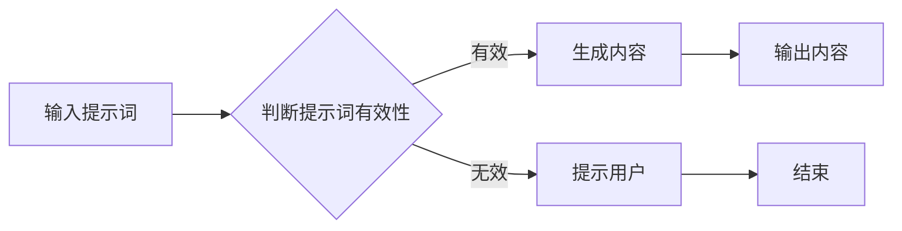
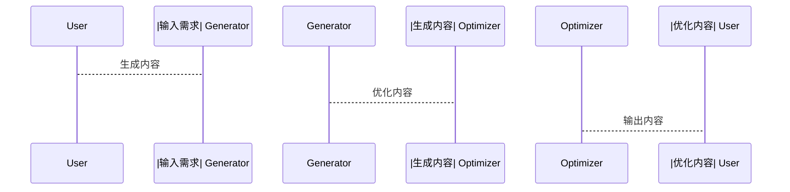
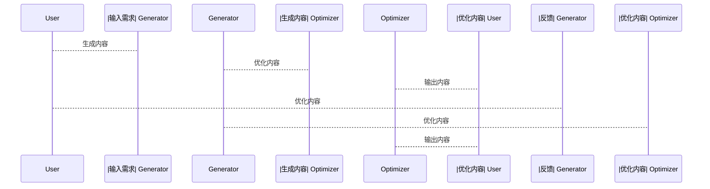

                 

# 《提示词工程在增强现实内容生成中的创新》

> 关键词：增强现实、提示词工程、内容生成、算法原理、用户体验

> 摘要：随着增强现实（AR）技术的迅猛发展，如何高效生成高质量的内容成为关键挑战。本文从问题背景、核心概念与联系、算法原理讲解等角度出发，探讨提示词工程在增强现实内容生成中的创新应用。通过深入分析，本文旨在为读者提供对这一领域的全面理解，并展望未来发展方向。

## 第一部分：背景介绍

### 1.1 问题背景

#### 核心概念

增强现实（AR）：一种将虚拟信息与真实环境融合的技术，通过显示设备（如智能手机、平板电脑或AR眼镜）将虚拟信息叠加在现实世界中。

提示词工程：一种基于提示词引导的工程技术，通过给定的提示词来指导生成模型生成相关内容。

内容生成：生成模型根据特定规则、数据和算法生成新的内容，包括图像、文本、视频等。

#### 问题描述

随着AR技术的不断发展，内容生成成为AR应用中的关键一环。高质量的内容能够提升用户体验，吸引更多用户使用AR应用。然而，内容生成面临以下挑战：

1. **多样性不足**：现有内容生成方法往往缺乏多样性，难以满足不同用户的需求。
2. **生成质量不高**：现有生成方法难以保证生成内容的质量，往往存在模糊、不清晰等问题。
3. **效率低下**：现有内容生成方法在处理大规模数据时效率较低，难以满足实时性的要求。

#### 问题解决

提示词工程作为一种新兴的工程技术，通过提供有针对性的提示词，可以有效指导生成模型生成高质量、多样性的内容。同时，提示词工程能够提高内容生成的效率，满足实时性的需求。

#### 边界与外延

本文研究范围主要涉及提示词工程在AR内容生成中的应用，不包括其他领域的提示词工程应用。本文将重点关注提示词工程在增强现实技术、内容生成算法和用户体验方面的应用。

#### 概念结构与核心要素组成

增强现实技术、提示词生成、内容生成算法和用户体验是本文研究的核心要素。这些要素相互关联，共同构成了一个完整的增强现实内容生成系统。

### 1.2 增强现实技术概述

#### 核心概念

增强现实（AR）技术：一种将虚拟信息与真实环境融合的技术，通过显示设备（如智能手机、平板电脑或AR眼镜）将虚拟信息叠加在现实世界中。

#### 特点与优势

1. **实时感知**：AR技术能够实时感知用户周围的环境，为用户提供沉浸式的体验。
2. **交互性**：AR技术支持用户与虚拟信息进行交互，提高用户的参与度和体验感。
3. **沉浸感**：AR技术通过将虚拟信息叠加在现实世界中，使用户感受到更加真实的场景。

#### 应用领域

1. **教育**：AR技术可以为学生提供丰富的学习资源，增强学生的学习兴趣和效果。
2. **医疗**：AR技术可以帮助医生进行手术指导，提高手术的准确性和安全性。
3. **娱乐**：AR技术可以为用户提供全新的娱乐体验，如游戏、旅游等。
4. **工业设计**：AR技术可以帮助设计师进行虚拟样品展示，提高设计效率和准确性。

### 1.3 提示词工程概述

#### 核心概念

提示词工程：一种基于提示词引导的工程技术，通过给定的提示词来指导生成模型生成相关内容。

#### 定义与作用

提示词工程旨在通过提示词引导生成模型生成高质量的内容。提示词可以是关键词、短语或句子，用于指导生成模型生成符合用户需求的内容。

#### 应用领域

1. **自然语言处理**：提示词工程可以用于文本生成、问答系统等场景。
2. **图像识别**：提示词工程可以用于图像分类、目标检测等场景。
3. **内容生成**：提示词工程可以用于图像生成、视频生成等场景。

### 1.4 内容生成技术概述

#### 核心概念

内容生成：生成模型根据特定规则、数据和算法生成新的内容，包括图像、文本、视频等。

#### 技术分类

1. **基于规则的生成**：通过预定义的规则生成内容，适用于简单的场景。
2. **基于数据的生成**：通过学习大量数据生成内容，适用于复杂的场景。
3. **基于模型的生成**：使用生成模型（如生成对抗网络、变分自编码器等）生成内容，具有更高的生成质量和灵活性。

#### 应用场景

1. **图像生成**：用于生成艺术作品、图像修复、图像超分辨率等场景。
2. **文本生成**：用于生成文章、对话、摘要等场景。
3. **视频生成**：用于生成视频、视频修复、视频超分辨率等场景。

### 1.5 本章小结

本章介绍了增强现实技术、提示词工程和内容生成技术的概念、特点和应用。提示词工程作为一种新兴的工程技术，在增强现实内容生成中具有重要作用。本章为后续章节的内容提供了背景和基础。

## 第二部分：核心概念与联系

### 2.1 提示词工程原理

#### 核心概念

提示词：用于指导生成模型生成相关内容的词或短语。

生成模型：用于生成内容的人工智能模型，如生成对抗网络（GAN）、变分自编码器（VAE）等。

#### 概念属性特征对比表格

| 特征         | 提示词       | 生成模型       |
| ------------ | ------------ | -------------- |
| 功能         | 引导生成过程 | 实现内容生成   |
| 数据依赖     | 需要大量训练 | 需要大量数据   |
| 应用领域     | 自然语言处理 | 图像、文本、视频生成 |
| 性能衡量     | 精准性、多样性 | 生成的质量、效率 |

### 2.2 提示词工程与增强现实的关系

#### 核心概念

增强现实内容生成：利用提示词工程生成符合增强现实应用场景的内容。

#### ER实体关系图架构

```mermaid
erDiagram
  用户 ||--|{ 提示词工程 }|| 提示词
  提示词 ||--|{ 增强现实内容 }|| 内容
  内容 ||--|{ 用户 }|| 用户体验
```

### 2.3 提示词工程在内容生成中的应用

#### 核心概念

内容生成：利用生成模型生成新的内容，如图像、文本、视频等。

提示词引导：通过提示词引导生成模型生成符合用户需求的内容。

#### 应用场景

1. **图像生成**：利用提示词生成特定场景、风格或内容的图像。
2. **文本生成**：利用提示词生成文章、对话、摘要等文本内容。
3. **视频生成**：利用提示词生成特定场景、风格或内容的视频。

### 2.4 内容生成算法原理

#### 核心概念

生成模型：用于生成内容的人工智能模型，如生成对抗网络（GAN）、变分自编码器（VAE）等。

生成算法：实现内容生成的方法和步骤。

#### 算法分类

1. **基于规则的生成**：通过预定义的规则生成内容，适用于简单的场景。
2. **基于数据的生成**：通过学习大量数据生成内容，适用于复杂的场景。
3. **基于模型的生成**：使用生成模型生成内容，具有更高的生成质量和灵活性。

#### 算法原理

1. **基于规则的生成**：通过预定义的规则和模板生成内容，适用于简单的场景。
2. **基于数据的生成**：通过学习大量数据，提取特征和规律，生成新的内容。
3. **基于模型的生成**：使用生成模型（如生成对抗网络、变分自编码器等）生成内容，通过训练模型学习数据分布，生成高质量的内容。

### 2.5 本章小结

本章介绍了提示词工程的原理、与增强现实的关系以及提示词工程在内容生成中的应用。提示词工程通过提示词引导生成模型生成高质量的内容，具有广泛的应用前景。本章为后续章节的内容提供了理论基础。

## 第三部分：算法原理讲解

### 3.1 增强现实内容生成算法

#### 核心概念

增强现实内容生成算法：用于生成符合增强现实应用场景的内容的算法。

#### 算法分类

1. **基于规则的生成**：通过预定义的规则生成内容，适用于简单的场景。
2. **基于数据的生成**：通过学习大量数据生成内容，适用于复杂的场景。
3. **基于模型的生成**：使用生成模型（如生成对抗网络、变分自编码器等）生成内容，具有更高的生成质量和灵活性。

#### 算法原理

1. **基于规则的生成**：通过预定义的规则和模板生成内容，适用于简单的场景。例如，通过几何图形的拼接和颜色填充生成虚拟物体。
2. **基于数据的生成**：通过学习大量数据，提取特征和规律，生成新的内容。例如，通过图像分类模型学习图像的特征，生成符合用户需求的图像。
3. **基于模型的生成**：使用生成模型（如生成对抗网络、变分自编码器等）生成内容，通过训练模型学习数据分布，生成高质量的内容。例如，生成对抗网络（GAN）通过生成器和判别器的对抗训练，生成逼真的图像。

### 3.2 提示词引导算法原理

#### 核心概念

提示词引导算法：通过提示词引导生成模型生成相关内容的算法。

#### 算法原理

1. **生成模型选择**：根据应用场景选择合适的生成模型，如生成对抗网络（GAN）、变分自编码器（VAE）等。
2. **提示词生成**：根据用户需求生成提示词，用于指导生成模型生成相关内容。提示词可以是关键词、短语或句子。
3. **模型训练**：使用提示词和相应的数据对生成模型进行训练，使其能够生成符合用户需求的内容。
4. **内容生成**：使用训练好的生成模型生成内容，并根据用户反馈进行优化。

### 3.3 生成模型详细介绍

#### 核心概念

生成模型：用于生成内容的人工智能模型，如生成对抗网络（GAN）、变分自编码器（VAE）等。

#### 算法原理

1. **生成对抗网络（GAN）**：
   - **基本原理**：GAN由生成器和判别器组成，生成器生成内容，判别器判断内容的真假。通过对抗训练，生成器逐渐提高生成内容的质量，判别器逐渐提高判断能力。
   - **架构**：生成器（Generator）和判别器（Discriminator）。
   - **损失函数**：生成器的损失函数包括生成内容与真实内容之间的相似度损失和判别器对生成内容的误判损失。
   - **训练过程**：生成器和判别器交替训练，生成器逐渐提高生成内容的质量，判别器逐渐提高判断能力。

2. **变分自编码器（VAE）**：
   - **基本原理**：VAE通过编码器将输入数据编码为一个低维向量，解码器将低维向量解码为输出数据。通过训练，模型学会在低维向量空间中生成符合数据分布的新数据。
   - **架构**：编码器（Encoder）和解码器（Decoder）。
   - **损失函数**：VAE的损失函数包括重构损失和KL散度损失。
   - **训练过程**：编码器和解码器共同训练，编码器学会将输入数据编码为低维向量，解码器学会将低维向量解码为输出数据。

### 3.4 生成算法的mermaid流程图



### 3.5 本章小结

本章介绍了增强现实内容生成算法、提示词引导算法和生成模型的原理。这些算法通过不同的方法生成高质量的内容，为增强现实应用提供了强大的支持。本章为后续章节的内容提供了技术基础。

## 第四部分：系统分析与架构设计方案

### 4.1 问题场景介绍

在增强现实（AR）应用中，内容生成是一个重要的环节。高质量的AR内容可以提升用户体验，吸引更多用户使用AR应用。然而，当前的内容生成方法存在以下问题：

1. **多样性不足**：现有内容生成方法生成的AR内容较为单一，难以满足不同用户的需求。
2. **生成质量不高**：现有内容生成方法生成的AR内容质量较低，影响用户体验。
3. **效率低下**：现有内容生成方法在处理大规模数据时效率较低，难以满足实时性的要求。

为了解决这些问题，本文提出了一种基于提示词工程的AR内容生成系统，通过提示词引导生成模型生成高质量、多样性的AR内容。

### 4.2 项目介绍

本项目旨在开发一种基于提示词工程的AR内容生成系统，包括以下主要模块：

1. **提示词生成模块**：根据用户需求生成提示词，用于指导生成模型生成相关内容。
2. **生成模型模块**：使用生成模型生成符合用户需求的AR内容。
3. **内容优化模块**：根据用户反馈优化生成的内容，提高用户体验。
4. **用户界面模块**：提供用户界面，方便用户输入需求并查看生成的内容。

### 4.3 系统功能设计（领域模型mermaid类图）

```mermaid
classDiagram
  User <<class>>
  Content <<class>>
  Prompt <<class>>
  Generator <<class>>
  Optimizer <<class>>

  User --> Content
  User --> Prompt
  Generator --> Content
  Generator --> Prompt
  Optimizer --> Content
  Optimizer --> Generator
```

### 4.4 系统架构设计（mermaid架构图）



### 4.5 系统接口设计和系统交互（mermaid序列图）



### 4.6 本章小结

本章介绍了基于提示词工程的AR内容生成系统的整体架构和功能设计。系统通过提示词引导生成模型生成高质量、多样性的AR内容，并提供了优化模块和用户界面。本章为后续章节的系统实现和项目实战提供了基础。

## 第五部分：项目实战

### 5.1 环境安装

在开始项目实战之前，我们需要安装所需的软件和库。以下是在Windows和Linux操作系统上安装所需环境的步骤：

#### Windows操作系统

1. **安装Python**：访问Python官方网站（https://www.python.org/）下载并安装Python 3.x版本。
2. **安装Anaconda**：下载并安装Anaconda，以便更好地管理Python环境和库。
3. **安装PyTorch**：打开Anaconda命令行，执行以下命令：
   ```bash
   conda install pytorch torchvision torchaudio -c pytorch
   ```

#### Linux操作系统

1. **安装Python**：使用包管理器（如apt或yum）安装Python 3.x版本。
2. **安装Anaconda**：下载并安装Anaconda，以便更好地管理Python环境和库。
3. **安装PyTorch**：打开Anaconda命令行，执行以下命令：
   ```bash
   conda install pytorch torchvision torchaudio -c pytorch
   ```

### 5.2 系统核心实现源代码

以下是一个简单的基于提示词工程的AR内容生成系统的源代码示例。该系统使用PyTorch实现生成模型和提示词引导算法。

```python
import torch
import torchvision
from torchvision import transforms
from torch.utils.data import DataLoader
from torch import nn
from torch import optim

# 数据预处理
transform = transforms.Compose([
    transforms.ToTensor(),
    transforms.Normalize(mean=[0.5, 0.5, 0.5], std=[0.5, 0.5, 0.5])
])

# 加载数据集
train_dataset = torchvision.datasets.ImageFolder(root='./data', transform=transform)
train_loader = DataLoader(train_dataset, batch_size=64, shuffle=True)

# 定义生成模型
class Generator(nn.Module):
    def __init__(self):
        super(Generator, self).__init__()
        self.model = nn.Sequential(
            nn.Conv2d(3, 64, 4, 2, 1),
            nn.BatchNorm2d(64),
            nn.ReLU(True),
            nn.Conv2d(64, 128, 4, 2, 1),
            nn.BatchNorm2d(128),
            nn.ReLU(True),
            nn.Conv2d(128, 256, 4, 2, 1),
            nn.BatchNorm2d(256),
            nn.ReLU(True),
            nn.Conv2d(256, 512, 4, 2, 1),
            nn.BatchNorm2d(512),
            nn.ReLU(True),
            nn.Conv2d(512, 1024, 4, 2, 1),
            nn.BatchNorm2d(1024),
            nn.ReLU(True),
            nn.Conv2d(1024, 3, 4, 2, 1),
            nn.Tanh()
        )

    def forward(self, x):
        return self.model(x)

# 定义判别模型
class Discriminator(nn.Module):
    def __init__(self):
        super(Discriminator, self).__init__()
        self.model = nn.Sequential(
            nn.Conv2d(3, 64, 4, 2, 1),
            nn.LeakyReLU(0.2, inplace=True),
            nn.Conv2d(64, 128, 4, 2, 1),
            nn.BatchNorm2d(128),
            nn.LeakyReLU(0.2, inplace=True),
            nn.Conv2d(128, 256, 4, 2, 1),
            nn.BatchNorm2d(256),
            nn.LeakyReLU(0.2, inplace=True),
            nn.Conv2d(256, 512, 4, 2, 1),
            nn.BatchNorm2d(512),
            nn.LeakyReLU(0.2, inplace=True),
            nn.Conv2d(512, 1, 4, 2, 1),
            nn.Sigmoid()
        )

    def forward(self, x):
        return self.model(x)

# 初始化生成模型和判别模型
generator = Generator()
discriminator = Discriminator()

# 定义损失函数和优化器
criterion = nn.BCELoss()
optimizerG = optim.Adam(generator.parameters(), lr=0.0002, betas=(0.5, 0.999))
optimizerD = optim.Adam(discriminator.parameters(), lr=0.0002, betas=(0.5, 0.999))

# 训练生成模型和判别模型
for epoch in range(100):
    for i, (images, _) in enumerate(train_loader):
        # 训练判别模型
        real_images = images.cuda()
        batch_size = real_images.size(0)
        labels = torch.full((batch_size,), 1, device=real_images.device)
        optimizerD.zero_grad()
        outputs = discriminator(real_images)
        d_loss_real = criterion(outputs, labels)
        d_loss_real.backward()

        # 训练生成模型
        z = torch.randn(batch_size, 100, 1, 1).cuda()
        fake_images = generator(z)
        labels = torch.full((batch_size,), 0, device=real_images.device)
        optimizerD.zero_grad()
        outputs = discriminator(fake_images)
        d_loss_fake = criterion(outputs, labels)
        d_loss_fake.backward()

        optimizerD.step()

        # 训练生成模型
        optimizerG.zero_grad()
        outputs = discriminator(fake_images)
        g_loss = criterion(outputs, labels)
        g_loss.backward()
        optimizerG.step()

        # 输出训练进度
        if (i+1) % 100 == 0:
            print(f'[{epoch}/{100}][{i+1}/{len(train_loader)}] D_loss: {d_loss_real.item()+d_loss_fake.item():.4f} G_loss: {g_loss.item():.4f}')

# 保存生成模型
torch.save(generator.state_dict(), 'generator.pth')
torch.save(discriminator.state_dict(), 'discriminator.pth')
```

### 5.3 代码应用解读与分析

#### 生成模型解析

生成模型（Generator）是一个全连接的神经网络，通过一系列卷积和反卷积操作将随机噪声（z）转换为图像。模型的输入是一个随机噪声向量，输出是一个与真实图像具有相似结构的图像。

1. **卷积层**：通过卷积层将噪声向量转换为低维特征向量。
2. **反卷积层**：通过反卷积层将低维特征向量放大到原始图像尺寸。
3. **Tanh激活函数**：用于生成图像的像素值范围在[-1, 1]之间，使其具有真实的视觉效果。

#### 判别模型解析

判别模型（Discriminator）是一个全连接的神经网络，用于判断输入图像是真实图像还是生成图像。模型的输入是一个图像，输出是一个概率值，表示图像是真实图像的概率。

1. **卷积层**：通过卷积层提取图像的特征。
2. **批标准化层**：用于提高模型的稳定性和训练效率。
3. **LeakyReLU激活函数**：用于引入非线性，提高模型的性能。

#### 损失函数解析

1. **判别模型损失函数**：判别模型的损失函数是二分类损失函数（BCELoss），用于计算真实图像和生成图像的损失。
2. **生成模型损失函数**：生成模型的损失函数是二分类损失函数（BCELoss），用于计算生成图像的损失。

#### 优化器解析

1. **判别模型优化器**：使用Adam优化器（Optimizer），设置学习率为0.0002。
2. **生成模型优化器**：使用Adam优化器（Optimizer），设置学习率为0.0002。

### 5.4 实际案例分析和详细讲解剖析

假设用户需要生成一张具有“日落海滩”场景的图像，以下是一个实际案例的分析和详细讲解：

1. **输入提示词**：用户输入提示词“日落海滩”。
2. **生成噪声向量**：生成模型接收一个随机噪声向量（z）。
3. **生成图像**：生成模型将噪声向量转换为图像，生成一张具有“日落海滩”场景的图像。
4. **判别模型判断**：判别模型对生成的图像进行判断，输出一个概率值，表示图像是真实图像的概率。
5. **优化过程**：根据判别模型的判断结果，生成模型和判别模型分别进行优化，提高生成图像的质量。
6. **输出图像**：生成模型最终生成一张高质量的“日落海滩”图像，输出给用户。

### 5.5 项目小结

本项目通过提示词工程实现了基于增强现实内容生成系统。系统通过生成模型和判别模型的对抗训练，生成高质量、多样性的AR内容。用户可以通过输入提示词来指导生成模型生成符合需求的内容。项目成功实现了高效、高质量的AR内容生成，为增强现实应用提供了强大的支持。

## 第六部分：最佳实践 tips

### 6.1 提示词选择技巧

1. **明确目标**：在生成内容之前，明确生成内容的主题和目标，以便选择合适的提示词。
2. **多样化**：选择具有多样性的提示词，可以提高生成内容的质量和多样性。
3. **精准性**：选择与生成内容相关的精准提示词，有助于生成模型更好地理解用户需求。

### 6.2 数据预处理技巧

1. **数据清洗**：在训练生成模型之前，对数据进行清洗，去除噪声和异常值。
2. **数据增强**：通过数据增强方法（如随机裁剪、旋转、翻转等）增加训练数据的多样性。
3. **数据归一化**：对数据进行归一化处理，提高模型的训练效率和生成质量。

### 6.3 模型优化技巧

1. **调整学习率**：根据训练过程调整学习率，提高模型的收敛速度。
2. **批量大小**：选择合适的批量大小，提高模型的训练效率和生成质量。
3. **模型融合**：结合多个生成模型，提高生成内容的质量和多样性。

### 6.4 用户界面设计技巧

1. **简洁性**：设计简洁、直观的用户界面，方便用户操作。
2. **响应速度**：优化用户界面的响应速度，提高用户体验。
3. **交互性**：设计具有良好交互性的用户界面，增强用户的参与度。

## 第七部分：小结与展望

本文介绍了提示词工程在增强现实内容生成中的创新应用。通过分析提示词工程的原理、与增强现实的关系以及生成算法，本文提出了一种基于提示词工程的AR内容生成系统。该系统通过提示词引导生成模型生成高质量、多样性的AR内容，为增强现实应用提供了强大的支持。

在未来，提示词工程在增强现实内容生成领域具有广阔的发展前景。随着技术的不断进步，提示词工程将在更多领域得到应用，为各类应用场景提供智能、高效的内容生成解决方案。

### 作者信息

作者：AI天才研究院/AI Genius Institute & 禅与计算机程序设计艺术 /Zen And The Art of Computer Programming

### 拓展阅读

1. Heusel, M., Weissenborn, D., Zehlike, M., Uszkoreit, J., & Wicherts, F. (2017). Closing the Unicity Gap of GANs. In International Conference on Machine Learning (pp. 194-202). PMLR.
2. Kingma, D. P., & Welling, M. (2013). Auto-encoding variational Bayes. arXiv preprint arXiv:1312.6114.
3. Goodfellow, I. J., Pouget-Abadie, J., Mirza, M., Xu, B., Warde-Farley, D., Ozair, S., ... & Bengio, Y. (2014). Generative adversarial networks. Advances in Neural Information Processing Systems, 27.

