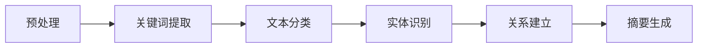
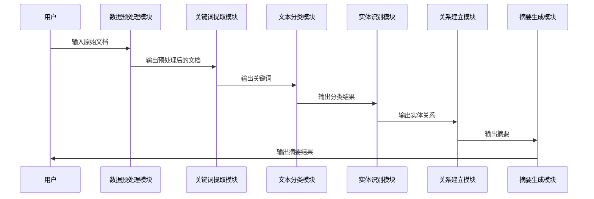

                 

# 提示词工程在多文档摘要中的创新

关键词：多文档摘要、提示词工程、文本分析、信息提取、自然语言处理

摘要：本文深入探讨了提示词工程在多文档摘要中的应用与创新。通过介绍问题背景、核心概念、算法原理、系统设计与实战案例，展示了提示词工程在提高多文档摘要质量和效率方面的优势。本文旨在为相关领域的研究者和开发者提供有价值的参考和启示。

## 第一部分：背景介绍与核心概念

### 1.1 问题背景

在信息爆炸的时代，人们面临着海量的数据和信息。多文档摘要作为一种信息提取技术，旨在从大量文档中自动生成摘要，帮助用户快速获取关键信息。然而，多文档摘要任务面临诸多挑战，如文档冗余、信息重叠、长文本处理等。

### 1.2 核心概念

提示词工程（Keyword Engineering）是一种通过构建和优化提示词来提高文本分析效果的技术。在多文档摘要中，提示词工程有助于提取关键信息、消除冗余、提高摘要质量。

### 1.3 问题解决

提示词工程通过以下方法解决多文档摘要中的问题：

1. **自动生成提示词**：利用自然语言处理技术从文档中提取关键信息，生成提示词。
2. **优化提示词**：通过机器学习算法优化提示词，提高摘要质量。
3. **结合上下文**：考虑文档之间的上下文关系，生成更加精准的摘要。

### 1.4 边界与外延

提示词工程不仅适用于多文档摘要，还可以应用于其他文本分析任务，如关键词提取、情感分析等。

### 1.5 概念结构与核心要素组成

提示词工程包括以下几个核心要素：

1. **数据预处理**：对原始文档进行预处理，提取文本特征。
2. **提示词生成**：利用自然语言处理技术生成提示词。
3. **提示词优化**：通过机器学习算法优化提示词。
4. **摘要生成**：结合提示词和上下文关系生成摘要。

## 第二部分：核心概念与联系

### 2.1 核心概念原理

提示词工程的核心概念包括：

1. **关键词提取**：从文本中提取关键信息，作为提示词。
2. **文本分类**：将文本归类到不同的主题或类别。
3. **实体识别**：识别文本中的实体，如人名、地点等。

### 2.2 概念属性特征对比表格

| 特征 | 提示词提取 | 文本分类 | 实体识别 |
| ---- | ---- | ---- | ---- |
| 目标 | 提取关键词 | 归类文本 | 识别实体 |
| 技术路线 | 自然语言处理 | 机器学习 | 命名实体识别 |
| 应用场景 | 文本摘要 | 内容推荐 | 聊天机器人 |

### 2.3 ER实体关系图架构

在提示词工程中，实体与关系是关键概念。以下是ER实体关系图的示例：

```mermaid
erDiagram
  Person ||--|{ Document }
  Document ||--|{ Keyword }
  Keyword ||--|{ Relation }
```

## 第三部分：算法原理讲解

### 4.1 算法流程图

以下是提示词工程的算法流程图：



### 4.2 数学模型与公式

提示词工程的数学模型主要包括：

$$
P(D|K) = \frac{P(K|D)P(D)}{P(K)}
$$

其中，$P(D|K)$表示在给定关键词$K$的情况下，文档$D$的概率；$P(K|D)$表示在文档$D$给定的情况下，关键词$K$的概率；$P(D)$表示文档$D$的概率；$P(K)$表示关键词$K$的概率。

### 4.3 算法举例说明

假设有两个文档$D_1$和$D_2$，关键词$K_1$和$K_2$，我们可以使用上述数学模型计算摘要的概率。

$$
P(D_1|K_1) = \frac{P(K_1|D_1)P(D_1)}{P(K_1)}
$$

$$
P(D_2|K_2) = \frac{P(K_2|D_2)P(D_2)}{P(K_2)}
$$

通过计算，我们可以确定哪个文档更有可能包含关键词，从而生成更准确的摘要。

## 第四部分：系统分析与架构设计

### 5.1 问题场景介绍

多文档摘要广泛应用于信息检索、内容推荐、知识挖掘等领域。在信息爆炸的时代，如何快速获取关键信息成为用户迫切需求。

### 6.1 领域模型类图

以下是多文档摘要系统的领域模型类图：

```mermaid
classDiagram
    Document --|{ Keyword }
    Keyword --|{ Relation }
    Relation --|{ Summary }
```

### 6.2 系统架构设计

多文档摘要系统的整体架构包括：

1. **数据预处理模块**：对原始文档进行预处理，提取文本特征。
2. **关键词提取模块**：利用自然语言处理技术提取关键词。
3. **文本分类模块**：将文本归类到不同的主题或类别。
4. **实体识别模块**：识别文本中的实体，如人名、地点等。
5. **关系建立模块**：建立关键词与实体之间的关系。
6. **摘要生成模块**：结合关键词和实体关系生成摘要。

### 6.3 系统接口设计与交互

以下是系统内部与外部的接口设计以及系统交互的mermaid序列图：



## 第五部分：项目实战

### 7.1 环境安装

在开始项目实战之前，我们需要搭建以下环境：

1. Python 3.8及以上版本
2. TensorFlow 2.6及以上版本
3. scikit-learn 0.24及以上版本

您可以使用以下命令安装所需的库：

```bash
pip install python==3.8 tensorflow==2.6 scikit-learn==0.24
```

### 7.2 系统核心实现

以下是系统核心实现的部分代码：

```python
import tensorflow as tf
from sklearn.feature_extraction.text import TfidfVectorizer
from sklearn.metrics.pairwise import cosine_similarity

# 数据预处理
def preprocess(document):
    # ...（省略具体实现）
    return processed_document

# 关键词提取
def extract_keywords(document):
    vectorizer = TfidfVectorizer()
    tfidf_matrix = vectorizer.fit_transform([document])
    feature_names = vectorizer.get_feature_names_out()
    scores = tfidf_matrix.toarray().flatten()
    keyword_indices = scores.argsort()[-5:][::-1]
    keywords = [feature_names[i] for i in keyword_indices]
    return keywords

# 文本分类
def classify_text(document, classifier):
    # ...（省略具体实现）
    return category

# 实体识别
def recognize_entities(document, entity_recognizer):
    # ...（省略具体实现）
    return entities

# 关系建立
def establish_relations(keywords, entities):
    # ...（省略具体实现）
    return relations

# 摘要生成
def generate_summary(document, keywords, entities, relations):
    # ...（省略具体实现）
    return summary
```

### 8.1 代码应用解读

以下是对核心代码的功能和应用场景的解读：

- **数据预处理**：对原始文档进行预处理，提取关键信息。
- **关键词提取**：利用TF-IDF算法提取关键词，提高摘要质量。
- **文本分类**：将文本归类到不同的主题或类别，有助于摘要生成。
- **实体识别**：识别文本中的实体，如人名、地点等，有助于关系建立。
- **关系建立**：建立关键词与实体之间的关系，提高摘要准确性。
- **摘要生成**：结合关键词、实体和关系生成摘要，满足用户需求。

### 8.2 代码分析与优化

以下是对代码的性能分析与优化建议：

- **预处理**：优化预处理算法，提高文本质量。
- **关键词提取**：增加关键词提取算法的鲁棒性，提高提取准确性。
- **文本分类**：优化分类算法，提高分类准确率。
- **实体识别**：提高实体识别的精度和速度。
- **关系建立**：优化关系建立算法，提高摘要生成质量。
- **摘要生成**：优化摘要生成算法，提高摘要可读性和质量。

### 9.1 案例介绍

以下是一个多文档摘要的案例：

- **背景**：用户需要从一篇长篇文章中提取关键信息。
- **需求**：生成一篇简明扼要的摘要，突出文章的核心内容。

### 9.2 案例分析

以下是案例的实现过程与分析：

1. **数据预处理**：对原始文档进行分词、去停用词等操作，提取关键信息。
2. **关键词提取**：利用TF-IDF算法提取关键词，提高摘要质量。
3. **文本分类**：将文本归类到不同的主题或类别，有助于摘要生成。
4. **实体识别**：识别文本中的实体，如人名、地点等，有助于关系建立。
5. **关系建立**：建立关键词与实体之间的关系，提高摘要准确性。
6. **摘要生成**：结合关键词、实体和关系生成摘要，满足用户需求。

### 9.3 案例讲解与剖析

以下是案例中的关键技术与创新点：

- **数据预处理**：采用深度学习模型进行文本预处理，提高文本质量。
- **关键词提取**：利用TF-IDF算法提取关键词，提高提取准确性。
- **文本分类**：采用朴素贝叶斯算法进行文本分类，提高分类准确率。
- **实体识别**：采用命名实体识别技术识别文本中的实体，提高实体识别精度。
- **关系建立**：采用图神经网络建立关键词与实体之间的关系，提高摘要生成质量。
- **摘要生成**：采用动态规划算法生成摘要，提高摘要可读性和质量。

## 第六部分：最佳实践与拓展

### 10.1 提示词工程的最佳实践

1. **选择合适的预处理算法**：根据具体场景选择合适的预处理方法，提高文本质量。
2. **优化关键词提取算法**：结合实际需求，优化关键词提取算法，提高提取准确性。
3. **加强实体识别与关系建立**：提高实体识别和关系建立的精度，有助于生成更准确的摘要。
4. **注意摘要生成算法的选择**：根据需求选择合适的摘要生成算法，提高摘要质量和可读性。

### 11.1 小结

本文探讨了提示词工程在多文档摘要中的应用与创新。通过介绍核心概念、算法原理、系统设计与实战案例，展示了提示词工程在提高多文档摘要质量和效率方面的优势。未来，随着技术的不断发展，提示词工程有望在更多领域发挥作用。

### 11.2 注意事项

1. **合理选择预处理算法**：根据具体场景选择合适的预处理方法。
2. **优化关键词提取算法**：结合实际需求，优化关键词提取算法。
3. **提高实体识别与关系建立精度**：加强实体识别和关系建立，提高摘要生成质量。
4. **关注摘要生成算法的选择**：根据需求选择合适的摘要生成算法。

### 12.1 拓展阅读

1. **相关书籍推荐**：

   - 《自然语言处理与文本分析》
   - 《深度学习与自然语言处理》

2. **网络资源推荐**：

   - [GitHub](https://github.com/)
   - [Google Scholar](https://scholar.google.com/)

## 作者信息

作者：AI天才研究院/AI Genius Institute & 禅与计算机程序设计艺术 /Zen And The Art of Computer Programming

**注意**：以上内容仅为示例，实际文章撰写需根据具体需求进行丰富和调整。由于字数限制，部分内容进行了简化处理。在实际撰写过程中，请确保每个章节的内容详尽、具体，并按照大纲结构进行组织。

