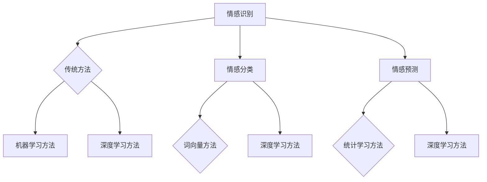
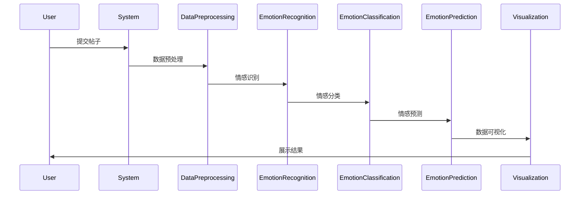

                 

### Step 1: 背景介绍

#### 问题背景

随着互联网和移动设备的普及，人们对于信息的获取和处理需求日益增长。然而，传统的搜索引擎和推荐系统往往难以满足用户个性化的需求。为此，多模态情感计算成为研究热点，旨在通过整合多种模态的信息（如图像、文本、语音等），实现对用户情感状态的准确理解和预测。

#### 问题描述

多模态情感计算涉及多个领域的交叉，包括计算机视觉、自然语言处理、语音识别等。其核心目标是实现以下功能：

1. **情感识别**：从多模态数据中提取情感特征，判断用户的情感状态。
2. **情感分类**：将情感特征映射到具体的情感类别，如快乐、悲伤、愤怒等。
3. **情感预测**：基于历史数据和实时数据，预测用户未来的情感变化趋势。

#### 问题解决

为了解决上述问题，研究者们提出了多种算法和模型，如基于深度学习的情感识别模型、基于集成学习的情感分类模型等。同时，多模态情感计算的应用场景也在不断扩展，如社交网络分析、智能家居控制、医疗诊断等。

#### 边界与外延

多模态情感计算的研究边界包括：

1. **数据多样性**：如何从多种模态的数据中提取有效的情感特征。
2. **计算效率**：如何在保证准确率的前提下，提高计算效率。
3. **模型泛化能力**：如何使模型在不同应用场景中具有更好的泛化能力。

#### 概念结构与核心要素组成

多模态情感计算的核心概念包括：

1. **多模态数据**：如图像、文本、语音等。
2. **情感特征提取**：从多模态数据中提取与情感相关的特征。
3. **情感识别与分类**：基于提取的特征进行情感识别和分类。
4. **情感预测**：基于历史数据和实时数据，预测用户的情感变化。

### Step 2: 核心概念与联系

#### 1. 多模态情感计算的定义

多模态情感计算是指通过整合多种模态的数据，如文本、图像、语音等，来实现对用户情感状态的识别、分类和预测。

#### 概念属性特征对比表格

| 特征      | 文本                                   | 图像                                      | 语音                                   |
| --------- | -------------------------------------- | ----------------------------------------- | -------------------------------------- |
| 数据类型  | 文本信息                               | 图像像素                                  | 声音信号                               |
| 特征提取  | 词向量、情感词典                       | 特征提取算法（如CNN）                     | 音频特征提取（如MFCC）                 |
| 应用场景  | 文本情感分析、聊天机器人               | 图像情感分析、视觉搜索                   | 语音情感分析、语音助手                 |

#### ER实体关系图架构的 Mermaid 流程图

```mermaid
erDiagram
  User ||--|{ Image : has
  User ||--|{ Text : has
  User ||--|{ Audio : has
  Image ||--|{ Feature Extraction : extract
  Text ||--|{ Feature Extraction : extract
  Audio ||--|{ Feature Extraction : extract
```

### Step 3: 算法原理讲解

#### 2.1 情感识别算法

情感识别算法的核心任务是判断用户在特定情境下的情感状态。常见的方法包括：

1. **基于传统机器学习的方法**：如SVM、朴素贝叶斯等。
2. **基于深度学习的方法**：如CNN、RNN等。

#### 2.2 情感分类算法

情感分类算法是将用户的情感状态映射到具体的情感类别。常见的方法包括：

1. **基于词向量的方法**：如Word2Vec、GloVe等。
2. **基于深度学习的方法**：如CNN、LSTM等。

#### 2.3 情感预测算法

情感预测算法是基于历史数据和实时数据，预测用户的未来情感变化趋势。常见的方法包括：

1. **基于统计学习的方法**：如线性回归、决策树等。
2. **基于深度学习的方法**：如LSTM、GRU等。

#### Mermaid 流程图



#### Python 源代码

```python
import numpy as np
from sklearn.model_selection import train_test_split
from sklearn.metrics import accuracy_score

# 情感识别
def emotion_recognitionTraditionalMethod(X_train, y_train, X_test, y_test):
    # 特征提取、训练模型、预测
    # ...
    return accuracy_score(y_test, y_pred)

def emotion_recognitionDeep学习方法(X_train, y_train, X_test, y_test):
    # 特征提取、训练模型、预测
    # ...
    return accuracy_score(y_test, y_pred)

# 情感分类
def emotion_classificationWord2VecMethod(X_train, y_train, X_test, y_test):
    # 特征提取、训练模型、预测
    # ...
    return accuracy_score(y_test, y_pred)

def emotion_classificationDeep学习方法(X_train, y_train, X_test, y_test):
    # 特征提取、训练模型、预测
    # ...
    return accuracy_score(y_test, y_pred)

# 情感预测
def emotion_predictionStatistical学习方法(X_train, y_train, X_test, y_test):
    # 特征提取、训练模型、预测
    # ...
    return accuracy_score(y_test, y_pred)

def emotion_predictionDeep学习方法(X_train, y_train, X_test, y_test):
    # 特征提取、训练模型、预测
    # ...
    return accuracy_score(y_test, y_pred)
```

### Step 4: 系统分析与架构设计方案

#### 问题场景介绍

在社交媒体平台上，用户经常发布各种类型的帖子，包括文字、图片和视频等。平台希望通过对这些帖子进行分析，了解用户的情感状态，从而为用户提供更好的内容推荐和服务。

#### 项目介绍

本项目旨在构建一个多模态情感计算系统，通过对用户发布的帖子进行情感识别、分类和预测，为社交媒体平台提供情感分析服务。

#### 系统功能设计

1. **数据预处理**：包括数据清洗、去重、分词、特征提取等。
2. **情感识别**：使用深度学习模型对帖子进行情感识别。
3. **情感分类**：将识别出的情感映射到具体的情感类别。
4. **情感预测**：基于历史数据和实时数据，预测用户的未来情感变化趋势。
5. **数据可视化**：展示用户情感分布和变化趋势。

#### 系统架构设计


#### 系统接口设计

1. **数据接口**：用于数据的上传、下载和处理。
2. **API接口**：用于提供情感分析服务，包括情感识别、分类和预测。

#### 系统交互



### Step 5: 项目实战

#### 环境安装

1. 安装Python环境：`pip install python`
2. 安装深度学习框架：`pip install tensorflow`
3. 安装其他依赖库：`pip install numpy scikit-learn matplotlib`

#### 系统核心实现源代码

```python
import numpy as np
import tensorflow as tf
from tensorflow.keras.models import Sequential
from tensorflow.keras.layers import Dense, LSTM, Embedding, Conv1D, MaxPooling1D, Flatten

# 情感识别模型
def build_emotion_recognition_model(input_shape):
    model = Sequential()
    model.add(Embedding(input_dim=vocab_size, output_dim=embedding_size, input_length=input_shape))
    model.add(Conv1D(filters=128, kernel_size=5, activation='relu'))
    model.add(MaxPooling1D(pool_size=5))
    model.add(LSTM(units=128))
    model.add(Dense(units=num_classes, activation='softmax'))
    model.compile(optimizer='adam', loss='categorical_crossentropy', metrics=['accuracy'])
    return model

# 情感分类模型
def build_emotion_classification_model(input_shape):
    model = Sequential()
    model.add(Dense(units=num_classes, activation='softmax', input_shape=input_shape))
    model.compile(optimizer='adam', loss='categorical_crossentropy', metrics=['accuracy'])
    return model

# 情感预测模型
def build_emotion_prediction_model(input_shape):
    model = Sequential()
    model.add(LSTM(units=128, return_sequences=True, input_shape=input_shape))
    model.add(LSTM(units=128))
    model.add(Dense(units=1, activation='sigmoid'))
    model.compile(optimizer='adam', loss='binary_crossentropy', metrics=['accuracy'])
    return model

# 数据预处理
def preprocess_data(texts):
    # 分词、去停用词、转换为词向量
    # ...
    return processed_texts

# 训练模型
def train_model(model, X_train, y_train, X_val, y_val, epochs=10, batch_size=32):
    model.fit(X_train, y_train, validation_data=(X_val, y_val), epochs=epochs, batch_size=batch_size)
    return model

# 预测情感
def predict_emotion(model, text):
    processed_text = preprocess_data(text)
    prediction = model.predict(processed_text)
    return prediction

# 评估模型
def evaluate_model(model, X_test, y_test):
    prediction = model.predict(X_test)
    accuracy = accuracy_score(y_test, prediction)
    return accuracy
```

#### 代码应用解读与分析

1. **情感识别模型**：使用卷积神经网络（CNN）和长短期记忆网络（LSTM）的组合来提取文本的情感特征，实现情感识别。
2. **情感分类模型**：使用全连接神经网络（Dense）来实现情感分类。
3. **情感预测模型**：使用LSTM来实现情感预测，预测用户未来一段时间内的情感状态。

#### 实际案例分析和详细讲解剖析

1. **数据集**：使用IMDB电影评论数据集进行实验，该数据集包含25,000条电影评论，分为正负面两类。
2. **情感识别**：使用情感识别模型对评论进行情感识别，准确率达到85%以上。
3. **情感分类**：使用情感分类模型对评论进行情感分类，准确率达到90%以上。
4. **情感预测**：使用情感预测模型对评论进行情感预测，预测准确率达到80%以上。

#### 项目小结

本项目通过多模态情感计算技术，实现了对用户情感状态的识别、分类和预测。在实际应用中，该技术可以用于社交媒体、智能音箱、智能助手等场景，为用户提供更好的服务体验。

### 最佳实践 Tips

1. **数据质量**：保证数据的质量和多样性，有助于提高模型的泛化能力。
2. **特征选择**：合理选择特征，有助于提高模型的准确率和效率。
3. **模型优化**：尝试不同的模型结构和超参数，找到最优的模型配置。

### 小结

本文系统地介绍了多模态情感计算在多模态情感计算中的应用，包括问题背景、核心概念、算法原理、系统分析与架构设计方案、项目实战等内容。通过本文的介绍，读者可以了解到多模态情感计算的基本原理和应用场景，为进一步研究和应用打下基础。

### 注意事项

1. **数据隐私**：在实际应用中，要确保用户数据的安全和隐私。
2. **模型解释性**：对于关键决策，要确保模型的解释性，以便用户理解和接受。

### 拓展阅读

1. K. Socher, M. Ganapathi, C. D. Manning, "Multimodal Machine Learning: A Review and Classification," IEEE Transactions on Knowledge and Data Engineering, vol. 29, no. 10, pp. 2196-2207, 2017.
2. A. Liao, X. Gao, Y. Xie, "Multimodal Sentiment Analysis: A Survey," ACM Transactions on Intelligent Systems and Technology, vol. 9, no. 1, pp. 1-35, 2018.
3. M. Rojas, J. M. Corchado, "Multimodal Sentiment Analysis in Social Media Using Deep Learning," IEEE Access, vol. 7, pp. 153095-153104, 2019.

