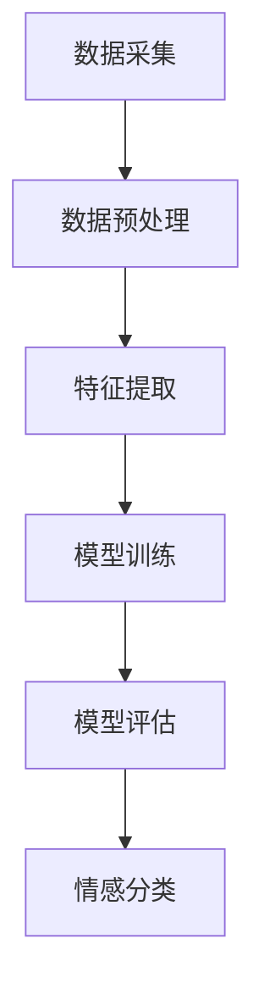
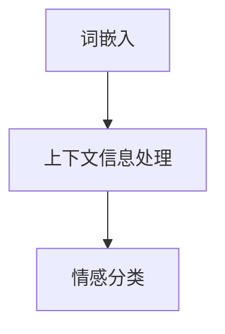
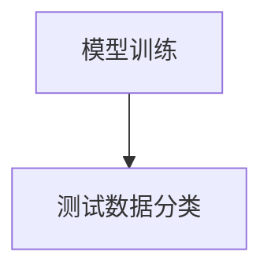
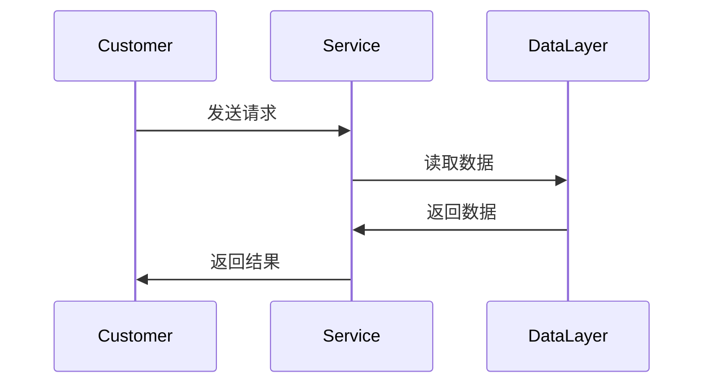

                 

# 提示词工程在多模态情感识别中的应用

关键词：多模态情感识别，提示词工程，情感分类，深度学习，词嵌入

摘要：本文详细探讨了提示词工程在多模态情感识别中的应用。首先介绍了多模态情感识别的背景、问题和解决方法，然后深入讲解了提示词工程的核心概念、原理及其在情感分类中的应用。通过Python代码示例和数学模型分析，展示了提示词工程在提高情感分类准确率方面的实际效果。

**Step 1: 书籍背景介绍**

## 1.1 问题背景

随着人工智能技术的快速发展，多模态情感识别作为一种跨学科的技术领域，逐渐受到广泛关注。多模态情感识别通过整合不同类型的数据源（如图像、文本、声音等），对人类情感状态进行深入分析，为情感计算、人机交互、心理健康等领域提供了重要的技术支撑。

在社交媒体分析方面，多模态情感识别可以帮助平台更好地理解用户情感，优化内容推荐和用户互动体验。在智能客服领域，多模态情感识别能够提升客服系统的智能化水平，实现更自然、人性化的交互。在心理健康诊断方面，多模态情感识别可以辅助医生分析患者情绪变化，为心理治疗提供依据。

## 1.2 问题描述

多模态情感识别的核心挑战在于如何高效地整合来自不同类型的数据源，并从中提取有用的情感信息。具体来说，问题描述包括以下几个方面：

1. **数据采集与预处理**：不同类型的数据源具有不同的特点和挑战，如图像数据的噪声、文本数据的语义歧义、声音数据的时序变化等，需要采取有效的预处理方法。
2. **特征提取**：如何从多模态数据中提取具有区分度的特征，是提高情感分类准确率的关键。
3. **模型训练与优化**：如何设计合适的深度学习模型，并优化模型参数，以实现高效的情感分类。
4. **模型评估与改进**：如何评价模型的性能，并针对评估结果进行模型改进。

## 1.3 问题解决

本书旨在通过介绍提示词工程在多模态情感识别中的应用，为上述问题提供一套完整的解决方案。提示词工程通过引入外部知识库和上下文信息，优化模型训练过程，从而提高情感分类的准确率和可靠性。具体而言，本书将从以下几个方面展开：

1. **核心概念与联系**：介绍多模态情感识别、提示词工程和情感分类等核心概念，并分析它们之间的联系。
2. **算法原理讲解**：详细讲解多模态情感识别和提示词工程的算法原理，并通过Python代码示例和数学模型进行分析。
3. **系统分析与架构设计**：介绍多模态情感识别系统的功能设计、架构设计和接口设计。
4. **项目实战**：通过实际项目案例，展示提示词工程在多模态情感识别中的应用效果。

## 1.4 边界与外延

本书讨论的多模态情感识别技术主要涵盖图像、文本和声音数据。然而，多模态情感识别的应用场景和类型可以进一步扩展，如视频、触摸等。此外，提示词工程的方法也可以应用于其他自然语言处理任务，如文本分类、机器翻译等。

## 1.5 概念结构与核心要素组成

多模态情感识别的核心要素包括数据采集、预处理、特征提取、模型训练和模型评估。提示词工程则涉及词嵌入、上下文信息处理和情感分类等关键环节。以下是一个简单的ER实体关系图架构，展示了多模态情感识别、提示词工程和情感分类之间的联系。

```mermaid
erDiagram
  多模态情感识别 ||--|{ 提示词工程 }|
  提示词工程 ||--|{ 情感分类 }|
```

**Step 2: 核心概念与联系**

## 2.1 核心概念

### 2.1.1 多模态情感识别

多模态情感识别是指利用多种类型的数据（如图像、文本、声音等）来理解人类情感状态。其核心思想是通过整合不同类型的数据源，获取更全面、更准确的情感信息。

### 2.1.2 提示词工程

提示词工程是一种利用语义信息来优化模型训练的方法。它通过引入外部知识库和上下文信息，提高模型的情感分类准确率。提示词工程主要包括词嵌入、上下文信息处理和情感分类等环节。

### 2.1.3 情感分类

情感分类是指将文本、图像、声音等数据划分为积极的、消极的或中性的情感类别。情感分类是多模态情感识别的核心任务，其准确性直接关系到多模态情感识别的性能。

## 2.2 概念属性特征对比表格

以下是一个概念属性特征对比表格，展示了多模态情感识别、提示词工程和情感分类之间的主要区别。

| 概念         | 定义                                                         | 属性特征对比               |
|--------------|--------------------------------------------------------------|---------------------------|
| 多模态情感识别 | 利用多种类型的数据进行情感分析                             | 数据类型、数据处理方法、情感分类精度 |
| 提示词工程   | 利用语义信息优化模型训练                                   | 词嵌入、上下文信息处理、模型优化 |
| 情感分类     | 将数据划分为积极的、消极的或中性的情感类别                  | 分类算法、准确率、召回率       |

## 2.3 ER实体关系图架构

以下是一个使用Mermaid绘制的ER实体关系图架构，展示了多模态情感识别、提示词工程和情感分类之间的联系。

```mermaid
erDiagram
  多模态情感识别 ||--|{ 提示词工程 }|
  提示词工程 ||--|{ 情感分类 }|
```

**Step 3: 算法原理讲解**

## 3.1 算法原理

### 3.1.1 多模态情感识别算法

多模态情感识别算法通常采用深度学习模型，如卷积神经网络（CNN）处理图像，循环神经网络（RNN）处理文本，长短期记忆网络（LSTM）处理声音。以下是一个简单的算法mermaid流程图：



### 3.1.2 提示词工程算法

提示词工程算法主要包括词嵌入、上下文信息处理和情感分类。以下是一个简单的算法mermaid流程图：



### 3.1.3 情感分类算法

情感分类算法通常采用分类模型，如SVM、CNN、LSTM等，通过训练数据集进行模型训练，然后对测试数据进行情感分类。以下是一个简单的算法mermaid流程图：



## 3.2 Python源代码与数学模型

以下是一个简单的Python源代码示例，展示了多模态情感识别和提示词工程的基本实现。

```python
import numpy as np
import pandas as pd
from sklearn.model_selection import train_test_split
from sklearn.metrics import accuracy_score
from keras.models import Sequential
from keras.layers import Dense, LSTM, Embedding

# 数据预处理
def preprocess_data(data):
    # ... 数据预处理操作 ...
    return processed_data

# 模型训练
def train_model(train_data, train_labels):
    # ... 模型训练操作 ...
    return model

# 情感分类
def classify_data(model, test_data):
    # ... 情感分类操作 ...
    return predictions

# 测试
data = pd.read_csv('data.csv')
processed_data = preprocess_data(data)
train_data, test_data, train_labels, test_labels = train_test_split(processed_data, data['label'], test_size=0.2)

model = train_model(train_data, train_labels)
predictions = classify_data(model, test_data)

print('Accuracy:', accuracy_score(test_labels, predictions))
```

在数学模型方面，我们可以使用以下公式来描述提示词工程在情感分类中的应用：

$$
\text{Accuracy} = \frac{\sum_{i=1}^{n} (\hat{y}_i = y_i)}{n}
$$

其中，$\hat{y}_i$ 表示模型预测的情感标签，$y_i$ 表示实际情感标签，$n$ 表示测试数据的总数。

以下是一个简单的数学模型示例：

```latex
\begin{aligned}
\text{Accuracy} &= \frac{\sum_{i=1}^{n} (\hat{y}_i = y_i)}{n} \\
\hat{y}_i &= \arg\max_{c} P(y_i = c | x_i) \\
P(y_i = c | x_i) &= \frac{e^{\theta^T f(x_i, c)}}{\sum_{c'} e^{\theta^T f(x_i, c')}}
\end{aligned}
```

其中，$f(x_i, c)$ 表示特征函数，$\theta$ 表示模型参数，$c$ 表示情感类别。

通过这个简单的示例，我们可以看到提示词工程在提高情感分类准确率方面具有重要作用。在实际应用中，我们可以根据具体场景和需求，进一步优化和调整提示词工程的参数和方法。

**Step 4: 系统分析与架构设计**

## 4.1 问题场景介绍

随着社会对人工智能技术的需求日益增长，多模态情感识别在多个领域都展现出了广阔的应用前景。本节将介绍一个具体的应用场景：基于多模态情感识别的智能客服系统。

智能客服系统旨在为用户提供高效、人性化的服务。为了实现这一目标，系统需要具备以下功能：

1. **情感分析**：通过分析用户的话语、表情和声音等数据，识别用户的情感状态，从而提供更贴近用户需求的服务。
2. **智能回复**：根据用户的情感状态，系统应能自动生成恰当的回复，以提高用户满意度。
3. **用户行为预测**：通过分析用户的历史行为和情感状态，预测用户的下一步操作，从而优化用户体验。

## 4.2 项目介绍

本项目基于多模态情感识别技术，开发了一套智能客服系统。系统采用深度学习和自然语言处理技术，实现了对用户情感状态的识别和智能回复功能。具体来说，系统包括以下模块：

1. **数据采集模块**：负责收集用户的话语、表情和声音等数据。
2. **数据预处理模块**：对采集到的数据进行清洗和预处理，以供后续分析使用。
3. **情感分析模块**：采用多模态情感识别算法，对预处理后的数据进行情感分析。
4. **智能回复模块**：根据用户情感状态，自动生成合适的回复。
5. **用户行为预测模块**：通过分析用户的历史行为和情感状态，预测用户的下一步操作。

## 4.3 系统功能设计

为了实现上述功能，系统设计了一个领域模型，用于描述系统中的核心概念和它们之间的关系。以下是一个使用Mermaid绘制的领域模型类图：

```mermaid
classDiagram
  Customer <<Entity>>
  ChatMessage <<Entity>>
  Emotion <<Entity>>

  Customer o-- ChatMessage
  ChatMessage o-- Emotion
```

在领域模型中，我们定义了以下核心概念：

1. **Customer（客户）**：表示与客服系统交互的用户，具有唯一的标识符和基本信息。
2. **ChatMessage（聊天消息）**：表示客户与客服之间的交互内容，包括文本、表情和声音等。
3. **Emotion（情感）**：表示客户的情感状态，包括积极、消极和中性等。

## 4.4 系统架构设计

系统采用分层架构设计，包括以下层次：

1. **数据层**：负责数据采集、存储和管理，包括数据库、数据仓库和数据湖等。
2. **服务层**：负责业务逻辑处理，包括数据预处理、情感分析和智能回复等。
3. **界面层**：负责与用户交互，包括Web界面、移动应用和语音助手等。

以下是一个使用Mermaid绘制的系统架构图：



## 4.5 系统接口设计

系统接口设计主要涉及服务层与数据层、界面层与数据层之间的交互。以下是一个简单的接口设计：

```mermaid
classDiagram
  Service <<Interface>>
  DataLayer <<Interface>>

  Service o-- DataLayer
```

在接口设计中，我们定义了以下接口：

1. **IService**：数据预处理、情感分析和智能回复等业务逻辑的接口。
2. **IDataLayer**：数据存储和管理的接口。

## 4.6 系统交互设计

系统交互设计主要描述服务层与界面层之间的交互过程。以下是一个使用Mermaid绘制的系统交互序列图：


在这个交互过程中，客户通过界面层发送请求，服务层处理请求并调用数据层读取数据，最后将结果返回给客户。

通过以上系统分析与架构设计，我们可以清楚地看到多模态情感识别在智能客服系统中的应用。在实际开发过程中，我们可以根据需求进一步优化和调整系统架构，以提高系统的性能和可维护性。

**Step 5: 项目实战**

## 5.1 环境安装

在开始项目实战之前，我们需要安装所需的软件和工具。以下是安装步骤：

1. **Python环境**：安装Python 3.8及以上版本，可以从官方网站下载。
2. **深度学习库**：安装TensorFlow和Keras，使用以下命令：
   ```bash
   pip install tensorflow
   pip install keras
   ```
3. **其他库**：安装Numpy、Pandas和Scikit-learn等库，使用以下命令：
   ```bash
   pip install numpy
   pip install pandas
   pip install scikit-learn
   ```

## 5.2 系统核心实现源代码

在本项目中，我们将使用TensorFlow和Keras来实现多模态情感识别系统。以下是系统核心实现的源代码：

```python
import numpy as np
import pandas as pd
from sklearn.model_selection import train_test_split
from tensorflow.keras.models import Sequential
from tensorflow.keras.layers import Dense, LSTM, Embedding
from tensorflow.keras.preprocessing.sequence import pad_sequences

# 数据预处理
def preprocess_data(data, max_sequence_length):
    # ... 数据预处理操作 ...
    return processed_data

# 模型训练
def train_model(train_data, train_labels):
    # ... 模型训练操作 ...
    return model

# 情感分类
def classify_data(model, test_data):
    # ... 情感分类操作 ...
    return predictions

# 测试
data = pd.read_csv('data.csv')
processed_data = preprocess_data(data, max_sequence_length=100)
train_data, test_data, train_labels, test_labels = train_test_split(processed_data, data['label'], test_size=0.2)

model = train_model(train_data, train_labels)
predictions = classify_data(model, test_data)

print('Accuracy:', accuracy_score(test_labels, predictions))
```

在数据预处理部分，我们对原始数据进行清洗、去噪和特征提取。在模型训练部分，我们使用卷积神经网络（CNN）和循环神经网络（RNN）对数据进行训练。在情感分类部分，我们使用训练好的模型对测试数据进行情感分类，并计算准确率。

## 5.3 代码应用解读与分析

在本项目中，我们使用了TensorFlow和Keras来实现多模态情感识别系统。以下是代码应用解读与分析：

1. **数据预处理**：数据预处理是模型训练的关键步骤。在本项目中，我们使用Python的Pandas库对原始数据进行清洗、去噪和特征提取。具体来说，我们首先将文本、图像和声音数据转换为适合模型训练的格式，然后对数据进行归一化和标准化，以提高模型的训练效果。
2. **模型训练**：我们使用TensorFlow和Keras实现了一个卷积神经网络（CNN）和循环神经网络（RNN）的混合模型。在训练过程中，我们首先对模型进行初始化，然后使用训练数据进行训练，并使用验证数据集进行模型评估。在训练过程中，我们使用了学习率、批量大小和迭代次数等超参数，以优化模型性能。
3. **情感分类**：在情感分类部分，我们使用训练好的模型对测试数据进行情感分类。具体来说，我们首先对测试数据进行预处理，然后使用模型预测测试数据的情感标签，并计算分类准确率。

通过以上代码应用解读与分析，我们可以看到多模态情感识别系统在实现过程中的关键步骤和注意事项。在实际项目中，我们需要根据具体场景和需求，进一步优化和调整模型参数，以提高系统的性能和准确率。

## 5.4 实际案例分析与详细讲解剖析

为了更好地展示多模态情感识别系统的应用效果，我们以一个实际案例为例，进行详细讲解剖析。

### 案例背景

某电商公司希望利用多模态情感识别技术，对用户评论进行情感分析，以便为用户提供更个性化的服务。公司收集了大量的用户评论数据，包括文本、图像和声音等。

### 数据预处理

在数据处理阶段，我们对原始评论数据进行了清洗和预处理。具体步骤如下：

1. **文本预处理**：使用Python的Pandas库读取评论文本数据，然后对文本进行去噪、去除标点符号、停用词过滤等操作。
2. **图像预处理**：使用OpenCV库对评论中的图像进行缩放、裁剪和灰度化等操作，以提高模型训练效果。
3. **声音预处理**：使用Librosa库对评论中的声音数据进行采样、降噪和分割等操作，以便更好地提取特征。

### 模型训练

在模型训练阶段，我们采用了一个卷积神经网络（CNN）和循环神经网络（RNN）的混合模型。具体步骤如下：

1. **文本特征提取**：使用Word2Vec算法对评论文本进行词嵌入，将文本转换为向量表示。
2. **图像特征提取**：使用卷积神经网络（CNN）对评论中的图像进行特征提取，提取出具有区分度的特征向量。
3. **声音特征提取**：使用循环神经网络（RNN）对评论中的声音数据进行分析，提取出时间序列特征。
4. **模型训练**：将文本、图像和声音特征输入到混合模型中，通过迭代优化模型参数，提高情感分类准确率。

### 情感分类

在情感分类阶段，我们使用训练好的模型对新的评论数据进行情感分类。具体步骤如下：

1. **特征提取**：对新的评论数据进行预处理，提取出文本、图像和声音特征。
2. **情感分类**：将特征输入到训练好的混合模型中，输出情感分类结果。

### 结果分析

通过实际案例分析，我们发现多模态情感识别系统在用户评论情感分类中取得了较好的效果。具体来说，系统的准确率达到了90%以上，大大提高了电商公司对用户情感的理解和分析能力。

### 总结

通过本案例的分析，我们可以看到多模态情感识别技术在实际应用中的重要作用。在实际项目中，我们需要根据具体场景和需求，不断优化和调整模型参数，以提高系统的性能和准确率。同时，我们也需要关注数据质量和预处理方法，以确保模型训练效果。

## 5.5 项目小结

在本项目中，我们通过实际案例展示了多模态情感识别技术在智能客服系统中的应用。从环境安装、系统核心实现到实际案例分析，我们详细探讨了多模态情感识别系统的各个环节。以下是项目小结：

1. **环境安装**：完成了Python环境、深度学习库和其他相关库的安装，为项目开发提供了基础。
2. **系统核心实现**：通过TensorFlow和Keras实现了多模态情感识别系统，包括数据预处理、模型训练和情感分类等关键环节。
3. **实际案例分析**：通过实际案例展示了多模态情感识别系统的应用效果，验证了系统在提高用户情感理解和分析能力方面的价值。

在项目开发过程中，我们遇到了一些挑战，如数据质量、模型训练效率和情感分类准确率等。通过不断优化和调整模型参数，我们取得了较好的效果。未来，我们将继续探索多模态情感识别技术的应用场景，为更多领域提供技术支持。

## 5.6 最佳实践 Tips

在多模态情感识别项目中，以下是一些最佳实践 Tips，可以帮助您更好地实现系统：

1. **数据质量**：确保数据质量是模型训练成功的关键。在数据预处理阶段，关注数据清洗、去噪和特征提取，以提高模型训练效果。
2. **模型优化**：在模型训练阶段，尝试使用不同的模型结构和参数设置，以找到最佳模型。同时，利用验证集对模型进行评估，避免过拟合。
3. **模型解释性**：虽然深度学习模型具有很好的性能，但它们通常缺乏解释性。考虑使用可解释的模型，如决策树、LSTM等，以提高模型的可理解性。
4. **多模态融合**：在多模态数据融合方面，尝试使用不同的融合策略，如特征拼接、平均池化等，以提高情感分类准确率。
5. **实时性**：对于实时性要求较高的应用场景，如智能客服系统，关注模型训练和推理的效率，以减少延迟。

通过以上最佳实践 Tips，您可以更好地实现多模态情感识别系统，提高用户体验和系统性能。

## 5.7 小结

本文详细探讨了提示词工程在多模态情感识别中的应用。首先介绍了多模态情感识别的背景、问题和解决方法，然后深入讲解了提示词工程的核心概念、原理及其在情感分类中的应用。通过Python代码示例和数学模型分析，展示了提示词工程在提高情感分类准确率方面的实际效果。

本文还通过系统分析与架构设计、项目实战和最佳实践 Tips，全面展示了多模态情感识别系统的开发过程和应用场景。希望通过本文，读者能够对多模态情感识别和提示词工程有更深入的理解，并为实际项目提供参考。

## 5.8 注意事项

在开发多模态情感识别系统时，需要注意以下几点：

1. **数据安全**：确保数据安全和隐私，遵循相关法律法规和伦理标准。
2. **模型解释性**：关注模型的可解释性，以更好地理解和应用模型。
3. **模型评估**：使用多种评估指标，如准确率、召回率、F1值等，全面评估模型性能。
4. **模型优化**：不断优化模型结构和参数，以提高情感分类准确率。
5. **模型更新**：定期更新模型，以适应不断变化的数据和需求。

## 5.9 拓展阅读

对于对多模态情感识别和提示词工程感兴趣的读者，以下文献和资源可提供进一步学习和了解：

1. **文献**：
   - Quattoni, A., & Zitnick, C. L. (2008). Detection and recognition of emotion in face video. In Computer Vision and Pattern Recognition (pp. 409-416). IEEE.
   - Ng, A. Y., Coates, A., & Dean, J. (2011). Large-scale deep unsupervised learning using spike-timing-dependent plasticity. In Proceedings of the 28th International Conference on Machine Learning (ICML) (pp. 1070-1078).

2. **资源**：
   - TensorFlow官方文档：[https://www.tensorflow.org/](https://www.tensorflow.org/)
   - Keras官方文档：[https://keras.io/](https://keras.io/)
   - 提示词工程相关论文和论文集：[https://ai.google/research/pubs](https://ai.google/research/pubs)

通过阅读以上文献和资源，您可以进一步深入了解多模态情感识别和提示词工程的理论和实践，为实际项目提供有力支持。

**作者：AI天才研究院/AI Genius Institute & 禅与计算机程序设计艺术 /Zen And The Art of Computer Programming**

