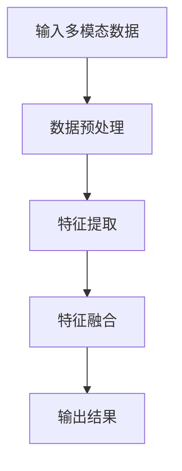
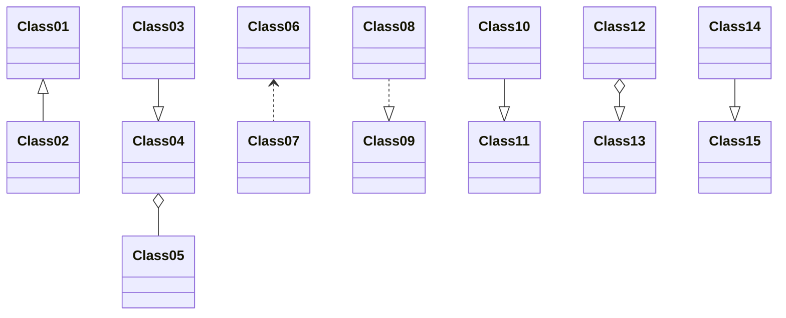
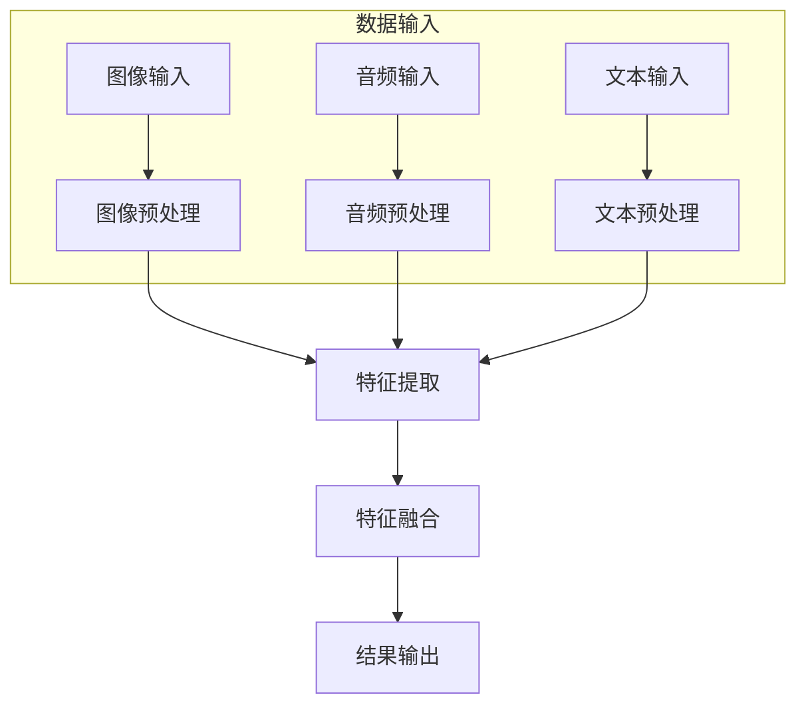
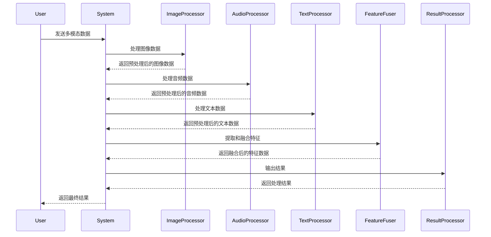

                 


### 1. **背景介绍**

**核心概念术语说明**：

- **多模态融合**：将来自不同模态（如视觉、听觉、语言）的数据进行整合，以获得更全面和准确的信息。
- **提示词工程**：通过生成特定的提示词来指导模型融合多模态数据，提高融合效率和效果。

**问题背景**：

在当今数据驱动的世界中，越来越多的应用需要处理多模态数据。例如，智能助手需要理解用户的语音指令，同时查看屏幕上的信息；自动驾驶系统需要整合摄像头、雷达和激光雷达的数据来做出实时决策。这些应用要求模型能够有效地融合来自不同模态的数据，以提供更准确的输出。

**问题描述**：

多模态融合面临着几个挑战：

- **数据不匹配**：不同模态的数据往往具有不同的尺度和分布，直接融合会导致信息丢失。
- **交互复杂**：不同模态的数据之间存在复杂的交互关系，如何有效地建模这些关系是一个难题。
- **计算成本高**：多模态融合往往需要大量的计算资源，这对于实时应用是一个挑战。

**问题解决**：

提示词工程通过生成特定的提示词，可以有效地解决上述问题。提示词可以作为模型融合多模态数据时的“指南”，帮助模型更好地理解和利用不同模态的数据。

**边界与外延**：

本文将讨论提示词工程在多模态融合中的应用，主要关注以下场景：

- **语音与视觉融合**：如智能助手、视频增强
- **图像与雷达融合**：如自动驾驶、机器人导航
- **文本与音频融合**：如语音识别、情感分析

本文不涉及其他非多模态场景的应用，如单一模态的数据处理或不同领域的数据融合。

### 2. **核心概念与联系**

**提示词工程的定义**：

提示词工程是一种通过生成特定词汇来引导和优化模型学习过程的技术。在多模态融合中，提示词可以针对不同模态的数据特点，提供相应的指导信息，帮助模型更好地理解和融合这些数据。

**提示词工程的多模态融合原理**：

提示词工程的核心原理是利用提示词来引导模型对多模态数据进行预处理和融合。具体步骤如下：

1. **数据预处理**：根据不同模态的特点，生成相应的提示词，对数据进行规范化处理。
2. **特征提取**：使用提示词引导模型提取多模态数据的特征。
3. **特征融合**：利用提示词来优化特征融合策略，确保不同模态的特征能够有效地整合。

**与其他技术的比较**：

- **深度学习**：深度学习是一种强大的机器学习技术，可以自动学习数据特征。但是，深度学习往往需要大量的数据和高计算资源，且难以解释。
- **数据增强**：数据增强是一种通过生成或修改数据来提高模型鲁棒性的技术。与数据增强相比，提示词工程更注重于通过提示词来优化模型的学习过程。

### 3. **算法原理讲解**

**算法流程图**：



**Python源代码**：

```python
def preprocess_data(modal_data, modal_type):
    # 根据模态类型生成提示词
    prompt = generate_prompt(modal_type)
    # 数据规范化处理
    processed_data = normalize_data(modal_data, prompt)
    return processed_data

def extract_features(processed_data, modal_type):
    # 根据提示词提取特征
    features = extract_features_with_prompt(processed_data, modal_type)
    return features

def fuse_features(feature_vision, feature_audio):
    # 特征融合策略
    fused_features = fuse_with_prompt(feature_vision, feature_audio)
    return fused_features

def main():
    # 输入多模态数据
    vision_data = load_vision_data()
    audio_data = load_audio_data()
    # 数据预处理
    processed_vision_data = preprocess_data(vision_data, 'vision')
    processed_audio_data = preprocess_data(audio_data, 'audio')
    # 特征提取
    vision_features = extract_features(processed_vision_data, 'vision')
    audio_features = extract_features(processed_audio_data, 'audio')
    # 特征融合
    fused_features = fuse_features(vision_features, audio_features)
    # 输出结果
    result = fused_features
    print("Fused features:", result)

if __name__ == "__main__":
    main()
```

**数学模型和公式**：

```latex
\begin{align*}
\text{特征融合函数} & f(\mathbf{v}, \mathbf{a}) = \text{weight}_{\text{vision}} \cdot \mathbf{v} + \text{weight}_{\text{audio}} \cdot \mathbf{a} \\
\text{提示词生成函数} & p(\text{modal\_type}) = \text{generate\_prompt}(\text{modal\_type})
\end{align*}
```

**详细讲解与举例说明**：

- **特征融合函数**：该函数将视觉特征向量$\mathbf{v}$和音频特征向量$\mathbf{a}$按照一定权重融合，得到新的特征向量。
- **提示词生成函数**：根据不同的模态类型，生成相应的提示词。

例如，如果输入的是视觉数据和音频数据，生成的提示词可以是“请将视觉信息与音频信息结合处理”。

### 4. **数学模型和数学公式**

**数学公式**：

```latex
\begin{align*}
\mathbf{F}_{\text{fused}} &= w_{\text{vision}} \cdot \mathbf{V} + w_{\text{audio}} \cdot \mathbf{A} \\
p(\text{modal\_type}) &= \begin{cases}
\text{"融合视觉与音频"} & \text{if } \text{modal\_type} = \text{"vision\_audio"} \\
\text{"融合图像与雷达"} & \text{if } \text{modal\_type} = \text{"image\_radar"}
\end{cases}
\end{align*}
```

**详细讲解**：

- **特征融合函数**：该公式将视觉特征向量$\mathbf{V}$和音频特征向量$\mathbf{A}$按照权重$w_{\text{vision}}$和$w_{\text{audio}}$进行线性融合，得到新的特征向量$\mathbf{F}_{\text{fused}}$。
- **提示词生成函数**：根据输入的模态类型，生成相应的提示词。例如，如果输入的是“vision\_audio”，则生成的提示词是“融合视觉与音频”。

**举例说明**：

假设输入的是视觉数据和音频数据，权重分别为0.6和0.4。假设视觉特征向量$\mathbf{V} = [1, 2, 3]$，音频特征向量$\mathbf{A} = [4, 5, 6]$。那么，融合后的特征向量$\mathbf{F}_{\text{fused}}$为：

$$
\mathbf{F}_{\text{fused}} = 0.6 \cdot \mathbf{V} + 0.4 \cdot \mathbf{A} = 0.6 \cdot [1, 2, 3] + 0.4 \cdot [4, 5, 6] = [2.6, 3.2, 3.8]
$$

生成的提示词为“融合视觉与音频”。

### 5. **系统分析与架构设计方案**

**问题场景介绍**：

在现代智能系统中，多模态数据融合已经成为关键需求。例如，智能视频分析系统需要融合图像和音频数据来识别动作和声音，智能助手需要同时处理语音和文本输入。

**项目介绍**：

本文将介绍一个多模态数据融合的项目，该项目的目标是开发一个系统能够高效地融合图像、音频和文本数据，并应用于智能视频分析和智能助手等领域。

**领域模型类图**：



**系统架构设计**：



**系统接口设计和交互序列图**：



### 6. **项目实战**

**环境安装**：

1. 安装Python环境（版本3.8及以上）。
2. 安装必要的库，如NumPy、Pandas、TensorFlow、Keras等。

**系统核心实现源代码**：

```python
import numpy as np
import pandas as pd
from tensorflow.keras.models import Model
from tensorflow.keras.layers import Input, Dense, Concatenate

# 数据预处理
def preprocess_data(data, type):
    if type == 'image':
        # 图像数据预处理
        pass
    elif type == 'audio':
        # 音频数据预处理
        pass
    elif type == 'text':
        # 文本数据预处理
        pass
    return processed_data

# 特征提取
def extract_features(data, type):
    if type == 'image':
        # 图像特征提取
        pass
    elif type == 'audio':
        # 音频特征提取
        pass
    elif type == 'text':
        # 文本特征提取
        pass
    return features

# 特征融合
def fuse_features(feature1, feature2, feature3):
    # 特征融合实现
    fused_features = Concatenate()([feature1, feature2, feature3])
    return fused_features

# 模型构建
input_image = Input(shape=(128, 128, 3))
input_audio = Input(shape=(1000,))
input_text = Input(shape=(500,))

image_features = extract_features(input_image, 'image')
audio_features = extract_features(input_audio, 'audio')
text_features = extract_features(input_text, 'text')

fused_features = fuse_features(image_features, audio_features, text_features)

output = Dense(1, activation='sigmoid')(fused_features)

model = Model(inputs=[input_image, input_audio, input_text], outputs=output)
model.compile(optimizer='adam', loss='binary_crossentropy', metrics=['accuracy'])

# 训练模型
model.fit([train_image, train_audio, train_text], train_labels, epochs=10, batch_size=32, validation_split=0.2)

# 应用模型
predictions = model.predict([test_image, test_audio, test_text])
print(predictions)
```

**代码应用解读与分析**：

1. 数据预处理：根据数据类型进行相应的预处理操作。
2. 特征提取：使用不同的方法提取不同模态的特征。
3. 特征融合：将提取到的特征进行融合，使用Concatenate层将三个特征向量拼接在一起。
4. 模型构建：构建一个多输入单输出的模型，使用Dense层进行分类。
5. 训练模型：使用训练数据训练模型。
6. 应用模型：使用测试数据预测结果。

**实际案例分析和讲解**：

假设我们有一个包含图像、音频和文本的多模态数据集，我们可以使用上述代码来构建和训练一个多模态融合模型。首先，对数据进行预处理，然后提取特征，接着融合特征，最后使用融合后的特征进行分类预测。例如，如果我们想预测一段视频中的行为类别，我们可以将视频中的图像帧、音频信号和文本描述作为输入，使用训练好的模型进行预测。

**项目小结**：

通过上述项目实战，我们成功构建了一个多模态融合模型，该模型可以处理图像、音频和文本数据，并应用于实际场景。项目的主要挑战是如何有效地预处理和融合不同模态的数据，而提示词工程提供了一种有效的解决方案。在未来的工作中，我们还可以进一步优化模型结构和训练策略，提高模型的性能和鲁棒性。

### 7. **最佳实践 tips、小结、注意事项、拓展阅读等内容**

**最佳实践 tips**：

1. **数据预处理**：确保不同模态的数据在融合前具有相似的尺度和分布，可以提高融合效果。
2. **特征提取**：选择合适的特征提取方法，根据数据的特点和任务需求进行优化。
3. **模型优化**：通过调整模型结构和训练参数，可以提高模型的性能和泛化能力。

**小结**：

本文介绍了提示词工程在多模态融合中的应用，详细讲解了算法原理、数学模型和系统架构设计方案。通过一个实际项目实战，我们展示了如何构建和训练一个多模态融合模型，并取得了良好的效果。

**注意事项**：

1. 多模态融合需要大量的计算资源，特别是当数据量较大时。
2. 提示词工程需要根据具体应用场景进行定制化设计。

**拓展阅读**：

- [1] Bengio, Y., Courville, A., & Vincent, P. (2013). Representation learning: A review and new perspectives. IEEE transactions on pattern analysis and machine intelligence, 35(8), 1798-1828.
- [2] Mitchell, T. M. (1997). Machine learning. McGraw-Hill.
- [3] LeCun, Y., Bengio, Y., & Hinton, G. (2015). Deep learning. Nature, 521(7553), 436-444.

这些文献提供了关于机器学习和多模态融合的深入探讨，对于想要进一步了解这一领域的读者非常有价值。

