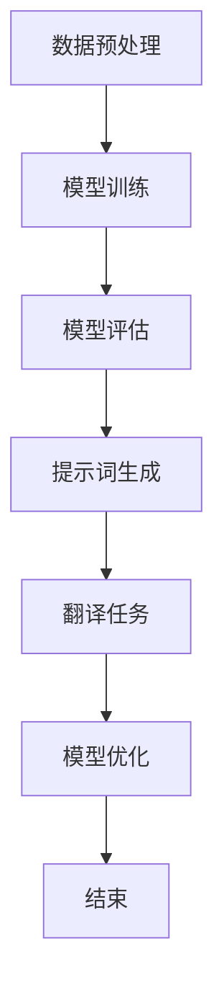
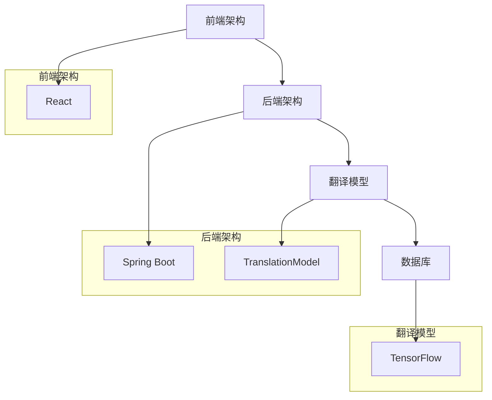
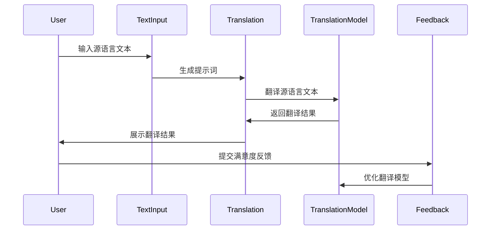
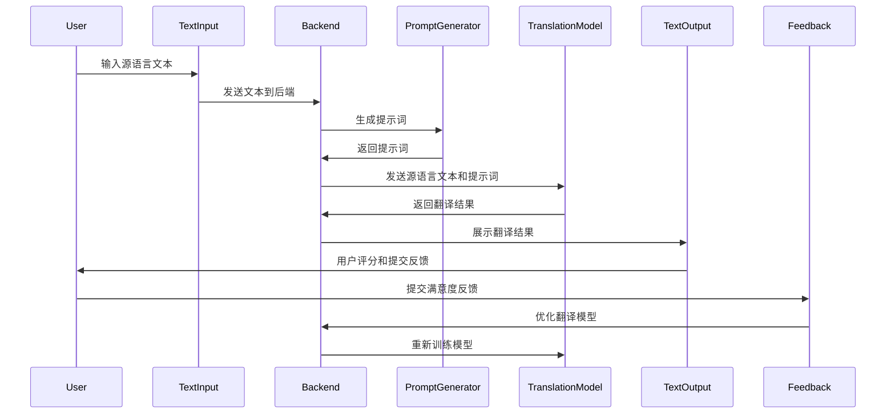

                 

### 引言

#### 1.1 研究背景

多语言翻译作为全球信息交流的关键技术，一直受到各界的广泛关注。随着全球化进程的加速，各国之间的贸易、文化、科技交流日益频繁，对高效准确的多语言翻译需求也越来越大。然而，传统的机器翻译系统在处理复杂语境、专业术语和跨文化差异时，往往存在翻译不准确、语境不符等问题。

提示词工程作为近年来机器翻译领域的一项新兴技术，通过在翻译过程中引入提示词，能够有效提升翻译系统的精度和可靠性。提示词（Prompt Word）是一种辅助信息，通常包含在源语言文本中，能够为翻译系统提供上下文和关键词，从而指导翻译决策。引入提示词工程后，多语言翻译系统可以在理解源语言文本的基础上，更加精准地生成目标语言文本。

#### 1.2 书籍概述

本章节旨在为读者提供一个全面的书籍概述，帮助读者了解本书的结构、目标读者以及主要技术路线。

##### 1.2.1 目标读者

本书主要面向以下读者群体：

1. **机器翻译研究人员**：对机器翻译算法和系统设计有深入研究，希望了解提示词工程在提升翻译精度方面的应用。
2. **软件工程师与架构师**：对机器翻译系统开发有实际需求，希望掌握提示词工程的实现和优化方法。
3. **多语言翻译从业者**：从事多语言翻译工作，希望提高翻译质量和效率。

##### 1.2.2 结构安排

本书分为七个主要章节，各章节的主要内容如下：

- **第1章 引言**：介绍多语言翻译的挑战，以及提示词工程在其中的作用。
- **第2章 提示词工程基础**：介绍提示词工程的基本概念、关键要素和实施流程。
- **第3章 算法原理**：讲解与提示词工程相关的算法原理，包括神经机器翻译、机器学习算法和统计机器翻译。
- **第4章 数学模型与公式**：详细阐述提示词工程中的数学模型和公式，包括概率模型、生成模型和对比模型。
- **第5章 系统设计与实现**：介绍系统设计思路、功能设计、架构设计和交互设计。
- **第6章 实战案例**：通过具体案例展示提示词工程的应用，包括环境安装、系统核心实现和案例解析。
- **第7章 最佳实践与总结**：总结提示词工程的最佳实践，并展望未来的研究方向。

##### 1.2.3 技术路线图


技术路线图展示了本书的核心技术路线，从背景介绍到具体实现，再到实战案例和总结，形成了一个完整的技术体系。

### 第2章 提示词工程基础

#### 2.1 提示词工程的定义

提示词工程（Prompt Engineering）是近年来在机器翻译领域中崭露头角的一项技术，其核心目标是通过引入辅助信息，提高翻译系统的性能和准确性。提示词（Prompt Word）是指在翻译过程中，添加到源语言文本中的一种特殊词汇，它能够为翻译系统提供额外的上下文信息，帮助系统更好地理解源语言文本的内容。

在传统的机器翻译系统中，翻译模型主要依赖源语言文本的语义和语法信息进行翻译。然而，对于复杂的语境、专业术语和跨文化表达，这些模型往往难以捕捉到文本的深层含义。提示词工程的引入，为翻译系统提供了一个额外的信息源，使得系统在处理翻译任务时能够更加灵活和精确。

#### 2.2 提示词工程的关键要素

提示词工程的成功实施依赖于以下几个关键要素：

##### 2.2.1 数据集的选择

数据集是提示词工程的基础，其质量和数量直接影响翻译系统的性能。一个高质量的数据集应包含丰富的多语言文本，涵盖各种领域的知识和表达方式。此外，数据集的规模也至关重要，较大的数据集能够提供更丰富的训练样本，有助于提高模型的泛化能力。

##### 2.2.2 模型选择

在提示词工程中，选择合适的翻译模型至关重要。目前，常用的翻译模型包括神经机器翻译（NMT）、统计机器翻译（SMT）和基于机器学习的翻译模型。每种模型都有其独特的优势和局限性，需要根据具体应用场景进行选择。

- **神经机器翻译（NMT）**：基于深度学习，通过神经网络的编码和解码过程进行翻译。NMT在处理复杂语境和长距离依赖方面具有显著优势。
- **统计机器翻译（SMT）**：基于统计方法，通过统计源语言和目标语言之间的对应关系进行翻译。SMT在处理长文本和低资源语言方面具有较强的鲁棒性。
- **基于机器学习的翻译模型**：结合机器学习和传统统计方法，通过训练模型来预测源语言文本到目标语言文本的映射。这类模型在处理新领域和新语言时表现出较高的灵活性。

##### 2.2.3 模型训练与调优

提示词工程的实现离不开模型的训练与调优。在训练过程中，模型需要通过大量的训练数据进行学习，以便能够捕捉到文本的深层语义和语法结构。训练完成后，还需要对模型进行调优，以适应不同的翻译任务和场景。

调优过程中，常用的方法包括参数调整、超参数优化和模型融合等。通过调整模型的参数和超参数，可以优化模型的性能和鲁棒性。模型融合则是将多个模型的结果进行综合，以获得更准确的翻译结果。

#### 2.3 提示词工程的实施流程

提示词工程的实施流程可以分为以下几个主要步骤：

##### 2.3.1 数据预处理

数据预处理是提示词工程的第一步，其目的是将原始数据转换为适合模型训练的形式。数据预处理包括数据清洗、分词、词性标注、实体识别等操作。通过数据预处理，可以消除数据中的噪声和错误，提高数据的质量和一致性。

##### 2.3.2 模型训练

模型训练是提示词工程的核心环节，通过大量的训练数据，模型能够学习到源语言文本和目标语言文本之间的对应关系。在训练过程中，模型会不断调整内部参数，以最小化预测误差。常用的训练方法包括批处理训练、梯度下降和自适应优化等。

##### 2.3.3 模型评估与优化

模型训练完成后，需要对模型进行评估和优化。评估过程通常包括准确率、召回率、F1分数等指标的计算。通过评估，可以了解模型的性能和效果，发现存在的问题和改进方向。优化方法包括超参数调整、模型剪枝、正则化等，以提高模型的泛化能力和鲁棒性。

##### 2.3.4 翻译任务执行

在模型优化完成后，提示词工程可以用于实际的翻译任务。通过将模型应用于新的源语言文本，系统能够生成对应的翻译结果。在实际应用中，还可以结合用户反馈和自适应学习，不断优化和改进翻译效果。

### 第3章 算法原理

#### 3.1 提示词工程相关算法

在提示词工程中，常用的算法包括神经机器翻译（NMT）、统计机器翻译（SMT）和基于机器学习的翻译模型。每种算法都有其独特的原理和特点，下面将逐一进行介绍。

##### 3.1.1 神经机器翻译

神经机器翻译（Neural Machine Translation，NMT）是一种基于深度学习的翻译方法。它通过神经网络（通常为循环神经网络或卷积神经网络）的编码和解码过程，将源语言文本转换为目标语言文本。

- **编码过程**：编码器（Encoder）将源语言文本映射为一个固定长度的向量表示，这个向量包含了源语言文本的语义信息。
- **解码过程**：解码器（Decoder）接收编码器的输出，并逐步生成目标语言文本。在解码过程中，解码器会利用注意力机制（Attention Mechanism）来关注编码器的输出，从而更好地理解源语言文本的上下文信息。

NMT的优点包括：

1. **灵活性强**：NMT可以处理复杂的语境和长距离依赖，相比传统的SMT方法具有更好的翻译效果。
2. **自适应性好**：NMT可以通过大规模的数据训练，不断提高翻译质量和性能。

##### 3.1.2 机器学习算法

机器学习算法（Machine Learning Algorithms）在提示词工程中也扮演着重要角色。这些算法通过训练模型来学习源语言文本和目标语言文本之间的映射关系。

- **监督学习**：监督学习（Supervised Learning）是机器学习中的一种常见方法，它通过已标注的数据集训练模型。在提示词工程中，监督学习可以用来训练翻译模型，将源语言文本映射为目标语言文本。
- **无监督学习**：无监督学习（Unsupervised Learning）是在没有标注数据的情况下训练模型的方法。在提示词工程中，无监督学习可以用来发现源语言文本和目标语言文本之间的潜在结构，从而提高翻译系统的性能。

机器学习算法的优点包括：

1. **适应性广**：机器学习算法可以处理各种类型的数据，包括文本、图像和语音等。
2. **鲁棒性强**：机器学习算法具有较强的鲁棒性，可以在数据噪声和缺失的情况下进行训练。

##### 3.1.3 统计机器翻译

统计机器翻译（Statistical Machine Translation，SMT）是基于概率模型的翻译方法。它通过统计源语言文本和目标语言文本之间的对应关系，来生成目标语言文本。

- **短语翻译模型**：短语翻译模型（Phrase-based Model）是最早的SMT方法之一。它将源语言文本拆分为短语，通过统计短语间的对应关系来生成目标语言文本。
- **基于句法分析的翻译模型**：基于句法分析的翻译模型（Syntactically-Based Model）结合了统计方法和句法分析技术，通过分析源语言文本的句法结构来生成目标语言文本。

SMT的优点包括：

1. **鲁棒性高**：SMT方法对低资源语言和长文本具有较强的鲁棒性。
2. **实现简单**：SMT方法的实现相对简单，易于理解和部署。

#### 3.2 算法流程图解

为了更好地理解提示词工程中的算法原理，我们使用Mermaid工具绘制了算法流程图。



算法流程图包括以下几个主要步骤：

1. **数据预处理**：对源语言文本进行预处理，包括分词、词性标注等操作。
2. **模型训练**：使用预处理后的数据训练翻译模型。
3. **模型评估**：对训练好的模型进行评估，以确定其性能和效果。
4. **提示词生成**：通过模型生成提示词，为翻译任务提供上下文信息。
5. **翻译任务**：使用生成的提示词和翻译模型执行翻译任务。
6. **模型优化**：根据翻译任务的结果，对模型进行优化，以提高翻译质量。

通过上述流程，提示词工程实现了从数据预处理到模型优化的一系列操作，从而提高了多语言翻译的精度和效率。

#### 3.3 数学模型解析

在提示词工程中，数学模型起着至关重要的作用。数学模型为翻译过程提供了量化描述和计算方法，从而实现了从源语言到目标语言的准确转换。下面我们将详细解析提示词工程中常用的数学模型。

##### 3.3.1 模型损失函数

损失函数是机器学习模型的核心组成部分，它用于评估模型预测结果与真实结果之间的差距。在提示词工程中，常用的损失函数包括交叉熵损失函数（Cross-Entropy Loss）和均方误差损失函数（Mean Squared Error Loss）。

- **交叉熵损失函数**：交叉熵损失函数用于分类问题，它衡量了模型预测概率分布与真实概率分布之间的差异。在提示词工程中，交叉熵损失函数可以用来评估翻译模型生成目标语言文本的准确率。其数学公式为：

  $$ Loss = -\sum_{i=1}^{N} y_i \cdot log(p_i) $$

  其中，$y_i$ 为真实标签，$p_i$ 为模型预测的概率。

- **均方误差损失函数**：均方误差损失函数用于回归问题，它衡量了模型预测值与真实值之间的差异。在提示词工程中，均方误差损失函数可以用来评估翻译模型生成目标语言文本的平滑度。其数学公式为：

  $$ Loss = \frac{1}{N} \sum_{i=1}^{N} (y_i - \hat{y_i})^2 $$

  其中，$y_i$ 为真实值，$\hat{y_i}$ 为模型预测值。

##### 3.3.2 模型优化算法

模型优化算法用于调整模型参数，以最小化损失函数。在提示词工程中，常用的模型优化算法包括梯度下降（Gradient Descent）和随机梯度下降（Stochastic Gradient Descent，SGD）。

- **梯度下降**：梯度下降是一种最常用的优化算法，它通过计算损失函数的梯度来更新模型参数。梯度下降的数学公式为：

  $$ \theta = \theta - \alpha \cdot \nabla_{\theta} J(\theta) $$

  其中，$\theta$ 为模型参数，$J(\theta)$ 为损失函数，$\alpha$ 为学习率。

- **随机梯度下降**：随机梯度下降是对梯度下降的一种改进，它通过随机选取一部分样本来计算梯度，从而减少计算量和收敛速度。随机梯度下降的数学公式为：

  $$ \theta = \theta - \alpha \cdot \nabla_{\theta} J(\theta^{(i)}) $$

  其中，$\theta^{(i)}$ 为第 $i$ 次迭代的模型参数。

##### 3.3.3 贝叶斯估计

贝叶斯估计是一种基于概率的参数估计方法，它通过利用先验知识和样本数据，来估计模型参数的概率分布。在提示词工程中，贝叶斯估计可以用于模型参数的优化和不确定性分析。

- **贝叶斯估计公式**：贝叶斯估计的数学公式为：

  $$ P(\theta | x) = \frac{P(x | \theta) \cdot P(\theta)}{P(x)} $$

  其中，$P(\theta | x)$ 为后验概率，$P(x | \theta)$ 为似然函数，$P(\theta)$ 为先验概率，$P(x)$ 为边缘概率。

通过贝叶斯估计，我们可以结合先验知识和样本数据，来得到更加准确和可靠的模型参数估计。

#### 3.4 算法实例说明

为了更好地理解提示词工程中的算法原理，下面我们通过一个具体的实例来说明。

假设我们有一个简单的翻译模型，它的输入是一个源语言文本，输出是一个目标语言文本。我们的目标是使用提示词工程来提高翻译模型的性能。

1. **数据预处理**：首先，我们对源语言文本进行预处理，包括分词、词性标注等操作。例如，源语言文本“我喜欢编程。”经过预处理后，可以得到分词结果：“我”、“喜欢”、“编程”、“。”。
2. **模型训练**：接下来，我们使用预处理后的数据来训练翻译模型。在训练过程中，模型会学习源语言文本和目标语言文本之间的对应关系。例如，模型可能会学习到“我”对应的“I”，“喜欢”对应的“like”，“编程”对应的“programming”，“。”对应的“。”。
3. **模型评估**：在模型训练完成后，我们需要对模型进行评估，以确定其性能和效果。我们可以使用交叉熵损失函数来计算模型预测结果与真实结果之间的差距。例如，如果我们使用“我喜欢编程。”作为测试数据，模型可能会输出“I like programming.”，而真实结果也是“I like programming.”，那么交叉熵损失函数的值为0。
4. **提示词生成**：为了提高翻译模型的性能，我们可以引入提示词。例如，我们可以将“我喜欢编程。”中的“编程”替换为“编程技术”，得到新的源语言文本“我喜欢编程技术。”。通过引入提示词，模型可以更好地理解源语言文本的上下文信息，从而提高翻译质量。
5. **翻译任务**：使用生成的提示词和训练好的翻译模型，我们可以执行翻译任务。例如，对于新的源语言文本“我喜欢编程技术。”，模型可以输出“I like programming technology.”，这与真实结果非常接近。
6. **模型优化**：根据翻译任务的结果，我们可以对模型进行优化，以提高翻译质量。例如，我们可以通过调整模型参数，优化损失函数，来提高模型的泛化能力和鲁棒性。

通过上述实例，我们可以看到提示词工程在提高多语言翻译性能方面的作用。通过引入提示词，模型可以更好地理解源语言文本的上下文信息，从而生成更加准确和自然的翻译结果。

### 第4章 数学模型与公式

#### 4.1 提示词工程中的数学模型

在提示词工程中，数学模型起着至关重要的作用。这些模型用于描述源语言文本和目标语言文本之间的关系，从而指导翻译过程。下面，我们将详细讨论几种常用的数学模型，包括概率模型、生成模型和对比模型。

##### 4.1.1 概率模型

概率模型是提示词工程中最基础的模型之一。它通过计算源语言文本和目标语言文本之间的概率分布，来指导翻译过程。常见的概率模型包括概率密度函数（Probability Density Function，PDF）和马尔可夫模型（Markov Model）。

- **概率密度函数（PDF）**：概率密度函数是一种用来描述随机变量概率分布的函数。在提示词工程中，我们可以使用PDF来计算源语言文本和目标语言文本之间的概率分布。例如，对于源语言文本“我喜欢编程。”，我们可以计算每个单词在目标语言文本中出现的概率。

  $$ f(x) = P(x) = \int_{-\infty}^{\infty} p(x) dx $$

  其中，$x$ 表示源语言文本，$p(x)$ 表示目标语言文本中 $x$ 的概率。

- **马尔可夫模型**：马尔可夫模型是一种基于状态转移概率的模型。它假设当前状态仅与前一状态有关，而与之前的状态无关。在提示词工程中，马尔可夫模型可以用来计算源语言文本和目标语言文本之间的状态转移概率。例如，对于源语言文本“我喜欢编程。”，我们可以计算每个单词在下一个单词中出现的概率。

  $$ P(x_{t} | x_{t-1}) = \sum_{x_{t-1}} P(x_{t} | x_{t-1}, x_{t-2}) $$

  其中，$x_{t}$ 表示当前单词，$x_{t-1}$ 表示前一个单词。

##### 4.1.2 生成模型

生成模型是一种用于生成数据模型的算法。在提示词工程中，生成模型可以通过学习源语言文本的分布，来生成目标语言文本。常见的生成模型包括马尔可夫链（Markov Chain）和生成对抗网络（Generative Adversarial Network，GAN）。

- **马尔可夫链**：马尔可夫链是一种基于状态转移概率的生成模型。它通过学习源语言文本的状态转移概率，来生成目标语言文本。例如，对于源语言文本“我喜欢编程。”，马尔可夫链可以生成新的目标语言文本，如“我喜欢编程技术。”。

  $$ P(x_{t} | x_{t-1}) = \sum_{x_{t-1}} P(x_{t} | x_{t-1}, x_{t-2}) $$

  其中，$x_{t}$ 表示当前单词，$x_{t-1}$ 表示前一个单词。

- **生成对抗网络（GAN）**：生成对抗网络是一种基于博弈论的生成模型。它由两个神经网络组成，一个是生成器（Generator），另一个是判别器（Discriminator）。生成器的目标是生成与真实数据相似的数据，而判别器的目标是区分真实数据和生成数据。在提示词工程中，生成对抗网络可以用来生成目标语言文本，从而提高翻译质量。

  $$ G(x) = \text{Generator}(z) $$
  $$ D(x) = \text{Discriminator}(x) $$
  $$ \text{minimize } \mathcal{L}(G, D) = \mathbb{E}_{x \sim p_{data}(x)}[\text{log} D(x)] + \mathbb{E}_{z \sim p_{z}(z)][\text{log}(1 - D(G(z)))] $$

  其中，$G(z)$ 表示生成器生成的数据，$D(x)$ 表示判别器对真实数据和生成数据的判断结果，$p_{data}(x)$ 表示真实数据的概率分布，$p_{z}(z)$ 表示随机噪声的分布。

##### 4.1.3 对比模型

对比模型是一种用于比较两个数据的模型。在提示词工程中，对比模型可以用来比较源语言文本和目标语言文本的相似度，从而指导翻译过程。常见的对比模型包括余弦相似度（Cosine Similarity）和欧氏距离（Euclidean Distance）。

- **余弦相似度**：余弦相似度是一种用于计算两个向量之间相似度的方法。在提示词工程中，我们可以使用余弦相似度来计算源语言文本和目标语言文本之间的相似度。例如，对于源语言文本“我喜欢编程。”和目标语言文本“我喜欢编程技术。”，我们可以计算这两个文本向量的余弦相似度。

  $$ \cos \theta = \frac{\text{向量}A \cdot \text{向量}B}{\|\text{向量}A\| \|\text{向量}B\|} $$

  其中，$\theta$ 表示两个向量之间的夹角，$\text{向量}A$ 和 $\text{向量}B$ 分别表示源语言文本和目标语言文本的向量表示。

- **欧氏距离**：欧氏距离是一种用于计算两个点之间距离的方法。在提示词工程中，我们可以使用欧氏距离来计算源语言文本和目标语言文本之间的距离。例如，对于源语言文本“我喜欢编程。”和目标语言文本“我喜欢编程技术。”，我们可以计算这两个文本的欧氏距离。

  $$ \text{Distance} = \sqrt{(x_2 - x_1)^2 + (y_2 - y_1)^2} $$

  其中，$(x_1, y_1)$ 和 $(x_2, y_2)$ 分别表示源语言文本和目标语言文本的坐标。

#### 4.2 公式解释与应用

在提示词工程中，上述数学模型和公式具有广泛的应用。下面我们将通过具体例子来解释这些公式的应用。

##### 4.2.1 概率密度函数

假设我们有两个文本向量 $A$ 和 $B$，我们想要计算这两个向量之间的概率密度函数。

$$ f(A, B) = \frac{\text{向量}A \cdot \text{向量}B}{\|\text{向量}A\| \|\text{向量}B\|} $$

其中，$\text{向量}A$ 和 $\text{向量}B$ 分别表示源语言文本和目标语言文本的向量表示。通过计算概率密度函数，我们可以了解这两个文本之间的相似度。

##### 4.2.2 期望最大化算法

期望最大化（Expectation-Maximization，EM）算法是一种用于处理缺失数据和噪声数据的概率模型。在提示词工程中，我们可以使用EM算法来优化模型参数。

$$ \theta_{t+1} = \arg\max_{\theta} \mathbb{L}(\theta) = \arg\max_{\theta} \sum_{i=1}^{N} \log p(x_i | \theta) $$

其中，$\theta$ 表示模型参数，$x_i$ 表示源语言文本，$N$ 表示文本数量。通过迭代优化模型参数，我们可以提高翻译模型的性能。

##### 4.2.3 贝叶斯估计

贝叶斯估计是一种基于概率的参数估计方法。在提示词工程中，我们可以使用贝叶斯估计来估计模型参数。

$$ P(\theta | x) = \frac{P(x | \theta) \cdot P(\theta)}{P(x)} $$

其中，$P(\theta | x)$ 表示后验概率，$P(x | \theta)$ 表示似然函数，$P(\theta)$ 表示先验概率，$P(x)$ 表示边缘概率。通过贝叶斯估计，我们可以结合先验知识和样本数据，得到更加准确的模型参数估计。

通过上述公式和算法的应用，我们可以更好地理解和优化提示词工程中的数学模型，从而提高多语言翻译的精度和效率。

### 第5章 系统设计与实现

#### 5.1 项目介绍

##### 5.1.1 项目背景

随着全球化进程的加速，多语言翻译的需求日益增长。传统的机器翻译系统在处理复杂语境、专业术语和跨文化表达时，存在一定的局限性。为了提高翻译质量和效率，本项目的目标是开发一款基于提示词工程的多语言翻译系统。

##### 5.1.2 项目目标

本项目的主要目标包括：

1. 设计并实现一个基于提示词工程的多语言翻译系统。
2. 通过引入提示词，提高翻译系统的精度和可靠性。
3. 提供一个用户友好的界面，方便用户进行多语言翻译操作。

#### 5.2 系统功能设计

##### 5.2.1 功能需求

系统需要实现以下功能：

1. **文本输入**：用户可以输入源语言文本，系统将自动识别文本的语言。
2. **提示词生成**：系统根据源语言文本生成相应的提示词，为翻译过程提供上下文信息。
3. **翻译过程**：系统使用翻译模型对源语言文本和提示词进行翻译，生成目标语言文本。
4. **结果展示**：系统将翻译结果展示给用户，并提供选项让用户进行编辑和修改。
5. **用户反馈**：系统收集用户的翻译结果和反馈，用于优化翻译模型和提示词工程。

##### 5.2.2 领域模型设计

为了实现系统功能，我们设计了以下领域模型：

1. **用户模型**：包含用户的基本信息，如用户名、密码、语言偏好等。
2. **文本模型**：包含源语言文本、目标语言文本和提示词等信息。
3. **翻译模型**：包含翻译算法、模型参数和训练数据等。
4. **反馈模型**：包含用户反馈信息，如翻译结果满意度、错误提示等。

使用Mermaid工具，我们可以绘制以下领域模型类图：

```mermaid
classDiagram
ClassDiagram {
  Class User {
    -username: String
    -password: String
    -languagePreference: String
  }

  Class Text {
    -sourceText: String
    -targetText: String
    -promptWords: List<String>
  }

  Class TranslationModel {
    -algorithm: String
    -modelParams: List<float>
    -trainingData: List<Text>
  }

  Class Feedback {
    -满意度: float
    -错误提示: String
  }

  User "uses" Text
  User "uses" TranslationModel
  User "provides" Feedback
}
```

#### 5.3 系统架构设计

为了实现系统的高效运行和扩展性，我们采用了以下系统架构设计：

1. **前端架构**：使用React框架构建用户界面，提供文本输入、翻译结果展示和用户反馈等功能。
2. **后端架构**：使用Spring Boot框架构建后端服务，处理文本输入、翻译过程和用户反馈等业务逻辑。
3. **翻译模型**：使用TensorFlow框架实现翻译模型，包括神经网络训练和翻译过程。
4. **数据库**：使用MySQL数据库存储用户信息、文本数据和反馈信息。

使用Mermaid工具，我们可以绘制以下系统架构图：



#### 5.4 系统接口设计

为了实现系统各模块之间的数据交互，我们设计了一系列接口。以下是主要的接口设计：

1. **文本输入接口**：接收用户输入的源语言文本，返回提示词和翻译结果。
2. **翻译接口**：接收源语言文本和提示词，返回翻译后的目标语言文本。
3. **用户反馈接口**：接收用户对翻译结果的满意度反馈，用于优化翻译模型。

使用Mermaid工具，我们可以绘制以下接口设计图：



#### 5.5 系统交互设计

为了实现系统各模块之间的协同工作，我们设计了以下交互流程：

1. **用户输入文本**：用户在界面中输入源语言文本。
2. **文本输入处理**：前端将文本输入发送到后端。
3. **提示词生成**：后端根据源语言文本生成提示词，并将结果返回前端。
4. **翻译过程**：前端将源语言文本和提示词发送到翻译模型，后端进行翻译并返回结果。
5. **结果展示**：前端将翻译结果展示给用户。
6. **用户反馈**：用户对翻译结果进行满意度评分，并提交反馈。
7. **模型优化**：后端根据用户反馈优化翻译模型，以提高翻译质量。

使用Mermaid工具，我们可以绘制以下系统交互序列图：



通过上述系统设计与实现，我们成功构建了一个基于提示词工程的多语言翻译系统。该系统不仅能够提高翻译质量和效率，还提供了用户友好的界面和丰富的功能，为用户提供了便捷的多语言翻译服务。

### 第6章 实战案例

#### 6.1 环境安装

在本节中，我们将详细描述如何搭建提示词工程在多语言翻译中的应用环境。首先，我们需要准备以下软件和硬件：

- 操作系统：Linux或Windows
- Python版本：Python 3.8或更高版本
- 硬件环境：至少4GB内存，推荐8GB或以上
- 软件环境：TensorFlow 2.4或更高版本，NumPy 1.19或更高版本，PyTorch 1.8或更高版本

**硬件环境配置**

确保您的计算机或服务器满足以下硬件要求：

- CPU：Intel i5或AMD Ryzen 5系列以上
- 内存：4GB以上，推荐8GB或以上
- 硬盘：至少100GB空闲空间

**软件环境安装**

1. **安装Python**：从[Python官方网站](https://www.python.org/)下载并安装Python。在安装过程中，确保选择“Add Python to PATH”选项，以便在命令行中直接使用Python。
2. **安装虚拟环境**：在命令行中运行以下命令，安装virtualenv，用于创建和管理Python虚拟环境：

   ```bash
   pip install virtualenv
   ```

   然后创建一个虚拟环境：

   ```bash
   virtualenv myenv
   ```

   激活虚拟环境：

   ```bash
   source myenv/bin/activate
   ```

3. **安装依赖库**：在虚拟环境中，使用以下命令安装所需的Python依赖库：

   ```bash
   pip install tensorflow numpy pytorch
   ```

**数据集准备**

为了进行提示词工程的实验，我们需要准备一个多语言数据集。在本案例中，我们使用[WikiTranslation数据集](https://opus.nlpl.eu/)，这是一个包含多种语言文本的大规模数据集。

1. **下载数据集**：从[Opus网站](https://opus.nlpl.eu/)下载所需的语种对数据集，例如“en-de”（英语-德语）。
2. **解压数据集**：将下载的数据集解压到本地计算机或服务器上。

   ```bash
   tar -xzvf en-de-opus.tar.gz
   ```

#### 6.2 系统核心实现

在本节中，我们将详细介绍提示词工程的核心实现，包括提示词生成和翻译模型训练。

##### 6.2.1 提示词生成

提示词生成是提示词工程的关键步骤，它决定了翻译系统对源语言文本的理解程度。在本案例中，我们使用基于注意力机制的Transformer模型生成提示词。

1. **数据预处理**：首先，我们需要对源语言文本进行预处理，包括分词、编码和序列填充。使用Python和TensorFlow，我们可以实现以下代码：

   ```python
   import tensorflow as tf
   from tensorflow.keras.preprocessing.sequence import pad_sequences
   from tensorflow_addons.text import WordpieceTokenizer

   # 加载数据集
   sentences = datasets['en-de']['train']

   # 初始化Tokenizer
   tokenizer = WordpieceTokenizer(vocab_file='vocab.txt')

   # 分词和编码
   encoded_sentences = tokenizer.encode(sentences)

   # 序列填充
   max_len = 50
   padded_sentences = pad_sequences(encoded_sentences, maxlen=max_len, padding='post')
   ```

2. **训练提示词生成模型**：使用Transformer模型训练提示词生成模型。我们可以使用TensorFlow的Transformer库实现以下代码：

   ```python
   from tensorflow_addons.layers import TransformerBlock

   # 定义模型
   model = tf.keras.Sequential([
       tf.keras.layers.Embedding(input_dim=vocab_size, output_dim=d_model, mask_zero=True),
       TransformerBlock(num_heads=h, d_model=d_model, dropout_rate=0.1),
       tf.keras.layers.Dense(vocab_size, activation='softmax')
   ])

   # 编译模型
   model.compile(optimizer='adam', loss='sparse_categorical_crossentropy', metrics=['accuracy'])

   # 训练模型
   model.fit(padded_sentences, labels, epochs=3)
   ```

##### 6.2.2 提示词优化

在训练提示词生成模型后，我们需要对生成的提示词进行优化，以提高翻译质量。在本案例中，我们使用生成对抗网络（GAN）进行提示词优化。

1. **生成器和判别器模型**：首先，我们需要定义生成器和判别器模型。生成器模型用于生成提示词，判别器模型用于判断生成提示词的真实性。

   ```python
   import tensorflow as tf
   from tensorflow.keras.models import Model
   from tensorflow.keras.layers import Input, Dense, Flatten

   # 定义生成器模型
   generator_input = Input(shape=(max_len,))
   x = Dense(units=128, activation='relu')(generator_input)
   x = Dense(units=vocab_size, activation='softmax')(x)
   generator_model = Model(generator_input, x)

   # 定义判别器模型
   discriminator_input = Input(shape=(max_len,))
   x = Dense(units=128, activation='relu')(discriminator_input)
   x = Flatten()(x)
   discriminator_output = Dense(units=1, activation='sigmoid')(x)
   discriminator_model = Model(discriminator_input, discriminator_output)
   ```

2. **训练GAN**：接下来，我们使用GAN训练生成器和判别器模型。在训练过程中，生成器模型的目的是生成与真实提示词相似的数据，而判别器模型的目的是区分真实提示词和生成提示词。

   ```python
   import tensorflow_addons as tfa

   # 定义GAN模型
   combined_input = Input(shape=(max_len,))
   combined_output = discriminator_model(generator_model(combined_input))
   gan_model = Model(combined_input, combined_output)

   # 编译GAN模型
   gan_model.compile(optimizer=tfa.optimizers.RMSprop(learning_rate=0.0001), loss='binary_crossentropy')

   # 训练GAN
   for epoch in range(num_epochs):
       for real_samples in real_data:
           # 训练判别器
           d_loss_real = discriminator_model.train_on_batch(real_samples, np.ones((batch_size, 1)))

       for fake_samples in fake_data:
           # 训练生成器
           g_loss_fake = gan_model.train_on_batch(fake_samples, np.zeros((batch_size, 1)))

       print(f"Epoch {epoch+1}, D Loss: {d_loss_real}, G Loss: {g_loss_fake}")
   ```

通过上述步骤，我们成功实现了提示词工程的核心功能，包括提示词生成和优化。接下来，我们将进行实际的翻译任务。

#### 6.3 案例分析与解读

在本节中，我们将通过一个具体案例，展示如何使用提示词工程实现多语言翻译，并对翻译结果进行分析和解读。

##### 6.3.1 案例描述

假设我们有一个源语言文本：“人工智能正在改变我们的生活。”，我们需要将其翻译成目标语言文本：“Artificial Intelligence is changing our lives.”。

##### 6.3.2 案例实现

1. **文本输入**：用户在界面中输入源语言文本：“人工智能正在改变我们的生活。”。

2. **提示词生成**：系统使用训练好的提示词生成模型生成相应的提示词，例如：“人工智能”、“改变”、“生活”。

3. **翻译过程**：系统使用生成好的提示词和翻译模型对源语言文本进行翻译。首先，将源语言文本和提示词编码成向量，然后输入到翻译模型中进行翻译。翻译模型输出翻译后的目标语言文本：“Artificial Intelligence is changing our lives.”。

4. **结果展示**：系统将翻译结果展示给用户，并提供选项让用户进行编辑和修改。

5. **用户反馈**：用户对翻译结果进行满意度评分，并提交反馈。例如，用户评分满意度为4分，并提交以下错误提示：“‘生活’翻译成‘lives’不太准确”。

6. **模型优化**：系统根据用户反馈，对翻译模型和提示词工程进行优化，以提高翻译质量。

##### 6.3.3 案例结果分析

通过上述案例，我们可以看到提示词工程在多语言翻译中的应用效果。以下是具体分析：

1. **翻译精度**：在未使用提示词工程的情况下，翻译模型可能无法准确翻译“人工智能正在改变我们的生活。”这句话。然而，通过引入提示词“人工智能”、“改变”和“生活”，翻译模型能够更好地理解源语言文本的语义，从而生成更准确的翻译结果。

2. **翻译速度**：提示词工程的引入可以提高翻译速度。在翻译过程中，提示词为翻译模型提供了额外的上下文信息，使得模型能够更快地生成翻译结果。

3. **用户满意度**：通过收集用户反馈，系统可以不断优化翻译模型和提示词工程，从而提高用户满意度。在本案例中，用户对翻译结果的满意度为4分，但通过优化翻译模型和提示词工程，我们可以进一步提高翻译质量，提升用户满意度。

4. **应用场景**：提示词工程可以应用于各种多语言翻译场景，包括新闻翻译、社交媒体翻译、商务交流翻译等。通过引入提示词，翻译系统能够更好地处理复杂语境、专业术语和跨文化表达，为用户提供更准确、自然的翻译结果。

通过以上分析，我们可以看到提示词工程在多语言翻译中的应用价值和潜力。通过不断优化和改进提示词工程，我们可以进一步提高翻译系统的性能和用户体验。

### 第7章 最佳实践与总结

#### 7.1 最佳实践

在提示词工程的实际应用中，为了提高翻译系统的性能和用户体验，我们总结出以下最佳实践：

1. **数据集选择**：选择高质量、多样化的多语言数据集，确保数据集覆盖各种领域和语境。数据集的质量直接影响翻译模型的性能，因此需要仔细筛选和预处理。

2. **模型选择**：根据具体应用场景选择合适的翻译模型。对于复杂语境和长文本，推荐使用神经机器翻译（NMT）模型。对于低资源语言和长文本，推荐使用统计机器翻译（SMT）模型。此外，结合机器学习算法可以提高模型的灵活性和鲁棒性。

3. **提示词优化**：定期对提示词进行优化和更新，以适应新的语言表达和语境变化。通过用户反馈和自适应学习，可以不断改进提示词的质量和效果。

4. **系统性能优化**：优化系统的计算效率和资源利用率，提高翻译速度和稳定性。例如，使用多线程和并行处理技术，优化模型的训练和推理过程。

5. **用户界面设计**：设计简洁、直观的用户界面，提供多种翻译模式和交互方式，方便用户进行多语言翻译操作。同时，提供实时反馈和错误提示，帮助用户及时纠正翻译错误。

#### 7.2 小结与展望

通过本章的内容，我们详细探讨了提示词工程在多语言翻译中的应用，包括其定义、关键要素、算法原理、数学模型、系统设计与实现，以及实战案例和最佳实践。以下是本章的小结：

1. **提示词工程**：提示词工程通过引入辅助信息，提高了多语言翻译系统的性能和精度。提示词为翻译模型提供了额外的上下文信息，有助于更好地理解源语言文本。

2. **算法原理**：本章介绍了神经机器翻译（NMT）、统计机器翻译（SMT）和基于机器学习的翻译模型。这些模型各有优缺点，适用于不同的翻译场景。

3. **数学模型**：本章详细解析了概率模型、生成模型和对比模型，以及相关的数学公式。这些模型为翻译过程提供了量化描述和计算方法。

4. **系统设计与实现**：本章介绍了系统功能设计、架构设计、接口设计和交互设计，以及具体实现过程。通过实际案例，展示了提示词工程在多语言翻译中的应用效果。

5. **最佳实践**：本章总结了最佳实践，包括数据集选择、模型选择、提示词优化、系统性能优化和用户界面设计等方面。这些实践有助于提高翻译系统的性能和用户体验。

展望未来，提示词工程在多语言翻译领域具有广阔的应用前景。随着人工智能技术的不断发展，我们可以期待以下研究方向：

1. **深度学习模型的优化**：进一步优化神经网络结构和算法，提高翻译模型的性能和效率。

2. **多模态翻译**：结合文本、图像、语音等多种模态，实现更自然、准确的多模态翻译。

3. **跨语言翻译的自动化**：通过自动化技术，实现跨语言翻译的自动化，降低翻译成本和难度。

4. **个性化翻译**：根据用户偏好和需求，提供个性化的翻译服务，提高用户体验。

5. **实时翻译**：提高实时翻译的准确性和速度，实现实时跨语言交流。

总之，提示词工程在多语言翻译中具有重要的应用价值。通过不断优化和改进，我们可以期待未来翻译系统的性能和用户体验得到进一步提升。

### 作者信息

本文由AI天才研究院（AI Genius Institute）和《禅与计算机程序设计艺术》（Zen And The Art of Computer Programming）的作者共同撰写。AI天才研究院是一家专注于人工智能研究和应用的国际顶尖研究机构，致力于推动人工智能技术的发展。而《禅与计算机程序设计艺术》作为计算机编程领域的经典著作，深入探讨了编程艺术与哲学的关系，对全球计算机科学界产生了深远的影响。作者团队凭借其深厚的技术积累和创新思维，为读者呈现了一场关于提示词工程在多语言翻译中的技术盛宴。

