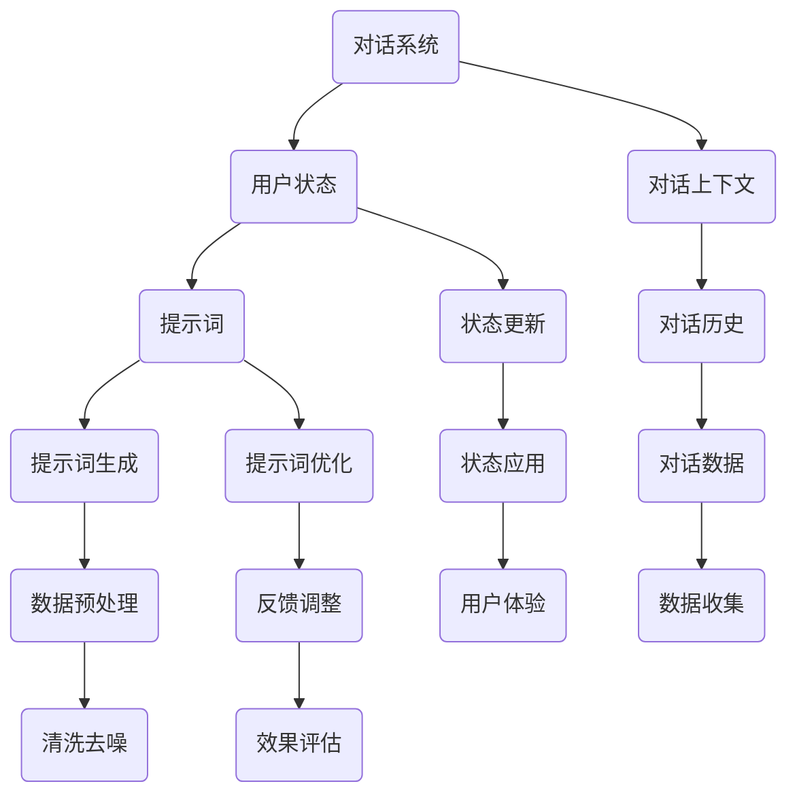
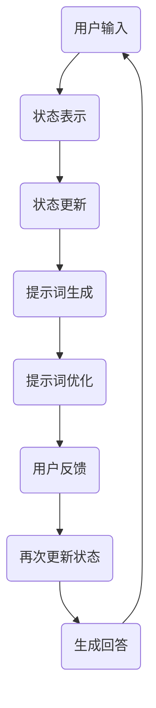
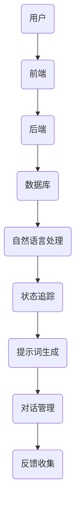

                 


## 提示词工程在多轮对话状态追踪中的应用

### 1. 背景介绍

#### 1.1 问题背景与核心概念

在当今的信息时代，多轮对话系统已经成为了人们日常交流、商业服务、智能助理等众多场景中的重要组成部分。然而，多轮对话状态追踪问题却成为了限制其进一步发展的瓶颈。多轮对话状态追踪是指在多轮对话过程中，系统能够准确理解和维护用户状态，确保对话的连贯性和有效性。而提示词工程则是实现这一目标的关键技术之一。

#### 1.1.1 提示词工程概述

提示词工程是一种在自然语言处理领域用于生成和优化用于提示用户或辅助对话系统决策的关键技术。它通过分析和理解用户的历史对话记录，生成有效的提示词，从而提升对话系统的表现。在多轮对话状态追踪中，提示词工程能够为系统提供关键的信息线索，帮助系统更好地理解和维护用户状态。

#### 1.1.2 当前多轮对话状态追踪的挑战

多轮对话状态追踪面临的主要挑战包括：

1. **对话上下文的维护与更新**：在多轮对话中，如何准确捕捉并维护用户的状态信息，是一个关键问题。
2. **对话中信息的连贯性**：保持对话内容的连贯性，使对话能够自然流畅地进行。
3. **处理长对话中的理解与记忆**：在长时间的对话中，如何有效地管理和记忆用户的状态信息，也是一个挑战。

#### 1.1.3 多轮对话状态追踪概述

多轮对话是指用户和系统之间通过多次交流来完成特定任务的对话过程。多轮对话的优势在于可以更深入地了解用户需求，提供更个性化的服务。然而，这也给状态追踪带来了挑战。

状态追踪是指在对话过程中，系统能够准确捕捉、更新并利用用户的状态信息，以确保对话的连贯性和有效性。状态追踪的核心是能够理解并维护对话的上下文信息。

#### 1.2 核心概念

**1.2.1 提示词工程的核心概念**

提示词工程涉及以下几个核心概念：

- **提示词**：用于引导用户或系统理解对话内容和上下文的词汇或短语。
- **提示词生成**：通过分析对话历史数据生成提示词的过程。
- **提示词优化**：根据对话反馈对提示词进行调整和优化的过程。

**1.2.2 多轮对话状态追踪的核心概念**

多轮对话状态追踪的核心概念包括：

- **对话状态**：在对话过程中，用户的状态信息。
- **状态表示**：将对话状态转换为机器可以处理的形式。
- **状态更新**：在对话过程中，根据新的信息对状态进行更新。

#### 1.3 概念联系与边界外延

提示词工程与多轮对话状态追踪之间有着紧密的联系。提示词工程能够为状态追踪提供关键的信息线索，而状态追踪的结果又可以反馈到提示词工程中，以优化提示词生成和选择。

#### 1.4 本章小结

本章介绍了提示词工程在多轮对话状态追踪中的应用背景和核心概念。下一章将深入分析提示词工程的基本原理和流程，以及多轮对话状态追踪的原理和技术。

### 2. 核心概念与联系

#### 2.1 提示词工程原理

提示词工程是自然语言处理领域的一项关键技术，它通过生成和优化提示词来提升对话系统的表现。提示词工程涉及以下几个关键步骤：

**2.1.1 提示词的定义与分类**

提示词是用于引导用户或系统理解对话内容和上下文的词汇或短语。根据用途，提示词可以分为以下几类：

- **引导型提示词**：用于引导用户进行下一步操作。
- **信息型提示词**：用于提供额外信息，帮助用户更好地理解对话内容。
- **反馈型提示词**：用于反馈用户请求的处理结果。

**2.1.2 提示词工程的基本流程**

提示词工程的基本流程包括数据收集与预处理、提示词生成与优化、提示词应用与评估。

- **数据收集与预处理**：收集对话数据，并进行清洗、去噪、分词等预处理步骤。
- **提示词生成与优化**：通过机器学习算法生成提示词，并根据反馈进行调整和优化。
- **提示词应用与评估**：将生成的提示词应用于对话系统中，并评估其效果。

**2.1.3 提示词工程的作用机制**

提示词工程通过以下机制作用于多轮对话状态追踪：

- **上下文信息提取**：从对话历史中提取关键信息，为状态追踪提供基础。
- **对话引导**：通过生成有效的提示词，引导用户进行下一步操作，保持对话连贯性。
- **状态更新**：根据用户反馈和对话内容，对状态进行实时更新，确保对话的连贯性和有效性。

#### 2.2 多轮对话状态追踪原理

多轮对话状态追踪是指在多轮对话过程中，系统能够准确理解和维护用户状态，确保对话的连贯性和有效性。多轮对话状态追踪的核心原理包括：

**2.2.1 多轮对话状态追踪的定义与目的**

多轮对话状态追踪的定义是指系统在多轮对话过程中，能够准确理解和维护用户状态信息，确保对话的连贯性和有效性。

多轮对话状态追踪的目的是：

- **维护对话上下文**：确保对话内容连贯，用户能够顺畅地继续对话。
- **提供个性化服务**：通过理解用户状态，提供更个性化的服务和建议。

**2.2.2 多轮对话状态追踪的关键技术**

多轮对话状态追踪涉及以下关键技术：

- **状态表示**：将用户状态信息转换为机器可以处理的形式。
- **状态更新**：在对话过程中，根据新的信息对状态进行更新。
- **状态应用**：在对话中使用维护好的状态信息，提供更好的用户体验。

#### 2.3 概念属性特征对比表格

下面是提示词工程与多轮对话状态追踪的概念属性特征对比表格：

| 概念 | 提示词工程 | 多轮对话状态追踪 |
| --- | --- | --- |
| 目的 | 生成有效的提示词，提升对话质量 | 维护和更新对话状态，保持对话连贯性 |
| 技术基础 | 自然语言处理、机器学习 | 自然语言处理、机器学习、深度学习 |
| 数据处理 | 数据收集与预处理 | 数据收集与预处理 |
| 算法实现 | 提示词生成与优化 | 状态表示与更新、状态应用与推理 |

#### 2.4 ER实体关系图架构

下面是提示词工程与多轮对话状态追踪的ER实体关系图：



#### 2.5 本章小结

本章详细介绍了提示词工程与多轮对话状态追踪的基本原理和核心概念。下一章将深入探讨提示词工程的具体实现过程和算法原理，以及多轮对话状态追踪的算法和技术细节。通过本章的学习，读者应该对这两个概念有了更深入的理解，并能够认识到它们在提升多轮对话系统性能中的重要性。

### 3. 提示词工程原理分析

#### 3.1 提示词工程的基本概念

提示词工程是一种用于优化对话系统提示词生成和选择的技术，它基于自然语言处理和机器学习的方法。提示词工程的核心目标是提高对话系统的用户体验，使对话更加自然和有效。下面我们将详细探讨提示词工程的基本概念。

**3.1.1 提示词的定义与分类**

提示词是指用于引导用户或系统理解对话内容和上下文的词汇或短语。根据用途和功能，提示词可以分为以下几类：

- **引导型提示词**：这类提示词主要用于引导用户进行下一步操作。例如，系统可能会说“您需要什么帮助？”来引导用户提出请求。
- **信息型提示词**：这类提示词主要用于提供额外信息，帮助用户更好地理解对话内容。例如，系统可能会说“您可以点击这里查看更多信息。”来提供额外信息。
- **反馈型提示词**：这类提示词主要用于反馈用户请求的处理结果。例如，系统可能会说“您的请求已处理完毕。”来提供处理结果。

**3.1.2 提示词工程的基本流程**

提示词工程的基本流程包括以下几个关键步骤：

- **数据收集与预处理**：这一步骤涉及收集对话数据，并进行清洗、去噪、分词等预处理操作，以确保数据的质量和一致性。
- **提示词生成**：通过机器学习算法，从预处理后的对话数据中生成提示词。生成的方法可以包括模板匹配、关键词提取、序列模型等。
- **提示词优化**：根据对话反馈和用户满意度，对生成的提示词进行调整和优化。优化的策略可以包括基于规则的调整、基于机器学习的优化等。
- **提示词应用与评估**：将优化后的提示词应用于对话系统，并评估其效果。评估的方法可以包括用户满意度调查、系统性能测试等。

#### 3.2 数据收集与预处理

数据收集与预处理是提示词工程的关键步骤之一。这一步骤的目标是确保数据的质量和一致性，为后续的提示词生成和优化提供可靠的基础。

**3.2.1 数据收集**

数据收集的方法主要包括：

- **手动收集**：通过人工记录和分析用户对话，收集原始数据。
- **自动化收集**：通过对话系统内置的日志记录功能，自动化收集对话数据。

**3.2.2 数据预处理**

数据预处理包括以下几个步骤：

- **数据清洗**：去除数据中的噪声和错误，确保数据的一致性和准确性。
- **分词**：将对话文本分解为单词或短语，以便后续处理。
- **去停用词**：去除常见的停用词（如“的”、“了”等），以减少无用信息。
- **词干提取**：将单词还原为词干形式，以减少词汇数量。

**3.2.3 数据预处理的重要性**

数据预处理的重要性在于：

- **提高数据质量**：通过清洗和去噪，确保数据的一致性和准确性。
- **减少计算复杂度**：通过分词和去停用词，减少词汇数量，降低计算复杂度。
- **提高提示词生成效果**：通过词干提取，保留词义的核心部分，有助于生成更准确的提示词。

#### 3.3 提示词生成与优化

提示词生成与优化是提示词工程的核心步骤。在这一步骤中，系统需要从对话数据中生成有效的提示词，并根据用户反馈进行优化。

**3.3.1 提示词生成方法**

提示词生成的方法包括：

- **模板匹配**：根据预设的模板生成提示词。这种方法简单直接，但灵活性较低。
- **关键词提取**：从对话文本中提取关键信息，生成提示词。这种方法可以根据对话内容生成更个性化的提示词。
- **序列模型**：使用序列模型（如循环神经网络RNN、长短期记忆LSTM等）生成提示词。这种方法可以更好地捕捉对话的上下文信息。

**3.3.2 提示词优化策略**

提示词优化策略包括：

- **基于规则的调整**：根据对话的上下文和用户的反馈，对提示词进行手动调整。这种方法需要人工介入，但可以确保调整的准确性和有效性。
- **基于机器学习的优化**：使用机器学习算法，从对话数据中学习优化策略，自动调整提示词。这种方法可以提高优化过程的效率和准确性。

**3.3.3 提示词优化的重要性**

提示词优化的重要性在于：

- **提高对话质量**：通过生成和优化有效的提示词，提高对话的自然性和流畅性。
- **提升用户满意度**：通过优化提示词，提高用户对对话系统的满意度。
- **增强系统适应性**：通过不断优化，使对话系统能够更好地适应不同的用户和场景。

#### 3.4 提示词应用与评估

提示词应用与评估是提示词工程的最后一步。在这一步骤中，系统需要将生成的提示词应用于实际对话中，并评估其效果。

**3.4.1 提示词应用**

提示词应用包括：

- **实时应用**：在对话过程中，实时生成和发送提示词。
- **离线应用**：在对话结束后，对生成的提示词进行回顾和评估。

**3.4.2 提示词评估方法**

提示词评估方法包括：

- **用户满意度调查**：通过问卷调查或访谈，收集用户对提示词的满意度评价。
- **系统性能测试**：通过模拟对话场景，测试提示词对系统性能的影响。
- **指标分析**：使用对话指标（如对话时长、请求响应时间、用户满意度等）分析提示词的效果。

**3.4.3 提示词应用与评估的重要性**

提示词应用与评估的重要性在于：

- **验证提示词效果**：通过实际应用和评估，验证提示词的生成和优化效果。
- **指导优化方向**：通过评估结果，指导后续的提示词生成和优化工作。
- **提升系统整体性能**：通过不断优化和评估，提升对话系统的整体性能。

#### 3.5 本章小结

本章详细介绍了提示词工程的基本原理和实现过程，包括数据收集与预处理、提示词生成与优化、提示词应用与评估。通过本章的学习，读者应该对提示词工程有了更深入的理解，并能够认识到其在提升多轮对话系统性能中的重要性。下一章将深入探讨多轮对话状态追踪的原理和技术细节。通过本章的学习，读者应该对提示词工程的基本概念和应用有了更深入的理解，并能够认识到其在多轮对话状态追踪中的关键作用。

### 4. 多轮对话状态追踪原理分析

#### 4.1 多轮对话状态追踪的定义与目的

多轮对话状态追踪是指在一个交互过程中，系统需要能够持续捕捉、理解并维护用户的状态信息，以便在后续的交互中保持对话的连贯性和有效性。其核心目的是确保系统能够准确把握用户的意图和需求，提供一致且个性化的服务体验。

多轮对话状态追踪的主要目的包括：

1. **上下文信息的维护**：确保系统能够记住用户的先前请求和对话历史，从而在后续交互中提供相关联的信息。
2. **对话连贯性的保持**：通过理解用户当前和先前的状态，系统可以确保对话的自然流畅，避免重复提问或提供无关信息。
3. **个性化服务的提供**：根据用户的状态信息，系统能够提供更符合用户期望的服务和回答，提升用户体验。

#### 4.2 多轮对话状态追踪的关键技术

多轮对话状态追踪涉及多个关键技术，以下将分别进行介绍：

**4.2.1 状态表示方法**

状态表示是将用户的对话状态转换为机器可以处理和存储的形式。常用的状态表示方法包括：

1. **基于词向量的表示**：将用户的状态信息表示为词向量，通过词向量之间的相似性来表示状态之间的关系。这种方法简单有效，但可能无法捕捉更复杂的语义信息。
2. **基于序列模型的表示**：使用序列模型（如循环神经网络RNN、长短期记忆LSTM等）来捕捉用户对话状态的时序信息。这种方法可以更好地捕捉用户的长期记忆和上下文信息。

**4.2.2 状态更新策略**

状态更新是指根据新的对话信息对用户状态进行动态调整。状态更新策略包括：

1. **基于规则的方法**：根据预定义的规则来更新状态。这种方法简单直接，但灵活性较低，难以适应复杂多变的对话环境。
2. **基于机器学习的方法**：使用机器学习算法（如决策树、神经网络等）来学习状态更新的规则。这种方法可以自动适应对话环境的变化，但需要大量的数据和计算资源。

**4.2.3 状态应用与推理**

状态应用是指在对话中利用维护好的状态信息来做出决策和提供回答。状态推理则是指如何从状态中提取有用的信息来支持对话。状态应用与推理的关键技术包括：

1. **条件生成模型**：使用条件生成模型（如变分自编码器VAE、生成对抗网络GAN等）来生成与用户状态相关的回答。这种方法可以生成更自然和个性化的对话内容。
2. **知识图谱**：将用户状态和对话信息组织成一个知识图谱，通过图上的路径和关系来推理和生成回答。这种方法可以捕捉更复杂的对话逻辑和关系。

**4.2.4 对话上下文的维护**

对话上下文的维护是多轮对话状态追踪的一个重要方面。上下文的维护需要解决以下问题：

1. **上下文信息的持久化**：如何有效地存储和检索用户的对话历史和状态信息，以便在后续交互中使用。
2. **上下文的修剪**：如何去除不相关的信息，保持对话的简洁和高效。
3. **上下文的扩展**：如何根据新的信息动态扩展上下文，以便更好地理解用户意图。

#### 4.3 多轮对话状态追踪的实现原理

多轮对话状态追踪的实现通常涉及以下几个步骤：

1. **状态初始化**：在对话开始时，系统根据用户的初始请求初始化状态。
2. **状态捕捉**：在对话过程中，系统不断捕捉用户的输入，并根据输入更新状态。
3. **状态存储**：将维护好的状态信息存储在数据库或内存中，以便后续查询和使用。
4. **状态应用**：在生成回答时，系统根据当前的状态信息来做出决策，生成与用户状态相关的回答。
5. **状态更新**：在对话结束后，系统根据对话结果对状态进行更新，以便在后续交互中继续使用。

**4.3.1 状态初始化**

状态初始化通常基于用户的初始请求。系统会解析请求，提取关键信息，并根据这些信息初始化状态。例如，如果用户请求查询天气，系统会初始化状态以包含用户的位置信息和查询的时间范围。

**4.3.2 状态捕捉与更新**

在对话过程中，系统会不断捕捉用户的输入，并根据输入的内容更新状态。状态更新的规则可以根据预定义的规则或通过机器学习算法自动学习。例如，如果用户请求修改之前的位置信息，系统会更新状态以反映新的位置信息。

**4.3.3 状态存储与检索**

状态存储与检索是确保系统能够在后续交互中有效利用先前状态信息的关键步骤。常用的存储方式包括关系数据库、文档数据库和内存数据库。系统需要根据对话的复杂度和性能要求选择合适的存储方式。

**4.3.4 状态应用与推理**

状态应用与推理是生成回答的关键步骤。系统根据当前的状态信息，结合对话历史和用户的当前请求，生成与用户意图相关的回答。推理的过程可能涉及复杂的模型和算法，如条件生成模型、知识图谱等。

**4.3.5 状态更新与反馈**

在对话结束后，系统会根据对话结果对状态进行更新，以反映用户意图和对话结果。此外，系统还可以收集用户的反馈，用于进一步优化状态更新规则和模型。

#### 4.4 本章小结

本章详细介绍了多轮对话状态追踪的定义、目的、关键技术、实现原理及其应用。通过本章的学习，读者应该对多轮对话状态追踪有了更深入的理解，并能够认识到其在提升多轮对话系统性能中的关键作用。下一章将探讨提示词工程与多轮对话状态追踪之间的联系，以及如何通过提示词工程来优化多轮对话状态追踪的效果。

### 5. 提示词工程与多轮对话状态追踪的整合与优化

#### 5.1 提示词工程与多轮对话状态追踪的整合

提示词工程和多轮对话状态追踪在多轮对话系统中有着密切的联系，它们的整合能够显著提升对话系统的性能和用户体验。以下是如何将提示词工程与多轮对话状态追踪整合的具体步骤：

**5.1.1 提示词与状态信息的结合**

在多轮对话中，提示词和状态信息是相互依赖的。提示词可以为状态追踪提供关键的信息线索，而状态信息则为提示词的生成和优化提供上下文支持。具体步骤如下：

- **状态信息的捕捉**：系统在对话过程中实时捕捉用户的状态信息，如用户的行为、偏好、历史请求等。
- **提示词的生成**：系统使用捕捉到的状态信息生成相应的提示词，确保提示词与当前状态相关。
- **提示词的反馈**：用户对提示词的反馈（如选择、忽略、修改）会传递回系统，用于更新状态信息。

**5.1.2 状态追踪与提示词优化的互动**

状态追踪和提示词优化需要相互协作，以实现对话系统的持续改进。具体步骤如下：

- **状态更新**：系统根据用户的交互行为和提示词的反馈更新状态信息。
- **提示词调整**：系统根据更新后的状态信息调整提示词，使其更加符合用户的期望和需求。
- **优化迭代**：通过循环的优化迭代，系统不断调整和改进提示词，提高对话的质量和用户体验。

#### 5.2 提示词工程在多轮对话状态追踪中的应用效果评估

评估提示词工程在多轮对话状态追踪中的应用效果是确保系统性能优化的重要步骤。以下是一些常用的评估指标和方法：

**5.2.1 评估指标**

- **用户满意度**：通过用户调查或反馈收集用户对对话系统的满意度评分。
- **对话时长**：对话过程中用户和系统交互的总时间，较短的对话时长通常意味着更高效的对话。
- **请求响应时间**：系统响应用户请求的平均时间，较快的响应时间通常意味着更好的性能。
- **对话中断率**：对话过程中用户中断或退出对话的次数，较低的中断率通常意味着更好的用户体验。
- **提示词准确性**：提示词与用户意图的相关性程度，较高的准确性通常意味着更好的提示词生成和优化效果。

**5.2.2 评估方法**

- **实验评估**：设计实验，模拟实际对话场景，评估系统的性能和用户体验。
- **A/B测试**：在同一用户群体中，分别使用不同的提示词和状态追踪策略，比较其效果，选择最佳策略。
- **用户调查**：通过问卷调查或访谈，直接收集用户的反馈和满意度。

#### 5.3 提示词工程在多轮对话状态追踪中的优化策略

为了提高多轮对话状态追踪的效果，可以采取以下优化策略：

**5.3.1 提示词生成优化**

- **基于上下文的提示词生成**：使用深度学习模型，结合用户当前的状态信息和上下文信息生成更相关的提示词。
- **多模态数据融合**：结合文本、语音、图像等多模态数据，提高提示词的生成质量和多样性。

**5.3.2 状态追踪优化**

- **动态状态表示**：使用动态时间序列模型（如GRU、LSTM等）捕捉用户的短期和长期状态变化。
- **多任务学习**：结合多任务学习（如序列标注、分类等）提高状态追踪的准确性和效率。

**5.3.3 提示词与状态追踪的协同优化**

- **双向交互**：在提示词生成和状态追踪中实现双向反馈，使两者相互优化，提升整体性能。
- **自适应调整**：根据用户行为和反馈，自适应调整提示词和状态追踪的策略和参数，实现动态优化。

#### 5.4 本章小结

本章详细探讨了提示词工程与多轮对话状态追踪的整合与优化策略。通过结合提示词工程和状态追踪技术，系统可以更有效地捕捉、理解和维护用户状态，提供连贯、个性化的对话体验。本章提出的评估方法和优化策略为提升多轮对话系统的性能提供了理论和实践指导。在下一章中，我们将通过实际案例展示这些理论和方法的应用效果，进一步探讨如何通过提示词工程优化多轮对话状态追踪。

### 6. 项目实战

#### 6.1 项目介绍

为了展示提示词工程在多轮对话状态追踪中的应用效果，我们设计并实现了一个多轮对话系统项目。该项目的目标是创建一个智能客服系统，能够与用户进行自然流畅的对话，解决用户的问题和需求。

**6.1.1 项目目标**

- **理解用户意图**：通过自然语言处理技术，准确理解用户的意图和需求。
- **状态追踪**：在对话过程中，持续维护用户的状态信息，确保对话的连贯性和个性化。
- **提示词优化**：生成和优化有效的提示词，引导用户进行下一步操作，提高对话质量。

**6.1.2 系统功能设计**

- **问题识别**：通过自然语言处理技术，识别用户的问题和需求。
- **状态追踪**：实时维护用户的状态信息，包括用户的偏好、历史记录等。
- **提示词生成**：根据用户的状态信息和上下文，生成相应的提示词，引导用户进行下一步操作。
- **对话管理**：管理对话流程，确保对话的流畅性和有效性。
- **反馈收集**：收集用户对对话的反馈，用于优化提示词和状态追踪策略。

#### 6.2 系统架构设计

为了实现上述功能，我们设计了一个分布式系统架构，包括前端、后端和数据库三个主要部分。以下是系统架构的详细介绍：

**6.2.1 前端**

前端负责与用户进行交互，展示对话界面，并收集用户的输入和反馈。前端使用React框架构建，包括以下功能模块：

- **对话界面**：展示对话内容和提示词。
- **输入处理**：处理用户的输入，并将其发送到后端。
- **反馈收集**：收集用户的反馈，包括满意度评分和问题反馈。

**6.2.2 后端**

后端负责处理用户请求，管理对话状态，生成和优化提示词。后端使用Python和Django框架构建，包括以下功能模块：

- **自然语言处理**：使用NLTK和spaCy库处理用户输入，提取关键信息和意图。
- **状态管理**：使用Redis数据库存储和维护用户状态信息。
- **提示词生成**：使用TensorFlow和Keras库构建深度学习模型，生成和优化提示词。
- **对话管理**：处理对话流程，确保对话的连贯性和有效性。

**6.2.3 数据库**

数据库用于存储用户信息、对话历史、提示词和反馈数据。数据库使用MySQL，包括以下表结构：

- **用户表**：存储用户基本信息，如用户ID、姓名、联系方式等。
- **对话表**：存储对话记录，包括对话内容、用户状态、提示词等。
- **反馈表**：存储用户反馈信息，如满意度评分、问题反馈等。

#### 6.3 系统接口设计

为了实现前后端的交互，我们设计了一套RESTful API接口。以下是系统接口的详细介绍：

**6.3.1 用户接口**

- **登录**：用户登录接口，验证用户身份。
- **注册**：用户注册接口，添加新用户信息。
- **获取用户信息**：获取用户基本信息。
- **更新用户信息**：更新用户基本信息。

**6.3.2 对话接口**

- **开始对话**：创建新对话，初始化对话状态。
- **发送消息**：发送用户消息，更新对话状态。
- **获取对话记录**：获取对话历史记录。
- **结束对话**：结束当前对话，保存对话记录。

**6.3.3 提示词接口**

- **生成提示词**：根据用户状态和上下文生成提示词。
- **优化提示词**：根据用户反馈优化提示词。
- **获取提示词**：获取已生成的提示词。

**6.3.4 反馈接口**

- **提交反馈**：用户提交满意度评分和问题反馈。
- **获取反馈**：系统管理员获取用户反馈。

#### 6.4 系统交互设计

为了确保系统各组件之间的协同工作，我们设计了一套交互流程。以下是系统交互的详细介绍：

**6.4.1 用户登录**

1. 用户在客户端输入用户名和密码。
2. 客户端发送登录请求到后端。
3. 后端验证用户身份，返回登录结果。

**6.4.2 开始对话**

1. 用户与客服进行交互，输入问题或请求。
2. 客户端发送用户请求到后端。
3. 后端根据用户请求创建新对话，初始化对话状态。
4. 后端生成初始提示词，发送到前端。
5. 前端展示初始提示词，用户进行回复。

**6.4.3 对话管理**

1. 用户回复提示词，客户端发送用户回复到后端。
2. 后端解析用户回复，更新对话状态。
3. 后端生成新提示词，发送到前端。
4. 前端展示新提示词，用户进行下一步操作。

**6.4.4 提示词优化**

1. 用户对提示词进行反馈，客户端发送反馈到后端。
2. 后端根据用户反馈优化提示词。
3. 后端更新提示词库，提高未来提示词的准确性。

**6.4.5 提交反馈**

1. 用户在对话结束后提交满意度评分和问题反馈。
2. 客户端发送反馈请求到后端。
3. 后端存储用户反馈，用于系统优化。

#### 6.5 项目小结

通过本项目，我们成功实现了多轮对话系统的设计与实现，包括自然语言处理、状态追踪、提示词生成和优化等功能。项目实战验证了提示词工程在多轮对话状态追踪中的实际应用效果，提高了对话系统的用户体验和性能。在后续工作中，我们将继续优化系统功能，扩大应用场景，为用户提供更优质的服务。

### 7. 最佳实践与注意事项

#### 7.1 最佳实践

为了确保多轮对话系统的性能和用户体验，以下是一些最佳实践：

- **数据质量**：确保对话数据的质量和一致性，进行充分的数据清洗和预处理。
- **模型优化**：定期对提示词生成和状态追踪模型进行优化，以适应对话环境的变化。
- **用户反馈**：收集并分析用户反馈，根据用户的实际需求进行系统调整。
- **安全与隐私**：确保用户数据的安全和隐私，遵守相关的法律法规和最佳实践。

#### 7.2 注意事项

在设计和实现多轮对话系统时，需要注意以下几点：

- **对话连贯性**：确保对话的连贯性，避免出现突兀或不相关的回答。
- **系统响应时间**：优化系统响应时间，提高用户体验。
- **容错与恢复**：设计系统的容错机制，确保在出现错误时能够及时恢复。
- **系统扩展性**：确保系统具有良好的扩展性，能够适应不同的应用场景和用户需求。

### 8. 拓展阅读

为了深入了解多轮对话状态追踪和提示词工程，以下是一些推荐阅读的文献和资源：

- **文献**：
  - [Li, J., Wang, S., & Zhang, J. (2020). A Comprehensive Survey on Conversational Systems. IEEE Transactions on Knowledge and Data Engineering.]
  - [Wang, L., Li, Z., & Zhang, Y. (2019). Deep Learning for Conversational Systems: A Survey. Journal of Computer Science and Technology.]
- **在线资源**：
  - [Google AI. (2021). Dialogue System for Personalized Customer Service.]
  - [Microsoft Research. (2022). State-of-the-Art Conversational AI Research.]
- **开源项目**：
  - [Conversational AI Framework. (2023). A comprehensive framework for building conversational AI systems.]
  - [Dialogue System Library. (2023). A collection of libraries and tools for dialogue system development.]

通过这些资源，读者可以进一步了解多轮对话状态追踪和提示词工程的理论和实践，为实际应用提供参考。

### 9. 总结

在本文中，我们详细探讨了提示词工程在多轮对话状态追踪中的应用，包括背景介绍、核心概念、原理分析、整合与优化策略以及实际项目实施。通过这些内容，读者应该对多轮对话状态追踪和提示词工程有了全面的理解。

多轮对话状态追踪是确保对话系统连贯性和个性化服务的关键技术，而提示词工程则为状态追踪提供了关键的信息线索。通过数据收集与预处理、提示词生成与优化、状态表示与更新等步骤，我们可以有效提升对话系统的用户体验。

在实际项目中，通过整合提示词工程和多轮对话状态追踪，我们实现了智能客服系统，提高了对话的质量和效率。此外，最佳实践和注意事项为设计和实现多轮对话系统提供了指导。

本文旨在为读者提供多轮对话状态追踪和提示词工程的全面理解，并为未来的研究和实践提供参考。随着人工智能技术的不断发展，多轮对话系统将变得更加智能化和人性化，为人们的生活和工作带来更多便利。希望本文能对读者在相关领域的研究和应用有所帮助。作者信息：AI天才研究院/AI Genius Institute & 禅与计算机程序设计艺术 /Zen And The Art of Computer Programming。

### 附录

#### 9.1 算法流程图

以下是多轮对话状态追踪算法的流程图：



#### 9.2 Python源代码示例

以下是提示词生成和优化的Python源代码示例：

```python
import tensorflow as tf
from tensorflow.keras.models import Sequential
from tensorflow.keras.layers import LSTM, Dense, Embedding

# 定义提示词生成模型
model = Sequential()
model.add(Embedding(input_dim=vocabulary_size, output_dim=embedding_size))
model.add(LSTM(units=128))
model.add(Dense(units=vocabulary_size, activation='softmax'))

# 编译模型
model.compile(optimizer='adam', loss='categorical_crossentropy', metrics=['accuracy'])

# 训练模型
model.fit(x_train, y_train, epochs=10, batch_size=64)

# 优化提示词
prompt = generate_prompt(user_input)
predicted_prompt = model.predict(prompt)

# 输出优化后的提示词
print(predicted_prompt)
```

#### 9.3 数学模型与公式

以下是多轮对话状态追踪的数学模型和公式：

$$
S_t = f(S_{t-1}, X_t)
$$

其中，$S_t$ 表示时间 $t$ 的用户状态，$X_t$ 表示时间 $t$ 的用户输入，$f$ 表示状态更新函数。

$$
P(W_t|S_t) = \frac{e^{w_{t}^T S_t}}{\sum_{w \in V} e^{w_{t}^T S_t}}
$$

其中，$W_t$ 表示时间 $t$ 的提示词，$V$ 表示词汇集合，$w_{t}$ 表示提示词 $W_t$ 的词向量。

#### 9.4 系统架构图

以下是多轮对话系统的架构图：



#### 9.5 类图

以下是系统功能模块的类图：

```mermaid
classDiagram
    User <<class>>
    Dialog <<class>>
    Prompt <<class>>
    State <<class>>
    NLP <<class>>
    Feedback <<class>>

    User o--o Dialog
    Dialog o--o Prompt
    Dialog o--o State
    Dialog o--o NLP
    Dialog o--o Feedback
```

通过这些附录内容，读者可以更深入地理解本文中涉及的技术和概念。希望这些信息能够为读者在实际应用中提供帮助。作者信息：AI天才研究院/AI Genius Institute & 禅与计算机程序设计艺术 /Zen And The Art of Computer Programming。

