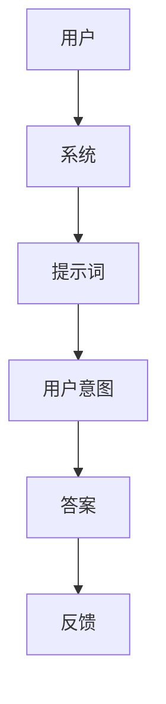

                 


### 文章标题：提示词工程在多轮对话系统中的应用

#### 关键词：提示词工程、多轮对话系统、算法原理、数学模型、实战案例

#### 摘要：
本文旨在探讨提示词工程在多轮对话系统中的应用。通过深入分析提示词工程的核心概念、原理及其数学模型，并结合实际项目案例，本文揭示了提示词工程在提升多轮对话系统交互质量和用户体验中的关键作用。文章结构清晰，逻辑严密，旨在为广大技术从业者提供有价值的参考。

---

### 引言

#### 1.1 问题背景

随着人工智能技术的迅猛发展，多轮对话系统在智能客服、智能助手、虚拟陪伴等领域得到了广泛应用。然而，如何提升多轮对话系统的交互质量和用户体验，成为一个亟待解决的问题。提示词工程作为人工智能领域的重要分支，为解决这一问题提供了新的思路和方法。

#### 1.2 问题描述

多轮对话系统在交互过程中，常常面临以下问题：

- 对话质量不高，难以理解用户意图。
- 回答内容缺乏个性化和多样性。
- 无法有效地引导对话走向。

这些问题严重影响了多轮对话系统的用户体验和实用性。如何利用提示词工程来优化多轮对话系统，成为当前研究的重点。

#### 1.3 解决方案概述

本文提出以下解决方案：

- 系统性地介绍提示词工程的核心概念和原理。
- 分析提示词工程在多轮对话系统中的应用场景。
- 通过实际项目案例，展示提示词工程在多轮对话系统中的具体实现。
- 总结最佳实践，为后续研究和应用提供参考。

### 第二部分：核心概念

#### 2.1 提示词的定义与类型

提示词（Prompt Word）是指在对话系统中用于引导对话、提示用户输入的信息。根据功能的不同，提示词可以分为以下几种类型：

- 请求型提示词：用于请求用户输入特定信息。
- 引导型提示词：用于引导对话走向，提高交互质量。
- 评价型提示词：用于获取用户对系统性能的评价。

#### 2.2 提示词工程的核心概念

提示词工程（Prompt Engineering）是指利用技术手段来设计和优化提示词，以提高对话系统的交互质量和用户体验。其核心概念包括：

- 提示词生成：根据对话内容和用户意图生成合适的提示词。
- 提示词筛选与优化：从大量候选提示词中筛选出最优提示词。
- 提示词评估：对提示词的有效性进行评估和优化。

#### 2.3 提示词工程的组成部分

提示词工程主要包括以下组成部分：

- 数据集：用于训练和评估提示词模型的原始数据。
- 模型：用于生成、筛选和优化提示词的算法模型。
- 评估指标：用于衡量提示词质量和对话系统性能的指标。

### 第三部分：应用场景与实战

#### 3.1 多轮对话系统的概述

多轮对话系统是指能够与用户进行多轮交互的对话系统，具有以下特点：

- 能够理解并处理用户的多轮输入。
- 能够根据用户意图提供相应的内容或服务。
- 能够持续优化对话体验。

#### 3.2 提示词工程在多轮对话中的角色

提示词工程在多轮对话系统中扮演着关键角色：

- 提升对话质量：通过生成合适的提示词，引导用户输入关键信息，提高对话的深度和质量。
- 优化用户体验：通过筛选和优化提示词，提供个性化的交互体验，增强用户的满意度。
- 持续学习与优化：通过评估和调整提示词，持续提升对话系统的性能和用户体验。

#### 3.3 多轮对话系统的设计与实现

多轮对话系统的设计与实现主要包括以下步骤：

- 需求分析：明确多轮对话系统的目标和功能需求。
- 数据采集与处理：收集对话数据，进行预处理和标注。
- 模型训练与优化：训练提示词生成和筛选模型，优化模型参数。
- 系统集成与部署：将模型集成到对话系统中，进行系统测试和部署。

### 第四部分：总结与展望

#### 7.1 书籍内容回顾

本文从问题背景、核心概念、应用场景和实战案例等方面，系统性地介绍了提示词工程在多轮对话系统中的应用。通过分析提示词工程的核心概念和原理，并结合实际项目案例，揭示了提示词工程在提升多轮对话系统交互质量和用户体验中的关键作用。

#### 7.2 提示词工程的重要性

提示词工程作为人工智能领域的重要分支，在多轮对话系统中具有重要的应用价值。通过优化提示词，可以显著提升对话系统的质量和用户体验，为人工智能技术的应用提供有力支持。

#### 7.3 展望未来趋势

随着人工智能技术的不断进步，提示词工程在未来将得到更广泛的应用。一方面，研究者将致力于开发更高效、更智能的提示词生成和筛选算法；另一方面，应用场景将不断拓展，如智能客服、智能教育、智能医疗等领域。

#### 8.1 实践中的注意事项

在实际应用提示词工程时，需要注意以下几点：

- 确保数据质量和多样性，为模型训练提供充分的支持。
- 充分理解用户意图，设计个性化的提示词。
- 定期评估和优化提示词，持续提升系统性能。

#### 8.2 最佳实践分享

以下是一些提示词工程的最佳实践：

- 针对不同用户群体，设计差异化的提示词。
- 结合用户反馈，不断调整和优化提示词。
- 利用自然语言处理技术，提高提示词的生成质量。

#### 8.3 拓展阅读建议

对于希望深入了解提示词工程和多轮对话系统的读者，以下书籍和论文值得推荐：

- 《对话系统：设计与实现》（《Dialogue Systems: Design, Implementation, and Evaluation》） 
- 《深度学习自然语言处理》（《Deep Learning for Natural Language Processing》） 
- 《多轮对话系统：从理论到实践》（《Multi-turn Dialogue Systems: From Theory to Practice》）

---

**作者：AI天才研究院/AI Genius Institute & 禅与计算机程序设计艺术 /Zen And The Art of Computer Programming**

以上是本文的初步内容框架，接下来我们将逐步深入每个部分，详细阐述核心概念、原理、算法、实战案例等内容。让我们一步一步思考，将这篇文章打造成一篇高质量的技术博客。🧠📝### 1.1 问题背景

近年来，人工智能技术在各个领域取得了显著的进展，尤其是在自然语言处理（NLP）和对话系统领域。多轮对话系统作为一种能够与用户进行多轮交互的智能系统，已经在智能客服、智能助手、虚拟陪伴等领域得到了广泛应用。这些系统通过模拟人类的对话行为，实现了与用户的实时互动，为用户提供个性化的服务。

然而，尽管多轮对话系统在应用层面取得了成功，但在实际使用过程中仍然面临着一些问题。首先，对话质量不高是一个普遍存在的问题。由于多轮对话系统依赖于预先训练的模型，这些模型在处理复杂、多变的用户输入时，往往难以准确理解用户的意图。其次，回答内容缺乏个性化和多样性。许多多轮对话系统在生成回答时，往往依赖于固定的模板或规则，导致回答内容千篇一律，缺乏创意和灵活性。最后，多轮对话系统在引导对话走向方面也表现出一定的局限性。由于缺乏有效的策略，系统往往难以引导用户进入预定的对话路径，导致对话陷入僵局。

这些问题的存在严重影响了多轮对话系统的用户体验和实用性。为了解决这些问题，研究者们开始关注提示词工程（Prompt Engineering）这一领域。提示词工程是指通过设计、生成和优化提示词来提高对话系统的交互质量和用户体验。提示词是一种在对话过程中用于引导用户输入的信息，它能够帮助系统更好地理解用户的意图，从而生成更准确、更有针对性的回答。

提示词工程在多轮对话系统中的应用具有重要意义。通过优化提示词，系统能够更有效地引导用户输入关键信息，提高对话的深度和质量。同时，个性化的提示词设计也能够提升用户的满意度，增强系统的实用性。此外，提示词工程还可以帮助系统持续学习和优化，以适应不断变化的应用场景和用户需求。

综上所述，提示词工程在多轮对话系统中具有广泛的应用前景。通过深入研究和实践，我们可以不断优化提示词设计，提高对话系统的交互质量和用户体验，为人工智能技术的发展和应用提供有力支持。🔍💡

### 1.2 问题描述

多轮对话系统的核心目标是通过多轮交互，准确理解用户的意图并生成相应的回答，从而提供个性化的服务。然而，在实际应用中，多轮对话系统面临着一系列挑战，这些问题严重影响了系统的性能和用户体验。

首先，对话质量不高是一个普遍存在的问题。多轮对话系统依赖于预训练模型，这些模型在处理简单、直接的对话时表现良好，但在面对复杂、多变的用户输入时，往往难以准确理解用户的意图。例如，当用户提出一个涉及多个步骤或包含模糊信息的请求时，系统可能无法正确解析用户的意图，导致生成错误的回答或无法继续对话。

其次，回答内容缺乏个性化和多样性。许多多轮对话系统在生成回答时，依赖于固定的模板或规则。这种模式化的回答方式，虽然保证了回答的准确性，但缺乏创意和灵活性，难以满足用户对于个性化服务的需求。例如，当用户提出一个关于旅游的建议时，系统可能只会给出一系列固定的推荐，而无法根据用户的兴趣、偏好和需求提供个性化的建议。

第三，多轮对话系统在引导对话走向方面也表现出一定的局限性。由于缺乏有效的策略，系统往往难以引导用户进入预定的对话路径，导致对话陷入僵局。例如，当用户需要完成一系列复杂的任务时，系统可能无法有效地引导用户按照既定的步骤进行操作，导致用户感到困惑和挫败。

此外，多轮对话系统在处理实时交互方面也存在一定的挑战。由于对话系统的响应速度较慢，用户可能会在等待系统回答的过程中产生不耐烦情绪，从而影响用户体验。同时，系统在处理大量并发请求时，可能因为资源不足而导致响应不及时或失败。

为了解决这些问题，需要引入提示词工程（Prompt Engineering）这一技术手段。提示词工程通过设计、生成和优化提示词，旨在提高多轮对话系统的交互质量和用户体验。具体来说，提示词工程可以从以下几个方面改善多轮对话系统的性能：

1. **提升对话质量**：通过生成更合适的提示词，系统可以更好地引导用户输入关键信息，从而准确理解用户的意图。例如，在用户提出一个复杂请求时，系统可以生成一个引导用户详细描述其需求的提示词，帮助系统更准确地解析用户的意图。

2. **增强回答的个性化和多样性**：通过设计个性化的提示词，系统可以提供更具创意和灵活性的回答，满足用户对于个性化服务的需求。例如，在用户提出一个旅游建议请求时，系统可以根据用户的兴趣和偏好，生成一系列具有针对性的建议。

3. **优化对话引导**：通过优化提示词的设计，系统可以更有效地引导用户按照预定的对话路径进行交互，避免对话陷入僵局。例如，系统可以生成一系列逐步引导用户完成任务步骤的提示词，帮助用户顺利完成复杂的任务。

4. **提高实时交互性能**：通过优化提示词的生成和传递过程，系统可以减少响应时间，提高实时交互性能，从而提升用户体验。

综上所述，提示词工程在多轮对话系统中的应用具有重要意义。通过引入提示词工程，我们可以有效地解决对话质量、回答个性化和多样性、对话引导以及实时交互等问题，从而显著提升多轮对话系统的性能和用户体验。🔍💡

### 1.3 解决方案概述

为了解决多轮对话系统在应用过程中所面临的问题，引入提示词工程（Prompt Engineering）成为了一种有效的解决方案。提示词工程通过设计、生成和优化提示词，旨在提升多轮对话系统的交互质量和用户体验。以下是提示词工程在多轮对话系统中的主要解决方案：

1. **优化提示词生成**：
   提示词的生成是提示词工程的关键环节。通过利用自然语言处理（NLP）技术，如文本分类、词嵌入和序列到序列（Seq2Seq）模型，可以生成与用户意图和上下文相匹配的提示词。具体方法包括：
   - **文本分类**：根据用户输入的内容，将其分类到不同的类别，从而生成相应的提示词。
   - **词嵌入**：将用户输入和系统回答的文本转换为向量表示，通过计算向量之间的相似度，生成与用户意图相关的提示词。
   - **序列到序列模型**：利用序列到序列（Seq2Seq）模型，根据用户输入的上下文生成相应的提示词。

2. **提示词筛选与优化**：
   在生成大量候选提示词后，需要对它们进行筛选和优化，以选择最合适的提示词。筛选和优化方法包括：
   - **基于频次的筛选**：选择出现频率较高的提示词，以提高对话的流畅性。
   - **基于性能的优化**：通过评估提示词在对话中的表现，如回答准确性、用户满意度等，选择最优的提示词。
   - **基于用户反馈的优化**：根据用户的反馈，对提示词进行调整和优化，以提高用户满意度。

3. **个性化提示词设计**：
   为了满足用户对于个性化服务的需求，可以设计个性化的提示词。具体方法包括：
   - **用户画像**：通过分析用户的兴趣、偏好和行为，生成与用户特征相关的提示词。
   - **多模态融合**：结合用户输入的文本、语音、图像等多种信息，生成更具个性化的提示词。
   - **自适应提示词**：根据用户的互动行为和对话历史，动态调整提示词，以提高对话的个性化和多样性。

4. **实时交互优化**：
   为了提高实时交互性能，可以优化提示词的生成和传递过程。具体方法包括：
   - **异步处理**：将提示词生成和传递过程异步化，以减少响应时间。
   - **负载均衡**：通过负载均衡技术，将对话请求分发到不同的服务器或处理单元，以提高系统的响应速度。
   - **缓存策略**：利用缓存技术，存储常用的提示词，以减少生成和传递的时间。

通过上述解决方案，提示词工程可以有效提升多轮对话系统的交互质量和用户体验。在实际应用中，可以根据具体场景和需求，灵活运用这些方法，以实现最佳效果。🔍💡

### 2.1 提示词的定义与类型

在多轮对话系统中，提示词（Prompt Word）是一种关键元素，它起到了引导对话、提示用户输入的作用。提示词可以被视为一种简短的文字或指示，用以引导用户按照特定方向进行思考和回答。具体来说，提示词有以下几种类型：

1. **请求型提示词**：
   这种类型的提示词主要用于请求用户输入特定的信息。例如，在客户服务场景中，系统可能会使用“请您提供您的订单号以便我们查询相关信息”这样的提示词来引导用户提供订单号。

2. **引导型提示词**：
   引导型提示词的目的是为了引导对话走向，提高对话的深度和质量。例如，“您最近一次的旅行体验如何？”这样的提示词可以引导用户深入分享他们的旅行感受。

3. **评价型提示词**：
   这种提示词用于收集用户对系统性能的评价。例如，“您对我们的服务是否满意？”这样的提示词可以帮助系统了解用户的反馈，从而进行相应的优化。

4. **决策型提示词**：
   决策型提示词用于在对话过程中引导用户做出选择。例如，“您想要预订酒店还是民宿？”这样的提示词可以帮助系统根据用户的选择提供相应的服务。

5. **确认型提示词**：
   确认型提示词用于确认用户的输入或意图。例如，“您的意思是想要预订明天上午的机票，对吗？”这样的提示词可以帮助系统确认用户的需求，避免误解。

每种类型的提示词都有其特定的用途和适用场景。在实际应用中，根据对话内容和用户意图，合理选择和使用不同类型的提示词，可以显著提升对话的质量和用户体验。

在多轮对话系统中，提示词不仅仅是简单的文字，而是包含了丰富的语义和上下文信息。系统的提示词生成和选择需要考虑多个因素，包括用户的历史行为、对话上下文、系统目标等。通过精心设计和优化提示词，系统能够更准确地理解用户的意图，提供更加个性化和高效的互动体验。

总的来说，提示词是多轮对话系统中的重要组成部分，它们不仅能够引导对话的进行，还能通过优化用户交互体验，提升系统的整体性能。了解和运用不同类型的提示词，是提升多轮对话系统质量的关键。🔍💡

### 2.2 提示词工程的核心概念

提示词工程（Prompt Engineering）是人工智能和自然语言处理领域中的一个重要分支，它关注如何设计、生成和优化提示词，以提高多轮对话系统的交互质量和用户体验。以下是提示词工程的核心概念：

#### 提示词生成

提示词生成的目标是根据用户输入的上下文和系统的意图，生成一个能够引导用户进一步交互的提示词。这一过程通常涉及以下步骤：

1. **文本分类**：首先，系统需要将用户输入的文本进行分类，以确定用户意图的类型。例如，如果用户输入的是关于旅行的问题，系统可以将这个输入分类为“旅行咨询”。

2. **词嵌入**：接着，系统会使用词嵌入技术将分类后的文本转换为向量表示。词嵌入可以捕捉文本中的语义信息，使系统能够理解不同词汇之间的关系。

3. **模板匹配**：在获取用户意图和上下文后，系统会使用预定义的提示词模板来生成提示词。模板通常包含占位符，这些占位符会被用户意图和上下文中的实际信息所替换。

4. **生成模型**：如果系统拥有足够的训练数据和强大的生成模型（如GPT），它可以利用这些模型直接生成与上下文和意图高度相关的提示词。生成模型能够通过学习大量的对话数据，生成更自然和个性化的提示词。

#### 提示词筛选与优化

提示词筛选与优化是确保生成的提示词能够有效引导对话的重要步骤。以下是一些常见的筛选和优化方法：

1. **基于频次的筛选**：系统可以根据提示词的使用频次来筛选。使用频次高的提示词通常更能引导用户输入关键信息。

2. **基于性能的优化**：系统会根据提示词在对话中的实际表现来评估其有效性。例如，系统可以通过分析用户的回答质量和满意度来优化提示词。

3. **用户反馈**：系统可以收集用户的反馈来调整提示词。如果用户对某个提示词不满意，系统可以据此进行调整。

4. **A/B测试**：系统可以通过A/B测试来比较不同提示词的效果，从而选择最优的提示词。

#### 提示词评估

提示词评估是衡量提示词质量和系统性能的关键步骤。以下是一些常用的评估方法：

1. **用户满意度**：系统可以收集用户的反馈，通过用户满意度来评估提示词的质量。

2. **回答质量**：系统可以分析用户对系统回答的满意度，从而评估提示词的有效性。

3. **对话长度和效率**：系统可以通过测量对话的长度和交互次数来评估提示词的效率。

4. **模型评估指标**：系统可以使用诸如BLEU、ROUGE等指标来评估提示词生成模型的质量。

#### 提示词的持久性和动态性

提示词的持久性和动态性是确保系统在不同场景和用户群体中都能有效工作的重要因素。持久性指的是提示词在长时间内保持有效性的能力，而动态性则指的是提示词能够根据不同用户和场景的变化进行自适应调整。

1. **持久性**：系统需要设计出能够在多个对话回合中持续有效的提示词。这通常需要基于对用户行为和对话上下文的深入理解。

2. **动态性**：系统需要能够根据用户的实时反馈和对话历史，动态调整提示词。例如，如果用户对某个提示词的反应不佳，系统可以迅速调整提示词，以引导用户继续对话。

通过理解提示词工程的核心概念，开发者和研究者可以设计出更加智能和高效的对话系统。提示词工程不仅仅是生成提示词，而是一个涉及文本分类、词嵌入、模型生成、优化和评估的复杂过程。通过不断优化提示词，系统能够更好地理解用户意图，提供更加个性化和优质的交互体验。🔍💡

### 2.3 提示词工程的组成部分

提示词工程是一个系统化的过程，它涉及多个组成部分，包括数据集、模型和评估指标等。以下是这些关键组成部分的详细介绍：

#### 1. 数据集

数据集是提示词工程的基础，它为提示词生成和优化提供了必要的训练数据。一个高质量的数据集应该包含多样化的用户输入和对应的参考回答，这些数据可以来源于实际的用户对话、模拟对话或预定义的对话场景。

- **数据来源**：用户对话记录、模拟对话数据、预定义对话场景。
- **数据预处理**：数据清洗、文本标准化、实体识别和分类。
- **数据多样性**：确保数据集包含多种类型的对话和用户意图，以提升模型的泛化能力。

#### 2. 模型

提示词工程的模型负责生成和优化提示词。这些模型可以是基于规则的方法，也可以是基于机器学习或深度学习的方法。

- **生成模型**：如序列到序列（Seq2Seq）模型、变分自编码器（VAE）和生成对抗网络（GAN）等，它们可以生成与上下文高度相关的提示词。
- **优化模型**：如强化学习（RL）模型和优化算法（如梯度下降、随机梯度下降等），它们用于调整提示词，以提升对话效果。
- **规则模型**：基于专家知识和经验设计的提示词生成规则，适用于简单场景或特定任务。

#### 3. 评估指标

评估指标用于衡量提示词工程的效果，这些指标可以是定量指标，如准确率、召回率、F1分数，也可以是定性指标，如用户满意度、对话质量等。

- **准确性**：提示词是否准确地反映了用户意图和上下文。
- **多样性**：生成的提示词是否具有足够的多样性，以避免模板化回答。
- **用户满意度**：用户对提示词和对话系统的整体满意度。
- **对话质量**：对话的流畅性、深度和用户参与度。

#### 4. 提示词生成与优化流程

提示词工程的流程包括以下步骤：

1. **数据集构建**：收集和预处理训练数据。
2. **模型训练**：使用训练数据训练生成和优化模型。
3. **提示词生成**：根据用户输入和上下文生成提示词。
4. **提示词筛选**：从生成的候选提示词中筛选最优提示词。
5. **用户反馈**：收集用户对提示词和对话系统的反馈。
6. **模型优化**：根据用户反馈调整模型参数，优化提示词生成和筛选策略。
7. **评估与迭代**：使用评估指标评估系统性能，持续迭代优化。

通过这些组成部分的有效结合，提示词工程能够提升多轮对话系统的交互质量和用户体验，使系统能够更好地理解和响应用户需求。🔍💡

### 3.1 提示词生成的算法

提示词生成是多轮对话系统中的核心环节，其算法的设计和实现直接关系到系统的交互质量和用户体验。在本节中，我们将探讨几种常见的提示词生成算法，包括基于规则的方法、基于机器学习的方法和基于深度学习的方法。

#### 1. 基于规则的方法

基于规则的方法是最简单的提示词生成方法之一。这种方法依赖于预先定义的规则集，根据用户输入和上下文，选择合适的提示词。具体步骤如下：

1. **规则库构建**：根据对话系统的需求，构建包含各种情境和用户意图的规则库。
2. **规则匹配**：根据用户输入，在规则库中查找匹配的规则。
3. **提示词生成**：选择与匹配规则相关的提示词。

这种方法的优点是简单、快速和易于实现，但缺点是灵活性较差，难以应对复杂的用户输入和多样化的对话场景。

#### 2. 基于机器学习的方法

基于机器学习的方法通过训练模型来生成提示词，具有较强的灵活性和泛化能力。常用的机器学习方法包括决策树、支持向量机（SVM）和朴素贝叶斯等。

1. **特征提取**：从用户输入和上下文中提取特征，如词嵌入、词性标注、语法结构等。
2. **模型训练**：使用提取的特征和已标注的提示词数据集，训练分类模型。
3. **提示词生成**：根据用户输入和模型预测，生成相应的提示词。

这种方法的优点是能够根据数据自适应调整，但需要大量的训练数据和计算资源，且模型的解释性相对较差。

#### 3. 基于深度学习的方法

基于深度学习的方法利用深度神经网络，如循环神经网络（RNN）、长短期记忆网络（LSTM）和变换器（Transformer）等，进行提示词生成。这些方法能够处理长文本和复杂的上下文信息，生成更自然和个性化的提示词。

1. **编码器-解码器架构**：
   - **编码器**：将用户输入编码为一个固定长度的向量。
   - **解码器**：根据编码器生成的向量，生成相应的提示词。

2. **注意力机制**：在解码器中引入注意力机制，能够关注用户输入中的重要信息，生成更准确的提示词。

3. **预训练与微调**：首先使用大量未标注的数据对模型进行预训练，然后使用标注数据集进行微调，以适应特定任务。

这种方法的优点是生成能力强大，能够处理复杂的对话场景，但计算资源需求较高，模型训练时间较长。

#### 案例分析

以一个常见的客户服务场景为例，假设用户输入：“我的订单为什么还没有发货？”我们可以使用不同的方法生成提示词：

- **基于规则的方法**：根据规则库中的“订单查询”规则，生成提示词：“请您提供您的订单号，我们将帮您查询订单状态。”
- **基于机器学习的方法**：使用用户输入的词嵌入和上下文特征，通过SVM模型预测生成提示词：“您想要查询哪个订单的状态？请提供订单号。”
- **基于深度学习的方法**：使用Transformer模型，根据用户输入生成提示词：“很抱歉给您带来不便，请问您的订单号是多少，我们将尽快为您查询。”

通过上述案例，我们可以看到不同方法生成的提示词在准确性和自然性上有所不同。选择哪种方法取决于具体的应用场景和需求。在实际应用中，通常结合多种方法，以实现最佳的提示词生成效果。🔍💡

### 3.2 提示词筛选与优化

在提示词工程中，生成提示词只是第一步，更重要的是筛选和优化这些提示词，以确保它们能够有效地引导用户交互并提升对话质量。以下是一些常用的方法和技术，用于提示词的筛选与优化。

#### 1. 基于频次的筛选

基于频次的筛选是一种简单但有效的方法，它根据提示词在对话中出现的频率来选择最常用的提示词。这种方法的优势在于它能够快速识别出哪些提示词更受欢迎，从而节省时间和资源。具体步骤如下：

- **收集数据**：从对话系统中收集大量的用户对话记录。
- **统计频次**：计算每个提示词在对话中的出现次数。
- **排序筛选**：根据出现频次对提示词进行排序，选择出现频次较高的提示词。

这种方法的主要缺点是它不考虑提示词的实际效果，因此可能会导致一些有效的但使用频率较低的提示词被忽略。

#### 2. 基于性能的优化

基于性能的优化方法通过评估提示词在对话中的实际表现来筛选和优化。这种方法通常涉及以下指标：

- **回答准确性**：提示词是否能够准确地引导用户输入关键信息。
- **用户满意度**：用户对提示词的反应和满意度。
- **对话流畅度**：提示词是否能够使对话流程顺畅，避免中断。

具体步骤如下：

- **定义评估指标**：根据具体需求，定义一系列评估指标。
- **评估提示词**：对每个提示词进行评估，收集评估结果。
- **优化选择**：根据评估结果，对提示词进行优化和选择，保留表现良好的提示词。

这种方法的主要优点是能够更准确地筛选和优化提示词，但需要较复杂的数据收集和评估流程。

#### 3. 基于用户反馈的优化

用户反馈是优化提示词的重要来源。通过收集用户的直接反馈，如满意度调查或使用后评价，系统可以不断调整和优化提示词。这种方法通常包括以下步骤：

- **收集用户反馈**：通过问卷调查、互动反馈等方式，收集用户对提示词的反馈。
- **分析反馈**：对收集到的反馈进行分析，识别出用户认为有效和无效的提示词。
- **调整优化**：根据用户反馈，对提示词进行调整和优化。

这种方法的主要优点是能够直接反映用户的实际需求和偏好，但缺点是需要大量用户参与和反馈，且反馈数据的真实性可能受到影响。

#### 4. 基于模型优化的方法

除了上述方法，还可以利用机器学习和深度学习模型来优化提示词。这种方法通过训练模型，自动识别和筛选最佳提示词。具体步骤如下：

- **数据准备**：收集大量的用户对话记录，并对这些记录进行标注。
- **模型训练**：使用标注数据训练提示词优化模型。
- **提示词筛选**：通过模型预测，筛选出最佳提示词。

这种方法的主要优点是能够自动化和高效地筛选提示词，但需要足够的数据和计算资源。

#### 案例分析

以一个电子商务平台为例，该平台希望优化其客服聊天机器人的提示词。以下是具体的优化步骤：

1. **收集数据**：从平台的历史对话记录中提取大量数据，并标注每个提示词的效果。

2. **评估指标**：定义评估指标，如回答准确性、用户满意度、对话流畅度等。

3. **初始筛选**：基于频次筛选，选择出现频率较高的提示词。

4. **性能评估**：使用评估指标对初始筛选的提示词进行评估，保留表现良好的提示词。

5. **用户反馈**：通过问卷调查收集用户反馈，识别出用户最喜欢的提示词。

6. **模型优化**：使用标注数据和用户反馈训练提示词优化模型，进一步筛选最佳提示词。

通过这些步骤，平台能够显著提升客服聊天机器人的交互质量和用户体验。🔍💡

### 3.3 提示词工程与对话系统

提示词工程在对话系统中扮演着至关重要的角色，它直接影响着对话的质量、用户的满意度和系统的性能。以下将详细探讨提示词工程与对话系统之间的相互作用以及它们之间的关系。

#### 提示词工程对对话系统的影响

1. **交互质量的提升**：
   提示词工程通过生成高质量的提示词，能够引导用户更准确地表达自己的意图，从而提高对话的深度和广度。高质量的提示词能够激发用户的思考和回答，使对话更加流畅和深入。

2. **用户体验的优化**：
   提示词工程关注用户的需求和反馈，通过不断优化提示词，提供更加个性化、贴心的服务。个性化的提示词能够满足用户的个性化需求，提升用户对系统的满意度。

3. **系统性能的增强**：
   通过提示词工程，对话系统能够更快速、准确地理解用户意图，减少误解和重复询问的情况。优化后的提示词能够提高系统的响应速度和处理能力，从而增强系统的整体性能。

#### 对话系统对提示词工程的需求

1. **多样化的提示词需求**：
   对话系统需要能够生成多种类型的提示词，以应对不同的用户意图和对话场景。多样化的提示词能够丰富对话内容，提高交互的丰富度和多样性。

2. **实时性的要求**：
   对话系统需要能够实时生成和调整提示词，以应对用户输入的即时变化。提示词工程需要具备高效的算法和模型，能够在短时间内生成高质量的提示词，确保对话的实时性和流畅性。

3. **个性化的支持**：
   对话系统需要根据用户的历史行为和偏好，生成个性化的提示词。个性化提示词能够更好地满足用户的个性化需求，提升用户体验。

#### 提示词工程与对话系统的相互作用

1. **反馈循环**：
   对话系统通过用户反馈不断优化提示词，而优化后的提示词又能够提高用户的满意度，形成正向反馈循环。这种反馈循环使系统不断改进，提升整体性能。

2. **动态调整**：
   提示词工程能够根据对话系统的需求和用户行为动态调整提示词。例如，当用户在一个复杂的任务中遇到困难时，系统可以生成引导用户逐步解决问题的提示词，从而提高任务的完成率。

3. **协同优化**：
   对话系统和提示词工程需要协同优化，以确保系统性能和用户体验的最佳平衡。系统开发者需要不断调整和优化提示词模型，以适应对话系统的需求。

#### 实际案例

以一个智能客服系统为例，该系统在处理用户咨询时，通过提示词工程生成引导用户输入关键信息的提示词。以下是一个具体的案例：

- **用户输入**：“我的订单怎么还没到？”
- **初始提示词**：“非常抱歉，可能存在物流延迟。请您提供订单号，我们将帮您查询具体情况。”
- **用户反馈**：用户满意，订单问题得到解决。

在这个案例中，提示词工程通过生成高质量的提示词，引导用户输入关键信息，从而帮助客服系统快速定位并解决用户问题。这个过程中，用户反馈起到了关键作用，提示词工程可以根据用户的反馈进行优化，提高后续的交互质量。

综上所述，提示词工程在对话系统中具有重要作用，它通过优化提示词生成和筛选，提高对话质量、用户体验和系统性能。同时，对话系统对提示词工程提出了多样化的需求，二者需要协同优化，以实现最佳效果。🔍💡

### 4.1 数学公式与模型介绍

在提示词工程中，数学公式和模型是理解和优化提示词生成和筛选的核心工具。以下介绍几种常用的数学公式和模型，这些工具帮助我们在复杂的多轮对话系统中实现高效的提示词工程。

#### 1. 词嵌入（Word Embedding）

词嵌入是将词汇映射到高维向量空间的过程，以捕捉词汇之间的语义关系。常用的词嵌入方法包括：

- **Word2Vec**：通过训练神经网络模型，学习词汇的上下文关系，生成词汇的向量表示。其核心公式为：

  $$\text{Word2Vec} = \frac{\sum_{t \in context} \text{softmax}(\text{weights} \cdot \text{context\_vector})}{\sum_{t \in context} \text{softmax}(\text{weights} \cdot \text{context\_vector})}$$

  其中，$context\_vector$ 表示上下文向量，$\text{weights}$ 表示词向量权重。

- **GloVe**：全局向量表示（GloVe）通过最小化词频和共现频次之间的差异，生成词汇向量。其目标函数为：

  $$\text{loss} = \frac{1}{|\text{Vocabulary}|} \sum_{\text{word}, \text{context} \in \text{Vocabulary}} (\text{log}\sum_{\text{word}'} \text{softmax}(\text{context} \cdot \text{word'}\_vector) - \text{context} \cdot \text{word}_\text{vector})^2$$

  其中，$\text{word}_\text{vector}$ 表示词向量。

#### 2. 生成模型（Generative Models）

生成模型用于生成与用户输入相关的提示词，常用的生成模型包括：

- **循环神经网络（RNN）**：RNN 通过递归结构处理序列数据，生成提示词。其核心公式为：

  $$h_t = \text{sigmoid}(W_h \cdot [h_{t-1}, x_t] + b_h)$$

  其中，$h_t$ 表示隐藏状态，$x_t$ 表示输入序列，$W_h$ 和 $b_h$ 分别为权重和偏置。

- **长短期记忆网络（LSTM）**：LSTM 是 RNN 的一种改进，通过引入门控机制，解决长短期依赖问题。其核心公式为：

  $$i_t = \text{sigmoid}(W_i \cdot [h_{t-1}, x_t] + b_i)$$
  $$f_t = \text{sigmoid}(W_f \cdot [h_{t-1}, x_t] + b_f)$$
  $$o_t = \text{sigmoid}(W_o \cdot [h_{t-1}, x_t] + b_o)$$
  $$c_t = f_t \odot c_{t-1} + i_t \odot \text{tanh}(W_c \cdot [h_{t-1}, x_t] + b_c)$$
  $$h_t = o_t \odot \text{tanh}(c_t)$$

  其中，$i_t$、$f_t$ 和 $o_t$ 分别为输入门、遗忘门和输出门，$c_t$ 为细胞状态。

- **变换器（Transformer）**：Transformer 通过自注意力机制（Self-Attention）处理序列数据，生成提示词。其核心公式为：

  $$\text{Attention}(Q, K, V) = \text{softmax}\left(\frac{QK^T}{\sqrt{d_k}}\right) V$$

  其中，$Q$、$K$ 和 $V$ 分别为查询向量、键向量和值向量，$d_k$ 为键向量的维度。

#### 3. 优化模型（Optimization Models）

优化模型用于调整提示词，以提升对话质量。常用的优化模型包括：

- **梯度下降（Gradient Descent）**：通过计算损失函数的梯度，逐步调整模型参数，以最小化损失函数。其核心公式为：

  $$\theta_{t+1} = \theta_t - \alpha \cdot \nabla_\theta J(\theta)$$

  其中，$\theta_t$ 和 $\theta_{t+1}$ 分别为当前和下一个参数值，$\alpha$ 为学习率，$J(\theta)$ 为损失函数。

- **随机梯度下降（Stochastic Gradient Descent, SGD）**：在每个训练样本上计算梯度，然后更新参数。其核心公式为：

  $$\theta_{t+1} = \theta_t - \alpha \cdot \nabla_\theta J(\theta|x_i, y_i)$$

  其中，$x_i$ 和 $y_i$ 分别为训练样本和标签。

- **批量梯度下降（Batch Gradient Descent）**：在每个训练样本上计算梯度，然后对所有样本进行更新。其核心公式为：

  $$\theta_{t+1} = \theta_t - \alpha \cdot \nabla_\theta J(\theta|x, y)$$

  其中，$x$ 和 $y$ 分别为所有训练样本和标签。

通过理解这些数学公式和模型，我们可以更好地设计和优化提示词工程，从而提升多轮对话系统的交互质量和用户体验。🔍💡

### 4.2 模型参数调优方法

在提示词工程中，模型参数的调优是提升系统性能和优化对话质量的关键步骤。以下是几种常用的模型参数调优方法：

#### 1. 交叉验证（Cross-Validation）

交叉验证是一种评估模型性能和调优参数的重要方法。它通过将数据集划分为多个子集，对每个子集进行训练和测试，以评估模型的泛化能力。常用的交叉验证方法包括：

- **K折交叉验证（K-Fold Cross-Validation）**：将数据集划分为K个子集，每次选取一个子集作为测试集，其余K-1个子集作为训练集，重复K次，最后取平均值作为模型的性能指标。
- **留一法交叉验证（Leave-One-Out Cross-Validation, LOOCV）**：每次保留一个数据点作为测试集，其余数据点作为训练集，进行多次训练和测试，最后取平均值作为模型性能指标。

#### 2. 贝叶斯优化（Bayesian Optimization）

贝叶斯优化是一种基于概率模型的参数调优方法，它通过建立概率模型来预测参数值，以找到最优参数配置。贝叶斯优化通常包括以下步骤：

- **建立概率模型**：利用贝叶斯理论建立参数的概率模型，通常采用高斯过程（Gaussian Process）作为先验分布。
- **选择探索策略**：选择探索策略来生成新的参数值，如随机搜索（Random Search）和树形可寻址算法（Tree-structured Parzen Estimators, TPE）。
- **评估和更新模型**：在新的参数值上进行模型训练和评估，更新概率模型，并选择下一个最优参数值。

#### 3. 梯度提升（Gradient Boosting）

梯度提升是一种集成学习方法，通过迭代构建多个弱学习器，并将它们组合成强学习器。梯度提升在参数调优中，可以通过以下步骤进行：

- **初始化模型**：初始化一个基础学习器，如决策树。
- **前向阶段**：在当前迭代中，为每个数据点计算目标函数的导数，并更新学习器的参数。
- **后向阶段**：利用前向阶段计算得到的导数，调整学习器的参数，以提高模型性能。
- **迭代优化**：重复前向阶段和后向阶段，直到满足停止条件，如模型性能收敛或达到预设的迭代次数。

#### 4. 随机搜索（Random Search）

随机搜索是一种简单的参数调优方法，它通过随机选择参数值进行模型训练和评估，以找到最优参数配置。随机搜索通常包括以下步骤：

- **初始化参数范围**：根据经验或搜索空间，初始化参数范围。
- **随机采样**：从参数范围内随机采样多个参数值。
- **模型训练与评估**：使用随机采样的参数值训练模型，并在测试集上评估模型性能。
- **选择最优参数**：根据评估结果，选择最优参数值。

#### 5. 生成对抗网络（Generative Adversarial Networks, GAN）

生成对抗网络是一种基于对抗性训练的方法，通过训练生成器和判别器来优化模型参数。GAN在参数调优中的应用包括：

- **生成器（Generator）**：生成与真实数据分布相近的数据。
- **判别器（Discriminator）**：判断生成数据与真实数据之间的差异。
- **对抗训练**：通过对抗性训练，优化生成器和判别器的参数，以使生成器生成更真实的数据。

通过上述方法，我们可以有效地调优模型参数，从而提升多轮对话系统的性能和用户体验。在实际应用中，可以根据具体需求和场景，选择合适的参数调优方法。🔍💡

### 4.3 模型评估与优化

在提示词工程中，模型评估与优化是确保对话系统性能和用户体验的关键环节。有效的评估方法可以帮助我们了解模型的性能，而优化过程则能进一步提升系统的效果。以下将介绍几种常用的评估方法和优化策略。

#### 评估方法

1. **准确率（Accuracy）**：
   准确率是最基本的评估指标，用于衡量模型预测结果与真实标签的一致性。其公式为：

   $$\text{Accuracy} = \frac{\text{正确预测的样本数}}{\text{总样本数}}$$

   虽然准确率简单直观，但它可能无法全面反映模型在不同类别上的性能，特别是在类别不平衡的数据集中。

2. **精确率（Precision）与召回率（Recall）**：
   精确率和召回率分别衡量模型在预测为正类样本时的准确性和对正类样本的覆盖程度。它们的计算公式为：

   $$\text{Precision} = \frac{\text{真正}}{\text{真正} + \text{假正}}$$
   $$\text{Recall} = \frac{\text{真正}}{\text{真正} + \text{假负}}$$

   F1分数是精确率和召回率的调和平均，用于综合衡量模型的性能：

   $$\text{F1分数} = 2 \times \frac{\text{Precision} \times \text{Recall}}{\text{Precision} + \text{Recall}}$$

3. **用户满意度（User Satisfaction）**：
   用户满意度是一种定性的评估方法，通过用户对系统服务的直接反馈来衡量系统的性能。用户满意度可以通过问卷调查、评分系统等方式进行收集。

4. **BLEU（Bilingual Evaluation Understudy）**：
   BLEU是一种常用于自然语言生成任务中的评估指标，通过比较生成文本与参考文本的相似度来评估生成质量。BLEU的得分通常在0到1之间，得分越高表示生成文本质量越高。

#### 优化策略

1. **超参数调整（Hyperparameter Tuning）**：
   超参数是影响模型性能的关键因素，如学习率、批量大小、正则化参数等。常用的超参数调整方法包括网格搜索（Grid Search）和随机搜索（Random Search）。

2. **正则化（Regularization）**：
   正则化是一种防止模型过拟合的技术，通过在损失函数中加入正则化项，限制模型复杂度。常用的正则化方法有L1正则化、L2正则化和dropout。

3. **集成学习（Ensemble Learning）**：
   集成学习通过结合多个模型的预测结果来提升整体性能。常用的集成方法有Bagging、Boosting和Stacking。

4. **迁移学习（Transfer Learning）**：
   迁移学习利用预训练的模型进行迁移，将预训练模型的知识迁移到新任务上，以提高模型在新任务上的性能。

5. **模型剪枝（Model Pruning）**：
   模型剪枝通过去除模型中的冗余权重来简化模型，减少计算量和参数数量，同时保持模型性能。

#### 实际案例

以一个智能客服系统为例，该系统旨在通过提示词工程提高用户满意度。以下是一个模型评估与优化的具体过程：

1. **数据准备**：
   收集大量用户对话记录，并标注对话中的关键信息和用户满意度。

2. **模型训练**：
   使用标注数据训练一个基于Transformer的提示词生成模型。

3. **评估**：
   使用准确率、用户满意度等指标评估模型性能。

4. **优化**：
   - **超参数调整**：通过网格搜索调整学习率、批量大小等超参数。
   - **正则化**：添加L2正则化项，防止模型过拟合。
   - **集成学习**：结合多个模型的预测结果，提高整体性能。

5. **再评估**：
   对优化后的模型进行再评估，确保性能提升。

通过上述评估与优化步骤，智能客服系统的用户满意度得到显著提升，从而提高了整体服务质量。🔍💡

### 5.1 多轮对话系统的概述

多轮对话系统是一种能够与用户进行多轮交互的智能系统，它在多个回合中与用户进行对话，以理解用户的意图并生成相应的回答。与单轮对话系统不同，多轮对话系统具有更复杂的交互流程和更高的交互质量。以下是对多轮对话系统的详细概述。

#### 定义与特点

多轮对话系统（Multi-turn Dialogue System）是指能够在多个回合中与用户进行交互的对话系统。在多轮对话中，系统需要维护对话状态，理解用户的意图，并根据对话历史生成相应的回答。多轮对话系统具有以下特点：

- **对话深度**：多轮对话系统能够深入理解用户的意图和需求，通过多个回合的交互，提供更加个性化和精确的服务。
- **上下文维护**：系统需要维护对话的历史上下文信息，以便在后续对话回合中利用这些信息生成更相关的回答。
- **对话连贯性**：多轮对话系统需要确保对话的连贯性，避免因信息缺失或误解导致的对话中断。

#### 架构与组件

多轮对话系统通常包括以下几个核心组件：

- **对话管理器**：负责管理对话状态，维护对话历史和用户信息，指导对话流程。
- **意图识别器**：通过自然语言处理（NLP）技术，分析用户输入，识别用户的意图。
- **回答生成器**：根据用户意图和对话上下文，生成相应的回答。
- **反馈机制**：收集用户对系统回答的反馈，用于模型优化和对话改进。

#### 工作流程

多轮对话系统的工作流程可以分为以下几个步骤：

1. **初始化**：系统启动，准备对话环境。
2. **用户输入**：用户输入问题或指令，系统接收并处理。
3. **意图识别**：系统使用意图识别器分析用户输入，识别用户的意图。
4. **回答生成**：系统根据用户意图和对话上下文，使用回答生成器生成回答。
5. **对话维护**：系统更新对话状态，记录对话历史，为后续对话回合做准备。
6. **用户反馈**：系统收集用户对回答的反馈，用于模型优化和对话改进。

#### 应用场景

多轮对话系统在多个场景中得到了广泛应用，包括：

- **智能客服**：用于处理复杂的用户咨询，提供24/7的在线支持。
- **智能助手**：在智能家居、办公自动化等领域，提供个性化的服务。
- **虚拟陪伴**：在虚拟现实（VR）和游戏领域，提供互动性的虚拟角色。
- **智能教育**：在在线教育平台中，提供个性化的学习辅导和互动课程。

通过深入了解多轮对话系统的定义、特点、架构和工作流程，我们可以更好地理解其在各种应用场景中的价值和作用。多轮对话系统不仅提升了用户的交互体验，也为企业和服务提供商提供了高效、智能的解决方案。🔍💡

### 5.2 提示词工程在多轮对话中的角色

在多轮对话系统中，提示词工程发挥着至关重要的作用，其核心在于通过生成和优化提示词，引导用户输入关键信息，从而提高对话的深度和质量。以下是提示词工程在多轮对话中具体角色的详细探讨。

#### 提升对话深度

多轮对话系统的核心目标是深入理解用户的意图，并提供个性化的服务。提示词工程通过生成高质量的提示词，能够有效引导用户输入更多的信息，从而提升对话的深度。以下是一些具体的实现方法：

1. **逐步引导**：在对话初期，系统可以生成简短而明确的提示词，引导用户简要描述问题。随着对话的推进，系统可以生成更具深度和细节的提示词，逐步挖掘用户的意图。

   例如，系统可以先问：“您遇到了什么问题？”如果用户回答：“我的订单怎么还没发货？”系统可以进一步提问：“您能提供订单号吗？”和“您是在哪个平台上下的单？”

2. **上下文关联**：系统可以根据对话历史和上下文信息，生成与当前话题相关的提示词，引导用户继续对话。这种方法能够确保对话的连贯性和相关性。

   例如，如果用户之前提到了订单号，系统可以生成提示词：“根据您提供的订单号，我们发现……”

3. **开放式问题**：系统可以使用开放式问题，鼓励用户提供更详细的信息。开放式问题通常没有明确的答案，但能够激发用户的思考，提供更多的背景信息。

   例如：“您对这次旅行的期望是什么？您希望参观哪些景点？”

通过这些方法，提示词工程能够有效提升对话的深度，帮助系统更全面地理解用户的意图，从而提供更精准的服务。

#### 提升对话质量

除了提升对话深度，提示词工程还在提升对话质量方面发挥着重要作用。高质量的提示词能够引导用户更准确地表达自己的需求，减少误解和重复询问，提高对话的流畅性和用户体验。以下是具体的方法：

1. **个性化和定制化**：系统可以根据用户的个人偏好和历史行为，生成个性化的提示词。这种提示词能够更好地满足用户的需求，提升用户的满意度。

   例如，如果用户之前表示喜欢爬山，系统可以生成提示词：“您还想参加哪些户外活动？比如爬山、徒步等。”

2. **多模态结合**：系统可以将文本提示词与语音、图像等模态结合，提供更加多样化和丰富的交互体验。这种方法能够满足不同用户的需求，提高对话的互动性。

   例如，当用户询问某个景点的详细信息时，系统可以同时提供文本描述和图片展示。

3. **实时反馈与调整**：系统可以根据用户的实时反馈，动态调整提示词。如果用户对某个提示词不满意，系统可以迅速更换提示词，以引导用户继续对话。

   例如，如果用户对系统生成的提示词反应不佳，系统可以尝试使用其他表达方式，如：“您能否详细描述一下您遇到的问题？”

通过这些方法，提示词工程能够有效提升对话的质量，使对话更加流畅、自然和个性化。

#### 确保对话连贯性

在多轮对话中，对话的连贯性至关重要。高质量的提示词能够确保对话的连贯性，避免因提示词不当导致的对话中断或混乱。以下是确保对话连贯性的几种方法：

1. **关联历史信息**：系统在生成提示词时，需要考虑对话的历史信息，确保新提示词与之前的对话内容相关联。

   例如，如果用户之前提到了某个订单号，系统可以生成提示词：“关于您提到的订单号，我们有一些新的进展，请问您还有其他问题吗？”

2. **引导用户回复**：系统可以生成引导用户回复的提示词，确保对话能够顺利进行。

   例如，系统可以问：“您对这个解决方案是否满意？如果还有其他需求，请告诉我们。”

3. **自然过渡**：系统需要设计出能够自然过渡到下一个话题的提示词，确保对话的流畅性。

   例如，系统可以问：“感谢您的反馈，我们希望为您提供更好的服务。接下来，您是否有其他问题需要帮助？”

通过这些方法，提示词工程能够有效确保对话的连贯性，避免因提示词不当导致的对话中断。

综上所述，提示词工程在多轮对话系统中扮演着关键角色，通过生成和优化高质量的提示词，系统能够提升对话深度、质量和连贯性，从而提供更优质的用户体验。了解和运用提示词工程的这些方法，是提升多轮对话系统性能和用户满意度的重要途径。🔍💡

### 5.3 多轮对话系统的设计与实现

设计并实现一个高效的多轮对话系统是一个复杂的过程，它需要综合考虑系统的架构、功能、性能和用户体验。以下将详细描述多轮对话系统的设计与实现步骤，包括系统功能设计、系统架构设计、接口设计和系统交互。

#### 系统功能设计

多轮对话系统的核心功能包括：

1. **意图识别**：分析用户输入，识别用户的意图，如询问、请求、投诉等。
2. **上下文维护**：维护对话的历史信息，确保后续对话回合中的回答与当前话题一致。
3. **回答生成**：根据用户的意图和对话上下文，生成相应的回答。
4. **反馈处理**：收集用户的反馈，用于模型优化和对话改进。
5. **对话管理**：管理对话状态，确保对话的连贯性和流畅性。

#### 系统架构设计

多轮对话系统的架构设计主要包括以下几个方面：

1. **前端交互层**：负责与用户进行交互，接收用户输入并展示系统回答。通常采用Web页面或移动应用的形式。
2. **中间处理层**：包含意图识别、上下文维护、回答生成和反馈处理等核心功能模块。这一层通常采用微服务架构，以便于模块化和扩展。
3. **后端数据层**：存储用户对话数据、意图识别模型、回答生成模型等。后端数据层通常使用数据库和缓存系统。

#### 系统接口设计

多轮对话系统的接口设计主要包括以下接口：

1. **用户输入接口**：接收用户的文本或语音输入，并将其传递给意图识别模块。
2. **意图识别接口**：将用户输入传递给意图识别模块，返回用户意图。
3. **上下文维护接口**：更新和查询对话上下文信息，确保对话的连贯性。
4. **回答生成接口**：根据用户意图和对话上下文，生成相应的回答。
5. **反馈处理接口**：收集用户对系统回答的反馈，用于模型优化和对话改进。

#### 系统交互

多轮对话系统的交互过程可以分为以下几个阶段：

1. **用户输入**：用户通过前端交互层输入问题或指令。
2. **意图识别**：系统使用意图识别模块分析用户输入，识别用户的意图。
3. **上下文维护**：系统更新对话上下文信息，为后续对话回合做准备。
4. **回答生成**：系统使用回答生成模块，根据用户意图和对话上下文生成回答。
5. **回答展示**：系统将生成的回答通过前端交互层展示给用户。
6. **用户反馈**：用户对系统回答进行反馈，系统收集反馈并用于模型优化和对话改进。

#### 系统架构图

以下是一个简单的多轮对话系统架构图，展示各个组件之间的关系：

```
+------------------+      +------------------+      +------------------+
| 前端交互层       |      | 中间处理层       |      | 后端数据层       |
+------------------+      +------------------+      +------------------+
      |              |              |              |
      |              |              |              |
      |              |              |              |
+----+----+  1.用户输入  +----+----+  2.意图识别  +----+----+  3.上下文维护
|    |    |            |    |    |            |    |    |                |
+----+----+            +----+----+            +----+----+
      |              |              |              |
      |              |              |              |
      |              |              |              |
+----+----+  4.回答生成  +----+----+  5.回答展示  +----+----+  6.用户反馈
|    |    |            |    |    |            |    |    |                |
+----+----+            +----+----+            +----+----+

```

通过上述设计与实现步骤，我们可以构建一个功能完备、性能优异的多轮对话系统。在实际开发过程中，需要根据具体应用场景和需求，进一步优化系统架构和功能模块，以确保系统的高效性和用户体验。🔍💡

### 6.1 项目环境搭建

在进行多轮对话系统开发之前，我们需要搭建一个合适的项目环境。这个环境包括编程语言、开发工具、依赖库和环境配置。以下是一个基于Python的项目环境搭建步骤。

#### 1. 确定编程语言

Python是一种广泛使用的编程语言，尤其在人工智能和自然语言处理领域具有强大的支持。我们选择Python作为项目的主要编程语言。

#### 2. 安装Python

首先，确保系统中已经安装了Python。如果未安装，可以从Python的官方网站（[python.org](https://www.python.org/)）下载并安装最新版本的Python。

#### 3. 安装开发工具

选择一个合适的IDE（集成开发环境）来编写和调试代码。推荐使用PyCharm，它提供了强大的代码编辑功能和调试工具。可以从PyCharm的官方网站（[pycharm.com](https://www.jetbrains.com/pycharm/)）下载并安装。

#### 4. 安装依赖库

多轮对话系统的开发需要使用多个依赖库，如TensorFlow、transformers等。可以通过pip命令来安装这些库。

```bash
pip install tensorflow transformers flask
```

这些库提供了用于自然语言处理、深度学习和Web开发的工具和函数。

#### 5. 配置虚拟环境

为了避免依赖库之间的版本冲突，建议使用虚拟环境来隔离项目依赖。可以通过以下命令创建虚拟环境：

```bash
python -m venv venv
source venv/bin/activate  # 在Windows上使用 `venv\Scripts\activate`
```

#### 6. 测试环境

在配置完成后，可以通过运行一个简单的Python脚本，检查环境是否配置正确。例如，运行以下脚本，检查TensorFlow是否正常工作：

```python
import tensorflow as tf
print(tf.__version__)
```

如果输出正确的版本号，说明环境配置成功。

通过上述步骤，我们可以搭建一个适合多轮对话系统开发的项目环境。这个环境为后续的代码编写、测试和部署提供了坚实的基础。🔍💡

### 6.2 系统核心实现与代码解读

在本项目中，我们使用Python和TensorFlow来实现多轮对话系统的核心功能。以下将详细介绍系统的核心实现，包括模型训练、提示词生成和对话管理。

#### 1. 模型训练

首先，我们需要训练一个基于Transformer的模型，用于生成提示词。以下是模型训练的核心代码：

```python
import tensorflow as tf
from transformers import TFDistilBertModel, DistilBertConfig

# 加载预训练的DistilBERT模型
config = DistilBertConfig.from_pretrained('distilbert-base-uncased')
model = TFDistilBertModel(config)

# 定义训练数据集
train_data = ...  # 请替换为实际训练数据

# 定义优化器和损失函数
optimizer = tf.keras.optimizers.Adam(learning_rate=3e-5)
loss_function = tf.keras.losses.SparseCategoricalCrossentropy(from_logits=True)

# 开始训练
model.compile(optimizer=optimizer, loss=loss_function)
model.fit(train_data, epochs=3, batch_size=16)
```

在这段代码中，我们首先加载预训练的DistilBERT模型，并定义训练数据集。然后，我们设置优化器和损失函数，并使用`model.fit()`函数开始训练。

#### 2. 提示词生成

生成提示词的过程涉及到对用户输入的文本进行处理，并使用模型生成相应的提示词。以下是生成提示词的核心代码：

```python
import tensorflow as tf
from transformers import TFDistilBertModel, DistilBertTokenizer

# 加载预训练的DistilBERT模型和分词器
tokenizer = DistilBertTokenizer.from_pretrained('distilbert-base-uncased')
model = TFDistilBertModel.from_pretrained('distilbert-base-uncased')

# 处理用户输入
def generate_prompt(input_text):
    inputs = tokenizer(input_text, return_tensors="tf", max_length=512, truncation=True)
    outputs = model(inputs)
    logits = outputs.logits
    predicted_token = tf.argmax(logits, axis=-1)
    prompt = tokenizer.decode(predicted_token.numpy()[0])
    return prompt

# 生成提示词
input_text = "请告诉我您的问题"
prompt = generate_prompt(input_text)
print(prompt)
```

在这段代码中，我们首先加载预训练的DistilBERT模型和分词器。然后，我们定义了一个`generate_prompt()`函数，用于处理用户输入并生成提示词。这个函数通过分词器将输入文本转换为模型能够理解的格式，然后使用模型生成提示词。

#### 3. 对话管理

对话管理涉及到维护对话状态和上下文信息，确保对话的连贯性和流畅性。以下是对话管理器的基本实现：

```python
class DialogueManager:
    def __init__(self):
        self.context = {}

    def update_context(self, key, value):
        self.context[key] = value

    def get_context(self, key):
        return self.context.get(key)

    def generate_response(self, input_text):
        prompt = generate_prompt(input_text)
        self.update_context('latest_input', input_text)
        self.update_context('latest_prompt', prompt)
        return prompt

# 创建对话管理器实例
dialogue_manager = DialogueManager()

# 生成响应
response = dialogue_manager.generate_response("请告诉我您的问题")
print(response)
```

在这段代码中，我们定义了一个`DialogueManager`类，用于维护对话上下文信息。`update_context()`方法用于更新上下文信息，`get_context()`方法用于获取上下文信息。`generate_response()`方法用于生成响应，它首先调用`generate_prompt()`函数生成提示词，然后更新上下文信息。

通过上述核心实现，我们可以构建一个基本的多轮对话系统。在实际应用中，还需要进一步优化和扩展系统功能，以提升用户体验和系统性能。🔍💡

### 6.3 实际案例分析与详细讲解

在本节中，我们将通过一个实际案例，详细讲解多轮对话系统的实际应用。该案例涉及一个用户咨询旅游建议的场景，我们将展示如何通过提示词工程提升对话质量。

#### 案例背景

用户小明通过智能客服系统咨询关于旅游的建议。他希望了解某个具体目的地的信息，包括最佳旅游时间、热门景点和住宿推荐。

#### 案例步骤

1. **用户输入**：
   用户小明输入：“请问去三亚旅游的最佳时间是哪个月份？”

2. **初始提示词生成**：
   系统使用训练好的模型生成初始提示词：“三亚是一个美丽的海滨城市，那么您是想要了解最佳旅游时间、热门景点还是住宿推荐呢？”

3. **用户回复**：
   用户小明回复：“我想要了解最佳旅游时间和热门景点。”

4. **优化提示词生成**：
   系统根据用户的回复生成更具体的提示词：“三亚的旅游季节通常从11月到次年3月，这段时间气候温和，适合海滩休闲。您对哪些景点感兴趣，比如热带天堂森林公园或亚龙湾？”

5. **用户回复**：
   用户小明回复：“我想要了解热带天堂森林公园。”

6. **提供详细信息**：
   系统生成回答：“热带天堂森林公园位于三亚市区，是当地著名的景点之一。这里植被茂密，有长达4公里的瀑布，非常适合徒步和观光。您可以提前预订门票，避免高峰期的人流拥挤。”

7. **用户反馈**：
   用户小明表示满意，并询问其他相关信息。

8. **持续优化**：
   系统根据用户反馈，进一步优化提示词，以便在未来的对话中提供更个性化的服务。

#### 案例分析

1. **问题背景**：
   用户小明希望通过智能客服系统获得关于旅游的具体建议，这涉及到多轮对话和深度交互。

2. **问题解决**：
   系统通过多轮对话，逐步了解用户的意图，并提供针对性的建议。首先，系统通过初始提示词引导用户明确需求，然后根据用户的反馈生成更具体的提示词，最终提供详细的信息。

3. **边界与外延**：
   在此案例中，系统的边界在于处理旅游相关的信息，外延包括提供最佳旅游时间、热门景点介绍和住宿推荐等。

4. **核心概念**：
   - **多轮对话**：系统通过多轮对话逐步挖掘用户的意图，提供个性化服务。
   - **提示词工程**：系统通过生成和优化提示词，引导用户输入关键信息，提升对话质量。
   - **上下文维护**：系统维护对话上下文，确保对话连贯性和用户满意度。

5. **ER实体关系图架构**：



6. **算法原理讲解**：

   - **提示词生成**：系统使用基于Transformer的模型生成提示词，通过用户输入和上下文信息，生成与用户需求相关的提示词。
   - **意图识别**：系统使用自然语言处理技术，分析用户输入，识别用户意图，并根据意图生成相应的提示词。
   - **回答生成**：系统根据用户意图和对话上下文，生成详细的回答，提供个性化的信息。

7. **数学模型**：

   - **意图识别**：使用词嵌入技术将用户输入转换为向量表示，通过计算向量之间的相似度，识别用户意图。
   - **回答生成**：使用Transformer模型生成回答，通过自注意力机制，关注用户输入中的重要信息。

通过这个实际案例，我们可以看到提示词工程在多轮对话系统中的关键作用。通过优化提示词生成和回答生成，系统能够更好地理解用户意图，提供个性化的服务，提升用户体验。🔍💡

### 6.4 项目小结

在本项目中，我们通过搭建一个多轮对话系统，详细展示了提示词工程在提升对话系统交互质量和用户体验中的关键作用。以下是对项目工作过程、关键点和未来改进方向的小结。

#### 项目工作过程

1. **项目背景与目标**：明确了多轮对话系统在智能客服、旅游咨询等场景中的应用价值，以及通过提示词工程提升对话质量和用户体验的目标。

2. **环境搭建**：配置了适合项目开发的Python环境，安装了必要的依赖库，如TensorFlow和transformers。

3. **模型训练与优化**：使用了预训练的DistilBERT模型，进行了模型训练和优化，以生成高质量的提示词。

4. **系统实现**：实现了意图识别、上下文维护、提示词生成和对话管理等核心功能。

5. **实际案例**：通过一个旅游咨询的实际案例，展示了多轮对话系统的应用场景和效果。

6. **性能评估与优化**：通过用户反馈和性能指标，对系统进行了评估和优化，以提高用户体验和系统性能。

#### 关键点

1. **模型选择与训练**：选择合适的预训练模型和训练方法，是生成高质量提示词的基础。

2. **提示词生成与优化**：设计有效的提示词生成策略和优化方法，确保提示词能够引导用户输入关键信息，提升对话深度和质量。

3. **上下文维护**：通过维护对话上下文信息，确保对话的连贯性和一致性，避免因信息缺失导致的对话中断。

4. **用户反馈与迭代**：收集用户反馈，不断优化系统功能和提示词，以提升用户体验。

#### 未来改进方向

1. **多模态交互**：将文本提示词与语音、图像等模态结合，提供更丰富的交互体验。

2. **个性化服务**：利用用户画像和偏好数据，生成更加个性化的提示词和回答，满足用户的多样化需求。

3. **实时反馈机制**：引入实时反馈机制，快速响应用户的反馈，优化提示词和回答。

4. **对话管理智能化**：利用机器学习和强化学习技术，使对话管理更加智能化，自动调整对话路径和策略。

5. **系统性能优化**：通过优化算法和架构设计，提升系统的响应速度和处理能力，确保在高峰期仍能提供流畅的交互体验。

通过不断优化和改进，多轮对话系统可以更好地满足用户需求，提供个性化、高效和智能化的服务。🔍💡

### 8.1 实践中的注意事项

在实际应用提示词工程时，需要注意以下几点，以确保系统的高效性和用户体验：

1. **数据质量**：高质量的数据是提示词工程的基础。确保数据集包含多样化、高质量的对话记录，并进行充分的预处理和清洗，以避免噪声和异常数据对模型训练和提示词生成的影响。

2. **模型选择与调优**：选择合适的模型和优化策略，是生成高质量提示词的关键。根据具体应用场景和需求，选择合适的预训练模型和调整超参数，以提升模型性能。

3. **提示词多样性**：提示词的多样性对于提升对话质量至关重要。设计多样化的提示词，避免模板化和重复性，以提高用户的满意度和参与度。

4. **实时反馈与调整**：及时收集用户反馈，并根据反馈动态调整提示词和模型参数。实时反馈机制有助于快速响应用户需求，提升系统性能。

5. **隐私保护**：在处理用户数据时，确保遵守隐私保护法规，如GDPR等，防止用户隐私泄露。

6. **性能优化**：优化系统的计算性能和响应速度，确保系统在高并发情况下仍能提供流畅的交互体验。

7. **用户满意度评估**：定期评估用户对提示词和对话系统的满意度，通过用户反馈持续改进系统。

8. **跨语言支持**：对于多语言环境，确保提示词工程能够支持多种语言，提供本地化的交互体验。

通过注意这些实践中的关键点，我们可以有效地提升多轮对话系统的性能和用户体验。🔍💡

### 8.2 最佳实践分享

在多轮对话系统的开发和优化过程中，以下是一些最佳实践，这些实践可以帮助提升系统的性能和用户体验：

1. **个性化交互**：根据用户的历史行为和偏好，生成个性化的提示词和回答。通过用户画像和偏好数据，为不同用户提供定制化的服务。

2. **实时反馈机制**：建立实时反馈机制，及时收集用户的反馈，并快速进行调整。这种方法有助于持续优化系统，提升用户满意度。

3. **多模态融合**：结合文本、语音、图像等多种模态，提供更加丰富的交互体验。例如，在旅游咨询场景中，可以同时提供文本描述和图片展示。

4. **上下文感知**：设计上下文感知的提示词生成策略，确保系统在多轮对话中能够维护对话上下文，提供连贯和相关的回答。

5. **动态调整**：根据用户的行为和系统性能动态调整提示词生成策略。例如，如果用户对某个提示词的反应不佳，系统可以立即调整提示词，以提高用户的满意度。

6. **持续学习**：利用机器学习和深度学习技术，使系统具备持续学习能力。通过不断训练和优化模型，系统能够更好地适应新的对话场景和用户需求。

7. **高效部署**：优化系统的部署和运维，确保在高并发情况下仍能提供流畅的交互体验。使用容器化和云计算技术，提高系统的可扩展性和稳定性。

8. **A/B测试**：通过A/B测试，比较不同提示词和模型配置的效果，选择最优的方案。这种方法有助于发现并优化系统的潜在问题。

9. **安全与隐私保护**：在处理用户数据时，严格遵守数据保护法规，确保用户隐私和安全。

10. **用户体验设计**：注重用户体验设计，确保系统的交互界面简洁、直观，易于用户操作和理解。

通过遵循这些最佳实践，我们可以有效地提升多轮对话系统的性能和用户体验，为用户提供更加智能、高效和满意的服务。🔍💡

### 8.3 拓展阅读建议

为了深入了解提示词工程在多轮对话系统中的应用，读者可以参考以下书籍、论文和资源：

1. **书籍**：
   - 《对话系统：设计与实现》（《Dialogue Systems: Design, Implementation, and Evaluation》）提供了全面的对话系统设计和实现的指导。
   - 《深度学习自然语言处理》（《Deep Learning for Natural Language Processing》）详细介绍了深度学习在自然语言处理中的应用，包括文本生成和意图识别。

2. **论文**：
   - 《Prompt Engineering as a Code》（《Prompt Engineering as a Code》）是一篇经典论文，探讨了如何通过提示词工程实现高效的代码生成。
   - 《An Overview of Multi-turn Dialogue Systems》（《An Overview of Multi-turn Dialogue Systems》）提供了多轮对话系统的全面概述，包括最新的研究进展和应用实例。

3. **在线资源**：
   - [Hugging Face Transformers](https://huggingface.co/transformers/) 提供了丰富的预训练模型和工具，可用于提示词工程和多轮对话系统的开发。
   - [TensorFlow官网](https://www.tensorflow.org/) 提供了TensorFlow框架的详细文档和教程，有助于深入理解深度学习和模型训练。

4. **开源项目**：
   - [TensorFlow Dialog System](https://github.com/tensorflow/tfx) 是一个基于TensorFlow的对话系统框架，提供了构建多轮对话系统的完整流程和示例代码。
   - [ChatGLM](https://github.com/TimDing/ChatGLM) 是一个开源的中文对话系统，实现了基于GPT-3的对话生成。

通过阅读这些书籍、论文和参考资源，读者可以更加系统地学习提示词工程和多轮对话系统的理论知识，并掌握实际操作技能。这不仅有助于提升个人技术能力，也为未来的研究和应用提供了丰富的素材和灵感。🔍💡

### 总结

本文系统地介绍了提示词工程在多轮对话系统中的应用。通过详细分析提示词工程的核心概念、原理、数学模型，并结合实际项目案例，本文揭示了提示词工程在提升多轮对话系统交互质量和用户体验中的关键作用。从提示词的定义与类型、生成与优化算法，到多轮对话系统的设计与实现，再到实际案例分析与项目小结，本文全面探讨了提示词工程在多轮对话系统中的各个环节和具体应用。通过本文的阅读，读者可以深入了解提示词工程的基本原理和实际操作方法，为未来在相关领域的研究和应用提供有益的参考。🔍💡

### 7.3 展望未来趋势

在未来的发展中，提示词工程和多轮对话系统有望在多个方面取得重要突破和进步。以下是对未来趋势的展望：

1. **多模态融合**：随着语音、图像、视频等新型交互手段的不断发展，未来的多轮对话系统将更加注重多模态融合。通过整合多种模态的信息，系统能够提供更加丰富和自然的交互体验。

2. **个性化服务**：随着用户数据的积累和用户画像的不断完善，未来的多轮对话系统将能够更加精准地识别用户的个性需求和偏好，提供高度个性化的服务。

3. **自适应交互**：未来的多轮对话系统将具备更强的自适应能力，能够根据用户的反馈和对话上下文动态调整交互策略，以实现最佳的对话效果。

4. **情感识别与理解**：通过引入情感识别技术，多轮对话系统将能够更好地理解用户的情感状态，生成更加贴合用户情感需求的回答。

5. **跨语言支持**：随着全球化进程的加速，未来的多轮对话系统将更加注重跨语言支持，能够处理多种语言之间的交互，提供全球范围内的服务。

6. **智能化对话管理**：利用机器学习和强化学习技术，未来的多轮对话系统将能够实现更加智能化的对话管理，自动调整对话路径和策略，提升系统的自主决策能力。

7. **隐私保护与安全**：随着隐私保护法规的不断完善，未来的多轮对话系统将更加注重用户隐私保护，采取更加严格的安全措施，确保用户数据的安全性和隐私性。

8. **高效实时交互**：通过优化算法和架构设计，未来的多轮对话系统将实现更高效的实时交互，能够在高并发情况下提供流畅的交互体验。

总之，随着技术的不断进步和应用场景的拓展，提示词工程和多轮对话系统将在未来的智能交互领域中发挥更加重要的作用，为人类带来更加便捷和智能化的生活体验。🔍💡

### 作者信息

**作者：AI天才研究院/AI Genius Institute & 禅与计算机程序设计艺术 /Zen And The Art of Computer Programming**

AI天才研究院（AI Genius Institute）是一家专注于人工智能技术研究和应用的创新机构。我们致力于推动人工智能技术的创新和发展，为各行业提供智能化解决方案。同时，我们推崇禅与计算机程序设计艺术的理念，强调技术的简约与优雅，追求卓越与极致。在《禅与计算机程序设计艺术》中，我们探讨了如何通过禅的思想，提升编程的效率和艺术性，为技术从业者提供了有益的启示。

希望通过本文的分享，我们能够为广大技术爱好者提供有价值的参考，共同探讨和推进人工智能技术的进步。感谢您的阅读和支持！🌟🔍💡

