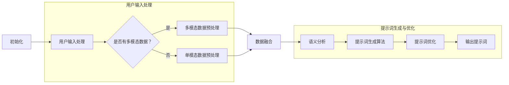

                 

## 第1章：背景与概述

### 1.1 问题背景

随着互联网技术的飞速发展，用户对个性化服务的需求日益增加。在众多应用场景中，对话系统作为一种重要的交互方式，逐渐成为企业和用户沟通的重要桥梁。个性化对话系统能够根据用户的偏好、行为和需求，提供量身定制的服务，从而提升用户体验和满意度。然而，实现对话系统的个性化并非易事，它面临诸多挑战。

首先，用户需求的多样化是当前对话系统面临的主要问题。每个用户都有其独特的背景、兴趣和需求，这使得对话系统的设计需要高度个性化。其次，对话系统的构建涉及自然语言处理、机器学习、用户行为分析等多个领域，技术实现复杂。此外，随着用户数据的不断增加，如何有效地管理和利用这些数据以实现个性化对话，也是一大难题。

在此背景下，提示词工程作为一种关键技术，应运而生。提示词工程旨在通过优化和设计提示词，提高对话系统的个性化和智能水平。具体而言，它通过分析和理解用户的输入信息，生成或调整合适的提示词，从而引导对话系统更好地满足用户需求。

### 1.2 问题描述

当前对话系统的个性化面临以下几个主要问题：

1. **用户需求理解不足**：对话系统往往难以准确理解用户的真实意图和需求，导致对话偏离主题或提供无效的信息。
2. **对话个性化水平不高**：大部分对话系统缺乏针对不同用户群体定制化对话的能力，无法实现真正的个性化服务。
3. **数据利用效率低下**：用户数据的收集和处理相对滞后，未能充分发挥其在个性化对话中的作用。
4. **技术实现复杂**：个性化对话系统的构建涉及多个领域的技术，如自然语言处理、机器学习等，技术实现复杂。

为了解决这些问题，我们需要引入提示词工程，通过优化和设计提示词，提升对话系统的个性化和智能化水平。具体来说，提示词工程需要解决以下关键问题：

1. **如何有效获取用户需求**：通过用户行为分析和数据挖掘技术，准确理解用户的需求和偏好。
2. **如何生成或调整提示词**：设计合适的算法和模型，生成或调整具有个性化特征的提示词。
3. **如何实现提示词的动态更新**：根据用户的实时反馈和对话内容，动态调整提示词，以保持对话的连贯性和有效性。

### 1.3 问题解决

提示词工程通过以下方式解决对话系统个性化面临的挑战：

1. **优化用户需求理解**：利用自然语言处理和机器学习技术，深度分析用户的输入信息，准确理解用户意图和需求。
2. **提升对话个性化水平**：根据用户偏好和行为特征，设计个性化的对话流程和策略，提供量身定制的服务。
3. **提高数据利用效率**：通过数据管理和分析技术，有效利用用户数据，为提示词生成和调整提供有力支持。
4. **简化技术实现**：整合多个领域的技术，提供一套完整且易于实施的解决方案，降低对话系统个性化构建的难度。

总之，提示词工程在对话系统个性化中具有重要作用。通过优化和设计提示词，我们能够显著提升对话系统的个性化和智能化水平，从而更好地满足用户需求，提高用户满意度。

### 1.4 边界与外延

提示词工程的应用范围广泛，涉及多个领域和技术。首先，它广泛应用于客服、智能助手等对话系统，旨在提升用户的交互体验。此外，提示词工程也可应用于教育、医疗、金融等多个行业，通过个性化对话提供专业服务。

与相关技术的关联性方面，提示词工程与自然语言处理（NLP）、机器学习（ML）、用户行为分析等技术密切相关。自然语言处理技术为提示词生成和语义理解提供基础，而机器学习技术则用于优化和调整提示词，提高对话系统的性能。用户行为分析技术则帮助系统更深入地理解用户需求和行为，为个性化对话提供有力支持。

### 1.5 概念结构与核心要素组成

个性化对话系统的核心结构包括用户交互界面、自然语言处理模块、对话管理模块和个性化提示词生成模块。以下是对各关键要素的详细介绍：

1. **用户交互界面**：用户通过交互界面与对话系统进行沟通，输入问题和请求。该界面需要具备友好的用户体验，支持多种输入方式（如文本、语音等）。
2. **自然语言处理模块**：负责对用户的输入信息进行语义分析，理解其意图和需求。这包括分词、词性标注、命名实体识别、语义角色标注等步骤。
3. **对话管理模块**：管理整个对话过程，包括对话流程的控制、上下文维护和对话策略的调整。其目标是提供流畅且自然的对话体验。
4. **个性化提示词生成模块**：根据用户的偏好和行为特征，生成或调整个性化的提示词。这些提示词用于引导对话方向，满足用户的个性化需求。

这些核心要素共同作用，构建了一个完整的个性化对话系统。提示词工程作为其中关键的一环，通过优化和设计提示词，使得对话系统能够更好地理解用户需求，提供个性化的服务。

### 1.6 本章小结

本章首先介绍了问题背景，强调了用户需求多样化和对话系统个性化的重要性。接着，我们详细探讨了当前对话系统个性化面临的挑战，并提出了使用提示词工程作为解决思路。随后，我们分析了提示词工程的基本概念和目标，并探讨了其应用范围和与相关技术的关联性。最后，我们详细介绍了个性化对话系统的核心结构及其组成要素。

通过本章的内容，我们能够理解提示词工程在对话系统个性化中的关键作用，并为后续章节的深入探讨奠定了基础。下一章将深入解析提示词工程的核心理念和基本原理，帮助读者更好地理解这一技术的本质和应用。

### 1.6.1 主要内容总结

本章从问题背景、问题描述、问题解决、边界与外延和概念结构等多个方面详细介绍了提示词工程在对话系统个性化中的应用。我们首先阐述了个性化对话系统的意义和用户需求的多样性，指出了当前对话系统在个性化方面面临的挑战。接着，我们提出了提示词工程作为解决这些挑战的关键技术，并介绍了其核心概念和目标。此外，我们还探讨了提示词工程的应用范围和与相关技术的关联性，最后详细解析了个性化对话系统的核心结构及其组成要素。

### 1.6.2 下一步内容预告

在下一章中，我们将深入探讨提示词工程的核心理念和基本原理，包括提示词的定义、类型和生成方法。我们将通过具体的实例和流程图，详细解释提示词工程的基本工作原理，帮助读者更好地理解这一技术。同时，我们将介绍相关的概念属性特征对比表格和ER实体关系图架构，以便更系统地理解提示词工程在对话系统中的作用和地位。通过这些内容的解析，读者将能够掌握提示词工程的核心概念和基本方法，为后续章节的学习打下坚实的基础。

## 第2章：核心概念解析

### 2.1 提示词工程原理

提示词工程是构建个性化对话系统的关键技术，其核心在于通过优化和设计提示词，提升对话系统的理解和响应能力。首先，我们需要明确提示词的定义和功能。提示词（Prompt）是一种引导对话系统方向和内容的关键信息，通常由对话系统的开发者或算法生成。它可以是简单的关键词、短语，也可以是复杂的句子或段落。

提示词的功能主要包括：

1. **引导对话方向**：通过提示词，对话系统可以了解用户的意图和需求，从而引导对话朝正确的方向进行。
2. **优化对话内容**：提示词有助于系统提供更相关、更贴切的信息，提高对话的质量和效果。
3. **实现个性化服务**：根据用户的特点和需求，生成或调整个性化的提示词，使对话系统能够更好地满足用户的期望。

提示词的类型可以根据其用途和生成方式分为以下几种：

1. **预设提示词**：在对话系统开发初期，开发者根据常见场景预设一系列提示词。这些提示词通常用于引导初次对话或常见问题的解答。
2. **动态提示词**：根据用户的实时输入和系统分析结果，动态生成的提示词。这类提示词能够更好地适应用户的个性化需求，提升对话的个性化水平。
3. **多模态提示词**：结合文本、语音、图像等多种形式生成的提示词。多模态提示词能够提供更丰富的信息，增强用户的交互体验。

提示词的生成方法主要包括以下几种：

1. **基于规则的方法**：通过预定义的规则和模板生成提示词。这种方法简单直观，但灵活性较低，难以应对复杂的用户需求。
2. **基于机器学习的方法**：利用机器学习算法，如决策树、神经网络等，从大量历史数据中学习生成提示词。这种方法具有较好的灵活性和适应性，能够根据用户行为和需求动态调整。
3. **基于数据挖掘的方法**：通过数据挖掘技术，从用户行为数据中发现规律和模式，生成具有个性化的提示词。

在实际应用中，提示词工程的实现通常涉及以下步骤：

1. **用户输入处理**：对话系统首先对用户的输入进行处理，包括分词、语义分析等，以理解用户的意图。
2. **提示词生成**：根据用户的意图和需求，生成或调整合适的提示词。这一步骤可以通过预设规则、机器学习模型或数据挖掘算法实现。
3. **提示词优化**：对生成的提示词进行优化，提高其相关性和效果。这通常需要结合用户的反馈和系统性能评估结果。
4. **实时调整**：根据用户的实时反馈和对话内容，动态调整提示词，确保对话的连贯性和有效性。

通过提示词工程，对话系统能够更好地理解和满足用户需求，提供个性化的服务。接下来，我们将通过概念属性特征对比表格和ER实体关系图架构，进一步解析提示词工程的基本原理和实现方法。

### 2.2 概念属性特征对比表格

在深入理解提示词工程之前，我们需要明确几个相关概念，包括提示词、关键词和标签。以下是一个概念属性特征对比表格，以帮助我们清晰地区分这些概念：

| 概念       | 定义                                                         | 属性特征                                                         | 关联性                                                       |
|------------|--------------------------------------------------------------|----------------------------------------------------------------|--------------------------------------------------------------|
| 提示词     | 引导对话系统方向和内容的关键信息                             | - 动态生成：根据用户输入和需求实时调整<br>- 个性化：满足用户特定需求<br>- 多模态：文本、语音、图像等 | - 与用户输入紧密关联<br>- 决定对话流程和内容             |
| 关键词     | 描述文本核心内容的词或短语                                   | - 描述性：反映文本主要内容<br>- 稳定性：在不同上下文中含义不变 | - 辅助理解文本语义<br>- 常用于索引和搜索                 |
| 标签       | 用于分类和标注的标识符                                       | - 分类性：用于对内容进行分类<br>- 一致性：同一类内容的统一标识 | - 组织和管理数据<br>- 辅助内容管理和推荐                 |

通过这个表格，我们可以看到，提示词、关键词和标签虽然在某些方面有重叠，但它们的用途和属性特征有所不同。提示词主要用于引导对话流程和满足用户需求，关键词用于描述文本的语义，而标签则用于分类和标注。在实际应用中，这些概念相互关联，共同构成对话系统的核心功能。

### 2.3 ER实体关系图架构

为了更好地理解提示词工程在对话系统中的作用，我们可以借助ER（Entity-Relationship，实体关系）图来描述对话系统的关键实体及其关系。以下是一个简化的ER图，展示了与提示词相关的关键实体和它们之间的关系：

```mermaid
erDiagram
  User ||--|{ Dialogue }||>
  Dialogue ||--|{ Prompt }||>
  Prompt ||--|{ Response }||>
  Response ||--|{ Feedback }||>
  User }|--|{ BehaviorData }||>
  BehaviorData ||--|{ UserPreference }||>
  UserPreference }|--|{ DialogueStrategy }||>
  DialogueStrategy }|--|{ PromptGenerationAlgorithm }||>

class User {
  - id (用户ID)
  - name (用户名)
  - email (电子邮件)
  - behaviorData (用户行为数据)
}

class Dialogue {
  - id (对话ID)
  - timestamp (对话时间)
  - participants (参与者)
  - prompt (初始提示词)
  - responses (响应列表)
}

class Prompt {
  - id (提示词ID)
  - content (提示词内容)
  - type (提示词类型)
  - context (上下文信息)
}

class Response {
  - id (响应ID)
  - content (响应内容)
  - type (响应类型)
  - timestamp (响应时间)
}

class BehaviorData {
  - id (行为数据ID)
  - interactions (用户交互记录)
  - preferences (用户偏好)
}

class UserPreference {
  - id (偏好ID)
  - preference (偏好内容)
  - type (偏好类型)
}

class DialogueStrategy {
  - id (对话策略ID)
  - strategy (策略内容)
}

class PromptGenerationAlgorithm {
  - id (算法ID)
  - algorithm (算法内容)
}
```

这个ER图描述了以下关键实体和关系：

1. **User（用户）**：代表对话系统的用户，包含用户的个人信息和行为数据。
2. **Dialogue（对话）**：表示用户与对话系统之间的交互过程，包括对话的时间、参与者和初始提示词。
3. **Prompt（提示词）**：引导对话方向的文本信息，与对话和响应相关联。
4. **Response（响应）**：对话系统对用户输入的反馈，包括响应的内容、类型和时间。
5. **BehaviorData（行为数据）**：记录用户的行为数据，包括用户的交互记录和偏好信息。
6. **UserPreference（用户偏好）**：描述用户的个性化偏好，用于生成或调整提示词。
7. **DialogueStrategy（对话策略）**：定义对话的策略，影响提示词的生成和调整。
8. **PromptGenerationAlgorithm（提示词生成算法）**：实现提示词生成的方法和规则。

通过这个ER图，我们可以清晰地看到提示词工程在对话系统中的作用，以及各个实体之间的关系如何共同构建一个完整的对话过程。这为后续的算法设计和系统实现提供了理论基础。

### 2.4 提示词生成算法

提示词生成算法是提示词工程的核心组成部分，其目的是根据用户的需求和上下文信息，生成或调整合适的提示词。以下我们将介绍几种常见的提示词生成算法，并分析它们的优缺点。

#### 2.4.1 基于规则的方法

基于规则的方法通过预定义的规则和模板生成提示词。这种方法通常由对话系统开发者根据常见的对话场景编写规则，然后根据用户输入匹配相应的规则，生成提示词。

**优点：**
- 简单直观，易于实现和调试。
- 对于规则明确且场景固定的问题，效果较好。

**缺点：**
- 灵活性差，难以适应复杂和变化的用户需求。
- 需要大量的规则编写和维护，随着对话场景的复杂化，规则数量呈指数级增长。

**适用场景：**
- 对话场景相对简单、规则明确的应用，如客服系统。

#### 2.4.2 基于机器学习的方法

基于机器学习的方法利用训练数据集，通过机器学习算法（如决策树、支持向量机、神经网络等）学习生成提示词。这种方法能够根据用户的历史交互数据，自动调整和优化提示词。

**优点：**
- 灵活性高，能够适应复杂多变的用户需求。
- 能够通过不断学习和调整，提高提示词的生成质量。

**缺点：**
- 需要大量的训练数据和计算资源。
- 模型的性能依赖于训练数据的多样性和质量。

**适用场景：**
- 对话场景复杂多变，需要根据用户行为动态调整提示词的应用，如智能助手。

#### 2.4.3 基于数据挖掘的方法

基于数据挖掘的方法通过数据挖掘技术，从用户行为数据中发现潜在的模式和规律，生成个性化的提示词。这种方法通常结合机器学习算法，以实现更高效和精确的提示词生成。

**优点：**
- 能够从大规模用户行为数据中提取有价值的信息。
- 具有较强的个性化和适应性。

**缺点：**
- 数据处理和分析过程复杂，需要较长的时间和计算资源。
- 需要专业数据挖掘技能和工具。

**适用场景：**
- 需要高度个性化对话系统的应用，如个性化推荐系统。

#### 2.4.4 多模态方法

多模态方法结合文本、语音、图像等多种形式的信息，生成更具丰富性和多样性的提示词。这种方法能够提供更全面的用户交互体验。

**优点：**
- 能够提供更丰富的信息，增强用户的交互体验。
- 能够处理多种类型的数据，提高提示词的生成质量。

**缺点：**
- 需要处理多模态数据，算法实现复杂。
- 对计算资源和硬件设备要求较高。

**适用场景：**
- 需要高度交互和个性化对话系统的应用，如虚拟助手。

综上所述，不同的提示词生成算法各有优缺点，适用于不同的应用场景。在实际应用中，可以根据具体需求和场景选择合适的方法，或结合多种方法，以实现最佳的效果。

#### 2.4.5 提示词生成流程图

为了更直观地理解提示词生成过程，我们可以使用Mermaid语言绘制一个流程图。以下是一个简化的提示词生成流程图：



在这个流程图中，用户输入首先经过预处理，包括单模态和多模态数据的处理。随后，对处理后的数据进行语义分析，以理解用户的意图和需求。接着，通过提示词生成算法生成初步的提示词，并对其进行优化，最终输出个性化的提示词。

通过这个流程图，我们可以清晰地看到提示词生成的每个步骤及其相互关系，有助于更好地理解和实现提示词工程。

#### 2.4.6 用户输入处理与提示词生成示例

为了更好地理解提示词生成过程，以下是一个具体的用户输入处理与提示词生成的示例。

**用户输入：** “我想要预订一张明天的电影票。”

**步骤1：用户输入处理**
- 分词：我/想要/预订/一张/明天/的电影/票。
- 语义分析：用户的意图是预订电影票，时间范围为明天。

**步骤2：多模态数据预处理（如有语音输入，还需进行语音识别）**
- 语音识别：输入语音转化为文本。

**步骤3：数据融合**
- 将文本数据和语音识别结果进行融合，以获得更全面的用户输入信息。

**步骤4：语义分析**
- 确定用户的意图：预订电影票。
- 确定时间范围：明天。

**步骤5：提示词生成算法**
- 使用机器学习算法，根据历史数据和当前用户的输入，生成提示词：“您想观看哪部电影？明天有哪些场次可选？”

**步骤6：提示词优化**
- 根据用户偏好和历史交互数据，进一步优化提示词，如：“根据您的喜好，我们为您推荐了几部电影。明天有哪些场次适合您呢？”

**步骤7：输出提示词**
- 输出优化后的提示词：“根据您的喜好，我们为您推荐了几部电影。明天有哪些场次适合您呢？”

通过这个示例，我们可以看到，提示词生成过程涉及多个步骤，包括用户输入处理、多模态数据预处理、语义分析、提示词生成和优化。每个步骤都对最终生成的提示词有重要影响，确保了提示词的准确性和个性化。

### 2.5 本章小结

本章详细介绍了提示词工程的核心概念和基本原理。首先，我们定义了提示词及其功能，并介绍了不同类型的提示词和生成方法。随后，通过概念属性特征对比表格和ER实体关系图架构，进一步解析了提示词工程的概念结构和应用场景。接着，我们介绍了几种常见的提示词生成算法，并通过流程图和具体示例，展示了提示词生成的全过程。

通过本章的学习，读者能够全面理解提示词工程的基本原理和实现方法，为后续章节深入探讨个性化对话系统的设计和实现奠定基础。下一章将探讨个性化对话系统的设计方法，包括用户个人化特征收集和提示词工程应用策略，帮助读者构建高效的个性化对话系统。

### 2.5.1 主要内容总结

本章主要介绍了提示词工程的核心概念和基本原理。我们从提示词的定义和功能入手，详细讲解了不同类型的提示词和生成方法，包括基于规则、基于机器学习和基于数据挖掘的方法。此外，通过概念属性特征对比表格和ER实体关系图架构，我们系统地分析了提示词工程在对话系统中的应用结构和关系。接下来，我们介绍了多种提示词生成算法，并通过具体的示例展示了从用户输入处理到提示词生成的全过程。本章内容帮助读者全面理解提示词工程的核心理念和技术实现，为后续的个性化对话系统设计和实现提供了坚实的基础。

### 2.5.2 下一步内容预告

在下一章中，我们将探讨个性化对话系统的设计方法，重点介绍用户个人化特征收集和提示词工程应用策略。我们将详细讨论如何通过用户行为分析和技术手段收集用户的个人化特征，并探讨这些特征如何影响提示词的生成和调整。同时，我们将介绍具体的实现方法和技术工具，帮助读者设计出高效且具有高度个性化的对话系统。通过本章内容，读者将能够全面了解个性化对话系统的设计原则和实践方法，为实际应用提供有力支持。

