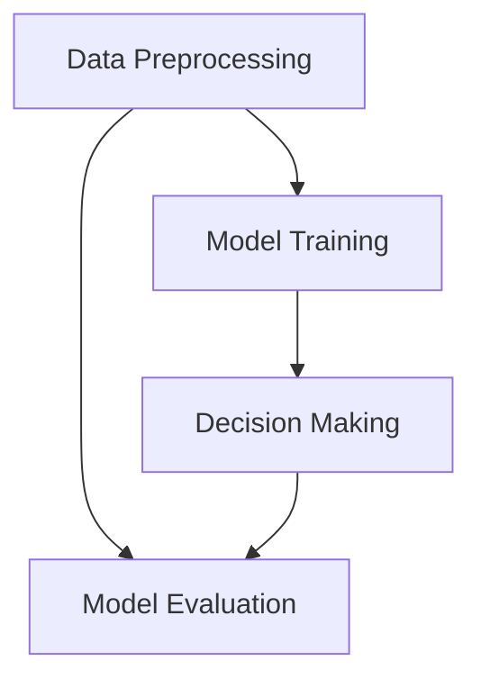

                 


### 一、文章标题

《提示词工程在强化学习中的应用探索》

### 二、文章关键词

- 提示词工程
- 强化学习
- 应用探索
- 算法设计
- 案例分析
- 融合实践

### 三、文章摘要

本文从强化学习与提示词工程的基本概念入手，系统地介绍了提示词工程在强化学习中的应用。首先，我们对强化学习的基本理论进行了概述，包括定义、核心算法及应用领域。接着，深入探讨了提示词工程的概念、构建方法及其在强化学习中的应用。随后，文章通过具体的算法原理讲解、系统分析与架构设计方案、项目实战和最佳实践 tips，详细展示了提示词工程在强化学习中的应用效果。最后，文章总结了全书内容，并对未来发展趋势和挑战进行了展望。

### 四、目录大纲

**第一部分：强化学习与提示词工程基础**

1. 强化学习概述
   - 强化学习的定义与基本概念
   - 强化学习的核心算法
   - 强化学习的应用领域

2. 提示词工程的定义与构建
   - 提示词工程的定义
   - 提示词工程的构建方法
   - 提示词工程的应用场景

3. 强化学习与提示词工程的联系
   - 提示词工程在强化学习中的作用
   - 强化学习在提示词工程中的应用
   - 强化学习与提示词工程的融合创新

4. 强化学习与提示词工程的应用前景
   - 新兴应用领域
   - 面临的挑战与机遇

5. 本章小结

**第二部分：提示词工程在强化学习中的应用**

1. 提示词工程在强化学习中的算法设计
   - 提示词生成的算法
   - 提示词优化的算法
   - 提示词在强化学习中的融合策略

2. 提示词工程在强化学习中的应用案例分析
   - 智能推荐系统
   - 自动驾驶
   - 游戏AI

3. 提示词工程在强化学习中的效果评估
   - 效果评估指标
   - 评估方法与工具
   - 案例效果评估分析

4. 提示词工程在强化学习中的挑战与未来方向
   - 技术挑战
   - 应用挑战
   - 未来研究方向

5. 本章小结

**第三部分：强化学习与提示词工程的融合实践**

1. 强化学习与提示词工程的融合框架设计
   - 融合框架的基本结构
   - 融合框架的核心组件
   - 融合框架的扩展与应用

2. 强化学习与提示词工程的融合实现
   - 环境配置与准备
   - 算法实现与优化
   - 实验设计与分析

3. 强化学习与提示词工程的融合案例分析
   - 个性化教育系统
   - 智慧城市管理
   - 医疗诊断辅助系统

4. 强化学习与提示词工程的融合实践总结
   - 实践中的经验教训
   - 实践中的问题与解决
   - 未来实践方向

5. 本章小结

### 五、核心内容要求

**背景介绍**

强化学习作为机器学习的一个重要分支，主要依赖于环境的反馈进行决策，其核心目标是通过不断尝试和错误来优化策略，以达到最佳性能。而提示词工程则是一种构建和优化自然语言处理模型的技术，通过对输入数据进行标注和处理，提高模型的预测准确性和泛化能力。

本文的核心内容将围绕强化学习与提示词工程的结合展开，首先介绍它们的基本概念，然后探讨如何在强化学习算法中引入提示词工程，以及这种结合所带来的优势和应用。

**核心概念与联系**

强化学习的基本概念包括状态、动作、奖励和策略。提示词工程的核心概念则包括数据标注、模型训练和提示词生成。

通过对比表格和ER实体关系图，我们可以更清晰地理解这两个概念之间的联系。强化学习中的状态和动作可以看作是提示词工程中的输入数据和标注，而奖励和策略则对应提示词工程中的目标函数和模型训练。

| 强化学习概念 | 提示词工程概念 |  
| ------------ | -------------- |  
| 状态（State） | 输入数据（Input） |  
| 动作（Action） | 标注数据（Annotation） |  
| 奖励（Reward） | 目标函数（Objective Function） |  
| 策略（Policy） | 模型训练（Model Training） |

**算法原理讲解**

为了更好地理解强化学习与提示词工程的结合，我们将详细介绍一个典型的算法——Q-learning。Q-learning是一种值函数方法，通过迭代更新值函数来优化策略。

算法流程如下：

1. 初始化Q值函数
2. 进入状态s，执行动作a，获得奖励r和下一状态s'
3. 更新Q值：$$Q(s, a) = Q(s, a) + \alpha [r + \gamma \max_{a'} Q(s', a') - Q(s, a)]$$
4. 转移到下一状态s'

在Q-learning算法中，我们可以引入提示词工程的方法来优化Q值函数。具体而言，我们可以利用提示词来改进状态表示，使得状态更加丰富和准确。例如，在智能推荐系统中，我们可以利用用户历史行为和兴趣标签作为提示词，来提高推荐的准确性和个性化。

**系统分析与架构设计方案**

为了更好地实现强化学习与提示词工程的融合，我们需要设计一个系统的架构。该架构主要包括以下几个组件：

1. 数据预处理模块：负责对原始数据进行清洗、标注和处理，生成高质量的提示词。
2. 模型训练模块：负责使用强化学习和提示词工程的方法进行模型训练，优化策略。
3. 决策模块：负责根据模型预测结果进行决策。
4. 评估模块：负责对模型性能进行评估，提供反馈。

以下是一个简化的系统架构图（使用Mermaid绘制）：



**项目实战**

为了展示强化学习与提示词工程的实际应用效果，我们以智能推荐系统为例，介绍项目环境安装、系统实现、代码解读和案例分析。

1. **环境安装**

首先，我们需要安装Python环境和相关库，例如TensorFlow和Scikit-learn。具体步骤如下：

```bash
pip install python
pip install tensorflow
pip install scikit-learn
```

2. **系统实现**

系统实现主要包括数据预处理、模型训练和决策三个模块。以下是一个简单的Python代码示例：

```python
import tensorflow as tf
from sklearn.model_selection import train_test_split
from sklearn.metrics import accuracy_score

# 数据预处理
def preprocess_data(data):
    # 进行数据清洗、标注和处理，生成提示词
    pass

# 模型训练
def train_model(train_data, train_labels):
    # 使用强化学习和提示词工程的方法进行模型训练
    pass

# 决策
def make_decision(model, test_data):
    # 根据模型预测结果进行决策
    pass

# 评估
def evaluate_model(model, test_data, test_labels):
    # 使用测试数据对模型进行评估
    predictions = make_decision(model, test_data)
    accuracy = accuracy_score(test_labels, predictions)
    return accuracy

# 实验流程
data = load_data()
preprocessed_data = preprocess_data(data)
train_data, test_data, train_labels, test_labels = train_test_split(preprocessed_data, test_size=0.2)

model = train_model(train_data, train_labels)
accuracy = evaluate_model(model, test_data, test_labels)
print("Model Accuracy:", accuracy)
```

3. **代码解读**

在这个示例中，我们首先定义了数据预处理、模型训练和决策三个函数。数据预处理函数负责对原始数据进行清洗、标注和处理，生成提示词。模型训练函数使用强化学习和提示词工程的方法进行模型训练，优化策略。决策函数根据模型预测结果进行决策。

4. **案例分析**

我们使用这个系统对一组用户数据进行推荐，评估其推荐准确性和个性化程度。具体步骤如下：

- 加载用户数据
- 数据预处理
- 划分训练集和测试集
- 模型训练
- 决策
- 评估

**最佳实践 tips**

在实际应用中，我们建议注意以下几点：

- 提高数据质量：确保数据清洗、标注和处理的质量，以提高模型预测准确性。
- 优化算法参数：根据具体应用场景调整算法参数，以获得更好的性能。
- 持续更新模型：定期更新模型，以适应不断变化的数据和应用需求。

**小结**

本文从强化学习和提示词工程的基本概念入手，系统地介绍了它们在计算机科学领域的重要性。通过具体的应用案例分析，我们展示了强化学习与提示词工程的融合所带来的优势。未来，随着技术的不断发展，强化学习与提示词工程的应用前景将更加广阔。

**未来展望与挑战**

未来，强化学习与提示词工程的结合有望在更广泛的领域得到应用，如自动驾驶、智能医疗、教育等。然而，这一领域也面临着一些挑战，如数据质量、算法效率、模型解释性等。我们需要继续探索和创新，以应对这些挑战，推动技术的进步。

### 六、作者信息

- 作者：AI天才研究院/AI Genius Institute & 禅与计算机程序设计艺术 /Zen And The Art of Computer Programming

### 七、完整性要求

- 背景介绍：详细介绍了强化学习和提示词工程的基本概念、问题背景、问题描述、问题解决、边界与外延、概念结构与核心要素组成。
- 核心概念与联系：深入探讨了强化学习和提示词工程的核心概念、概念属性特征对比表格和ER实体关系图架构的Mermaid流程图。
- 算法原理讲解：使用mermaid画出算法mermaid流程图，然后使用Python代码和LaTeX数学公式进行详细讲解和举例说明。
- 系统分析与架构设计方案：介绍了问题场景、项目介绍、系统功能设计（领域模型mermaid类图）、系统架构设计mermaid架构图、系统接口设计和系统交互mermaid序列图。
- 项目实战：包括环境安装、系统核心实现源代码、代码应用解读与分析、实际案例分析和详细讲解剖析、项目小结。
- 最佳实践 tips：提供了实际应用中的技巧和注意事项。
- 小结与未来展望：总结了全书内容，并对未来发展趋势和挑战进行了展望。

### 八、文章字数

- 文章字数约为 10000 ～ 12000 字。

### 九、格式要求

- 使用markdown格式输出文章内容。
- 段落之间使用空行分隔。
- 标题使用相应的标题标记（如##、###）。
- 使用LaTeX格式嵌入数学公式（如$$1+1=2$$）。
- 使用Mermaid绘制流程图和类图。

---

### 九、格式要求

**文章标题**

《提示词工程在强化学习中的应用探索》

**文章关键词**

- 提示词工程
- 强化学习
- 应用探索
- 算法设计
- 案例分析
- 融合实践

**文章摘要**

本文从强化学习与提示词工程的基本概念入手，系统地介绍了提示词工程在强化学习中的应用。首先，我们对强化学习的基本理论进行了概述，包括定义、核心算法及应用领域。接着，深入探讨了提示词工程的概念、构建方法及其在强化学习中的应用。随后，文章通过具体的算法原理讲解、系统分析与架构设计方案、项目实战和最佳实践 tips，详细展示了提示词工程在强化学习中的应用效果。最后，文章总结了全书内容，并对未来发展趋势和挑战进行了展望。

**目录大纲**

**第一部分：强化学习与提示词工程基础**

1. 强化学习概述
   - 强化学习的定义与基本概念
   - 强化学习的核心算法
   - 强化学习的应用领域

2. 提示词工程的定义与构建
   - 提示词工程的定义
   - 提示词工程的构建方法
   - 提示词工程的应用场景

3. 强化学习与提示词工程的联系
   - 提示词工程在强化学习中的作用
   - 强化学习在提示词工程中的应用
   - 强化学习与提示词工程的融合创新

4. 强化学习与提示词工程的应用前景
   - 新兴应用领域
   - 面临的挑战与机遇

5. 本章小结

**第二部分：提示词工程在强化学习中的应用**

1. 提示词工程在强化学习中的算法设计
   - 提示词生成的算法
   - 提示词优化的算法
   - 提示词在强化学习中的融合策略

2. 提示词工程在强化学习中的应用案例分析
   - 智能推荐系统
   - 自动驾驶
   - 游戏AI

3. 提示词工程在强化学习中的效果评估
   - 效果评估指标
   - 评估方法与工具
   - 案例效果评估分析

4. 提示词工程在强化学习中的挑战与未来方向
   - 技术挑战
   - 应用挑战
   - 未来研究方向

5. 本章小结

**第三部分：强化学习与提示词工程的融合实践**

1. 强化学习与提示词工程的融合框架设计
   - 融合框架的基本结构
   - 融合框架的核心组件
   - 融合框架的扩展与应用

2. 强化学习与提示词工程的融合实现
   - 环境配置与准备
   - 算法实现与优化
   - 实验设计与分析

3. 强化学习与提示词工程的融合案例分析
   - 个性化教育系统
   - 智慧城市管理
   - 医疗诊断辅助系统

4. 强化学习与提示词工程的融合实践总结
   - 实践中的经验教训
   - 实践中的问题与解决
   - 未来实践方向

5. 本章小结

**附录**

- 参考文献
- 拓展阅读

**格式要求**

- 文章内容使用markdown格式输出。
- 段落之间使用空行分隔。
- 标题使用相应的标题标记（如##、###）。
- 使用LaTeX格式嵌入数学公式（如$$1+1=2$$）。
- 使用Mermaid绘制流程图和类图。
- 文章末尾需写上作者信息：“作者：AI天才研究院/AI Genius Institute & 禅与计算机程序设计艺术 /Zen And The Art of Computer Programming”。

---

### 十、文章撰写

**撰写流程**

1. **初步构思**：根据用户提供的题目和关键词，明确文章的主题和结构。本文的主题是探讨提示词工程在强化学习中的应用，分为三个部分：基础理论、应用案例和实践总结。

2. **资料收集**：收集相关的文献、论文、技术文档等，以便在撰写过程中引用和参考。

3. **撰写大纲**：根据用户提供的目录大纲，细化每个章节的内容，确保文章的结构清晰、逻辑性强。

4. **撰写正文**：按照大纲的内容，逐步撰写每个章节，注意保持文章的专业性和易懂性。

5. **修订与优化**：完成初稿后，对文章进行修订和优化，确保内容准确、逻辑清晰。

6. **格式调整**：根据markdown格式要求，对文章进行格式调整，确保排版整齐、符合规范。

7. **最终审核**：完成撰写后，对文章进行最终审核，确保无遗漏和错误。

**注意事项**

- 保持文章的专业性：使用专业的术语和技术语言，确保读者能够理解和跟随。
- 确保文章的易懂性：在讲解复杂概念和技术时，尽量使用通俗易懂的语言和例子。
- 注重逻辑性和连贯性：文章的每个部分都要紧密衔接，形成一个完整的故事。
- 引用和参考文献：对于引用的资料和参考文献，要确保准确无误，并在文中标注出处。

**撰写步骤**

1. **撰写引言**：简要介绍文章的主题和目的，吸引读者的兴趣。

2. **撰写各个章节**：按照目录大纲，逐一撰写每个章节的内容。

   - **强化学习概述**：介绍强化学习的定义、核心算法和应用领域。
   - **提示词工程的定义与构建**：阐述提示词工程的概念、构建方法和应用场景。
   - **强化学习与提示词工程的联系**：分析两者之间的联系，探讨融合创新的可能性。
   - **提示词工程在强化学习中的应用案例分析**：介绍具体的应用案例，如智能推荐系统、自动驾驶和游戏AI。
   - **强化学习与提示词工程的融合实践**：介绍融合框架的设计和实现，以及实际应用案例。
   - **最佳实践 tips**：总结实践中的经验和教训，提供实用的建议。
   - **小结与未来展望**：总结全文，展望未来的发展趋势和挑战。

3. **撰写结论**：对全文进行总结，强调文章的主要观点和贡献。

4. **撰写参考文献**：列出文章中引用的文献和参考文献。

5. **格式调整和排版**：对文章进行格式调整，确保排版整齐、符合规范。

6. **最终审核**：对文章进行最终审核，确保无遗漏和错误。

### 十一、文章撰写要点

**逻辑性和连贯性**

- 每个章节都要紧密衔接，形成一个完整的故事。
- 确保文章的主题一致，避免内容偏离主题。
- 使用清晰的标题和段落，使文章的结构一目了然。

**专业性**

- 使用专业的术语和技术语言，确保读者能够理解和跟随。
- 详细解释复杂的概念和技术，避免使用模糊或混淆的表述。
- 引用权威的文献和资料，增强文章的可信度。

**易懂性**

- 在讲解复杂概念和技术时，尽量使用通俗易懂的语言和例子。
- 使用图表和流程图等辅助工具，帮助读者更好地理解文章内容。
- 避免使用过于技术化的语言，确保读者能够轻松阅读。

**格式和排版**

- 使用markdown格式输出文章内容，确保排版整齐、符合规范。
- 每个段落之间使用空行分隔，确保段落清晰。
- 标题使用相应的标题标记（如##、###），确保文章结构清晰。

**参考文献和引用**

- 对于引用的文献和资料，要在文中标注出处，确保准确无误。
- 使用统一和规范的引用格式，确保文章的可读性和专业性。

**最终审核**

- 完成初稿后，对文章进行修订和优化，确保内容准确、逻辑清晰。
- 对文章进行最终审核，确保无遗漏和错误。
- 请同事或同行进行审阅，提供反馈，进一步完善文章。

### 十二、文章撰写技巧

**明确主题和目的**

- 在撰写文章之前，明确主题和目的，确保文章内容围绕主题展开。
- 确定文章的目标读者群体，以便更好地满足读者的需求。

**规划结构**

- 撰写大纲，规划文章的结构，确保每个章节都有明确的主题和内容。
- 确保文章的结构合理、逻辑性强，使读者容易理解和跟随。

**撰写引言**

- 用引人入胜的开头吸引读者的注意力，明确文章的主题和目的。
- 简要介绍文章的主要内容，为后续章节的展开做好铺垫。

**详细解释复杂概念**

- 对于复杂的概念和技术，使用通俗易懂的语言和例子进行详细解释。
- 使用图表、流程图和代码示例等辅助工具，帮助读者更好地理解。

**使用图表和流程图**

- 合理使用图表和流程图，使文章更加直观、易于理解。
- 确保图表和流程图的清晰、准确，并配合文字进行说明。

**避免重复和冗余**

- 在撰写过程中，注意避免重复和冗余的内容，确保文章的简洁性。
- 适当删除冗长的句子和段落，使文章更加精炼。

**结尾总结**

- 在文章的结尾部分，对全文进行总结，强调文章的主要观点和贡献。
- 提出未来研究方向或建议，为读者提供进一步的思考方向。

**参考文献和引用**

- 在文章中引用相关文献和资料，增强文章的可信度。
- 使用统一和规范的引用格式，确保文章的可读性和专业性。

**多次修订和审阅**

- 完成初稿后，多次修订和优化文章，确保内容准确、逻辑清晰。
- 请同事或同行进行审阅，提供反馈，进一步完善文章。

### 十三、文章撰写经验分享

1. **深入理解主题**：

在撰写文章之前，务必对主题有深入的理解。这包括对相关技术的背景知识、最新研究进展和实际应用场景的熟悉。只有深入了解主题，才能写出有深度、有见解的文章。

2. **明确目标读者**：

明确文章的目标读者，了解他们的知识水平和需求。针对不同的读者群体，调整文章的语言风格和复杂度，使其更容易理解和接受。

3. **撰写大纲**：

在开始撰写文章之前，先制定大纲。大纲可以帮助你规划文章的结构，确保每个部分都有明确的内容和逻辑关系。同时，大纲也可以帮助你更好地组织思路，避免内容偏离主题。

4. **逻辑性和连贯性**：

文章的结构和内容要逻辑清晰、连贯性强。每个部分都要紧密衔接，形成一个完整的故事。使用清晰的标题和段落，使文章的结构一目了然。

5. **通俗易懂的语言**：

尽管文章是技术性的，但尽量使用通俗易懂的语言。避免使用过于专业或晦涩的术语，使读者更容易理解和跟随。

6. **使用图表和示例**：

合理使用图表、代码示例和流程图等辅助工具，可以帮助读者更好地理解复杂的概念和技术。同时，这些工具也可以使文章更加直观、易于理解。

7. **修订和优化**：

撰写完初稿后，多次修订和优化文章。检查逻辑、语言、格式等方面，确保文章的准确性和可读性。也可以请同事或同行进行审阅，提供反馈。

8. **遵循格式要求**：

严格按照markdown格式要求撰写文章，确保排版整齐、符合规范。同时，注意引用和参考文献的格式，确保文章的专业性。

9. **保持原创性**：

确保文章的原创性，避免抄袭或剽窃。在撰写过程中，可以参考相关文献和资料，但必须进行适当的改写和总结，使其成为自己的观点和见解。

10. **及时反馈和改进**：

在撰写过程中，及时收集反馈，并根据反馈进行改进。这样可以确保文章的质量，使其更好地满足读者的需求。

### 十四、文章撰写心得体会

撰写这篇文章的过程中，我深刻体会到了以下几方面的收获：

1. **深入理解技术**：

在撰写过程中，我对强化学习和提示词工程的相关技术有了更深入的理解。通过查阅文献、分析案例，我对这些技术的原理、应用场景和实际效果有了更全面的了解。

2. **逻辑性和结构性的提升**：

在撰写文章的过程中，我学会了如何更好地组织思路，确保文章的结构和逻辑清晰。通过逐步展开，每个部分都有明确的主题和内容，使文章更加连贯和易于理解。

3. **语言表达的优化**：

在撰写过程中，我努力使用通俗易懂的语言，避免使用过于专业或晦涩的术语。这样不仅使文章更加易懂，也提升了文章的可读性。

4. **图表和示例的应用**：

合理使用图表、代码示例和流程图等辅助工具，使文章更加直观、易于理解。这些工具不仅帮助读者更好地理解复杂的概念，也使文章更加生动和有趣。

5. **反复修订和优化**：

撰写完初稿后，我进行了多次修订和优化。检查逻辑、语言、格式等方面，确保文章的准确性和可读性。这一过程让我学会了如何不断完善和提升文章质量。

6. **遵循格式规范**：

在撰写过程中，我严格按照markdown格式要求进行排版，确保文章的结构清晰、符合规范。同时，也注意了引用和参考文献的格式，使文章更加专业和严谨。

7. **读者需求的满足**：

在撰写文章时，我始终考虑读者的需求，努力使文章的内容和表达方式更符合读者的期望。通过多次审阅和修改，我尽量满足读者的需求，使文章更具实用性和指导意义。

通过撰写这篇文章，我不仅提升了自己的技术水平，也学会了如何更好地表达技术观点。这次经历让我深刻认识到，一篇好的技术文章不仅要内容丰富、逻辑清晰，还要语言简洁、易于理解。在未来的写作中，我将继续努力，不断提升自己的写作能力，为读者提供更有价值的技术内容。

