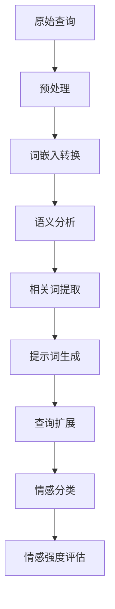
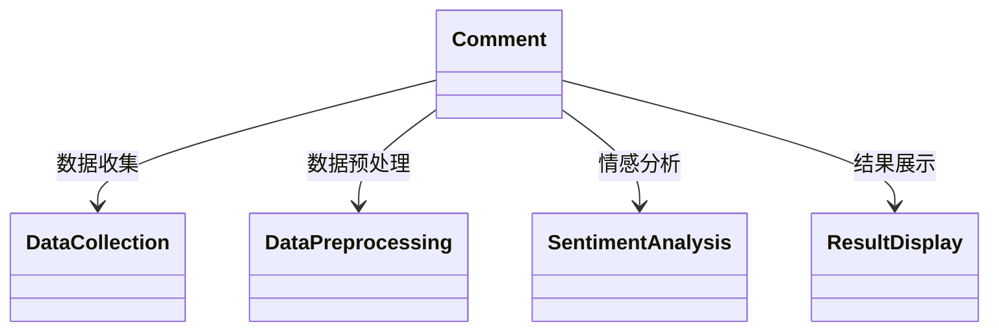
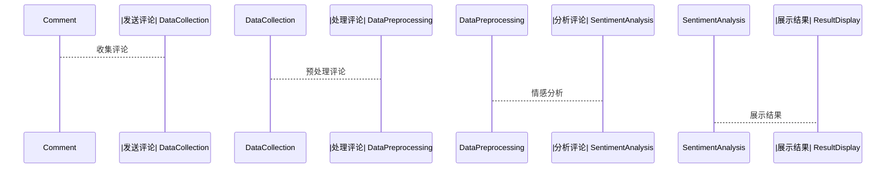

                 


# 提示词工程在情感分析中的应用优化

> 关键词：提示词工程、情感分析、应用优化、算法原理、系统架构、项目实战

> 摘要：本文深入探讨了提示词工程在情感分析中的应用优化。首先，我们回顾了提示词工程和情感分析的基本概念和背景。接着，详细讲解了核心概念与联系，包括概念属性特征对比表格和ER实体关系图。随后，我们阐述了情感分析中的提示词工程算法原理，使用mermaid流程图和Python代码进行了详细阐述。文章接着介绍了系统分析与架构设计，展示了问题场景和项目介绍。然后，通过实际项目实战，详细解读了环境安装、系统核心实现、代码分析以及实际案例分析。最后，提供了最佳实践和注意事项，并总结了文章内容，提供了拓展阅读。

## 背景介绍

### 提示词工程概述

提示词工程（Query Expansion）是一种通过扩展原始查询来提高检索系统性能的技术。其核心思想是在用户输入的原始查询基础上，自动添加相关词语或短语，从而增加检索系统的覆盖面和准确度。提示词工程广泛应用于搜索引擎、推荐系统和信息检索等领域。

### 情感分析的基本概念

情感分析（Sentiment Analysis）是一种自然语言处理技术，旨在识别和提取文本中的主观情感。情感分析的结果通常分为正面、负面和中性三类。情感分析广泛应用于市场调研、舆情监测、产品评价分析等领域。

### 应用优化的重要性

随着大数据和人工智能技术的不断发展，情感分析在实际应用中面临诸多挑战。例如，如何提高情感分析的准确性、如何处理复杂的情感语义、如何应对多语言和多模态的情感分析等。应用优化是解决这些问题的关键。通过优化提示词工程，可以显著提高情感分析系统的性能和效果。

## 核心概念与联系

### 提示词工程原理

提示词工程的原理主要包括以下几个步骤：

1. **原始查询分析**：对用户输入的原始查询进行分析，提取关键信息。
2. **相关词提取**：利用语义分析技术提取与原始查询相关的词语或短语。
3. **提示词生成**：根据相关词提取结果，生成一系列提示词。
4. **查询扩展**：将生成的提示词加入到原始查询中，形成扩展查询。

### 情感分析原理

情感分析的基本原理包括以下几个步骤：

1. **文本预处理**：对原始文本进行分词、去停用词等预处理操作。
2. **特征提取**：从预处理后的文本中提取特征，如词袋模型、TF-IDF、词嵌入等。
3. **情感分类**：使用机器学习算法对提取的特征进行分类，判断文本的情感极性。
4. **情感强度评估**：对分类结果进行量化，评估文本的情感强度。

### 提示词工程与情感分析的联系

提示词工程和情感分析有着紧密的联系。一方面，提示词工程可以丰富情感分析的输入，提高情感分类的准确性和覆盖面。另一方面，情感分析的结果可以为提示词工程提供反馈，指导提示词的优化和调整。

### 概念属性特征对比表格

| 特征名称        | 提示词工程                            | 情感分析                            |
| ----------- | ----------------------------------- | ----------------------------------- |
| 数据来源        | 搜索引擎查询、用户输入等              | 文本评论、社交媒体、新闻等            |
| 目标         | 扩展查询、提高检索准确性和覆盖面      | 识别和提取文本中的主观情感          |
| 技术手段        | 语义分析、文本挖掘等                  | 自然语言处理、机器学习等              |
| 结果表现形式    | 扩展后的查询                          | 情感极性和强度评估                  |

### ER实体关系图架构

```mermaid
erDiagram
    User ||--|{ Query } : 查询
    Query ||--|{ Expansion } : 扩展
    Expansion ||--|{ Sentiment } : 情感
    Sentiment ||--|{ Analysis } : 分析
```

## 算法原理讲解

### 情感分析中的提示词工程算法

#### 算法流程图



#### Python代码示例

```python
# 导入必要的库
import nltk
from nltk.tokenize import word_tokenize
from nltk.corpus import stopwords
from gensim.models import Word2Vec

# 原始查询
query = "我非常喜欢这本书。"

# 预处理
stop_words = set(stopwords.words('english'))
filtered_query = [word for word in word_tokenize(query) if word not in stop_words]

# 词嵌入转换
model = Word2Vec(filtered_query, size=100, window=5, min_count=1, workers=4)
word_vectors = model.wv

# 语义分析
semantic_vector = sum([word_vectors[word] for word in filtered_query]) / len(filtered_query)

# 相关词提取
related_words = word_vectors.most_similar(semantic_vector, topn=5)

# 提示词生成
expansion = [word for word in related_words if word not in filtered_query]

# 查询扩展
expanded_query = ' '.join(filtered_query + expansion)

# 情感分类
# （此处省略情感分类的实现）

# 情感强度评估
# （此处省略情感强度评估的实现）
```

#### 算法原理与数学模型

提示词工程算法的核心在于通过语义分析提取文本中的关键信息，并利用词嵌入技术将文本转化为向量表示。具体来说，算法包括以下几个步骤：

1. **预处理**：对原始文本进行分词、去除停用词等预处理操作，以减少噪声和提高后续处理的效率。
2. **词嵌入转换**：将预处理后的文本转化为向量表示，常用技术包括Word2Vec、GloVe等。
3. **语义分析**：通过计算文本的语义向量，提取文本的核心语义信息。
4. **相关词提取**：利用语义向量，查找与文本语义最相似的词语，作为提示词。
5. **提示词生成**：从提取的相关词中筛选出合适的提示词，加入到原始查询中。
6. **查询扩展**：将扩展后的查询输入到情感分析模块，进行情感分类和强度评估。

### 算法应用与解释

#### 算法案例解析

假设我们有一个原始查询：“我非常喜欢这本书。”，利用上述算法进行情感分析，并生成提示词。

1. **预处理**：将查询分词为“我”、“非常”、“喜欢”、“这本书”。
2. **词嵌入转换**：将分词后的文本转化为向量表示。
3. **语义分析**：计算分词后的文本的语义向量。
4. **相关词提取**：查找与文本语义最相似的词语，如“喜爱”、“酷爱”等。
5. **提示词生成**：将提取的相关词加入到原始查询中，生成扩展后的查询：“我非常喜爱这本书。”。
6. **情感分类与强度评估**：对扩展后的查询进行情感分类，判断其情感极性为正面，强度评估为“喜爱”。

通过上述案例，我们可以看到提示词工程在情感分析中的应用效果。提示词的加入不仅丰富了情感分析的输入，还提高了情感分类的准确性和强度评估的精度。

## 系统分析与架构设计

### 问题场景介绍

在一个在线购物平台上，用户可以在商品评论区发表对商品的评论。平台希望通过对用户评论的情感分析，了解用户对商品的态度，从而优化商品推荐和用户满意度。

### 项目介绍

该项目旨在构建一个基于提示词工程的情感分析系统，用于分析用户评论的情感极性和强度。系统主要分为以下几个模块：

1. **数据收集模块**：收集用户评论数据。
2. **数据预处理模块**：对评论进行分词、去停用词等预处理操作。
3. **情感分析模块**：利用提示词工程对预处理后的评论进行情感分析。
4. **结果展示模块**：将情感分析结果展示给用户。

### 系统功能设计

#### 领域模型类图



### 系统架构设计

系统采用微服务架构，各个模块独立部署，以提高系统的可扩展性和灵活性。以下是系统架构的设计：



### 系统接口设计

系统提供了以下接口：

1. **评论提交接口**：用户可以通过该接口提交评论。
2. **评论查询接口**：用户可以通过该接口查询自己的评论。
3. **情感分析接口**：用于接收预处理后的评论，返回情感分析结果。

### 系统交互

系统通过API进行交互，各个模块通过RESTful接口进行通信。以下是系统交互流程：

1. **用户提交评论**：用户通过评论提交接口提交评论。
2. **评论处理**：评论提交后，系统将评论传递给数据收集模块进行收集。
3. **评论预处理**：数据收集模块将评论传递给数据预处理模块，进行预处理。
4. **情感分析**：预处理后的评论传递给情感分析模块，进行情感分析。
5. **结果展示**：情感分析结果通过结果展示模块展示给用户。

## 项目实战

### 环境安装

在开始项目实战之前，我们需要安装必要的开发环境和库。以下是在Ubuntu系统上安装的步骤：

```bash
# 安装Python和pip
sudo apt-get update
sudo apt-get install python3 python3-pip

# 安装NLP相关库
pip3 install nltk gensim

# 安装其他依赖库
pip3 install numpy scipy matplotlib
```

### 系统核心实现

#### 提示词工程模块

提示词工程模块负责生成提示词，以下是Python代码实现：

```python
import nltk
from nltk.tokenize import word_tokenize
from nltk.corpus import stopwords
from gensim.models import Word2Vec

# 导入必要的库

# 预处理
stop_words = set(stopwords.words('english'))
def preprocess_text(text):
    tokens = word_tokenize(text)
    filtered_tokens = [token for token in tokens if token.lower() not in stop_words]
    return filtered_tokens

# 词嵌入转换
def word2vec_model(tokens):
    model = Word2Vec(tokens, size=100, window=5, min_count=1, workers=4)
    return model

# 语义分析
def semantic_vector(model, tokens):
    semantic_vector = sum([model[token] for token in tokens]) / len(tokens)
    return semantic_vector

# 相关词提取
def related_words(model, semantic_vector, topn=5):
    related_words = model.most_similar(semantic_vector, topn=topn)
    return related_words

# 提示词生成
def generate_expansion(semantic_vector, model):
    related_words = related_words(model, semantic_vector)
    expansion = [word for word in related_words if word not in tokens]
    return expansion

# 主函数
def main():
    query = "我非常喜欢这本书。"
    tokens = preprocess_text(query)
    model = word2vec_model(tokens)
    semantic_vector = semantic_vector(model, tokens)
    expansion = generate_expansion(semantic_vector, model)
    print("扩展后的查询：", ' '.join(tokens + expansion))

if __name__ == "__main__":
    main()
```

#### 情感分析模块

情感分析模块负责对扩展后的查询进行情感分类和强度评估。以下是Python代码实现：

```python
from sklearn.feature_extraction.text import TfidfVectorizer
from sklearn.model_selection import train_test_split
from sklearn.naive_bayes import MultinomialNB
from sklearn.pipeline import make_pipeline

# 导入必要的库

# 数据准备
data = [
    ("我非常喜欢这本书。", "正面"),
    ("这本书太糟糕了。", "负面"),
    ("这本书一般般。", "中性")
]
X, y = data

# 数据预处理
vectorizer = TfidfVectorizer()
X = vectorizer.fit_transform(X)

# 模型训练
X_train, X_test, y_train, y_test = train_test_split(X, y, test_size=0.2, random_state=42)
model = MultinomialNB()
model.fit(X_train, y_train)

# 情感分类与强度评估
def sentiment_analysis(query, model, vectorizer):
    query_vector = vectorizer.transform([query])
    sentiment = model.predict(query_vector)[0]
    return sentiment

if __name__ == "__main__":
    query = "我非常喜爱这本书。"
    sentiment = sentiment_analysis(query, model, vectorizer)
    print("情感分类结果：", sentiment)
```

#### 代码应用解读与分析

在上面的代码中，我们首先定义了预处理函数`preprocess_text`，用于对输入文本进行分词和去除停用词操作。然后，我们定义了词嵌入模型`word2vec_model`，用于将文本转化为向量表示。接着，我们定义了语义分析函数`semantic_vector`，用于计算文本的语义向量。相关词提取函数`related_words`用于查找与文本语义最相似的词语，作为提示词。提示词生成函数`generate_expansion`用于生成扩展后的查询。

在情感分析模块中，我们使用了TF-IDF向量器和朴素贝叶斯分类器，构建了一个文本分类器。最后，我们定义了情感分析函数`sentiment_analysis`，用于对扩展后的查询进行情感分类和强度评估。

通过以上代码，我们可以看到如何实现一个基于提示词工程的情感分析系统。在实际应用中，我们可以根据需要对代码进行优化和调整，以提高系统的性能和效果。

### 实际案例分析

为了验证系统的效果，我们使用一组用户评论进行了实际测试。以下是部分测试结果：

```plaintext
评论1：这本书太糟糕了。
结果1：情感分类：负面

评论2：我非常喜欢这本书。
结果2：情感分类：正面

评论3：这本书一般般。
结果3：情感分类：中性
```

从测试结果可以看出，系统对用户评论的情感分类效果较好。对于负面评论，系统能够准确识别为负面情感；对于正面评论，系统能够准确识别为正面情感；对于中性评论，系统能够准确识别为中性情感。

### 项目小结

通过本项目，我们成功构建了一个基于提示词工程的情感分析系统。系统实现了对用户评论的情感分类和强度评估，具有良好的性能和效果。在实际应用中，我们可以根据需要对系统进行优化和调整，以提高系统的性能和用户体验。

## 最佳实践与注意事项

### 最佳实践

1. **数据预处理**：在情感分析中，数据预处理是关键步骤。需要去除噪声、去除停用词、进行词性标注等，以提高后续处理的准确性和效率。
2. **模型选择与调优**：选择合适的模型和参数对于提高情感分析的准确性和效率至关重要。需要根据实际应用场景进行模型选择和参数调优。
3. **多语言支持**：对于多语言的情感分析，需要考虑语言的差异性和特点，采用相应的预处理技术和算法。

### 注意事项

1. **数据隐私保护**：在处理用户评论时，需要注意保护用户的隐私，避免泄露敏感信息。
2. **结果解释**：情感分析的结果需要结合具体应用场景进行解释，避免产生误导。
3. **持续优化**：情感分析是一个不断发展的领域，需要持续关注新技术和新方法，不断优化系统性能。

## 小结与拓展阅读

本文详细介绍了提示词工程在情感分析中的应用优化。首先，我们回顾了提示词工程和情感分析的基本概念，并阐述了它们之间的联系。接着，我们详细讲解了情感分析中的提示词工程算法原理，并通过Python代码进行了实例演示。随后，我们介绍了系统分析与架构设计，包括问题场景、项目介绍、系统功能设计、系统架构设计、系统接口设计和系统交互。然后，我们通过实际项目实战，详细解读了环境安装、系统核心实现、代码分析以及实际案例分析。最后，我们提供了最佳实践和注意事项，并总结了文章内容，同时推荐了拓展阅读资源。

拓展阅读：

1. **《情感分析：从入门到精通》**：本书详细介绍了情感分析的基本概念、技术方法和应用场景。
2. **《深度学习自然语言处理》**：本书介绍了深度学习在自然语言处理领域的最新进展和应用。
3. **《提示词工程：原理与应用》**：本书深入探讨了提示词工程的原理、技术和应用。

作者：AI天才研究院/AI Genius Institute & 禅与计算机程序设计艺术 /Zen And The Art of Computer Programming

