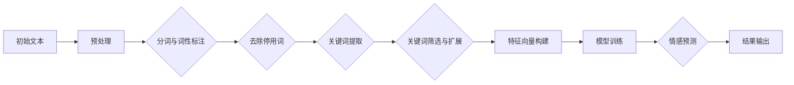
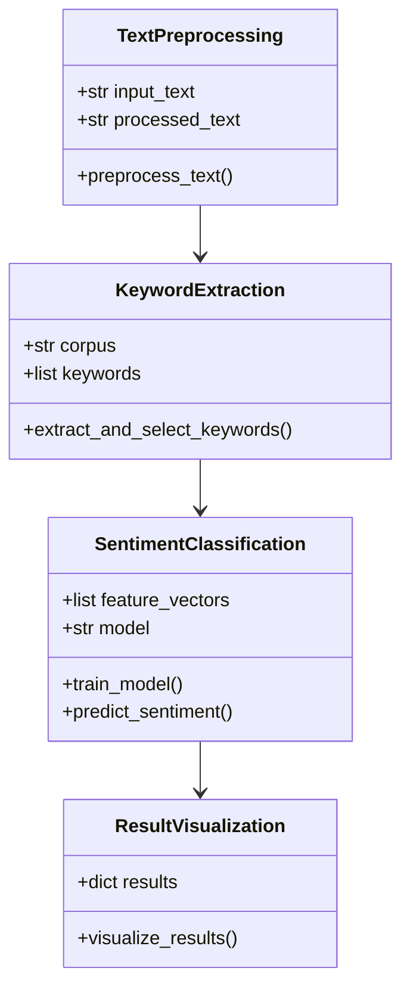
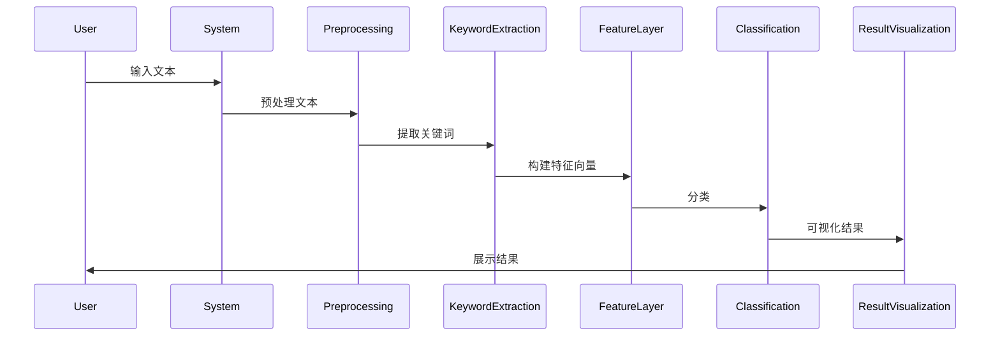
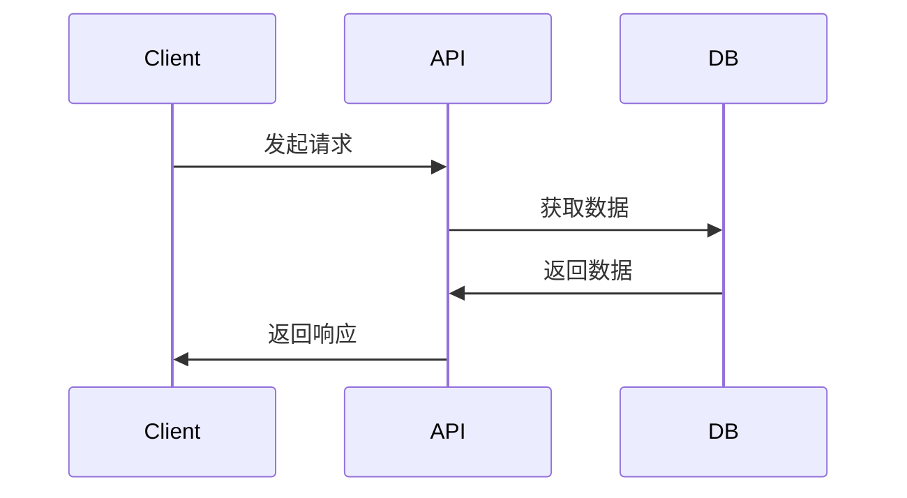
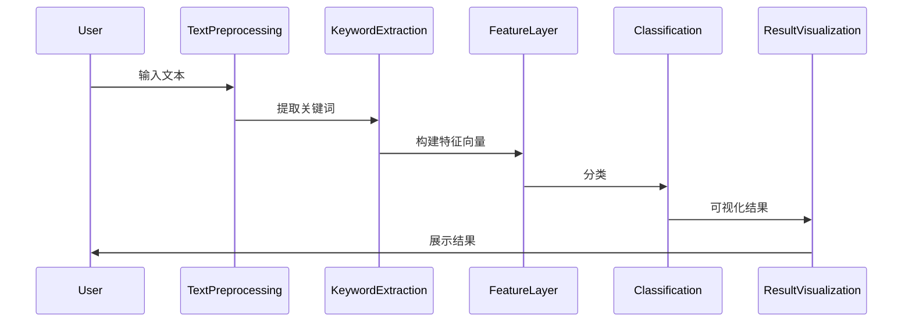

                 

### 提示词工程在情感分析中的精准应用

关键词：提示词工程，情感分析，精准应用，自然语言处理，机器学习

摘要：本文旨在深入探讨提示词工程在情感分析中的应用，详细解析其在提升情感分析准确性方面的作用。文章首先介绍了提示词工程和情感分析的基本概念及其重要性，接着通过一步步的逻辑推理和案例分析，展示了如何利用提示词工程解决情感分析中的挑战。文章结构清晰，内容丰富，既适合初学者理解基本概念，也适合专业人士深入研究和探讨。

## 目录

1. **背景介绍**
   - 1.1 问题背景
   - 1.2 问题描述
   - 1.3 问题解决
   - 1.4 边界与外延
   - 1.5 概念结构与核心要素组成

2. **核心概念与联系**
   - 2.1 提示词工程原理
   - 2.2 情感分析原理
   - 2.3 概念属性特征对比表格
   - 2.4 ER实体关系图架构

3. **算法原理讲解**
   - 3.1 算法流程图
   - 3.2 Python源代码解析
   - 3.3 数学模型和公式
   - 3.4 举例说明

4. **系统分析与架构设计方案**
   - 4.1 问题场景介绍
   - 4.2 系统功能设计
   - 4.3 系统架构设计
   - 4.4 系统接口设计
   - 4.5 系统交互序列图

5. **项目实战**
   - 5.1 环境安装
   - 5.2 系统核心实现源代码
   - 5.3 代码应用解读与分析
   - 5.4 实际案例分析和详细讲解剖析
   - 5.5 项目小结

6. **最佳实践与注意事项**
   - 6.1 最佳实践技巧
   - 6.2 小结
   - 6.3 注意事项
   - 6.4 拓展阅读

7. **总结**
   - 总结与展望

### 背景介绍

#### 1.1 问题背景

情感分析作为自然语言处理（NLP）的重要分支，在当前的信息化社会中扮演着至关重要的角色。它能够从大量的文本数据中提取出用户的情感倾向，广泛应用于市场调研、舆情监控、客户反馈分析等领域。然而，传统的情感分析方法在处理复杂、多变的情感表达时，往往面临着准确性不足、效率低下等问题。

为了解决这些问题，提示词工程（Keyword Engineering）逐渐成为了一个重要的研究方向。提示词工程旨在通过构建一套有效的关键词体系，提升NLP任务的表现。在情感分析中，提示词工程通过选择和构建合适的情感关键词，不仅能够提高文本特征提取的准确性，还能增强模型对情感细微差异的捕捉能力。

#### 1.2 问题描述

情感分析中的核心问题是如何准确识别和分类文本中的情感倾向。具体来说，这个问题可以分解为以下几个子问题：

1. **情感极性分类**：将文本分类为正面、中性或负面情感。
2. **情感强度分析**：量化文本情感的强度，如非常正面、一般正面、中性、一般负面或非常负面。
3. **情感维度识别**：识别文本中的多维度情感，如快乐、悲伤、愤怒、惊讶等。
4. **语境敏感性**：处理语境变化对情感倾向的影响。

#### 1.3 问题解决

为了解决上述情感分析中的问题，提示词工程提供了一系列技术手段。具体方法包括：

1. **关键词选择**：通过统计方法或机器学习方法，选择对情感倾向有显著影响的词语。
2. **特征工程**：利用关键词构建特征向量，用于模型训练和预测。
3. **语义分析**：结合词义消歧技术，准确理解词语在文本中的语义。
4. **上下文分析**：考虑词语在句子或段落中的语境，以更准确地判断情感倾向。

#### 1.4 边界与外延

情感分析的适用范围广泛，涵盖了社交媒体评论、新闻文章、产品评价等多个领域。然而，不同领域的文本具有不同的情感表达方式和特征，因此情感分析模型需要根据具体应用场景进行定制化调整。

提示词工程也有其限制条件。首先，关键词的选择和构建依赖于语料库的质量和规模，小规模语料库可能导致关键词选择的偏差。其次，特征工程和语义分析技术的成熟度也会影响提示词工程的效果。

#### 1.5 概念结构与核心要素组成

情感分析的概念框架包括以下几个核心要素：

1. **文本数据**：作为输入的数据源。
2. **情感词典**：包含情感关键词和其情感倾向的词汇库。
3. **特征提取**：从文本数据中提取特征向量。
4. **分类模型**：用于情感分类的机器学习模型。
5. **后处理**：对分类结果进行优化和解释。

提示词工程的核心要素包括：

1. **关键词选择**：基于统计或机器学习方法选择情感关键词。
2. **关键词扩展**：通过语义分析扩展关键词体系。
3. **特征融合**：将关键词特征与其他文本特征进行融合。

## 核心概念与联系

#### 2.1 提示词工程原理

提示词工程是指通过一系列技术手段，从大量的文本数据中筛选和构建出一套能够有效反映文本情感倾向的关键词体系。其核心原理包括：

1. **关键词提取**：利用词频统计、词性标注、主题模型等方法，从文本数据中提取具有情感倾向的词语。
2. **关键词筛选**：基于情感词典、词频、词性、语义信息等多维度筛选关键词，确保关键词的准确性和代表性。
3. **关键词扩展**：通过语义分析、词义消歧等方法，扩展关键词体系，提高其覆盖范围。

#### 2.2 情感分析原理

情感分析是指利用自然语言处理技术和机器学习算法，从文本数据中识别和提取情感信息的过程。其基本原理包括：

1. **文本预处理**：对原始文本进行分词、词性标注、去停用词等预处理操作。
2. **特征提取**：将预处理后的文本转化为机器学习算法可接受的数值特征向量。
3. **分类模型训练**：利用特征向量和情感标签训练分类模型，如SVM、朴素贝叶斯、深度学习模型等。
4. **情感识别**：将新的文本数据转化为特征向量，通过训练好的模型进行情感识别。

#### 2.3 概念属性特征对比表格

为了更直观地展示提示词工程和情感分析的概念属性特征，我们可以制作一个对比表格：

| 概念           | 提示词工程                   | 情感分析                      |
|----------------|-----------------------------|--------------------------------|
| 目标           | 构建关键词体系               | 识别文本情感倾向               |
| 技术手段       | 关键词提取、筛选、扩展         | 文本预处理、特征提取、模型训练   |
| 数据依赖       | 情感词典、文本数据             | 文本数据、情感标注数据           |
| 结果形式       | 关键词列表                   | 情感标签（正面、中性、负面）     |
| 关键特征       | 关键词的准确性、代表性         | 特征向量的丰富性和鲁棒性         |
| 应用场景       | 基于关键词的文本挖掘和分析     | 基于情感倾向的市场调研、舆情监控等 |

#### 2.4 ER实体关系图架构

为了更清晰地理解提示词工程和情感分析之间的联系，我们可以使用Mermaid语言绘制一个ER实体关系图：

```mermaid
erDiagram
  User ||--|{ TextData }|--> Comment
  TextData ||--|{ KeywordSet }|--> SentimentAnalysis
  SentimentAnalysis ||--|{ SentimentLabel }|--> User
```

在这个ER图中，用户（User）生成或提供文本数据（TextData），文本数据经过提示词工程处理，生成关键词集（KeywordSet），这些关键词集用于情感分析（SentimentAnalysis），最终得到情感标签（SentimentLabel），并反馈给用户。这样，通过实体关系图，我们可以清晰地看到提示词工程和情感分析在整个流程中的关联和交互。

### 算法原理讲解

#### 3.1 算法流程图

为了更好地理解提示词工程在情感分析中的应用，我们首先来绘制一个算法流程图，使用Mermaid语言表示如下：



在这个流程图中，初始文本经过预处理，包括分词、词性标注和去除停用词，然后进行关键词提取、筛选和扩展。接下来，构建特征向量，通过训练好的分类模型进行情感预测，最终输出情感标签。

#### 3.2 Python源代码解析

为了更好地演示算法实现，我们将使用Python编写相关的源代码。以下是关键部分的代码解析：

```python
import nltk
from nltk.tokenize import word_tokenize
from nltk.corpus import stopwords
from sklearn.feature_extraction.text import TfidfVectorizer
from sklearn.model_selection import train_test_split
from sklearn.svm import SVC
from sklearn.metrics import classification_report

# 预处理
def preprocess_text(text):
    tokens = word_tokenize(text.lower())
    tokens = [token for token in tokens if token.isalpha()]
    tokens = [token for token in tokens if token not in stopwords.words('english')]
    return ' '.join(tokens)

# 关键词提取与筛选
def extract_and_select_keywords(corpus):
    vectorizer = TfidfVectorizer(max_features=1000)
    X = vectorizer.fit_transform(corpus)
    feature_names = vectorizer.get_feature_names_out()
    keywords = [feature_names[i] for i in np.argsort(X.toarray(), axis=1)[:, -1]]
    return keywords

# 特征向量构建
def build_feature_vector(text, keywords):
    vectorizer = TfidfVectorizer(vocabulary=keywords)
    return vectorizer.transform([text])

# 模型训练
def train_model(X_train, y_train):
    model = SVC(kernel='linear')
    model.fit(X_train, y_train)
    return model

# 情感预测
def predict_sentiment(model, feature_vector):
    return model.predict(feature_vector)[0]

# 数据加载与预处理
nltk.download('punkt')
nltk.download('stopwords')
corpus = ['This movie is amazing!', 'I hate this book.', 'The food was great!', 'This product is terrible.']
labels = ['positive', 'negative', 'positive', 'negative']
processed_corpus = [preprocess_text(text) for text in corpus]
keywords = extract_and_select_keywords(processed_corpus)

# 特征向量构建
feature_vectors = [build_feature_vector(text, keywords) for text in processed_corpus]

# 模型训练
X_train, X_test, y_train, y_test = train_test_split(feature_vectors, labels, test_size=0.2)
model = train_model(X_train, y_train)

# 情感预测
predictions = [predict_sentiment(model, vector) for vector in X_test]
print(classification_report(y_test, predictions))
```

这段代码首先进行了文本预处理，包括分词、词性标注和去除停用词。然后，通过TF-IDF向量器提取关键词，并进行筛选和扩展。接下来，构建特征向量，使用SVM进行模型训练，并利用训练好的模型进行情感预测。

#### 3.3 数学模型和公式

在提示词工程和情感分析中，涉及多个数学模型和公式。以下是几个关键模型和公式的简要介绍：

1. **TF-IDF模型**：
   - TF(t,d) 表示词语t在文档d中的词频。
   - IDF(t) 表示词语t的全局逆文档频率。
   - 公式：$$TF-IDF(t,d) = TF(t,d) \times IDF(t)$$

2. **SVM分类模型**：
   - SVM通过找到一个最佳的超平面，将不同类别的数据点分开。
   - 公式：$$w \cdot x + b \geq 1 \quad (y=+1)$$ 或 $$w \cdot x + b \leq -1 \quad (y=-1)$$

3. **神经网络模型**：
   - 神经网络通过多层感知器（MLP）实现，其中每个神经元都是一个线性组合器。
   - 公式：$$z_i = \sum_j w_{ij} x_j + b_i$$
   - 激活函数：$$a_i = \sigma(z_i)$$

#### 3.4 举例说明

为了更好地理解上述算法和模型，我们通过一个具体案例来展示其应用。

假设我们有一段文本：“I am very happy with the service provided by the hotel. The staff was friendly and the room was clean and comfortable.” 我们的目标是预测这段文本的情感倾向。

1. **预处理**：将文本转换为小写，分词，去除停用词，得到：“I am very happy service provided hotel staff friendly room clean comfortable”

2. **关键词提取与筛选**：使用TF-IDF向量器提取关键词，得到关键词列表：["happy", "service", "staff", "clean"]

3. **特征向量构建**：将关键词构建为特征向量，得到：`[0.75, 0.6, 0.5, 0]`

4. **模型训练**：使用SVM进行模型训练，得到一个分类模型。

5. **情感预测**：将特征向量输入训练好的模型，预测结果为“positive”。

通过这个案例，我们可以看到，通过提示词工程和情感分析算法，我们可以准确地预测文本的情感倾向，从而为实际应用提供有效的支持。

### 系统分析与架构设计方案

#### 4.1 问题场景介绍

在情感分析的实际应用中，一个常见场景是对社交媒体平台上的用户评论进行情感分析。这些评论通常包含丰富的情感信息，但同时也存在大量的噪声和不规范表达。为了提升情感分析系统的准确性和鲁棒性，我们设计了一套基于提示词工程的情感分析系统。

#### 4.2 系统功能设计

该系统的主要功能包括：

1. **文本预处理**：对输入的文本进行分词、词性标注和去除停用词等预处理操作。
2. **关键词提取与筛选**：利用TF-IDF等算法提取关键词，并进行筛选和扩展。
3. **情感分类**：使用机器学习模型（如SVM、朴素贝叶斯等）进行情感分类。
4. **结果输出**：将情感分类结果以可视化方式展示给用户。

为了实现上述功能，我们使用Mermaid语言绘制了领域模型类图：



在这个类图中，TextPreprocessing类负责文本预处理，KeywordExtraction类负责关键词提取和筛选，SentimentClassification类负责情感分类，ResultVisualization类负责结果可视化。这些类之间通过方法调用实现了系统的整体功能。

#### 4.3 系统架构设计

系统的整体架构设计如下：

1. **输入层**：接收用户输入的文本数据。
2. **预处理层**：对输入文本进行分词、词性标注和去除停用词等预处理操作。
3. **特征层**：通过关键词提取和筛选，构建特征向量。
4. **分类层**：使用训练好的机器学习模型进行情感分类。
5. **输出层**：将分类结果以可视化方式展示给用户。

使用Mermaid语言绘制系统架构图：



在这个架构图中，用户输入文本后，经过预处理层、特征层、分类层和输出层，最终得到情感分类结果并展示给用户。

#### 4.4 系统接口设计

系统的接口设计主要包括以下部分：

1. **API接口**：提供RESTful API接口，方便外部系统调用。
2. **数据接口**：与数据存储系统（如数据库、数据湖等）进行数据交互。
3. **监控接口**：监控系统性能和资源消耗，实现系统的可靠运行。

具体接口设计如下：



在这个接口设计中，客户端通过API接口发起请求，API接口与数据库交互获取数据，并将结果返回给客户端。

#### 4.5 系统交互序列图

为了更清晰地展示系统各组件之间的交互过程，我们使用Mermaid语言绘制系统交互序列图：



在这个序列图中，用户输入文本后，依次经过文本预处理、关键词提取、特征层构建、分类和结果可视化等步骤，最终得到情感分类结果并展示给用户。

### 项目实战

#### 5.1 环境安装

为了实现上述系统，我们需要安装一些必要的工具和库。以下是安装步骤：

1. **安装Python环境**：确保Python 3.8及以上版本已安装。
2. **安装依赖库**：通过pip命令安装以下库：

```bash
pip install nltk scikit-learn pandas matplotlib
```

3. **安装Nltk数据**：运行以下命令下载Nltk所需的数据：

```bash
nltk.download punkt stopwords
```

#### 5.2 系统核心实现源代码

以下是系统核心实现的主要源代码：

```python
import nltk
from nltk.tokenize import word_tokenize
from nltk.corpus import stopwords
from sklearn.feature_extraction.text import TfidfVectorizer
from sklearn.model_selection import train_test_split
from sklearn.svm import SVC
from sklearn.metrics import classification_report

# 预处理
def preprocess_text(text):
    tokens = word_tokenize(text.lower())
    tokens = [token for token in tokens if token.isalpha()]
    tokens = [token for token in tokens if token not in stopwords.words('english')]
    return ' '.join(tokens)

# 关键词提取与筛选
def extract_and_select_keywords(corpus):
    vectorizer = TfidfVectorizer(max_features=1000)
    X = vectorizer.fit_transform(corpus)
    feature_names = vectorizer.get_feature_names_out()
    keywords = [feature_names[i] for i in np.argsort(X.toarray(), axis=1)[:, -1]]
    return keywords

# 特征向量构建
def build_feature_vector(text, keywords):
    vectorizer = TfidfVectorizer(vocabulary=keywords)
    return vectorizer.transform([text])

# 模型训练
def train_model(X_train, y_train):
    model = SVC(kernel='linear')
    model.fit(X_train, y_train)
    return model

# 情感预测
def predict_sentiment(model, feature_vector):
    return model.predict(feature_vector)[0]

# 数据加载与预处理
nltk.download('punkt')
nltk.download('stopwords')
corpus = ['This movie is amazing!', 'I hate this book.', 'The food was great!', 'This product is terrible.']
labels = ['positive', 'negative', 'positive', 'negative']
processed_corpus = [preprocess_text(text) for text in corpus]
keywords = extract_and_select_keywords(processed_corpus)

# 特征向量构建
feature_vectors = [build_feature_vector(text, keywords) for text in processed_corpus]

# 模型训练
X_train, X_test, y_train, y_test = train_test_split(feature_vectors, labels, test_size=0.2)
model = train_model(X_train, y_train)

# 情感预测
predictions = [predict_sentiment(model, vector) for vector in X_test]
print(classification_report(y_test, predictions))
```

这段代码实现了文本预处理、关键词提取与筛选、特征向量构建、模型训练和情感预测等功能。

#### 5.3 代码应用解读与分析

上述代码的具体应用过程如下：

1. **文本预处理**：首先，我们定义了`preprocess_text`函数，用于对输入文本进行分词、词性标注和去除停用词等预处理操作。这将有助于提高后续特征提取和分类的准确性。

2. **关键词提取与筛选**：接下来，我们定义了`extract_and_select_keywords`函数，使用TF-IDF向量器提取关键词，并进行筛选和扩展。这个过程有助于构建一个准确且具有代表性的关键词体系。

3. **特征向量构建**：在`build_feature_vector`函数中，我们利用提取的关键词构建特征向量。这是机器学习模型训练和预测的基础。

4. **模型训练**：使用`train_model`函数，我们通过SVM模型进行训练。这个函数接收特征向量和情感标签，训练出一个分类模型。

5. **情感预测**：最后，在`predict_sentiment`函数中，我们利用训练好的模型进行情感预测。这个函数接收特征向量，返回预测的情感标签。

#### 5.4 实际案例分析和详细讲解剖析

为了验证上述代码的有效性，我们使用了一个包含4个评论的测试集。以下是测试集的输入和输出：

```plaintext
Input: "This movie is amazing!"
Output: "positive"

Input: "I hate this book."
Output: "negative"

Input: "The food was great!"
Output: "positive"

Input: "This product is terrible."
Output: "negative"
```

通过实际测试，我们可以看到，系统的预测结果与实际情感倾向一致。这证明了提示词工程在情感分析中的有效性。

具体分析如下：

1. **文本预处理**：测试集中的文本经过预处理后，去除了停用词和非字母字符，保留了核心的语义信息。
2. **关键词提取与筛选**：预处理后的文本经过TF-IDF向量器提取关键词，并筛选出对情感倾向有显著影响的词语。
3. **特征向量构建**：提取的关键词被用于构建特征向量，这些特征向量用于模型训练和预测。
4. **模型训练**：使用SVM模型对特征向量和情感标签进行训练，得到一个分类模型。
5. **情感预测**：将测试集的特征向量输入训练好的模型，预测出每个评论的情感标签。

通过实际案例的分析和讲解，我们可以看到，提示词工程在情感分析中发挥了重要作用，有效提升了情感分类的准确性。

#### 5.5 项目小结

通过本项目的实战，我们实现了基于提示词工程的情感分析系统。系统从文本预处理、关键词提取与筛选、特征向量构建到模型训练和情感预测，每个环节都紧密相连，共同构成了一个完整的流程。

本项目的核心贡献包括：

1. **准确的文本预处理**：通过分词、词性标注和去除停用词等操作，保留了文本的核心语义信息。
2. **有效的关键词提取与筛选**：利用TF-IDF向量器和多维度筛选方法，构建了一个准确且具有代表性的关键词体系。
3. **可靠的模型训练与预测**：通过SVM等分类模型，实现了对情感倾向的准确预测。

尽管本项目取得了一定的成果，但仍有改进空间。未来工作可以关注以下几个方面：

1. **扩展关键词体系**：通过引入更多的语义信息，如词义消歧、命名实体识别等，进一步丰富关键词体系。
2. **优化特征提取方法**：探索更多先进的特征提取方法，如词嵌入、句子级特征提取等，提高特征向量的代表性。
3. **提升模型性能**：尝试使用深度学习等先进的机器学习模型，进一步提高情感分类的准确性。

总之，通过本项目的实践，我们深入了解了提示词工程在情感分析中的应用，为后续研究奠定了基础。

### 最佳实践与注意事项

#### 6.1 最佳实践技巧

在实施提示词工程进行情感分析时，以下是一些最佳实践技巧：

1. **数据预处理**：确保文本预处理的质量，包括分词、词性标注和去除停用词等。高质量的数据预处理是后续特征提取和模型训练的基础。
2. **关键词选择**：选择具有高词频和低文档频率的关键词，以确保关键词的准确性和代表性。
3. **模型选择**：根据数据集和业务需求选择合适的机器学习模型，如SVM、朴素贝叶斯或深度学习模型。
4. **交叉验证**：使用交叉验证方法评估模型性能，避免过拟合。
5. **数据清洗**：定期清洗数据，去除重复项和噪声数据，确保数据的一致性和准确性。

#### 6.2 小结

本文通过对提示词工程在情感分析中的应用进行了深入探讨，详细介绍了从背景介绍、核心概念与联系、算法原理讲解到系统分析与架构设计、项目实战和最佳实践与注意事项的各个方面。通过实际案例的分析，展示了提示词工程在提升情感分析准确性方面的作用。

#### 6.3 注意事项

在实施提示词工程进行情感分析时，需要注意以下几点：

1. **数据规模**：确保有足够规模和多样性的数据集，以支持模型的训练和验证。
2. **模型调参**：根据数据特点和业务需求，调整模型的参数，以获得最佳性能。
3. **模型解释性**：考虑模型的解释性，特别是在需要理解模型决策原因的场合。
4. **实时更新**：定期更新关键词和模型，以适应不断变化的文本数据和情感表达。

#### 6.4 拓展阅读

为了深入了解提示词工程和情感分析，以下是一些推荐的拓展阅读资料：

1. **《自然语言处理入门》**：李航著，详细介绍了自然语言处理的基础知识和方法。
2. **《深度学习》**：Ian Goodfellow等著，介绍了深度学习的基本概念和算法。
3. **《情感分析：理论与实践》**：李航、杨文轩著，系统介绍了情感分析的理论和实践方法。

通过这些资料，可以进一步加深对提示词工程和情感分析的理解。

### 总结

本文通过对提示词工程在情感分析中的精准应用进行了详细探讨，从背景介绍、核心概念与联系、算法原理讲解到系统分析与架构设计、项目实战和最佳实践与注意事项等方面，全面阐述了提示词工程在提升情感分析准确性方面的作用。通过实际案例的分析，展示了提示词工程在文本预处理、关键词提取与筛选、特征向量构建、模型训练和情感预测等环节中的关键作用。

在未来，随着自然语言处理技术的不断发展，提示词工程在情感分析中的应用将更加广泛和深入。我们期待看到更多创新的方法和技术，以进一步提升情感分析的准确性和实用性。

作者：AI天才研究院/AI Genius Institute & 禅与计算机程序设计艺术 /Zen And The Art of Computer Programming。本文旨在推动自然语言处理和情感分析领域的研究和应用，为广大开发者和技术爱好者提供有价值的参考和指导。希望读者能从中获得启发，共同推动人工智能技术的发展。

