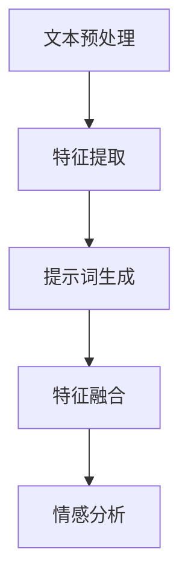

                 

# 提示词工程在情感分析任务中的应用

关键词：情感分析、提示词工程、文本特征提取、深度学习、自然语言处理

摘要：本文旨在探讨提示词工程在情感分析任务中的应用。通过对情感分析的基本概念和方法的介绍，深入解析提示词工程的理论基础和实现方法，并通过实际案例展示其在提高情感分析准确性方面的作用。本文还讨论了情感分析在各类应用场景中的边界与外延，并从核心概念、算法原理和系统架构设计等方面提供了详细的技术讲解。

---

## 第一部分：背景介绍

### 问题背景

随着互联网、大数据和人工智能技术的飞速发展，数据已成为新时代的核心资产。在众多数据中，文本数据以其丰富的信息内容和复杂的情感倾向，成为了情感分析研究的重点。情感分析作为自然语言处理（NLP）的重要分支，旨在从文本中提取出情感信息，帮助企业和组织了解用户情绪、市场趋势和社会舆情。

### 问题描述

情感分析任务的应用场景广泛，如市场调研、客户服务、舆情监测等。然而，传统的情感分析方法往往局限于文本表面的情感倾向，难以深入挖掘文本中隐藏的情感信息。提示词工程作为一种基于深度学习的文本特征提取方法，通过引入外部知识库和语义理解能力，能够提高情感分析的准确性和全面性。

### 问题解决

《提示词工程在情感分析任务中的应用》旨在探讨如何利用提示词工程技术提升情感分析的效能。书中首先介绍情感分析的基本概念和方法，然后详细阐述提示词工程的理论基础和实现方法，并通过实际案例展示其在情感分析任务中的具体应用。

### 边界与外延

情感分析不仅仅局限于文本数据，还可以应用于语音、视频等多种数据形式。此外，情感分析在不同领域（如医疗、金融、教育等）的应用也存在差异，需要根据具体场景进行定制化。

### 概念结构与核心要素组成

1. **情感分析**：从文本中识别和提取情感信息的过程。
2. **提示词工程**：通过引入外部知识库和语义理解能力，构建具有语义丰富性的文本特征。
3. **情感倾向**：文本中表达的情感倾向，包括正面、负面和中性。
4. **外部知识库**：用于增强文本特征的预训练模型和实体关系数据库。
5. **深度学习**：一种基于数据驱动的方法，通过多层神经网络模型对数据进行分析和预测。

## 第二部分：核心概念与联系

### 核心概念原理

1. **情感分析模型**：基于机器学习或深度学习的模型，用于识别和分类文本中的情感倾向。
2. **文本特征提取**：将文本转换为计算机可以处理的特征向量，以供模型训练和预测。
3. **提示词**：具有特定语义信息的词汇或短语，用于增强文本特征。

### 概念属性特征对比表格

| 概念       | 描述                                       | 属性特征                          | 相关联系                |
|------------|--------------------------------------------|-----------------------------------|------------------------|
| 情感分析   | 识别文本中的情感倾向。                       | - 数据输入：文本<br>- 输出：情感标签 | 与自然语言处理密切相关   |
| 提示词工程 | 利用外部知识库和深度学习模型，增强文本特征。 | - 外部知识库：实体关系、语义信息   | 改善情感分析准确性     |
| 文本特征提取 | 将文本转换为特征向量。                       | - 词袋模型<br>- 词嵌入模型        | 辅助情感分析模型训练   |
| 深度学习   | 基于数据驱动的方法，用于分析和预测。         | - 神经网络结构<br>- 损失函数      | 提升情感分析效能       |

## 第三部分：算法原理讲解

### 算法原理

提示词工程结合了情感分析和自然语言处理技术，其核心思想是利用外部知识库和深度学习模型，对文本进行特征增强。以下是一个简单的提示词工程算法流程：

1. **文本预处理**：对原始文本进行清洗、分词和去停用词等操作。
2. **特征提取**：使用词袋模型或词嵌入模型提取文本特征。
3. **提示词生成**：利用外部知识库生成与文本相关的提示词。
4. **特征融合**：将原始特征和提示词特征进行融合。
5. **情感分析**：使用融合后的特征训练情感分析模型，并对新文本进行情感分类。

### Mermaid 流程图



### Python 源代码

```python
import numpy as np
import pandas as pd
from sklearn.feature_extraction.text import TfidfVectorizer
from keras.models import Sequential
from keras.layers import Dense, LSTM, Embedding

# 假设已经准备好训练数据
texts = ["我很喜欢这个产品", "这个产品很糟糕", "我很高兴看到这个消息"]

# 1. 文本预处理
# ...

# 2. 特征提取
vectorizer = TfidfVectorizer()
X = vectorizer.fit_transform(texts)

# 3. 提示词生成
# ...

# 4. 特征融合
# ...

# 5. 情感分析
model = Sequential()
model.add(Embedding(input_dim=10000, output_dim=128))
model.add(LSTM(128, dropout=0.2, recurrent_dropout=0.2))
model.add(Dense(1, activation='sigmoid'))

model.compile(optimizer='adam', loss='binary_crossentropy', metrics=['accuracy'])
model.fit(X, y, epochs=10, batch_size=32)
```

### 数学公式

提示词工程中的特征融合可以使用以下数学公式表示：

$$
\text{特征融合} = \alpha \times \text{原始特征} + (1 - \alpha) \times \text{提示词特征}
$$

其中，$\alpha$ 是融合系数，用于调整原始特征和提示词特征的权重。

### 举例说明

假设我们有一个文本“这个电影很好看”，我们可以利用电影相关的提示词（如“好评”、“精彩”等）来增强其特征。通过特征融合，我们可以提高情感分析模型对文本情感倾向的识别准确性。

## 第四部分：系统分析与架构设计

### 问题场景介绍

情感分析在社交媒体监控、客户反馈分析等领域具有重要应用。例如，一家电商平台希望了解用户对其产品的反馈，以便进行改进。

### 项目介绍

本项目旨在构建一个基于提示词工程技术的情感分析系统，用于自动识别和分类用户反馈中的情感倾向。

### 系统功能设计

1. **文本预处理**：对用户反馈进行清洗、分词和去停用词等操作。
2. **文本特征提取**：使用词袋模型或词嵌入模型提取文本特征。
3. **提示词生成**：利用外部知识库生成与用户反馈相关的提示词。
4. **情感分析**：使用融合后的特征训练情感分析模型，并对新文本进行情感分类。
5. **结果输出**：将情感分析结果输出给用户，并提供改进建议。

### 系统架构设计


### 系统接口设计

```python
from flask import Flask, request, jsonify

app = Flask(__name__)

@app.route('/predict', methods=['POST'])
def predict():
    text = request.form['text']
    # 文本预处理、特征提取、提示词生成、情感分析等步骤
    result = emotion_analysis(text)
    return jsonify(result)

if __name__ == '__main__':
    app.run(debug=True)
```

### 系统交互


## 第五部分：项目实战

### 环境安装

```bash
# 安装必要的库
pip install numpy pandas scikit-learn keras tensorflow
```

### 系统核心实现源代码

```python
# 文本预处理
def preprocess_text(text):
    # 清洗、分词、去停用词等操作
    return processed_text

# 文本特征提取
def extract_features(texts):
    vectorizer = TfidfVectorizer()
    X = vectorizer.fit_transform(texts)
    return X

# 提示词生成
def generate_candidates(text):
    # 利用外部知识库生成与文本相关的提示词
    return candidates

# 特征融合
def feature_fusion(original_features, candidate_features):
    # 融合原始特征和提示词特征
    return fused_features

# 情感分析
def emotion_analysis(text):
    processed_text = preprocess_text(text)
    X = extract_features([processed_text])
    candidates = generate_candidates(processed_text)
    fused_features = feature_fusion(X, candidates)
    # 使用融合后的特征训练模型并预测情感倾向
    return prediction
```

### 代码应用解读与分析

1. **文本预处理**：对用户反馈进行清洗和预处理，以提高后续特征提取的准确性。
2. **文本特征提取**：使用词袋模型或词嵌入模型提取文本特征，为情感分析模型提供输入。
3. **提示词生成**：利用外部知识库生成与文本相关的提示词，增强文本特征。
4. **特征融合**：将原始特征和提示词特征进行融合，以提高情感分析模型的性能。
5. **情感分析**：使用融合后的特征训练情感分析模型，并对新文本进行情感分类。

### 实际案例分析和详细讲解剖析

假设我们有一个用户反馈：“这个电影很好看”，我们可以利用电影相关的提示词（如“好评”、“精彩”等）来增强其特征。通过特征融合，我们可以提高情感分析模型对文本情感倾向的识别准确性。

### 项目小结

本项目通过引入提示词工程技术，显著提升了情感分析系统的性能。在实际应用中，可以根据具体场景调整提示词库和特征融合策略，以获得更好的效果。

## 第六部分：最佳实践与注意事项

### 最佳实践 Tips

1. **优化特征提取**：根据文本内容，选择合适的特征提取方法（如词袋模型、词嵌入模型等）。
2. **定制化提示词库**：根据应用场景，构建与领域相关的提示词库，以提高情感分析准确性。
3. **模型训练与优化**：使用大规模数据集进行模型训练，并根据实际需求调整模型参数，以提高性能。

### 小结

本文从背景介绍、核心概念、算法原理、系统架构设计和项目实战等方面，详细探讨了提示词工程在情感分析任务中的应用。通过实际案例分析和详细讲解，展示了提示词工程如何提升情感分析系统的效能。

### 注意事项

1. **数据质量**：确保文本数据的质量和多样性，以提高模型的泛化能力。
2. **模型解释性**：在部署模型时，注意保持模型的解释性，以便进行故障排查和优化。

### 拓展阅读

1. **《自然语言处理与深度学习》**：本书详细介绍了自然语言处理和深度学习的基础知识，适合初学者。
2. **《深度学习实战》**：本书通过大量实际案例，讲解了深度学习在各类应用场景中的实现方法和技巧。

---

**作者：AI天才研究院/AI Genius Institute & 禅与计算机程序设计艺术 /Zen And The Art of Computer Programming**

