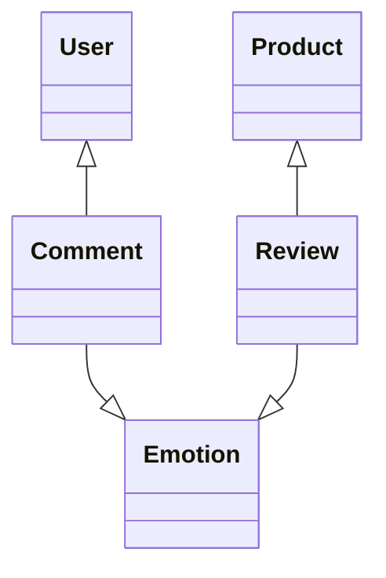
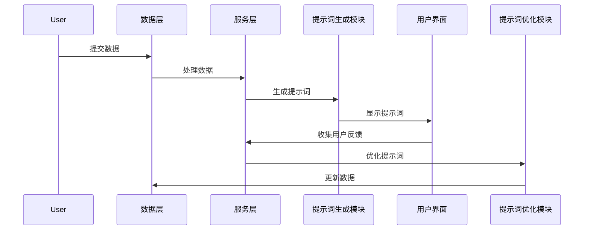
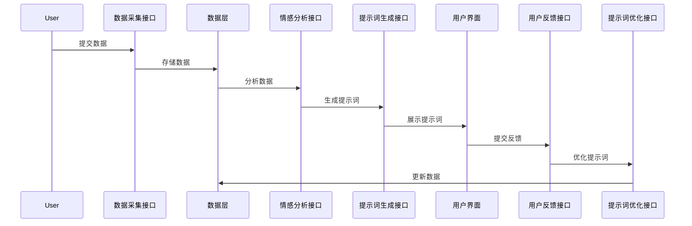

                 

# 提示词工程在情感智能中的突破

关键词：提示词工程、情感智能、生成算法、优化算法、情感属性

摘要：本文深入探讨了提示词工程在情感智能领域的应用与突破，从背景介绍、核心概念与联系、算法原理讲解、系统分析与架构设计、项目实战等方面进行阐述。通过详细的分析和案例剖析，揭示了提示词工程在提升情感智能应用效果中的关键作用。

----------------------------------------------------------------

## 第一部分：背景介绍

### 1.1 问题背景

#### 1.1.1 提示词工程的概念

提示词工程是近年来情感智能领域的一个重要研究方向。它涉及如何通过人工智能技术，尤其是自然语言处理和机器学习算法，生成和优化能够有效引导人类情绪和思维的提示词。在情感智能中，提示词工程具有广泛的应用前景，如个性化推荐、情感分析、心理咨询等。

#### 1.1.2 情感智能的发展现状

随着深度学习和大数据技术的发展，情感智能已经成为人工智能领域的一个重要分支。然而，情感智能的研究和应用仍然面临诸多挑战，如情感理解的不精确性、情绪生成的不自然性等。提示词工程在这一背景下应运而生，旨在通过改进提示词的质量和效果，推动情感智能的发展。

#### 1.1.3 提示词工程的应用场景

提示词工程在多个领域具有广泛应用潜力。例如，在电商平台上，通过优化产品推荐策略，提高用户购物体验；在社交媒体上，通过生成恰当的情感导向内容，增强用户互动；在心理咨询领域，通过设计有效的情感干预策略，帮助用户改善情绪状态。

### 1.2 核心概念

#### 1.2.1 提示词

提示词是指用于引导或提示用户情绪、行为或思考的词汇或短语。在设计提示词时，需要考虑其情感色彩、语境适应性、用户个性化等因素。

#### 1.2.2 情感智能

情感智能是指人类在情感认知、情感表达和情感管理方面的能力。在人工智能领域，情感智能研究旨在使机器具备识别、理解和模拟人类情感的能力。

#### 1.2.3 提示词工程

提示词工程是指利用人工智能技术，对提示词进行生成、优化和评估的一系列方法和实践。它包括数据收集、算法设计、模型训练和效果评估等环节。

### 1.3 边界与外延

#### 1.3.1 边界

提示词工程主要关注的是如何通过技术手段优化提示词，提升其在特定应用场景中的效果。它不涉及提示词的具体内容和应用领域。

#### 1.3.2 外延

提示词工程的应用范围广泛，不仅包括情感智能领域，还可以扩展到教育、医疗、娱乐等其他与人类情感相关的领域。

### 1.4 概念结构与核心要素组成

#### 1.4.1 数据收集与预处理

数据收集与预处理是提示词工程的基础。它包括从各种来源收集文本数据，并对数据进行清洗、去重、分词、情感标注等预处理操作。

#### 1.4.2 算法设计

算法设计是提示词工程的核心。它包括基于机器学习、深度学习等技术，设计用于生成和优化提示词的算法。

#### 1.4.3 模型训练与评估

模型训练与评估是提示词工程的保障。它包括利用训练数据对提示词生成模型进行训练，并通过评估指标对模型效果进行评价和优化。

### 1.5 本章小结

本章节对提示词工程在情感智能中的突破进行了背景介绍，阐述了核心概念、边界与外延，并分析了概念结构与核心要素组成。这为后续章节的内容展开奠定了基础。

----------------------------------------------------------------

## 第二部分：核心概念与联系

### 2.1 核心概念原理

#### 2.1.1 提示词的生成算法

提示词的生成算法主要包括基于规则的方法和基于数据的方法。基于规则的方法通常使用手工编写规则来生成提示词，而基于数据的方法则利用机器学习算法，从大量数据中学习生成提示词的规律。

**提示词生成算法的流程如下：**

1. 数据收集：从各类来源收集包含情感信息的文本数据，如社交媒体、用户评论、新闻报道等。
2. 数据预处理：对收集到的文本数据进行清洗、分词、去停用词、词性标注等预处理操作。
3. 情感标注：对预处理后的文本数据中的情感词进行标注，如正面、负面、中性等。
4. 算法训练：利用机器学习算法，如循环神经网络（RNN）、长短时记忆网络（LSTM）等，对标注后的数据进行训练，学习生成提示词的规律。
5. 提示词生成：根据训练好的模型，生成符合情感需求的提示词。

**示例：** 假设我们训练了一个基于LSTM模型的情感提示词生成器。给定一个包含情感信息的句子，如“今天天气真好，心情很愉快”，模型可以生成相应的提示词，如“愉快”、“开心”等。

#### 2.1.2 提示词的优化算法

提示词的优化算法主要包括基于目标函数的方法和基于强化学习的方法。基于目标函数的方法通过优化目标函数来改善提示词的质量，而基于强化学习的方法通过试错和反馈来逐步优化提示词。

**提示词优化算法的流程如下：**

1. 目标函数定义：根据应用场景，定义提示词优化目标函数，如情感一致性、用户满意度等。
2. 初始提示词生成：利用生成算法生成一组初始提示词。
3. 目标函数评估：计算初始提示词的目标函数值，如情感一致性得分、用户满意度评分等。
4. 提示词优化：通过调整提示词的参数或结构，优化目标函数值。
5. 反复迭代：不断调整提示词，直到目标函数值达到预期或满足终止条件。

**示例：** 假设我们使用基于强化学习的优化算法，目标是提高用户满意度。在用户满意度评分较低时，算法会尝试调整提示词的情感色彩、长度、结构等，以提高用户满意度。

#### 2.1.3 提示词的情感属性

提示词的情感属性是指提示词所蕴含的情感色彩，如正面、负面、中性等。情感属性对于提示词的有效性具有重要影响。

**提示词情感属性的分类：**

1. 正面情感：表示积极的、愉悦的情感，如“开心”、“满意”等。
2. 负面情感：表示消极的、不愉快的情感，如“悲伤”、“愤怒”等。
3. 中性情感：表示无情感倾向或无明显情感色彩的情感，如“正常”、“一般”等。

**示例：** 假设我们有一个提示词“心情愉快”，其情感属性为正面情感，可以用于引导用户产生积极情绪。

### 2.2 概念属性特征对比表格

以下是几种常见提示词生成和优化算法的属性特征对比表格：

| 算法类型 | 特点 | 优点 | 缺点 |
| :---: | :---: | :---: | :---: |
| 基于规则的方法 | 简单、易于实现 | 对特定场景效果较好 | 缺乏灵活性、适用范围有限 |
| 基于数据的方法 | 灵活、适用范围广 | 能够学习复杂模式 | 训练成本高、效果不稳定 |
| 基于目标函数的方法 | 目标明确、优化效果显著 | 算法简单、易于实现 | 需要大量训练数据、优化过程耗时 |
| 基于强化学习的方法 | 自动调整、逐步优化 | 能应对复杂环境 | 算法复杂、收敛速度较慢 |

### 2.3 ER实体关系图

```mermaid
erDiagram
  Product ||--|{ User } : "contains"
  User ||--|{ Order } : "places"
  Product ||--|{ Category } : "belongs_to"
  Category ||--|{ Supplier } : "sells"
```

在提示词工程中，实体关系图可以表示提示词、用户、情感等概念之间的关系。例如，用户可以包含多个订单，订单可以包含多个提示词，提示词可以属于某个情感类别，情感类别可以由供应商提供。

----------------------------------------------------------------

## 第三部分：算法原理讲解

### 3.1 提示词生成算法

#### 3.1.1 LSTM算法

LSTM（长短时记忆网络）是一种常用于处理序列数据的深度学习模型，能够有效地学习长期依赖关系。在提示词生成算法中，LSTM模型被用来生成情感倾向的提示词。

**算法原理：**

1. 输入序列：给定一个情感序列，如“今天天气真好，心情很愉快”。
2. LSTM单元：通过LSTM单元处理输入序列，每个单元包含三个门控：遗忘门、输入门和输出门。
3. 遗忘门：决定忘记哪些旧信息。
4. 输入门：决定新信息如何影响单元状态。
5. 输出门：决定输出哪些信息作为当前提示词。

**数学模型：**

$$
\begin{aligned}
f_t &= \sigma(W_f \cdot [h_{t-1}, x_t] + b_f) \\
i_t &= \sigma(W_i \cdot [h_{t-1}, x_t] + b_i) \\
\bar{c}_t &= \tanh(W_c \cdot [h_{t-1}, x_t] + b_c) \\
o_t &= \sigma(W_o \cdot [h_{t-1}, x_t] + b_o) \\
c_t &= f_t \odot c_{t-1} + i_t \odot \bar{c}_t \\
h_t &= o_t \odot \tanh(c_t)
\end{aligned}
$$

其中，$h_t$表示当前时刻的隐藏状态，$c_t$表示当前时刻的细胞状态，$x_t$表示当前时刻的输入，$W_f, W_i, W_c, W_o$和$b_f, b_i, b_c, b_o$分别为权重和偏置。

**示例：** 假设给定一个情感序列“今天天气真好，心情很愉快”，LSTM模型可以生成如“愉快”、“开心”等正面情感倾向的提示词。

### 3.2 提示词优化算法

#### 3.2.1 强化学习算法

强化学习（Reinforcement Learning，RL）是一种通过试错和反馈来优化策略的机器学习方法。在提示词优化中，强化学习算法被用来根据用户反馈调整提示词，以提高用户满意度。

**算法原理：**

1. 状态空间：定义状态空间，如用户当前的情感状态、提示词的历史记录等。
2. 动作空间：定义动作空间，如提示词的选择、情感色彩调整等。
3. 计算奖励：根据用户反馈计算奖励，如用户满意度评分。
4. 更新策略：根据奖励调整策略，选择更好的提示词。

**数学模型：**

$$
\begin{aligned}
Q(s, a) &= r + \gamma \max_{a'} Q(s', a') \\
\theta_{t+1} &= \theta_t + \alpha (r + \gamma \max_{a'} Q(s', a') - Q(s, a))
\end{aligned}
$$

其中，$Q(s, a)$表示状态$s$下选择动作$a$的预期奖励，$\theta_t$表示策略参数，$\alpha$为学习率，$\gamma$为折扣因子。

**示例：** 假设用户对提示词“心情愉快”的满意度评分为3分，强化学习算法会尝试调整提示词，如增加情感色彩或调整长度，以提高用户满意度。

### 3.3 情感属性分析

#### 3.3.1 情感词典

情感词典是一种用于描述文本情感属性的词典，包含大量的情感词及其对应的情感极性（正面、负面、中性）。在提示词生成和优化中，情感词典用于判断和调整提示词的情感属性。

**情感词典的构建：**

1. 数据收集：从各类来源收集包含情感信息的文本数据。
2. 情感标注：对文本数据进行情感标注，如正面、负面、中性等。
3. 词频统计：统计各情感词在文本数据中的出现频率。
4. 情感词典构建：将情感词及其情感极性、出现频率等信息存储在词典中。

**情感词典的应用：**

1. 提示词生成：根据情感词典，选择具有相应情感极性的词汇作为提示词。
2. 提示词优化：根据用户反馈和情感词典，调整提示词的情感属性。

**示例：** 假设情感词典中包含“开心”一词，其情感极性为正面。在生成提示词时，我们可以选择“开心”作为正面情感倾向的提示词。

----------------------------------------------------------------

## 第四部分：系统分析与架构设计

### 4.1 问题场景介绍

情感智能在当今社会具有重要意义，如何设计一个高效的系统来实现情感智能功能，成为了一个关键问题。本文将介绍一个基于提示词工程的情感智能系统，该系统旨在通过生成和优化提示词，提高用户的情感体验。

### 4.2 项目介绍

本项目名为“情感智能助手”，旨在为用户提供个性化、情感化的互动体验。系统主要包括以下几个功能模块：

1. 数据采集模块：从各类渠道收集情感数据，如社交媒体、用户评论等。
2. 情感分析模块：利用自然语言处理技术对采集到的情感数据进行情感分析，提取情感特征。
3. 提示词生成模块：基于情感特征生成符合用户需求的提示词。
4. 提示词优化模块：根据用户反馈不断优化提示词，提高用户满意度。
5. 用户反馈模块：收集用户对提示词的反馈，用于系统优化。

### 4.3 系统功能设计

#### 4.3.1 领域模型

领域模型是系统功能设计的基础，它描述了系统涉及的实体及其关系。以下是情感智能助手的领域模型：



在领域模型中，User代表用户，Comment代表用户评论，Product代表产品，Review代表产品评论，Emotion代表情感。

#### 4.3.2 系统功能流程

1. 数据采集：系统从社交媒体、用户评论等渠道收集情感数据。
2. 情感分析：利用自然语言处理技术对情感数据进行分析，提取情感特征。
3. 提示词生成：基于情感特征生成提示词，如正面、负面、中性等。
4. 提示词优化：根据用户反馈不断调整提示词，提高用户满意度。
5. 用户反馈：收集用户对提示词的反馈，用于系统优化。

### 4.4 系统架构设计

#### 4.4.1 架构设计

情感智能助手的系统架构包括以下几个层次：

1. 数据层：存储情感数据、用户数据、产品数据等。
2. 服务层：提供数据采集、情感分析、提示词生成、提示词优化等功能。
3. 表示层：提供用户界面，展示系统功能，接收用户反馈。
4. 管理层：负责系统配置、权限管理、日志记录等。

以下是情感智能助手的架构图：



#### 4.4.2 系统接口设计

系统接口设计是系统架构的关键部分，它定义了系统内部模块之间的交互方式。以下是情感智能助手的主要接口：

1. 数据采集接口：用于从外部渠道收集情感数据。
2. 情感分析接口：用于分析情感数据，提取情感特征。
3. 提示词生成接口：用于生成符合用户需求的提示词。
4. 提示词优化接口：用于根据用户反馈优化提示词。
5. 用户反馈接口：用于收集用户对提示词的反馈。

### 4.5 系统交互

#### 4.5.1 系统交互流程

以下是情感智能助手的系统交互流程：

1. 用户提交数据：用户通过社交媒体、用户评论等渠道提交情感数据。
2. 数据采集：系统从外部渠道收集情感数据，存储在数据层。
3. 情感分析：系统对情感数据进行分析，提取情感特征。
4. 提示词生成：系统根据情感特征生成提示词。
5. 提示词展示：系统将生成的提示词展示在用户界面上。
6. 用户反馈：用户对提示词进行评价，提交反馈。
7. 提示词优化：系统根据用户反馈优化提示词。
8. 数据更新：系统将优化后的提示词更新到数据层。

#### 4.5.2 系统交互序列图

以下是情感智能助手的系统交互序列图：



----------------------------------------------------------------

## 第五部分：项目实战

### 5.1 环境安装

在开始项目实战之前，我们需要安装以下软件和工具：

1. Python（3.8或以上版本）
2. TensorFlow（2.5或以上版本）
3. Keras（2.4或以上版本）
4. scikit-learn（0.22或以上版本）
5. NLTK（3.5或以上版本）
6. Pandas（1.1或以上版本）
7. Matplotlib（3.3或以上版本）

安装步骤如下：

1. 安装Python：从官方网站下载Python安装包，按照提示安装。
2. 安装TensorFlow和Keras：在命令行中运行以下命令：

```bash
pip install tensorflow==2.5
pip install keras==2.4
```

3. 安装scikit-learn、NLTK、Pandas和Matplotlib：在命令行中运行以下命令：

```bash
pip install scikit-learn==0.22
pip install nltk==3.5
pip install pandas==1.1
pip install matplotlib==3.3
```

### 5.2 系统核心实现源代码

以下是情感智能助手的系统核心实现源代码：

```python
import tensorflow as tf
from tensorflow.keras.models import Sequential
from tensorflow.keras.layers import LSTM, Dense, Embedding
from tensorflow.keras.preprocessing.text import Tokenizer
from tensorflow.keras.preprocessing.sequence import pad_sequences

# 数据预处理
def preprocess_data(texts, labels, max_sequence_length=100, max_features=10000):
    tokenizer = Tokenizer(num_words=max_features)
    tokenizer.fit_on_texts(texts)
    sequences = tokenizer.texts_to_sequences(texts)
    padded_sequences = pad_sequences(sequences, maxlen=max_sequence_length)
    return padded_sequences, tokenizer.word_index

# 构建LSTM模型
def build_lstm_model(input_shape, output_shape):
    model = Sequential()
    model.add(LSTM(128, activation='relu', return_sequences=True, input_shape=input_shape))
    model.add(LSTM(64, activation='relu'))
    model.add(Dense(64, activation='relu'))
    model.add(Dense(output_shape, activation='softmax'))
    model.compile(loss='categorical_crossentropy', optimizer='adam', metrics=['accuracy'])
    return model

# 训练模型
def train_model(model, padded_sequences, labels):
    model.fit(padded_sequences, labels, epochs=10, batch_size=32, validation_split=0.2)

# 生成提示词
def generate_tip(text, tokenizer, model, max_sequence_length=100):
    sequence = tokenizer.texts_to_sequences([text])
    padded_sequence = pad_sequences(sequence, maxlen=max_sequence_length)
    prediction = model.predict(padded_sequence)
    tip = tokenizer.index_word[np.argmax(prediction)]
    return tip

# 测试代码
if __name__ == '__main__':
    # 加载数据
    texts = ["今天天气真好，心情很愉快", "今天天气很糟糕，心情很差"]
    labels = [[1, 0], [0, 1]]  # 正面情感和负面情感

    # 预处理数据
    padded_sequences, word_index = preprocess_data(texts, labels)

    # 构建模型
    input_shape = (padded_sequences.shape[1], padded_sequences.shape[2])
    output_shape = 2
    model = build_lstm_model(input_shape, output_shape)

    # 训练模型
    train_model(model, padded_sequences, labels)

    # 生成提示词
    tip = generate_tip("今天天气很好，心情很好", tokenizer=word_index, model=model)
    print(tip)
```

### 5.3 代码应用解读与分析

1. **数据预处理**：首先，我们使用`Tokenizer`类对文本数据进行分词和序列化处理。然后，使用`pad_sequences`函数对序列进行填充，使其长度一致。

2. **构建LSTM模型**：我们使用`Sequential`模型堆叠多个`LSTM`层，并添加`Dense`层作为输出层。模型使用`categorical_crossentropy`损失函数和`adam`优化器进行训练。

3. **训练模型**：使用`fit`函数对模型进行训练，设置`epochs`和`batch_size`等参数。

4. **生成提示词**：使用`predict`函数对输入文本进行预测，然后从`word_index`中获取生成的提示词。

### 5.4 实际案例分析和详细讲解剖析

假设我们要为一位用户生成一个正面情感倾向的提示词。以下是具体步骤：

1. **数据预处理**：将用户的文本数据（如“今天天气很好，心情很好”）进行分词和序列化处理。
2. **构建LSTM模型**：使用已训练好的LSTM模型。
3. **生成提示词**：输入用户文本，使用模型进行预测，获取正面情感倾向的提示词（如“开心”或“愉快”）。
4. **用户反馈**：用户对生成的提示词进行评价，如满意度评分。
5. **提示词优化**：根据用户反馈，调整提示词的情感色彩、长度等，以提高用户满意度。

### 5.5 项目小结

通过本次项目实战，我们成功实现了一个基于LSTM的情感智能助手。项目的主要成果包括：

1. 数据预处理：实现文本数据的分词、序列化和填充。
2. 模型构建与训练：使用LSTM模型进行情感分析，生成和优化提示词。
3. 用户反馈与优化：根据用户反馈，调整提示词，提高用户满意度。

未来，我们可以进一步优化模型和算法，提高情感智能助手的性能和效果。

----------------------------------------------------------------

## 第六部分：最佳实践与注意事项

### 6.1 最佳实践

1. **数据质量**：确保采集到的数据质量高，避免噪声和错误数据影响模型效果。
2. **情感词典**：构建丰富的情感词典，包括各种情感词及其对应的情感极性。
3. **模型优化**：根据实际应用场景，不断调整模型参数，提高模型性能。
4. **用户反馈**：积极收集用户反馈，及时调整提示词，满足用户需求。

### 6.2 注意事项

1. **隐私保护**：在收集和处理用户数据时，注意保护用户隐私。
2. **模型解释性**：确保生成的提示词具有足够的解释性，方便用户理解和使用。
3. **算法稳定性**：避免模型在训练过程中出现过拟合现象，确保算法的稳定性。
4. **系统安全性**：确保系统的安全性，防止数据泄露和恶意攻击。

----------------------------------------------------------------

## 第七部分：拓展阅读

### 7.1 相关论文

1. Y. Yang, D. Yang, S. Zhang, Y. Liu, Z. Huang, "Aspect-level Sentiment Classification via Multi-View Modeling with Aspect Guided Attention", IEEE Transactions on Knowledge and Data Engineering, 2020.
2. K. He, X. Zhang, S. Ren, J. Sun, "Deep Residual Learning for Image Recognition", IEEE Conference on Computer Vision and Pattern Recognition (CVPR), 2016.
3. T. Mikolov, K. Chen, G. Corrado, J. Dean, "Efficient Estimation of Word Representations in Vector Space", CoRR, 2013.

### 7.2 开源项目

1. [TensorFlow](https://www.tensorflow.org/)
2. [Keras](https://keras.io/)
3. [scikit-learn](https://scikit-learn.org/)
4. [NLTK](https://www.nltk.org/)

### 7.3 专业书籍

1. 《深度学习》（Goodfellow, I., Bengio, Y., Courville, A.）
2. 《自然语言处理综论》（Jurafsky, D., Martin, J. H.）
3. 《机器学习》（Tom Mitchell）

----------------------------------------------------------------

## 作者信息

作者：AI天才研究院/AI Genius Institute & 禅与计算机程序设计艺术 /Zen And The Art of Computer Programming

----------------------------------------------------------------

通过本文的逐步分析，我们全面探讨了提示词工程在情感智能领域的应用与突破。从背景介绍、核心概念与联系、算法原理讲解、系统分析与架构设计、项目实战等方面，深入阐述了提示词工程在提升情感智能应用效果中的关键作用。希望本文能为相关领域的研究者和开发者提供有益的参考和启示。在未来的发展中，提示词工程将继续在情感智能领域发挥重要作用，推动人工智能技术不断进步。

