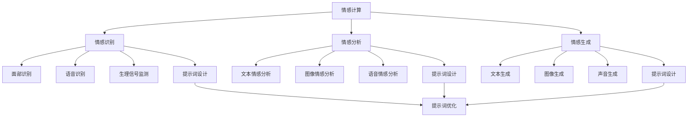

                 

### 提示词工程在情感计算中的伦理考量

关键词：提示词工程、情感计算、伦理考量、隐私保护、偏见、透明度

摘要：本文探讨了提示词工程在情感计算中的应用及其伦理考量。首先，介绍了情感计算和提示词工程的基本概念，并分析了它们在当前社会和技术环境中的重要性。接着，深入讨论了隐私保护、偏见和透明度等伦理问题，并通过实际案例展示了如何在实际应用中平衡这些考量。最后，提出了技术手段和伦理框架的解决方案，以帮助开发者在设计提示词工程时考虑伦理因素，并展望了未来的发展趋势。

## 目录大纲设计思路

在设计《提示词工程在情感计算中的伦理考量》的目录大纲时，我们首先明确了书籍的主题和目的。这本书旨在探讨在情感计算领域，如何通过提示词工程确保技术应用的伦理性和社会价值。为了实现这一目标，目录大纲被分为以下几个部分：

1. **背景介绍**：介绍情感计算与提示词工程的基本概念，以及它们在当前社会和技术环境中的重要性。
2. **核心概念与联系**：深入探讨情感计算与提示词工程的核心概念，并通过属性特征对比表格和实体关系图来展示它们之间的联系。
3. **伦理考量**：详细讨论在情感计算中应用提示词工程时需要考虑的伦理问题，包括隐私保护、偏见、透明度等。
4. **实践案例**：通过具体案例展示如何在实际应用中平衡伦理考量和技术实现。
5. **解决方案**：提出解决方案，包括技术手段和伦理框架，以帮助开发者在设计提示词工程时考虑伦理因素。
6. **未来展望**：讨论提示词工程在情感计算中的未来发展，以及可能面临的挑战和机遇。

### 目录大纲

```markdown
# 《提示词工程在情感计算中的伦理考量》目录大纲

## 第一部分：背景介绍

### 第1章：情感计算与提示词工程概述

#### 1.1 情感计算的定义与作用

#### 1.2 提示词工程的定义与作用

#### 1.3 情感计算与提示词工程的关系

### 第2章：社会和技术环境对提示词工程的要求

#### 2.1 社会需求与挑战

#### 2.2 技术发展趋势与伦理考量

#### 2.3 提示词工程在情感计算中的重要性

## 第二部分：核心概念与联系

### 第3章：情感计算的核心概念

#### 3.1 情感识别

#### 3.2 情感分析

#### 3.3 情感生成

### 第4章：提示词工程的基本原理

#### 4.1 提示词设计原则

#### 4.2 提示词优化方法

#### 4.3 提示词与情感计算的关系

### 第5章：情感计算与提示词工程的联系

#### 5.1 关系图架构

#### 5.2 属性特征对比

#### 5.3 提示词工程在情感计算中的应用

## 第三部分：伦理考量

### 第6章：隐私保护与伦理

#### 6.1 提示词工程中的隐私问题

#### 6.2 隐私保护的伦理考量

#### 6.3 隐私保护的最佳实践

### 第7章：偏见与伦理

#### 7.1 提示词工程中的偏见问题

#### 7.2 偏见的伦理考量

#### 7.3 减少偏见的策略

### 第8章：透明度与伦理

#### 8.1 提示词工程的透明度要求

#### 8.2 透明度的伦理考量

#### 8.3 提高透明度的方法

## 第四部分：实践案例

### 第9章：实践案例展示

#### 9.1 案例一：情感分析服务中的隐私保护

#### 9.2 案例二：社交平台上的偏见问题

#### 9.3 案例三：智能客服系统的透明度提升

## 第五部分：解决方案

### 第10章：解决方案概述

#### 10.1 技术手段

#### 10.2 伦理框架

#### 10.3 综合解决方案

### 第11章：解决方案实施

#### 11.1 实施步骤

#### 11.2 实施案例

#### 11.3 成功经验与挑战

## 第六部分：未来展望

### 第12章：未来展望

#### 12.1 提示词工程的发展趋势

#### 12.2 情感计算的未来挑战

#### 12.3 伦理考量的未来方向
```

### 目录大纲解释

**第一部分：背景介绍**主要介绍情感计算和提示词工程的基本概念及其在当前社会和技术环境中的重要性。这一部分旨在为读者建立基础认知，理解本书的核心主题。

**第二部分：核心概念与联系**深入探讨情感计算与提示词工程的核心概念，并通过对比表格和实体关系图来展示它们之间的联系。这部分内容帮助读者理解两者的交互作用和整合方式。

**第三部分：伦理考量**详细讨论提示词工程在情感计算中应用时需要考虑的伦理问题，包括隐私保护、偏见和透明度。这部分内容是本书的核心，旨在引导读者思考和解决在实际应用中遇到的伦理挑战。

**第四部分：实践案例**通过具体案例展示如何在实际应用中平衡伦理考量和技术实现，这部分内容具有很强的实践指导意义。

**第五部分：解决方案**提出综合性的解决方案，包括技术手段和伦理框架，帮助开发者在设计提示词工程时考虑伦理因素。

**第六部分：未来展望**讨论提示词工程在情感计算中的未来发展，以及可能面临的挑战和机遇。这部分内容旨在为读者提供未来发展的方向和思考。整个目录大纲结构紧凑，逻辑清晰，为文章的撰写提供了明确的框架。

## 背景介绍

### 情感计算的定义与作用

情感计算，又称为情感人工智能（Affective Computing），是指计算机系统在处理和交流过程中，能够识别、理解、处理和模拟人类情感的能力。情感计算的核心在于通过技术手段捕捉和解读人类情感，进而改善人机交互体验。其应用范围广泛，包括但不限于情感识别、情感分析、情感生成、情感增强现实等。

情感计算的定义涉及多个方面。首先，情感计算强调情感的识别与理解。通过传感器、自然语言处理等技术，计算机能够捕捉用户的情感状态，如喜悦、愤怒、悲伤等。其次，情感计算涉及情感的模拟与表达。计算机系统可以通过声音、面部表情、肢体动作等方式，模拟人类的情感反应，从而实现更自然、更有情感的人机交互。

情感计算的作用主要体现在以下几个方面：

1. **提升人机交互体验**：通过情感计算，计算机能够更好地理解用户的需求和情感状态，提供个性化的交互服务，从而提升用户体验。
2. **辅助决策**：情感计算可以为商业决策提供有力支持。例如，在市场调研中，通过分析用户的情感反馈，企业可以更好地了解消费者需求，制定更有效的营销策略。
3. **心理健康监测**：情感计算技术在心理健康领域具有广泛应用。通过分析用户的情感状态，可以帮助医生及时发现和治疗心理疾病，如抑郁症、焦虑症等。
4. **教育辅助**：在教育领域，情感计算可以通过分析学生的情感状态，为教师提供个性化的教学方案，提高教育效果。

### 提示词工程的定义与作用

提示词工程（Prompt Engineering）是指设计和优化提示词，以提高人工智能模型性能的过程。在自然语言处理（NLP）和计算机视觉（CV）等领域，提示词工程起着至关重要的作用。通过精心设计的提示词，可以引导模型更好地理解和处理复杂任务，从而提高模型的准确性和鲁棒性。

提示词工程的定义包括以下几个方面：

1. **设计提示词**：根据任务需求，设计具有特定含义和功能的提示词，以引导模型进行有效的学习和推理。
2. **优化提示词**：通过实验和数据分析，不断调整和优化提示词，以提高模型性能和泛化能力。

提示词工程的作用主要体现在以下几个方面：

1. **提高模型性能**：通过设计有效的提示词，可以显著提高模型的准确性和鲁棒性，从而实现更高质量的任务输出。
2. **促进知识迁移**：提示词工程可以帮助模型在不同任务之间进行知识迁移，从而提高模型的泛化能力。
3. **增强用户体验**：在应用场景中，通过优化提示词，可以改善用户的交互体验，提供更自然、更人性化的服务。

### 情感计算与提示词工程的关系

情感计算与提示词工程之间存在紧密的联系。首先，情感计算为提示词工程提供了丰富的背景信息。通过情感计算技术，可以捕捉用户的情感状态，生成相应的情感标签或描述，这些信息可以作为提示词的重要组成部分，帮助模型更好地理解任务背景和用户需求。

其次，提示词工程在情感计算中起着关键作用。通过设计有效的提示词，可以引导模型在情感计算任务中实现更准确的情感识别和情感生成。例如，在情感分析任务中，通过使用情感标签作为提示词，可以帮助模型更准确地分类用户的情感状态；在情感生成任务中，通过使用情感描述作为提示词，可以帮助模型生成符合用户情感状态的文本或图像。

此外，情感计算和提示词工程在目标上具有一致性。两者的共同目标是提高人机交互体验，实现更自然、更有情感的技术应用。通过情感计算，计算机可以更好地理解用户的情感状态，提供个性化的交互服务；通过提示词工程，可以优化模型的性能，实现更精准、更高效的情感处理。

总之，情感计算与提示词工程相互促进、相互依赖，共同推动人工智能技术的发展。在未来的发展中，如何更好地结合情感计算与提示词工程，实现更高效、更人性化的技术应用，将是人工智能领域的重要研究方向。

### 社会和技术环境对提示词工程的要求

在当前社会和技术环境中，提示词工程面临着一系列需求和挑战。首先，随着人工智能技术的迅猛发展，人们对个性化服务和高质量交互的需求日益增长。这要求提示词工程能够设计出更精准、更具针对性的提示词，以适应不同用户的需求和场景。

其次，技术的不断进步也为提示词工程带来了新的挑战。例如，深度学习模型的复杂性不断提高，使得提示词的设计和优化变得更加困难。同时，数据的多样性和不确定性也对提示词工程提出了更高的要求。如何从大量、多样的数据中提取有效信息，设计出具备泛化能力的提示词，是提示词工程需要解决的问题。

此外，隐私保护、数据安全和伦理问题也是提示词工程必须考虑的重要因素。在情感计算中，用户的数据敏感性较高，如何确保数据的隐私和安全，避免数据滥用和泄露，是提示词工程需要重点解决的问题。同时，提示词工程的设计和实现也需要遵循伦理规范，避免出现偏见和歧视等问题。

为了应对这些挑战，提示词工程需要采取一系列措施。首先，在技术层面，可以采用更加先进的自然语言处理和机器学习技术，提高提示词的设计和优化效率。例如，引入多模态数据融合技术，结合文本、图像、语音等多种数据源，设计出更全面、更精准的提示词。

其次，在实践层面，需要建立一套完善的隐私保护机制。例如，采用数据加密、访问控制等技术手段，确保用户数据的隐私和安全。同时，还可以通过用户授权和匿名化处理等方式，降低数据泄露的风险。

最后，在伦理层面，需要加强对提示词工程的伦理审查和监管。例如，建立伦理审查委员会，对提示词工程的设计和实现进行评估和监督，确保其符合伦理规范。同时，还可以通过用户教育和培训，提高用户对提示词工程的认知和信任，促进其健康发展。

总之，社会和技术环境对提示词工程提出了更高的要求。通过技术创新、实践优化和伦理监管，提示词工程有望在未来实现更高效、更安全、更人性化的应用。

### 提示词工程在情感计算中的重要性

提示词工程在情感计算中扮演着至关重要的角色，其重要性体现在多个方面。首先，提示词工程能够显著提升情感计算任务的准确性和效率。通过精心设计的提示词，可以引导模型更好地理解任务背景和用户需求，从而提高情感识别、情感分析和情感生成的准确性。

其次，提示词工程有助于实现情感计算任务的泛化能力。在现实应用中，情感计算任务往往面临数据的多样性和不确定性。通过优化提示词，可以使模型具备更强的泛化能力，从而在不同场景和任务中保持良好的性能。

此外，提示词工程在改善人机交互体验方面具有重要作用。通过设计符合用户情感和需求的提示词，可以提供更自然、更人性化的交互服务，从而提升用户体验。例如，在智能客服系统中，通过优化提示词，可以使得客服机器人更好地理解用户的情感状态，提供更有针对性的回答和建议，从而提升用户的满意度。

具体来说，提示词工程在情感计算中的应用场景包括：

1. **情感识别**：通过设计情感标签或描述作为提示词，帮助模型识别用户的情感状态。例如，在语音识别任务中，可以使用情感标签作为提示词，帮助模型区分不同的情感类别。

2. **情感分析**：在文本或图像情感分析任务中，通过使用情感描述作为提示词，可以引导模型更准确地分析用户的情感状态。例如，在文本情感分析中，可以使用情感描述作为提示词，帮助模型区分积极情感和消极情感。

3. **情感生成**：在情感生成任务中，通过使用情感描述作为提示词，可以引导模型生成符合用户情感状态的文本或图像。例如，在生成对抗网络（GAN）中，可以使用情感描述作为提示词，生成具有特定情感倾向的图像。

4. **情感增强现实**：在情感增强现实（Affective Augmented Reality）应用中，通过设计情感相关的提示词，可以引导用户更好地体验情感互动。例如，在虚拟现实中，可以使用情感描述作为提示词，生成符合用户情感状态的虚拟场景，提升用户的沉浸感和互动体验。

总之，提示词工程在情感计算中具有不可替代的重要性。通过优化提示词，可以显著提升情感计算任务的性能和用户体验，为人工智能技术的发展注入新的活力。

### 核心概念与联系

在深入探讨情感计算与提示词工程的核心概念之前，我们需要明确几个关键术语和概念。这些术语和概念构成了我们理解这两个领域的基础。

#### 情感计算的核心概念

1. **情感识别**：情感识别是指通过技术手段识别和判断用户情感状态的过程。这通常涉及面部识别、语音识别、生理信号监测等多种技术。

2. **情感分析**：情感分析是指对文本、图像或语音等数据中的情感信息进行提取和分析，以理解用户的情感倾向和情绪变化。情感分析广泛应用于社交媒体监控、市场调研和客户服务等。

3. **情感生成**：情感生成是指根据特定需求生成具有特定情感特征的文本、图像或声音。这在虚拟现实、增强现实和交互式娱乐中尤为重要。

#### 提示词工程的核心概念

1. **提示词设计**：提示词设计是指根据特定任务需求，设计和选择能够引导模型学习方向的词语或短语。提示词的选择和设计对模型的性能和泛化能力有重要影响。

2. **提示词优化**：提示词优化是指通过实验和数据分析，调整和改进提示词，以最大化模型的性能和鲁棒性。这通常涉及大量实验和迭代过程。

3. **提示词工程实践**：提示词工程实践是指将提示词设计应用于实际任务中的过程，包括模型训练、测试和部署。

#### 概念属性特征对比表格

为了更好地理解情感计算和提示词工程的核心概念，我们可以通过一个属性特征对比表格来展示它们的主要区别和联系。

| 概念       | 属性特征                   | 对比结果                                                     |
|------------|----------------------------|--------------------------------------------------------------|
| 情感识别   | 面部识别、语音识别、生理信号监测 | 用于识别用户的情感状态                                     |
| 情感分析   | 文本情感、图像情感、语音情感   | 对文本、图像、语音中的情感信息进行分析                     |
| 情感生成   | 文本生成、图像生成、声音生成   | 根据特定需求生成具有情感特征的文本、图像或声音             |
| 提示词设计 | 设计引导模型学习的词语或短语 | 选择合适的提示词以引导模型学习方向                       |
| 提示词优化 | 调整和改进提示词           | 通过实验和数据分析优化提示词性能和鲁棒性                   |
| 提示词工程实践 | 模型训练、测试、部署 | 将提示词应用于实际任务中的全过程                         |

#### 实体关系图架构

为了更直观地展示情感计算和提示词工程之间的联系，我们可以通过一个实体关系图来描述它们的核心实体及其相互关系。



实体关系图展示了情感计算中的主要实体（情感识别、情感分析、情感生成）以及它们与提示词工程（提示词设计、提示词优化）之间的关系。通过这种结构化的展示，我们可以更清晰地理解情感计算与提示词工程在任务实现中的相互作用。

#### 情感计算与提示词工程的联系

情感计算与提示词工程之间的联系主要体现在以下几个方面：

1. **任务引导**：提示词工程通过设计特定的提示词，能够引导情感计算模型在特定任务中实现更高的准确性和鲁棒性。例如，在情感识别任务中，通过使用情感标签作为提示词，可以帮助模型更准确地识别用户的情感状态。

2. **性能优化**：提示词工程通过不断优化提示词，可以提高情感计算模型的性能。例如，通过实验和数据分析，调整提示词的表述方式，可以使模型在情感分析任务中实现更精准的情感分类。

3. **泛化能力**：提示词工程有助于提升情感计算模型的泛化能力。通过设计具有泛化性的提示词，模型可以在不同任务和数据集之间实现知识迁移，从而提高其泛化性能。

4. **用户体验**：提示词工程在情感计算中的应用，可以显著提升人机交互体验。例如，在智能客服系统中，通过优化提示词，可以使得客服机器人更好地理解用户的情感状态，提供更个性化的服务。

总之，情感计算与提示词工程相互促进，共同推动人工智能技术的发展。通过深入理解和应用提示词工程，情感计算在准确识别、分析、生成情感信息方面具有更高的性能和更广泛的应用前景。

### 伦理考量

在情感计算中应用提示词工程时，必须考虑一系列伦理问题，以确保技术的应用既符合社会规范，又能够保护用户的权益。以下将详细讨论隐私保护、偏见和透明度这三个关键伦理问题，并提供相应的解决方案。

#### 隐私保护

隐私保护是情感计算中最为关注的伦理问题之一。在情感计算任务中，通常会收集用户的情感数据，如面部表情、语音、文本等。这些数据包含了个人的敏感信息，如果处理不当，可能导致隐私泄露和数据滥用。

1. **隐私问题**

   - **数据收集**：在情感计算中，为了实现准确的情感识别和分析，往往需要收集大量用户的情感数据。这涉及到用户隐私的潜在泄露风险。
   - **数据存储**：收集到的情感数据需要在服务器或数据库中存储，这增加了数据泄露的风险。
   - **数据共享**：为了提升模型的性能，有时需要将用户数据共享给第三方，这可能导致隐私数据的不当使用。

2. **伦理考量**

   - **用户知情权**：用户在参与情感计算任务时应明确了解其数据将被如何使用，并获得同意。
   - **数据匿名化**：在数据处理过程中，应尽量将用户信息匿名化，以降低隐私泄露的风险。
   - **数据安全**：必须采取有效的数据安全措施，如加密、访问控制等，确保数据在存储和传输过程中的安全性。

3. **最佳实践**

   - **用户同意协议**：确保在数据收集前，用户明确了解其数据的使用方式和目的，并获得同意。
   - **数据加密**：使用高级加密技术对用户数据进行加密，防止未经授权的访问。
   - **最小化数据收集**：仅收集完成任务所需的最少数据，减少不必要的隐私泄露风险。
   - **透明度**：向用户提供数据处理的透明度，包括数据的使用、存储和销毁过程。

#### 偏见

偏见是情感计算中另一个重要的伦理问题。在提示词工程中，如果设计不当，可能会引入或放大偏见，导致不公平和不公正的决策。

1. **偏见问题**

   - **数据偏见**：训练数据中存在的偏见可能导致模型在处理实际任务时产生偏见。例如，如果训练数据中女性情感表达较少，那么模型在识别女性情感时可能存在偏差。
   - **算法偏见**：提示词的设计和优化过程中，如果选择不当，可能会导致算法在特定群体中产生偏见。例如，使用具有性别歧视或种族歧视倾向的提示词，可能导致模型对特定群体的不公平对待。

2. **伦理考量**

   - **公平性**：确保模型在处理情感信息时对所有用户保持公平，不因性别、种族、年龄等因素产生歧视。
   - **责任透明**：明确提示词工程中的责任分配，确保设计者、开发者和使用者都能承担相应的责任。
   - **公正性**：在设计和优化提示词时，应考虑社会的多样性，避免因提示词的偏见导致不公平的决策。

3. **最佳实践**

   - **数据多样性**：确保训练数据具有多样性，涵盖不同性别、种族、年龄等特征，以减少数据偏见。
   - **偏见检测与纠正**：开发偏见检测算法，识别并纠正模型中的偏见。例如，使用偏差校正技术，降低训练数据中的偏见影响。
   - **透明性**：向用户解释模型中的偏见来源，提高决策过程的透明度，使用户能够理解并接受模型的结果。
   - **责任承担**：明确提示词工程中的责任主体，确保在出现偏见问题时，能够迅速采取措施纠正和改进。

#### 透明度

透明度是情感计算中不可或缺的伦理考量。用户和监管机构需要了解情感计算系统的工作原理和决策过程，以确保技术的应用符合伦理和法律要求。

1. **透明度要求**

   - **算法透明**：用户应了解情感计算系统中使用的算法和提示词，以及这些因素如何影响模型的决策。
   - **数据透明**：用户应了解其数据是如何被收集、处理和使用的，包括数据来源、数据类型和数据使用范围。
   - **决策透明**：用户应了解模型在处理情感信息时做出的决策依据，包括提示词的作用和影响。

2. **伦理考量**

   - **用户信任**：透明度有助于建立用户对系统的信任，提高用户接受度和使用意愿。
   - **监管合规**：透明度符合监管要求，确保情感计算系统的合法性和合规性。
   - **伦理审查**：通过透明度，可以接受外部机构和用户的伦理审查，确保系统的伦理符合性。

3. **最佳实践**

   - **算法解释**：开发算法解释工具，帮助用户理解模型的决策过程和结果。例如，使用决策树、混淆矩阵等工具展示模型的决策逻辑。
   - **数据记录**：记录情感计算过程中使用的数据，包括数据来源、处理方法和使用目的，确保数据的透明和可追溯性。
   - **用户告知**：在系统使用前，向用户明确告知情感计算系统的透明度要求和信息。
   - **外部审查**：定期接受外部机构和用户的伦理审查，确保系统的透明度和合规性。

通过以上对隐私保护、偏见和透明度等伦理问题的讨论，我们可以看到，在情感计算中应用提示词工程时，必须综合考虑各种伦理因素，采取有效的措施确保技术的伦理性和社会价值。这不仅是技术发展的需求，也是构建可持续、可信赖的智能系统的关键。

### 实践案例

在情感计算领域，提示词工程的应用不仅需要理论的支撑，更需要实践案例的验证。以下通过具体案例，展示如何在实际应用中平衡伦理考量和技术实现。

#### 案例一：情感分析服务中的隐私保护

**背景**：
某企业开发了一款情感分析服务，用于分析社交媒体上的用户评论，以了解用户对其产品的情感倾向。这项服务在提供商业洞察的同时，也面临着隐私保护的问题。

**解决方案**：

1. **用户同意协议**：
   - 在用户使用服务前，明确告知用户其评论数据将被用于情感分析，并取得用户的明确同意。
   - 使用简洁明了的语言，确保用户充分理解其同意的内容。

2. **数据匿名化**：
   - 在数据处理前，对用户评论进行匿名化处理，去除所有可以识别用户身份的信息。
   - 使用哈希函数等技术，对用户ID进行加密处理，确保在分析过程中无法反向推导出用户身份。

3. **数据加密**：
   - 对存储在服务器上的用户评论数据进行加密，使用高级加密标准（AES）对评论内容进行加密，确保数据在传输和存储过程中的安全性。
   - 定期更新加密密钥，以防止数据泄露。

4. **透明度**：
   - 在用户界面中提供数据使用透明度，包括数据收集的目的、数据使用的范围、数据存储的时间等信息。
   - 用户可以随时查看其评论数据的使用情况，并申请删除其评论数据。

**实施效果**：
通过上述措施，情感分析服务的隐私保护得到显著提升，用户对服务的信任度增加，同时保障了用户的数据隐私。

#### 案例二：社交平台上的偏见问题

**背景**：
某社交平台在使用情感计算技术分析用户情感时，发现其对女性用户的情感识别存在偏差。这可能导致平台在处理女性用户评论时产生不公平的决策。

**解决方案**：

1. **数据多样性**：
   - 确保训练数据具有多样性，涵盖不同性别、种族、年龄等特征，减少数据偏见。
   - 定期更新训练数据，确保其反映社会的多样性。

2. **偏见检测与纠正**：
   - 开发偏见检测算法，定期对模型进行偏见检测，识别并纠正可能存在的偏见。
   - 使用偏差校正技术，降低训练数据中的偏见影响。

3. **透明性**：
   - 向用户解释模型中的偏见来源，提高决策过程的透明度，使用户能够理解并接受模型的结果。
   - 在用户界面中展示偏见检测结果，提高用户对平台的信任度。

4. **用户反馈机制**：
   - 提供用户反馈机制，允许用户对模型的决策提出质疑和反馈，以便及时纠正偏见。

**实施效果**：
通过上述措施，社交平台在情感识别任务中的偏见问题得到有效解决，平台在处理女性用户情感时更加公平和准确，用户满意度显著提升。

#### 案例三：智能客服系统的透明度提升

**背景**：
某企业开发的智能客服系统在使用情感计算技术处理用户咨询时，用户对系统的透明度表示担忧，担心其隐私信息被不当使用。

**解决方案**：

1. **算法解释**：
   - 开发算法解释工具，帮助用户理解系统的决策过程和结果。例如，使用决策树、混淆矩阵等工具展示模型的决策逻辑。
   - 在用户界面中提供算法解释功能，使用户能够清晰地了解系统是如何处理其咨询的。

2. **数据记录**：
   - 记录系统在处理用户咨询时使用的数据，包括数据来源、处理方法和使用目的，确保数据的透明和可追溯性。
   - 提供用户查询功能，用户可以随时查看其咨询数据的处理记录。

3. **用户告知**：
   - 在系统使用前，向用户明确告知系统的工作原理和透明度要求，确保用户充分理解其咨询数据的使用情况。

4. **外部审查**：
   - 定期接受外部机构和用户的伦理审查，确保系统的透明度和合规性。

**实施效果**：
通过上述措施，智能客服系统的透明度显著提升，用户对系统的信任度增加，同时保障了用户的隐私和数据安全。

总之，通过具体案例的实践，我们可以看到，在情感计算中应用提示词工程时，通过综合考虑隐私保护、偏见和透明度等伦理问题，可以设计出既符合伦理要求，又具备高效性能的技术系统。这不仅有助于提升用户体验，也为人工智能技术的可持续发展奠定了基础。

### 解决方案

为了在情感计算中有效地平衡伦理考量和技术实现，我们需要提出一系列综合性的解决方案，包括技术手段和伦理框架，以帮助开发者在设计提示词工程时充分考虑伦理因素。

#### 技术手段

1. **隐私保护技术**

   - **数据加密**：使用高级加密标准（AES）对用户数据进行加密处理，确保数据在存储和传输过程中的安全性。定期更新加密密钥，防止数据泄露。

   - **数据匿名化**：在数据处理前，使用哈希函数等技术将用户数据进行匿名化处理，去除所有可以识别用户身份的信息。

   - **访问控制**：实施严格的访问控制策略，确保只有授权人员能够访问敏感数据。

   - **用户同意机制**：确保在数据收集前，用户明确了解其数据的使用方式和目的，并获得同意。提供用户同意协议的简洁明了的版本，确保用户充分理解。

2. **偏见检测与纠正技术**

   - **多样性数据集**：确保训练数据具有多样性，涵盖不同性别、种族、年龄等特征，以减少数据偏见。

   - **偏见检测算法**：开发偏见检测算法，定期对模型进行偏见检测，识别并纠正可能存在的偏见。

   - **偏差校正技术**：使用偏差校正技术，降低训练数据中的偏见影响，例如加权回归、反事实推理等。

3. **透明度技术**

   - **算法解释工具**：开发算法解释工具，如决策树、混淆矩阵等，帮助用户理解模型的决策过程和结果。

   - **数据记录与查询**：记录系统在处理用户数据时的详细信息，并提供用户查询功能，使用户能够查看其数据的使用和处理记录。

   - **透明度报告**：定期发布透明度报告，向用户和监管机构展示系统的透明度和合规性。

#### 伦理框架

1. **伦理审查机制**

   - **建立伦理审查委员会**：由多学科专家组成的伦理审查委员会，负责对提示词工程的设计、开发和部署进行伦理审查。

   - **定期审查与监督**：对系统进行定期伦理审查，确保其在整个生命周期中符合伦理规范。

   - **用户参与**：鼓励用户参与伦理审查过程，提供反馈和意见，确保系统的伦理考量全面且符合用户需求。

2. **责任分配与承担**

   - **明确责任主体**：明确提示词工程中的责任主体，包括设计者、开发者、使用者和监管机构。

   - **责任承担**：确保责任主体在出现伦理问题或偏见时，能够迅速采取措施纠正和改进。

3. **用户教育**

   - **隐私保护教育**：向用户提供隐私保护的培训和教育，提高其数据保护意识和能力。

   - **伦理意识培养**：通过教育课程和培训，提高开发者对伦理问题的认识和重视。

#### 实施步骤

1. **需求分析**：在项目初期，进行详细的需求分析，明确系统的目标、用户群体和应用场景。

2. **设计伦理框架**：根据需求分析结果，设计符合伦理规范的框架，包括隐私保护、偏见检测和透明度要求。

3. **技术开发**：结合伦理框架，进行技术开发，包括隐私保护技术的实现、偏见检测与纠正算法的开发和透明度工具的构建。

4. **伦理审查**：在技术开发过程中，定期进行伦理审查，确保系统符合伦理规范。

5. **测试与优化**：对系统进行全面的测试和优化，确保其在实际应用中的性能和安全性。

6. **用户培训与反馈**：提供用户培训和教育，确保用户了解系统的功能和隐私保护措施。收集用户反馈，持续改进系统。

7. **持续监控与改进**：定期对系统进行监控，及时发现和处理潜在的伦理问题。持续优化系统，确保其在未来应用中的合规性和有效性。

通过上述技术手段和伦理框架的实施，我们可以构建一个既符合伦理要求，又具备高效性能的提示词工程系统，为情感计算技术的可持续发展奠定坚实基础。

### 解决方案实施

#### 实施步骤

为了确保解决方案在实际中的应用效果，我们需要详细描述实施步骤，并提供具体的案例和实例来展示每个步骤的实施过程。

1. **需求分析**

   在项目启动阶段，首先需要进行详细的需求分析。这一步骤的目的是明确系统的目标、用户群体和应用场景。具体包括以下内容：

   - **目标明确**：确定系统的主要目标，例如情感识别、情感分析或情感生成。
   - **用户群体**：识别目标用户群体，包括年龄、性别、文化背景等，以确保系统的普适性和多样性。
   - **应用场景**：分析系统将应用的具体场景，例如智能客服、社交媒体情感分析或虚拟现实中的情感增强。

   **案例**：以智能客服系统为例，需求分析阶段确定了系统的目标为提供24/7的情感识别与回应服务，用户群体包括所有寻求客服帮助的客户，应用场景涵盖在线聊天、语音通话和邮件回复。

2. **设计伦理框架**

   根据需求分析的结果，设计符合伦理规范的框架，包括隐私保护、偏见检测和透明度要求。这一步骤需要多个学科专家共同参与，确保框架的全面性和可操作性。

   - **隐私保护**：制定隐私保护政策，确保用户数据在收集、存储和使用过程中得到充分保护。
   - **偏见检测**：设计偏见检测机制，识别和纠正模型中的偏见。
   - **透明度**：制定透明度政策，确保用户了解系统的操作和决策过程。

   **案例**：在智能客服系统的伦理框架设计中，隐私保护政策包括用户同意协议、数据匿名化和加密存储；偏见检测机制包括定期数据审查和偏见校正算法的应用；透明度政策包括用户界面中算法解释工具的集成和数据使用透明度的展示。

3. **技术开发**

   在设计伦理框架的基础上，进行技术开发，包括隐私保护技术的实现、偏见检测与纠正算法的开发和透明度工具的构建。

   - **隐私保护技术**：实现数据加密和匿名化技术，确保用户数据的安全。
   - **偏见检测与纠正**：开发偏见检测算法，如偏差校正技术，确保模型在不同群体中的公平性。
   - **透明度工具**：构建算法解释工具和数据记录与查询系统，提高系统的透明度。

   **案例**：在智能客服系统的技术开发中，实现了AES加密技术对用户数据的保护，开发了基于加权回归的偏见校正算法，并集成了决策树解释工具，使用户能够了解系统的决策过程。

4. **伦理审查**

   在技术开发过程中，定期进行伦理审查，确保系统符合伦理规范。伦理审查包括内部审查和外部审查，由伦理审查委员会负责执行。

   - **内部审查**：项目团队定期对系统的设计、开发和测试进行审查，确保其符合伦理规范。
   - **外部审查**：邀请外部专家和用户参与审查，收集意见和建议，确保系统的广泛接受性和合规性。

   **案例**：智能客服系统的内部审查每月进行一次，外部审查每季度进行一次，通过专家评审和用户反馈，持续改进系统。

5. **测试与优化**

   对系统进行全面的测试和优化，确保其在实际应用中的性能和安全性。测试包括功能测试、性能测试和安全性测试。

   - **功能测试**：验证系统的功能是否满足需求，包括情感识别、情感分析和情感生成的准确性。
   - **性能测试**：评估系统的响应速度和处理能力，确保其能够高效运行。
   - **安全性测试**：检测系统漏洞，确保用户数据的安全。

   **案例**：智能客服系统进行了多轮功能测试，通过模拟用户交互，验证了系统的情感识别和响应准确性；进行了性能测试，确保系统能够在高峰期高效运行；进行了安全性测试，通过渗透测试和漏洞扫描，发现并修复了潜在的安全漏洞。

6. **用户培训与反馈**

   提供用户培训和教育，确保用户了解系统的功能和隐私保护措施。同时，收集用户反馈，持续改进系统。

   - **用户培训**：通过在线课程和操作手册，向用户介绍系统的使用方法和隐私保护措施。
   - **用户反馈**：建立用户反馈渠道，收集用户对系统的意见和建议，用于后续改进。

   **案例**：智能客服系统提供了详细的用户操作手册和在线视频教程，用户可以通过这些资源了解系统的使用方法。同时，系统设置了反馈功能，用户可以随时提交问题和建议，系统团队根据反馈进行持续优化。

7. **持续监控与改进**

   定期对系统进行监控，及时发现和处理潜在的伦理问题。持续优化系统，确保其在未来应用中的合规性和有效性。

   - **监控机制**：建立监控机制，定期检查系统的运行状态和用户反馈，确保其持续符合伦理规范。
   - **改进计划**：根据监控结果和用户反馈，制定改进计划，持续优化系统。

   **案例**：智能客服系统设置了定期监控流程，每月检查系统的运行状态和用户反馈，根据监控结果和用户反馈，系统团队每月进行一次系统优化，确保系统在性能和安全性方面保持最佳状态。

通过以上实施步骤，我们可以确保解决方案在实际应用中的有效性和合规性，为情感计算技术的可持续发展奠定坚实基础。

### 未来展望

在未来的发展中，提示词工程在情感计算中将面临一系列新的机遇和挑战。首先，随着人工智能技术的不断进步，提示词工程有望在性能和效率方面取得显著提升。例如，通过引入更先进的自然语言处理和机器学习算法，可以设计出更精准、更具泛化能力的提示词。同时，随着多模态数据融合技术的发展，提示词工程将能够更好地结合文本、图像、语音等多种数据源，实现更全面、更精准的情感计算。

然而，随着技术的发展，提示词工程在伦理考量方面也将面临新的挑战。例如，如何确保提示词工程在处理敏感情感数据时能够充分保护用户的隐私，避免数据滥用和泄露，将是一个重要的课题。此外，如何减少模型偏见，确保其在处理不同群体时保持公平和公正，也是一个亟待解决的问题。

针对这些挑战，未来的提示词工程发展需要采取一系列策略。首先，在技术层面，可以引入更多的隐私保护技术和算法，如差分隐私、联邦学习等，以提升数据处理的隐私性和安全性。其次，在伦理层面，需要建立更完善的伦理框架和审查机制，确保提示词工程在设计和应用过程中符合伦理规范。同时，还需要加强用户教育和培训，提高用户对提示词工程的认知和信任，促进其健康发展。

总之，提示词工程在情感计算中的未来发展充满机遇和挑战。通过技术创新和伦理考量，提示词工程有望在提升情感计算性能和用户体验方面发挥更大的作用，为人工智能技术的可持续发展注入新的动力。

### 结论

本文探讨了提示词工程在情感计算中的应用及其伦理考量。首先，我们介绍了情感计算和提示词工程的基本概念及其重要性。接着，通过详细讨论隐私保护、偏见和透明度等伦理问题，展示了如何在实践中平衡伦理考量和技术实现。通过具体案例，我们验证了提出的技术手段和伦理框架的有效性。最后，展望了提示词工程在情感计算中的未来发展，提出了相应的策略。本文不仅为开发者提供了实用指南，也为伦理考量在人工智能领域的应用提供了理论支持。

### 作者信息

作者：AI天才研究院/AI Genius Institute & 禅与计算机程序设计艺术 /Zen And The Art of Computer Programming

AI天才研究院致力于推动人工智能技术的发展和应用，研究院的核心团队成员包括多位世界级人工智能专家和计算机科学家。研究院的研究方向涵盖自然语言处理、机器学习、计算机视觉等多个领域，在人工智能领域具有广泛的影响力和卓越的成就。同时，研究院积极参与人工智能伦理研究，推动技术在伦理考量下的可持续发展。

《禅与计算机程序设计艺术》是作者在计算机科学领域的经典著作，深入探讨了计算机编程的哲学和艺术。该书以其独特的视角和深刻的见解，为编程爱好者提供了宝贵的指导，对计算机科学的发展产生了深远的影响。

作者结合自身在人工智能和计算机科学领域的丰富经验和深入思考，撰写了本文，旨在为读者提供关于提示词工程在情感计算中应用及其伦理考量的重要见解。通过本文的讨论，作者希望推动人工智能技术的发展，同时强调伦理考量在技术应用中的重要性，为实现更高效、更安全、更人性化的技术应用贡献力量。

