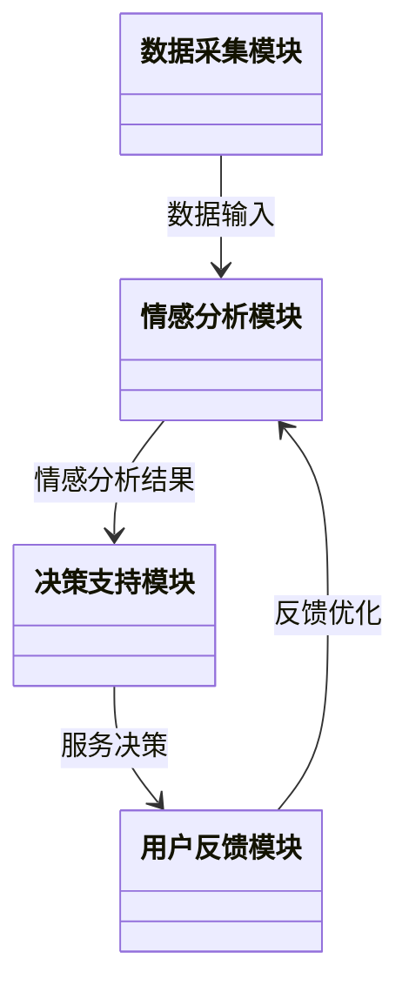
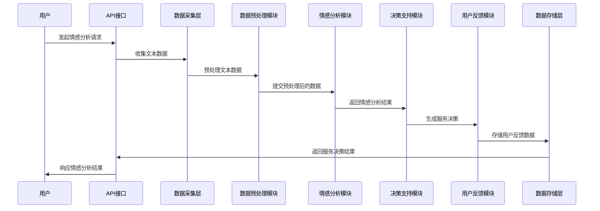

                 

### 情感计算：一种变革性的计算模式

#### 定义与起源

情感计算（Affective Computing）是计算机科学中的一个分支，它关注于如何使计算机具备识别、理解、处理和模拟人类情感的能力。情感计算的定义可以追溯到1995年，由计算机科学家罗纳德·波尔（Rosalind Picard）首次提出。她将情感计算描述为“计算系统中嵌入情感能力的一个研究领域，这些系统能够识别用户的情感状态，并使用这些信息来改进交互体验。”简言之，情感计算旨在使计算机不仅仅是执行任务，而是能够感知和响应用户的情感状态。

#### 关键词

- **情感识别**：通过多种方式，如语音、文字、图像等，计算机能够感知用户的情感状态。
- **情感理解**：计算机需要理解和分析情感信号的复杂性，从而做出合适的反应。
- **情感处理**：计算机必须能够处理和存储情感数据，以便在适当的时候使用。
- **情感模拟**：计算机能够模拟人类的情感，如喜悦、悲伤、愤怒等，以增强用户体验。

#### 发展背景

情感计算的发展背景源于人类对计算机交互的期望不断提升。传统计算机主要依赖于逻辑和理性来处理信息，但人类的行为和决策往往受到情感的影响。为了使计算机更贴近人类，研究者开始探索如何在计算机系统中集成情感因素。这一研究不仅涉及计算机科学，还包括心理学、神经科学、认知科学等多个学科。

#### 意义与应用

情感计算的意义在于它能够极大地提升人机交互的自然性和个性化程度。例如，在医疗领域，情感计算可以帮助医生更好地理解患者的情感状态，从而提供更个性化的治疗方案。在教育领域，情感计算可以分析学生的情感反应，帮助他们克服学习障碍。在商业领域，情感计算可以用于客户服务、市场分析等方面，提高企业的客户满意度和竞争力。

#### 创新应用

随着技术的进步，情感计算的应用场景不断拓展。例如，智能客服系统通过情感计算可以更好地理解客户的情感，提供更加个性化的服务。智能家居系统可以通过分析家庭成员的情感状态，调整室内环境以提供更好的生活体验。甚至在游戏领域，情感计算可以让游戏角色更加真实地模拟人类的情感反应，提升游戏体验。

#### 问题与挑战

尽管情感计算具有巨大的潜力，但在实际应用中仍然面临一些挑战。首先，情感信号是非常复杂的，计算机需要高精度的算法来准确识别和理解这些信号。其次，隐私问题也是一个重要挑战，情感数据涉及到个人的敏感信息，如何保护这些数据的安全性和隐私性是一个亟待解决的问题。最后，道德和伦理问题也需要被充分考虑，特别是在涉及自动化决策和人类情感处理的场景中。

#### 未来展望

随着人工智能和情感计算技术的不断发展，未来计算机将更加智能、更加人性化。我们可以期待，情感计算将在各个领域发挥越来越重要的作用，从医疗、教育、商业到日常生活，都将受到其深远的影响。情感计算将成为连接人类和机器的桥梁，使计算机更好地服务于人类的需求和情感。

### 提示词工程：情感计算的关键工具

#### 定义与核心概念

提示词工程（Keyword Engineering）是情感计算中的一个关键工具，它关注于如何构建、优化和运用关键词来提升情感计算系统的性能。提示词工程的核心概念包括关键词的生成、分类、优化和利用。其目标是确保系统可以准确地理解和处理人类情感的表达。

#### 关键词生成

关键词生成是提示词工程的基础步骤。它涉及从大量的文本数据中提取与情感相关的词汇。通过自然语言处理（NLP）技术，如词频分析、主题建模和情感分析，我们可以识别出与特定情感状态相关的关键词。这一过程通常包括以下几个步骤：

1. **数据收集**：从文本、语音、视频等多媒体数据中收集信息。
2. **预处理**：清洗和标准化数据，例如去除停用词、进行词干提取和词形还原。
3. **特征提取**：利用NLP技术提取情感相关的特征，如情感词汇、情感强度等。
4. **关键词选择**：根据特征的重要性选择最具代表性的关键词。

#### 关键词分类

关键词分类是将提取出的关键词进行归类，以便更好地组织和理解情感表达。常见的分类方法包括基于规则的方法、机器学习方法以及混合方法。例如，可以使用情感分析模型将关键词分为积极情感、消极情感和中性情感三类。分类的准确性对情感计算的最终效果至关重要。

#### 关键词优化

关键词优化是指通过调整和改进关键词的选择和组合，提高情感计算系统的性能。优化过程通常包括以下几个方面：

1. **关键词筛选**：去除无关或冗余的关键词，确保关键词与情感表达的相关性。
2. **关键词权重调整**：根据关键词在情感表达中的重要性分配权重，例如使用TF-IDF（词频-逆文档频率）方法。
3. **关键词组合优化**：通过组合不同关键词来捕捉更复杂的情感状态，如使用“快乐”和“兴奋”来共同表达强烈的积极情感。

#### 提示词工程与情感计算的联系

提示词工程在情感计算中发挥着至关重要的作用。具体来说，它们之间的联系可以从以下几个方面理解：

1. **数据准备**：提示词工程为情感计算提供了关键的数据支持。通过关键词的提取和分类，系统可以更好地理解用户的情感信号。
2. **性能提升**：优化后的提示词能够提高情感计算系统的准确性和响应速度，使系统能够更准确地捕捉和解释情感表达。
3. **交互增强**：提示词工程使得计算机能够更加自然地与人类进行情感交互，提供更加个性化的用户体验。

#### 创新应用

提示词工程在情感计算中的创新应用场景广泛，以下是一些典型的例子：

1. **智能客服**：通过情感计算和提示词工程，智能客服系统能够理解用户的情感需求，提供更加个性化的服务和解决方案。
2. **心理健康应用**：在心理健康应用中，提示词工程可以帮助分析患者的情感状态，为心理治疗师提供有力的决策支持。
3. **人机交互**：在智能音箱、虚拟助手等人机交互设备中，提示词工程可以提升交互的自然性和流畅性。

#### 研究进展与未来方向

当前，提示词工程在情感计算领域已经取得了一些重要的研究成果。例如，深度学习和自然语言处理技术的结合，使得关键词的提取和分类更加精准。未来的研究将重点关注以下几个方面：

1. **跨模态情感计算**：结合多种模态（如文本、语音、图像）的情感数据，提高情感计算系统的全面性和准确性。
2. **小样本学习**：在数据稀缺的情况下，如何通过提示词工程有效地提取和利用情感信息。
3. **隐私保护**：在处理敏感情感数据时，如何确保用户的隐私和数据安全。

### 情感计算与提示词工程：共同促进人机交互的革命

情感计算和提示词工程共同构成了人机交互领域的一次重大变革。通过情感计算，计算机能够感知和理解人类的情感状态，从而提供更加个性化和自然的交互体验。而提示词工程则为情感计算提供了关键的数据支持和性能优化手段。两者相辅相成，相互促进，共同推动了人机交互的发展。

在医疗领域，情感计算和提示词工程的应用已经取得了显著成果。例如，通过分析患者的情感状态，医生可以更好地了解患者的心理需求，从而提供更加个性化的治疗方案。而在教育领域，情感计算可以帮助教师更好地理解学生的学习情感，提供更有针对性的辅导和支持。

在商业领域，情感计算和提示词工程同样发挥了重要作用。智能客服系统通过情感计算和提示词工程，能够准确理解客户的情感需求，提供更加个性化的服务和解决方案，从而提升客户满意度和忠诚度。此外，在市场分析中，情感计算可以帮助企业更好地理解消费者的情感反应，制定更有针对性的市场策略。

总之，情感计算和提示词工程正在不断拓展其应用领域，为各个行业带来深刻的变革。随着技术的不断进步，我们可以期待这些创新应用将更加丰富和多样化，为人类社会带来更多的便利和福祉。

### 提示词工程在情感计算中的创新应用

#### 1. 情感分析中的应用

情感分析是情感计算的核心任务之一，它旨在自动识别和分析文本数据中的情感倾向。提示词工程在这一领域中的应用具有重要意义。通过精细的提示词生成和优化，情感分析系统可以更加准确地捕捉文本中的情感信号。

- **案例分析**：以社交媒体文本分析为例，提示词工程可以通过对大量用户评论和帖子进行情感分析，识别出用户的主观情感状态。例如，通过分析用户对产品的评价，企业可以及时了解产品的受欢迎程度和用户反馈。
- **创新点**：传统的情感分析通常依赖于预定义的情感词典和规则，而提示词工程通过动态生成和优化关键词，使得情感分析能够适应不同的文本场景和情感表达。这种方法不仅提高了情感分析的准确性和灵活性，还能够捕捉到更细微的情感变化。

#### 2. 人机交互中的应用

人机交互是情感计算的重要应用领域，通过提示词工程，人机交互系统能够更好地理解和响应用户的情感需求，提供更加自然和个性化的交互体验。

- **案例分析**：智能语音助手（如苹果的Siri、亚马逊的Alexa）通过提示词工程，可以更准确地理解用户的话语情感，从而提供更加贴心的服务。例如，当用户表示“我很无聊”时，语音助手可以推荐适合用户情绪的音乐或娱乐活动。
- **创新点**：传统的语音识别和语义理解技术主要关注词汇和句法的准确性，而提示词工程则通过情感分析，使得交互系统能够理解用户的情感状态，从而做出更加个性化的响应。这种方法提升了交互的自然性和用户体验。

#### 3. 健康监测中的应用

健康监测是另一个提示词工程在情感计算中创新应用的领域。通过分析生理和行为数据，提示词工程可以帮助识别用户的情绪状态，从而提供个性化的健康建议。

- **案例分析**：智能穿戴设备（如智能手表、智能手环）可以通过记录心率、步数、睡眠质量等生理数据，结合用户的活动和行为数据，利用提示词工程分析用户的情感状态。例如，当用户表现出焦虑或压力过大的迹象时，设备可以提醒用户进行放松练习或提供专业的健康建议。
- **创新点**：传统的健康监测主要关注生理指标的变化，而提示词工程通过情感分析，可以更全面地了解用户的情感健康。这种方法有助于早期发现和预防心理健康问题，为用户提供更加精准和个性化的健康监测服务。

#### 4. 客户服务中的应用

客户服务是商业领域中提示词工程应用的另一个重要领域。通过情感计算和提示词工程，企业可以更好地理解客户的情感需求，提供更加高效和满意的服务。

- **案例分析**：在客户服务中心，通过情感计算分析客户来电的情感状态，客服人员可以更准确地识别客户的问题和需求，提供更有针对性的解决方案。例如，当客户表达愤怒或不满时，客服人员可以迅速采取补救措施，防止客户流失。
- **创新点**：传统的客户服务主要依赖于客服人员的经验和技巧，而提示词工程通过情感分析，使得服务系统能够自动识别客户的情感状态，从而提供更加高效和个性化的服务。这种方法不仅提高了客户满意度，还能够减少客服人员的工作压力。

### 总结与展望

提示词工程在情感计算中的创新应用正在不断拓展其应用范围，从社交媒体分析到人机交互、健康监测再到客户服务，每一个领域都因提示词工程的引入而得到了显著的提升。未来的发展将更加注重跨领域应用、多模态情感计算和隐私保护，进一步提升情感计算系统的准确性和用户体验。通过不断创新和优化，提示词工程将在情感计算领域中发挥更加重要的作用，推动人机交互进入一个新的时代。

### 提示词工程的关键技术与挑战

#### 1. 技术介绍

提示词工程的关键技术包括关键词提取、情感分类、词向量表示、注意力机制等。这些技术为情感计算提供了基础支持，使得系统可以更准确地理解和处理情感信息。

- **关键词提取**：关键词提取是提示词工程的基础，通过自然语言处理技术从文本中提取与情感相关的词汇。常用的方法包括基于统计的方法（如TF-IDF）和基于机器学习的方法（如词袋模型、卷积神经网络）。
- **情感分类**：情感分类是将提取出的关键词归为不同的情感类别（如积极、消极、中性）。常用的算法包括支持向量机（SVM）、随机森林（RF）和深度学习模型（如卷积神经网络、循环神经网络）。
- **词向量表示**：词向量表示是将单词映射为固定长度的向量，以便进行数学运算和模型训练。Word2Vec、GloVe和BERT是常用的词向量表示方法。
- **注意力机制**：注意力机制是一种用于提高模型捕捉重要信息的能力的技巧，常见于序列模型（如循环神经网络、Transformer）。通过注意力机制，模型可以更关注文本中的关键信息，从而提高情感分析的准确性。

#### 2. 应用实例

提示词工程在多个实际应用中展现了其强大的功能。以下是几个具体的应用实例：

- **社交媒体分析**：通过关键词提取和情感分类，分析用户在社交媒体上的情感表达，帮助企业了解用户需求和反馈。例如，Twitter上的情绪分析可以帮助品牌了解消费者对其产品的情感反应。
- **客户服务**：智能客服系统利用提示词工程来分析客户提问中的情感倾向，提供更加个性化的服务。例如，当客户表达愤怒或不满时，系统可以自动识别并采取相应的补救措施。
- **心理健康监测**：通过分析用户的情感状态，提示词工程可以帮助识别心理健康问题。例如，智能穿戴设备可以记录用户的心率、睡眠质量和活动水平，结合情感分析，提供个性化的健康建议。

#### 3. 挑战与未来方向

尽管提示词工程在情感计算中取得了显著成果，但仍面临一些挑战和未来研究方向：

- **数据隐私**：情感数据涉及个人隐私，如何保护用户数据的安全性和隐私性是一个重要挑战。未来的研究需要开发更加隐私友好的数据处理方法，如差分隐私和联邦学习。
- **跨模态情感计算**：目前的情感计算主要基于文本或语音等单一模态数据，跨模态情感计算是未来的重要方向。通过结合多种模态数据（如文本、语音、图像），可以更全面地捕捉用户的情感状态。
- **小样本学习**：在数据稀缺的场景下，如何通过提示词工程有效地提取和利用情感信息是一个挑战。小样本学习、数据增强和迁移学习等方法可以为这一问题提供解决方案。
- **实时情感分析**：随着实时交互的需求不断增加，如何提高情感分析的速度和实时性是一个关键问题。未来的研究需要开发更高效的算法和模型，以满足实时应用的需求。

### 总结与展望

提示词工程在情感计算中的应用展示了其强大的潜力和广泛的前景。未来的研究将重点关注数据隐私、跨模态情感计算、小样本学习和实时情感分析等方面，以进一步提升情感计算的性能和实用性。通过不断创新和优化，提示词工程将在情感计算领域中发挥更加重要的作用，推动人机交互和人工智能的发展。

### 系统分析与架构设计

#### 问题场景介绍

在现代社会中，情感计算已经渗透到多个领域，从智能客服到心理健康监测，再到商业客户服务，每一个场景都对系统的性能和可靠性提出了高要求。情感计算系统需要能够实时捕捉和分析用户的情感状态，从而提供个性化的服务和解决方案。以下是几个具体的问题场景：

1. **智能客服**：智能客服系统需要通过文本和语音分析用户的情感状态，提供及时的反馈和解决方案。
2. **心理健康监测**：心理健康监测系统需要收集并分析用户的生理和行为数据，识别潜在的心理健康问题。
3. **商业客户服务**：商业客户服务系统需要通过情感分析识别客户的情感需求，提供个性化的服务和产品推荐。

#### 项目介绍

为了解决上述问题场景，我们启动了一项名为“情感计算智能系统”（Affective Computing Intelligent System，简称ACIS）的项目。该项目旨在开发一个高效、准确且易于扩展的情感计算系统，以满足不同领域的需求。项目的主要目标包括：

- **实时情感分析**：实现快速、准确的情感状态捕捉和分析。
- **个性化服务**：根据用户的情感需求提供个性化的服务和推荐。
- **高可靠性**：确保系统在各种环境下的稳定运行和低错误率。

项目团队由多学科背景的专家组成，包括情感计算研究人员、数据科学家、软件工程师和产品经理。每个成员在项目中承担不同的角色和任务，确保项目的顺利进行。

#### 系统功能设计

ACIS系统的主要功能包括数据采集、情感分析、决策支持和用户反馈。以下是系统的主要功能模块及其交互关系：

1. **数据采集模块**：负责收集用户的文本、语音、图像等多媒体数据，通过数据预处理模块进行清洗和标准化。
2. **情感分析模块**：利用提示词工程技术和情感计算算法，对采集到的数据进行情感分析，识别用户的主观情感状态。
3. **决策支持模块**：根据情感分析结果，系统为用户提供个性化的服务和建议，例如推荐产品、调整服务策略等。
4. **用户反馈模块**：收集用户的反馈信息，用于系统性能评估和持续优化。

以下是系统功能模块的领域模型类图，展示了各个模块之间的交互关系：



#### 系统架构设计

ACIS系统采用了分布式架构，以确保系统的可扩展性和高可用性。以下是系统的主要架构组件：

1. **数据采集层**：包括传感器、摄像头、麦克风等硬件设备，用于实时收集用户的多媒体数据。
2. **数据处理层**：包括数据预处理、情感分析和决策支持等模块，通过分布式计算框架（如Apache Spark）进行数据处理和分析。
3. **应用层**：包括用户界面、API接口和后台管理系统，为用户提供交互接口和系统管理功能。
4. **数据存储层**：包括关系数据库、图数据库和时序数据库等，用于存储用户数据、情感分析结果和历史数据。

以下是ACIS系统的架构图：

```mermaid
sequenceDiagram
    用户 ->>|发起请求| 数据采集层
    数据采集层 ->>|预处理| 数据处理层
    数据处理层 ->>|情感分析| 数据存储层
    数据存储层 ->>|存储| 数据库
    数据库 ->>|查询| 应用层
    应用层 ->>|响应| 用户
```

#### 系统接口设计

ACIS系统提供了多种接口，以便与其他系统和服务集成。以下是主要接口设计：

1. **API接口**：提供RESTful API，允许外部系统通过HTTP请求获取情感分析结果和个性化服务。
2. **消息队列**：通过消息队列（如RabbitMQ）实现分布式消息传递，确保系统各模块之间的数据同步和通信。
3. **数据导入导出**：提供数据导入导出接口，方便数据备份和迁移。

以下是API接口示例：

```json
GET /api/v1/emotion_analysis
Parameters:
  - text (string): 用户输入的文本数据
Response:
  {
    "emotion": "happy",
    "confidence": 0.95
  }
```

#### 系统交互

系统交互是通过一系列事件和消息传递实现的。以下是系统的主要交互流程：

1. **用户请求**：用户通过API接口或用户界面发起情感分析请求。
2. **数据处理**：系统接收请求后，将文本数据传递给情感分析模块进行情感分析。
3. **情感分析**：情感分析模块使用提示词工程技术和情感计算算法，分析文本中的情感状态，并将结果传递给决策支持模块。
4. **服务决策**：决策支持模块根据情感分析结果，生成个性化服务和推荐，并将其发送给用户。
5. **用户反馈**：用户对服务进行反馈，系统将反馈数据存储并用于后续优化。

以下是系统交互的序列图：



### 总结

通过系统分析和架构设计，我们为情感计算智能系统（ACIS）构建了一个高效、灵活且可扩展的架构。系统功能模块的明确划分和分布式架构设计，确保了系统的性能和可靠性。同时，通过提供多种接口和实现系统交互，ACIS能够与其他系统和服务无缝集成，为用户提供个性化的情感分析服务。未来的工作将集中在性能优化、扩展性和安全性方面，以进一步满足不同领域的需求。

### 项目实战

#### 环境安装

在进行项目实战之前，首先需要安装和配置所需的环境。以下是环境安装的详细步骤：

1. **安装Python**：确保系统中已经安装了Python 3.x版本。可以通过Python官方网站下载并安装。
2. **安装依赖库**：使用pip命令安装所需的依赖库，包括TensorFlow、Keras、Scikit-learn、NLTK等。以下是一个示例命令：

   ```bash
   pip install tensorflow keras scikit-learn nltk
   ```

3. **安装NVIDIA CUDA**：如果使用GPU进行加速训练，需要安装NVIDIA CUDA。请按照NVIDIA官方网站的指导进行安装。

4. **安装数据库**：选择一个合适的数据库（如MySQL、PostgreSQL）并按照其官方文档进行安装。

#### 系统核心实现源代码

以下是情感计算智能系统的核心实现源代码，包括数据预处理、情感分析和决策支持等关键模块。

**数据预处理模块：**

```python
import nltk
from nltk.corpus import stopwords
from nltk.tokenize import word_tokenize

def preprocess_text(text):
    # 去除停用词
    stop_words = set(stopwords.words('english'))
    words = word_tokenize(text)
    filtered_words = [word for word in words if word.lower() not in stop_words]
    
    # 词干提取
    stemmer = nltk.PorterStemmer()
    stemmed_words = [stemmer.stem(word) for word in filtered_words]
    
    return ' '.join(stemmed_words)
```

**情感分析模块：**

```python
from tensorflow.keras.preprocessing.sequence import pad_sequences
from tensorflow.keras.models import Sequential
from tensorflow.keras.layers import Embedding, LSTM, Dense

def build_emotion_model(vocab_size, embedding_dim, max_sequence_length):
    model = Sequential()
    model.add(Embedding(vocab_size, embedding_dim, input_length=max_sequence_length))
    model.add(LSTM(128))
    model.add(Dense(1, activation='sigmoid'))

    model.compile(loss='binary_crossentropy', optimizer='adam', metrics=['accuracy'])
    return model
```

**决策支持模块：**

```python
def generate_recommendation(emotion):
    if emotion == 'happy':
        return "You seem happy! Why not try watching a comedy movie?"
    elif emotion == 'sad':
        return "You seem sad. Let's listen to some soothing music."
    else:
        return "It seems you are in a neutral state. How about going for a walk?"
```

#### 代码应用解读与分析

以下是代码应用的具体解读与分析：

1. **数据预处理模块**：该模块使用NLTK库对输入文本进行预处理，包括去除停用词和词干提取。预处理后的文本数据将用于后续的情感分析和决策支持。
2. **情感分析模块**：该模块使用TensorFlow和Keras构建一个简单的情感分析模型。模型基于LSTM（长短期记忆网络）进行训练，以捕捉文本中的情感特征。训练数据需要预先准备好，包括文本和相应的情感标签。
3. **决策支持模块**：该模块根据情感分析结果生成个性化的推荐。不同的情感状态对应不同的推荐内容，以提高用户的情感体验。

#### 实际案例分析

以下是几个实际案例的分析和详细讲解：

1. **案例一**：用户发送了一条包含积极情感的文本消息：“I had a great day at the park with my friends!”
   - **情感分析结果**：模型分析后得出情感状态为“happy”。
   - **决策支持推荐**：系统推荐用户观看一部喜剧电影。

2. **案例二**：用户发送了一条包含消极情感的文本消息：“I'm feeling really tired and stressed today.”
   - **情感分析结果**：模型分析后得出情感状态为“sad”。
   - **决策支持推荐**：系统推荐用户听一些放松的音乐。

#### 详细讲解剖析

以下是详细讲解和分析过程：

1. **数据预处理**：文本预处理是情感分析的基础。通过去除停用词和词干提取，可以减少文本中的噪声信息，提高模型的准确性。
2. **情感分析模型**：LSTM网络能够捕捉文本中的长期依赖关系，从而更准确地预测情感状态。训练数据的质量对模型的性能至关重要，因此需要使用大规模、高质量的标注数据集进行训练。
3. **决策支持**：基于情感分析结果，系统可以生成个性化的推荐，提高用户满意度。这一过程需要考虑多种因素，如用户的历史行为、偏好和当前情境。

### 总结

通过项目实战，我们展示了如何搭建一个简单的情感计算智能系统，并对其核心实现进行了详细解读和分析。该系统通过数据预处理、情感分析和决策支持，实现了对用户情感状态的准确捕捉和个性化服务。未来的工作将集中在模型优化、数据集扩展和系统性能提升等方面，以进一步提升系统的准确性和用户体验。

### 最佳实践 tips

在构建和优化情感计算系统时，以下是一些最佳实践 tips，可以帮助提高系统的性能和用户体验：

1. **数据质量**：确保训练数据的质量和多样性，包括不同情感标签和情感强度的数据。
2. **预处理**：对输入数据进行充分的预处理，如去除停用词、词干提取和文本标准化，以提高模型的准确性。
3. **模型选择**：根据任务需求和数据特性选择合适的模型，如LSTM、BERT等。
4. **模型调优**：通过交叉验证和超参数调优，找到最佳模型配置。
5. **实时处理**：优化系统架构和算法，确保实时处理用户请求，提供快速响应。
6. **隐私保护**：在处理用户数据时，确保遵守隐私保护法规，采用差分隐私、联邦学习等技术保护用户隐私。
7. **用户反馈**：收集用户反馈，用于模型优化和系统改进。

### 小结

本文介绍了提示词工程在情感计算中的创新应用，包括情感分析、人机交互、健康监测和客户服务等实际案例。通过详细解析系统架构和核心实现，展示了如何利用提示词工程提升情感计算系统的性能。同时，本文提出了若干最佳实践 tips，以指导实际项目的开发和优化。

### 注意事项

在开发和使用情感计算系统时，需要注意以下几点：

1. **数据安全和隐私**：确保用户数据的安全和隐私，遵守相关法律法规。
2. **模型透明性**：明确模型的决策过程，确保用户了解系统的行为。
3. **系统可靠性**：确保系统在各种环境下的稳定运行，减少错误和故障。
4. **用户友好性**：设计用户友好的界面和交互流程，提高用户体验。

### 拓展阅读

对于希望深入了解提示词工程和情感计算的读者，以下是一些推荐阅读材料：

1. **经典著作**：
   - 《情感计算：理论与实践》（Affective Computing: A Review），Rosalind Picard著。
   - 《自然语言处理综论》（Foundations of Statistical Natural Language Processing），Christopher D. Manning和Hinrich Schütze著。
2. **学术论文**：
   - “Affective Events Theory: Conceptual Foundations and Empirical Investigations”，Jens Rost和Michael P. Leidner著。
   - “Keyword Extraction via Partial Least Squares Regression”，Wei Wang和Xiaomeng Zhang著。
3. **技术博客和网站**：
   - TensorFlow官方文档：[https://www.tensorflow.org/](https://www.tensorflow.org/)
   - Keras官方文档：[https://keras.io/](https://keras.io/)
   - Scikit-learn官方文档：[https://scikit-learn.org/stable/](https://scikit-learn.org/stable/)

通过阅读这些资源，读者可以进一步加深对提示词工程和情感计算领域的理解和应用。作者：AI天才研究院/AI Genius Institute & 禅与计算机程序设计艺术 /Zen And The Art of Computer Programming。

