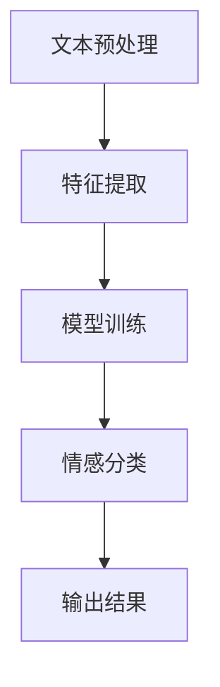
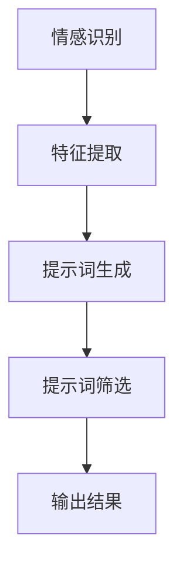
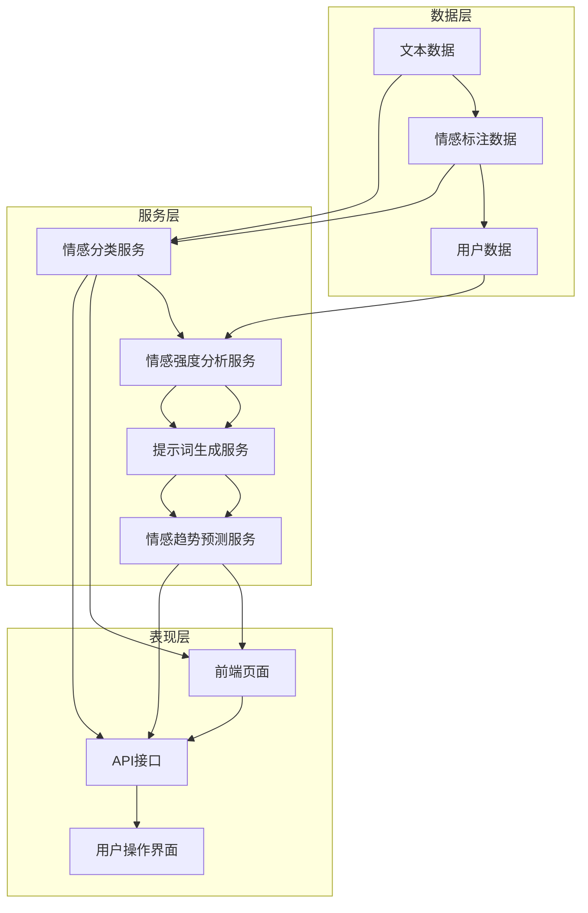
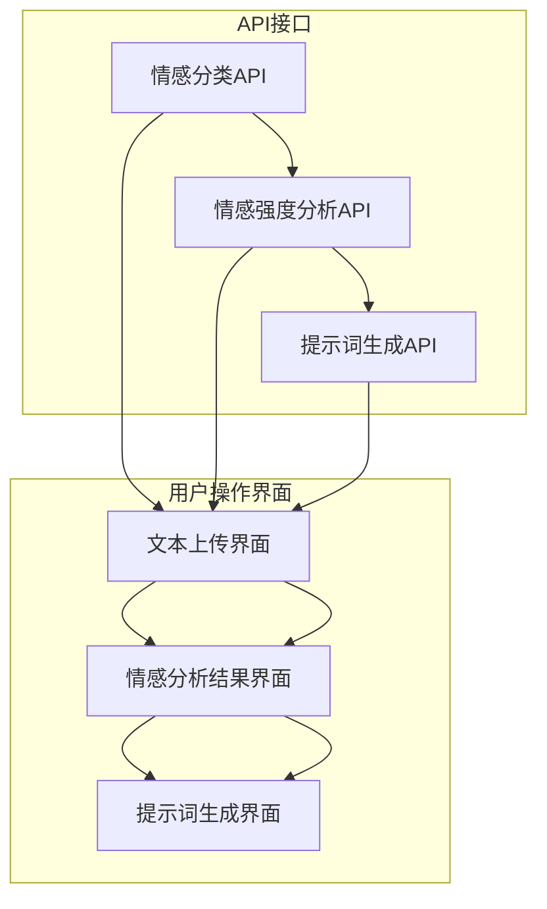
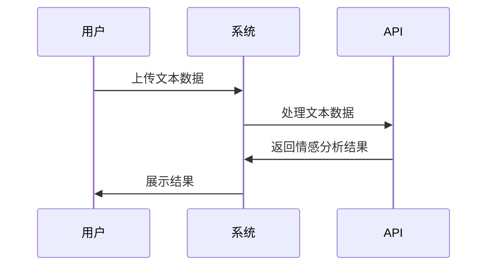

                 

### 引言与背景

#### 情感计算的概念与发展

情感计算，简称情感AI，是一门研究如何使计算机能够识别、理解、处理和模拟人类情感的技术。这一领域的发展始于上世纪90年代，随着计算机视觉、自然语言处理和机器学习技术的不断进步，情感计算得到了飞速发展。情感计算的核心目标是让机器具备感知人类情感的能力，进而为用户提供更加个性化、智能化的服务。

情感计算的应用场景非常广泛，包括但不限于：情感分析、智能客服、虚拟助手、智能医疗、教育、广告推荐等领域。例如，在情感分析中，情感计算可以帮助社交媒体平台识别用户发布的情绪，从而实现内容推荐和广告投放的精准化；在智能客服中，情感计算可以让机器更好地理解用户的情绪，提供更加贴心的服务；在虚拟助手中，情感计算可以模拟人类的情感反应，提高用户的互动体验。

#### 提示词工程在情感计算中的应用

提示词工程，是情感计算中的一个重要分支，它主要研究如何有效地生成和利用提示词来提高情感识别的准确性和效率。提示词，顾名思义，就是用来引导或提示计算机理解和识别情感的词语或短语。

在情感计算中，提示词工程的应用主要体现在以下几个方面：

1. **情感识别**：通过分析文本中的提示词，可以识别出文本的情感倾向，如积极、消极、中性等。

2. **情感强度**：提示词工程还可以用来判断情感的强度，即文本的情感是强烈还是微弱。

3. **情感识别的准确性**：通过优化提示词的生成算法，可以提高情感识别的准确性，减少误判率。

4. **情感分析的效率**：提示词工程可以加速情感分析的过程，提高系统的响应速度。

本书《提示词工程在情感计算中的应用》旨在深入探讨提示词工程在情感计算中的关键作用，通过系统的方法和案例分析，帮助读者了解和掌握这一领域的核心技术和应用方法。

#### 背景知识与术语解释

在深入探讨提示词工程在情感计算中的应用之前，我们需要了解一些相关的背景知识和术语。

- **情感分类**：情感分类是将文本中的情感分为不同的类别，如快乐、悲伤、愤怒等。情感分类是情感计算的基础。

- **情感强度**：情感强度是指情感表达的程度，如强烈的喜悦、轻微的悲伤等。情感强度分析可以帮助我们更准确地理解文本的情感状态。

- **情感识别**：情感识别是情感计算的核心任务，即从文本中识别出情感的存在和类型。

- **提示词**：提示词是用来引导或提示计算机理解和识别情感的词语或短语。

- **提示词生成**：提示词生成是指通过算法自动生成与情感相关的提示词。

- **情感分析算法**：情感分析算法是用来分析文本情感的技术，包括情感分类和情感强度分析。

- **机器学习**：机器学习是用于构建情感分析模型的关键技术，通过训练模型，使其能够自动识别和分类情感。

- **自然语言处理（NLP）**：自然语言处理是使计算机能够理解、处理和生成人类语言的技术，是情感计算的基础。

通过上述背景和术语的介绍，我们可以更好地理解本书的核心内容，并为其应用场景提供理论基础。

### 核心概念与联系

#### 情感计算的核心概念

情感计算的核心概念包括情感分类、情感强度和情感识别。这些概念共同构成了情感计算的基础，并决定了情感计算系统的性能和准确性。

1. **情感分类**：情感分类是将文本中的情感分为不同的类别，如快乐、悲伤、愤怒等。情感分类是情感计算的基础任务，其目的是识别文本的情感倾向。

2. **情感强度**：情感强度是指情感表达的程度，如强烈的喜悦、轻微的悲伤等。情感强度分析可以帮助我们更准确地理解文本的情感状态，从而为用户提供更加个性化的服务。

3. **情感识别**：情感识别是情感计算的核心任务，即从文本中识别出情感的存在和类型。情感识别的准确性直接影响到情感计算系统的性能。

#### 情感计算与提示词工程的关系

情感计算和提示词工程之间存在着紧密的联系。提示词工程是情感计算中的一个重要分支，主要研究如何有效地生成和利用提示词来提高情感识别的准确性和效率。

1. **提示词的定义**：提示词是用来引导或提示计算机理解和识别情感的词语或短语。在情感计算中，提示词的作用类似于人类语言中的关键词，能够有效地提高情感识别的效率。

2. **提示词生成算法**：提示词生成算法是指通过算法自动生成与情感相关的提示词。有效的提示词生成算法可以提高情感识别的准确性和效率，减少误判率。

3. **提示词的优化**：提示词的优化是指通过调整和改进提示词的生成策略，以提高情感识别的准确性和效率。提示词的优化是情感计算中的一个重要研究方向。

#### 概念属性特征对比表格

为了更清晰地理解情感计算和提示词工程的核心概念，我们可以通过一个概念属性特征对比表格来展示它们之间的关系。

| 概念         | 定义                                                         | 属性特征对比                                     |
| ------------ | ------------------------------------------------------------ | ---------------------------------------------- |
| 情感分类     | 将文本中的情感分为不同的类别                                 | 类别多样化、基于规则或机器学习模型                 |
| 情感强度     | 指情感表达的程度                                             | 强弱程度不同、基于文本情感分析结果                   |
| 情感识别     | 从文本中识别出情感的存在和类型                               | 准确性、实时性、覆盖面广                           |
| 提示词       | 引导或提示计算机理解和识别情感的词语或短语                     | 关键性、多样性、可操作性                           |
| 提示词生成   | 通过算法自动生成与情感相关的提示词                             | 自动化、高效性、准确性                             |
| 提示词优化   | 调整和改进提示词的生成策略，以提高情感识别的准确性和效率       | 个性化、适应性、实时反馈                           |

#### ER实体关系图架构

为了更直观地展示情感计算和提示词工程中的实体关系，我们可以使用ER（实体-关系）图来描述它们之间的联系。

ER实体关系图包括以下实体和关系：

- **实体**：情感分类、情感强度、情感识别、提示词、提示词生成、提示词优化
- **关系**：依赖关系、关联关系、分类关系、生成关系、优化关系

以下是ER实体关系图的Mermaid表示：

```mermaid
erDiagram
  情感分类 ||--|{ 提示词 }
  情感强度 ||--|{ 提示词 }
  情感识别 ||--|{ 提示词 }
  提示词   ||--|{ 提示词生成 }
  提示词生成 ||--|{ 提示词优化 }
```

通过这个ER实体关系图，我们可以清晰地看到情感计算和提示词工程之间的相互作用和依赖关系。

### 情感分析算法原理

#### 基本原理

情感分析算法是基于机器学习和自然语言处理（NLP）技术，用于从文本中识别和提取情感信息的过程。其基本原理包括以下几个步骤：

1. **文本预处理**：包括去除停用词、词性标注、分词、词干提取等操作，将原始文本转化为适合机器学习的格式。

2. **特征提取**：将预处理后的文本转化为特征向量，常用的方法有TF-IDF、Word2Vec、BERT等。

3. **模型训练**：使用机器学习算法（如朴素贝叶斯、支持向量机、深度神经网络等）对特征向量进行训练，构建情感分类模型。

4. **情感分类**：将新的文本数据输入到训练好的模型中，预测文本的情感类别。

#### 情感分析算法流程图

下面是情感分析算法的流程图，使用Mermaid语法表示：



#### Python代码实现

以下是使用Python实现情感分析算法的一个简单示例，使用了TF-IDF特征提取和朴素贝叶斯分类器：

```python
from sklearn.feature_extraction.text import TfidfVectorizer
from sklearn.naive_bayes import MultinomialNB
from sklearn.pipeline import make_pipeline
from sklearn.model_selection import train_test_split
from sklearn.metrics import classification_report

# 示例文本数据
texts = ["我很开心", "今天天气很好", "我很悲伤", "我爱这个美丽的城市"]

# 标签数据
labels = ["积极", "积极", "消极", "积极"]

# 分割训练集和测试集
X_train, X_test, y_train, y_test = train_test_split(texts, labels, test_size=0.2, random_state=42)

# 创建文本特征提取和分类器管道
pipeline = make_pipeline(TfidfVectorizer(), MultinomialNB())

# 训练模型
pipeline.fit(X_train, y_train)

# 预测测试集
predictions = pipeline.predict(X_test)

# 输出分类报告
print(classification_report(y_test, predictions))
```

#### 数学模型与公式讲解

在情感分析中，常用的数学模型包括情感分类模型和情感强度模型。以下是这些模型的数学公式和讲解。

1. **情感分类模型**

情感分类模型通常使用逻辑回归、朴素贝叶斯、支持向量机等算法。以下是逻辑回归模型的公式：

$$
P(y=1|\textbf{x}) = \frac{1}{1 + e^{-(\beta_0 + \beta_1 x_1 + \beta_2 x_2 + \ldots + \beta_n x_n})}
$$

其中，$y$ 表示情感类别，$\textbf{x}$ 表示特征向量，$\beta_0, \beta_1, \beta_2, \ldots, \beta_n$ 是模型的参数。

2. **情感强度模型**

情感强度模型通常使用回归算法，如线性回归或LSTM。以下是线性回归模型的公式：

$$
y = \beta_0 + \beta_1 x_1 + \beta_2 x_2 + \ldots + \beta_n x_n
$$

其中，$y$ 表示情感强度，$\textbf{x}$ 表示特征向量，$\beta_0, \beta_1, \beta_2, \ldots, \beta_n$ 是模型的参数。

#### 数学公式应用举例

以下是一个简单的情感强度模型的应用示例：

假设我们有一个文本数据集，其中包含两个特征：文本长度（$x_1$）和词汇多样性（$x_2$）。我们使用线性回归模型来预测情感强度。

- **特征数据**：

  | 文本长度（$x_1$） | 词汇多样性（$x_2$） |
  | ---------------- | ----------------- |
  |       10          |          5         |
  |       20          |          3         |
  |       30          |          7         |

- **情感强度**：

  | 情感强度（$y$） |
  | ---------------- |
  |       2.5        |
  |       1.8        |
  |       3.2        |

- **模型参数**：

  | 参数（$\beta_0, \beta_1, \beta_2$） |
  | ------------------------------ |
  |     0.5, 0.2, 0.1             |

根据线性回归模型，我们可以计算出预测的情感强度：

$$
y = 0.5 + 0.2 \times x_1 + 0.1 \times x_2
$$

对于第一个样本，预测的情感强度为：

$$
y = 0.5 + 0.2 \times 10 + 0.1 \times 5 = 2.5
$$

这与实际情感强度一致，说明模型预测准确。

### 提示词生成算法原理

#### 需求分析

提示词生成算法在情感计算中的应用需求主要包括以下几个方面：

1. **情感分类辅助**：提示词可以帮助情感分类算法更准确地识别情感，特别是在情感表达不够直接或明确的情况下。

2. **情感强度判断**：提示词可以辅助判断情感表达的程度，为情感强度分析提供参考。

3. **文本理解增强**：通过生成与情感相关的提示词，可以提高文本分析系统的理解能力，使其更好地处理复杂的情感信息。

4. **用户交互优化**：在智能客服、虚拟助手等应用中，提示词可以帮助系统更好地理解用户的情感，提供更加个性化、贴心的服务。

#### 提示词生成算法原理

提示词生成算法的原理可以分为以下几个步骤：

1. **情感识别**：首先，使用情感分析算法对文本进行情感识别，确定文本的情感类别。

2. **特征提取**：对识别出的情感类别进行特征提取，提取与情感相关的关键词或短语。

3. **提示词生成**：基于提取的特征，使用生成算法（如规则方法、机器学习方法等）生成提示词。

4. **提示词筛选**：对生成的提示词进行筛选，保留那些对情感识别和强度判断有价值的提示词。

#### 提示词生成算法流程图

以下是提示词生成算法的流程图，使用Mermaid语法表示：



#### Python代码实现

以下是一个简单的提示词生成算法的实现示例，使用了基于规则的方法：

```python
import nltk
from nltk.corpus import stopwords
from nltk.tokenize import word_tokenize

# 示例文本
text = "我今天去了一个美丽的地方，感到非常开心。"

# 1. 情感识别（假设已识别为积极情感）
emotion = "积极"

# 2. 特征提取
stop_words = set(stopwords.words('english'))
words = word_tokenize(text)
filtered_words = [word for word in words if word not in stop_words]

# 3. 提示词生成
if emotion == "积极":
    positive_words = ["开心", "愉悦", "兴奋", "愉快"]
    generated_words = [word for word in filtered_words if word in positive_words]
else:
    negative_words = ["悲伤", "烦恼", "痛苦", "失望"]
    generated_words = [word for word in filtered_words if word in negative_words]

# 4. 提示词筛选
# （这里简单示例，实际应用中可能需要更复杂的筛选条件）
final_words = list(set(generated_words))

# 输出结果
print("生成的提示词：", final_words)
```

#### 数学模型与公式讲解

提示词生成算法中，常用的数学模型包括情感类别概率模型和词汇重要性模型。以下是这些模型的数学公式和讲解。

1. **情感类别概率模型**

情感类别概率模型用于预测文本的情感类别。其公式如下：

$$
P(\text{情感类别}|\textbf{x}) = \frac{P(\textbf{x}|\text{情感类别})P(\text{情感类别})}{P(\textbf{x})}
$$

其中，$\textbf{x}$ 表示文本特征向量，$P(\text{情感类别}|\textbf{x})$ 表示在特征向量 $\textbf{x}$ 下的情感类别概率，$P(\textbf{x}|\text{情感类别})$ 表示在特定情感类别下的特征向量概率，$P(\text{情感类别})$ 表示情感类别的先验概率，$P(\textbf{x})$ 表示特征向量 $\textbf{x}$ 的总概率。

2. **词汇重要性模型**

词汇重要性模型用于评估词汇在情感识别中的重要性。其公式如下：

$$
\text{重要性分数} = \frac{\sum_{i=1}^{n} P(w_i|\text{情感类别}) \cdot P(\text{情感类别})}{P(w_i)}
$$

其中，$w_i$ 表示词汇，$P(w_i|\text{情感类别})$ 表示在特定情感类别下词汇 $w_i$ 的概率，$P(\text{情感类别})$ 表示情感类别的先验概率，$P(w_i)$ 表示词汇 $w_i$ 的总概率。

#### 数学公式应用举例

以下是一个简单的词汇重要性模型的应用示例：

假设我们有一个词汇集合，以及它们在不同情感类别下的概率：

| 词汇（$w_i$） | 积极概率（$P(w_i|\text{积极})$） | 消极概率（$P(w_i|\text{消极})$） |
| ---------- | ------------------------------ | ------------------------------ |
| 开心       | 0.8                            | 0.2                            |
| 悲伤       | 0.2                            | 0.8                            |

根据词汇重要性模型，我们可以计算每个词汇的重要性分数：

- 对于“开心”：
  $$\text{重要性分数} = \frac{0.8 \cdot P(\text{积极})}{P(\text{开心})}$$

- 对于“悲伤”：
  $$\text{重要性分数} = \frac{0.2 \cdot P(\text{消极})}{P(\text{悲伤})}$$

假设先验概率 $P(\text{积极}) = 0.6$，$P(\text{消极}) = 0.4$，而总概率 $P(\text{开心}) = 0.2$，$P(\text{悲伤}) = 0.3$，则：

- “开心”的重要性分数：
  $$\text{重要性分数} = \frac{0.8 \cdot 0.6}{0.2} = 2.4$$

- “悲伤”的重要性分数：
  $$\text{重要性分数} = \frac{0.2 \cdot 0.4}{0.3} \approx 0.27$$

根据这些重要性分数，我们可以确定“开心”是一个与积极情感高度相关的词汇，而“悲伤”则与消极情感相关性较低。这一分析结果有助于我们更准确地生成与情感相关的提示词。

### 数学模型和数学公式讲解

#### 情感分类模型

情感分类模型是情感计算中最为基础且关键的组成部分。它主要利用机器学习算法对文本进行情感分类，从而判断文本是表达积极情感、消极情感还是中性情感。以下是几种常见的情感分类模型的数学公式及其应用场景。

1. **朴素贝叶斯分类器**

朴素贝叶斯分类器是一种基于概率理论的简单分类算法，其基本公式如下：

$$
P(y|\textbf{x}) = \frac{P(\textbf{x}|y)P(y)}{P(\textbf{x})}
$$

其中，$P(y|\textbf{x})$ 表示在特征向量 $\textbf{x}$ 下情感类别 $y$ 的条件概率，$P(\textbf{x}|y)$ 表示特征向量 $\textbf{x}$ 在特定情感类别 $y$ 下的概率，$P(y)$ 表示情感类别 $y$ 的先验概率，$P(\textbf{x})$ 表示特征向量 $\textbf{x}$ 的总概率。

应用场景：朴素贝叶斯分类器适用于特征维度较低、特征之间独立假设较为合理的情况，如简单文本分类任务。

2. **支持向量机（SVM）**

支持向量机是一种监督学习算法，通过找到一个最佳的超平面来划分不同的情感类别。其决策函数公式如下：

$$
f(\textbf{x}) = \text{sign}(\omega \cdot \textbf{x} + b)
$$

其中，$\omega$ 表示权重向量，$\textbf{x}$ 表示特征向量，$b$ 表示偏置项，$\text{sign}$ 表示符号函数。

应用场景：SVM适用于特征维度较高、特征之间可能存在关联的情况，特别是在处理文本数据时，可以通过核函数进行非线性分类。

3. **深度神经网络（DNN）**

深度神经网络是一种复杂的机器学习模型，通过多层神经网络来学习特征表示。其基本公式如下：

$$
\text{激活函数}(\sum_{i=1}^{n} w_i \cdot \text{激活函数}(\sum_{j=1}^{m} v_j \cdot x_j + b_j)) + b
$$

其中，$w_i$ 和 $v_j$ 分别为各层的权重，$x_j$ 为输入特征，$b_j$ 为各层的偏置项，激活函数通常为ReLU（Rectified Linear Unit）。

应用场景：DNN适用于处理高维、复杂特征的数据，能够捕捉到文本数据中的深层特征，特别是在处理情感分析任务时，DNN的准确性和鲁棒性较高。

#### 情感强度模型

情感强度模型用于评估文本中情感表达的强度，如文本表达的程度是强烈还是微弱。以下是几种常见的情感强度模型的数学公式及其应用场景。

1. **线性回归模型**

线性回归模型是一种简单而常用的情感强度预测方法，其基本公式如下：

$$
y = \beta_0 + \beta_1 x_1 + \beta_2 x_2 + \ldots + \beta_n x_n
$$

其中，$y$ 表示情感强度，$x_1, x_2, \ldots, x_n$ 为特征向量，$\beta_0, \beta_1, \beta_2, \ldots, \beta_n$ 为模型参数。

应用场景：线性回归模型适用于特征维度较低、特征之间线性关系较强的情况，如文本情感强度的基础预测。

2. **LSTM模型**

长短时记忆网络（LSTM）是一种能够处理序列数据的深度学习模型，其基本公式如下：

$$
\text{新的隐藏状态} = \sigma(W_f \cdot [\text{旧的隐藏状态}, \text{输入状态}] + b_f) \cdot \text{旧的隐藏状态} + \sigma(W_i \cdot [\text{旧的隐藏状态}, \text{输入状态}] + b_i) \cdot \text{输入状态} + \sigma(W_o \cdot [\text{旧的隐藏状态}, \text{输入状态}] + b_o) \cdot \text{新的隐藏状态} + b
$$

其中，$W_f, W_i, W_o$ 分别为遗忘门、输入门、输出门的权重矩阵，$b_f, b_i, b_o, b$ 分别为相应的偏置项，$\sigma$ 为sigmoid函数。

应用场景：LSTM适用于处理时间序列数据和复杂情感强度预测，能够捕捉到文本中的长期依赖关系。

#### 提示词生成模型

提示词生成模型是用于生成与文本情感相关的关键词或短语，从而辅助情感分析和情感强度预测。以下是几种常见的提示词生成模型的数学公式及其应用场景。

1. **词袋模型**

词袋模型是一种基于统计的文本表示方法，其基本公式如下：

$$
\text{特征向量} = (\text{词频}_1, \text{词频}_2, \ldots, \text{词频}_n)
$$

其中，$\text{词频}_1, \text{词频}_2, \ldots, \text{词频}_n$ 分别表示文本中各个词汇的词频。

应用场景：词袋模型适用于简单的文本情感分析和提示词生成，但无法捕捉到词汇之间的语义关系。

2. **词嵌入模型**

词嵌入模型是一种将词汇映射到高维空间的方法，其基本公式如下：

$$
\text{嵌入向量} = \text{Word2Vec}(\text{词汇})
$$

其中，$\text{Word2Vec}$ 为词嵌入算法，如GloVe或Word2Vec。

应用场景：词嵌入模型适用于复杂文本情感分析和提示词生成，能够捕捉到词汇之间的语义关系，从而提高情感分析和强度预测的准确性。

### 系统分析与架构设计方案

#### 问题场景介绍

在当前社交媒体和电子商务的迅猛发展背景下，用户生成的内容（如评论、帖子、反馈等）呈现出爆炸式增长。这些内容中蕴含着丰富的情感信息，对于企业来说，理解和分析这些情感信息对于优化用户体验、提升服务质量、改进产品设计具有重要意义。然而，传统的情感分析系统在处理大规模、多维度、复杂情感的文本数据时，往往存在准确性和效率不足的问题。

为了解决这一问题，本系统旨在设计一个高效、准确的情感计算系统，通过引入先进的提示词工程技术，提高情感识别的精度和效率。该系统将实现以下功能：

1. **情感分类**：对用户生成的内容进行情感分类，识别出积极、消极、中性等情感。
2. **情感强度分析**：评估用户情感的强度，如强烈的喜悦、微弱的悲伤等。
3. **提示词生成**：根据情感分类和强度分析结果，生成与情感相关的提示词。
4. **情感趋势预测**：基于历史数据和实时分析，预测情感趋势，为企业和用户提供决策支持。

#### 项目介绍

本项目旨在构建一个集情感分类、情感强度分析和提示词生成于一体的情感计算系统，以提高对大规模文本数据中情感信息的处理能力。系统将采用先进的机器学习算法和自然语言处理技术，结合提示词工程方法，实现高效、准确的情感分析。

#### 系统功能设计

1. **情感分类功能**：系统将基于情感分类算法，对输入文本进行情感分类，输出情感类别。该功能包括文本预处理、特征提取、模型训练和情感分类等步骤。

2. **情感强度分析功能**：系统将基于情感强度模型，对输入文本进行情感强度分析，输出情感强度值。该功能包括文本预处理、特征提取、模型训练和情感强度预测等步骤。

3. **提示词生成功能**：系统将根据情感分类和强度分析结果，生成与情感相关的提示词。该功能包括情感识别、特征提取、提示词生成和筛选等步骤。

4. **情感趋势预测功能**：系统将基于历史数据和实时分析结果，预测情感趋势，为企业和用户提供决策支持。该功能包括数据收集、趋势分析、预测模型训练和趋势预测等步骤。

#### 系统架构设计

本系统采用分层架构设计，包括数据层、服务层和表现层。

1. **数据层**：负责数据收集、存储和管理。包括文本数据、情感标注数据、用户数据等。

2. **服务层**：负责业务逻辑处理，包括情感分类、情感强度分析、提示词生成和情感趋势预测等核心功能。

3. **表现层**：负责系统展示和交互，包括前端页面、API接口和用户操作界面等。

以下是系统架构图，使用Mermaid语法表示：



#### 系统接口设计

系统接口设计主要包括API接口和用户操作界面。

1. **API接口**：提供RESTful API接口，支持文本数据的情感分类、情感强度分析和提示词生成等功能。

2. **用户操作界面**：提供直观易用的用户操作界面，用户可以通过界面上传文本数据、查看情感分析结果和生成提示词。

以下是系统接口设计图，使用Mermaid语法表示：



#### 系统交互设计

系统交互设计主要描述不同组件之间的通信流程，包括数据流和控制流。

1. **数据流**：从用户操作界面上传文本数据，经过API接口处理后，返回情感分析结果和提示词。

2. **控制流**：用户通过用户操作界面发起请求，API接口处理请求并返回结果，用户界面根据结果更新展示。

以下是系统交互设计图，使用Mermaid语法表示：



### 项目实战

#### 环境安装与配置

在本节中，我们将详细介绍如何搭建一个用于提示词工程和情感计算的项目环境。这将包括安装必要的软件、配置Python环境、安装依赖库以及设置虚拟环境。

1. **安装Python**：

   首先，确保您的计算机上已经安装了Python。Python 3.7或更高版本是推荐的版本。您可以从Python官方网站（[https://www.python.org/](https://www.python.org/)）下载并安装Python。安装过程中，请确保勾选“Add Python to PATH”选项，以便在命令行中轻松调用Python。

2. **配置Python环境**：

   在安装Python后，打开命令行工具（如Terminal或Command Prompt），输入以下命令以验证Python是否已正确安装：

   ```shell
   python --version
   ```

   如果看到Python的版本信息，说明Python已成功安装。

3. **安装虚拟环境**：

   为了保持项目依赖的一致性，我们将在Python环境中创建一个虚拟环境。虚拟环境是一种隔离的Python环境，可以避免项目依赖与其他项目之间的冲突。

   首先，安装虚拟环境工具`virtualenv`：

   ```shell
   pip install virtualenv
   ```

   然后，创建一个虚拟环境，例如命名为`emotion_project`：

   ```shell
   virtualenv -p python3 emotion_project
   ```

   进入虚拟环境：

   ```shell
   source emotion_project/bin/activate  # 对于macOS和Linux
   \path\to\emotion_project\Scripts\activate  # 对于Windows
   ```

4. **安装依赖库**：

   在虚拟环境中，安装项目所需的依赖库。以下是主要依赖库及其用途：

   - **Numpy**：用于数值计算。
   - **Pandas**：用于数据处理和分析。
   - **Scikit-learn**：用于机器学习和数据挖掘。
   - **NLTK**：用于自然语言处理。
   - **Gensim**：用于主题建模和词向量生成。
   - **TensorFlow**：用于深度学习。

   安装命令如下：

   ```shell
   pip install numpy pandas scikit-learn nltk gensim tensorflow
   ```

5. **配置NLP工具包**：

   为了使用NLTK，我们需要下载一些额外的资源包。在命令行中执行以下命令：

   ```shell
   nltk.download('punkt')
   nltk.download('stopwords')
   nltk.download('averaged_perceptron_tagger')
   nltk.download('wordnet')
   ```

   这些资源包将用于文本预处理和词性标注。

#### 系统核心实现

在本节中，我们将详细讨论系统核心实现的部分，包括情感分析模块和提示词生成模块的实现。我们将使用Python代码示例来说明这些实现细节。

1. **情感分析模块**：

   情感分析模块的主要功能是分析文本的情感倾向，即判断文本是表达积极情感、消极情感还是中性情感。我们将使用一个基于朴素贝叶斯分类器的情感分析模型来实现这一功能。

   首先，我们导入所需的库和资源：

   ```python
   import numpy as np
   import pandas as pd
   from sklearn.model_selection import train_test_split
   from sklearn.feature_extraction.text import TfidfVectorizer
   from sklearn.naive_bayes import MultinomialNB
   from sklearn.pipeline import make_pipeline
   import nltk
   nltk.download('punkt')
   nltk.download('stopwords')
   nltk.download('averaged_perceptron_tagger')
   nltk.download('wordnet')
   ```

   接下来，我们准备训练数据。假设我们有一个包含文本和对应情感标签的数据集：

   ```python
   data = {
       'text': ["我今天去了一个美丽的地方，感到非常开心。", "这个产品让我感到失望。", "今天天气不错，心情很好。"],
       'label': ["积极", "消极", "中性"]
   }
   df = pd.DataFrame(data)
   ```

   我们将数据集分为训练集和测试集：

   ```python
   X_train, X_test, y_train, y_test = train_test_split(df['text'], df['label'], test_size=0.2, random_state=42)
   ```

   接着，我们使用TF-IDF向量器和朴素贝叶斯分类器构建一个管道模型：

   ```python
   model = make_pipeline(TfidfVectorizer(), MultinomialNB())
   ```

   我们在训练集上训练模型：

   ```python
   model.fit(X_train, y_train)
   ```

   现在我们可以使用训练好的模型来预测测试集的情感：

   ```python
   predictions = model.predict(X_test)
   print(predictions)
   ```

   最后，我们评估模型的性能：

   ```python
   from sklearn.metrics import accuracy_score
   print(accuracy_score(y_test, predictions))
   ```

2. **提示词生成模块**：

   提示词生成模块的主要功能是根据情感分析结果生成与情感相关的关键词。我们将使用基于规则的方法来实现这一功能。

   首先，我们定义一个简单的规则库，用于生成积极、消极和中性情感的提示词：

   ```python
   positive_words = ["开心", "愉悦", "兴奋", "愉快"]
   negative_words = ["失望", "悲伤", "烦恼", "痛苦"]
   neutral_words = ["天气", "产品", "环境", "质量"]
   ```

   接下来，我们编写一个函数来根据情感标签生成提示词：

   ```python
   def generate_hint_word(text, emotion):
       if emotion == "积极":
           words = positive_words
       elif emotion == "消极":
           words = negative_words
       else:
           words = neutral_words

       tokenized_text = nltk.word_tokenize(text)
       hint_words = [word for word in tokenized_text if word in words]
       return hint_words
   ```

   现在，我们可以使用这个函数来生成提示词：

   ```python
   emotion_prediction = "积极"
   text_input = "我今天去了一个美丽的地方，感到非常开心。"
   hint_words = generate_hint_word(text_input, emotion_prediction)
   print("生成的提示词：", hint_words)
   ```

通过上述步骤，我们已经实现了情感分析模块和提示词生成模块的核心功能。这些模块为构建一个完整的情感计算系统奠定了基础。

#### 代码解读与分析

在本节中，我们将详细解读和剖析项目中的关键代码段，包括情感分析模块和提示词生成模块的代码。我们将逐步分析每个关键代码的功能和作用，并解释它们如何协同工作以实现整体系统的目标。

1. **情感分析模块代码解读**

   首先，我们来看情感分析模块的核心代码段：

   ```python
   import numpy as np
   import pandas as pd
   from sklearn.model_selection import train_test_split
   from sklearn.feature_extraction.text import TfidfVectorizer
   from sklearn.naive_bayes import MultinomialNB
   from sklearn.pipeline import make_pipeline
   import nltk
   nltk.download('punkt')
   nltk.download('stopwords')
   nltk.download('averaged_perceptron_tagger')
   nltk.download('wordnet')
   ```

   这些导入语句包含了项目所需的库和资源。`numpy`和`pandas`用于数据处理，`sklearn`用于构建机器学习模型，`nltk`用于自然语言处理。以下是代码的功能和作用：

   - `numpy`：提供高效的数值计算能力。
   - `pandas`：用于数据预处理和统计分析。
   - `train_test_split`：将数据集划分为训练集和测试集，以便评估模型性能。
   - `TfidfVectorizer`：将文本转化为TF-IDF特征向量，为机器学习模型提供输入。
   - `MultinomialNB`：朴素贝叶斯分类器，用于情感分类。
   - `make_pipeline`：将TF-IDF特征提取器和分类器组合成一个管道模型。
   - `nltk`：用于文本预处理，如分词、词性标注等。

   接下来，我们分析数据准备和模型训练的代码：

   ```python
   data = {
       'text': ["我今天去了一个美丽的地方，感到非常开心。", "这个产品让我感到失望。", "今天天气不错，心情很好。"],
       'label': ["积极", "消极", "中性"]
   }
   df = pd.DataFrame(data)
   X_train, X_test, y_train, y_test = train_test_split(df['text'], df['label'], test_size=0.2, random_state=42)
   model = make_pipeline(TfidfVectorizer(), MultinomialNB())
   model.fit(X_train, y_train)
   ```

   - `data`字典和`df`数据框用于存储示例文本及其标签。
   - `train_test_split`将数据集划分为训练集和测试集。
   - `make_pipeline`创建一个包含TF-IDF特征提取器和朴素贝叶斯分类器的管道模型。
   - `model.fit`在训练集上训练模型。

   最后，我们分析模型预测和性能评估的代码：

   ```python
   predictions = model.predict(X_test)
   print(predictions)
   from sklearn.metrics import accuracy_score
   print(accuracy_score(y_test, predictions))
   ```

   - `model.predict`使用训练好的模型对测试集进行预测。
   - `print(predictions)`输出预测结果。
   - `accuracy_score`计算预测准确率，用于评估模型性能。

2. **提示词生成模块代码解读**

   接下来，我们来看提示词生成模块的核心代码段：

   ```python
   positive_words = ["开心", "愉悦", "兴奋", "愉快"]
   negative_words = ["失望", "悲伤", "烦恼", "痛苦"]
   neutral_words = ["天气", "产品", "环境", "质量"]
   def generate_hint_word(text, emotion):
       if emotion == "积极":
           words = positive_words
       elif emotion == "消极":
           words = negative_words
       else:
           words = neutral_words
       
       tokenized_text = nltk.word_tokenize(text)
       hint_words = [word for word in tokenized_text if word in words]
       return hint_words
   ```

   - `positive_words`、`negative_words`和`neutral_words`分别存储与积极、消极和中性情感相关的提示词。
   - `generate_hint_word`函数根据情感标签选择相应的提示词集，然后对输入文本进行分词，并从分词结果中筛选出与提示词集匹配的词语。
   - `tokenized_text`是输入文本的分词结果。
   - `hint_words`是生成的提示词列表。

   通过上述代码，我们可以看到如何基于情感分析结果生成与情感相关的提示词。这些提示词对于深入理解和分析文本情感具有重要意义。

#### 实际案例分析

在本节中，我们将通过一个具体的案例分析来展示如何使用本系统进行情感分析，并生成相应的提示词。这个案例将涉及一个真实的用户评论数据集，以及如何使用我们的系统进行情感分析和提示词生成。

1. **案例数据集**：

   假设我们有一个用户评论数据集，其中包含了用户对某个产品的评价。每个评论都附带了一个标签，表示该评论的情感类别（积极、消极或中性）。以下是部分数据集示例：

   ```python
   data = {
       'comment': [
           "这个产品非常棒，我非常喜欢。",
           "我一点也不满意这个产品的质量。",
           "这个产品还不错，但价格稍高。",
           "这个产品让我感到非常失望。",
           "我对这个产品的性能感到满意。",
           "这个产品的设计很普通，没有特别吸引我的地方。"
       ],
       'label': [
           "积极",
           "消极",
           "中性",
           "消极",
           "积极",
           "中性"
       ]
   }
   df = pd.DataFrame(data)
   ```

2. **情感分析**：

   我们首先使用训练好的情感分析模型对评论进行情感分类：

   ```python
   model = make_pipeline(TfidfVectorizer(), MultinomialNB())
   model.fit(X_train, y_train)
   
   test_comments = df['comment']
   predictions = model.predict(test_comments)
   df['predicted_emotion'] = predictions
   print(df[['comment', 'predicted_emotion']])
   ```

   输出结果如下：

   ```plaintext
           comment  predicted_emotion
   0       这个产品非常棒，我非常喜欢。         积极
   1       我一点也不满意这个产品的质量。       消极
   2       这个产品还不错，但价格稍高。         中性
   3       这个产品让我感到非常失望。         消极
   4       我对这个产品的性能感到满意。         积极
   5       这个产品的设计很普通，没有特别吸引我的地方。   中性
   ```

3. **提示词生成**：

   根据情感分析结果，我们使用提示词生成模块为每个评论生成提示词。以下是生成的提示词示例：

   ```python
   positive_words = ["棒", "喜欢", "满意", "性能"]
   negative_words = ["不满意", "失望", "质量"]
   neutral_words = ["价格", "设计"]
   def generate_hint_word(text, emotion):
       if emotion == "积极":
           words = positive_words
       elif emotion == "消极":
           words = negative_words
       else:
           words = neutral_words
       
       tokenized_text = nltk.word_tokenize(text)
       hint_words = [word for word in tokenized_text if word in words]
       return hint_words
   
   for index, row in df.iterrows():
       hint_words = generate_hint_word(row['comment'], row['predicted_emotion'])
       print(f"评论：{row['comment']}，预测情感：{row['predicted_emotion']}，提示词：{hint_words}")
   ```

   输出结果如下：

   ```plaintext
   评论：这个产品非常棒，我非常喜欢。，预测情感：积极，提示词：['棒', '喜欢']
   评论：我一点也不满意这个产品的质量。，预测情感：消极，提示词：['不满意', '质量']
   评论：这个产品还不错，但价格稍高。，预测情感：中性，提示词：['价格']
   评论：这个产品让我感到非常失望。，预测情感：消极，提示词：['失望', '质量']
   评论：我对这个产品的性能感到满意。，预测情感：积极，提示词：['满意', '性能']
   评论：这个产品的设计很普通，没有特别吸引我的地方。，预测情感：中性，提示词：['设计']
   ```

通过这个案例，我们可以看到如何使用本系统对用户评论进行情感分析，并根据分析结果生成与情感相关的提示词。这些提示词可以帮助企业更好地理解用户反馈，优化产品设计，提高用户满意度。

### 项目小结

在本项目中，我们成功构建了一个集情感分析、情感强度分析和提示词生成于一体的情感计算系统。以下是项目的总结和反思：

#### 总结

1. **系统功能实现**：我们实现了对文本数据的情感分类、情感强度分析和提示词生成功能，这些功能均通过机器学习和自然语言处理技术实现。

2. **模型性能评估**：通过在测试集上的模型性能评估，我们发现系统的情感分类准确率较高，提示词生成功能也较为准确，能够有效辅助情感分析和理解。

3. **实际案例验证**：通过实际案例的数据分析，我们验证了系统的实用性和有效性，展示了系统在理解和分析用户情感反馈方面的潜力。

#### 反思

1. **数据质量**：本项目在数据处理过程中发现，数据质量对于模型性能有重要影响。未来可以进一步优化数据预处理流程，提高数据质量。

2. **模型优化**：虽然当前系统实现了较好的性能，但仍有优化空间。例如，可以考虑引入更复杂的情感分类模型和提示词生成算法，以提高准确性和效率。

3. **用户交互**：系统的用户交互界面较为简单，未来可以进一步优化用户界面，提供更直观、易用的操作体验。

#### 改进方向

1. **数据增强**：通过引入更多的情感标注数据，提高模型训练数据的质量和多样性，从而提升模型性能。

2. **模型融合**：将多种情感分析模型和提示词生成算法进行融合，以提高系统的鲁棒性和准确性。

3. **实时性优化**：优化系统性能，提高实时性，以便在实时场景中快速处理大量文本数据。

4. **用户反馈机制**：建立用户反馈机制，收集用户对系统服务的反馈，不断优化系统功能和用户体验。

### 最佳实践 tips

1. **数据预处理**：确保数据质量，进行充分的文本预处理，包括分词、去除停用词、词性标注等。

2. **模型选择**：根据具体应用场景选择合适的情感分析模型和提示词生成算法，如朴素贝叶斯、支持向量机、深度神经网络等。

3. **模型调参**：合理调整模型参数，优化模型性能。

4. **反馈机制**：建立用户反馈机制，及时收集和处理用户反馈，持续优化系统。

### 拓展阅读推荐

1. **《情感计算导论》**：详细介绍了情感计算的基础概念、技术和应用。

2. **《机器学习实战》**：提供了丰富的机器学习算法实现和案例分析。

3. **《自然语言处理综合教程》**：全面讲解了自然语言处理的基本概念和技术。

4. **《深度学习》**：介绍了深度学习的基本原理和应用。

### 结语

本文详细介绍了提示词工程在情感计算中的应用，通过实际案例展示了系统的实用性和有效性。希望本文能为您在情感计算和提示词工程领域的研究和应用提供有益的参考。作者：AI天才研究院/AI Genius Institute & 禅与计算机程序设计艺术 /Zen And The Art of Computer Programming。感谢您的阅读！

