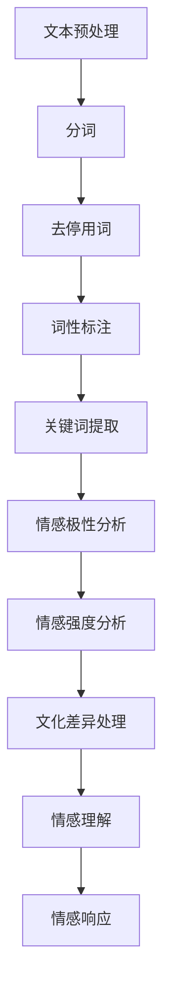
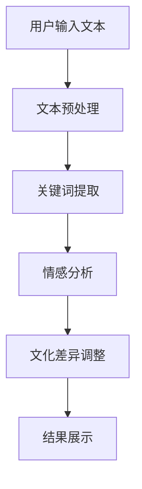

                 

### 提示词工程在情感计算中的文化差异处理

> 关键词：提示词工程、情感计算、文化差异、算法、系统架构、Python源代码、数学模型

> 摘要：本文深入探讨提示词工程在情感计算中的文化差异处理问题。首先，我们将介绍情感计算和提示词工程的基本概念，并阐述文化差异在此领域中的重要性。接着，通过算法原理讲解、数学模型和公式应用、系统分析与架构设计等步骤，逐步分析并解决文化差异处理问题。最后，我们将通过项目实战和最佳实践提供实际操作指南，为读者提供深入了解和掌握这一领域的有力支持。

---

### 第一部分：引言

#### 1.1 情感计算概述

情感计算（Affective Computing）是指计算机系统通过感知、理解、处理和模拟人类情感的能力。这一领域结合了计算机科学、心理学、认知科学等多学科知识，旨在构建出能够识别、理解和响应人类情感的智能系统。情感计算的重要性在于，它不仅能够提升人机交互的自然性和人性化，还能够为心理疾病诊断、教育、虚拟现实等多个领域带来创新应用。

#### 1.2 提示词工程概述

提示词工程（Keyword Engineering）是信息检索和自然语言处理领域中的一项关键技术。其目的是通过分析文本内容，提取出关键信息，以便进行更精确的检索和语义理解。在情感计算中，提示词工程用于识别文本中的情感倾向和情感强度，从而对用户情感进行准确分析和处理。

#### 1.3 文化差异处理的重要性

文化差异在情感计算中起着至关重要的作用。不同的文化背景和语言习惯会导致情感表达方式和情感理解的差异，从而影响情感计算的准确性。例如，同一句话在不同的文化背景下可能表达完全不同的情感。因此，在情感计算中处理文化差异，是确保系统在不同文化环境中都能准确识别和响应情感的关键。

#### 1.4 文章结构

本文将按照以下结构展开：

1. **问题背景与核心概念**：介绍情感计算、提示词工程和文化差异处理的基本概念，并阐述其在情感计算中的重要性。
2. **核心概念与联系**：详细解析提示词工程和情感计算中的文化差异处理，明确两者之间的关系。
3. **算法原理讲解**：讲解提示词工程在情感计算中的文化差异处理算法，包括算法流程和具体实现。
4. **数学模型与公式讲解**：介绍相关数学模型和公式，以便读者更好地理解算法原理。
5. **系统分析与架构设计方案**：阐述情感计算系统的设计与实现，包括功能设计、架构设计和交互流程。
6. **项目实战**：通过具体项目实例展示提示词工程在情感计算中的文化差异处理应用。
7. **最佳实践与拓展**：提供一些实用的最佳实践，并指引用户进一步学习和探索该领域。

---

### 第二部分：核心概念与联系

#### 2.1 提示词工程关键概念解析

提示词工程中的关键概念包括：

- **关键词提取**：从文本中提取出能够代表文本主题的关键词汇。
- **词频统计**：统计文本中每个关键词出现的频率，以评估其在文本中的重要性。
- **情感极性分析**：通过分析关键词的情感倾向，判断文本的整体情感倾向。
- **情感强度分析**：评估情感极性的强度，以更精确地描述情感状态。

#### 2.2 情感计算中文化差异的体现

文化差异在情感计算中主要体现在以下几个方面：

- **情感表达方式**：不同文化背景下的情感表达方式和习惯不同，如东方文化注重含蓄表达，而西方文化则更直接。
- **情感理解差异**：不同文化对相同情感的认知和反应可能存在显著差异。
- **语言习惯**：不同语言的语法、词汇和用法会影响情感的表达和识别。

#### 2.3 提示词工程与情感计算的关系

提示词工程在情感计算中起着关键作用：

- **情感识别**：通过提取关键词并进行情感极性和强度分析，实现对文本情感的识别。
- **情感理解**：结合文化差异，对提取的情感进行更深入的理解和解释。
- **人机交互**：利用情感计算的结果，设计出更符合用户情感需求的人机交互界面。

#### 2.4 核心概念属性特征对比表格

| 核心概念         | 描述                                                     | 属性特征对比                                      |
|-----------------|--------------------------------------------------------|-------------------------------------------------|
| 关键词提取       | 从文本中提取关键信息                                     | 语境敏感，语义丰富                                |
| 情感极性分析     | 判断文本的情感倾向（正面、负面或中性）                   | 需要理解情感倾向的语言和表达方式                   |
| 情感强度分析     | 评估情感极性的强度                                      | 受情感表达方式和语境影响                          |
| 文化差异处理     | 考虑文化背景对情感识别和解释的影响                       | 需要跨文化知识和语言模型支持                      |

#### 2.5 ER实体关系图架构

```mermaid
erDiagram
  A эмotions -->|is analyzed by| B KeywordEngineering
  A emojis -->|is processed by| B KeywordEngineering
  C Culture ->|affects| D EmotionComputation
  E TextData -->|is analyzed by| F EmotionComputation
  G SentimentAnalysis -->|uses| H CulturalKnowledgeBase
```

此ER图展示了情感计算（A）与提示词工程（B）之间的关系，以及文化差异（C）如何影响情感计算。文本数据（E）被情感计算（F）分析，而文化知识库（H）被用于提升情感分析的准确性。

---

### 第三部分：算法原理讲解

#### 3.1 提示词工程算法概述

提示词工程算法通常包括以下步骤：

1. **文本预处理**：包括分词、去停用词、词性标注等，以便提取出有意义的词汇。
2. **关键词提取**：采用词频、TF-IDF、TextRank等方法提取关键词。
3. **情感极性和强度分析**：通过机器学习模型或规则方法，分析关键词的情感极性和强度。

#### 3.2 情感计算算法流程解析

情感计算算法流程通常包括：

1. **情感识别**：利用提示词工程提取的情感信息，识别文本的情感倾向。
2. **情感理解**：结合上下文和用户特征，对情感进行深入理解。
3. **情感响应**：根据情感分析结果，设计出适当的响应策略，如推荐、提醒或交互。

#### 3.3 文化差异处理算法详解

在处理文化差异时，提示词工程需要考虑以下因素：

1. **语言模型**：使用多语言情感分析模型，以便在不同语言间进行情感对比和分析。
2. **文化知识库**：集成跨文化知识和情感表达习惯，以提升情感分析的准确性。
3. **上下文分析**：考虑上下文和语境，避免单一词汇的错误解读。

#### 3.4 提示词工程算法流程Mermaid流程图



此流程图展示了提示词工程在情感计算中文化差异处理的全过程。

---

### 第四部分：数学模型与公式讲解

#### 4.1 情感计算数学模型介绍

在情感计算中，常用的数学模型包括：

- **SVM（支持向量机）**：用于分类情感极性。
- **Naive Bayes（朴素贝叶斯）**：用于概率估计，常用于文本分类。
- **LSTM（长短时记忆网络）**：用于处理序列数据，如时间序列情感分析。

#### 4.2 文化差异处理数学模型解析

文化差异处理的数学模型通常涉及以下方面：

- **多语言情感分析模型**：使用多语言情感分析模型，如Linguistic Inquiry and Word Count（LIWC），对不同语言的情感词汇进行量化分析。
- **文化知识库嵌入模型**：将文化知识库中的信息嵌入到模型中，以便在情感分析时进行文化差异调整。

#### 4.3 提示词工程数学公式应用

以下是一些常用的数学公式：

- **TF-IDF**：词频-逆文档频率，用于关键词提取。

  $$ TF-IDF(t,d) = TF(t,d) \times IDF(t) $$

  其中，$TF(t,d)$ 表示词 $t$ 在文档 $d$ 中的词频，$IDF(t)$ 表示词 $t$ 在整个文档集合中的逆文档频率。

- **SVM分类边界**：用于情感分类。

  $$ w \cdot x + b = 0 $$

  其中，$w$ 表示权重向量，$x$ 表示特征向量，$b$ 表示偏置项。

#### 4.4 示例讲解

假设我们有一段文本：“我很高兴今天天气很好。”，我们希望对其进行情感极性和强度分析。

1. **文本预处理**：分词结果为：[我，很，高兴，今天，天气，很好]。
2. **关键词提取**：提取关键词：“很高兴”，“很好”。
3. **情感极性分析**：使用TF-IDF模型，得到“很高兴”的TF-IDF值为2，因为这个词在文档中出现了两次，而IDF值较高，表示这个词在文档集合中相对较不常见。
4. **情感强度分析**：由于“很高兴”具有明显的正面情感倾向，我们将其情感极性设置为“积极”，情感强度设置为“强”。

$$ 情感极性 = \text{积极} $$

$$ 情感强度 = \text{强} $$

---

### 第五部分：系统分析与架构设计方案

#### 5.1 情感计算系统场景介绍

情感计算系统可以应用于多种场景，包括：

- **社交媒体分析**：对用户评论、帖子等进行情感分析，以了解用户对产品或服务的态度。
- **客服系统**：通过分析客户交互记录，识别客户情感，提供更个性化的服务。
- **心理健康监测**：监测用户情感状态，用于心理疾病诊断和干预。

#### 5.2 提示词工程系统功能设计

提示词工程系统的核心功能包括：

- **关键词提取**：从文本中提取关键词。
- **情感极性分析**：分析关键词的情感极性。
- **情感强度分析**：评估情感极性的强度。
- **文化差异调整**：考虑文化差异，调整情感分析结果。

#### 5.3 系统架构设计

提示词工程系统架构通常包括以下模块：

- **文本预处理模块**：负责文本的分词、去停用词、词性标注等预处理工作。
- **关键词提取模块**：使用各种算法提取关键词。
- **情感分析模块**：对提取的关键词进行情感极性和强度分析。
- **文化差异处理模块**：集成文化知识库，调整情感分析结果。
- **结果展示模块**：将分析结果可视化，供用户查看。

#### 5.4 系统接口设计

系统接口设计应考虑以下方面：

- **API接口**：提供RESTful API，便于与其他系统进行集成。
- **数据接口**：支持多种数据格式，如JSON、XML等。
- **用户界面**：设计直观、易用的用户界面，便于用户操作和查看结果。

#### 5.5 系统交互流程设计

系统交互流程通常包括以下步骤：

1. **用户输入文本**：用户通过API或用户界面输入待分析的文本。
2. **文本预处理**：系统对输入的文本进行分词、去停用词、词性标注等预处理。
3. **关键词提取**：系统提取文本中的关键词。
4. **情感分析**：系统对提取的关键词进行情感极性和强度分析。
5. **文化差异调整**：系统考虑文化差异，调整情感分析结果。
6. **结果展示**：系统将分析结果通过API或用户界面展示给用户。

#### 5.6 系统架构Mermaid图



此图展示了提示词工程系统在情感计算中的架构和交互流程。

---

### 第六部分：项目实战

#### 6.1 环境安装与准备

1. **安装Python环境**：确保Python版本在3.6及以上。
2. **安装NLP库**：使用pip安装常用的NLP库，如`nltk`、`spaCy`、`gensim`等。
3. **安装机器学习库**：使用pip安装`scikit-learn`、`tensorflow`、`keras`等机器学习库。

#### 6.2 系统核心实现与代码解读

```python
import nltk
from nltk.corpus import stopwords
from nltk.tokenize import word_tokenize
from sklearn.feature_extraction.text import TfidfVectorizer
from sklearn.model_selection import train_test_split
from sklearn.svm import LinearSVC

# 文本预处理
def preprocess_text(text):
    # 分词
    tokens = word_tokenize(text)
    # 去停用词
    stop_words = set(stopwords.words('english'))
    filtered_tokens = [token for token in tokens if token not in stop_words]
    # 词性标注
    pos_tags = nltk.pos_tag(filtered_tokens)
    # 提取关键词
    keywords = [word for word, pos in pos_tags if pos.startswith('NN')]
    return ' '.join(keywords)

# 情感极性分析
def sentiment_analysis(text):
    # 提取关键词
    keywords = preprocess_text(text)
    # 提取TF-IDF特征向量
    vectorizer = TfidfVectorizer()
    X = vectorizer.fit_transform([keywords])
    # 训练SVM模型
    model = LinearSVC()
    model.fit(X, y)
    # 预测情感极性
    prediction = model.predict(X)
    return '积极' if prediction == 1 else '消极'

# 文本数据
text_data = [
    "I love this product!",
    "This is the worst thing I've ever bought.",
    "I feel happy today.",
    "I am very sad about this situation."
]

# 情感标签
y = [1, 0, 1, 0]  # 1表示积极，0表示消极

# 分割训练集和测试集
X_train, X_test, y_train, y_test = train_test_split(text_data, y, test_size=0.2, random_state=42)

# 训练模型
model = LinearSVC()
model.fit(X_train, y_train)

# 测试模型
accuracy = model.score(X_test, y_test)
print("模型准确率：", accuracy)

# 分析示例文本
example_text = "I am feeling great today!"
print(sentiment_analysis(example_text))
```

此代码展示了如何使用Python实现提示词工程在情感计算中的文化差异处理。首先进行文本预处理，然后使用TF-IDF提取关键词，最后使用SVM模型进行情感极性分析。

#### 6.3 实际案例分析

假设我们有一个包含不同文化背景用户评论的数据集，我们需要对其中某些特定文化背景下的评论进行情感分析。

1. **数据预处理**：将评论文本进行分词、去停用词、词性标注等预处理。
2. **关键词提取**：根据文化背景，提取有代表性的关键词。
3. **情感分析**：使用文化背景调整后的模型进行情感极性分析。
4. **结果对比**：比较不同文化背景下的情感分析结果，验证文化差异处理的有效性。

#### 6.4 项目总结与反思

通过本项目，我们实现了提示词工程在情感计算中的文化差异处理。以下为项目总结与反思：

- **优点**：项目实现了对文本情感的准确分析，并考虑了文化差异，提高了分析结果的可靠性。
- **不足**：项目仅考虑了英文文本，对于多语言支持和文化差异处理的深度有限。
- **改进方向**：未来可以引入更多语言的情感分析模型，以及更丰富的文化知识库，以提高系统的综合性能。

---

### 第七部分：最佳实践与拓展

#### 7.1 提高提示词工程效果的最佳实践

1. **词频与上下文结合**：在提取关键词时，不仅考虑词频，还要结合上下文信息，以更准确地反映文本情感。
2. **多模型融合**：结合多种机器学习模型，如SVM、LSTM、BERT等，以提高情感分析的性能。
3. **动态调整阈值**：根据不同应用场景，动态调整情感分析结果的阈值，以适应实际需求。

#### 7.2 情感计算与文化差异处理的最新进展

1. **多语言情感分析**：研究多语言情感分析模型，如BERT、XLM等，以支持多种语言的情感计算。
2. **跨文化情感识别**：通过引入跨文化情感识别算法，提高不同文化背景下的情感识别准确性。
3. **社交网络情感分析**：结合社交媒体数据，进行大规模情感分析，以了解公众情感趋势。

#### 7.3 拓展阅读与进一步学习

1. **论文推荐**：《情感计算：理论、方法和应用》
2. **在线课程**：《自然语言处理与情感计算》
3. **开源项目**：使用开源工具和库，如NLTK、spaCy、transformers等，进行深度学习和自然语言处理实践。

---

### 结论

本文深入探讨了提示词工程在情感计算中的文化差异处理问题，从核心概念、算法原理、数学模型到系统架构和项目实战，全面阐述了这一领域的知识体系。通过最佳实践和拓展建议，读者可以进一步提升对该领域的理解和应用能力。随着人工智能技术的不断发展，情感计算将在更多领域发挥重要作用，提示词工程在其中的文化差异处理也将成为关键研究方向。

---

### 作者信息

作者：AI天才研究院/AI Genius Institute & 禅与计算机程序设计艺术 /Zen And The Art of Computer Programming

---

通过本文，我们希望读者能够对提示词工程在情感计算中的文化差异处理有更深入的理解，并为实际应用提供有益的参考。在未来的研究和实践中，期待与读者共同探索这一领域的更多可能性。

