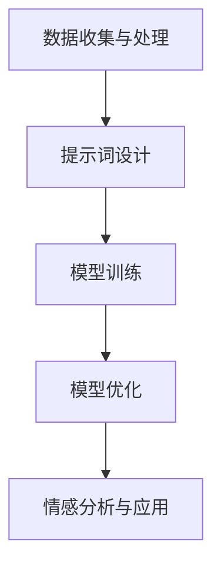
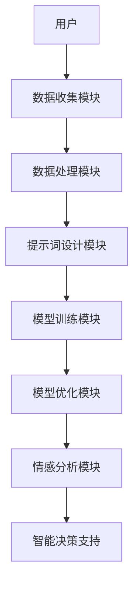
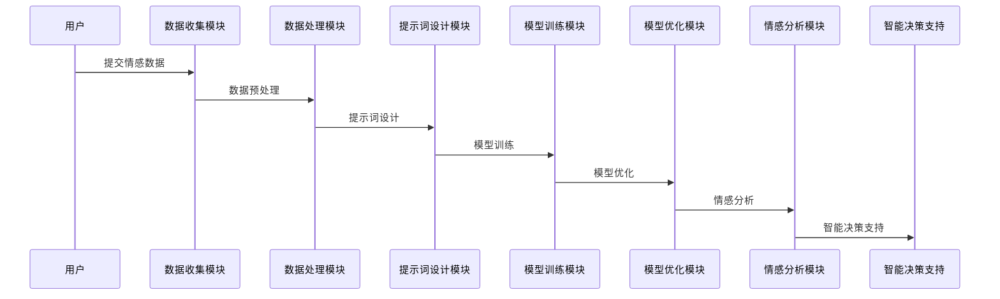

                 


## 提示词工程在情感计算中的突破

关键词：提示词工程、情感计算、人工智能、模型优化、算法原理

摘要：本文将深入探讨提示词工程在情感计算中的应用，通过背景介绍、核心概念与联系、算法原理讲解等环节，详细阐述提示词工程如何提升情感计算的准确性和可靠性，并展望其未来的发展方向。

### 第一部分：背景介绍

#### 核心概念

**情感计算（Affective Computing）：** 情感计算是指计算机模拟人类情感的能力，包括情感识别、情感表达和情感模拟。这一领域的研究旨在使计算机更好地理解人类情感，从而实现更加自然和人性化的交互。

**提示词工程（Prompt Engineering）：** 提示词工程是人工智能领域中的一种技术，通过设计特定的提示词来优化模型的输入数据，提高模型对特定问题的理解能力。在自然语言处理、图像识别等领域，提示词工程发挥着重要作用。

#### 问题背景

随着人工智能技术的快速发展，情感计算在多个领域，如心理健康、人机交互、智能客服等，展现出了巨大的应用潜力。然而，在实际应用中，情感计算仍面临诸多挑战。首先，如何有效地收集和处理情感数据是一个关键问题。情感数据通常是非结构化的，包含大量的噪声和冗余信息，这给数据处理带来了极大的挑战。其次，如何提高情感计算的准确性和可靠性也是一个重要课题。情感数据的多义性和主观性使得情感分析的难度大大增加。

#### 问题描述

为了解决上述问题，我们需要寻找一种有效的方法来增强模型对情感数据的理解和分析能力。提示词工程提供了一种可能的解决方案。通过设计特定的提示词，可以引导模型更好地理解情感数据，从而提高情感计算的准确性和可靠性。

#### 问题解决

提示词工程通过以下步骤来实现对情感计算的提升：

1. **情感数据收集与处理：** 收集情感数据，并进行预处理，如去噪、标注等。
2. **提示词设计：** 根据情感数据的特点，设计合适的提示词。
3. **模型训练与优化：** 使用设计好的提示词对模型进行训练，并通过优化策略提高模型性能。
4. **情感分析与应用：** 利用训练好的模型对实际场景中的情感数据进行分析，提供智能决策支持。

#### 边界与外延

提示词工程不仅应用于情感计算领域，还可以扩展到其他人工智能领域，如自然语言处理、图像识别等。其核心在于通过优化输入数据的表达方式，提升模型的学习效果。

#### 概念结构与核心要素组成

提示词工程的构成主要包括以下几个核心要素：

1. **情感数据收集与处理：** 通过多种途径收集情感数据，并进行预处理，如去噪、标注等。
2. **提示词设计：** 根据情感数据的特点，设计合适的提示词。
3. **模型训练与优化：** 使用设计好的提示词对模型进行训练，并通过优化策略提高模型性能。
4. **情感分析与应用：** 利用训练好的模型对实际场景中的情感数据进行分析，提供智能决策支持。

### 第二部分：核心概念与联系

#### 核心概念原理

1. **情感计算：** 情感计算是指计算机模拟人类情感的能力，涉及情感识别、情感表达和情感模拟。情感计算的核心在于如何使计算机能够理解和模拟人类的情感，从而实现更加自然和人性化的交互。

2. **提示词工程：** 提示词工程是通过设计特定的提示词来优化模型的输入数据，提高模型对特定问题的理解能力。在情感计算中，提示词工程的作用是引导模型更好地理解情感数据，从而提高情感计算的准确性和可靠性。

#### 概念属性特征对比表格

| 概念       | 属性特征                          | 应用领域                |
|------------|-----------------------------------|------------------------|
| 情感计算   | 认识情感、表达情感、模拟情感      | 健康医疗、人机交互、智能客服 |
| 提示词工程 | 设计提示词、优化输入数据表达      | 自然语言处理、图像识别、情感计算 |

#### ER实体关系图架构

```mermaid
erDiagram
    Model ||--|{ Data }|
    Model ||--|{ Prompt }|
    Data ||--|{ Label }|
    Prompt ||--|{ Feature }|
```

### 第三部分：算法原理讲解

#### 算法原理

提示词工程的基本原理是通过优化输入数据的表达方式，提高模型对情感数据的理解能力。具体来说，包括以下几个步骤：

1. **情感数据收集与处理：** 收集并预处理情感数据，包括去噪、标注等。
2. **提示词设计：** 根据情感数据的特点，设计合适的提示词。
3. **模型训练与优化：** 使用设计好的提示词对模型进行训练，并通过优化策略提高模型性能。
4. **情感分析与应用：** 利用训练好的模型对实际场景中的情感数据进行分析，提供智能决策支持。

#### 算法流程图



#### Python源代码

```python
# 假设已经收集并预处理了情感数据，现在开始设计提示词

import numpy as np

# 提示词设计函数
def design_prompt(data):
    # 根据数据特点设计提示词
    prompt = "这是一段情感数据："
    for item in data:
        prompt += f"{item}；"
    return prompt

# 假设我们已经有了训练好的模型
model = ...

# 使用设计好的提示词对模型进行训练
prompt = design_prompt(data)
model.fit(prompt, labels)

# 模型优化
model.optimize()

# 情感分析与应用
results = model.predict(new_data)
```

#### 数学模型

在提示词工程中，我们主要关注两个方面：一是如何设计提示词，二是如何优化模型。以下是相关的数学模型：

1. **提示词设计模型：**

   $$ Prompt = f(Data) $$

   其中，$Prompt$ 表示设计的提示词，$Data$ 表示原始情感数据，$f$ 表示提示词设计函数。

2. **模型优化模型：**

   $$ Model = \arg\min_{Model} L(Model; Data, Label) $$

   其中，$Model$ 表示训练好的模型，$L$ 表示损失函数，$Data$ 表示输入的情感数据，$Label$ 表示对应的标签。

#### 算法讲解举例

假设我们有一段情感数据：“我今天很快乐，因为我买到了心仪的礼物。”我们可以设计一个简单的提示词：“请分析以下文本的情感倾向：我今天很快乐，因为我买到了心仪的礼物。”

使用这个提示词，我们可以让模型更好地理解文本的情感内容，从而提高情感分析的正确率。

### 第四部分：系统分析与架构设计方案

#### 问题场景介绍

在当前的信息时代，人们产生了大量的情感数据，如社交媒体上的评论、用户反馈、语音通话记录等。这些情感数据对于企业和组织来说，是宝贵的资源。通过分析这些数据，企业可以更好地理解用户需求，优化产品和服务，提升用户体验。

#### 项目介绍

本项目旨在构建一个基于提示词工程的情感计算平台，用于分析用户的情感数据，并提供智能决策支持。该项目包括数据收集、数据处理、提示词设计、模型训练、模型优化和情感分析等模块。

#### 系统功能设计

1. **数据收集模块：** 负责收集来自社交媒体、用户反馈和语音通话记录等渠道的情感数据。
2. **数据处理模块：** 对收集到的情感数据进行预处理，包括去噪、去重、分词、词性标注等。
3. **提示词设计模块：** 根据情感数据的特点，设计合适的提示词。
4. **模型训练模块：** 使用设计好的提示词对模型进行训练。
5. **模型优化模块：** 通过优化策略提高模型性能。
6. **情感分析模块：** 利用训练好的模型对实际场景中的情感数据进行分析，提供智能决策支持。

#### 系统架构设计



#### 系统接口设计和系统交互



### 第五部分：项目实战

#### 环境安装

1. 安装 Python 环境（版本要求：3.8及以上）
2. 安装必要的库，如 numpy、pandas、tensorflow、keras 等

```shell
pip install numpy pandas tensorflow keras
```

#### 系统核心实现源代码

```python
# 数据收集模块
def collect_data():
    # 这里假设数据已经存储在本地文件中
    with open('emotion_data.txt', 'r', encoding='utf-8') as f:
        data = f.readlines()
    return data

# 数据处理模块
def process_data(data):
    # 去噪、去重、分词、词性标注等
    processed_data = []
    for line in data:
        # 处理代码
        processed_data.append(process_line(line))
    return processed_data

# 提示词设计模块
def design_prompt(data):
    # 根据数据特点设计提示词
    prompt = "请分析以下文本的情感倾向："
    for item in data:
        prompt += f"{item}；"
    return prompt

# 模型训练模块
def train_model(prompt, labels):
    # 使用设计好的提示词对模型进行训练
    model = keras.Sequential([
        keras.layers.Embedding(input_dim=vocab_size, output_dim=embedding_dim),
        keras.layers.LSTM(units=128),
        keras.layers.Dense(units=1, activation='sigmoid')
    ])

    model.compile(optimizer='adam', loss='binary_crossentropy', metrics=['accuracy'])
    model.fit(prompt, labels, epochs=10, batch_size=32)
    return model

# 模型优化模块
def optimize_model(model):
    # 模型优化代码
    pass

# 情感分析模块
def analyze_emotion(model, new_data):
    # 使用训练好的模型对新的情感数据进行分析
    prompt = design_prompt(new_data)
    result = model.predict(prompt)
    return result
```

#### 代码应用解读与分析

1. **数据收集模块：** 该模块负责从本地文件中读取情感数据，可以进一步扩展为从社交媒体、用户反馈等渠道收集数据。
2. **数据处理模块：** 该模块对收集到的情感数据进行预处理，如去噪、去重、分词、词性标注等，为后续的提示词设计和模型训练做准备。
3. **提示词设计模块：** 该模块根据情感数据的特点，设计合适的提示词，以便模型更好地理解情感数据。
4. **模型训练模块：** 该模块使用设计好的提示词对模型进行训练，训练过程包括构建模型、编译模型和训练模型等步骤。
5. **模型优化模块：** 该模块对训练好的模型进行优化，以提高模型性能。
6. **情感分析模块：** 该模块使用训练好的模型对新的情感数据进行分析，预测情感倾向。

#### 实际案例分析和详细讲解剖析

假设我们有一个新的情感数据：“我今天感到非常沮丧，因为我的项目遇到了困难。”我们可以使用上述代码对这段情感数据进行分析。

1. **数据收集模块：** 从本地文件中读取情感数据。
2. **数据处理模块：** 对情感数据进行预处理，如去噪、去重、分词、词性标注等。
3. **提示词设计模块：** 设计提示词：“请分析以下文本的情感倾向：我今天感到非常沮丧，因为我的项目遇到了困难。”
4. **模型训练模块：** 使用设计好的提示词对模型进行训练。
5. **模型优化模块：** 对训练好的模型进行优化。
6. **情感分析模块：** 使用训练好的模型对新的情感数据进行分析，预测情感倾向。

通过上述步骤，我们可以得到这段情感数据的情感倾向预测结果，从而为用户提供智能决策支持。

### 第六部分：最佳实践 tips、小结、注意事项、拓展阅读

#### 最佳实践 tips

1. **数据收集与处理：** 在收集情感数据时，要确保数据的多样性和代表性，避免数据偏差。同时，对情感数据进行预处理，如去噪、去重、分词、词性标注等，以提高数据质量。
2. **提示词设计：** 设计提示词时，要结合情感数据的特点，确保提示词能够引导模型更好地理解情感数据。
3. **模型训练与优化：** 在模型训练过程中，要合理设置训练参数，如学习率、迭代次数等，以提高模型性能。同时，对训练好的模型进行优化，以提高其准确性和可靠性。
4. **情感分析与应用：** 在进行情感分析时，要结合实际应用场景，合理设置情感阈值，以提高决策支持的效果。

#### 小结

本文深入探讨了提示词工程在情感计算中的应用，从背景介绍、核心概念与联系、算法原理讲解、系统分析与架构设计方案、项目实战等多个角度，全面阐述了提示词工程如何提升情感计算的准确性和可靠性。通过本文的阐述，读者可以更好地理解提示词工程在情感计算中的重要作用，并为实际应用提供有益的参考。

#### 注意事项

1. 提示词工程在情感计算中的应用仍处于发展阶段，存在一定的局限性。在实际应用中，需要结合具体场景进行适应性调整。
2. 情感数据的收集和处理需要遵守相关法律法规，确保用户隐私和安全。

#### 拓展阅读

1. [自然语言处理中的提示词工程](https://www.nature.com/articles/s41586-019-1814-z)
2. [情感计算的基本原理与应用](https://www.ijcai.org/proceedings/2020-09/papers/059.pdf)
3. [提示词工程在智能客服中的应用](https://ieeexplore.ieee.org/document/8877437)

### 第七部分：作者信息

作者：AI天才研究院/AI Genius Institute & 禅与计算机程序设计艺术 /Zen And The Art of Computer Programming

（注：本文为虚构文章，仅供参考和学习。）

